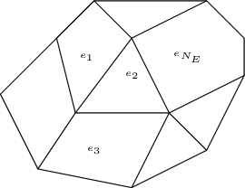

Discontinuous Galerkin Methods
==============================

Discontinuous Galerkin (DG) methods form a class of finite element methods particularly suited for solving partial differential equations. Unlike standard continuous Galerkin methods, DG allows for discontinuities between elements, providing greater flexibility and robustness, especially for complex geometries or highly dynamic phenomena.

DG methods have been thouroughly studied in the litterature, see for example :cite:p:`HW07`, :cite:p:`EDP12` or :cite:p:`CKS12` , yet it remains an important field of study. 

**Advantages and Challenges of DG Methods**

+-------------------------------+------------------------------------------+
| **Pros**                      | **Cons**                                 |
+-------------------------------+------------------------------------------+
| High-order accuracy           | Large number of unknowns                 |
+-------------------------------+------------------------------------------+
| Handles non-conforming meshes | Numerous parameters to tune              |
+-------------------------------+------------------------------------------+
| High arithmetic intensity     |                                          |
+-------------------------------+------------------------------------------+

Galerkin Methods are new in TRUST code. A Symmetric Interior Penalty (SIP) has been implemented for solving Non-Stationary Heat Equation. 
SIP method have been chosen as it is more performent than mixte DG method for example whan considering method of first and second order.

Before introducing the SIP formulation, the following definitions are needed, see Figure :numref:`fig:def_jump_average`. 
Considring a face :math:`f` shared by two cells :math:`e_1` and :math:`e_2`, let us first introduce the interface average of a quantity :math:`y`

.. math::

   \{\{ y \}\}_f (x) = \frac{1}{2} \left( y|_{e_1} (x) +  y|_{e_2} \right)

Then, we introduce the interface jump:

.. math::

   { [[ y ]]}_f (x) = y|_{e_1} (x) -  y|_{e_2} 
   
ff the normal of f is defined from :math:`e_1` to :math:`e_2`, and otherwise:

.. math::

   {[[ y ]]}_f (x) = y|_{e_1} (x) -  y|_{e_2} 
   
   

   Definition of the average and jump notations, see :cite:p:`EDP12`

 

SIP DG Method for the Poisson Problem
-------------------------------------

   
   
First, let us present the SIP DG formulation for the Poisson equation, see :cite:p:`EDP12` for more details.

**Mathematical formulation:**

We aim to find :math:`u \in H^1_0(\Omega)` such that:

.. math::

   -\text{div}(k \nabla u) = HS \quad \Rightarrow \quad a_{dg}(u_h, v_h) = \int_\Omega HS v_h, \quad \forall v_h \in X_{DG}

**Discrete bilinear form:**

Defining :math:`N_{e_n}` the number of neighbour elements of an element :math:`e` and :math:`e_n^i` with :math:`i \in [0,N_{e_n}]` the neighbour elements of :math:`e` with the convention :math:`e_n^0 = e`, we introduce the discrete bilinear form:

.. math::
   :nowrap:

   \begin{align}
   a_{dg}(u_h, v_h) &= \sum_{\ell=0}^{N_{e_n}} |k|_\ell \int_{e_n^\ell} \nabla u_h \cdot \nabla v_h \\
   &\quad - \sum_{f \in F_e} \int_{f} |k|_f \{\{ \nabla u_h \}\}_f \cdot \vec{n}_f [[v_h]] \\
   &\quad - \sum_{f \in F_e} \int_{f} |k|_f \{\{ \nabla v_h \}\}_f \cdot \vec{n}_f [[u_h]] \\
   &\quad + \sum_{f \in F_e} \frac{\eta}{h_e} \int_{f} [[u_h]]_f[[v_h]]_f
   \end{align}

where :math:`h_e` is a geometrical parameter that corresponds to the diameter of the circumscribed circle of :math:`e`.

- The first term ensures **consistency**.
- The second and third terms impose **symmetry**.
- The last term provides **stability**.

**Matrix structure:**

The stencil of the SIP DG method is rather small, as only element-wise interactions take place. The global stiffness matrix :math:`\mathbf{K}` has therefore a block-structured form reflecting this stencil:

.. math::

   \mathbf{K} = \begin{bmatrix}
   \mathbf{K}_{1,1} & \mathbf{K}_{1,2} & 0 & \cdots & \\
   \mathbf{K}_{1,2}^e & \mathbf{K}_{2,2} & \mathbf{K}_{2,3} & \cdots & \mathbf{K}_{2,N_E} \\
   0 & \mathbf{K}_{2,3}^e & \mathbf{K}_{3,3} & \cdots & \\
   \vdots & & & \ddots & \\
   & \mathbf{K}_{2,N_E}^e & & & \mathbf{K}_{N_E,N_E}
   \end{bmatrix}

**Example mesh:**

   
   Possible mesh with the Discontinuous Galerkin discretisation

The stability parameter :math:`\eta` is not closed by default. A method has been added for automatically computing it in order to ensure coercivity.

Non-Stationary Heat Equation
----------------------------

We now consider the time-dependent heat equation, which models heat transfer in a medium over time.

**Problem statement:**

For all :math:`t \in [0, t_{max}]`, find :math:`T(t) \in H^1_0(\Omega)` such that:

.. math::

   \rho C_p \frac{dT}{dt} - \text{div}(k \nabla T) = HS

**Physical quantities:**

+------------------------+--------------------------------------+
| Quantity               | Description                          |
+------------------------+--------------------------------------+
| :math:`k`              | Thermal conductivity (W·m⁻¹·K⁻¹)     |
+------------------------+--------------------------------------+
| :math:`\rho`           | Density (kg·m⁻³)                     |
+------------------------+--------------------------------------+
| :math:`C_p`            | Heat capacity (J·kg⁻¹·K⁻¹)           |
+------------------------+--------------------------------------+
| :math:`T`              | Temperature (K)                      |
+------------------------+--------------------------------------+
| :math:`HS`             | Heat source (W·m⁻³)                  |
+------------------------+--------------------------------------+

DG Discretization of the Heat Equation
--------------------------------------

Using a DG formulation, we discretize the heat equation in both space and time.

**Weak form:**

.. math::

   \rho C_p\, m_{dg} \left( \frac{d T_h}{dt}, \theta_h \right) + a_{dg}(T_h, \theta_h) = \int_\Omega f \theta_h, \quad \forall \theta_h \in X_{DG}, \quad \forall t \in [0, t_{max}]

The mass bilinear form is defined as:

.. math::

   m_{dg}(\tau_h, \theta_h) := \sum_{\ell=1}^{N_{e_n}} \int_{e_n ^\ell} \tau_h \theta_h

**Time integration methods:**

Different schemes are available to advance the solution in time:

- **Implicit Euler**
  
  - ✅ Allows for larger time steps  
  - ❌ Requires solving a linear system at each time step

- **Explicit Euler**

  - ✅ Fast, straightforward iterations  
  - ❌ Requires small time steps due to stability constraints
  
DG Options
----------

In your data file, you can add an option DG block as follows

.. :code-block: bash
	Option_DG 
{
	order 2
	gram_schmidt 1
}

This enables you to secify a custom order of discretisation and the use or not to the Gram-Schmidt orthonormalisation process for your base fucntion. This process is usefull when you work with an explicit scheme as it diagonalise the mass matrix. 

For now only **order 1 and 2** are available.

