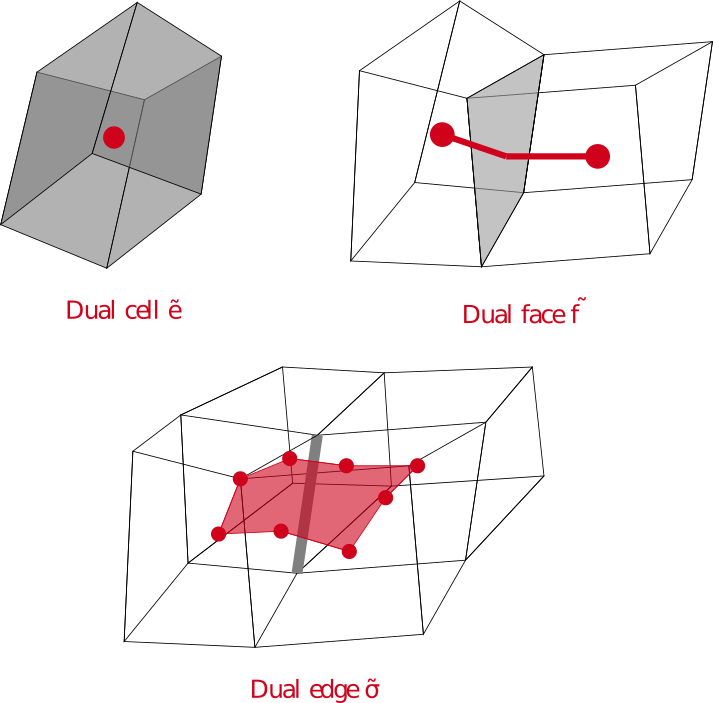
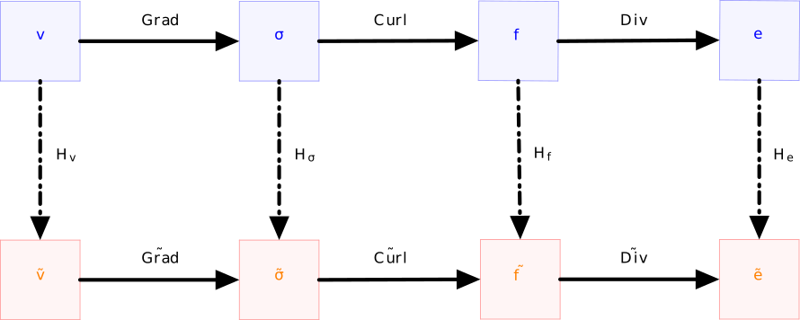
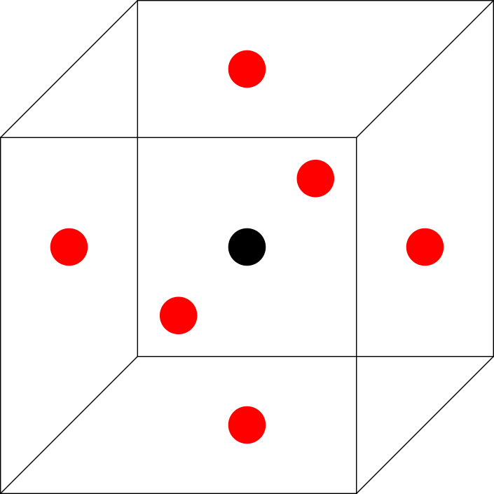
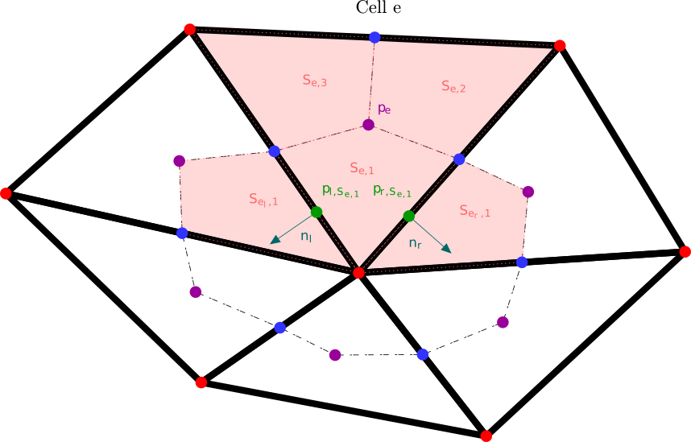

PolyMAC
=======

The first PolyMAC version introduce the vorticity :math:`\omega = \nabla \wedge u`. Then the incompressible Navier-Stokes equation can be rewritten as:

.. math::
   :label: Pold_Navier_stokes
   
   \begin{aligned}
   & \partial _t u + \nabla \cdot \left( u \otimes u \right) + \nabla p - \mu \nabla \wedge \omega = \mathcal{S} \ , \label{Pold_QDM} \\
   & \nabla \cdot u = 0 \ , \label{Pold_masse}\\
   & \omega - \nabla \wedge u = 0 \ \label{Pold_vorticity} .\end{aligned}

Dual Mesh
---------

PolyMAC introduces a rather complex dual mesh. To do so, the gravity center of each control volume :math:`cv \in \{e,f,\sigma \}`, called :math:`x_{cv}` has to be introduce. Then we introduce (see Figure :ref:`dual_mesh_polymacold`):

-  | The dual cell :math:`\tilde{e}` is located at the center of gravity of the cell : :math:`x_{e}`.

-  | The dual face :math:`\tilde{f}` is the line that links the gravity center of the face :math:`x_f` to the gravity center of the neighbour cells of the face.

-  The dual edge :math:`\tilde{\sigma}` is the surface that links the gravity center of all of the neighbouring cells :math:`x_{e}`, the gravity center of all of the neighbouring faces :math:`x_{f}` and the gravity center of the edge :math:`x_{\sigma}`.

.. _dual_mesh_polymacold:   

	
	Figure A: Dual mesh of PolyMAC

Location of the unknowns
------------------------

In PolyMAC, unknowns are discretised according to their "physical" properties, see **[B14]**. A circulation is discretised over an edge, a flux over a face, a potential over the dual cell. Therefore we have:

-  The pressure :math:`p` is stored at the dual cell:
   :math:`[p]_{\tilde{e}} = p(x_{e},t)`.

-  The normal component of the velocity with respect to a face :math:`f`
   is stored as: :math:`[v]_{f} = \frac{1}{|f|} \int u \cdot n dS`.

-  The tangential vorticity with respect to an edge :math:`\sigma` is
   stored as:
   :math:`[\omega]_{\sigma} = \frac{1}{|\sigma|} \int \omega \cdot \tau dl`.

Exact discrete operators
------------------------

-  The gradient of the pressure estimate on a dual face
   :math:`\tilde{f}` writes:

   .. math:: 
      :label: Pold_G_p
      
      [\nabla p]_{\tilde{f}} = \frac{p(e_{k_{up}},t) - p(x_{e_{down}},t)}{|\tilde{f}|} 

-  The divergence at the cell e is deduced by the Green-Ostrogradski theorem:

   .. math:: 
      :label: Pold_D_u
      
      [\nabla \cdot u]_e = \frac{|f|}{|e|} \sum _{F_e} [u]_f 

-  Eventually, using the Green-Stokes theorem, one gets:

   .. math::
      :label: Pold_R_u
      
      [\nabla \wedge {u}]_{\tilde{\sigma}} = \frac{|\tilde{\sigma}|}{|\tilde{f}|} \sum _{\tilde{F}_{a}} [u]_{\tilde{f}} 
      
      
   .. math::
      :label: Pold_R_o
      
      [\nabla \wedge \omega]_{f} = \frac{|f|}{|\sigma|} \sum _{\Sigma_f} [\omega]_{\sigma}
      
      
Interpolation
-------------

According to **[P00]**, on can write the following first order interpolations:

.. math:: 
   :label: Pold_I_u
   
   [u]_e \approx \frac{|f|}{|e|} \sum_{F_e}[v]_f\left(x_e-x_f\right), 

.. math:: 
   :label: Pold_I_o
   
   [\omega]_e \approx \frac{|\sigma|}{|e|} \sum_{F_e}[\omega]_{\sigma}\left(x_e-x_{\sigma} \right). 

Hodge Operator
--------------

We then choose the following definition for the Hodge operators, that project unknowns from the primal to the dual mesh:

.. math::
   :label: Pold_H_u
   
    [u] _{\tilde{f}} = |\tilde{f}| \left( [u]_{e_{up}} \left( x_f - x_{e_{up}} \right) + [u]_{e_{down}} \left( x_f - x_{e_{down}}\right) \right) 

.. math:: 
   :label: Pold_H_o
   
   [\omega]_{\tilde{\sigma}} = |\tilde{\sigma}| \left( [\omega]_{e_{up}} \left( x_{\sigma} - x_{e_{up}} \right) + [\omega]_{e_{down}} \left( x_{\sigma} - x_{e_{down}}\right) \right)  

Other defintions of Hodge operators exist in the literature, see **[B14]**.
  
Projections between control volumes when using CDO
--------------------------------------------------

Figure :ref:`_projection_CDO` summerized the different projection between control volumes in CDO. It is usefull to keep it in mind when one want to discretised an equation on a specific control volume.

.. _projection_CDO:

	
	Figure B: Projections between control volumes in CDO
	

Incompressible Navier-Stokes
----------------------------

We discretised the incompressible Navier-Stokes equation as follow:

-  The momentum equation :eq:`Pold_QDM` is discretised at the dual faces :

   -  Use the Hodge :eq:`Pold_H_u` operator to project the time derivative term to the dual face.

   -  Project the velocity at the cell using :eq:`Pold_I_u`.

   -  Discretise the convective term:

      .. math::

         \begin{aligned} 
            {[\nabla \cdot (u \otimes u)]} _e &= \frac{1}{|e|} \sum _{f \in F_e} |f| [{u} \otimes {u}]_f \\
                                                                                 &\simeq \frac{1}{|e|} \sum _{f \in F_e} |f| [u]_f \left( \beta \left( \gamma [u]_{e_{up}} + \left(1-\gamma \right) [u]_{e_{down}} \right) \right. \\ & \quad \left. + (1-\beta) \left( \frac{[u]_{e_{up}} +[u]_{e_{down}}}{2} \right) \right) , \end{aligned}

      with :math:`\beta \in [0,1]` and :math:`\gamma \in \{0,1\}` such that :math:`\gamma =1` if :math:`[u_f]\geq 0` and :math:`0` otherwise.

   -  Project convective terms to the face:

      .. math:: [\nabla \cdot (u\otimes u)]_{\tilde{f}} = \lambda_{e,f} [\nabla \cdot (u \otimes u)]_{e} + \lambda_{e',f} [\nabla \cdot (u \otimes u)]_{e'}

      with the penalty coefficient :math:`\lambda_{e,f} = \frac{ |\vec{x}_{e' \rightarrow f}|}{|\vec{x}_{e' \rightarrow f}| + |\vec{x}_{e \rightarrow f}|}` and :math:`e'` the neighbouring cell of :math:`e` sharing the face :math:`f`.

   -  The diffusion term :math:`[\mu \nabla \wedge \omega]_{\tilde{f}}` is obtain by using the Hodge operator :eq:`Pold_H_o` on the discrete curl :eq:`Pold_R_o`.

   -  The pressure gradient is constructed with :eq:`Pold_G_p`.

-  The mass equation is discretised at the cell using :eq:`PoldD_u`.

-  The vorticity equation is discretised at the dual edges :math:`\tilde{\sigma}`:

   -  The curl of the velocity is obtain using :eq:`Pold_R_u`.

   -  The vorticity is projected at the dual edge using :eq:`Pold_H_o`.

PolyMAC_P0
=========

Unlike PolyMAC, PolyMACP0 does not introduce the vorticity. Moreover, no
complex dual mesh is explicitly needed. The location of the unknowns is
described in :ref:`location_unknowns_p0`.

.. _location_unknowns_p0:

	
	Figure C : Location of the unknowns when using PolyMAC_P0

PolyMAC_P0 is based on Multi Point Flux Approximation (MPFA) method.

MPFA methods
------------

Three MPFA methods are used in practice in PolyMAC_P0 for computing gradient:

-  The MPFA-O method presented in **[A02]**, **[AM08]**, **[D14]**

-  The MPFA-O(:math:`\eta`) method presented in **[ER98]**

-  The MPFA-symm method presented in **[lP05a]**, **[lP05b]**, **[lP17]**

The choice of the method is based on a coercivity condition. Let’s briefly introduce the core ideas of gradient approximation using MPFA methods. First, a dual mesh is constructed. It can be seen on Figure :ref:`scheme_mpfa` in the case of a triangular mesh. The primal mesh vertexes are represented by in :ref:`scheme_mpfa`. The procedure to build the dual mesh is:

-  Link each cell’s (:math:`e`) gravity center ( in :ref:`scheme_mpfa`) to the gravity center of each cell’s face :math:`f \subset e` ( in :ref:`scheme_mpfa`). Doing so, the face of the mesh are cut into two sub-faces called :math:`\hat{f}_1` and :math:`\hat{f}_2`. Each cell can then be subdivided into :math:`N_i` quadrilaterals, called :math:`(S_{e,i})_{i\in\{ 1,\dots, N_i \} }` in :ref:`scheme_mpfa`.

-  Introduce for each sub-face :math:`\hat{f} \subset f`, an auxiliary quantity ( in :ref:`scheme_mpfa`). For the MPFA-symmetric method, those auxiliary quantities are set at one third and two third of the face :math:`f`. For the MPFA-O method, they are put at the center of the face, however, the value of the auxiliary unknowns at the center is not continuous. The MPFA-O(:math:`\eta`) method can be seen as in between the previous two, as it try to compute the optimum location of the auxiliary unknown.

.. _scheme_mpfa:

	
	Figure D : Construction of a gradient using MPFA method

On :math:`S_1` in :ref:`scheme_mpfa` for example, the gradient of a potential p, :math:`G_{S_{e,i}}([p]_e)` is computed as:

.. math:: G_{S_{e,i}}([p]_e) = \frac{1}{|S_{e,i}|} ( (p_{S_{e,1},1} -p_e)  \vec{n_1} + (p_{S_{e,1},2} -p_e)  \vec{n_2} ),

where :math:`\vec{n_1}` and :math:`\vec{n_2}` are the outward unit normal vectors of the respective sub-faces :math:`\tilde{f}\subset f` where the auxiliary elements :math:`p_{S_{e,1}}` and :math:`p_{S_{e,2}}` are located. Thus, :math:`G^{\text{MPFA}}` writes:

.. math:: 
   :label: P0_Gmpfa
   
   G^{\text{MPFA}}: [p]_e \mapsto G^{\text{MPFA}}([p]_e) \ , \quad \forall e \in E \ , \quad i \in S_e \ : \quad G^{\text{MPFA}} _{|S_{e,i}} =  G_{S_{e,i}}([p]_e).

A core assumption of the MPFA method is to suppose that :math:`G^{\text{MPFA}}([p]_e)` is constant on each :math:`S_{e,i}`. When enforcing the continuity across the sub-faces that are linked by a vertex of the primal mesh, auxiliary variables can be substitute by cells unknowns.

Incompressible Navier Stokes
----------------------------

The incompressible Navier-Stokes equation reads:

.. math::
   :label: P0_Navier_Stokes
   
   \begin{aligned}
   & \partial_{t} \left( u \right) + \nabla \cdot \left( u \otimes u \right) + \nabla p - \mu \Delta u = f \ , \label{P0_QDM} \\
   & \nabla \cdot u = 0 \ \label{P0_masse} .\end{aligned}

The mass equation :eq:`P0_masse` is discretised at the cell using the Green-Ostrogradski theorem:

.. math:: 
   |e|[\nabla \cdot u]_e = |f| \sum _{F_e} [u]_f

The momentum equation :eq:`P0_QDM` is discretised at the face:

-  For the convective term:

   -  Approximate the value of the velocity at the cell:

      .. math:: [u]_e = \frac{1}{|e|} \sum _{f \in F_e} |f| [u]_f x_{e \rightarrow f}.

   -  Discretise the convective terms at the cell centers:

      .. math::

         \begin{aligned}
         {[\nabla \cdot (  u\otimes u)]} _e &= \frac{1}{|e|} \sum _{f \in F_e} |f| [{u} \otimes {u}]_f \\
                                                                                 &\simeq \frac{1}{|e|} \sum _{f \in F_e} |f| [u]_f \left( \beta \left( \gamma [u]_{e_{up}} + \left(1-\gamma \right) [u]_{e_{down}} \right) \right. \\ & \quad \left. + (1-\beta) \left( \frac{[u]_{e_{up}} +[u]_{e_{down}}}{2} \right) \right),\end{aligned}

      with :math:`\beta \in [0,1]` and :math:`\gamma \in \{0,1\}` such that :math:`\gamma =1` if :math:`[u_f]\geq 0` and :math:`0` otherwise.

-  The convective terms:

   -  Interpolate convective terms to the face:

      .. math:: [\nabla \cdot (u\otimes u)]_{f} = \lambda_{e,f} [\nabla \cdot (u \otimes u)]_{e} + \lambda_{e',f} [\nabla \cdot (u \otimes u)]_{e'}

      with the penalty coefficient :math:`\lambda_{e,f} = \frac{ |\vec{x}_{e' \rightarrow f}|}{|\vec{x}_{e' \rightarrow f}| + |\vec{x}_{e \rightarrow f}|}`, with :math:`e'` the neighbouring cell of :math:`e` sharing the face :math:`f`.

-  The gradient of p is computed using an MPFA scheme :eq:`P0_Gmpfa`.

-  The diffusive term is rewritten as :

   .. math:: \Delta u = \nabla \cdot ( \nabla u + \left(\nabla u)^{\intercal} \right) )

-  Then a second order interpolation is used to compute the velocity at the cell.

-  Afterwards, we compute:

   .. math::

      [\nabla \cdot ( \mu _e \left((\nabla u) + (\nabla u)^{\intercal}\right)) ]_e = \sum_{f} |f|  (G^{\text{MPFA}} ([u]_e) \\ + \left(G^{\text{MPFA}} ([u]_e))\right) ^{\intercal} \cdot \vec{n}_f.

-  Eventually, we interpolate the diffusion term at the face in the same fashion as for the convective term. The main difference is that a second order interpolator has to be used when projecting the velocity to the center.

Some details regarding the discretisation of a two-phase flow model of the ishii familly **[I75]** are given in **[GG22]**.

PolyMAC_P0_P1_NC
================

PolyMACP0P1NC is based on a Hybrid Finite Volmue (HFV) approach, such as the one presented in **[EGH07]** and **[EGH10]**. PolyMAC_P0_P1_NC is mathematically close to the first PolyMAC, as HFV and CDO method are equivalent, see **[DEG10]**.
