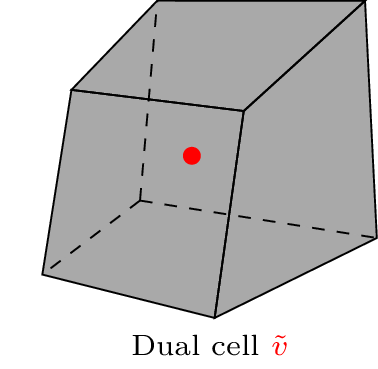
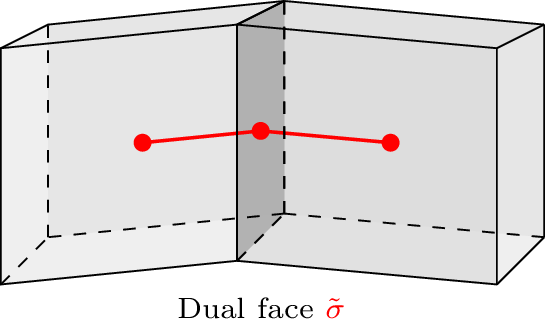
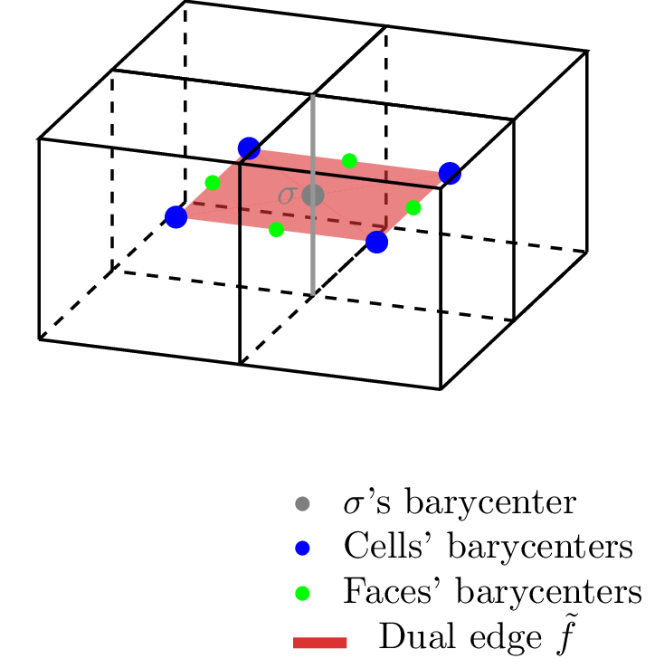
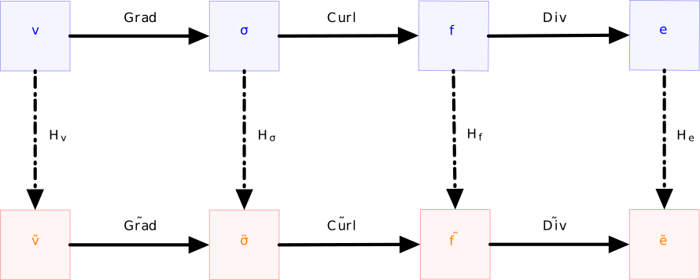
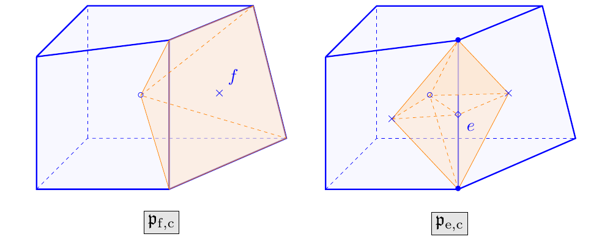

PolyMAC_CDO
===========

PolyMAC discretization is based on the development of Compatible
Discrete Operators (CDO) schemes. This discretization should make it
possible to apply finite volume schemes to non-conforming meshes, with
the sole constraint of arranging star-shaped meshes.

Dual Mesh
---------

PolyMAC introduces a rather complex dual mesh. To do so, the gravity
center of each control volume
:math:`cv \in \{ E, F, \Sigma, V \}`
corresponding respectively to the cells, the faces, the egdes and the
points localization, called :math:`x_{cv}` has to be introduce. Then we
introduce:

-  | The dual cell :math:`\widetilde{v}` is located at the
     center of gravity of the cell : :math:`x_{c}`, see Figure :numref:`fig:dual_cell_cdo`.

-  | The dual face :math:`\widetilde{\sigma}` is the line that
     links the gravity center of the face :math:`x_f` to the gravity
     center of the neighbour cells of the face, see Figure :numref:`fig:dual_face_cdo`.

-  The dual edge :math:`\widetilde{f}` is the surface that
   links the gravity center of all of the neighbouring cells
   :math:`x_{e}`, the gravity center of all of the neighbouring faces
   :math:`x_{f}` and the gravity center of the edge :math:`x_{\sigma}`, see Figure :numref:`fig:dual_edge_cdo`.

.. _fig:dual_cell_cdo:

   
   Dual cell when using PolyMAC_CDO
  

  
.. _fig:dual_face_cdo:

  
   Dual face when using PolyMAC_CDO

.. _fig:dual_edge_cdo:

   
   Dual edge when using PolyMAC_CDO
   
   
Location of the unknowns
~~~~~~~~~~~~~~~~~~~~~~~~

In PolyMAC, unknowns are discretised according to their "physical"
properties. A circulation is discretised over an edge, a flux over a
face, a potential over the dual cell. Therefore we have:

-  The pressure :math:`p` is stored at the dual cell:
   :math:`p_{\tilde{v}} = p(x_{ev},t)`.

-  The normal component of the velocity with respect to a face :math:`f`
   is stored as: :math:`v_{f} = \frac{1}{|f|} \int u \cdot n dS`.

-  The tangential vorticity with respect to an edge :math:`\sigma` is stored
   as: :math:`\omega_{\sigma} = \frac{1}{|\sigma|} \int \omega \cdot \tau dl`.

CDO scheme
----------

The CDO scheme is based on a set of exact operators that allow you to
switch from one location to another on the primal and dual mesh.

Figure :numref:`fig:projectioncdo` summarized the different projection
between control volumes in CDO. It is useful to keep it in mind when one
want to discretised an equation on a specific control volume.

.. _fig:projectioncdo:

   Paths between primal and dual mesh entities and corresponding operators.

Operators can be classified into 2 types:

-  The exact operators, such as the gradient or divergence operator,
   which correspond to linear operators used to move from one
   discretization to another.

-  The approximated operators that introduce approximation error. In
   particular, Hodge operators are used to establish discrete closure
   relation linking primal and dual meshes. Other interpolation
   operators can also be used especially for the convection operator.

Exact discrete operators
~~~~~~~~~~~~~~~~~~~~~~~~

Discrete differential operators relies the entities and allow to switch
from one localization to another

Exact discrete operator GRAD, DIV and CURL are defined and have their
counterpart :math:`\widetilde{\text{GRAD}}`,
:math:`\widetilde{\text{DIV}}` and :math:`\widetilde{\text{CURL}}` on
the dual mesh

Discrete gradient
^^^^^^^^^^^^^^^^^

.. math:: \text{GRAD}:{V} \rightarrow \mathcal{\Sigma}, \hspace{1cm} \forall \sigma \in \Sigma, \forall \mathbf{p} \in V, \hspace{1cm} \text{GRAD}(\mathbf{p})|_{\tilde{\sigma}} = \sum_{\tilde{v} \in V_{\sigma}} \iota_{v,\sigma}p_{v},

where :math:`V_{\sigma} := \{v \in V | v \subset \partial \sigma \}` and
:math:`\iota_{v,\sigma} = +1` if :math:`\tau_{\sigma}` points towards :math:`v`,
:math:`\iota_{v,\sigma} = -1` otherwise

.. math:: \widetilde{\text{GRAD}}:\widetilde{{V}} \rightarrow \widetilde{{\Sigma}}, \hspace{1cm} \forall \tilde{\sigma} \in \widetilde{\mathcal{\Sigma}}, \forall \mathbf{p} \in \widetilde{\mathcal{V}}, \hspace{1cm} \widetilde{\text{GRAD}}(\mathbf{p})|_{\tilde{\sigma}} = \sum_{\tilde{v} \in \widetilde{V}_{\tilde{\sigma}}} \iota_{\tilde{v},\tilde{\sigma}}p_{\tilde{v}}

where
:math:`\widetilde{V}_{\tilde{\sigma}} := \{\tilde{v} \in \widetilde{V} | \tilde{v} \subset \partial \tilde{\sigma} \}`
and :math:`\iota_{\tilde{v},\tilde{\sigma}} = +1` if :math:`\tau_{\tilde{\sigma}}`
points towards :math:`\tilde{v}`,
:math:`\iota_{\tilde{v},\tilde{\sigma}} = -1` otherwise

Discrete divergence
^^^^^^^^^^^^^^^^^^^

.. math:: \text{DIV}:\mathcal{F} \rightarrow \mathcal{C} \hspace{1cm} \forall c \in C, \forall \phi \in \mathcal{F}, \hspace{1cm}  \text{DIV}(\phi)|_{c} = \sum_{f \in F_{c}} \iota_{f,c}\phi_{f}

where :math:`F_{c} := \{f \in F | f \subset \partial c \}` and
:math:`\iota_{f,c} = +1` if :math:`\nu_{f}` points outwards :math:`c`,
:math:`\iota_{f,c} = -1` otherwise

.. math:: \widetilde{\text{DIV}}:\widetilde{\mathcal{F}} \rightarrow \widetilde{\mathcal{C}} \hspace{1cm} \forall \tilde{c} \in \widetilde{C}, \forall \phi \in \widetilde{\mathcal{F}}, \hspace{1cm}  \widetilde{\text{DIV}}(\phi)|_{\tilde{c}} = \sum_{\tilde{f} \in \widetilde{F}_{\tilde{c}}} \iota_{\tilde{f},\tilde{c}}\phi_{\tilde{f}}

where
:math:`\widetilde{F}_{\tilde{c}} := \{\tilde{f} \in \widetilde{F} | \tilde{f} \subset \partial \tilde{c} \}`
and :math:`\iota_{\tilde{f},\tilde{c}} = +1` if :math:`\nu_{\tilde{f}}`
points outwards :math:`\tilde{c}`,
:math:`\iota_{\tilde{f},\tilde{c}} = -1` otherwise

Discrete curl
^^^^^^^^^^^^^

.. math:: \text{CURL}:\mathcal{E} \rightarrow \mathcal{F} \hspace{1cm} \forall f \in F, \forall \mathbf{u} \in \mathcal{E}, \hspace{1cm}  \text{CURL}(\mathbf{u})|_{f} = \sum_{e \in E_{f}} \iota_{e,f}\mathbf{u}_{e}

where :math:`E_{f} := \{e \in E | f \subset \partial f \}` and
:math:`\iota_{e,f} = +1` if :math:`\tau_{e}` shares the same orientation
as the one induced by :math:`\nu_{f}`, :math:`\iota_{e,f} = -1`
otherwise

.. math:: \widetilde{\text{CURL}}:\widetilde{\mathcal{E}} \rightarrow \widetilde{\mathcal{F}} \hspace{1cm} \forall \tilde{f} \in \widetilde{F}, \forall \mathbf{u} \in \widetilde{\mathcal{E}}, \hspace{1cm}  \widetilde{\text{CURL}}(\mathbf{u})|_{\tilde{f}} = \sum_{\tilde{e} \in \widetilde{E}_{\tilde{f}}} \iota_{\tilde{e},\tilde{f}}\mathbf{u}_{\tilde{e}}

where
:math:`\widetilde{E}_{\tilde{f}} := \{\tilde{e} \in \widetilde{E} | \tilde{f} \subset \partial \tilde{f} \}`
and :math:`\iota_{\tilde{e},\tilde{f}} = +1` if :math:`\tau_{\tilde{e}}`
shares the same orientation as the one induced by
:math:`\nu_{\tilde{f}}`, :math:`\iota_{\tilde{e},\tilde{f}} = -1`
otherwise

Hodge operators
~~~~~~~~~~~~~~~

Closure relations between the localization in the primal cell and the
dual cell are formulated using the construction of non exact global
discrete operators called Hodge operators
:math:`H_{\alpha^{-1}}^{\widetilde{\mathcal{X}}\mathcal{Y}}`. They are
express using geometric quantities related to the primal and dual mesh
entities and some material properties such as diffusivity.

Local Hodge operator must be symmetric, locally stable and
:math:`\mathbb{P}_0`-consistency

Hodge operators are not unique, the strategy in the CDO scheme consists
of defining them using a reconstruction operator
:math:`L_{\mathcal{X}_{c}}`

.. math:: L_{\mathcal{X}_c}(\mathbf{a})(\overline{x}) := \sum_{x \in X_c} \mathbf{a}_X l_{x,c}(\overline{x}) \quad \forall \mathbf{a} \in \mathcal{X}_c, \forall \overline{x} \in c

Orthogonal decomposition of the reconstruction operator into consistent
and stabilization parts

.. math:: L_{\mathcal{X}_c} := C_{\mathcal{X}_c} + S_{\mathcal{X}_c}

:math:`C_{\mathcal{X}_c} R_{\mathcal{X}_c} (K) = K` and
:math:`S_{\mathcal{X}_c} R_{\mathcal{X}_c} (K) = 0` for constant fields

then the local Hodge operator can be generically defined by:

.. math:: \left.H_{\alpha}^{\mathcal{X}_c\widetilde{\mathcal{Y}}_c}\right|_{x',\tilde{y}(x)} := \int_c l_{x,c}(\overline{x})\alpha l_{x',c}(\overline{x}) \quad \forall x,x' \in X_c

We choose here according to description in Bonelle thesis
:cite:p:`Bonelle2014` (section 7.3.1) and in Codecasa et al.
:cite:p:`CST10` the Piecewise constant non-conforming
reconstruction.

.. math:: L_{\mathcal{X}_c} := C_{\mathcal{X}_c} + \hat{S}_{\mathcal{X}_c}((\mathbb{I}_{\mathcal{X}_c} - R_{\mathcal{X}_c} C_{\mathcal{X}_c}))

with
:math:`C_{\mathcal{X}_c} : \mathcal{X}_c \rightarrow \mathbb{P}_0(c)`
and
:math:`\hat{S}_{\mathcal{X}_c} : \mathcal{X}_c \rightarrow \mathbb{P}_0(p_{x,c})`
with :math:`p_{x,c}` the partition of the cell associated to the mesh
entities :math:`x`

Then the local reconstruction of the circulation
:math:`\{\underline{l}_{e,c}\}_{e\in E_c}` on the piecewise partition
volume :math:`p_{e',c}, \ e' \in E_{c}` corresponding to the subvolume
of the cell attached to the edge :math:`e'`, the center of the cell and
the center of the adjacent face (Figure :numref:`fig:partition_cdo`). It
written:

.. math:: \underline{l}_{e,c}|_{p_{e',c}} = \frac{\beta}{|p_{e,c}|} \underline{\tilde{f}}_c(e) \delta_{e,e'} + \left(\mathbb{I} - \beta \frac{\underline{\tilde{f}}_c(e') \otimes \underline{e'}}{|p_{e',c}|}\right)\frac{\underline{\tilde{f}}(e)}{|c|}

Then the local reconstruction of the flux :math:`\{\underline{l}_{f,c}\}_{f\in F_c}` on the piecewise partition
volume :math:`p_{f',c}, \ f' \in F_{c}` corresponding to the subvolume
of the cell attached to the face :math:`f'`, and the center of the cell
(Figure :numref:`fig:partition_cdo`). It written:

.. math:: \underline{l}_{f,c}|_{p_{f',c}} = \frac{\beta}{|p_{f,c}|} \underline{\tilde{e}}_c(f) \delta_{f,f'} + \left(\mathbb{I} - \beta \frac{\underline{\tilde{e}}_c(f') \otimes \underline{f'}}{|p_{f',c}|}\right)\frac{\underline{\tilde{e}}(f)}{|c|}

The choice for the :math:`\beta` parameter must be
:math:`\beta = \frac{1}{\text{dim}}` to yield the DGA reconstruction
while the choice :math:`\beta = \frac{1}{\sqrt{dim}}` corresponds to the
choice made in SUSHI schemes

.. _fig:partition_cdo:

   Partitioning of the cell into elementary sub-volumes attached to face :math:`p_{f,c}` (left) and to edge :math:`p_{e,c}` (right)

Additional reconstruction operator
^^^^^^^^^^^^^^^^^^^^^^^^^^^^^^^^^^

A first-order reconstruction mapping operator
:math:`\mathbb{R} : \mathcal{F} \rightarrow \mathcal{V}` will be used in
the convection operator for the Navier-Stokes equations
(see :ref:`sec:NS_equation`) to interpolate a vector :math:`\phi`
expressed along the normal of the faces to the center of the cell using
the formula (1) from :cite:p:`BNM14`.

.. math::
  :label: eq:reconstruction_operator
    
  \phi_e = \frac{1}{|e|}\sum_{f \in e}|f|\phi_f(\vec{x}_f - \vec{x}_e)

Elliptic equations
~~~~~~~~~~~~~~~~~~

We first consider here the resolution of a diffusion equation using the
CDO schemes

.. math:: -\underline{\nabla} \cdot (\underline{\underline{\kappa}} \ \underline{\nabla} ) = s

we introduce the gradient
:math:`\overline{g} = \underline{\text{grad}} \ p` and the flux
:math:`\overline{\phi} = - \underline{\underline{\kappa}} \ g`

using cell-based schemes we obtain the discrete system of equations :

.. math::

   \begin{cases}
           \kappa^{-1} \phi + \nabla g = 0 \\
           \nabla \cdot \phi = s ,
       \end{cases} \hspace{1cm}
       \begin{cases}
           H_{\kappa^{-1}}^{\widetilde{\mathcal{F}}\mathcal{E}}(\phi) + \widetilde{GRAD} (p) = 0 \\
           DIV ( \phi )  = R_{\mathcal{C}}(s)
       \end{cases}

with matricial expression

.. math::

   \begin{pmatrix}
       H_{\kappa^{-1}}^{\widetilde{\mathcal{F}}\mathcal{E}} & \widetilde{\mathbb{G}} \\
       \mathbb{D} & 0
   \end{pmatrix}
       \begin{bmatrix}
           \phi \\
           p
       \end{bmatrix}
       = \begin{bmatrix}
           0 \\
           R_{\mathcal{C}}(s)
       \end{bmatrix}

with :math:`\widetilde{\mathbb{G}} = - \mathbb{D}^{T}`

Stokes equations
~~~~~~~~~~~~~~~~

The Stokes equations model incompressible flows of viscous fluids where
the advective inertial forces are negligible with respect to the viscous
forces.

.. math::

   \begin{cases}
   -\underline{\Delta} \underline{u} + \underline{\nabla} p &= \underline{f} \\
    \underline{\nabla} \cdot \underline{u} &= 0
   \end{cases}

where :math:`p` is the pressure, :math:`\underline{u}` the velocity and
:math:`\underline{f}` the external load.

Bonelle thesis :cite:p:`Bonelle2014` chooses to formulated the
Stokes equations with the :math:`\underline{\text{curl}}` operator using
the identity
:math:`-\underline{\Delta} \underline{u} = \underline{\nabla} \times \underline{\nabla} \times \underline{u} - \underline{\nabla} ( \nabla \cdot \underline{u})`

.. math::

   \begin{cases}
           \underline{\nabla} \times \underline{\nabla} \times \underline{u} + \underline{\nabla} p  &= \underline{f} \\
           \underline{\nabla} \cdot \underline{u} &= 0
       \end{cases}

using the vorticity
:math:`\underline{\omega} := \underline{\text{curl}} \ \underline{u}`

.. math::

   \begin{cases}
           -\underline{\omega} + \underline{\nabla} \times \underline{u} &= \underline{0}, \\
           \underline{\nabla} \times \underline{\omega} + \underline{\nabla} p &= \underline{f} \\
           \underline{\nabla} \cdot \underline{u} &= 0
       \end{cases}

Introducing the mass density :math:`\rho` and the viscosity :math:`\mu`
leads to:

.. math::

   \begin{cases}
           -\mu^{-1}\underline{\omega}^* + \underline{\nabla} \times (\rho^{-1}\underline{\phi}) &= \underline{0}, \\
           \rho^{-1}\underline{\nabla} \times \underline{\omega}^* + \underline{\nabla} p^* &= \underline{f}^* \\
           \underline{\nabla} \cdot \underline{\phi} &= 0
       \end{cases}

with :math:`\underline{\phi} = \rho \underline{u}`,
:math:`\underline{\omega}^*=\mu \underline{\omega}`,
:math:`p^* = \rho^{-1}p` and
:math:`\underline{f}^* = \rho^{-1}\underline{f}`

We use here two discrete Hodge operators:

.. math:: H_{\rho^{-1}}^{\mathcal{F}\widetilde{\mathcal{E}}} : \mathcal{F} \rightarrow \widetilde{\mathcal{E}} \hspace{0.5cm} \text{and} \hspace{0.5cm} H_{\mu^{-1}}^{\mathcal{E}\widetilde{\mathcal{F}}} : \mathcal{E} \rightarrow \widetilde{\mathcal{F}}

Then we have the discrete velocity located at dual edges and the
discrete vorticity at dual faces.

.. math:: \mathbf{u} = H_{\rho^{-1}}^{\mathcal{F}\widetilde{\mathcal{E}}}(\phi) \hspace{0.5cm} \text{and} \hspace{0.5cm} \mathbf{\omega} :=  H_{\mu^{-1}}^{\mathcal{E}\widetilde{\mathcal{F}}} (\mathbf{\omega}^*)

we also have the following relation

.. math:: \mathbf{\omega} = \widetilde{CURL}(\mathbf{u})

The cell-based pressure scheme is:

Find
:math:`(\mathbf{p}^*,\phi,\mathbf{\omega}^*) \in \widetilde{\mathcal{V}} \times \mathcal{F} \times \mathcal{E}`

.. math::

   \begin{cases}
   -H_{\mu^{-1}}^{\mathcal{E}\widetilde{\mathcal{F}}} (\mathbf{\omega}^*) + \widetilde{CURL} \cdot H_{\rho^{-1}}^{\mathcal{F}\widetilde{\mathcal{E}}}(\phi) &= 0_{\widetilde{\mathcal{F}}}, \\
   H_{\rho^{-1}}^{\mathcal{F}\widetilde{\mathcal{E}}} \cdot CURL(\mathbf{\omega}^*) + \widetilde{GRAD}(\mathbf{p}^*) &= S(\rho,\underline{f}^*), \\
   -DIV(\phi) &= 0_{\mathcal{C}}. 
   \end{cases}

with matricial expression

.. math::

   \begin{pmatrix}
       -H_{\mu^{-1}}^{\mathcal{E}\widetilde{\mathcal{F}}} & \widetilde{\mathbb{C}} \cdot H_{\rho^{-1}}^{\mathcal{F}\widetilde{\mathcal{E}}} & 0 \\
        H_{\rho^{-1}}^{\mathcal{F}\widetilde{\mathcal{E}}} \cdot \mathbb{C} & 0 & \widetilde{\mathbb{G}} \\
        0 & - \mathbb{D}& 0
   \end{pmatrix}
       \begin{bmatrix}
           \mathbf{\omega}^* \\
           \phi \\
           \mathbf{p}^*
       \end{bmatrix}
       = \begin{bmatrix}
           0 \\
           S(\rho,\underline{f}^*) \\
           0
       \end{bmatrix}

with :math:`\widetilde{\mathbb{G}} = - \mathbb{D}^{T}` and
:math:`\widetilde{\mathbb{C}} \cdot H_{\rho^{-1}}^{\mathcal{F}\widetilde{\mathcal{E}}} = H_{\rho^{-1}}^{\mathcal{F}\widetilde{\mathcal{E}}} \cdot \mathbb{C}`

.. _sec:NS_equation:

Incompressible Navier-Stokes
~~~~~~~~~~~~~~~~~~~~~~~~~~~~

.. math::

   \begin{cases}
   \partial_t \underline{u} + \nabla \cdot (  u\otimes u) + \nu \underline{\Delta}(\underline{u})  + \underline{\nabla} p &= \underline{f} \\
   \underline{\nabla} \cdot \underline{u} &= 0
   \end{cases}

where :math:`p` is the pressure, :math:`\underline{u}` the velocity and
:math:`\underline{f}` the external load.

Using the identity
:math:`-\nu \underline{\Delta} = \nu \underline{\nabla} \times \underline{\nabla} \times \underline{u} - \underline{\nabla} ( \nabla \cdot \underline{u})`
we obtain

.. math::

   \begin{cases}
           \partial_t \underline{u} + \underline{\nabla}  \times \underline{\nabla} \times \underline{u} + \underline{\nabla} \cdot (\underline{u} \otimes \underline{u}) + \underline{\nabla} p &= \underline{f} \\
   \underline{\nabla} \cdot \underline{u} &= 0
       \end{cases}

using the vorticity
:math:`\underline{\omega} := \underline{\text{curl}} \ \underline{u}`

.. math::

   \begin{cases}
           -\underline{\omega} + \underline{\nabla} \times \underline{u} &= \underline{0}, \\
           \partial_t \underline{u} + \underline{\nabla} \times \underline{\omega} + \nabla \cdot (  u\otimes u) + \underline{\nabla} p &= \underline{f} \\
   \underline{\nabla} \cdot \underline{u} &= 0
       \end{cases}

Introducing the mass density :math:`\rho` and the viscosity :math:`\mu`
leads to:

.. math::

   \begin{cases}
      -\mu^{-1} \underline{\omega}^{*} +  \underline{\nabla} \times (\rho^{-1}\underline{\phi}) &= \underline{0}, \\
           \partial_t (\rho^{-1} \underline{\phi}) + \nabla \cdot \left(  (\rho^{-1} \phi) \otimes (\rho^{-1}\phi) \right) + \rho^{-1} \underline{\nabla} \times \underline{\omega}^{*} + \underline{\nabla} p^{*} &= \underline{f}^{*} \\
           \underline{\nabla} \cdot \underline{\phi} &= 0
    \end{cases}

The cell-based pressure scheme is:

Find :math:`(\mathbf{p}^*,\phi,\mathbf{\omega}^*) \in \widetilde{\mathcal{V}} \times \mathcal{F} \times \mathcal{E}`

.. math::

   \begin{cases}
   -H_{\mu^{-1}}^{\mathcal{E}\widetilde{\mathcal{F}}} (\mathbf{\omega}^*) + \widetilde{CURL} \cdot H_{\rho^{-1}}^{\mathcal{F}\widetilde{\mathcal{E}}}(\phi) &= 0_{\widetilde{\mathcal{F}}}, \\
   H_{\rho^{-1}}^{\mathcal{F}\widetilde{\mathcal{E}}} \cdot CURL(\mathbf{\omega}^*) + \partial_t H_{\rho^{-1}}^{\mathcal{F}\widetilde{\mathcal{E}}}(\phi) + CONV(\phi) \phi + \widetilde{GRAD}(\mathbf{p}^*) &= S(\rho,\underline{f}^*), \\
   -DIV(\phi) &= 0_{\mathcal{C}}. 
   \end{cases}

with matricial expression

.. math::

   \begin{pmatrix}
       -H_{\mu^{-1}}^{\mathcal{E}\widetilde{\mathcal{F}}} & \widetilde{\mathbb{C}} \cdot H_{\rho^{-1}}^{\mathcal{F}\widetilde{\mathcal{E}}} & 0 \\
        H_{\rho^{-1}}^{\mathcal{F}\widetilde{\mathcal{E}}} \cdot \mathbb{C} & H_{\rho^{-1}}^{\mathcal{F}\widetilde{\mathcal{E}}} \partial_t +  \mathbb{T}(\phi) & \widetilde{\mathbb{G}} \\
        0 & - \mathbb{D}& 0
   \end{pmatrix}
       \begin{bmatrix}
           \mathbf{\omega}^* \\
           \phi \\
           \mathbf{p}^*
       \end{bmatrix}
       = \begin{bmatrix}
           0 \\
           S(\rho,\underline{f}^*) \\
           0
       \end{bmatrix}

with :math:`\widetilde{\mathbb{G}} = - \mathbb{D}^{T}` and
:math:`\widetilde{\mathbb{C}} \cdot H_{\rho^{-1}}^{\mathcal{F}\widetilde{\mathcal{E}}} = H_{\rho^{-1}}^{\mathcal{F}\widetilde{\mathcal{E}}} \cdot \mathbb{C}`

The non linear convection term :math:`CONV` described in
:cite:p:`BAK18` is computing on the using the
reconstruction operator :eq:`eq:reconstruction_operator`

.. math::

   \begin{aligned}
   {[\nabla \cdot (  u\otimes u)]}_v &= \frac{1}{|e|} \sum _{f \in F_e} |f| [{u} \otimes {u}]_f \\
                                                                           &\simeq \frac{1}{|e|} \sum _{f \in F_e} |f| [u]_f \left( \alpha \left( \gamma [u]_{e_{up}} + \left(1-\gamma \right) [u]_{e_{down}} \right) \right. \notag \\ & \quad \left. + (1-\alpha) \left( \frac{[u]_{e_{up}} +[u]_{e_{down}}}{2} \right) \right),
                                                                           \end{aligned}

with :math:`\alpha \in [0,1]` and :math:`\gamma \in \{0,1\}` such that
:math:`\gamma =1` if :math:`[u_f]\geq 0` and :math:`0` otherwise.

This convective terms must be localized on the dual face:

.. math:: 

     {[\nabla \cdot (u\otimes u)]}_{\tilde{f}} = \lambda_{e,f} [\nabla \cdot (u \otimes u)]_{e} + \lambda_{e',f} [\nabla \cdot (u \otimes u)]_{e'}

with the penalty coefficient
:math:`\lambda_{e,f} = \frac{ |\vec{x}_{e' \rightarrow f}|}{|\vec{x}_{e' \rightarrow f}| + |\vec{x}_{e \rightarrow f}|}`
and :math:`e'` the neighbouring cell of :math:`e` sharing the face
:math:`f`.
