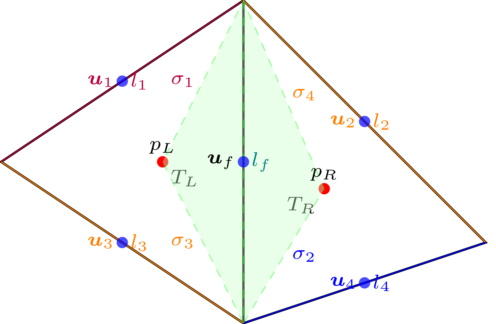
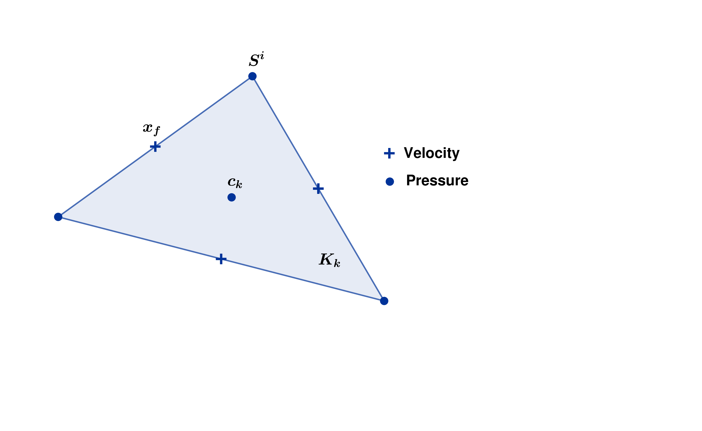
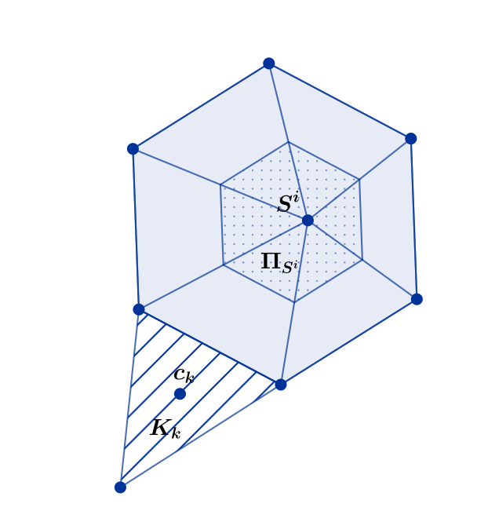

VEF
===

Initially introduced in [LM89]_, *Volume Element Finis* (Finite Volume Element) method is a variant of the standard finite element
and finite volume methods. The formalism developed in [E92]_ was subsequently used for the implementation of
this method in the TRUST code.

Finite Volume Element method
----------------------------

Core Idea
~~~~~~~~~

First, let's consider the following instationary problem, with the velocity :math:`\boldsymbol{u}` a flux term
:math:`\boldsymbol{F}` and a source term :math:`\boldsymbol{S}`.

.. math::
   :label: Flux_continu
   
   \partial_t \boldsymbol{u} + \nabla \cdot \boldsymbol{F} = \boldsymbol{S}

We also introduce the control volume :math:`\omega_f` (see Figure :numref:`fig:control_volume_velocity`) in which we want to evaluate the velocity :math:`\boldsymbol{u}`. We integrate on :math:`\omega_f` between the times :math:`t^n` and
:math:`t^{n+1}`, regardless the regularity of :math:`\boldsymbol{u}` and
:math:`\boldsymbol{F}`.

.. math:: \int_{\omega_f} (\boldsymbol{u}^{n+1} - \boldsymbol{u}^n)\mathrm{d}\boldsymbol{V} + \int_{\partial\omega_f} \int_{t^n}^{t^{n+1}} \boldsymbol{F} \cdot \boldsymbol{n} \mathrm{d}\boldsymbol{s} =  \int_{\omega_f}  \int_{t^n}^{t^{n+1}} \boldsymbol{S} \mathrm{d}\boldsymbol{V}

The expression of the flux term depends on the equation :
:math:`\boldsymbol{F} = \mu \nabla \boldsymbol{u} - p\boldsymbol{I}` for
Stokes equation and
:math:`\boldsymbol{F} = \mu \nabla \boldsymbol{u} - p\boldsymbol{I} + \rho \boldsymbol{u} \otimes \boldsymbol{u}`
for Navier-Stokes equation.

   Control volume for velocity

Finite Volume Approach
~~~~~~~~~~~~~~~~~~~~~~

Given a tetrahedral mesh :math:`\mathcal{T}_h`, we define the points :math:`\boldsymbol{x}_f` as the middle of the face centers. The control volume :math:`\omega_f` is the polygon which relies the vertex connected to the face associated with :math:`\boldsymbol{x}_f` and the barycenters of the tetrahedron which contains :math:`\boldsymbol{x}_f`. Let :math:`\boldsymbol{u}_f^m` be the approximation of the velocity
:math:`\boldsymbol{u}` at the node :math:`\boldsymbol{x}_f` and
:math:`\Delta t^{n,n+1} \boldsymbol{S}_f^{n, n+1}` the approximation of
the right side hand term. Let's discretize the evolution term such that :

.. math:: \int_{\omega_f} \boldsymbol{u}^{m} \mathrm{d}\boldsymbol{V} \approx |\omega_f| ~ \boldsymbol{u}_f^m \qquad m \in \{n, n+1\}

Let's pose :math:`\boldsymbol{F}^m = \boldsymbol{F}(t^n)` or
:math:`\boldsymbol{F}(t^{n+1})` or of combination of the two depending
on the time scheme choosen. The discretization of the flux term leads to
the following equation.

.. math:: \int_{\partial\omega_f}  \int_{t^n}^{t^{n+1}} \boldsymbol{F} \cdot \boldsymbol{n} \mathrm{d}\boldsymbol{s} \approx \Delta t^{n,n+1} \int_{\partial\omega_f}  \boldsymbol{F}^m \cdot \boldsymbol{n} \mathrm{d}\boldsymbol{s} = \Delta t^{n,n+1} |l_f| (\boldsymbol{F}^m_{T_R} - \boldsymbol{F}^m_{T_L} )\boldsymbol{n}_{T_L,T_R}

The discretization of the equation :eq:`Flux_continu` becomes :

.. math:: |\omega_f|(\boldsymbol{u}_f^{n+1} - \boldsymbol{u}_f) + \Delta t^{n,n+1} |l_f| (\boldsymbol{F}^m_{T_R} - \boldsymbol{F}^m_{T_L} )\boldsymbol{n}_{T_L,T_R} = \Delta t^{n,n+1} \boldsymbol{S}_f^{n, n+1}

At this point, the discretization method looks like a Finite Volume
scheme. The main difference comes from the way the term
:math:`\boldsymbol{F}^m_{T}` is discretized with the help of
Finite Element basis.

Finite Element Basis
~~~~~~~~~~~~~~~~~~~~

Historically, the VFE method was presented with the Crouzeix-Raviart basis.
The full vector of the velocity is evaluated at the center of the faces of each tetrahedron. Within each cell, the pressure is a constant evaluated by its value at the center of the cell. Let's pose
:math:`(\phi_f)_{f\in \mathcal{I}_{\text{f}}}` the velocity basis (i.e. :math:`\phi_f(\boldsymbol{x_{f'}}) = \delta_{f,f'}`) and :math:`(\mathbb{I}_{K_k})_{k\in {\mathcal{I}_K}}` the pressure basis (see :numref:`fig:triangle_vef`). Each discrete velocity vector
:math:`\boldsymbol{u}_h` and pressure :math:`p_h` can be expressed with the following linear combination.

.. math::

   \begin{aligned}
       \boldsymbol{u}_h = \sum_{f\in \mathcal{I}_{\text{f}}}{}\boldsymbol{u}_f \phi_f\\
       p_h = \sum_{k\in {\mathcal{I}_K}}{} p_k \mathbb{I}_{K_k}
   \end{aligned}

   Control volume for pressure P0

 

Discretization of flux term in the Stokes equation
^^^^^^^^^^^^^^^^^^^^^^^^^^^^^^^^^^^^^^^^^^^^^^^^^^

For the Stokes equation, the flux term is
:math:`\boldsymbol{F} = \mu \nabla \boldsymbol{u} - p\boldsymbol{I}`.
Integrating on :math:`\partial\omega_f`, the discretization can be
written with the finite element basis :

.. math::

   \int_{\partial\omega_f} \boldsymbol{F} = \underset{f' \in \mathcal{I}_{\text{f}}}{\sum} \boldsymbol{u}_{f'} \int_{\partial\omega_{f}} \boldsymbol{\nabla} \phi_{f'} \cdot \boldsymbol{n} d\boldsymbol{s}
       + \underset{k \in \mathcal{I}_K}{\sum} p_k \int_{\partial\omega_f \cap K_k}  \boldsymbol{n} d\boldsymbol{s}

Note that the finite element basis :math:`(\phi_f)_{f\in \mathcal{I}_f}` can be express
with the help of barycentric coordinate (see [CR73]_) and his gradient is constant per tetrahedron which value is :math:`(\nabla\phi_f)_T = \frac{1}{|T|}\int_{\partial T} \boldsymbol{n}d\boldsymbol{s}` (see [E92]_, p27).

The discretization of the gradient of velocity becomes

.. math::

   \begin{aligned}
   \int_{\partial\omega_f} \boldsymbol{\nabla} \phi_{f'} \cdot {\boldsymbol{n}}d\boldsymbol{s}
   &= \sum_{T \in \mathcal{T}_h} (\nabla \phi_{f'})_T \cdot \int_{\omega_f \cap T } \boldsymbol{n}d\boldsymbol{s}\\
   &= - \sum_{T \in \mathcal{T}_h} \frac{1}{|T|} S_T^{f'} \cdot S_T^f,
   \end{aligned}

with :

.. math::

   \int_{\omega_f\cap T} \boldsymbol{n}d\boldsymbol{s} = - \int_{\partial T} \boldsymbol{n}d\boldsymbol{s} = S_T^f

and the pressure part :

.. math::

   \underset{k \in \mathcal{I}_K}{\sum} p_k \int_{\partial\omega_f \cap K_k}  \boldsymbol{n} d\boldsymbol{s} =  |l_f|(p_{T_R} - p_{T_L}) \boldsymbol{n}_{T_L, T_R}

Variational Formulation
^^^^^^^^^^^^^^^^^^^^^^^

Once the flux term :math:`\boldsymbol{F}`, the time derivative and the source term is
discretized, we multiply it by a *test* function to derive the so-called
*finite volume formulation*. This allows us to define bilinear forms
similar to those in the finite element method. By multiplying the mass
conservation by a test pressure function
:math:`q_h = \underset{k \in \mathcal{I}_K}{\sum} q_k \mathbb{I}_{K_k}`
and the momentum conservation by a test velocity function
:math:`\boldsymbol{v}_h = \underset{f \in \mathcal{I}_{\text{f}}}{\sum} \boldsymbol{v}_f \phi_f`.
Defining :math:`\mathbb{X}_h` the finite element space for discrete velocities :math:`\boldsymbol{u}_f` 
and :math:`\mathring{\mathbb{N}}_h` for the discrete pressure, the variational formulation for incompressible Stokes equation becomes :

Find
:math:`(\boldsymbol{u}_h, p_h) \in \mathbb{X}_h \times \mathring{\mathbb{N}}_h`
such that:

.. math::
   :label: variational_form

       \left\{
       \begin{aligned}
       \partial_t m_h^V(\boldsymbol{u}_h,\boldsymbol{v}_h) + a_h^V(\boldsymbol{u}_h, \boldsymbol{v}_h) + b_h^V(\boldsymbol{v}_h, p_h) &= L_h^V(\boldsymbol{v}_h) \qquad & \forall \boldsymbol{v}_h \in \mathbb{X}_h, \\
       c_h^V(\boldsymbol{u}_h, q_h) &= 0 \qquad & \forall q_h \in \mathring{\mathbb{N}}_h.
       \end{aligned}
       \right.

with:

.. math::

   m_h^V :=
       \left\{
       \begin{aligned}
       \mathbb{X}_h \times \mathbb{X}_h &\to \mathbb{R}, \\
       (\boldsymbol{u}_h, \boldsymbol{v}_h) &\mapsto   \underset{f,f' \in \mathcal{I}_{\text{f}}}{\sum} \boldsymbol{u}_{f'} \cdot \boldsymbol{v}_{f}
       |\omega_f|\delta_f(\boldsymbol{x}_{f'})
       \end{aligned}
   \right.

.. math::

   a_h^V :=
   \left\{
       \begin{aligned}
       \mathbb{X}_h \times \mathbb{X}_h &\to \mathbb{R}, \\
       (\boldsymbol{u}_h, \boldsymbol{v}_h) &\mapsto    \underset{f,f' \in \mathcal{I}_{\text{f}}}{\sum} \boldsymbol{u}_{f'} \boldsymbol{v}_{f}  \int_{\partial\omega_{f}} \boldsymbol{\nabla} \phi_{f'} \cdot \boldsymbol{n} d\boldsymbol{s}.
       \end{aligned}
   \right.

.. math::

   b_h^V :=
   \left\{
       \begin{aligned}
       \mathbb{X}_h \times \mathring{\mathbb{N}}_h &\to \mathbb{R}, \\
       (\boldsymbol{v}_h, p_h) &\mapsto    \underset{f \in \mathcal{I}_{\text{f}}}{\sum} \underset{k \in \mathcal{I}_K}{\sum} \boldsymbol{v}_{f} p_k \int_{\partial\omega_f \cap K_k} \boldsymbol{n} d\boldsymbol{s}.
       \end{aligned}
   \right.

.. math::

   c_h^V :=
   \left\{
       \begin{aligned}
       \mathbb{X}_h \times \mathring{\mathbb{N}}_h &\to \mathbb{R}, \\
       (\boldsymbol{u}_h, q_h) &\mapsto    \underset{k \in \mathcal{I}_K}{\sum} \underset{f \in \mathcal{I}_{\text{f}}}{\sum} \boldsymbol{u}_f q_k \int_{\partial K_k} \phi_f \cdot \boldsymbol{n} d \boldsymbol{s}.
       \end{aligned}
   \right.

.. math::

   L_h^V :=
   \left\{
       \begin{aligned}
       \mathbb{X}_h &\to \mathbb{R}, \\
       \boldsymbol{v}_h &\mapsto     \underset{f \in \mathcal{I}_{\text{f}}}{\sum} \boldsymbol{v}_{f} \int_{\omega_f} \boldsymbol{f} d\boldsymbol{V}.
       \end{aligned}
   \right.

This formulation looks like finite element variational formulation.

According to [H03]_, there are two methods for analyzing the scheme based on the formulation :eq:`variational_form` (and therefore for obtaining "good" mathematical properties):

-  The first involves directly analyzing the scheme. It enables to prove the uniform
   continuity of the bilinear forms, the ellipticity of :math:`a_h^V`,
   and establishing the inf-sup conditions.

-  The second involves demonstrating the equivalence of assembly
   matrices derived from FEM and FVM for the same given functional
   spaces. Thus, numerical scheme can be analyze with the FEM formalism which is well-known for Navier-Stokes equation with Crouzeix-Raviart elements (see [CR73]_). 
   
  .. GJ comment : So what for the second point ? What can you prove with it ? 
  .. VK answer  : I add the last sentence, is that clear ?  
  .. GJ : Better, but i think we need to change a bit the structure of this section, we can talk about it 

New Finite element basis
------------------------

In order to reduce parasite currents (usefull for low viscosities), a pressure enriched basis was studied in [H03]_ and [F06]_ and implemented in TRUST code under the name VEF - :math:`\mathbb{P}^{nc}/\mathbb{P}^0+\mathbb{P}^1`.
The idea is to add pressure unknows :math:`\mathbb{P}^1` at the vertices of each cell. 
This add a new control volume for the mass conservation. :numref:`fig:triangle_vef` represents the two control volumes for the two pressure unknows:

-  :math:`K_k` for the constant part of the pressure which is :math:`\mathbb{P}^0` 
-  :math:`\Pi_{S^i}` for the :math:`\mathbb{P}^1` part associated with the unknown located at the center of vertex :math:`S^i`.

   Control volume for pressure P0 and P1

The stability of this new finite element basis is proved in [JCS23]_.
  .. and the main notions of equivalence between finite element formulation and finite volume element formulation are presented in [PJ24] - .

