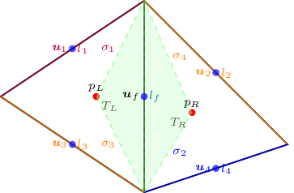
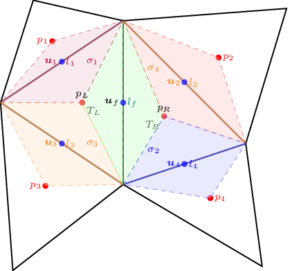

VEF
===

Initially introduced in [LM89]_ method is a variant of the standard finite element
and finite volume methods. The formalism developed in [E92]_ was subsequently used for the implementation of
this method in the TRUST code.

Finite Volume Element method
----------------------------

Idea
~~~~

Let consider the following instationary problem, with a flux term
:math:`\boldsymbol{F}` and a source term :math:`\boldsymbol{S}`.

.. math:: \partial_t \boldsymbol{u} + \nabla \cdot \boldsymbol{F} = \boldsymbol{S}

We integrate on :math:`\omega_f` between :math:`t^n` and
:math:`t^{n+1}`, regardless the regularity of :math:`\boldsymbol{u}` and
:math:`\boldsymbol{F}`.

.. math:: \int_{\omega_f} (\boldsymbol{u}^{n+1} - \boldsymbol{u}^n)\mathrm{d}V + \int_{\partial\omega_f} \int_{t^n}^{t^{n+1}} \boldsymbol{F} \cdot \boldsymbol{n} \mathrm{d}s =  \int_{\omega_f}  \int_{t^n}^{t^{n+1}} \boldsymbol{S} \mathrm{d}V

The flux term
:math:`\boldsymbol{F} = \mu \nabla \boldsymbol{u} - p\boldsymbol{I}` for
Stokes equation and
:math:`\boldsymbol{F} = \mu \nabla \boldsymbol{u} - p\boldsymbol{I} + \rho \boldsymbol{u} \otimes \boldsymbol{u}`
for Navier-Stokes equation.

   Control volume for velocity

Finite Volume Approach
~~~~~~~~~~~~~~~~~~~~~~

Let :math:`\boldsymbol{u}_f^m` be the approximation of the velocity
:math:`\boldsymbol{u}` at the node :math:`\boldsymbol{x}_f` and
:math:`\Delta t^{n,n+1} \boldsymbol{S}_f^{n, n+1}` the approximation of
the right side hand term. Let discretize the evolution term such that :

.. math:: \int_{\omega_f} \boldsymbol{u}^{m} \mathrm{d}V \approx |\omega_f| ~ \boldsymbol{u}_f^m \qquad m \in \{n, n+1\}

Let pose :math:`\boldsymbol{F}^m = \boldsymbol{F}(t^n)` or
:math:`\boldsymbol{F}(t^{n+1})` or of combination of the two depending
on the time scheme choosen. The discretization of the flux term leads to
the following equation.

.. math:: \int_{\partial\omega_f}  \int_{t^n}^{t^{n+1}} \boldsymbol{F} \cdot \boldsymbol{n} \mathrm{d}s \approx \Delta t^{n,n+1} \int_{\partial\omega_f}  \boldsymbol{F}^m \cdot \boldsymbol{n} \mathrm{d}s = \Delta t^{n,n+1} |\Gamma_{\text{rob}}| (\boldsymbol{F}^m_{\mathcal{K}_R} - \boldsymbol{F}^m_{\mathcal{K}_L} )\boldsymbol{n}_{\mathcal{K}_L,\mathcal{K}_R}

At this point, the discretization method looks like a Finite Volume
scheme. The main difference comes from the way the term
:math:`\boldsymbol{F}^m_{\mathcal{K}}` is discretized with the help of
Finite Element basis.

Finite Element Basis
~~~~~~~~~~~~~~~~~~~~

Let use the Crouzeix-Raviart basis. The velocity node is at the center
of the vertex and the pressure is located at the center of the face
corresponding on the triangulation. Let pose
:math:`(\phi_f)_{f\in \mathcal{I}_{\text{fa}}}` the velocity basis (i.e.
:math:`\phi_f(\boldsymbol{x_{f'}}) = \delta_{f,f'}`) and
:math:`(\mathbb{I}_K)_{K\in {\mathcal{I}_K}}` the pressure basis (see
`1.2 <#fig:K_k>`__). Each discrete velocity vector
:math:`\boldsymbol{u}_h` and pressure :math:`p_h` can be expressed like
that.

.. math::

   \begin{aligned}
       \boldsymbol{u}_h = \sum_{f\in \mathcal{I}_{\text{fa}}}{}\boldsymbol{u}_f \phi_f\\
       p_h = \sum_{K\in {\mathcal{I}_K}}{} p_K \mathbb{I}_K
   \end{aligned}

.. figure:: ./FIGURES/triangle.png
   :name: fig:triangle_vef
   :align: center
   :alt: Control volume for pressure P0
   :height: 10cm

   Control volume for pressure P0

Discretization of flux term for Stokes equation
^^^^^^^^^^^^^^^^^^^^^^^^^^^^^^^^^^^^^^^^^^^^^^^

For the Stokes equation, the flux term is
:math:`\boldsymbol{F} = \mu \nabla \boldsymbol{u} - p\boldsymbol{I}`.
Integrating on :math:`\partial\omega_f`, the discretization can be
written with the finit element basis :

.. math::

   \int_{\partial\omega_f} \boldsymbol{F} = \underset{f' \in \mathcal{I}_{\text{fa}}}{\sum} \boldsymbol{u}_{f'} \int_{\partial\omega_{f}} \boldsymbol{\nabla} \phi_{f'} \cdot \boldsymbol{n}_{\omega_f} d\boldsymbol{s} 
       + \underset{k \in \mathcal{I}_K}{\sum} p_k \int_{\partial\omega_f \cap K_k}  \boldsymbol{n}_{\omega_f} d\boldsymbol{s}

Let remind that the finite element basis :math:`(\phi_f)` can be express
with the help of barycentric coordinate (citation CR73).

Variational Formulation
^^^^^^^^^^^^^^^^^^^^^^^

Once :math:`\boldsymbol{F}`, the time derivative and the source term is
discretized, we multiply it by a *test* function to derive the so-called
*finite volume formulation*. This allows us to define bilinear forms
similar to those in the finite element method. By multiplying the mass
conservation by a test pressure function
:math:`q_h = \underset{k \in \mathcal{I}_K}{\sum} q_k \mathbb{I}_{K_k}`
and the momentum conservation by a test velocity function
:math:`\boldsymbol{v}_h = \underset{f \in \mathcal{I}_{\text{fa}}}{\sum} v_f \phi_f`,
the variational formulation for incompressible Stokes equation becomes :

Find
:math:`(\boldsymbol{u}_h, p_h) \in \mathbb{X}_h \times \mathring{\mathbb{N}}_h`
such that:

.. math::

   \label{fv:vef_Crouzeix_dirichlet}
       \left\{
       \begin{aligned}
       \partial_t m_h(\boldsymbol{u}_h,\boldsymbol{v}_h) + a_h^V(\boldsymbol{u}_h, \boldsymbol{v}_h) + b_h^V(\boldsymbol{v}_h, p_h) &= L_h^V(\boldsymbol{v}_h) \qquad & \forall \boldsymbol{v}_h \in \mathbb{X}_h, \\
       c_h^V(\boldsymbol{u}_h, q_h) &= 0 \qquad & \forall q_h \in \mathring{\mathbb{N}}_h.
       \end{aligned}
       \right.

with:

.. math::

   m_h^V := 
       \left\{
       \begin{aligned}
       \mathbb{X}_h \times \mathbb{X}_h &\to \mathbb{R}, \\
       (\boldsymbol{u}_h, \boldsymbol{v}_h) &\mapsto   \underset{f,f' \in \mathcal{I}_{\text{fa}}}{\sum} \boldsymbol{u}_{f'} \boldsymbol{v}_{f} 
       |\omega_f|\delta_f(\boldsymbol{x}_{f'})
       \end{aligned}
   \right.

.. math::

   a_h^V :=
   \left\{
       \begin{aligned}
       \mathbb{X}_h \times \mathbb{X}_h &\to \mathbb{R}, \\
       (\boldsymbol{u}_h, \boldsymbol{v}_h) &\mapsto    \underset{f,f' \in \mathcal{I}_{\text{fa}}}{\sum} \boldsymbol{u}_{f'} \boldsymbol{v}_{f}  \int_{\partial\omega_{f}} \boldsymbol{\nabla} \phi_{f'} \cdot \boldsymbol{n}_{\omega_f} d\boldsymbol{s}.
       \end{aligned}
   \right.

.. math::

   b_h^V :=
   \left\{
       \begin{aligned}
       \mathbb{X}_h \times \mathring{\mathbb{N}}_h &\to \mathbb{R}, \\
       (\boldsymbol{v}_h, p_h) &\mapsto    \underset{f \in \mathcal{I}_{\text{fa}}}{\sum} \underset{k \in \mathcal{I}_K}{\sum} \boldsymbol{v}_{f} p_k \int_{\partial\omega_f \cap K_k} \boldsymbol{n}_{\omega_f} d\boldsymbol{s}.
       \end{aligned}
   \right.

.. math::

   c_h^V :=
   \left\{
       \begin{aligned}
       \mathbb{X}_h \times \mathring{\mathbb{N}}_h &\to \mathbb{R}, \\
       (\boldsymbol{u}_h, q_h) &\mapsto    \underset{k \in \mathcal{I}_K}{\sum} \underset{f \in \mathcal{I}_{\text{fa}}}{\sum} \boldsymbol{u}_f q_k \int_{\partial K_k} \phi_f \cdot \boldsymbol{n} d \boldsymbol{s}.
       \end{aligned}
   \right.

.. math::

   L_h^V :=
   \left\{
       \begin{aligned}
       \mathbb{X}_h &\to \mathbb{R}, \\
       \boldsymbol{v}_h &\mapsto     \underset{f \in \mathcal{I}_{\text{fa}}}{\sum} \boldsymbol{v}_{f} \int_{\omega_f} \boldsymbol{f} d\boldsymbol{V}.
       \end{aligned}
   \right.

This formulation looks like finite element variational formulation.

According to [H03]_, there are two methods for analyzing the
scheme based on the formulation
`[fv:vef_Crouzeix_dirichlet] <#fv:vef_Crouzeix_dirichlet>`__:

-  The first involves directly analyzing the scheme: proving the uniform
   continuity of the bilinear forms, the ellipticity of :math:`a_h^V`,
   and establishing the inf-sup conditions.

-  The second involves demonstrating the equivalence of assembly
   matrices derived from FEM and FVM for the same given functional
   spaces.

Since the finite element formulations were analyzed in the first
section, we focus on demonstrating the equivalence of the matrices.

Boundary conditions
~~~~~~~~~~~~~~~~~~~

Details regarding the treatment of boundary conditions are given in [E92]_.

New Finite element basis
------------------------

[H03]_ proposed an enriched pressure basis in order to reduce parasite
currents and [F06]_ implemented the method in TRUST code. The idea is
to add pressure unknows :math:`\boldsymbol{P}_u` at the node each vertex
(see :numref:`fig:triangle_vef` )

The stability of this new finite element basis is proved in [JCS23]_. 
  .. and the main notions of equivalence between finit element formulation and finite volume element formulation are presented in [erell puscas 2024].

.. figure:: FIGURES/pi_si_kl.png
   :alt: Control volume for pressure P0 and P1
   :name: fig:pi_f
   :height: 10cm

   Control volume for pressure P0 and P1

   Control volume for pressure P0 and P1
