----

**Keywords derived from champ_generique_base**
==============================================

.. _champ_generique_base:

**champ_generique_base**
------------------------

not_set

----

.. _champ_post_de_champs_post:

**champ_post_de_champs_post**
-----------------------------

not_set

Parameters are:

- **[source]**  (*type:* :ref:`champ_generique_base`) the source field.

- **[sources]**  (*type:* list of Champ_generique_base) XXX

- **[nom_source]**  (*type:* string) To name a source field with the nom_source keyword

- **[source_reference]**  (*type:* string) not_set

- **[sources_reference]**  (*type:* list of Nom_anonyme) List of name.

----

.. _champ_post_operateur_base:

**champ_post_operateur_base**
-----------------------------

not_set

Parameters are:

- **[source]**  (*type:* :ref:`champ_generique_base`) the source field.

- **[sources]**  (*type:* list of Champ_generique_base) XXX

- **[nom_source]**  (*type:* string) To name a source field with the nom_source keyword

- **[source_reference]**  (*type:* string) not_set

- **[sources_reference]**  (*type:* list of Nom_anonyme) List of name.

----

.. _champ_post_operateur_eqn:

**champ_post_operateur_eqn**
----------------------------

**Synonyms:** operateur_eqn

Post-process equation operators/sources

Parameters are:

- **[numero_source]**  (*type:* int) the source to be post-processed (its number). If you have only one source term, numero_source will correspond to 0 if you want to post-process that unique source

- **[numero_op]**  (*type:* int) numero_op will be 0 (diffusive operator) or 1 (convective operator) or 2 (gradient operator) or 3 (divergence operator).

- **[numero_masse]**  (*type:* int) numero_masse will be 0 for the mass equation operator in Pb_multiphase.

- **[sans_solveur_masse]**  (*type:* flag) not_set

- **[compo]**  (*type:* int) If you want to post-process only one component of a vector field, you can specify the number of the component after compo keyword. By default, it is set to -1 which means that all the components will be post-processed. This feature is not available in VDF disretization.

- **[source]**  (*type:* :ref:`champ_generique_base`) the source field.

- **[sources]**  (*type:* list of Champ_generique_base) XXX

- **[nom_source]**  (*type:* string) To name a source field with the nom_source keyword

- **[source_reference]**  (*type:* string) not_set

- **[sources_reference]**  (*type:* list of Nom_anonyme) List of name.

----

.. _champ_post_statistiques_base:

**champ_post_statistiques_base**
--------------------------------

not_set

Parameters are:

- **t_deb**  (*type:* float) Start of integration time

- **t_fin**  (*type:* float) End of integration time

- **[source]**  (*type:* :ref:`champ_generique_base`) the source field.

- **[sources]**  (*type:* list of Champ_generique_base) XXX

- **[nom_source]**  (*type:* string) To name a source field with the nom_source keyword

- **[source_reference]**  (*type:* string) not_set

- **[sources_reference]**  (*type:* list of Nom_anonyme) List of name.

----

.. _correlation:

**correlation**
---------------

**Synonyms:** champ_post_statistiques_correlation

to calculate the correlation between the two fields.

Parameters are:

- **t_deb**  (*type:* float) Start of integration time

- **t_fin**  (*type:* float) End of integration time

- **[source]**  (*type:* :ref:`champ_generique_base`) the source field.

- **[sources]**  (*type:* list of Champ_generique_base) XXX

- **[nom_source]**  (*type:* string) To name a source field with the nom_source keyword

- **[source_reference]**  (*type:* string) not_set

- **[sources_reference]**  (*type:* list of Nom_anonyme) List of name.

----

.. _divergence:

**divergence**
--------------

**Synonyms:** champ_post_operateur_divergence

To calculate divergency of a given field.

Parameters are:

- **[source]**  (*type:* :ref:`champ_generique_base`) the source field.

- **[sources]**  (*type:* list of Champ_generique_base) XXX

- **[nom_source]**  (*type:* string) To name a source field with the nom_source keyword

- **[source_reference]**  (*type:* string) not_set

- **[sources_reference]**  (*type:* list of Nom_anonyme) List of name.

----

.. _ecart_type:

**ecart_type**
--------------

**Synonyms:** champ_post_statistiques_ecart_type

to calculate the standard deviation (statistic rms) of the field nom_champ.

Parameters are:

- **t_deb**  (*type:* float) Start of integration time

- **t_fin**  (*type:* float) End of integration time

- **[source]**  (*type:* :ref:`champ_generique_base`) the source field.

- **[sources]**  (*type:* list of Champ_generique_base) XXX

- **[nom_source]**  (*type:* string) To name a source field with the nom_source keyword

- **[source_reference]**  (*type:* string) not_set

- **[sources_reference]**  (*type:* list of Nom_anonyme) List of name.

----

.. _extraction:

**extraction**
--------------

**Synonyms:** champ_post_extraction

To create a surface field (values at the boundary) of a volume field

Parameters are:

- **domaine**  (*type:* string) name of the volume field

- **nom_frontiere**  (*type:* string) boundary name where the values of the volume field will be picked

- **[methode]**  (*type:* string into ['trace', 'champ_frontiere']) name of the extraction method (trace by_default or champ_frontiere)

- **[source]**  (*type:* :ref:`champ_generique_base`) the source field.

- **[sources]**  (*type:* list of Champ_generique_base) XXX

- **[nom_source]**  (*type:* string) To name a source field with the nom_source keyword

- **[source_reference]**  (*type:* string) not_set

- **[sources_reference]**  (*type:* list of Nom_anonyme) List of name.

----

.. _gradient:

**gradient**
------------

**Synonyms:** champ_post_operateur_gradient

To calculate gradient of a given field.

Parameters are:

- **[source]**  (*type:* :ref:`champ_generique_base`) the source field.

- **[sources]**  (*type:* list of Champ_generique_base) XXX

- **[nom_source]**  (*type:* string) To name a source field with the nom_source keyword

- **[source_reference]**  (*type:* string) not_set

- **[sources_reference]**  (*type:* list of Nom_anonyme) List of name.

----

.. _interpolation:

**interpolation**
-----------------

**Synonyms:** champ_post_interpolation

To create a field which is an interpolation of the field given by the keyword source.

Parameters are:

- **localisation**  (*type:* string) type_loc indicate where is done the interpolation (elem for element or som for node).

- **[methode]**  (*type:* string) The optional keyword methode is limited to calculer_champ_post for the moment.

- **[domaine]**  (*type:* string) the domain name where the interpolation is done (by default, the calculation domain)

- **[optimisation_sous_maillage]**  (*type:* string into ['default', 'yes', 'no']) not_set

- **[source]**  (*type:* :ref:`champ_generique_base`) the source field.

- **[sources]**  (*type:* list of Champ_generique_base) XXX

- **[nom_source]**  (*type:* string) To name a source field with the nom_source keyword

- **[source_reference]**  (*type:* string) not_set

- **[sources_reference]**  (*type:* list of Nom_anonyme) List of name.

----

.. _morceau_equation:

**morceau_equation**
--------------------

**Synonyms:** champ_post_morceau_equation

To calculate a field related to a piece of equation. For the moment, the field which can
be calculated is the stability time step of an operator equation. The problem name and the
unknown of the equation should be given by Source refChamp { Pb_Champ problem_name
unknown_field_of_equation }

Parameters are:

- **type**  (*type:* string) can only be operateur for equation operators.

- **[numero]**  (*type:* int) numero will be 0 (diffusive operator) or 1 (convective operator) or 2 (gradient operator) or 3 (divergence operator).

- **[unite]**  (*type:* string) will specify the field unit

- **option**  (*type:* string into ['stabilite', 'flux_bords', 'flux_surfacique_bords']) option is stability for time steps or flux_bords for boundary fluxes or flux_surfacique_bords for boundary surfacic fluxes

- **[compo]**  (*type:* int) compo will specify the number component of the boundary flux (for boundary fluxes, in this case compo permits to specify the number component of the boundary flux choosen).

- **[source]**  (*type:* :ref:`champ_generique_base`) the source field.

- **[sources]**  (*type:* list of Champ_generique_base) XXX

- **[nom_source]**  (*type:* string) To name a source field with the nom_source keyword

- **[source_reference]**  (*type:* string) not_set

- **[sources_reference]**  (*type:* list of Nom_anonyme) List of name.

----

.. _moyenne:

**moyenne**
-----------

**Synonyms:** champ_post_statistiques_moyenne

to calculate the average of the field over time

Parameters are:

- **[moyenne_convergee]**  (*type:* :ref:`field_base`) This option allows to read a converged time averaged field in a .xyz file in order to calculate, when resuming the calculation, the statistics fields (rms, correlation) which depend on this average. In that case, the time averaged field is not updated during the resume of calculation. In this case, the time averaged field must be fully converged to avoid errors when calculating high order statistics.

- **t_deb**  (*type:* float) Start of integration time

- **t_fin**  (*type:* float) End of integration time

- **[source]**  (*type:* :ref:`champ_generique_base`) the source field.

- **[sources]**  (*type:* list of Champ_generique_base) XXX

- **[nom_source]**  (*type:* string) To name a source field with the nom_source keyword

- **[source_reference]**  (*type:* string) not_set

- **[sources_reference]**  (*type:* list of Nom_anonyme) List of name.

----

.. _predefini:

**predefini**
-------------

This keyword is used to post process predefined postprocessing fields.

Parameters are:

- **pb_champ**  (*type:* :ref:`deuxmots`) { Pb_champ nom_pb nom_champ } : nom_pb is the problem name and nom_champ is the selected field name. The available keywords for the field name are: energie_cinetique_totale, energie_cinetique_elem, viscosite_turbulente, viscous_force_x, viscous_force_y, viscous_force_z, pressure_force_x, pressure_force_y, pressure_force_z, total_force_x, total_force_y, total_force_z, viscous_force, pressure_force, total_force

----

.. _reduction_0d:

**reduction_0d**
----------------

**Synonyms:** champ_post_reduction_0d

To calculate the min, max, sum, average, weighted sum, weighted average, weighted sum by
porosity, weighted average by porosity, euclidian norm, normalized euclidian norm, L1
norm, L2 norm of a field.

Parameters are:

- **methode**  (*type:* string into ['min', 'max', 'moyenne', 'average', 'moyenne_ponderee', 'weighted_average', 'somme', 'sum', 'somme_ponderee', 'weighted_sum', 'somme_ponderee_porosite', 'weighted_sum_porosity', 'euclidian_norm', 'normalized_euclidian_norm', 'l1_norm', 'l2_norm', 'valeur_a_gauche', 'left_value']) name of the reduction method:  - min for the minimum value,  - max for the maximum value,  - average (or moyenne) for a mean,  - weighted_average (or moyenne_ponderee) for a mean ponderated by integration volumes, e.g: cell volumes for temperature and pressure in VDF, volumes around faces for velocity and temperature in VEF,  - sum (or somme) for the sum of all the values of the field,  - weighted_sum (or somme_ponderee) for a weighted sum (integral),  - weighted_average_porosity (or moyenne_ponderee_porosite) and weighted_sum_porosity (or somme_ponderee_porosite) for the mean and sum weighted by the volumes of the elements, only for ELEM localisation,  - euclidian_norm for the euclidian norm,  - normalized_euclidian_norm for the euclidian norm normalized,  - L1_norm for norm L1,  - L2_norm for norm L2

- **[source]**  (*type:* :ref:`champ_generique_base`) the source field.

- **[sources]**  (*type:* list of Champ_generique_base) XXX

- **[nom_source]**  (*type:* string) To name a source field with the nom_source keyword

- **[source_reference]**  (*type:* string) not_set

- **[sources_reference]**  (*type:* list of Nom_anonyme) List of name.

----

.. _refchamp:

**refchamp**
------------

**Synonyms:** champ_post_refchamp

Field of prolem

Parameters are:

- **[nom_source]**  (*type:* string) The alias name for the field

- **pb_champ**  (*type:* :ref:`deuxmots`) { Pb_champ nom_pb nom_champ } : nom_pb is the problem name and nom_champ is the selected field name.

----

.. _tparoi_vef:

**tparoi_vef**
--------------

**Synonyms:** champ_post_tparoi_vef

This keyword is used to post process (only for VEF discretization) the temperature field
with a slight difference on boundaries with Neumann condition where law of the wall is
applied on the temperature field. nom_pb is the problem name and field_name is the
selected field name. A keyword (temperature_physique) is available to post process this
field without using Definition_champs.

Parameters are:

- **[source]**  (*type:* :ref:`champ_generique_base`) the source field.

- **[sources]**  (*type:* list of Champ_generique_base) XXX

- **[nom_source]**  (*type:* string) To name a source field with the nom_source keyword

- **[source_reference]**  (*type:* string) not_set

- **[sources_reference]**  (*type:* list of Nom_anonyme) List of name.

----

.. _transformation:

**transformation**
------------------

**Synonyms:** champ_post_transformation

To create a field with a transformation using source fields and x, y, z, t. If you use in
your datafile source refChamp { Pb_champ pb pression }, the field pression may be used in
the expression with the name pression_natif_dom; this latter is the same as pression. If
you specify nom_source in refChamp bloc, you should use the alias given to pressure field.
This is avail for all equations unknowns in transformation.

Parameters are:

- **methode**  (*type:* string into ['produit_scalaire', 'norme', 'vecteur', 'formule', 'composante']) methode 0 methode norme : will calculate the norm of a vector given by a source field  methode produit_scalaire : will calculate the dot product of two vectors given by two sources fields  methode composante numero integer : will create a field by extracting the integer component of a field given by a source field  methode formule expression 1 : will create a scalar field located to elements using expressions with x,y,z,t parameters and field names given by a source field or several sources fields.  methode vecteur expression N f1(x,y,z,t) fN(x,y,z,t) : will create a vector field located to elements by defining its N components with N expressions with x,y,z,t parameters and field names given by a source field or several sources fields.

- **[unite]**  (*type:* string) will specify the field unit

- **[expression]**  (*type:* list of str) expression 1 see methodes formule and vecteur

- **[numero]**  (*type:* int) numero 1 see methode composante

- **[localisation]**  (*type:* string) localisation 1 type_loc indicate where is done the interpolation (elem for element or som for node). The optional keyword methode is limited to calculer_champ_post for the moment

- **[source]**  (*type:* :ref:`champ_generique_base`) the source field.

- **[sources]**  (*type:* list of Champ_generique_base) XXX

- **[nom_source]**  (*type:* string) To name a source field with the nom_source keyword

- **[source_reference]**  (*type:* string) not_set

- **[sources_reference]**  (*type:* list of Nom_anonyme) List of name.

----

**Keywords derived from chimie**
================================

.. _chimie:

**chimie**
----------

Keyword to describe the chmical reactions

Parameters are:

- **reactions**  (*type:* list of Reaction) list of reactions

- **[modele_micro_melange]**  (*type:* int) modele_micro_melange (0 by default)

- **[constante_modele_micro_melange]**  (*type:* float) constante of modele (1 by default)

- **[espece_en_competition_micro_melange]**  (*type:* string) espece in competition in reactions

----

**Keywords derived from class_generic**
=======================================

.. _amg:

**amg**
-------

Wrapper for AMG preconditioner-based solver which switch for the best one on CPU/GPU
Nvidia/GPU AMD

Parameters are:

- **solveur**  (*type:* string) not_set

- **option_solveur**  (*type:* :ref:`bloc_lecture`) not_set

----

.. _amgx:

**amgx**
--------

Solver via AmgX API

Parameters are:

- **solveur**  (*type:* string) not_set

- **option_solveur**  (*type:* :ref:`bloc_lecture`) not_set

----

.. _cholesky:

**cholesky**
------------

Cholesky direct method.

Parameters are:

- **[impr]**  (*type:* flag) Keyword which may be used to print the resolution time.

- **[quiet]**  (*type:* flag) To disable printing of information

----

.. _class_generic:

**class_generic**
-----------------

not_set

----

.. _dt_calc_dt_calc:

**dt_calc_dt_calc**
-------------------

**Synonyms:** dt_calc

The time step at first iteration is calculated in agreement with CFL condition.

----

.. _dt_calc_dt_fixe:

**dt_calc_dt_fixe**
-------------------

**Synonyms:** dt_fixe

The first time step is fixed by the user (recommended when resuming calculation with Crank
Nicholson temporal scheme to ensure continuity).

Parameters are:

- **value**  (*type:* float) first time step.

----

.. _dt_calc_dt_min:

**dt_calc_dt_min**
------------------

**Synonyms:** dt_min

The first iteration is based on dt_min.

----

.. _dt_start:

**dt_start**
------------

not_set

----

.. _gcp_ns:

**gcp_ns**
----------

not_set

Parameters are:

- **solveur0**  (*type:* :ref:`solveur_sys_base`) Solver type.

- **solveur1**  (*type:* :ref:`solveur_sys_base`) Solver type.

- **seuil**  (*type:* float) Value of the final residue. The gradient ceases iteration when the Euclidean residue standard ||Ax-B|| is less than this value.

- **[nb_it_max]**  (*type:* int) Keyword to set the maximum iterations number for the Gcp.

- **[impr]**  (*type:* flag) Keyword which is used to request display of the Euclidean residue standard each time this iterates through the conjugated gradient (display to the standard outlet).

- **[quiet]**  (*type:* flag) To not displaying any outputs of the solver.

- **[save_matrice | save_matrix]**  (*type:* flag) to save the matrix in a file.

- **[precond]**  (*type:* :ref:`precond_base`) Keyword to define system preconditioning in order to accelerate resolution by the conjugated gradient. Many parallel preconditioning methods are not equivalent to their sequential counterpart, and you should therefore expect differences, especially when you select a high value of the final residue (seuil). The result depends on the number of processors and on the mesh splitting. It is sometimes useful to run the solver with no preconditioning at all. In particular:  - when the solver does not converge during initial projection,  - when comparing sequential and parallel computations.  With no preconditioning, except in some particular cases (no open boundary), the sequential and the parallel computations should provide exactly the same results within fpu accuracy. If not, there might be a coding error or the system of equations is singular.

- **[precond_nul]**  (*type:* flag) Keyword to not use a preconditioning method.

- **[precond_diagonal]**  (*type:* flag) Keyword to use diagonal preconditioning.

- **[optimized]**  (*type:* flag) This keyword triggers a memory and network optimized algorithms useful for strong scaling (when computing less than 100 000 elements per processor). The matrix and the vectors are duplicated, common items removed and only virtual items really used in the matrix are exchanged. Warning: this is experimental and known to fail in some VEF computations (L2 projection step will not converge). Works well in VDF.

----

.. _gen:

**gen**
-------

not_set

Parameters are:

- **solv_elem**  (*type:* string) To specify a solver among gmres or bicgstab.

- **precond**  (*type:* :ref:`precond_base`) The only preconditionner that we can specify is ilu.

- **[seuil]**  (*type:* float) Value of the final residue. The solver ceases iterations when the Euclidean residue standard ||Ax-B|| is less than this value. default value 1e-12.

- **[impr]**  (*type:* flag) Keyword which is used to request display of the Euclidean residue standard each time this iterates through the conjugated gradient (display to the standard outlet).

- **[save_matrice | save_matrix]**  (*type:* flag) To save the matrix in a file.

- **[quiet]**  (*type:* flag) To not displaying any outputs of the solver.

- **[nb_it_max]**  (*type:* int) Keyword to set the maximum iterations number for the GEN solver.

- **[force]**  (*type:* flag) Keyword to set ipar[5]=-1 in the GEN solver. This is helpful if you notice that the solver does not perform more than 100 iterations. If this keyword is specified in the datafile, you should provide nb_it_max.

----

.. _gmres:

**gmres**
---------

Gmres method (for non symetric matrix).

Parameters are:

- **[impr]**  (*type:* flag) Keyword which may be used to print the convergence.

- **[quiet]**  (*type:* flag) To disable printing of information

- **[seuil]**  (*type:* float) Convergence value.

- **[diag]**  (*type:* flag) Keyword to use diagonal preconditionner (in place of pilut that is not parallel).

- **[nb_it_max]**  (*type:* int) Keyword to set the maximum iterations number for the Gmres.

- **[controle_residu]**  (*type:* int into [0, 1]) Keyword of Boolean type (by default 0). If set to 1, the convergence occurs if the residu suddenly increases.

- **[save_matrice | save_matrix]**  (*type:* flag) to save the matrix in a file.

- **[dim_espace_krilov]**  (*type:* int) not_set

----

.. _optimal:

**optimal**
-----------

Optimal is a solver which tests several solvers of the previous list to choose the fastest
one for the considered linear system.

Parameters are:

- **seuil**  (*type:* float) Convergence threshold

- **[impr]**  (*type:* flag) To print the convergency of the fastest solver

- **[quiet]**  (*type:* flag) To disable printing of information

- **[save_matrice | save_matrix]**  (*type:* flag) To save the linear system (A, x, B) into a file

- **[frequence_recalc]**  (*type:* int) To set a time step period (by default, 100) for re-checking the fatest solver

- **[nom_fichier_solveur]**  (*type:* string) To specify the file containing the list of the tested solvers

- **[fichier_solveur_non_recree]**  (*type:* flag) To avoid the creation of the file containing the list

----

.. _petsc:

**petsc**
---------

Solver via Petsc API

Parameters are:

- **solveur**  (*type:* :ref:`solveur_petsc_deriv`) solver type and options

----

.. _petsc_gpu:

**petsc_gpu**
-------------

GPU solver via Petsc API

Parameters are:

- **solveur**  (*type:* string) not_set

- **option_solveur**  (*type:* :ref:`bloc_lecture`) not_set

- **[atol]**  (*type:* float) Absolute threshold for convergence (same as seuil option)

- **[rtol]**  (*type:* float) Relative threshold for convergence

----

.. _rocalution:

**rocalution**
--------------

Solver via rocALUTION API

Parameters are:

- **solveur**  (*type:* string) not_set

- **option_solveur**  (*type:* :ref:`bloc_lecture`) not_set

----

.. _solv_gcp:

**solv_gcp**
------------

**Synonyms:** gcp

Preconditioned conjugated gradient.

Parameters are:

- **seuil**  (*type:* float) Value of the final residue. The gradient ceases iteration when the Euclidean residue standard ||Ax-B|| is less than this value.

- **[nb_it_max]**  (*type:* int) Keyword to set the maximum iterations number for the Gcp.

- **[impr]**  (*type:* flag) Keyword which is used to request display of the Euclidean residue standard each time this iterates through the conjugated gradient (display to the standard outlet).

- **[quiet]**  (*type:* flag) To not displaying any outputs of the solver.

- **[save_matrice | save_matrix]**  (*type:* flag) to save the matrix in a file.

- **[precond]**  (*type:* :ref:`precond_base`) Keyword to define system preconditioning in order to accelerate resolution by the conjugated gradient. Many parallel preconditioning methods are not equivalent to their sequential counterpart, and you should therefore expect differences, especially when you select a high value of the final residue (seuil). The result depends on the number of processors and on the mesh splitting. It is sometimes useful to run the solver with no preconditioning at all. In particular:  - when the solver does not converge during initial projection,  - when comparing sequential and parallel computations.  With no preconditioning, except in some particular cases (no open boundary), the sequential and the parallel computations should provide exactly the same results within fpu accuracy. If not, there might be a coding error or the system of equations is singular.

- **[precond_nul]**  (*type:* flag) Keyword to not use a preconditioning method.

- **[precond_diagonal]**  (*type:* flag) Keyword to use diagonal preconditioning.

- **[optimized]**  (*type:* flag) This keyword triggers a memory and network optimized algorithms useful for strong scaling (when computing less than 100 000 elements per processor). The matrix and the vectors are duplicated, common items removed and only virtual items really used in the matrix are exchanged. Warning: this is experimental and known to fail in some VEF computations (L2 projection step will not converge). Works well in VDF.

----

.. _solveur_sys_base:

**solveur_sys_base**
--------------------

Basic class to solve the linear system.

----

**Keywords derived from comment**
=================================

.. _comment:

**comment**
-----------

**Synonyms:** #

Comments in a data file.

Parameters are:

- **comm**  (*type:* string) Text to be commented.

----

**Keywords derived from condlim_base**
======================================

.. _condlim_base:

**condlim_base**
----------------

Basic class of boundary conditions.

----

.. _dirichlet:

**dirichlet**
-------------

Dirichlet condition at the boundary called bord (edge) : 1). For Navier-Stokes equations,
velocity imposed at the boundary; 2). For scalar transport equation, scalar imposed at the
boundary.

----

.. _echange_couplage_thermique:

**echange_couplage_thermique**
------------------------------

Thermal coupling boundary condition

Parameters are:

- **[temperature_paroi]**  (*type:* :ref:`field_base`) Temperature

- **[flux_paroi]**  (*type:* :ref:`field_base`) Wall heat flux

----

.. _echange_externe_radiatif:

**echange_externe_radiatif**
----------------------------

**Synonyms:** paroi_echange_externe_radiatif

Combines radiative $(sigma * eps * (T^4 - T_ext^4))$ and convective $(h * (T - T_ext))$
heat transfer boundary conditions, where sigma is the Stefan-Boltzmann constant, eps is
the emi

Parameters are:

- **h_imp**  (*type:* string into ['h_imp', 't_ext', 'emissivite']) Heat exchange coefficient value (expressed in W.m-2.K-1).

- **himpc**  (*type:* :ref:`front_field_base`) Boundary field type.

- **emissivite**  (*type:* string into ['emissivite', 'h_imp', 't_ext']) Emissivity coefficient value.

- **emissivitebc**  (*type:* :ref:`front_field_base`) Boundary field type.

- **t_ext**  (*type:* string into ['t_ext', 'h_imp', 'emissivite']) External temperature value (expressed in oC or K).

- **ch**  (*type:* :ref:`front_field_base`) Boundary field type.

- **temp_unit**  (*type:* string into ['temperature_unit']) Temperature unit

- **temp_unit_val**  (*type:* string into ['kelvin', 'celsius']) Temperature unit

----

.. _echange_interne_global_impose:

**echange_interne_global_impose**
---------------------------------

**Synonyms:** paroi_echange_interne_global_impose

Internal heat exchange boundary condition with global exchange coefficient.

Parameters are:

- **h_imp**  (*type:* string) Global exchange coefficient value. The global exchange coefficient value is expressed in W.m-2.K-1.

- **ch**  (*type:* :ref:`front_field_base`) Boundary field type.

----

.. _echange_interne_global_parfait:

**echange_interne_global_parfait**
----------------------------------

**Synonyms:** paroi_echange_interne_global_parfait

Internal heat exchange boundary condition with perfect (infinite) exchange coefficient.

----

.. _echange_interne_impose:

**echange_interne_impose**
--------------------------

**Synonyms:** paroi_echange_interne_impose

Internal heat exchange boundary condition with exchange coefficient.

Parameters are:

- **h_imp**  (*type:* string) Exchange coefficient value expressed in W.m-2.K-1.

- **ch**  (*type:* :ref:`front_field_base`) Boundary field type.

----

.. _echange_interne_parfait:

**echange_interne_parfait**
---------------------------

**Synonyms:** paroi_echange_interne_parfait

Internal heat exchange boundary condition with perfect (infinite) exchange coefficient.

----

.. _entree_temperature_imposee_h:

**entree_temperature_imposee_h**
--------------------------------

Particular case of class frontiere_ouverte_temperature_imposee for enthalpy equation.

Parameters are:

- **ch**  (*type:* :ref:`front_field_base`) Boundary field type.

----

.. _frontiere_ouverte:

**frontiere_ouverte**
---------------------

Boundary outlet condition on the boundary called bord (edge) (diffusion flux zero). This
condition must be associated with a boundary outlet hydraulic condition.

Parameters are:

- **var_name**  (*type:* string into ['t_ext', 'c_ext', 'y_ext', 'k_eps_ext', 'k_omega_ext', 'fluctu_temperature_ext', 'flux_chaleur_turb_ext', 'v2_ext', 'a_ext', 'tau_ext', 'k_ext', 'omega_ext', 'h_ext']) Field name.

- **ch**  (*type:* :ref:`front_field_base`) Boundary field type.

----

.. _frontiere_ouverte_alpha_impose:

**frontiere_ouverte_alpha_impose**
----------------------------------

Imposed alpha condition at the open boundary.

Parameters are:

- **ch**  (*type:* :ref:`front_field_base`) Boundary field type.

----

.. _frontiere_ouverte_concentration_imposee:

**frontiere_ouverte_concentration_imposee**
-------------------------------------------

Imposed concentration condition at an open boundary called bord (edge) (situation
corresponding to a fluid inlet). This condition must be associated with an imposed inlet
velocity condition.

Parameters are:

- **ch**  (*type:* :ref:`front_field_base`) Boundary field type.

----

.. _frontiere_ouverte_fraction_massique_imposee:

**frontiere_ouverte_fraction_massique_imposee**
-----------------------------------------------

not_set

Parameters are:

- **ch**  (*type:* :ref:`front_field_base`) Boundary field type.

----

.. _frontiere_ouverte_gradient_pression_impose:

**frontiere_ouverte_gradient_pression_impose**
----------------------------------------------

Normal imposed pressure gradient condition on the open boundary called bord (edge). This
boundary condition may be only used in VDF discretization. The imposed $\partial
P/\partial n$ value is expressed in Pa.m-1.

Parameters are:

- **ch**  (*type:* :ref:`front_field_base`) Boundary field type.

----

.. _frontiere_ouverte_gradient_pression_impose_vefprep1b:

**frontiere_ouverte_gradient_pression_impose_vefprep1b**
--------------------------------------------------------

Keyword for an outlet boundary condition in VEF P1B/P1NC on the gradient of the pressure.

Parameters are:

- **ch**  (*type:* :ref:`front_field_base`) Boundary field type.

----

.. _frontiere_ouverte_gradient_pression_libre_vef:

**frontiere_ouverte_gradient_pression_libre_vef**
-------------------------------------------------

Class for outlet boundary condition in VEF like Orlansky. There is no reference for
pressure for theses boundary conditions so it is better to add pressure condition (with
Frontiere_ouverte_pression_imposee) on one or two cells (for symmetry in a channel) of the
boundary where Orlansky conditions are imposed.

----

.. _frontiere_ouverte_gradient_pression_libre_vefprep1b:

**frontiere_ouverte_gradient_pression_libre_vefprep1b**
-------------------------------------------------------

Class for outlet boundary condition in VEF P1B/P1NC like Orlansky.

----

.. _frontiere_ouverte_pression_imposee:

**frontiere_ouverte_pression_imposee**
--------------------------------------

Imposed pressure condition at the open boundary called bord (edge). The imposed pressure
field is expressed in Pa.

Parameters are:

- **ch**  (*type:* :ref:`front_field_base`) Boundary field type.

----

.. _frontiere_ouverte_pression_imposee_orlansky:

**frontiere_ouverte_pression_imposee_orlansky**
-----------------------------------------------

This boundary condition may only be used with VDF discretization. There is no reference
for pressure for this boundary condition so it is better to add pressure condition (with
Frontiere_ouverte_pression_imposee) on one or two cells (for symetry in a channel) of the
boundary where Orlansky conditions are imposed.

----

.. _frontiere_ouverte_pression_moyenne_imposee:

**frontiere_ouverte_pression_moyenne_imposee**
----------------------------------------------

Class for open boundary with pressure mean level imposed.

Parameters are:

- **pext**  (*type:* float) Mean pressure.

----

.. _frontiere_ouverte_rho_u_impose:

**frontiere_ouverte_rho_u_impose**
----------------------------------

This keyword is used to designate a condition of imposed mass rate at an open boundary
called bord (edge). The imposed mass rate field at the inlet is vectorial and the imposed
velocity values are expressed in kg.s-1. This boundary condition can be used only with the
Quasi compressible model.

Parameters are:

- **ch**  (*type:* :ref:`front_field_base`) Boundary field type.

----

.. _frontiere_ouverte_temperature_imposee:

**frontiere_ouverte_temperature_imposee**
-----------------------------------------

**Synonyms:** frontiere_ouverte_enthalpie_imposee

Imposed temperature condition at the open boundary called bord (edge) (in the case of
fluid inlet). This condition must be associated with an imposed inlet velocity condition.
The imposed temperature value is expressed in oC or K.

Parameters are:

- **ch**  (*type:* :ref:`front_field_base`) Boundary field type.

----

.. _frontiere_ouverte_vitesse_imposee:

**frontiere_ouverte_vitesse_imposee**
-------------------------------------

Class for velocity-inlet boundary condition. The imposed velocity field at the inlet is
vectorial and the imposed velocity values are expressed in m.s-1.

Parameters are:

- **ch**  (*type:* :ref:`front_field_base`) Boundary field type.

----

.. _frontiere_ouverte_vitesse_imposee_sortie:

**frontiere_ouverte_vitesse_imposee_sortie**
--------------------------------------------

Sub-class for velocity boundary condition. The imposed velocity field at the open boundary
is vectorial and the imposed velocity values are expressed in m.s-1.

Parameters are:

- **ch**  (*type:* :ref:`front_field_base`) Boundary field type.

----

.. _neumann:

**neumann**
-----------

Neumann condition at the boundary called bord (edge) : 1). For Navier-Stokes equations,
constraint imposed at the boundary; 2). For scalar transport equation, flux imposed at the
boundary.

----

.. _neumann_homogene:

**neumann_homogene**
--------------------

Homogeneous neumann boundary condition

----

.. _neumann_paroi:

**neumann_paroi**
-----------------

Neumann boundary condition for mass equation (multiphase problem)

Parameters are:

- **ch**  (*type:* :ref:`front_field_base`) Boundary field type.

----

.. _neumann_paroi_adiabatique:

**neumann_paroi_adiabatique**
-----------------------------

Adiabatic wall neumann boundary condition

----

.. _paroi:

**paroi**
---------

Impermeability condition at a wall called bord (edge) (standard flux zero). This condition
must be associated with a wall type hydraulic condition.

----

.. _paroi_adiabatique:

**paroi_adiabatique**
---------------------

Normal zero flux condition at the wall called bord (edge).

----

.. _paroi_contact:

**paroi_contact**
-----------------

Thermal condition between two domains. Important: the name of the boundaries in the two
domains should be the same. (Warning: there is also an old limitation not yet fixed on the
sequential algorithm in VDF to detect the matching faces on the two boundaries: faces
should be ordered in the same way). The kind of condition depends on the discretization.
In VDF, it is a heat exchange condition, and in VEF, a temperature condition.

Such a coupling requires coincident meshes for the moment. In case of non-coincident
meshes, run is stopped and two external files are automatically generated in VEF
(connectivity_failed_boundary_name and connectivity_failed_pb_name.med). In 2D, the
keyword Decouper_bord_coincident associated to the connectivity_failed_boundary_name file
allows to generate a new coincident mesh.

In 3D, for a first preliminary cut domain with HOMARD (fluid for instance), the second
problem associated to pb_name (solide in a fluid/solid coupling problem) has to be
submitted to HOMARD cutting procedure with connectivity_failed_pb_name.med.

Such a procedure works as while the primary refined mesh (fluid in our example) impacts
the fluid/solid interface with a compact shape as described below (values 2 or 4 indicates
the number of division from primary faces obtained in fluid domain at the interface after
HOMARD cutting):

2-2-2-2-2-2

2-4-4-4-4-4-2 \\; 2-2-2

2-4-4-4-4-2 \\; 2-4-2

2-2-2-2-2 \\; 2-2

OK

2-2 \\; \\; 2-2-2

2-4-2 \\; 2-2

2-2 \\; 2-2

NOT OK

Parameters are:

- **autrepb**  (*type:* string) Name of other problem.

- **nameb**  (*type:* string) boundary name of the remote problem which should be the same than the local name

----

.. _paroi_contact_fictif:

**paroi_contact_fictif**
------------------------

This keyword is derivated from paroi_contact and is especially dedicated to compute
coupled fluid/solid/fluid problem in case of thin material. Thanks to this option, solid
is considered as a fictitious media (no mesh, no domain associated), and coupling is
performed by considering instantaneous thermal equilibrium in it (for the moment).

Parameters are:

- **autrepb**  (*type:* string) Name of other problem.

- **nameb**  (*type:* string) Name of bord.

- **conduct_fictif**  (*type:* float) thermal conductivity

- **ep_fictive**  (*type:* float) thickness of the fictitious media

----

.. _paroi_decalee_robin:

**paroi_decalee_robin**
-----------------------

This keyword is used to designate a Robin boundary condition (a.u+b.du/dn=c) associated
with the Pironneau methodology for the wall laws. The value of given by the delta option
is the distance between the mesh (where symmetry boundary condition is applied) and the
fictious wall. This boundary condition needs the definition of the dedicated source terms
(Source_Robin or Source_Robin_Scalaire) according the equations used.

Parameters are:

- **delta**  (*type:* float) not_set

----

.. _paroi_defilante:

**paroi_defilante**
-------------------

Keyword to designate a condition where tangential velocity is imposed on the wall called
bord (edge). If the velocity components set by the user is not tangential, projection is
used.

Parameters are:

- **ch**  (*type:* :ref:`front_field_base`) Boundary field type.

----

.. _paroi_echange_contact_correlation_vdf:

**paroi_echange_contact_correlation_vdf**
-----------------------------------------

Class to define a thermohydraulic 1D model which will apply to a boundary of 2D or 3D
domain.

Warning : For parallel calculation, the only possible partition will be according the
axis of the model with the keyword Tranche.

Parameters are:

- **[dir]**  (*type:* int) Direction (0 : axis X, 1 : axis Y, 2 : axis Z) of the 1D model.

- **[tinf]**  (*type:* float) Inlet fluid temperature of the 1D model (oC or K).

- **[tsup]**  (*type:* float) Outlet fluid temperature of the 1D model (oC or K).

- **[lambda_ | lambda]**  (*type:* string) Thermal conductivity of the fluid (W.m-1.K-1).

- **[rho]**  (*type:* string) Mass density of the fluid (kg.m-3) which may be a function of the temperature T.

- **[dt_impr]**  (*type:* float) Printing period in name_of_data_file_time.dat files of the 1D model results.

- **[cp]**  (*type:* float) Calorific capacity value at a constant pressure of the fluid (J.kg-1.K-1).

- **[mu]**  (*type:* string) Dynamic viscosity of the fluid (kg.m-1.s-1) which may be a function of thetemperature T.

- **[debit]**  (*type:* float) Surface flow rate (kg.s-1.m-2) of the fluid into the channel.

- **[dh]**  (*type:* float) Hydraulic diameter may be a function f(x) with x position along the 1D axis (xinf <= x <= xsup)

- **[volume]**  (*type:* string) Exact volume of the 1D domain (m3) which may be a function of the hydraulic diameter (Dh) and the lateral surface (S) of the meshed boundary.

- **[nu]**  (*type:* string) Nusselt number which may be a function of the Reynolds number (Re) and the Prandtl number (Pr).

- **[reprise_correlation]**  (*type:* flag) Keyword in the case of a resuming calculation with this correlation.

----

.. _paroi_echange_contact_correlation_vef:

**paroi_echange_contact_correlation_vef**
-----------------------------------------

Class to define a thermohydraulic 1D model which will apply to a boundary of 2D or 3D
domain.

Warning : For parallel calculation, the only possible partition will be according the
axis of the model with the keyword Tranche_geom.

Parameters are:

- **[dir]**  (*type:* int) Direction (0 : axis X, 1 : axis Y, 2 : axis Z) of the 1D model.

- **[tinf]**  (*type:* float) Inlet fluid temperature of the 1D model (oC or K).

- **[tsup]**  (*type:* float) Outlet fluid temperature of the 1D model (oC or K).

- **[lambda_ | lambda]**  (*type:* string) Thermal conductivity of the fluid (W.m-1.K-1).

- **[rho]**  (*type:* string) Mass density of the fluid (kg.m-3) which may be a function of the temperature T.

- **[dt_impr]**  (*type:* float) Printing period in name_of_data_file_time.dat files of the 1D model results.

- **[cp]**  (*type:* float) Calorific capacity value at a constant pressure of the fluid (J.kg-1.K-1).

- **[mu]**  (*type:* string) Dynamic viscosity of the fluid (kg.m-1.s-1) which may be a function of thetemperature T.

- **[debit]**  (*type:* float) Surface flow rate (kg.s-1.m-2) of the fluid into the channel.

- **[n]**  (*type:* int) Number of 1D cells of the 1D mesh.

- **[dh]**  (*type:* string) Hydraulic diameter may be a function f(x) with x position along the 1D axis (xinf <= x <= xsup)

- **[surface]**  (*type:* string) Section surface of the channel which may be function f(Dh,x) of the hydraulic diameter (Dh) and x position along the 1D axis (xinf <= x <= xsup)

- **[xinf]**  (*type:* float) Position of the inlet of the 1D mesh on the axis direction.

- **[xsup]**  (*type:* float) Position of the outlet of the 1D mesh on the axis direction.

- **[nu]**  (*type:* string) Nusselt number which may be a function of the Reynolds number (Re) and the Prandtl number (Pr).

- **[emissivite_pour_rayonnement_entre_deux_plaques_quasi_infinies]**  (*type:* float) Coefficient of emissivity for radiation between two quasi infinite plates.

- **[reprise_correlation]**  (*type:* flag) Keyword in the case of a resuming calculation with this correlation.

----

.. _paroi_echange_contact_vdf:

**paroi_echange_contact_vdf**
-----------------------------

Boundary condition type to model the heat flux between two problems. Important: the name
of the boundaries in the two problems should be the same.

Parameters are:

- **autrepb**  (*type:* string) Name of other problem.

- **nameb**  (*type:* string) Name of bord.

- **temp**  (*type:* string) Name of field.

- **h**  (*type:* float) Value assigned to a coefficient (expressed in W.K-1m-2) that characterises the contact between the two mediums. In order to model perfect contact, h must be taken to be infinite. This value must obviously be the same in both the two problems blocks.  The surface thermal flux exchanged between the two mediums is represented by :  fi = h (T1-T2) where 1/h = d1/lambda1 + 1/val_h_contact + d2/lambda2  where di : distance between the node where Ti and the wall is found.

----

.. _paroi_echange_externe_impose:

**paroi_echange_externe_impose**
--------------------------------

External type exchange condition with a heat exchange coefficient and an imposed external
temperature.

Parameters are:

- **h_or_t | h_imp**  (*type:* string into ['h_imp', 't_ext']) Heat exchange coefficient value (expressed in W.m-2.K-1).

- **himpc**  (*type:* :ref:`front_field_base`) Boundary field type.

- **t_or_h | text**  (*type:* string into ['t_ext', 'h_imp']) External temperature value (expressed in oC or K).

- **ch**  (*type:* :ref:`front_field_base`) Boundary field type.

----

.. _paroi_echange_externe_impose_h:

**paroi_echange_externe_impose_h**
----------------------------------

Particular case of class paroi_echange_externe_impose for enthalpy equation.

Parameters are:

- **h_or_t | h_imp**  (*type:* string into ['h_imp', 't_ext']) Heat exchange coefficient value (expressed in W.m-2.K-1).

- **himpc**  (*type:* :ref:`front_field_base`) Boundary field type.

- **t_or_h | text**  (*type:* string into ['t_ext', 'h_imp']) External temperature value (expressed in oC or K).

- **ch**  (*type:* :ref:`front_field_base`) Boundary field type.

----

.. _paroi_echange_global_impose:

**paroi_echange_global_impose**
-------------------------------

Global type exchange condition (internal) that is to say that diffusion on the first fluid
mesh is not taken into consideration.

Parameters are:

- **h_imp**  (*type:* string) Global exchange coefficient value. The global exchange coefficient value is expressed in W.m-2.K-1.

- **himpc**  (*type:* :ref:`front_field_base`) Boundary field type.

- **text**  (*type:* string) External temperature value. The external temperature value is expressed in oC or K.

- **ch**  (*type:* :ref:`front_field_base`) Boundary field type.

----

.. _paroi_fixe:

**paroi_fixe**
--------------

Keyword to designate a situation of adherence to the wall called bord (edge) (normal and
tangential velocity at the edge is zero).

----

.. _paroi_fixe_iso_genepi2_sans_contribution_aux_vitesses_sommets:

**paroi_fixe_iso_genepi2_sans_contribution_aux_vitesses_sommets**
-----------------------------------------------------------------

Boundary condition to obtain iso Geneppi2, without interest

----

.. _paroi_flux_impose:

**paroi_flux_impose**
---------------------

Normal flux condition at the wall called bord (edge). The surface area of the flux (W.m-1
in 2D or W.m-2 in 3D) is imposed at the boundary according to the following convention: a
positive flux is a flux that enters into the domain according to convention.

Parameters are:

- **ch**  (*type:* :ref:`front_field_base`) Boundary field type.

----

.. _paroi_knudsen_non_negligeable:

**paroi_knudsen_non_negligeable**
---------------------------------

Boundary condition for number of Knudsen (Kn) above 0.001 where slip-flow condition
appears: the velocity near the wall depends on the shear stress : Kn=l/L with l is the
mean-free-path of the molecules and L a characteristic length scale.

U(y=0)-Uwall=k(dU/dY)

Where k is a coefficient given by several laws:

Mawxell : k=(2-s)*l/s

Bestok\&Karniadakis :k=(2-s)/s*L*Kn/(1+Kn)

Xue\&Fan :k=(2-s)/s*L*tanh(Kn)

s is a value between 0 and 2 named accomodation coefficient. s=1 seems a good value.

Warning : The keyword is available for VDF calculation only for the moment.

Parameters are:

- **name_champ_1**  (*type:* string into ['vitesse_paroi', 'k']) Field name.

- **champ_1**  (*type:* :ref:`front_field_base`) Boundary field type.

- **name_champ_2**  (*type:* string into ['vitesse_paroi', 'k']) Field name.

- **champ_2**  (*type:* :ref:`front_field_base`) Boundary field type.

----

.. _paroi_temperature_imposee:

**paroi_temperature_imposee**
-----------------------------

Imposed temperature condition at the wall called bord (edge).

Parameters are:

- **ch**  (*type:* :ref:`front_field_base`) Boundary field type.

----

.. _periodic:

**periodic**
------------

**Synonyms:** periodique

1). For Navier-Stokes equations, this keyword is used to indicate that the horizontal
inlet velocity values are the same as the outlet velocity values, at every moment. As
regards meshing, the inlet and outlet edges bear the same name.; 2). For scalar transport
equation, this keyword is used to set a periodic condition on scalar. The two edges
dealing with this periodic condition bear the same name.

----

.. _scalaire_impose_paroi:

**scalaire_impose_paroi**
-------------------------

Imposed temperature condition at the wall called bord (edge).

Parameters are:

- **ch**  (*type:* :ref:`front_field_base`) Boundary field type.

----

.. _sortie_libre_temperature_imposee_h:

**sortie_libre_temperature_imposee_h**
--------------------------------------

Open boundary for heat equation with enthalpy as unknown.

Parameters are:

- **ch**  (*type:* :ref:`front_field_base`) Boundary field type.

----

.. _symetrie:

**symetrie**
------------

1). For Navier-Stokes equations, this keyword is used to designate a symmetry condition
concerning the velocity at the boundary called bord (edge) (normal velocity at the edge
equal to zero and tangential velocity gradient at the edge equal to zero); 2). For scalar
transport equation, this keyword is used to set a symmetry condition on scalar on the
boundary named bord (edge).

----

.. _temperature_imposee_paroi:

**temperature_imposee_paroi**
-----------------------------

**Synonyms:** enthalpie_imposee_paroi

Imposed temperature condition at the wall called bord (edge).

Parameters are:

- **ch**  (*type:* :ref:`front_field_base`) Boundary field type.

----

**Keywords derived from discretisation_base**
=============================================

.. _dg:

**dg**
------

DG discretization

----

.. _discretisation_base:

**discretisation_base**
-----------------------

Basic class for space discretization of thermohydraulic turbulent problems.

----

.. _ef:

**ef**
------

Element Finite discretization.

----

.. _ef_axi:

**ef_axi**
----------

Element Finite discretization.

----

.. _ijk:

**ijk**
-------

IJK discretization.

----

.. _polymac:

**polymac**
-----------

polymac discretization (polymac discretization that is not compatible with pb_multi).

----

.. _polymac_p0:

**polymac_p0**
--------------

polymac_p0 discretization (previously covimac discretization compatible with pb_multi).

----

.. _polymac_p0p1nc:

**polymac_p0p1nc**
------------------

polymac_P0P1NC discretization (previously polymac discretization compatible with
pb_multi).

----

.. _vdf:

**vdf**
-------

Finite difference volume discretization.

----

.. _vef:

**vef**
-------

**Synonyms:** vefprep1b

Finite element volume discretization (P1NC/P1-bubble element). Since the 1.5.5 version,
several new discretizations are available thanks to the optional keyword Read. By default,
the VEFPreP1B keyword is equivalent to the former VEFPreP1B formulation (v1.5.4 and
sooner). P0P1 (if used with the strong formulation for imposed pressure boundary) is
equivalent to VEFPreP1B but the convergence is slower. VEFPreP1B dis is equivalent to
VEFPreP1B dis Read dis { P0 P1 Changement_de_base_P1Bulle 1 Cl_pression_sommet_faible 0 }

Parameters are:

- **[changement_de_base_p1bulle]**  (*type:* int into [0, 1]) changement_de_base_p1bulle 1 This option may be used to have the P1NC/P0P1 formulation (value set to 0) or the P1NC/P1Bulle formulation (value set to 1, the default).

- **[p0]**  (*type:* flag) Pressure nodes are added on element centres

- **[p1]**  (*type:* flag) Pressure nodes are added on vertices

- **[pa]**  (*type:* flag) Only available in 3D, pressure nodes are added on bones

- **[rt]**  (*type:* flag) For P1NCP1B (in TrioCFD)

- **[modif_div_face_dirichlet]**  (*type:* int into [0, 1]) This option (by default 0) is used to extend control volumes for the momentum equation.

- **[cl_pression_sommet_faible]**  (*type:* int into [0, 1]) This option is used to specify a strong formulation (value set to 0, the default) or a weak formulation (value set to 1) for an imposed pressure boundary condition. The first formulation converges quicker and is stable in general cases. The second formulation should be used if there are several outlet boundaries with Neumann condition (see Ecoulement_Neumann test case for example).

----

**Keywords derived from domaine**
=================================

.. _domaine:

**domaine**
-----------

Keyword to create a domain.

----

.. _domaineaxi1d:

**domaineaxi1d**
----------------

1D domain

----

.. _ijk_grid_geometry:

**ijk_grid_geometry**
---------------------

Object to define the grid that will represent the domain of the simulation in IJK
discretization

Parameters are:

- **[perio_i]**  (*type:* flag) flag to specify the border along the I direction is periodic

- **[perio_j]**  (*type:* flag) flag to specify the border along the J direction is periodic

- **[perio_k]**  (*type:* flag) flag to specify the border along the K direction is periodic

- **[nbelem_i]**  (*type:* int) the number of elements of the grid in the I direction

- **[nbelem_j]**  (*type:* int) the number of elements of the grid in the J direction

- **[nbelem_k]**  (*type:* int) the number of elements of the grid in the K direction

- **[uniform_domain_size_i]**  (*type:* float) the size of the elements along the I direction

- **[uniform_domain_size_j]**  (*type:* float) the size of the elements along the J direction

- **[uniform_domain_size_k]**  (*type:* float) the size of the elements along the K direction

- **[origin_i]**  (*type:* float) I-coordinate of the origin of the grid

- **[origin_j]**  (*type:* float) J-coordinate of the origin of the grid

- **[origin_k]**  (*type:* float) K-coordinate of the origin of the grid

----

**Keywords derived from domaine_base**
======================================

.. _domaine_base:

**domaine_base**
----------------

base for most domains

----

.. _domaine_ijk:

**domaine_ijk**
---------------

domain for IJK simulation (used in TrioCFD)

Parameters are:

- **nbelem**  (*type:* list of int) Number of elements in each direction (integers, 2 or 3 values depending on dimension)

- **size_dom**  (*type:* list of float) Domain size in each direction (floats, 2 or 3 values depending on dimension)

- **perio**  (*type:* list of int) Is the direction periodic ? (0 or 1, 2 or 3 values depending on dimension)

- **nproc**  (*type:* list of int) Number of procs in each direction (integers, 2 or 3 values depending on dimension)

----

**Keywords derived from field_base**
====================================

.. _champ_composite:

**champ_composite**
-------------------

Composite field. Used in multiphase problems to associate data to each phase.

Parameters are:

- **dim**  (*type:* int) Number of field components.

- **bloc**  (*type:* :ref:`bloc_lecture`) Values Various pieces of the field, defined per phase. Part 1 goes to phase 1, etc...

----

.. _champ_don_base:

**champ_don_base**
------------------

Basic class for data fields (not calculated), p.e. physics properties.

----

.. _champ_don_lu:

**champ_don_lu**
----------------

Field to read a data field (values located at the center of the cells) in a file.

Parameters are:

- **dom**  (*type:* string) Name of the domain.

- **nb_comp**  (*type:* int) Number of field components.

- **file**  (*type:* string) Name of the file.  This file has the following format:  nb_val_lues -> Number of values readen in th file  Xi Yi Zi -> Coordinates readen in the file  Ui Vi Wi -> Value of the field

----

.. _champ_fonc_fonction:

**champ_fonc_fonction**
-----------------------

Field that is a function of another field.

Parameters are:

- **problem_name**  (*type:* string) Name of problem.

- **inco**  (*type:* string) Name of the field (for example: temperature).

- **expression**  (*type:* list of str) Number of field components followed by the analytical expression for each field component.

----

.. _champ_fonc_fonction_txyz:

**champ_fonc_fonction_txyz**
----------------------------

this refers to a field that is a function of another field and time and/or space
coordinates

Parameters are:

- **problem_name**  (*type:* string) Name of problem.

- **inco**  (*type:* string) Name of the field (for example: temperature).

- **expression**  (*type:* list of str) Number of field components followed by the analytical expression for each field component.

----

.. _champ_fonc_fonction_txyz_morceaux:

**champ_fonc_fonction_txyz_morceaux**
-------------------------------------

Field defined by analytical functions in each sub-domaine. On each zone, the value is
defined as a function of x,y,z,t and of scalar value taken from a parameter field. This
values is associated to the variable 'val' in the expression.

Parameters are:

- **problem_name**  (*type:* string) Name of the problem.

- **inco**  (*type:* string) Name of the field (for example: temperature).

- **nb_comp**  (*type:* int) Number of field components.

- **data**  (*type:* :ref:`bloc_lecture`) { Defaut val_def sous_domaine_1 val_1 ... sous_domaine_i val_i } By default, the value val_def is assigned to the field. It takes the sous_domaine_i identifier Sous_Domaine (sub_area) type object function, val_i. Sous_Domaine (sub_area) type objects must have been previously defined if the operator wishes to use a champ_fonc_fonction_txyz_morceaux type object.

----

.. _champ_fonc_interp:

**champ_fonc_interp**
---------------------

Field that is interpolated from a distant domain via MEDCoupling (remapper).

Parameters are:

- **nom_champ**  (*type:* string) Name of the field (for example: temperature).

- **pb_loc**  (*type:* string) Name of the local problem.

- **pb_dist**  (*type:* string) Name of the distant problem.

- **[dom_loc]**  (*type:* string) Name of the local domain.

- **[dom_dist]**  (*type:* string) Name of the distant domain.

- **[default_value]**  (*type:* string) Name of the distant domain.

- **nature**  (*type:* string) Nature of the field (knowledge from MEDCoupling is required; IntensiveMaximum, IntensiveConservation, ...).

- **[use_overlapdec]**  (*type:* string) Nature of the field (knowledge from MEDCoupling is required; IntensiveMaximum, IntensiveConservation, ...).

----

.. _champ_fonc_med:

**champ_fonc_med**
------------------

Field to read a data field in a MED-format file .med at a specified time. It is very
useful, for example, to resume a calculation with a new or refined geometry. The field
post-processed on the new geometry at med format is used as initial condition for the
resume.

Parameters are:

- **[use_existing_domain]**  (*type:* flag) whether to optimize the field loading by indicating that the field is supported by the same mesh that was initially loaded as the domain

- **[last_time]**  (*type:* flag) to use the last time of the MED file instead of the specified time. Mutually exclusive with 'time' parameter.

- **[decoup]**  (*type:* string) specify a partition file.

- **[mesh]**  (*type:* string) Name of the mesh supporting the field. This is the name of the mesh in the MED file, and if this mesh was also used to create the TRUST domain, loading can be optimized with option 'use_existing_domain'.

- **domain**  (*type:* string) Name of the domain supporting the field. This is the name of the mesh in the MED file, and if this mesh was also used to create the TRUST domain, loading can be optimized with option 'use_existing_domain'.

- **file**  (*type:* string) Name of the .med file.

- **field**  (*type:* string) Name of field to load.

- **[loc]**  (*type:* string into ['elem', 'som']) To indicate where the field is localised. Default to 'elem'.

- **[time]**  (*type:* float) Timestep to load from the MED file. Mutually exclusive with 'last_time' flag.

----

.. _champ_fonc_med_table_temps:

**champ_fonc_med_table_temps**
------------------------------

Field defined as a fixed spatial shape scaled by a temporal coefficient

Parameters are:

- **[table_temps]**  (*type:* :ref:`bloc_lecture`) Table containing the temporal coefficient used to scale the field

- **[table_temps_lue]**  (*type:* string) Name of the file containing the values of the temporal coefficient used to scale the field

- **[use_existing_domain]**  (*type:* flag) whether to optimize the field loading by indicating that the field is supported by the same mesh that was initially loaded as the domain

- **[last_time]**  (*type:* flag) to use the last time of the MED file instead of the specified time. Mutually exclusive with 'time' parameter.

- **[decoup]**  (*type:* string) specify a partition file.

- **[mesh]**  (*type:* string) Name of the mesh supporting the field. This is the name of the mesh in the MED file, and if this mesh was also used to create the TRUST domain, loading can be optimized with option 'use_existing_domain'.

- **domain**  (*type:* string) Name of the domain supporting the field. This is the name of the mesh in the MED file, and if this mesh was also used to create the TRUST domain, loading can be optimized with option 'use_existing_domain'.

- **file**  (*type:* string) Name of the .med file.

- **field**  (*type:* string) Name of field to load.

- **[loc]**  (*type:* string into ['elem', 'som']) To indicate where the field is localised. Default to 'elem'.

- **[time]**  (*type:* float) Timestep to load from the MED file. Mutually exclusive with 'last_time' flag.

----

.. _champ_fonc_med_tabule:

**champ_fonc_med_tabule**
-------------------------

not_set

Parameters are:

- **[use_existing_domain]**  (*type:* flag) whether to optimize the field loading by indicating that the field is supported by the same mesh that was initially loaded as the domain

- **[last_time]**  (*type:* flag) to use the last time of the MED file instead of the specified time. Mutually exclusive with 'time' parameter.

- **[decoup]**  (*type:* string) specify a partition file.

- **[mesh]**  (*type:* string) Name of the mesh supporting the field. This is the name of the mesh in the MED file, and if this mesh was also used to create the TRUST domain, loading can be optimized with option 'use_existing_domain'.

- **domain**  (*type:* string) Name of the domain supporting the field. This is the name of the mesh in the MED file, and if this mesh was also used to create the TRUST domain, loading can be optimized with option 'use_existing_domain'.

- **file**  (*type:* string) Name of the .med file.

- **field**  (*type:* string) Name of field to load.

- **[loc]**  (*type:* string into ['elem', 'som']) To indicate where the field is localised. Default to 'elem'.

- **[time]**  (*type:* float) Timestep to load from the MED file. Mutually exclusive with 'last_time' flag.

----

.. _champ_fonc_reprise:

**champ_fonc_reprise**
----------------------

This field is used to read a data field in a save file (.xyz or .sauv) at a specified
time. It is very useful, for example, to run a thermohydraulic calculation with velocity
initial condition read into a save file from a previous hydraulic calculation.

Parameters are:

- **[format]**  (*type:* string into ['binaire', 'formatte', 'xyz', 'single_hdf', 'pdi']) Type of file (the file format). If xyz format is activated, the .xyz file from the previous calculation will be given for filename, and if formatte or binaire is choosen, the .sauv file of the previous calculation will be specified for filename. In the case of a parallel calculation, if the mesh partition does not changed between the previous calculation and the next one, the binaire format should be preferred, because is faster than the xyz format. If pdi is used, the same constraints/advantages as binaire apply, but it produces one (HDF5) file per node on the filesystem instead of having one file per processor. The single_hdf format is still supported but is obsolete, the PDI format is recommended.

- **filename**  (*type:* string) Name of the save file.

- **pb_name**  (*type:* string) Name of the problem.

- **champ**  (*type:* string) Name of the problem unknown. It may also be the temporal average of a problem unknown (like moyenne_vitesse, moyenne_temperature,...)

- **[fonction]**  (*type:* :ref:`fonction_champ_reprise`) Optional keyword to apply a function on the field being read in the save file (e.g. to read a temperature field in Celsius units and convert it for the calculation on Kelvin units, you will use: fonction 1 273.+val )

- **temps | time**  (*type:* string) Time of the saved field in the save file or last_time. If you give the keyword last_time instead, the last time saved in the save file will be used.

----

.. _champ_fonc_t:

**champ_fonc_t**
----------------

Field that is constant in space and is a function of time.

Parameters are:

- **val**  (*type:* list of str) Values of field components (time dependant functions).

----

.. _champ_fonc_tabule:

**champ_fonc_tabule**
---------------------

Field that is tabulated as a function of another field.

Parameters are:

- **pb_field**  (*type:* :ref:`bloc_lecture`) block similar to { pb1 field1 } or { pb1 field1 ... pbN fieldN }

- **dim**  (*type:* int) Number of field components.

- **bloc**  (*type:* :ref:`bloc_lecture`) Values (the table (the value of the field at any time is calculated by linear interpolation from this table) or the analytical expression (with keyword expression to use an analytical expression)).

----

.. _champ_fonc_tabule_morceaux:

**champ_fonc_tabule_morceaux**
------------------------------

**Synonyms:** champ_tabule_morceaux

Field defined by tabulated data in each sub-domaine. It makes possible the definition of a
field which is a function of other fields.

Parameters are:

- **domain_name**  (*type:* string) Name of the domain.

- **nb_comp**  (*type:* int) Number of field components.

- **data**  (*type:* :ref:`bloc_lecture`) { Defaut val_def sous_domaine_1 val_1 ... sous_domaine_i val_i } By default, the value val_def is assigned to the field. It takes the sous_domaine_i identifier Sous_Domaine (sub_area) type object function, val_i. Sous_Domaine (sub_area) type objects must have been previously defined if the operator wishes to use a champ_fonc_tabule_morceaux type object.

----

.. _champ_fonc_tabule_morceaux_interp:

**champ_fonc_tabule_morceaux_interp**
-------------------------------------

Field defined by tabulated data in each sub-domaine. It makes possible the definition of a
field which is a function of other fields. Here we use MEDCoupling to interpolate fields
between the two domains.

Parameters are:

- **problem_name**  (*type:* string) Name of the problem.

- **nb_comp**  (*type:* int) Number of field components.

- **data**  (*type:* :ref:`bloc_lecture`) { Defaut val_def sous_domaine_1 val_1 ... sous_domaine_i val_i } By default, the value val_def is assigned to the field. It takes the sous_domaine_i identifier Sous_Domaine (sub_area) type object function, val_i. Sous_Domaine (sub_area) type objects must have been previously defined if the operator wishes to use a champ_fonc_tabule_morceaux type object.

----

.. _champ_init_canal_sinal:

**champ_init_canal_sinal**
--------------------------

For a parabolic profile on U velocity with an unpredictable disturbance on V and W and a
sinusoidal disturbance on V velocity.

Parameters are:

- **dim**  (*type:* int) Number of field components.

- **bloc**  (*type:* :ref:`bloc_lec_champ_init_canal_sinal`) Parameters for the class champ_init_canal_sinal.

----

.. _champ_input_base:

**champ_input_base**
--------------------

not_set

Parameters are:

- **nb_comp**  (*type:* int) not_set

- **nom**  (*type:* string) not_set

- **[initial_value]**  (*type:* list of float) not_set

- **probleme**  (*type:* string) not_set

- **[sous_zone]**  (*type:* string) not_set

----

.. _champ_input_p0:

**champ_input_p0**
------------------

not_set

Parameters are:

- **nb_comp**  (*type:* int) not_set

- **nom**  (*type:* string) not_set

- **[initial_value]**  (*type:* list of float) not_set

- **probleme**  (*type:* string) not_set

- **[sous_zone]**  (*type:* string) not_set

----

.. _champ_input_p0_composite:

**champ_input_p0_composite**
----------------------------

Field used to define a classical champ input p0 field (for ICoCo), but with a predefined
field for the initial state.

Parameters are:

- **[initial_field]**  (*type:* :ref:`field_base`) The field used for initialization

- **[input_field]**  (*type:* :ref:`champ_input_p0`) The input field for ICoCo

- **nb_comp**  (*type:* int) not_set

- **nom**  (*type:* string) not_set

- **[initial_value]**  (*type:* list of float) not_set

- **probleme**  (*type:* string) not_set

- **[sous_zone]**  (*type:* string) not_set

----

.. _champ_musig:

**champ_musig**
---------------

MUSIG field. Used in multiphase problems to associate data to each phase.

Parameters are:

- **bloc**  (*type:* :ref:`bloc_lecture`) Not set

----

.. _champ_ostwald:

**champ_ostwald**
-----------------

This keyword is used to define the viscosity variation law:

Mu(T)= K(T)*(D:D/2)**((n-1)/2)

----

.. _champ_parametrique:

**champ_parametrique**
----------------------

Parametric field

Parameters are:

- **fichier**  (*type:* string) Filename where fields are read

----

.. _champ_som_lu_vdf:

**champ_som_lu_vdf**
--------------------

Keyword to read in a file values located at the nodes of a mesh in VDF discretization.

Parameters are:

- **domain_name**  (*type:* string) Name of the domain.

- **dim**  (*type:* int) Value of the dimension of the field.

- **tolerance**  (*type:* float) Value of the tolerance to check the coordinates of the nodes.

- **file**  (*type:* string) name of the file  This file has the following format:  Xi Yi Zi -> Coordinates of the node  Ui Vi Wi -> Value of the field on this node  Xi+1 Yi+1 Zi+1 -> Next point  Ui+1 Vi+1 Zi+1 -> Next value ...

----

.. _champ_som_lu_vef:

**champ_som_lu_vef**
--------------------

Keyword to read in a file values located at the nodes of a mesh in VEF discretization.

Parameters are:

- **domain_name**  (*type:* string) Name of the domain.

- **dim**  (*type:* int) Value of the dimension of the field.

- **tolerance**  (*type:* float) Value of the tolerance to check the coordinates of the nodes.

- **file**  (*type:* string) Name of the file.  This file has the following format:  Xi Yi Zi -> Coordinates of the node  Ui Vi Wi -> Value of the field on this node  Xi+1 Yi+1 Zi+1 -> Next point  Ui+1 Vi+1 Zi+1 -> Next value ...

----

.. _champ_tabule_lu:

**champ_tabule_lu**
-------------------

Uniform field, tabulated from a specified column file. Lines starting with # are ignored.

Parameters are:

- **nb_comp**  (*type:* int) Number of field components.

- **column_file**  (*type:* string) Name of the column file.

- **dim**  (*type:* int) Number of field components.

----

.. _champ_tabule_temps:

**champ_tabule_temps**
----------------------

Field that is constant in space and tabulated as a function of time.

Parameters are:

- **dim**  (*type:* int) Number of field components.

- **bloc**  (*type:* :ref:`bloc_lecture`) Values as a table. The value of the field at any time is calculated by linear interpolation from this table.

----

.. _champ_uniforme_morceaux:

**champ_uniforme_morceaux**
---------------------------

Field which is partly constant in space and stationary.

Parameters are:

- **nom_dom**  (*type:* string) Name of the domain to which the sub-areas belong.

- **nb_comp**  (*type:* int) Number of field components.

- **data**  (*type:* :ref:`bloc_lecture`) { Defaut val_def sous_zone_1 val_1 ... sous_zone_i val_i } By default, the value val_def is assigned to the field. It takes the sous_zone_i identifier Sous_Zone (sub_area) type object value, val_i. Sous_Zone (sub_area) type objects must have been previously defined if the operator wishes to use a Champ_Uniforme_Morceaux(partly_uniform_field) type object.

----

.. _champ_uniforme_morceaux_tabule_temps:

**champ_uniforme_morceaux_tabule_temps**
----------------------------------------

this type of field is constant in space on one or several sub_zones and tabulated as a
function of time.

Parameters are:

- **nom_dom**  (*type:* string) Name of the domain to which the sub-areas belong.

- **nb_comp**  (*type:* int) Number of field components.

- **data**  (*type:* :ref:`bloc_lecture`) { Defaut val_def sous_zone_1 val_1 ... sous_zone_i val_i } By default, the value val_def is assigned to the field. It takes the sous_zone_i identifier Sous_Zone (sub_area) type object value, val_i. Sous_Zone (sub_area) type objects must have been previously defined if the operator wishes to use a Champ_Uniforme_Morceaux(partly_uniform_field) type object.

----

.. _field_base:

**field_base**
--------------

**Synonyms:** champ_base

Basic class of fields.

----

.. _field_func_txyz:

**field_func_txyz**
-------------------

**Synonyms:** champ_fonc_txyz

Field defined by analytical functions. It makes it possible the definition of a field that
depends on the time and the space.

Parameters are:

- **dom**  (*type:* string) Name of domain of calculation

- **val**  (*type:* list of str) List of functions on (t,x,y,z).

----

.. _field_func_xyz:

**field_func_xyz**
------------------

**Synonyms:** champ_fonc_xyz

Field defined by analytical functions. It makes it possible the definition of a field that
depends on (x,y,z).

Parameters are:

- **dom**  (*type:* string) Name of domain of calculation.

- **val**  (*type:* list of str) List of functions on (x,y,z).

----

.. _init_par_partie:

**init_par_partie**
-------------------

ne marche que pour n_comp=1

Parameters are:

- **n_comp**  (*type:* int into [1]) not_set

- **val1**  (*type:* float) not_set

- **val2**  (*type:* float) not_set

- **val3**  (*type:* float) not_set

----

.. _tayl_green:

**tayl_green**
--------------

Class Tayl_green.

Parameters are:

- **dim**  (*type:* int) Dimension.

----

.. _uniform_field:

**uniform_field**
-----------------

**Synonyms:** champ_uniforme

Field that is constant in space and stationary.

Parameters are:

- **val**  (*type:* list of float) Values of field components.

----

.. _valeur_totale_sur_volume:

**valeur_totale_sur_volume**
----------------------------

Similar as Champ_Uniforme_Morceaux with the same syntax. Used for source terms when we
want to specify a source term with a value given for the volume (eg: heat in Watts) and
not a value per volume unit (eg: heat in Watts/m3).

Parameters are:

- **nom_dom**  (*type:* string) Name of the domain to which the sub-areas belong.

- **nb_comp**  (*type:* int) Number of field components.

- **data**  (*type:* :ref:`bloc_lecture`) { Defaut val_def sous_zone_1 val_1 ... sous_zone_i val_i } By default, the value val_def is assigned to the field. It takes the sous_zone_i identifier Sous_Zone (sub_area) type object value, val_i. Sous_Zone (sub_area) type objects must have been previously defined if the operator wishes to use a Champ_Uniforme_Morceaux(partly_uniform_field) type object.

----

**Keywords derived from front_field_base**
==========================================

.. _boundary_field_inward:

**boundary_field_inward**
-------------------------

this field is used to define the normal vector field standard at the boundary in VDF or
VEF discretization.

Parameters are:

- **normal_value**  (*type:* string) normal vector value (positive value for a vector oriented outside to inside) which can depend of the time.

----

.. _ch_front_input:

**ch_front_input**
------------------

not_set

Parameters are:

- **nb_comp**  (*type:* int) not_set

- **nom**  (*type:* string) not_set

- **[initial_value]**  (*type:* list of float) not_set

- **probleme**  (*type:* string) not_set

- **[sous_zone]**  (*type:* string) not_set

----

.. _ch_front_input_uniforme:

**ch_front_input_uniforme**
---------------------------

for coupling, you can use ch_front_input_uniforme which is a champ_front_uniforme, which
use an external value. It must be used with Problem.setInputField.

Parameters are:

- **nb_comp**  (*type:* int) not_set

- **nom**  (*type:* string) not_set

- **[initial_value]**  (*type:* list of float) not_set

- **probleme**  (*type:* string) not_set

- **[sous_zone]**  (*type:* string) not_set

----

.. _champ_front_bruite:

**champ_front_bruite**
----------------------

Field which is variable in time and space in a random manner.

Parameters are:

- **nb_comp**  (*type:* int) Number of field components.

- **bloc**  (*type:* :ref:`bloc_lecture`) { [N val L val ] Moyenne m_1.....[m_i ] Amplitude A_1.....[A_ i ]}: Random nois: If N and L are not defined, the ith component of the field varies randomly around an average value m_i with a maximum amplitude A_i.  White noise: If N and L are defined, these two additional parameters correspond to L, the domain length and N, the number of nodes in the domain. Noise frequency will be between 2*Pi/L and 2*Pi*N/(4*L).  For example, formula for velocity: u=U0(t) v=U1(t)Uj(t)=Mj+2*Aj*bruit_blanc where bruit_blanc (white_noise) is the formula given in the mettre_a_jour (update) method of the Champ_front_bruite (noise_boundary_field) (Refer to the Champ_front_bruite.cpp file).

----

.. _champ_front_calc:

**champ_front_calc**
--------------------

This keyword is used on a boundary to get a field from another boundary. The local and
remote boundaries should have the same mesh. If not, the Champ_front_recyclage keyword
could be used instead. It is used in the condition block at the limits of equation which
itself refers to a problem called pb1. We are working under the supposition that pb1 is
coupled to another problem.

Parameters are:

- **problem_name**  (*type:* string) Name of the other problem to which pb1 is coupled.

- **bord**  (*type:* string) Name of the side which is the boundary between the 2 domains in the domain object description associated with the problem_name object.

- **field_name**  (*type:* string) Name of the field containing the value that the user wishes to use at the boundary. The field_name object must be recognized by the problem_name object.

----

.. _champ_front_composite:

**champ_front_composite**
-------------------------

Composite front field. Used in multiphase problems to associate data to each phase.

Parameters are:

- **dim**  (*type:* int) Number of field components.

- **bloc**  (*type:* :ref:`bloc_lecture`) Values Various pieces of the field, defined per phase. Part 1 goes to phase 1, etc...

----

.. _champ_front_contact_vef:

**champ_front_contact_vef**
---------------------------

This field is used on a boundary between a solid and fluid domain to exchange a calculated
temperature at the contact face of the two domains according to the flux of the two
problems.

Parameters are:

- **local_pb**  (*type:* string) Name of the problem.

- **local_boundary**  (*type:* string) Name of the boundary.

- **remote_pb**  (*type:* string) Name of the second problem.

- **remote_boundary**  (*type:* string) Name of the boundary in the second problem.

----

.. _champ_front_debit:

**champ_front_debit**
---------------------

This field is used to define a flow rate field instead of a velocity field for a Dirichlet
boundary condition on Navier-Stokes equations.

Parameters are:

- **ch**  (*type:* :ref:`front_field_base`) uniform field in space to define the flow rate. It could be, for example, champ_front_uniforme, ch_front_input_uniform or champ_front_fonc_txyz that depends only on time.

----

.. _champ_front_debit_massique:

**champ_front_debit_massique**
------------------------------

This field is used to define a flow rate field using the density

Parameters are:

- **ch**  (*type:* :ref:`front_field_base`) uniform field in space to define the flow rate. It could be, for example, champ_front_uniforme, ch_front_input_uniform or champ_front_fonc_txyz that depends only on time.

----

.. _champ_front_debit_qc_vdf:

**champ_front_debit_qc_vdf**
----------------------------

This keyword is used to define a flow rate field for quasi-compressible fluids in VDF
discretization. The flow rate is kept constant during a transient.

Parameters are:

- **dimension | dim**  (*type:* int) Problem dimension

- **liste**  (*type:* :ref:`bloc_lecture`) List of the mass flow rate values [kg/s/m2] with the following syntaxe: { val1 ... valdim }

- **[moyen]**  (*type:* string) Option to use rho mean value

- **pb_name**  (*type:* string) Problem name

----

.. _champ_front_debit_qc_vdf_fonc_t:

**champ_front_debit_qc_vdf_fonc_t**
-----------------------------------

This keyword is used to define a flow rate field for quasi-compressible fluids in VDF
discretization. The flow rate could be constant or time-dependent.

Parameters are:

- **dimension | dim**  (*type:* int) Problem dimension

- **liste**  (*type:* :ref:`bloc_lecture`) List of the mass flow rate values [kg/s/m2] with the following syntaxe: { val1 ... valdim } where val1 ... valdim are constant or function of time.

- **[moyen]**  (*type:* string) Option to use rho mean value

- **pb_name**  (*type:* string) Problem name

----

.. _champ_front_fonc_pois_ipsn:

**champ_front_fonc_pois_ipsn**
------------------------------

Boundary field champ_front_fonc_pois_ipsn.

Parameters are:

- **r_tube**  (*type:* float) not_set

- **umoy**  (*type:* list of float) not_set

- **r_loc**  (*type:* list of float) not_set

----

.. _champ_front_fonc_pois_tube:

**champ_front_fonc_pois_tube**
------------------------------

Boundary field champ_front_fonc_pois_tube.

Parameters are:

- **r_tube**  (*type:* float) not_set

- **umoy**  (*type:* list of float) not_set

- **r_loc**  (*type:* list of float) not_set

- **r_loc_mult**  (*type:* list of int) not_set

----

.. _champ_front_fonc_t:

**champ_front_fonc_t**
----------------------

Boundary field that depends only on time.

Parameters are:

- **val**  (*type:* list of str) Values of field components (mathematical expressions).

----

.. _champ_front_fonc_txyz:

**champ_front_fonc_txyz**
-------------------------

Boundary field which is not constant in space and in time.

Parameters are:

- **val**  (*type:* list of str) Values of field components (mathematical expressions).

----

.. _champ_front_fonc_xyz:

**champ_front_fonc_xyz**
------------------------

Boundary field which is not constant in space.

Parameters are:

- **val**  (*type:* list of str) Values of field components (mathematical expressions).

----

.. _champ_front_fonction:

**champ_front_fonction**
------------------------

boundary field that is function of another field

Parameters are:

- **dim**  (*type:* int) Number of field components.

- **inco**  (*type:* string) Name of the field (for example: temperature).

- **expression**  (*type:* string) keyword to use a analytical expression like 10.*EXP(-0.1*val) where val be the keyword for the field.

----

.. _champ_front_lu:

**champ_front_lu**
------------------

boundary field which is given from data issued from a read file. The format of this file
has to be the same that the one generated by Ecrire_fichier_xyz_valeur

Example for K and epsilon quantities to be defined for inlet condition in a boundary
named \'entree\':

entree frontiere_ouverte_K_Eps_impose Champ_Front_lu dom 2pb_K_EPS_PERIO_1006.306198.dat

Parameters are:

- **domaine | domain**  (*type:* string) Name of domain

- **dim**  (*type:* int) number of components

- **file**  (*type:* string) path for the read file

----

.. _champ_front_med:

**champ_front_med**
-------------------

Field allowing the loading of a boundary condition from a MED file using Champ_fonc_med

Parameters are:

- **champ_fonc_med**  (*type:* :ref:`field_base`) a champ_fonc_med loading the values of the unknown on a domain boundary

----

.. _champ_front_musig:

**champ_front_musig**
---------------------

MUSIG front field. Used in multiphase problems to associate data to each phase.

Parameters are:

- **bloc**  (*type:* :ref:`bloc_lecture`) Not set

----

.. _champ_front_normal_vef:

**champ_front_normal_vef**
--------------------------

Field to define the normal vector field standard at the boundary in VEF discretization.

Parameters are:

- **mot**  (*type:* string into ['valeur_normale']) Name of vector field.

- **vit_tan**  (*type:* float) normal vector value (positive value for a vector oriented outside to inside).

----

.. _champ_front_parametrique:

**champ_front_parametrique**
----------------------------

Parametric boundary field

Parameters are:

- **fichier**  (*type:* string) Filename where boundary fields are read

----

.. _champ_front_pression_from_u:

**champ_front_pression_from_u**
-------------------------------

this field is used to define a pressure field depending of a velocity field.

Parameters are:

- **expression**  (*type:* string) value depending of a velocity (like $2*u_moy^2$).

----

.. _champ_front_recyclage:

**champ_front_recyclage**
-------------------------

This keyword is used on a boundary to get a field from another boundary.

It is to use, in a general way, on a boundary of a local_pb problem, a field calculated
from a linear combination of an imposed field g(x,y,z,t) with an instantaneous f(x,y,z,t)
and a spatial mean field <f>(t) or a temporal mean field <f>(x,y,z) extracted from a plane
of a problem named pb (pb may be local_pb itself):

For each component i, the field F applied on the boundary will be:

F_i(x,y,z,t) = alpha_i*g_i(x,y,z,t) + xsi_i*[f_i(x,y,z,t)- beta_i*<fi>]

Parameters are:

- **pb_champ_evaluateur**  (*type:* :ref:`pb_champ_evaluateur`) not_set

- **[distance_plan]**  (*type:* list of float) Vector which gives the distance between the boundary and the plane from where the field F will be extracted. By default, the vector is zero, that should imply the two domains have coincident boundaries.

- **[ampli_moyenne_imposee]**  (*type:* list of float) 2|3 alpha(0) alpha(1) [alpha(2)]: alpha_i coefficients (by default =1)

- **[ampli_moyenne_recyclee]**  (*type:* list of float) 2|3 beta(0) beta(1) [beta(2)]}: beta_i coefficients (by default =1)

- **[ampli_fluctuation]**  (*type:* list of float) 2|3 gamma(0) gamma(1) [gamma(2)]}: gamma_i coefficients (by default =1)

- **[direction_anisotrope]**  (*type:* int into [1, 2, 3]) If an integer is given for direction (X:1, Y:2, Z:3, by default, direction is negative), the imposed field g will be 0 for the 2 other directions.

- **[moyenne_imposee]**  (*type:* :ref:`moyenne_imposee_deriv`) Value of the imposed g field.

- **[moyenne_recyclee]**  (*type:* string) Method used to perform a spatial or a temporal averaging of f field to specify <f>. <f> can be the surface mean of f on the plane (surface option, see below) or it can be read from several files (for example generated by the chmoy_faceperio option of the Traitement_particulier keyword to obtain a temporal mean field). The option methode_recyc can be: surfacique, Surface mean for <f> from f values on the plane ; Or one of the following methode_moy options applied to read a temporal mean field <f>(x,y,z): interpolation, connexion_approchee or connexion_exacte

- **[fichier]**  (*type:* string) not_set

----

.. _champ_front_tabule:

**champ_front_tabule**
----------------------

Constant field on the boundary, tabulated as a function of time.

Parameters are:

- **nb_comp**  (*type:* int) Number of field components.

- **bloc**  (*type:* :ref:`bloc_lecture`) {nt1 t2 t3 ....tn u1 [v1 w1 ...] u2 [v2 w2 ...] u3 [v3 w3 ...] ... un [vn wn ...] }  Values are entered into a table based on n couples (ti, ui) if nb_comp value is 1. The value of a field at a given time is calculated by linear interpolation from this table.

----

.. _champ_front_tabule_lu:

**champ_front_tabule_lu**
-------------------------

Constant field on the boundary, tabulated from a specified column file. Lines starting
with # are ignored.

Parameters are:

- **nb_comp**  (*type:* int) Number of field components.

- **column_file**  (*type:* string) Name of the column file.

----

.. _champ_front_tangentiel_vef:

**champ_front_tangentiel_vef**
------------------------------

Field to define the tangential velocity vector field standard at the boundary in VEF
discretization.

Parameters are:

- **mot**  (*type:* string into ['vitesse_tangentielle']) Name of vector field.

- **vit_tan**  (*type:* float) Vector field standard [m/s].

----

.. _champ_front_uniforme:

**champ_front_uniforme**
------------------------

Boundary field which is constant in space and stationary.

Parameters are:

- **val**  (*type:* list of float) Values of field components.

----

.. _champ_front_xyz_debit:

**champ_front_xyz_debit**
-------------------------

This field is used to define a flow rate field with a velocity profil which will be
normalized to match the flow rate chosen.

Parameters are:

- **[velocity_profil]**  (*type:* :ref:`front_field_base`) velocity_profil 0 velocity field to define the profil of velocity.

- **flow_rate**  (*type:* :ref:`front_field_base`) flow_rate 1 uniform field in space to define the flow rate. It could be, for example, champ_front_uniforme, ch_front_input_uniform or champ_front_fonc_t

----

.. _champ_front_xyz_tabule:

**champ_front_xyz_tabule**
--------------------------

Space dependent field on the boundary, tabulated as a function of time.

Parameters are:

- **val**  (*type:* list of str) Values of field components (mathematical expressions).

- **bloc**  (*type:* :ref:`bloc_lecture`) {nt1 t2 t3 ....tn u1 [v1 w1 ...] u2 [v2 w2 ...] u3 [v3 w3 ...] ... un [vn wn ...] }  Values are entered into a table based on n couples (ti, ui) if nb_comp value is 1. The value of a field at a given time is calculated by linear interpolation from this table.

----

.. _front_field_base:

**front_field_base**
--------------------

**Synonyms:** champ_front_base

Basic class for fields at domain boundaries.

----

**Keywords derived from interface_base**
========================================

.. _interface_base:

**interface_base**
------------------

Basic class for a liquid-gas interface (used in pb_multiphase)

Parameters are:

- **[tension_superficielle | surface_tension]**  (*type:* float) surface tension

----

.. _interface_sigma_constant:

**interface_sigma_constant**
----------------------------

Liquid-gas interface with a constant surface tension sigma

Parameters are:

- **[tension_superficielle | surface_tension]**  (*type:* float) surface tension

----

.. _saturation_base:

**saturation_base**
-------------------

fluide-gas interface with phase change (used in pb_multiphase)

Parameters are:

- **[p_ref]**  (*type:* float) not_set

- **[t_ref]**  (*type:* float) not_set

- **[tension_superficielle | surface_tension]**  (*type:* float) surface tension

----

.. _saturation_constant:

**saturation_constant**
-----------------------

Class for saturation constant

Parameters are:

- **[p_sat]**  (*type:* float) Define the saturation pressure value (this is a required parameter)

- **[t_sat]**  (*type:* float) Define the saturation temperature value (this is a required parameter)

- **[lvap]**  (*type:* float) Latent heat of vaporization

- **[hlsat]**  (*type:* float) Liquid saturation enthalpy

- **[hvsat]**  (*type:* float) Vapor saturation enthalpy

- **[p_ref]**  (*type:* float) not_set

- **[t_ref]**  (*type:* float) not_set

- **[tension_superficielle | surface_tension]**  (*type:* float) surface tension

----

.. _saturation_sodium:

**saturation_sodium**
---------------------

Class for saturation sodium

Parameters are:

- **[p_ref]**  (*type:* float) Use to fix the pressure value in the closure law. If not specified, the value of the pressure unknown will be used

- **[t_ref]**  (*type:* float) Use to fix the temperature value in the closure law. If not specified, the value of the temperature unknown will be used

- **[tension_superficielle | surface_tension]**  (*type:* float) surface tension

----

**Keywords derived from interpolation_ibm_base**
================================================

.. _interpolation_ibm_aucune:

**interpolation_ibm_aucune**
----------------------------

**Synonyms:** ibm_aucune

Immersed Boundary Method (IBM): no interpolation.

Parameters are:

- **[impr]**  (*type:* flag) To print IBM-related data

- **[nb_histo_boxes_impr]**  (*type:* int) number of histogram boxes for printed data

----

.. _interpolation_ibm_base:

**interpolation_ibm_base**
--------------------------

Base class for all the interpolation methods available in the Immersed Boundary Method
(IBM).

Parameters are:

- **[impr]**  (*type:* flag) To print IBM-related data

- **[nb_histo_boxes_impr]**  (*type:* int) number of histogram boxes for printed data

----

.. _interpolation_ibm_elem_fluid:

**interpolation_ibm_elem_fluid**
--------------------------------

**Synonyms:** interpolation_ibm_element_fluide, ibm_element_fluide

Immersed Boundary Method (IBM): fluid element interpolation.

Parameters are:

- **points_fluides**  (*type:* :ref:`field_base`) Node field giving the projection of the point below (points_solides) falling into the pure cell fluid

- **points_solides**  (*type:* :ref:`field_base`) Node field giving the projection of the node on the immersed boundary

- **elements_fluides**  (*type:* :ref:`field_base`) Node field giving the number of the element (cell) containing the pure fluid point

- **correspondance_elements**  (*type:* :ref:`field_base`) Cell field giving the SALOME cell number

- **[impr]**  (*type:* flag) To print IBM-related data

- **[nb_histo_boxes_impr]**  (*type:* int) number of histogram boxes for printed data

----

.. _interpolation_ibm_hybride:

**interpolation_ibm_hybride**
-----------------------------

**Synonyms:** ibm_hybride

Immersed Boundary Method (IBM): hybrid (fluid/mean gradient) interpolation.

Parameters are:

- **est_dirichlet**  (*type:* :ref:`field_base`) Node field of booleans indicating whether the node belong to an element where the interface is

- **elements_solides**  (*type:* :ref:`field_base`) Node field giving the element number containing the solid point

- **points_fluides**  (*type:* :ref:`field_base`) Node field giving the projection of the point below (points_solides) falling into the pure cell fluid

- **points_solides**  (*type:* :ref:`field_base`) Node field giving the projection of the node on the immersed boundary

- **elements_fluides**  (*type:* :ref:`field_base`) Node field giving the number of the element (cell) containing the pure fluid point

- **correspondance_elements**  (*type:* :ref:`field_base`) Cell field giving the SALOME cell number

- **[impr]**  (*type:* flag) To print IBM-related data

- **[nb_histo_boxes_impr]**  (*type:* int) number of histogram boxes for printed data

----

.. _interpolation_ibm_mean_gradient:

**interpolation_ibm_mean_gradient**
-----------------------------------

**Synonyms:** ibm_gradient_moyen, interpolation_ibm_gradient_moyen

Immersed Boundary Method (IBM): mean gradient interpolation.

Parameters are:

- **points_solides**  (*type:* :ref:`field_base`) Node field giving the projection of the node on the immersed boundary

- **est_dirichlet**  (*type:* :ref:`field_base`) Node field of booleans indicating whether the node belong to an element where the interface is

- **correspondance_elements**  (*type:* :ref:`field_base`) Cell field giving the SALOME cell number

- **elements_solides**  (*type:* :ref:`field_base`) Node field giving the element number containing the solid point

- **[impr]**  (*type:* flag) To print IBM-related data

- **[nb_histo_boxes_impr]**  (*type:* int) number of histogram boxes for printed data

----

.. _interpolation_ibm_power_law_tbl:

**interpolation_ibm_power_law_tbl**
-----------------------------------

**Synonyms:** ibm_power_law_tbl

Immersed Boundary Method (IBM): power law interpolation.

Parameters are:

- **[formulation_linear_pwl]**  (*type:* int) Choix formulation lineaire ou non

- **points_fluides**  (*type:* :ref:`field_base`) Node field giving the projection of the point below (points_solides) falling into the pure cell fluid

- **points_solides**  (*type:* :ref:`field_base`) Node field giving the projection of the node on the immersed boundary

- **elements_fluides**  (*type:* :ref:`field_base`) Node field giving the number of the element (cell) containing the pure fluid point

- **correspondance_elements**  (*type:* :ref:`field_base`) Cell field giving the SALOME cell number

- **[impr]**  (*type:* flag) To print IBM-related data

- **[nb_histo_boxes_impr]**  (*type:* int) number of histogram boxes for printed data

----

.. _interpolation_ibm_power_law_tbl_u_star:

**interpolation_ibm_power_law_tbl_u_star**
------------------------------------------

**Synonyms:** ibm_power_law_tbl_u_star

Immersed Boundary Method (IBM): law u star.

Parameters are:

- **points_solides**  (*type:* :ref:`field_base`) Node field giving the projection of the node on the immersed boundary

- **est_dirichlet**  (*type:* :ref:`field_base`) Node field of booleans indicating whether the node belong to an element where the interface is

- **correspondance_elements**  (*type:* :ref:`field_base`) Cell field giving the SALOME cell number

- **elements_solides**  (*type:* :ref:`field_base`) Node field giving the element number containing the solid point

- **[impr]**  (*type:* flag) To print IBM-related data

- **[nb_histo_boxes_impr]**  (*type:* int) number of histogram boxes for printed data

----

**Keywords derived from interprete**
====================================

.. _analyse_angle:

**analyse_angle**
-----------------

Keyword Analyse_angle prints the histogram of the largest angle of each mesh elements of
the domain named name_domain. nb_histo is the histogram number of bins. It is called by
default during the domain discretization with nb_histo set to 18. Useful to check the
number of elements with angles above 90 degrees.

Parameters are:

- **domain_name**  (*type:* string) Name of domain to resequence.

- **nb_histo**  (*type:* int) not_set

----

.. _associate:

**associate**
-------------

**Synonyms:** associer

This interpretor allows one object to be associated with another. The order of the two
objects in this instruction is not important. The object objet_2 is associated to objet_1
if this makes sense; if not either objet_1 is associated to objet_2 or the program exits
with error because it cannot execute the Associate (Associer) instruction. For example, to
calculate water flow in a pipe, a Pb_Hydraulique type object needs to be defined. But also
a Domaine type object to represent the pipe, a Scheme_euler_explicit type object for time
discretization, a discretization type object (VDF or VEF) and a Fluide_Incompressible type
object which will contain the water properties. These objects must then all be associated
with the problem.

Parameters are:

- **objet_1**  (*type:* string) Objet_1

- **objet_2**  (*type:* string) Objet_2

----

.. _axi:

**axi**
-------

This keyword allows a 3D calculation to be executed using cylindrical coordinates
(R,$\jolitheta$,Z). If this instruction is not included, calculations are carried out
using Cartesian coordinates.

----

.. _bidim_axi:

**bidim_axi**
-------------

Keyword allowing a 2D calculation to be executed using axisymetric coordinates (R, Z). If
this instruction is not included, calculations are carried out using Cartesian
coordinates.

----

.. _calculer_moments:

**calculer_moments**
--------------------

Calculates and prints the torque (moment of force) exerted by the fluid on each boundary
in output files (.out) of the domain nom_dom.

Parameters are:

- **nom_dom**  (*type:* string) Name of domain.

- **mot**  (*type:* :ref:`lecture_bloc_moment_base`) Keyword.

----

.. _corriger_frontiere_periodique:

**corriger_frontiere_periodique**
---------------------------------

The Corriger_frontiere_periodique keyword is mandatory to first define the periodic
boundaries, to reorder the faces and eventually fix unaligned nodes of these boundaries.
Faces on one side of the periodic domain are put first, then the faces on the opposite
side, in the same order. It must be run in sequential before mesh splitting.

Parameters are:

- **domaine**  (*type:* string) Name of domain.

- **bord**  (*type:* string) the name of the boundary (which must contain two opposite sides of the domain)

- **[direction]**  (*type:* list of float) defines the periodicity direction vector (a vector that points from one node on one side to the opposite node on the other side). This vector must be given if the automatic algorithm fails, that is: - when the node coordinates are not perfectly periodic  - when the periodic direction is not aligned with the normal vector of the boundary faces

- **[fichier_post]**  (*type:* string) .

----

.. _create_domain_from_sub_domain:

**create_domain_from_sub_domain**
---------------------------------

**Synonyms:** create_domain_from_sub_domains, create_domain_from_sous_zone

This keyword fills the domain domaine_final with the subdomaine par_sous_zone from the
domain domaine_init. It is very useful when meshing several mediums with Gmsh. Each medium
will be defined as a subdomaine into Gmsh. A MED mesh file will be saved from Gmsh and
read with Lire_Med keyword by the TRUST data file. And with this keyword, a domain will be
created for each medium in the TRUST data file.

Parameters are:

- **[domaine_final]**  (*type:* string) new domain in which faces are stored

- **[par_sous_zone | par_sous_dom]**  (*type:* string) a sub-area (a group in a MED file) allowing to choose the elements

- **domaine_init**  (*type:* string) initial domain

----

.. _criteres_convergence:

**criteres_convergence**
------------------------

convergence criteria

Parameters are:

- **aco**  (*type:* string into ['{']) Opening curly bracket.

- **[inco]**  (*type:* string) Unknown (i.e: alpha, temperature, velocity and pressure)

- **[val]**  (*type:* float) Convergence threshold

- **acof**  (*type:* string into ['}']) Closing curly bracket.

----

.. _debog:

**debog**
---------

Class to debug some differences between two TRUST versions on a same data file.

If you want to compare the results of the same code in sequential and parallel
calculation, first run (mode=0) in sequential mode (the files fichier1 and fichier2 will
be written first) then the second run in parallel calculation (mode=1).

During the first run (mode=0), it prints into the file DEBOG, values at different points
of the code thanks to the C++ instruction call. see for example in
Kernel/Framework/Resoudre.cpp file the instruction: Debog::verifier(msg,value); Where msg
is a string and value may be a double, an integer or an array.

During the second run (mode=1), it prints into a file Err_Debog.dbg the same messages
than in the DEBOG file and checks if the differences between results from both codes are
less than a given value (error). If not, it prints Ok else show the differences and the
lines where it occured.

Parameters are:

- **pb**  (*type:* string) Name of the problem to debug.

- **fichier1 | file1**  (*type:* string) Name of the file where domain will be written in sequential calculation.

- **fichier2 | file2**  (*type:* string) Name of the file where faces will be written in sequential calculation.

- **seuil**  (*type:* float) Minimal value (by default 1.e-20) for the differences between the two codes.

- **mode**  (*type:* int) By default -1 (nothing is written in the different files), you will set 0 for the sequential run, and 1 for the parallel run.

----

.. _debut_bloc:

**debut_bloc**
--------------

**Synonyms:** {

Block\'s beginning.

----

.. _decoupebord_pour_rayonnement:

**decoupebord_pour_rayonnement**
--------------------------------

**Synonyms:** decoupebord

To subdivide the external boundary of a domain into several parts (may be useful for
better accuracy when using radiation model in transparent medium). To specify the
boundaries of the fine_domain_name domain to be splitted. These boundaries will be cut
according the coarse mesh defined by either the keyword domaine_grossier (each boundary
face of the coarse mesh coarse_domain_name will be used to group boundary faces of the
fine mesh to define a new boundary), either by the keyword nb_parts_naif (each boundary of
the fine mesh is splitted into a partition with nx*ny*nz elements), either by a geometric
condition given by a formulae with the keyword condition_geometrique. If used, the
coarse_domain_name domain should have the same boundaries name of the fine_domain_name
domain.

A mesh file (ASCII format, except if binaire option is specified) named by default
newgeom (or specified by the nom_fichier_sortie keyword) will be created and will contain
the fine_domain_name domain with the splitted boundaries named boundary_name%I (where I is
between from 0 and n-1). Furthermore, several files named boundary_name%I and
boundary_name_xv will be created, containing the definition of the subdived boundaries.
newgeom will be used to calculate view factors with geom2ansys script whereas only the
boundary_name_xv files will be necessary for the radiation calculation. The file listb
will contain the list of the boundaries boundary_name%I.

Parameters are:

- **domaine**  (*type:* string) not_set

- **[domaine_grossier]**  (*type:* string) not_set

- **[nb_parts_naif]**  (*type:* list of int) not_set

- **[nb_parts_geom]**  (*type:* list of int) not_set

- **[condition_geometrique]**  (*type:* list of str) not_set

- **bords_a_decouper**  (*type:* list of str) not_set

- **[nom_fichier_sortie]**  (*type:* string) not_set

- **[binaire]**  (*type:* int) not_set

----

.. _decouper_bord_coincident:

**decouper_bord_coincident**
----------------------------

In case of non-coincident meshes and a paroi_contact condition, run is stopped and two
external files are automatically generated in VEF (connectivity_failed_boundary_name and
connectivity_failed_pb_name.med). In 2D, the keyword Decouper_bord_coincident associated
to the connectivity_failed_boundary_name file allows to generate a new coincident mesh.

Parameters are:

- **domain_name**  (*type:* string) Name of domain.

- **bord**  (*type:* string) connectivity_failed_boundary_name

----

.. _dilate:

**dilate**
----------

Keyword to multiply the whole coordinates of the geometry.

Parameters are:

- **domain_name**  (*type:* string) Name of domain.

- **alpha**  (*type:* float) Value of dilatation coefficient.

----

.. _dimension:

**dimension**
-------------

Keyword allowing calculation dimensions to be set (2D or 3D), where dim is an integer set
to 2 or 3. This instruction is mandatory.

Parameters are:

- **dim**  (*type:* int into [2, 3]) Number of dimensions.

----

.. _disable_tu:

**disable_tu**
--------------

Flag to disable the writing of the .TU files

----

.. _discretiser_domaine:

**discretiser_domaine**
-----------------------

Useful to discretize the domain domain_name (faces will be created) without defining a
problem.

Parameters are:

- **domain_name**  (*type:* string) Name of the domain.

----

.. _discretize:

**discretize**
--------------

**Synonyms:** discretiser

Keyword to discretise a problem problem_name according to the discretization dis.

IMPORTANT: A number of objects must be already associated (a domain, time scheme, central
object) prior to invoking the Discretize (Discretiser) keyword. The physical properties of
this central object must also have been read.

Parameters are:

- **problem_name**  (*type:* string) Name of problem.

- **dis**  (*type:* string) Name of the discretization object.

----

.. _distance_paroi:

**distance_paroi**
------------------

Class to generate external file Wall_length.xyz devoted for instance, for mixing length
modelling. In this file, are saved the coordinates of each element (center of gravity) of
dom domain and minimum distance between this point and boundaries (specified bords) that
user specifies in data file (typically, those associated to walls). A field Distance_paroi
is available to post process the distance to the wall.

Parameters are:

- **dom**  (*type:* string) Name of domain.

- **bords**  (*type:* list of str) Boundaries.

- **format**  (*type:* string into ['binaire', 'formatte']) Value for format may be binaire (a binary file Wall_length.xyz is written) or formatte (moreover, a formatted file Wall_length_formatted.xyz is written).

----

.. _ecrire_champ_med:

**ecrire_champ_med**
--------------------

Keyword to write a field to MED format into a file.

Parameters are:

- **nom_dom**  (*type:* string) domain name

- **nom_chp**  (*type:* string) field name

- **file**  (*type:* string) file name

----

.. _ecrire_fichier_formatte:

**ecrire_fichier_formatte**
---------------------------

Keyword to write the object of name name_obj to a file filename in ASCII format.

Parameters are:

- **name_obj**  (*type:* string) Name of the object to be written.

- **filename**  (*type:* string) Name of the file.

----

.. _ecrire_fichier_xyz_valeur:

**ecrire_fichier_xyz_valeur**
-----------------------------

This keyword is used to write the values of a field only for some boundaries in a text
file with the following format: n_valeur

x_1 y_1 [z_1] val_1

...

x_n y_n [z_n] val_n

The created files are named : pbname_fieldname_[boundaryname]_time.dat

Parameters are:

- **[binary_file]**  (*type:* flag) To write file in binary format

- **[dt]**  (*type:* float) File writing frequency

- **[fields]**  (*type:* list of str) Names of the fields we want to write

- **[boundaries]**  (*type:* list of str) Names of the boundaries on which to write fields

----

.. _ecrire_med_32_64:

**ecrire_med_32_64**
--------------------

**Synonyms:** write_med, ecrire_med

Write a domain to MED format into a file.

Parameters are:

- **nom_dom**  (*type:* string) Name of domain.

- **file**  (*type:* string) Name of file.

----

.. _ecriturelecturespecial:

**ecriturelecturespecial**
--------------------------

Class to write or not to write a .xyz file on the disk at the end of the calculation.

Parameters are:

- **type**  (*type:* string) If set to 0, no xyz file is created. If set to 1 (the default) the .xyz file is written at the end of the computation.

----

.. _espece:

**espece**
----------

not_set

Parameters are:

- **mu**  (*type:* :ref:`field_base`) Species dynamic viscosity value (kg.m-1.s-1).

- **cp**  (*type:* :ref:`field_base`) Species specific heat value (J.kg-1.K-1).

- **masse_molaire**  (*type:* float) Species molar mass.

----

.. _execute_parallel:

**execute_parallel**
--------------------

This keyword allows to run several computations in parallel on processors allocated to
TRUST. The set of processors is split in N subsets and each subset will read and execute a
different data file. Error messages usualy written to stderr and stdout are redirected to
.log files (journaling must be activated).

Parameters are:

- **liste_cas**  (*type:* list of str) N datafile1 ... datafileN. datafileX the name of a TRUST data file without the .data extension.

- **[nb_procs]**  (*type:* list of int) nb_procs is the number of processors needed to run each data file. If not given, TRUST assumes that computations are sequential.

----

.. _export:

**export**
----------

Class to make the object have a global range, if not its range will apply to the block
only (the associated object will be destroyed on exiting the block).

----

.. _extract_2d_from_3d:

**extract_2d_from_3d**
----------------------

Keyword to extract a 2D mesh by selecting a boundary of the 3D mesh. To generate a 2D
axisymmetric mesh prefer Extract_2Daxi_from_3D keyword.

Parameters are:

- **dom3d**  (*type:* string) Domain name of the 3D mesh

- **bord**  (*type:* string) Boundary name. This boundary becomes the new 2D mesh and all the boundaries, in 3D, attached to the selected boundary, give their name to the new boundaries, in 2D.

- **dom2d**  (*type:* string) Domain name of the new 2D mesh

----

.. _extract_2daxi_from_3d:

**extract_2daxi_from_3d**
-------------------------

Keyword to extract a 2D axisymetric mesh by selecting a boundary of the 3D mesh.

Parameters are:

- **dom3d**  (*type:* string) Domain name of the 3D mesh

- **bord**  (*type:* string) Boundary name. This boundary becomes the new 2D mesh and all the boundaries, in 3D, attached to the selected boundary, give their name to the new boundaries, in 2D.

- **dom2d**  (*type:* string) Domain name of the new 2D mesh

----

.. _extraire_domaine:

**extraire_domaine**
--------------------

Keyword to create a new domain built with the domain elements of the pb_name problem
verifying the two conditions given by Condition_elements. The problem pb_name should have
been discretized.

Parameters are:

- **domaine**  (*type:* string) Domain in which faces are saved

- **probleme**  (*type:* string) Problem from which faces should be extracted

- **[condition_elements]**  (*type:* string) not_set

- **[sous_domaine | sous_zone]**  (*type:* string) not_set

----

.. _extraire_plan:

**extraire_plan**
-----------------

This keyword extracts a plane mesh named domain_name (this domain should have been
declared before) from the mesh of the pb_name problem. The plane can be either a triangle
(defined by the keywords Origine, Point1, Point2 and Triangle), either a regular
quadrangle (with keywords Origine, Point1 and Point2), or either a generalized quadrangle
(with keywords Origine, Point1, Point2, Point3). The keyword Epaisseur specifies the
thickness of volume around the plane which contains the faces of the extracted mesh. The
keyword via_extraire_surface will create a plan and use Extraire_surface algorithm.
Inverse_condition_element keyword then will be used in the case where the plane is a
boundary not well oriented, and avec_certains_bords_pour_extraire_surface is the option
related to the Extraire_surface option named avec_certains_bords.

Parameters are:

- **domaine**  (*type:* string) domain name

- **probleme**  (*type:* string) pb_name

- **origine**  (*type:* list of float) not_set

- **point1**  (*type:* list of float) not_set

- **point2**  (*type:* list of float) not_set

- **[point3]**  (*type:* list of float) not_set

- **[triangle]**  (*type:* flag) not_set

- **epaisseur**  (*type:* float) thickness

- **[via_extraire_surface]**  (*type:* flag) not_set

- **[inverse_condition_element]**  (*type:* flag) not_set

- **[avec_certains_bords_pour_extraire_surface]**  (*type:* list of str) name of boundaries to include when extracting plan

----

.. _extraire_surface:

**extraire_surface**
--------------------

This keyword extracts a surface mesh named domain_name (this domain should have been
declared before) from the mesh of the pb_name problem. The surface mesh is defined by one
or two conditions. The first condition is about elements with Condition_elements. For
example: Condition_elements x*x+y*y+z*z<1

Will define a surface mesh with external faces of the mesh elements inside the sphere of
radius 1 located at (0,0,0). The second condition Condition_faces is useful to give a
restriction.

By default, the faces from the boundaries are not added to the surface mesh excepted if
option avec_les_bords is given (all the boundaries are added), or if the option
avec_certains_bords is used to add only some boundaries.

Parameters are:

- **domaine**  (*type:* string) Domain in which faces are saved

- **probleme**  (*type:* string) Problem from which faces should be extracted

- **[condition_elements]**  (*type:* string) condition on center of elements

- **[condition_faces]**  (*type:* string) not_set

- **[avec_les_bords]**  (*type:* flag) not_set

- **[avec_certains_bords]**  (*type:* list of str) not_set

----

.. _extrudebord:

**extrudebord**
---------------

Class to generate an extruded mesh from a boundary of a tetrahedral or an hexahedral mesh.

Warning: If the initial domain is a tetrahedral mesh, the boundary will be moved in the
XY plane then extrusion will be applied (you should maybe use the Transformer keyword on
the final domain to have the domain you really want). You can use the keyword
Postraiter_domaine to generate a lata|med|... file to visualize your initial and final
meshes.

This keyword can be used for example to create a periodic box extracted from a boundary
of a tetrahedral or a hexaedral mesh. This periodic box may be used then to engender
turbulent inlet flow condition for the main domain.

Note that ExtrudeBord in VEF generates 3 or 14 tetrahedra from extruded prisms.

Parameters are:

- **domaine_init**  (*type:* string) Initial domain with hexaedras or tetrahedras.

- **direction**  (*type:* list of float) Directions for the extrusion.

- **nb_tranches**  (*type:* int) Number of elements in the extrusion direction.

- **domaine_final**  (*type:* string) Extruded domain.

- **nom_bord**  (*type:* string) Name of the boundary of the initial domain where extrusion will be applied.

- **[hexa_old]**  (*type:* flag) Old algorithm for boundary extrusion from a hexahedral mesh.

- **[trois_tetra]**  (*type:* flag) To extrude in 3 tetrahedras instead of 14 tetrahedras.

- **[vingt_tetra]**  (*type:* flag) To extrude in 20 tetrahedras instead of 14 tetrahedras.

- **[sans_passer_par_le2d]**  (*type:* int) Only for non-regression

----

.. _extrudeparoi:

**extrudeparoi**
----------------

Keyword dedicated in 3D (VEF) to create prismatic layer at wall. Each prism is cut into 3
tetraedra.

Parameters are:

- **domaine**  (*type:* string) Name of the domain.

- **nom_bord**  (*type:* string) Name of the (no-slip) boundary for creation of prismatic layers.

- **[epaisseur]**  (*type:* list of float) n r1 r2 .... rn : (relative or absolute) width for each layer.

- **[critere_absolu]**  (*type:* flag) use absolute width for each layer instead of relative.

- **[projection_normale_bord]**  (*type:* flag) keyword to project layers on the same plane that contiguous boundaries. defaut values are : epaisseur_relative 1 0.5 projection_normale_bord 1

----

.. _extruder:

**extruder**
------------

Class to create a 3D tetrahedral/hexahedral mesh (a prism is cut in 14) from a 2D
triangular/quadrangular mesh.

Parameters are:

- **domaine | domain_name**  (*type:* string) Name of the domain.

- **nb_tranches**  (*type:* int) Number of elements in the extrusion direction.

- **direction**  (*type:* :ref:`troisf`) Direction of the extrude operation.

----

.. _extruder_en20:

**extruder_en20**
-----------------

It does the same task as Extruder except that a prism is cut into 20 tetraedra instead of
3. The name of the boundaries will be devant (front) and derriere (back). But you can
change these names with the keyword RegroupeBord.

Parameters are:

- **domaine | domain_name**  (*type:* string) Name of the domain.

- **nb_tranches**  (*type:* int) Number of elements in the extrusion direction.

- **[direction]**  (*type:* :ref:`troisf`) 0 Direction of the extrude operation.

----

.. _extruder_en3:

**extruder_en3**
----------------

Class to create a 3D tetrahedral/hexahedral mesh (a prism is cut in 3) from a 2D
triangular/quadrangular mesh. The names of the boundaries (by default, devant (front) and
derriere (back)) may be edited by the keyword nom_cl_devant and nom_cl_derriere. If 'null'
is written for nom_cl, then no boundary condition is generated at this place.

Recommendation : to ensure conformity between meshes (in case of fluid/solid coupling) it
is recommended to extrude all the domains at the same time.

Parameters are:

- **domaine | domain_name**  (*type:* list of str) List of the domains

- **[nom_cl_devant]**  (*type:* string) New name of the first boundary.

- **[nom_cl_derriere]**  (*type:* string) New name of the second boundary.

- **nb_tranches**  (*type:* int) Number of elements in the extrusion direction.

- **direction**  (*type:* :ref:`troisf`) Direction of the extrude operation.

----

.. _facsec_expert:

**facsec_expert**
-----------------

To parameter the safety factor for the time step during the simulation.

Parameters are:

- **[facsec_ini]**  (*type:* float) Initial facsec taken into account at the beginning of the simulation.

- **[facsec_max]**  (*type:* float) Maximum ratio allowed between time step and stability time returned by CFL condition. The initial ratio given by facsec keyword is changed during the calculation with the implicit scheme but it couldn\'t be higher than facsec_max value. Warning: Some implicit schemes do not permit high facsec_max, example Schema_Adams_Moulton_order_3 needs facsec=facsec_max=1.  Advice: The calculation may start with a facsec specified by the user and increased by the algorithm up to the facsec_max limit. But the user can also choose to specify a constant facsec (facsec_max will be set to facsec value then). Faster convergence has been seen and depends on the kind of calculation: -Hydraulic only or thermal hydraulic with forced convection and low coupling between velocity and temperature (Boussinesq value beta low), facsec between 20-30-Thermal hydraulic with forced convection and strong coupling between velocity and temperature (Boussinesq value beta high), facsec between 90-100 -Thermohydralic with natural convection, facsec around 300 -Conduction only, facsec can be set to a very high value (1e8) as if the scheme was unconditionally stableThese values can also be used as rule of thumb for initial facsec with a facsec_max limit higher.

- **[rapport_residus]**  (*type:* float) Ratio between the residual at time n and the residual at time n+1 above which the facsec is increased by multiplying by sqrt(rapport_residus) (1.2 by default).

- **[nb_ite_sans_accel_max]**  (*type:* int) Maximum number of iterations without facsec increases (20000 by default): if facsec does not increase with the previous condition (ration between 2 consecutive residuals too high), we increase it by force after nb_ite_sans_accel_max iterations.

----

.. _fin:

**fin**
-------

**Synonyms:** end

Keyword which must complete the data file. The execution of the data file stops when
reaching this keyword.

----

.. _fin_bloc:

**fin_bloc**
------------

**Synonyms:** }

Block\'s end.

----

.. _imprimer_flux:

**imprimer_flux**
-----------------

This keyword prints the flux per face at the specified domain boundaries in the data set.
The fluxes are written to the .face files at a frequency defined by dt_impr, the
evaluation printing frequency (refer to time scheme keywords). By default, fluxes are
incorporated onto the edges before being displayed.

Parameters are:

- **domain_name**  (*type:* string) Name of the domain.

- **noms_bord**  (*type:* :ref:`bloc_lecture`) List of boundaries, for ex: { Bord1 Bord2 }

----

.. _imprimer_flux_sum:

**imprimer_flux_sum**
---------------------

This keyword prints the sum of the flux per face at the domain boundaries defined by the
user in the data set. The fluxes are written into the .out files at a frequency defined by
dt_impr, the evaluation printing frequency (refer to time scheme keywords).

Parameters are:

- **domain_name**  (*type:* string) Name of the domain.

- **noms_bord**  (*type:* :ref:`bloc_lecture`) List of boundaries, for ex: { Bord1 Bord2 }

----

.. _integrer_champ_med:

**integrer_champ_med**
----------------------

his keyword is used to calculate a flow rate from a velocity MED field read before. The
method is either debit_total to calculate the flow rate on the whole surface, either
integrale_en_z to calculate flow rates between z=zmin and z=zmax on nb_tranche surfaces.
The output file indicates first the flow rate for the whole surface and then lists for
each tranche : the height z, the surface average value, the surface area and the flow
rate. For the debit_total method, only one tranche is considered.

file :z Sum(u.dS)/Sum(dS) Sum(dS) Sum(u.dS)

Parameters are:

- **champ_med**  (*type:* string) not_set

- **methode**  (*type:* string into ['integrale_en_z', 'debit_total']) to choose between the integral following z or over the entire height (debit_total corresponds to zmin=-DMAXFLOAT, ZMax=DMAXFLOAT, nb_tranche=1)

- **[zmin]**  (*type:* float) not_set

- **[zmax]**  (*type:* float) not_set

- **[nb_tranche]**  (*type:* int) not_set

- **[fichier_sortie]**  (*type:* string) name of the output file, by default: integrale.

----

.. _interprete:

**interprete**
--------------

Basic class for interpreting a data file. Interpretors allow some operations to be carried
out on objects.

----

.. _interprete_geometrique_base:

**interprete_geometrique_base**
-------------------------------

Class for interpreting a data file

----

.. _lata_to_cgns:

**lata_to_cgns**
----------------

**Synonyms:** lata_2_cgns

To convert results file written with LATA format to CGNS file. Warning: Fields located on
faces are not supported yet.

Parameters are:

- **[format]**  (*type:* :ref:`format_lata_to_cgns`) generated file post_CGNS.data use format (CGNS or LATA or LML keyword).

- **file**  (*type:* string) LATA file to convert to the new format.

- **file_cgns**  (*type:* string) Name of the CGNS file.

----

.. _lata_to_med:

**lata_to_med**
---------------

**Synonyms:** lata_2_med

To convert results file written with LATA format to MED file. Warning: Fields located on
faces are not supported yet.

Parameters are:

- **[format]**  (*type:* :ref:`format_lata_to_med`) generated file post_med.data use format (MED or LATA or LML keyword).

- **file**  (*type:* string) LATA file to convert to the new format.

- **file_med**  (*type:* string) Name of the MED file.

----

.. _lata_to_other:

**lata_to_other**
-----------------

**Synonyms:** lata_2_other

To convert results file written with LATA format to CGNS, MED or LML format. Warning:
Fields located at faces are not supported yet.

Parameters are:

- **[format]**  (*type:* string into ['lml', 'lata', 'lata_v2', 'med', 'cgns']) Results format (CGNS, MED or LATA or LML keyword).

- **file**  (*type:* string) LATA file to convert to the new format.

- **file_post**  (*type:* string) Name of file post.

----

.. _link_cgns_files:

**link_cgns_files**
-------------------

Creates a single CGNS xxxx.cgns file that links to a xxxx.grid.cgns and
xxxx.solution.*.cgns files

Parameters are:

- **base_name**  (*type:* string) Base name of the gid/solution cgns files.

- **output_name**  (*type:* string) Name of the output cgns file.

----

.. _lire_ideas:

**lire_ideas**
--------------

Read a geom in a unv file. 3D tetra mesh elements only may be read by TRUST.

Parameters are:

- **nom_dom**  (*type:* string) Name of domain.

- **file**  (*type:* string) Name of file.

----

.. _lml_to_lata:

**lml_to_lata**
---------------

**Synonyms:** lml_2_lata

To convert results file written with LML format to a single LATA file.

Parameters are:

- **file_lml**  (*type:* string) LML file to convert to the new format.

- **file_lata**  (*type:* string) Name of the single LATA file.

----

.. _mailler:

**mailler**
-----------

The Mailler (Mesh) interpretor allows a Domain type object domaine to be meshed with
objects objet_1, objet_2, etc...

Parameters are:

- **domaine**  (*type:* string) Name of domain.

- **bloc**  (*type:* list of Mailler_base) List of block mesh.

----

.. _maillerparallel:

**maillerparallel**
-------------------

creates a parallel distributed hexaedral mesh of a parallelipipedic box. It is equivalent
to creating a mesh with a single Pave, splitting it with Decouper and reloading it in
parallel with Scatter. It only works in 3D at this time. It can also be used for a
sequential computation (with all NPARTS=1)}

Parameters are:

- **domain**  (*type:* string) the name of the domain to mesh (it must be an empty domain object).

- **nb_nodes**  (*type:* list of int) dimension defines the spatial dimension (currently only dimension=3 is supported), and nX, nY and nZ defines the total number of nodes in the mesh in each direction.

- **splitting**  (*type:* list of int) dimension is the spatial dimension and npartsX, npartsY and npartsZ are the number of parts created. The product of the number of parts must be equal to the number of processors used for the computation.

- **ghost_thickness**  (*type:* int) the number of ghost cells (equivalent to the epaisseur_joint parameter of Decouper.

- **[perio_x]**  (*type:* flag) change the splitting method to provide a valid mesh for periodic boundary conditions.

- **[perio_y]**  (*type:* flag) change the splitting method to provide a valid mesh for periodic boundary conditions.

- **[perio_z]**  (*type:* flag) change the splitting method to provide a valid mesh for periodic boundary conditions.

- **[function_coord_x]**  (*type:* string) By default, the meshing algorithm creates nX nY nZ coordinates ranging between 0 and 1 (eg a unity size box). If function_coord_x} is specified, it is used to transform the [0,1] segment to the coordinates of the nodes. funcX must be a function of the x variable only.

- **[function_coord_y]**  (*type:* string) like function_coord_x for y

- **[function_coord_z]**  (*type:* string) like function_coord_x for z

- **[file_coord_x]**  (*type:* string) Keyword to read the Nx floating point values used as nodes coordinates in the file.

- **[file_coord_y]**  (*type:* string) idem file_coord_x for y

- **[file_coord_z]**  (*type:* string) idem file_coord_x for z

- **[boundary_xmin]**  (*type:* string) the name of the boundary at the minimum X direction. If it not provided, the default boundary names are xmin, xmax, ymin, ymax, zmin and zmax. If the mesh is periodic in a given direction, only the MIN boundary name is used, for both sides of the box.

- **[boundary_xmax]**  (*type:* string) not_set

- **[boundary_ymin]**  (*type:* string) not_set

- **[boundary_ymax]**  (*type:* string) not_set

- **[boundary_zmin]**  (*type:* string) not_set

- **[boundary_zmax]**  (*type:* string) not_set

----

.. _mass_source:

**mass_source**
---------------

Mass source used in a dilatable simulation to add/reduce a mass at the boundary
(volumetric source in the first cell of a given boundary).

Parameters are:

- **bord**  (*type:* string) Name of the boundary where the source term is applied

- **surfacic_flux**  (*type:* :ref:`front_field_base`) The boundary field that the user likes to apply: for example, champ_front_uniforme, ch_front_input_uniform or champ_front_fonc_t

----

.. _merge_med:

**merge_med**
-------------

This keyword allows to merge multiple MED files produced during a parallel computation
into a single MED file.

Parameters are:

- **med_files_base_name**  (*type:* string) Base name of multiple med files that should appear as base_name_xxxxx.med, where xxxxx denotes the MPI rank number. If you specify NOM_DU_CAS, it will automatically take the basename from your datafile's name.

- **time_iterations**  (*type:* string into ['all_times', 'last_time']) Identifies whether to merge all time iterations present in the MED files or only the last one.

----

.. _mkdir:

**mkdir**
---------

equivalent to system mkdir

Parameters are:

- **directory**  (*type:* string) directory to create

----

.. _modif_bord_to_raccord:

**modif_bord_to_raccord**
-------------------------

Keyword to convert a boundary of domain_name domain of kind Bord to a boundary of kind
Raccord (named boundary_name). It is useful when using meshes with boundaries of kind Bord
defined and to run a coupled calculation.

Parameters are:

- **domaine | domain**  (*type:* string) Name of domain

- **nom_bord**  (*type:* string) Name of the boundary to transform.

----

.. _modifydomaineaxi1d:

**modifydomaineaxi1d**
----------------------

**Synonyms:** convert_1d_to_1daxi

Convert a 1D mesh to 1D axisymmetric mesh

Parameters are:

- **dom**  (*type:* string) not_set

- **bloc**  (*type:* :ref:`bloc_lecture`) not_set

----

.. _moyenne_volumique:

**moyenne_volumique**
---------------------

This keyword should be used after Resoudre keyword. It computes the convolution product of
one or more fields with a given filtering function.

Parameters are:

- **nom_pb**  (*type:* string) name of the problem where the source fields will be searched.

- **nom_domaine**  (*type:* string) name of the destination domain (for example, it can be a coarser mesh, but for optimal performance in parallel, the domain should be split with the same algorithm as the computation mesh, eg, same tranche parameters for example)

- **noms_champs**  (*type:* list of str) name of the source fields (these fields must be accessible from the postraitement) N source_field1 source_field2 ... source_fieldN

- **[format_post]**  (*type:* string) gives the fileformat for the result (by default : lata)

- **[nom_fichier_post]**  (*type:* string) indicates the filename where the result is written

- **fonction_filtre**  (*type:* :ref:`bloc_lecture`) to specify the given filter  Fonction_filtre { type filter_type demie-largeur l [ omega w ]  [ expression string ] }   type filter_type : This parameter specifies the filtering function. Valid filter_type are: Boite is a box filter, $f(x,y,z)=(abs(x)<l)*(abs(y) <l)*(abs(z) <l) / (8 l^3)$ Chapeau is a hat filter (product of hat filters in each direction) centered on the origin, the half-width of the filter being l and its integral being 1. Quadra is a 2nd order filter. Gaussienne is a normalized gaussian filter of standard deviation sigma in each direction (all field elements outside a cubic box defined by clipping_half_width are ignored, hence, taking clipping_half_width=2.5*sigma yields an integral of 0.99 for a uniform unity field). Parser allows a user defined function of the x,y,z variables. All elements outside a cubic box defined by clipping_half_width are ignored. The parser is much slower than the equivalent c++ coded function...  demie-largeur l : This parameter specifies the half width of the filter [ omega w ] : This parameter must be given for the gaussienne filter. It defines the standard deviation of the gaussian filter. [ expression string] : This parameter must be given for the parser filter type. This expression will be interpreted by the math parser with the predefined variables x, y and z.

- **[localisation]**  (*type:* string into ['elem', 'som']) indicates where the convolution product should be computed: either on the elements or on the nodes of the destination domain.

----

.. _multigrid_solver:

**multigrid_solver**
--------------------

Object defining a multigrid solver in IJK discretization

Parameters are:

- **[coarsen_operators]**  (*type:* list of Coarsen_operator_uniform) not_set

- **[ghost_size]**  (*type:* int) Number of ghost cells known by each processor in each of the three directions

- **[relax_jacobi]**  (*type:* list of float) Parameter between 0 and 1 that will be used in the Jacobi method to solve equation on each grid. Should be around 0.7

- **[pre_smooth_steps]**  (*type:* list of int) First integer of the list indicates the numbers of integers that has to be read next. Following integers define the numbers of iterations done before solving the equation on each grid. For example, 2 7 8 means that we have a list of 2 integers, the first one tells us to perform 7 pre-smooth steps on the first grid, the second one tells us to perform 8 pre-smooth steps on the second grid. If there are more than 2 grids in the solver, then the remaining ones will have as many pre-smooth steps as the last mentionned number (here, 8)

- **[smooth_steps]**  (*type:* list of int) First integer of the list indicates the numbers of integers that has to be read next. Following integers define the numbers of iterations done after solving the equation on each grid. Same behavior as pre_smooth_steps

- **[nb_full_mg_steps]**  (*type:* list of int) Number of multigrid iterations at each level

- **[solveur_grossier]**  (*type:* :ref:`solveur_sys_base`) Name of the iterative solver that will be used to solve the system on the coarsest grid. This resolution must be more precise than the ones occurring on the fine grids. The threshold of this solver must therefore be lower than seuil defined above.

- **[seuil]**  (*type:* float) Define an upper bound on the norm of the final residue (i.e. the one obtained after applying the multigrid solver). With hybrid precision, as long as we have not obtained a residue whose norm is lower than the imposed threshold, we keep applying the solver

- **[impr]**  (*type:* flag) Flag to display some info on the resolution on eahc grid

- **[solver_precision]**  (*type:* string into ['mixed', 'double']) Precision with which the variables at stake during the resolution of the system will be stored. We can have a simple or double precision or both. In the case of a hybrid precision, the multigrid solver is launched in simple precision, but the residual is calculated in double precision.

- **[iterations_mixed_solver]**  (*type:* int) Define the maximum number of iterations in mixed precision solver

----

.. _multiplefiles:

**multiplefiles**
-----------------

Change MPI rank limit for multiple files during I/O

Parameters are:

- **type**  (*type:* int) New MPI rank limit

----

.. _nettoiepasnoeuds:

**nettoiepasnoeuds**
--------------------

Keyword NettoiePasNoeuds does not delete useless nodes (nodes without elements) from a
domain.

Parameters are:

- **domain_name**  (*type:* string) Name of domain.

----

.. _op_conv_ef_stab_polymac_face:

**op_conv_ef_stab_polymac_face**
--------------------------------

Class Op_Conv_EF_Stab_PolyMAC_Face_PolyMAC

Parameters are:

- **[alpha]**  (*type:* float) parametre ajustant la stabilisation de 0 (schema centre) a 1 (schema amont)

----

.. _op_conv_ef_stab_polymac_p0_face:

**op_conv_ef_stab_polymac_p0_face**
-----------------------------------

Class Op_Conv_EF_Stab_PolyMAC_P0_Face

----

.. _op_conv_ef_stab_polymac_p0p1nc_elem:

**op_conv_ef_stab_polymac_p0p1nc_elem**
---------------------------------------

**Synonyms:** op_conv_ef_stab_polymac_p0_elem

Class Op_Conv_EF_Stab_PolyMAC_P0P1NC_Elem

Parameters are:

- **[alpha]**  (*type:* float) parametre ajustant la stabilisation de 0 (schema centre) a 1 (schema amont)

----

.. _op_conv_ef_stab_polymac_p0p1nc_face:

**op_conv_ef_stab_polymac_p0p1nc_face**
---------------------------------------

Class Op_Conv_EF_Stab_PolyMAC_P0P1NC_Face

----

.. _option_cgns:

**option_cgns**
---------------

Class for CGNS options.

Parameters are:

- **[single_precision]**  (*type:* flag) If used, data will be written with a single_precision format inside the CGNS file (it concerns both mesh coordinates and field values).

- **[multiple_files]**  (*type:* flag) If used, data will be written in separate files (ie: one file per processor).

- **[parallel_over_zone]**  (*type:* flag) If used, data will be written in separate zones (ie: one zone per processor). This is not so performant but easier to read later ...

- **[use_links]**  (*type:* flag) If used, data will be written in separate files; one file for mesh, and then one file for solution time. Links will be used.

----

.. _option_dg:

**option_dg**
-------------

Class for DG options.

Parameters are:

- **[order]**  (*type:* int) global order for the DG unknowns (1 by default)

- **[velocity_order]**  (*type:* int) optional order for DG velocity unknown

- **[pressure_order]**  (*type:* int) optional order for DG pressure unknown

- **[temperature_order]**  (*type:* int) optional order for DG temperature unknown

- **[gram_schmidt]**  (*type:* int) Gram Schmidt orthogonalization (1 by default)

----

.. _option_ijk:

**option_ijk**
--------------

Class of IJK options.

Parameters are:

- **[check_divergence]**  (*type:* flag) Flag to compute and print the value of div(u) after each pressure-correction

- **[disable_diphasique]**  (*type:* flag) Disable all calculations related to interfaces (phase properties, interfacial force, ... )

----

.. _option_interpolation:

**option_interpolation**
------------------------

Class for interpolation fields using MEDCoupling.

Parameters are:

- **[sans_dec | without_dec]**  (*type:* flag) Use remapper even for a parallel calculation

- **[sharing_algo]**  (*type:* int) Setting the DEC sharing algo : 0,1,2

----

.. _option_polymac:

**option_polymac**
------------------

Class of PolyMAC options.

Parameters are:

- **[use_osqp]**  (*type:* flag) Flag to use the old formulation of the M2 matrix provided by the OSQP library. Only useful for PolyMAC version.

- **[maillage_vdf | vdf_mesh]**  (*type:* flag) Flag used to force the calculation of the equiv tab.

- **[interp_ve1]**  (*type:* flag) Flag to enable a first-order face-to-element velocity interpolation. By default, it is not activated which means a second order interpolation. Only useful for PolyMAC_P0 version.

- **[traitement_axi]**  (*type:* flag) Flag used to relax the time-step stability criterion in case of a thin slice geometry while modelling an axi-symetrical case. Only useful for PolyMAC_P0 version.

----

.. _option_vdf:

**option_vdf**
--------------

Class of VDF options.

Parameters are:

- **[traitement_coins]**  (*type:* string into ['oui', 'non']) Treatment of corners (yes or no). This option modifies slightly the calculations at the outlet of the plane channel. It supposes that the boundary continues after channel outlet (i.e. velocity vector remains parallel to the boundary).

- **[traitement_gradients]**  (*type:* string into ['oui', 'non']) Treatment of gradient calculations (yes or no). This option modifies slightly the gradient calculation at the corners and activates also the corner treatment option.

- **[p_imposee_aux_faces]**  (*type:* string into ['oui', 'non']) Pressure imposed at the faces (yes or no).

- **[all_options | toutes_les_options]**  (*type:* flag) Activates all Option_VDF options. If used, must be used alone without specifying the other options, nor combinations.

----

.. _orientefacesbord:

**orientefacesbord**
--------------------

Keyword to modify the order of the boundary vertices included in a domain, such that the
surface normals are outer pointing.

Parameters are:

- **domain_name**  (*type:* string) Name of domain.

----

.. _parallel_io_parameters:

**parallel_io_parameters**
--------------------------

Object to handle parallel files in IJK discretization

Parameters are:

- **[block_size_bytes]**  (*type:* int) File writes will be performed by chunks of this size (in bytes). This parameter will not be taken into account if block_size_megabytes has been defined

- **[block_size_megabytes]**  (*type:* int) File writes will be performed by chunks of this size (in megabytes). The size should be a multiple of the GPFS block size or lustre stripping size (typically several megabytes)

- **[writing_processes]**  (*type:* int) This is the number of processes that will write concurrently to the file system (this must be set according to the capacity of the filesystem, set to 1 on small computers, can be up to 64 or 128 on very large systems).

- **[bench_ijk_splitting_write]**  (*type:* string) Name of the splitting object we want to use to run a parallel write bench (optional parameter)

- **[bench_ijk_splitting_read]**  (*type:* string) Name of the splitting object we want to use to run a parallel read bench (optional parameter)

----

.. _partition:

**partition**
-------------

**Synonyms:** decouper, partition_64

Class for parallel calculation to cut a domain for each processor. By default, this
keyword is commented in the reference test cases.

Parameters are:

- **domaine**  (*type:* string) Name of the domain to be cut.

- **bloc_decouper**  (*type:* :ref:`bloc_decouper`) Description how to cut a domain.

----

.. _partition_multi:

**partition_multi**
-------------------

**Synonyms:** decouper_multi

allows to partition multiple domains in contact with each other in parallel: necessary for
resolution monolithique in implicit schemes and for all coupled problems using
PolyMAC_P0P1NC. By default, this keyword is commented in the reference test cases.

Parameters are:

- **aco**  (*type:* string into ['{']) Opening curly bracket.

- **domaine1**  (*type:* string into ['domaine']) not set.

- **dom**  (*type:* string) Name of the first domain to be cut.

- **blocdecoupdom1**  (*type:* :ref:`bloc_decouper`) Partition bloc for the first domain.

- **domaine2**  (*type:* string into ['domaine']) not set.

- **dom2**  (*type:* string) Name of the second domain to be cut.

- **blocdecoupdom2**  (*type:* :ref:`bloc_decouper`) Partition bloc for the second domain.

- **acof**  (*type:* string into ['}']) Closing curly bracket.

----

.. _pilote_icoco:

**pilote_icoco**
----------------

not_set

Parameters are:

- **pb_name**  (*type:* string) not_set

- **main**  (*type:* string) not_set

----

.. _polyedriser:

**polyedriser**
---------------

cast hexahedra into polyhedra so that the indexing of the mesh vertices is compatible with
PolyMAC_P0P1NC discretization. Must be used in PolyMAC_P0P1NC discretization if a
hexahedral mesh has been produced with TRUST's internal mesh generator.

Parameters are:

- **domain_name**  (*type:* string) Name of domain.

----

.. _postraiter_domaine:

**postraiter_domaine**
----------------------

To write one or more domains in a file with a specified format
(MED,LML,LATA,SINGLE_LATA,CGNS).

Parameters are:

- **format**  (*type:* string into ['lml', 'lata', 'single_lata', 'lata_v2', 'med', 'cgns']) File format.

- **[binaire]**  (*type:* int into [0, 1]) Binary (binaire 1) or ASCII (binaire 0) may be used. By default, it is 0 for LATA and only ASCII is available for LML and only binary is available for MED.

- **[ecrire_frontiere]**  (*type:* int into [0, 1]) This option will write (if set to 1, the default) or not (if set to 0) the boundaries as fields into the file (it is useful to not add the boundaries when writing a domain extracted from another domain)

- **[dual]**  (*type:* int into [0, 1]) This option indicates whether the original mesh (default) or the dual one (the one used for postprocessing of field faces) is to be written.

- **[fichier | file]**  (*type:* string) The file name can be changed with the fichier option.

- **[joints_non_postraites]**  (*type:* int into [0, 1]) The joints_non_postraites (1 by default) will not write the boundaries between the partitioned mesh.

- **[domaine | domain]**  (*type:* string) Name of domain

- **[domaines]**  (*type:* :ref:`bloc_lecture`) Names of domains : { name1 name2 }

----

.. _precisiongeom:

**precisiongeom**
-----------------

Class to change the way floating-point number comparison is done. By default, two numbers
are equal if their absolute difference is smaller than 1e-10. The keyword is useful to
modify this value. Moreover, nodes coordinates will be written in .geom files with this
same precision.

Parameters are:

- **precision**  (*type:* float) New value of precision.

----

.. _raffiner_anisotrope:

**raffiner_anisotrope**
-----------------------

Only for VEF discretizations, allows to cut triangle elements in 3, or tetrahedra in 4
parts, by defining a new summit located at the center of the element:

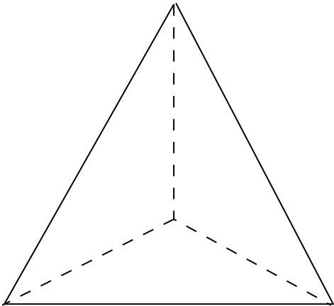

 

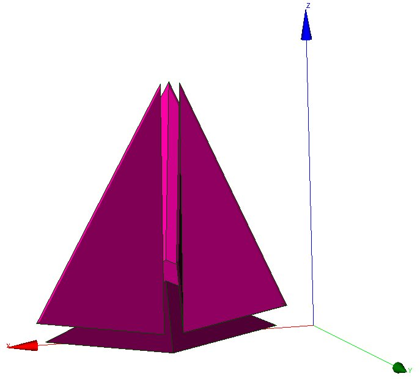

Note that such a cut creates flat elements (anisotropic).

Parameters are:

- **domain_name**  (*type:* string) Name of domain.

----

.. _raffiner_isotrope:

**raffiner_isotrope**
---------------------

**Synonyms:** raffiner_simplexes

For VDF and VEF discretizations, allows to cut triangles/quadrangles or
tetrahedral/hexaedras elements respectively in 4 or 8 new ones by defining new summits
located at the middle of edges (and center of faces and elements for quadrangles and
hexaedra). Such a cut preserves the shape of original elements (isotropic). For 2D
elements: 

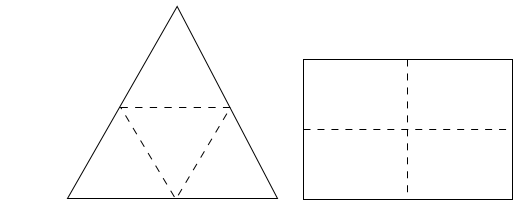

For 3D elements: 

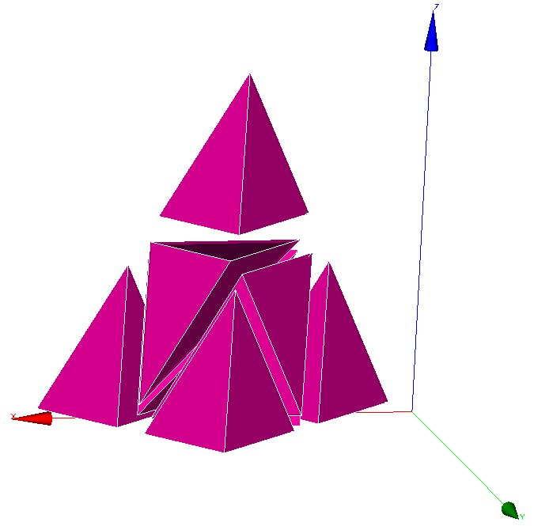

.. image:: images/raffinerisohexa.jpeg
  :alt: images/raffinerisohexa.jpeg
  :scale: 80%
  :align: center

.

Parameters are:

- **domain_name**  (*type:* string) Name of domain.

----

.. _raffiner_isotrope_parallele:

**raffiner_isotrope_parallele**
-------------------------------

Refine parallel mesh in parallel

Parameters are:

- **name_of_initial_domaines | name_of_initial_zones**  (*type:* string) name of initial Domaines

- **name_of_new_domaines | name_of_new_zones**  (*type:* string) name of new Domaines

- **[ascii]**  (*type:* flag) writing Domaines in ascii format

- **[single_hdf]**  (*type:* flag) writing Domaines in hdf format

----

.. _read:

**read**
--------

**Synonyms:** lire

The 'read' instruction in a TRUST dataset. Overriden from the automatic generation to make the second argument a Objet_u.
See also Read_Parser class in base.py module.

Parameters are:

- **identifier**  (*type:* string) Identifier of the class being read. Must match a previous forward Declaration.

- **obj**  (*type:* :ref:`objet_u`) The object being read.

----

.. _read_file:

**read_file**
-------------

**Synonyms:** lire_fichier

Keyword to read the object name_obj contained in the file filename.

This is notably used when the calculation domain has already been meshed and the mesh
contains the file filename, simply write read_file dom filename (where dom is the name of
the meshed domain).

If the filename is ;, is to execute a data set given in the file of name name_obj (a
space must be entered between the semi-colon and the file name).

Parameters are:

- **name_obj**  (*type:* string) Name of the object to be read.

- **filename**  (*type:* string) Name of the file.

----

.. _read_file_bin:

**read_file_bin**
-----------------

**Synonyms:** read_file_binary, lire_fichier_bin

Keyword to read an object name_obj in the unformatted type file filename.

Parameters are:

- **name_obj**  (*type:* string) Name of the object to be read.

- **filename**  (*type:* string) Name of the file.

----

.. _read_med:

**read_med**
------------

**Synonyms:** lire_med, read_med_64

Keyword to read MED mesh files where 'domain' corresponds to the domain name, 'file'
corresponds to the file (written in the MED format) containing the mesh named mesh_name.

Note about naming boundaries: When reading 'file', TRUST will detect boundaries between
domains (Raccord) when the name of the boundary begins by 'type_raccord\_'. For example, a
boundary named type_raccord_wall in 'file' will be considered by TRUST as a boundary named
'wall' between two domains.

NB: To read several domains from a mesh issued from a MED file, use Read_Med to read the
mesh then use Create_domain_from_sub_domain keyword.

NB: If the MED file contains one or several subdomaine defined as a group of volumes,
then Read_MED will read it and will create two files domain_name_ssz.geo and
domain_name_ssz_par.geo defining the subdomaines for sequential and/or parallel
calculations. These subdomaines will be read in sequential in the datafile by including
(after Read_Med keyword) something like:

Read_Med ....

Read_file domain_name_ssz.geo ;

During the parallel calculation, you will include something:

Scatter { ... }

Read_file domain_name_ssz_par.geo ;

Parameters are:

- **[convertalltopoly]**  (*type:* flag) Option to convert mesh with mixed cells into polyhedral/polygonal cells

- **domain | domaine**  (*type:* string) Corresponds to the domain name.

- **file | fichier**  (*type:* string) File (written in the MED format, with extension '.med') containing the mesh

- **[mesh | maillage]**  (*type:* string) Name of the mesh in med file. If not specified, the first mesh will be read.

- **[exclude_groups | exclure_groupes]**  (*type:* list of str) List of face groups to skip in the MED file.

- **[include_additional_face_groups | inclure_groupes_faces_additionnels]**  (*type:* list of str) List of face groups to read and register in the MED file.

----

.. _read_tgrid:

**read_tgrid**
--------------

**Synonyms:** lire_tgrid

Keyword to reaf Tgrid/Gambit mesh files. 2D (triangles or quadrangles) and 3D (tetra or
hexa elements) meshes, may be read by TRUST.

Parameters are:

- **dom**  (*type:* string) Name of domaine.

- **filename**  (*type:* string) Name of file containing the mesh.

----

.. _read_unsupported_ascii_file_from_icem:

**read_unsupported_ascii_file_from_icem**
-----------------------------------------

not_set

Parameters are:

- **name_obj**  (*type:* string) Name of the object to be read.

- **filename**  (*type:* string) Name of the file.

----

.. _rectify_mesh:

**rectify_mesh**
----------------

**Synonyms:** orienter_simplexes

Keyword to raffine a mesh

Parameters are:

- **domain_name**  (*type:* string) Name of domain.

----

.. _redresser_hexaedres_vdf:

**redresser_hexaedres_vdf**
---------------------------

Keyword to convert a domain (named domain_name) with quadrilaterals/VEF hexaedras which
looks like rectangles/VDF hexaedras into a domain with real rectangles/VDF hexaedras.

Parameters are:

- **domain_name**  (*type:* string) Name of domain to resequence.

----

.. _refine_mesh:

**refine_mesh**
---------------

not_set

Parameters are:

- **domaine**  (*type:* string) not_set

----

.. _regroupebord:

**regroupebord**
----------------

Keyword to build one boundary new_bord with several boundaries of the domain named
domaine.

Parameters are:

- **domaine | domain**  (*type:* string) Name of domain

- **new_bord**  (*type:* string) Name of the new boundary

- **bords**  (*type:* :ref:`bloc_lecture`) { Bound1 Bound2 }

----

.. _remove_elem:

**remove_elem**
---------------

Keyword to remove element from a VDF mesh (named domaine_name), either from an explicit
list of elements or from a geometric condition defined by a condition f(x,y)>0 in 2D and
f(x,y,z)>0 in 3D. All the new borders generated are gathered in one boundary called :
newBord (to rename it, use RegroupeBord keyword. To split it to different boundaries, use
DecoupeBord_Pour_Rayonnement keyword). Example of a removed zone of radius 0.2 centered at
(x,y)=(0.5,0.5):

Remove_elem dom { fonction $0.2*0.2-(x-0.5)^2-(y-0.5)^2>0$ }

Warning : the thickness of removed zone has to be large enough to avoid singular nodes as
decribed below : 

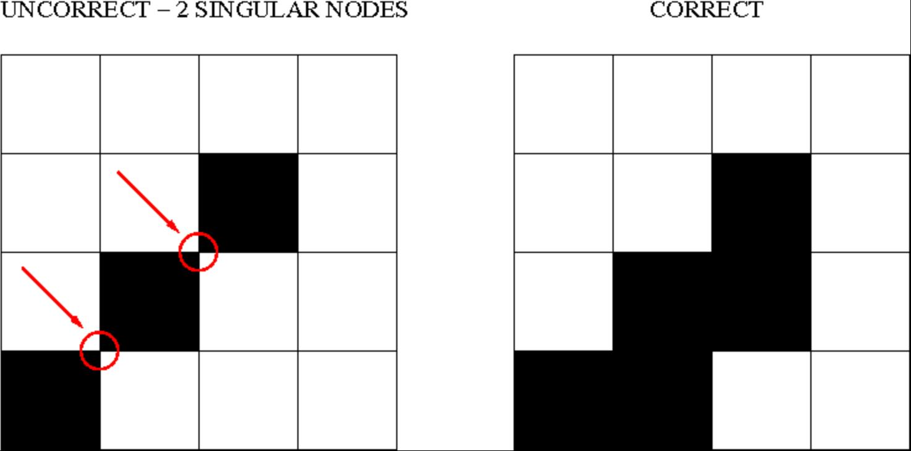

Parameters are:

- **domaine | domain**  (*type:* string) Name of domain

- **bloc**  (*type:* :ref:`remove_elem_bloc`) not_set

----

.. _remove_invalid_internal_boundaries:

**remove_invalid_internal_boundaries**
--------------------------------------

Keyword to suppress an internal boundary of the domain_name domain. Indeed, some mesh
tools may define internal boundaries (eg: for post processing task after the calculation)
but TRUST does not support it yet.

Parameters are:

- **domain_name**  (*type:* string) Name of domain.

----

.. _reorienter_tetraedres:

**reorienter_tetraedres**
-------------------------

This keyword is mandatory for front-tracking computations with the VEF discretization. For
each tetrahedral element of the domain, it checks if it has a positive volume. If the
volume (determinant of the three vectors) is negative, it swaps two nodes to reverse the
orientation of this tetrahedron.

Parameters are:

- **domain_name**  (*type:* string) Name of domain.

----

.. _reorienter_triangles:

**reorienter_triangles**
------------------------

not_set

Parameters are:

- **domain_name**  (*type:* string) Name of domain.

----

.. _resequencing:

**resequencing**
----------------

**Synonyms:** reordonner

The Reordonner_32_64 interpretor is required sometimes for a VDF mesh which is not
produced by the internal mesher. Example where this is used:

Read_file dom fichier.geom

Reordonner_32_64 dom

Observations: This keyword is redundant when the mesh that is read is correctly sequenced
in the TRUST sense. This significant mesh operation may take some time... The message
returned by TRUST is not explicit when the Reordonner_32_64 (Resequencing) keyword is
required but not included in the data set...

Parameters are:

- **domain_name**  (*type:* string) Name of domain to resequence.

----

.. _residuals:

**residuals**
-------------

To specify how the residuals will be computed.

Parameters are:

- **[norm]**  (*type:* string into ['l2', 'max']) allows to choose the norm we want to use (max norm by default). Possible to specify L2-norm.

- **[relative]**  (*type:* string into ['0', '1', '2']) This is the old keyword seuil_statio_relatif_deconseille. If it is set to 1, it will normalize the residuals with the residuals of the first 5 timesteps (default is 0). if set to 2, residual will be computed as R/(max-min).

----

.. _rotation:

**rotation**
------------

Keyword to rotate the geometry of an arbitrary angle around an axis aligned with Ox, Oy or
Oz axis.

Parameters are:

- **domain_name**  (*type:* string) Name of domain to wich the transformation is applied.

- **dir**  (*type:* string into ['x', 'y', 'z']) X, Y or Z to indicate the direction of the rotation axis

- **coord1**  (*type:* float) coordinates of the center of rotation in the plane orthogonal to the rotation axis. These coordinates must be specified in the direct triad sense.

- **coord2**  (*type:* float) not_set

- **angle**  (*type:* float) angle of rotation (in degrees)

----

.. _scatter:

**scatter**
-----------

Class to read a partionned mesh from the files during a parallel calculation. The files
are in binary format.

Parameters are:

- **file**  (*type:* string) Name of file.

- **domaine**  (*type:* string) Name of domain.

----

.. _scattermed:

**scattermed**
--------------

This keyword will read the partition of the domain_name domain into a the MED format files
file.med created by Medsplitter.

Parameters are:

- **file**  (*type:* string) Name of file.

- **domaine**  (*type:* string) Name of domain.

----

.. _solve:

**solve**
---------

**Synonyms:** resoudre

Interpretor to start calculation with TRUST.

Parameters are:

- **pb**  (*type:* string) Name of problem to be solved.

----

.. _stat_per_proc_perf_log:

**stat_per_proc_perf_log**
--------------------------

Keyword allowing to activate the detailed statistics per processor (by default this is
false, and only the master proc will produce stats).

Parameters are:

- **flg**  (*type:* int) A flag that can be either 0 or 1 to turn off (default) or on the detailed stats.

----

.. _supprime_bord:

**supprime_bord**
-----------------

Keyword to remove boundaries (named Boundary_name1 Boundary_name2 ) of the domain named
domain_name.

Parameters are:

- **domaine | domain**  (*type:* string) Name of domain

- **bords**  (*type:* list of Nom_anonyme) List of name.

----

.. _system:

**system**
----------

To run Unix commands from the data file. Example: System \'echo The End | mail
trust@cea.fr\'

Parameters are:

- **cmd**  (*type:* string) command to execute.

----

.. _test_solveur:

**test_solveur**
----------------

To test several solvers

Parameters are:

- **[fichier_secmem]**  (*type:* string) Filename containing the second member B

- **[fichier_matrice]**  (*type:* string) Filename containing the matrix A

- **[fichier_solution]**  (*type:* string) Filename containing the solution x

- **[nb_test]**  (*type:* int) Number of tests to measure the time resolution (one preconditionnement)

- **[impr]**  (*type:* flag) To print the convergence solver

- **[solveur]**  (*type:* :ref:`solveur_sys_base`) To specify a solver

- **[fichier_solveur]**  (*type:* string) To specify a file containing a list of solvers

- **[genere_fichier_solveur]**  (*type:* float) To create a file of the solver with a threshold convergence

- **[seuil_verification]**  (*type:* float) Check if the solution satisfy ||Ax-B||<precision

- **[pas_de_solution_initiale]**  (*type:* flag) Resolution isn\'t initialized with the solution x

- **[ascii]**  (*type:* flag) Ascii files

----

.. _test_sse_kernels:

**test_sse_kernels**
--------------------

Object to test the different kernel methods used in the multigrid solver in IJK
discretization

Parameters are:

- **[nmax]**  (*type:* int) Number of tests we want to perform

----

.. _testeur:

**testeur**
-----------

not_set

Parameters are:

- **data**  (*type:* :ref:`bloc_lecture`) not_set

----

.. _testeur_medcoupling:

**testeur_medcoupling**
-----------------------

not_set

Parameters are:

- **pb_name**  (*type:* string) Name of domain.

- **field_name | filed_name**  (*type:* string) Name of domain.

----

.. _tetraedriser:

**tetraedriser**
----------------

To achieve a tetrahedral mesh based on a mesh comprising blocks, the Tetraedriser
(Tetrahedralise) interpretor is used in VEF discretization. Initial block is divided in 6
tetrahedra: 

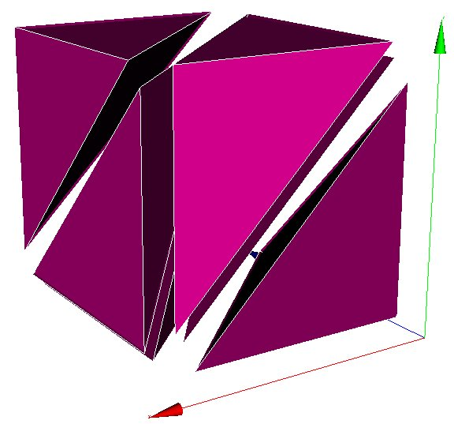

Parameters are:

- **domain_name**  (*type:* string) Name of domain.

----

.. _tetraedriser_homogene:

**tetraedriser_homogene**
-------------------------

Use the Tetraedriser_homogene (Homogeneous_Tetrahedralisation) interpretor in VEF
discretization to mesh a block in tetrahedrals. Each block hexahedral is no longer divided
into 6 tetrahedrals (keyword Tetraedriser (Tetrahedralise)), it is now broken down into 40
tetrahedrals. Thus a block defined with 11 nodes in each X, Y, Z direction will contain
10*10*10*40=40,000 tetrahedrals. This also allows problems in the mesh corners with the
P1NC/P1iso/P1bulle or P1/P1 discretization items to be avoided. Initial block is divided
in 40 tetrahedra: 

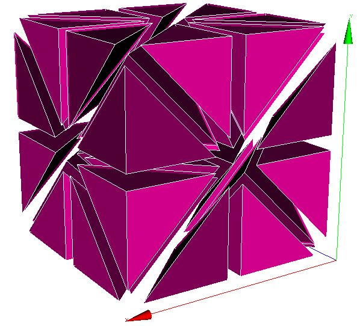

Parameters are:

- **domain_name**  (*type:* string) Name of domain.

----

.. _tetraedriser_homogene_compact:

**tetraedriser_homogene_compact**
---------------------------------

This new discretization generates tetrahedral elements from cartesian or non-cartesian
hexahedral elements. The process cut each hexahedral in 6 pyramids, each of them being cut
then in 4 tetrahedral. So, in comparison with tetra_homogene, less elements (*24 instead
of*40) with more homogeneous volumes are generated. Moreover, this process is done in a
faster way. Initial block is divided in 24 tetrahedra:

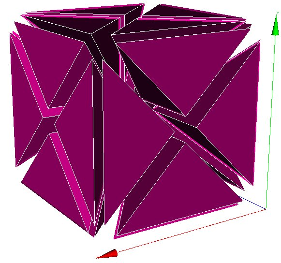

Parameters are:

- **domain_name**  (*type:* string) Name of domain.

----

.. _tetraedriser_homogene_fin:

**tetraedriser_homogene_fin**
-----------------------------

Tetraedriser_homogene_fin is the recommended option to tetrahedralise blocks. As an
extension (subdivision) of Tetraedriser_homogene_compact, this last one cut each initial
block in 48 tetrahedra (against 24, previously). This cutting ensures :

- a correct cutting in the corners (in respect to pressure discretization PreP1B),

- a better isotropy of elements than with Tetraedriser_homogene_compact,

- a better alignment of summits (this could have a benefit effect on calculation near
walls since first elements in contact with it are all contained in the same constant
thickness and ii/ by the way, a 3D cartesian grid based on summits can be engendered and
used to realise spectral analysis in HIT for instance). Initial block is divided in 48
tetrahedra: 

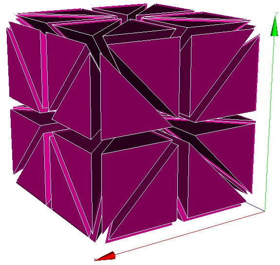

Parameters are:

- **domain_name**  (*type:* string) Name of domain.

----

.. _tetraedriser_par_prisme:

**tetraedriser_par_prisme**
---------------------------

Tetraedriser_par_prisme generates 6 iso-volume tetrahedral element from primary hexahedral
one (contrarily to the 5 elements ordinarily generated by tetraedriser). This element is
suitable for calculation of gradients at the summit (coincident with the gravity centre of
the jointed elements related with) and spectra (due to a better alignment of the points).

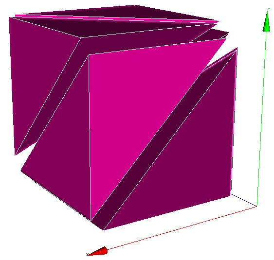

\includepng{{tetraedriserparprisme2.jpeg}}{{5}}

Initial block is divided in 6 prismes.

Parameters are:

- **domain_name**  (*type:* string) Name of domain.

----

.. _transformer:

**transformer**
---------------

Keyword to transform the coordinates of the geometry.

Exemple to rotate your mesh by a 90o rotation and to scale the z coordinates by a factor
2: Transformer domain_name -y -x 2*z

Parameters are:

- **domain_name**  (*type:* string) Name of domain.

- **formule**  (*type:* list of str) Function_for_x Function_for_y \[ Function_for z \]

----

.. _triangulate:

**triangulate**
---------------

**Synonyms:** trianguler

To achieve a triangular mesh from a mesh comprising rectangles (2 triangles per
rectangle). Should be used in VEF discretization. Principle:

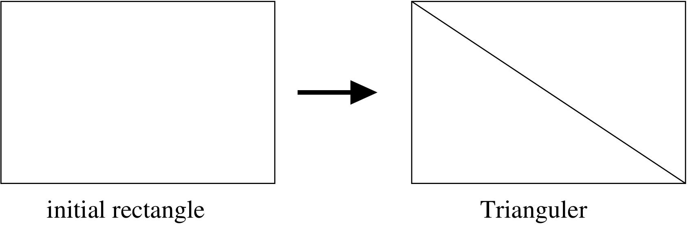

Parameters are:

- **domain_name**  (*type:* string) Name of domain.

----

.. _trianguler_fin:

**trianguler_fin**
------------------

Trianguler_fin is the recommended option to triangulate rectangles.

As an extension (subdivision) of Triangulate_h option, this one cut each initial
rectangle in 8 triangles (against 4, previously). This cutting ensures :

- a correct cutting in the corners (in respect to pressure discretization PreP1B).

- a better isotropy of elements than with Trianguler_h option.

- a better alignment of summits (this could have a benefit effect on calculation near
walls since first elements in contact with it are all contained in the same constant
thickness, and, by this way, a 2D cartesian grid based on summits can be engendered and
used to realize statistical analysis in plane channel configuration for instance).
Principle:

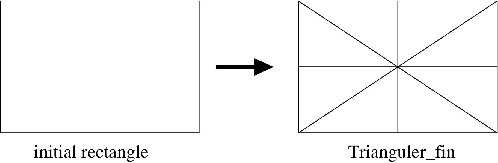

Parameters are:

- **domain_name**  (*type:* string) Name of domain.

----

.. _trianguler_h:

**trianguler_h**
----------------

To achieve a triangular mesh from a mesh comprising rectangles (4 triangles per
rectangle). Should be used in VEF discretization. Principle:

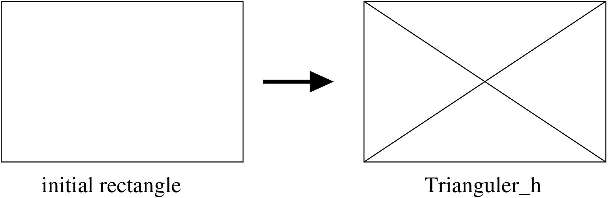

Parameters are:

- **domain_name**  (*type:* string) Name of domain.

----

.. _verifier_qualite_raffinements:

**verifier_qualite_raffinements**
---------------------------------

not_set

Parameters are:

- **domain_names**  (*type:* list of Nom_anonyme) Vect of name.

----

.. _verifier_simplexes:

**verifier_simplexes**
----------------------

Keyword to raffine a simplexes

Parameters are:

- **domain_name**  (*type:* string) Name of domain.

----

.. _verifiercoin:

**verifiercoin**
----------------

This keyword subdivides inconsistent 2D/3D cells used with VEFPreP1B discretization. Must
be used before the mesh is discretized.
The Read_file option can be used only if the file.decoupage_som was previously created by
TRUST. This option, only in 2D, reverses the common face at two cells (at least one is
inconsistent), through the nodes opposed. In 3D, the option has no effect.

The expert_only option deactivates, into the VEFPreP1B divergence operator, the test of
inconsistent cells.

Parameters are:

- **domain_name | dom**  (*type:* string) Name of the domaine

- **bloc**  (*type:* :ref:`verifiercoin_bloc`) not_set

----

.. _write:

**write**
---------

**Synonyms:** ecrire

Keyword to write the object of name name_obj to a standard outlet.

Parameters are:

- **name_obj**  (*type:* string) Name of the object to be written.

----

.. _write_file:

**write_file**
--------------

**Synonyms:** ecrire_fichier_bin, ecrire_fichier

Keyword to write the object of name name_obj to a file filename. Since the v1.6.3, the
default format is now binary format file.

Parameters are:

- **name_obj**  (*type:* string) Name of the object to be written.

- **filename**  (*type:* string) Name of the file.

----

**Keywords derived from loi_etat_base**
=======================================

.. _binaire_gaz_parfait_qc:

**binaire_gaz_parfait_qc**
--------------------------

Class for perfect gas binary mixtures state law used with a quasi-compressible fluid under
the iso-thermal and iso-bar assumptions.

Parameters are:

- **molar_mass1**  (*type:* float) Molar mass of species 1 (in kg/mol).

- **molar_mass2**  (*type:* float) Molar mass of species 2 (in kg/mol).

- **mu1**  (*type:* float) Dynamic viscosity of species 1 (in kg/m.s).

- **mu2**  (*type:* float) Dynamic viscosity of species 2 (in kg/m.s).

- **temperature**  (*type:* float) Temperature (in Kelvin) which will be constant during the simulation since this state law only works for iso-thermal conditions.

- **diffusion_coeff**  (*type:* float) Diffusion coefficient assumed the same for both species (in m2/s).

----

.. _binaire_gaz_parfait_wc:

**binaire_gaz_parfait_wc**
--------------------------

Class for perfect gas binary mixtures state law used with a weakly-compressible fluid
under the iso-thermal and iso-bar assumptions.

Parameters are:

- **molar_mass1**  (*type:* float) Molar mass of species 1 (in kg/mol).

- **molar_mass2**  (*type:* float) Molar mass of species 2 (in kg/mol).

- **mu1**  (*type:* float) Dynamic viscosity of species 1 (in kg/m.s).

- **mu2**  (*type:* float) Dynamic viscosity of species 2 (in kg/m.s).

- **temperature**  (*type:* float) Temperature (in Kelvin) which will be constant during the simulation since this state law only works for iso-thermal conditions.

- **diffusion_coeff**  (*type:* float) Diffusion coefficient assumed the same for both species (in m2/s).

----

.. _coolprop_qc:

**coolprop_qc**
---------------

Class for using CoolProp with QC problem

Parameters are:

- **cp**  (*type:* float) Specific heat at constant pressure (J/kg/K).

- **fluid**  (*type:* string) Fluid name in the CoolProp model

- **model**  (*type:* string) CoolProp model name

----

.. _coolprop_wc:

**coolprop_wc**
---------------

Class for using CoolProp with WC problem

Parameters are:

- **cp**  (*type:* float) Specific heat at constant pressure (J/kg/K).

- **fluid**  (*type:* string) Fluid name in the CoolProp model

- **model**  (*type:* string) CoolProp model name

----

.. _eos_qc:

**eos_qc**
----------

Class for using EOS with QC problem

Parameters are:

- **cp**  (*type:* float) Specific heat at constant pressure (J/kg/K).

- **fluid**  (*type:* string) Fluid name in the EOS model

- **model**  (*type:* string) EOS model name

----

.. _eos_wc:

**eos_wc**
----------

Class for using EOS with WC problem

Parameters are:

- **cp**  (*type:* float) Specific heat at constant pressure (J/kg/K).

- **fluid**  (*type:* string) Fluid name in the EOS model

- **model**  (*type:* string) EOS model name

----

.. _loi_etat_base:

**loi_etat_base**
-----------------

Basic class for state laws used with a dilatable fluid.

----

.. _loi_etat_gaz_parfait_base:

**loi_etat_gaz_parfait_base**
-----------------------------

Basic class for perfect gases state laws used with a dilatable fluid.

----

.. _loi_etat_gaz_reel_base:

**loi_etat_gaz_reel_base**
--------------------------

Basic class for real gases state laws used with a dilatable fluid.

----

.. _loi_etat_tppi_base:

**loi_etat_tppi_base**
----------------------

Basic class for thermo-physical properties interface (TPPI) used for dilatable problems

----

.. _multi_gaz_parfait_qc:

**multi_gaz_parfait_qc**
------------------------

Class for perfect gas multi-species mixtures state law used with a quasi-compressible
fluid.

Parameters are:

- **sc**  (*type:* float) Schmidt number of the gas Sc=nu/D (D: diffusion coefficient of the mixing).

- **prandtl**  (*type:* float) Prandtl number of the gas Pr=mu*Cp/lambda

- **[cp]**  (*type:* float) Specific heat at constant pressure of the gas Cp.

- **[dtol_fraction]**  (*type:* float) Delta tolerance on mass fractions for check testing (default value 1.e-6).

- **[correction_fraction]**  (*type:* flag) To force mass fractions between 0. and 1.

- **[ignore_check_fraction]**  (*type:* flag) Not to check if mass fractions between 0. and 1.

----

.. _multi_gaz_parfait_wc:

**multi_gaz_parfait_wc**
------------------------

Class for perfect gas multi-species mixtures state law used with a weakly-compressible
fluid.

Parameters are:

- **species_number**  (*type:* int) Number of species you are considering in your problem.

- **diffusion_coeff**  (*type:* :ref:`field_base`) Diffusion coefficient of each species, defined with a Champ_uniforme of dimension equals to the species_number.

- **molar_mass**  (*type:* :ref:`field_base`) Molar mass of each species, defined with a Champ_uniforme of dimension equals to the species_number.

- **mu**  (*type:* :ref:`field_base`) Dynamic viscosity of each species, defined with a Champ_uniforme of dimension equals to the species_number.

- **cp**  (*type:* :ref:`field_base`) Specific heat at constant pressure of the gas Cp, defined with a Champ_uniforme of dimension equals to the species_number..

- **prandtl**  (*type:* float) Prandtl number of the gas Pr=mu*Cp/lambda.

----

.. _perfect_gaz_qc:

**perfect_gaz_qc**
------------------

**Synonyms:** gaz_parfait_qc

Class for perfect gas state law used with a quasi-compressible fluid.

Parameters are:

- **cp**  (*type:* float) Specific heat at constant pressure (J/kg/K).

- **[cv]**  (*type:* float) Specific heat at constant volume (J/kg/K).

- **[gamma]**  (*type:* float) Cp/Cv

- **prandtl**  (*type:* float) Prandtl number of the gas Pr=mu*Cp/lambda

- **[rho_constant_pour_debug]**  (*type:* :ref:`field_base`) For developers to debug the code with a constant rho.

----

.. _perfect_gaz_wc:

**perfect_gaz_wc**
------------------

**Synonyms:** gaz_parfait_wc

Class for perfect gas state law used with a weakly-compressible fluid.

Parameters are:

- **cp**  (*type:* float) Specific heat at constant pressure (J/kg/K).

- **[cv]**  (*type:* float) Specific heat at constant volume (J/kg/K).

- **[gamma]**  (*type:* float) Cp/Cv

- **prandtl**  (*type:* float) Prandtl number of the gas Pr=mu*Cp/lambda

----

.. _rhot_gaz_parfait_qc:

**rhot_gaz_parfait_qc**
-----------------------

Class for perfect gas used with a quasi-compressible fluid where the state equation is
defined as rho = f(T).

Parameters are:

- **cp**  (*type:* float) Specific heat at constant pressure of the gas Cp.

- **[prandtl]**  (*type:* float) Prandtl number of the gas Pr=mu*Cp/lambda

- **[rho_xyz]**  (*type:* :ref:`field_base`) Defined with a Champ_Fonc_xyz to define a constant rho with time (space dependent)

- **[rho_t]**  (*type:* string) Expression of T used to calculate rho. This can lead to a variable rho, both in space and in time.

- **[t_min]**  (*type:* float) Temperature may, in some cases, locally and temporarily be very small (and negative) even though computation converges. T_min keyword allows to set a lower limit of temperature (in Kelvin, -1000 by default). WARNING: DO NOT USE THIS KEYWORD WITHOUT CHECKING CAREFULY YOUR RESULTS!

----

.. _rhot_gaz_reel_qc:

**rhot_gaz_reel_qc**
--------------------

Class for real gas state law used with a quasi-compressible fluid.

Parameters are:

- **bloc**  (*type:* :ref:`bloc_lecture`) Description.

----

**Keywords derived from loi_fermeture_base**
============================================

.. _loi_fermeture_base:

**loi_fermeture_base**
----------------------

Class for appends fermeture to problem

----

.. _loi_fermeture_test:

**loi_fermeture_test**
----------------------

Loi for test only

Parameters are:

- **[coef]**  (*type:* float) coefficient

----

**Keywords derived from loi_horaire**
=====================================

.. _loi_horaire:

**loi_horaire**
---------------

to define the movement with a time-dependant law for the solid interface.

Parameters are:

- **position**  (*type:* list of str) Vecteur position

- **vitesse**  (*type:* list of str) Vecteur vitesse

- **[rotation]**  (*type:* list of str) Matrice de passage

- **[derivee_rotation]**  (*type:* list of str) Derivee matrice de passage

- **[verification_derivee]**  (*type:* int) not_set

- **[impr]**  (*type:* int) Whether to print output

----

**Keywords derived from milieu_base**
=====================================

.. _constituant:

**constituant**
---------------

Constituent.

Parameters are:

- **[coefficient_diffusion]**  (*type:* :ref:`field_base`) Constituent diffusion coefficient value (m2.s-1). If a multi-constituent problem is being processed, the diffusivite will be a vectorial and each components will be the diffusion of the constituent.

- **[is_multi_scalar | is_multi_scalar_diffusion]**  (*type:* flag) Flag to activate the multi_scalar diffusion operator

- **[gravite]**  (*type:* :ref:`field_base`) Gravity field (optional).

- **[porosites_champ]**  (*type:* :ref:`field_base`) The porosity is given at each element and the porosity at each face, Psi(face), is calculated by the average of the porosities of the two neighbour elements Psi(elem1), Psi(elem2) : Psi(face)=2/(1/Psi(elem1)+1/Psi(elem2)). This keyword is optional.

- **[diametre_hyd_champ]**  (*type:* :ref:`field_base`) Hydraulic diameter field (optional).

- **[porosites]**  (*type:* :ref:`porosites`) Porosities.

- **[rho]**  (*type:* :ref:`field_base`) Density (kg.m-3).

- **[lambda_ | lambda_u | lambda]**  (*type:* :ref:`field_base`) Conductivity (W.m-1.K-1).

- **[cp]**  (*type:* :ref:`field_base`) Specific heat (J.kg-1.K-1).

----

.. _fluide_base:

**fluide_base**
---------------

Basic class for fluids.

Parameters are:

- **[indice]**  (*type:* :ref:`field_base`) Refractivity of fluid.

- **[kappa]**  (*type:* :ref:`field_base`) Absorptivity of fluid (m-1).

- **[gravite]**  (*type:* :ref:`field_base`) Gravity field (optional).

- **[porosites_champ]**  (*type:* :ref:`field_base`) The porosity is given at each element and the porosity at each face, Psi(face), is calculated by the average of the porosities of the two neighbour elements Psi(elem1), Psi(elem2) : Psi(face)=2/(1/Psi(elem1)+1/Psi(elem2)). This keyword is optional.

- **[diametre_hyd_champ]**  (*type:* :ref:`field_base`) Hydraulic diameter field (optional).

- **[porosites]**  (*type:* :ref:`porosites`) Porosities.

- **[rho]**  (*type:* :ref:`field_base`) Density (kg.m-3).

- **[lambda_ | lambda_u | lambda]**  (*type:* :ref:`field_base`) Conductivity (W.m-1.K-1).

- **[cp]**  (*type:* :ref:`field_base`) Specific heat (J.kg-1.K-1).

----

.. _fluide_dilatable_base:

**fluide_dilatable_base**
-------------------------

Basic class for dilatable fluids.

Parameters are:

- **[indice]**  (*type:* :ref:`field_base`) Refractivity of fluid.

- **[kappa]**  (*type:* :ref:`field_base`) Absorptivity of fluid (m-1).

- **[gravite]**  (*type:* :ref:`field_base`) Gravity field (optional).

- **[porosites_champ]**  (*type:* :ref:`field_base`) The porosity is given at each element and the porosity at each face, Psi(face), is calculated by the average of the porosities of the two neighbour elements Psi(elem1), Psi(elem2) : Psi(face)=2/(1/Psi(elem1)+1/Psi(elem2)). This keyword is optional.

- **[diametre_hyd_champ]**  (*type:* :ref:`field_base`) Hydraulic diameter field (optional).

- **[porosites]**  (*type:* :ref:`porosites`) Porosities.

- **[rho]**  (*type:* :ref:`field_base`) Density (kg.m-3).

- **[lambda_ | lambda_u | lambda]**  (*type:* :ref:`field_base`) Conductivity (W.m-1.K-1).

- **[cp]**  (*type:* :ref:`field_base`) Specific heat (J.kg-1.K-1).

----

.. _fluide_incompressible:

**fluide_incompressible**
-------------------------

Class for non-compressible fluids.

Parameters are:

- **[beta_th]**  (*type:* :ref:`field_base`) Thermal expansion (K-1).

- **[mu]**  (*type:* :ref:`field_base`) Dynamic viscosity (kg.m-1.s-1).

- **[beta_co]**  (*type:* :ref:`field_base`) Volume expansion coefficient values in concentration.

- **[rho]**  (*type:* :ref:`field_base`) Density (kg.m-3).

- **[cp]**  (*type:* :ref:`field_base`) Specific heat (J.kg-1.K-1).

- **[lambda_ | lambda_u | lambda]**  (*type:* :ref:`field_base`) Conductivity (W.m-1.K-1).

- **[porosites]**  (*type:* :ref:`bloc_lecture`) Porosity (optional)

- **[indice]**  (*type:* :ref:`field_base`) Refractivity of fluid.

- **[kappa]**  (*type:* :ref:`field_base`) Absorptivity of fluid (m-1).

- **[gravite]**  (*type:* :ref:`field_base`) Gravity field (optional).

- **[porosites_champ]**  (*type:* :ref:`field_base`) The porosity is given at each element and the porosity at each face, Psi(face), is calculated by the average of the porosities of the two neighbour elements Psi(elem1), Psi(elem2) : Psi(face)=2/(1/Psi(elem1)+1/Psi(elem2)). This keyword is optional.

- **[diametre_hyd_champ]**  (*type:* :ref:`field_base`) Hydraulic diameter field (optional).

----

.. _fluide_ostwald:

**fluide_ostwald**
------------------

Non-Newtonian fluids governed by Ostwald\'s law. The law applicable to stress tensor is:

tau=K(T)*(D:D/2)**((n-1)/2)*D Where:

D refers to the deformation tensor

K refers to fluid consistency (may be a function of the temperature T)

n refers to the fluid structure index n=1 for a Newtonian fluid, n<1 for a rheofluidifier
fluid, n>1 for a rheothickening fluid.

Parameters are:

- **[k]**  (*type:* :ref:`field_base`) Fluid consistency.

- **[n]**  (*type:* :ref:`field_base`) Fluid structure index.

- **[beta_th]**  (*type:* :ref:`field_base`) Thermal expansion (K-1).

- **[mu]**  (*type:* :ref:`field_base`) Dynamic viscosity (kg.m-1.s-1).

- **[beta_co]**  (*type:* :ref:`field_base`) Volume expansion coefficient values in concentration.

- **[rho]**  (*type:* :ref:`field_base`) Density (kg.m-3).

- **[cp]**  (*type:* :ref:`field_base`) Specific heat (J.kg-1.K-1).

- **[lambda_ | lambda_u | lambda]**  (*type:* :ref:`field_base`) Conductivity (W.m-1.K-1).

- **[porosites]**  (*type:* :ref:`bloc_lecture`) Porosity (optional)

- **[indice]**  (*type:* :ref:`field_base`) Refractivity of fluid.

- **[kappa]**  (*type:* :ref:`field_base`) Absorptivity of fluid (m-1).

- **[gravite]**  (*type:* :ref:`field_base`) Gravity field (optional).

- **[porosites_champ]**  (*type:* :ref:`field_base`) The porosity is given at each element and the porosity at each face, Psi(face), is calculated by the average of the porosities of the two neighbour elements Psi(elem1), Psi(elem2) : Psi(face)=2/(1/Psi(elem1)+1/Psi(elem2)). This keyword is optional.

- **[diametre_hyd_champ]**  (*type:* :ref:`field_base`) Hydraulic diameter field (optional).

----

.. _fluide_quasi_compressible:

**fluide_quasi_compressible**
-----------------------------

Quasi-compressible flow with a low mach number assumption; this means that the thermo-
dynamic pressure (used in state law) is uniform in space.

Parameters are:

- **[sutherland]**  (*type:* :ref:`bloc_sutherland`) Sutherland law for viscosity and for conductivity.

- **[pression]**  (*type:* float) Initial thermo-dynamic pressure used in the assosciated state law.

- **[loi_etat]**  (*type:* :ref:`loi_etat_base`) The state law that will be associated to the Quasi-compressible fluid.

- **[traitement_pth]**  (*type:* string into ['edo', 'constant', 'conservation_masse']) Particular treatment for the thermodynamic pressure Pth ; there are three possibilities:  1) with the keyword \'edo\' the code computes Pth solving an O.D.E. ; in this case, the mass is not strictly conserved (it is the default case for quasi compressible computation):  2) the keyword \'conservation_masse\' forces the conservation of the mass (closed geometry or with periodic boundaries condition)  3) the keyword \'constant\' makes it possible to have a constant Pth ; it\'s the good choice when the flow is open (e.g. with pressure boundary conditions).  It is possible to monitor the volume averaged value for temperature and density, plus Pth evolution in the .evol_glob file.

- **[traitement_rho_gravite]**  (*type:* string into ['standard', 'moins_rho_moyen']) It may be :1) \`standard\` : the gravity term is evaluted with rho*g (It is the default). 2) \`moins_rho_moyen\` : the gravity term is evaluated with (rho-rhomoy) *g. Unknown pressure is then P*=P+rhomoy*g*z. It is useful when you apply uniforme pressure boundary condition like P*=0.

- **[temps_debut_prise_en_compte_drho_dt]**  (*type:* float) While time<value, dRho/dt is set to zero (Rho, volumic mass). Useful for some calculation during the first time steps with big variation of temperature and volumic mass.

- **[omega_relaxation_drho_dt]**  (*type:* float) Optional option to have a relaxed algorithm to solve the mass equation. value is used (1 per default) to specify omega.

- **[lambda_ | lambda_u | lambda]**  (*type:* :ref:`field_base`) Conductivity (W.m-1.K-1).

- **[mu]**  (*type:* :ref:`field_base`) Dynamic viscosity (kg.m-1.s-1).

- **[indice]**  (*type:* :ref:`field_base`) Refractivity of fluid.

- **[kappa]**  (*type:* :ref:`field_base`) Absorptivity of fluid (m-1).

- **[gravite]**  (*type:* :ref:`field_base`) Gravity field (optional).

- **[porosites_champ]**  (*type:* :ref:`field_base`) The porosity is given at each element and the porosity at each face, Psi(face), is calculated by the average of the porosities of the two neighbour elements Psi(elem1), Psi(elem2) : Psi(face)=2/(1/Psi(elem1)+1/Psi(elem2)). This keyword is optional.

- **[diametre_hyd_champ]**  (*type:* :ref:`field_base`) Hydraulic diameter field (optional).

- **[porosites]**  (*type:* :ref:`porosites`) Porosities.

- **[rho]**  (*type:* :ref:`field_base`) Density (kg.m-3).

- **[cp]**  (*type:* :ref:`field_base`) Specific heat (J.kg-1.K-1).

----

.. _fluide_reel_base:

**fluide_reel_base**
--------------------

Class for real fluids.

Parameters are:

- **[indice]**  (*type:* :ref:`field_base`) Refractivity of fluid.

- **[kappa]**  (*type:* :ref:`field_base`) Absorptivity of fluid (m-1).

- **[gravite]**  (*type:* :ref:`field_base`) Gravity field (optional).

- **[porosites_champ]**  (*type:* :ref:`field_base`) The porosity is given at each element and the porosity at each face, Psi(face), is calculated by the average of the porosities of the two neighbour elements Psi(elem1), Psi(elem2) : Psi(face)=2/(1/Psi(elem1)+1/Psi(elem2)). This keyword is optional.

- **[diametre_hyd_champ]**  (*type:* :ref:`field_base`) Hydraulic diameter field (optional).

- **[porosites]**  (*type:* :ref:`porosites`) Porosities.

- **[rho]**  (*type:* :ref:`field_base`) Density (kg.m-3).

- **[lambda_ | lambda_u | lambda]**  (*type:* :ref:`field_base`) Conductivity (W.m-1.K-1).

- **[cp]**  (*type:* :ref:`field_base`) Specific heat (J.kg-1.K-1).

----

.. _fluide_sodium_gaz:

**fluide_sodium_gaz**
---------------------

Class for Fluide_sodium_liquide

Parameters are:

- **[p_ref]**  (*type:* float) Use to set the pressure value in the closure law. If not specified, the value of the pressure unknown will be used

- **[t_ref]**  (*type:* float) Use to set the temperature value in the closure law. If not specified, the value of the temperature unknown will be used

- **[indice]**  (*type:* :ref:`field_base`) Refractivity of fluid.

- **[kappa]**  (*type:* :ref:`field_base`) Absorptivity of fluid (m-1).

- **[gravite]**  (*type:* :ref:`field_base`) Gravity field (optional).

- **[porosites_champ]**  (*type:* :ref:`field_base`) The porosity is given at each element and the porosity at each face, Psi(face), is calculated by the average of the porosities of the two neighbour elements Psi(elem1), Psi(elem2) : Psi(face)=2/(1/Psi(elem1)+1/Psi(elem2)). This keyword is optional.

- **[diametre_hyd_champ]**  (*type:* :ref:`field_base`) Hydraulic diameter field (optional).

- **[porosites]**  (*type:* :ref:`porosites`) Porosities.

- **[rho]**  (*type:* :ref:`field_base`) Density (kg.m-3).

- **[lambda_ | lambda_u | lambda]**  (*type:* :ref:`field_base`) Conductivity (W.m-1.K-1).

- **[cp]**  (*type:* :ref:`field_base`) Specific heat (J.kg-1.K-1).

----

.. _fluide_sodium_liquide:

**fluide_sodium_liquide**
-------------------------

Class for Fluide_sodium_liquide

Parameters are:

- **[p_ref]**  (*type:* float) Use to set the pressure value in the closure law. If not specified, the value of the pressure unknown will be used

- **[t_ref]**  (*type:* float) Use to set the temperature value in the closure law. If not specified, the value of the temperature unknown will be used

- **[indice]**  (*type:* :ref:`field_base`) Refractivity of fluid.

- **[kappa]**  (*type:* :ref:`field_base`) Absorptivity of fluid (m-1).

- **[gravite]**  (*type:* :ref:`field_base`) Gravity field (optional).

- **[porosites_champ]**  (*type:* :ref:`field_base`) The porosity is given at each element and the porosity at each face, Psi(face), is calculated by the average of the porosities of the two neighbour elements Psi(elem1), Psi(elem2) : Psi(face)=2/(1/Psi(elem1)+1/Psi(elem2)). This keyword is optional.

- **[diametre_hyd_champ]**  (*type:* :ref:`field_base`) Hydraulic diameter field (optional).

- **[porosites]**  (*type:* :ref:`porosites`) Porosities.

- **[rho]**  (*type:* :ref:`field_base`) Density (kg.m-3).

- **[lambda_ | lambda_u | lambda]**  (*type:* :ref:`field_base`) Conductivity (W.m-1.K-1).

- **[cp]**  (*type:* :ref:`field_base`) Specific heat (J.kg-1.K-1).

----

.. _fluide_stiffened_gas:

**fluide_stiffened_gas**
------------------------

Class for Stiffened Gas

Parameters are:

- **[gamma]**  (*type:* float) Heat capacity ratio (Cp/Cv)

- **[pinf]**  (*type:* float) Stiffened gas pressure constant (if set to zero, the state law becomes identical to that of perfect gases)

- **[mu]**  (*type:* float) Dynamic viscosity

- **[lambda_ | lambda_u | lambda]**  (*type:* float) Thermal conductivity

- **[cv]**  (*type:* float) Thermal capacity at constant volume

- **[q]**  (*type:* float) Reference energy

- **[q_prim]**  (*type:* float) Model constant

- **[indice]**  (*type:* :ref:`field_base`) Refractivity of fluid.

- **[kappa]**  (*type:* :ref:`field_base`) Absorptivity of fluid (m-1).

- **[gravite]**  (*type:* :ref:`field_base`) Gravity field (optional).

- **[porosites_champ]**  (*type:* :ref:`field_base`) The porosity is given at each element and the porosity at each face, Psi(face), is calculated by the average of the porosities of the two neighbour elements Psi(elem1), Psi(elem2) : Psi(face)=2/(1/Psi(elem1)+1/Psi(elem2)). This keyword is optional.

- **[diametre_hyd_champ]**  (*type:* :ref:`field_base`) Hydraulic diameter field (optional).

- **[porosites]**  (*type:* :ref:`porosites`) Porosities.

- **[rho]**  (*type:* :ref:`field_base`) Density (kg.m-3).

- **[cp]**  (*type:* :ref:`field_base`) Specific heat (J.kg-1.K-1).

----

.. _fluide_weakly_compressible:

**fluide_weakly_compressible**
------------------------------

Weakly-compressible flow with a low mach number assumption; this means that the thermo-
dynamic pressure (used in state law) can vary in space.

Parameters are:

- **[loi_etat]**  (*type:* :ref:`loi_etat_base`) The state law that will be associated to the Weakly-compressible fluid.

- **[sutherland]**  (*type:* :ref:`bloc_sutherland`) Sutherland law for viscosity and for conductivity.

- **[traitement_pth]**  (*type:* string into ['constant']) Particular treatment for the thermodynamic pressure Pth ; there is currently one possibility:  1) the keyword \'constant\' makes it possible to have a constant Pth but not uniform in space ; it\'s the good choice when the flow is open (e.g. with pressure boundary conditions).

- **[lambda_ | lambda_u | lambda]**  (*type:* :ref:`field_base`) Conductivity (W.m-1.K-1).

- **[mu]**  (*type:* :ref:`field_base`) Dynamic viscosity (kg.m-1.s-1).

- **[pression_thermo]**  (*type:* float) Initial thermo-dynamic pressure used in the assosciated state law.

- **[pression_xyz]**  (*type:* :ref:`field_base`) Initial thermo-dynamic pressure used in the assosciated state law. It should be defined with as a Champ_Fonc_xyz.

- **[use_total_pressure]**  (*type:* int) Flag (0 or 1) used to activate and use the total pressure in the assosciated state law. The default value of this Flag is 0.

- **[use_hydrostatic_pressure]**  (*type:* int) Flag (0 or 1) used to activate and use the hydro-static pressure in the assosciated state law. The default value of this Flag is 0.

- **[use_grad_pression_eos]**  (*type:* int) Flag (0 or 1) used to specify whether or not the gradient of the thermo-dynamic pressure will be taken into account in the source term of the temperature equation (case of a non-uniform pressure). The default value of this Flag is 1 which means that the gradient is used in the source.

- **[time_activate_ptot]**  (*type:* float) Time (in seconds) at which the total pressure will be used in the assosciated state law.

- **[indice]**  (*type:* :ref:`field_base`) Refractivity of fluid.

- **[kappa]**  (*type:* :ref:`field_base`) Absorptivity of fluid (m-1).

- **[gravite]**  (*type:* :ref:`field_base`) Gravity field (optional).

- **[porosites_champ]**  (*type:* :ref:`field_base`) The porosity is given at each element and the porosity at each face, Psi(face), is calculated by the average of the porosities of the two neighbour elements Psi(elem1), Psi(elem2) : Psi(face)=2/(1/Psi(elem1)+1/Psi(elem2)). This keyword is optional.

- **[diametre_hyd_champ]**  (*type:* :ref:`field_base`) Hydraulic diameter field (optional).

- **[porosites]**  (*type:* :ref:`porosites`) Porosities.

- **[rho]**  (*type:* :ref:`field_base`) Density (kg.m-3).

- **[cp]**  (*type:* :ref:`field_base`) Specific heat (J.kg-1.K-1).

----

.. _milieu_base:

**milieu_base**
---------------

Basic class for medium (physics properties of medium).

Parameters are:

- **[gravite]**  (*type:* :ref:`field_base`) Gravity field (optional).

- **[porosites_champ]**  (*type:* :ref:`field_base`) The porosity is given at each element and the porosity at each face, Psi(face), is calculated by the average of the porosities of the two neighbour elements Psi(elem1), Psi(elem2) : Psi(face)=2/(1/Psi(elem1)+1/Psi(elem2)). This keyword is optional.

- **[diametre_hyd_champ]**  (*type:* :ref:`field_base`) Hydraulic diameter field (optional).

- **[porosites]**  (*type:* :ref:`porosites`) Porosities.

- **[rho]**  (*type:* :ref:`field_base`) Density (kg.m-3).

- **[lambda_ | lambda_u | lambda]**  (*type:* :ref:`field_base`) Conductivity (W.m-1.K-1).

- **[cp]**  (*type:* :ref:`field_base`) Specific heat (J.kg-1.K-1).

----

.. _solide:

**solide**
----------

Solid with cp and/or rho non-uniform.

Parameters are:

- **[rho]**  (*type:* :ref:`field_base`) Density (kg.m-3).

- **[cp]**  (*type:* :ref:`field_base`) Specific heat (J.kg-1.K-1).

- **[lambda_ | lambda_u | lambda]**  (*type:* :ref:`field_base`) Conductivity (W.m-1.K-1).

- **[user_field]**  (*type:* :ref:`field_base`) user defined field.

- **[gravite]**  (*type:* :ref:`field_base`) Gravity field (optional).

- **[porosites_champ]**  (*type:* :ref:`field_base`) The porosity is given at each element and the porosity at each face, Psi(face), is calculated by the average of the porosities of the two neighbour elements Psi(elem1), Psi(elem2) : Psi(face)=2/(1/Psi(elem1)+1/Psi(elem2)). This keyword is optional.

- **[diametre_hyd_champ]**  (*type:* :ref:`field_base`) Hydraulic diameter field (optional).

- **[porosites]**  (*type:* :ref:`porosites`) Porosities.

----

**Keywords derived from modele_turbulence_scal_base**
=====================================================

.. _modele_turbulence_scal_base:

**modele_turbulence_scal_base**
-------------------------------

Basic class for turbulence model for energy equation.

Parameters are:

- **[dt_impr_nusselt]**  (*type:* float) Keyword to print local values of Nusselt number and temperature near a wall during a turbulent calculation. The values will be printed in the _Nusselt.face file each dt_impr_nusselt time period. The local Nusselt expression is as follows : Nu = ((lambda+lambda_t)/lambda)*d_wall/d_eq where d_wall is the distance from the first mesh to the wall and d_eq is given by the wall law. This option also gives the value of d_eq and h = (lambda+lambda_t)/d_eq and the fluid temperature of the first mesh near the wall.  For the Neumann boundary conditions (flux_impose), the <<equivalent>> wall temperature given by the wall law is also printed (Tparoi equiv.) preceded for VEF calculation by the edge temperature <<T face de bord>>.

- **[dt_impr_nusselt_mean_only]**  (*type:* :ref:`dt_impr_nusselt_mean_only`) This keyword is used to print the mean values of Nusselt ( obtained with the wall laws) on each boundary, into a file named datafile_ProblemName_nusselt_mean_only.out. periode refers to the printing period, this value is expressed in seconds. If you don\'t use the optional keyword boundaries, all the boundaries will be considered. If you use it, you must specify nb_boundaries which is the number of boundaries on which you want to calculate the mean values, then you have to specify their names.

- **[turbulence_paroi]**  (*type:* :ref:`turbulence_paroi_scalaire_base`) Keyword to set the wall law.

----

.. _modele_turbulence_scal_null:

**modele_turbulence_scal_null**
-------------------------------

**Synonyms:** null

Null scalar turbulence model (turbulent diffusivity = 0) which can be used with a
turbulent problem.

Parameters are:

- **[dt_impr_nusselt]**  (*type:* float) Keyword to print local values of Nusselt number and temperature near a wall during a turbulent calculation. The values will be printed in the _Nusselt.face file each dt_impr_nusselt time period. The local Nusselt expression is as follows : Nu = ((lambda+lambda_t)/lambda)*d_wall/d_eq where d_wall is the distance from the first mesh to the wall and d_eq is given by the wall law. This option also gives the value of d_eq and h = (lambda+lambda_t)/d_eq and the fluid temperature of the first mesh near the wall.  For the Neumann boundary conditions (flux_impose), the <<equivalent>> wall temperature given by the wall law is also printed (Tparoi equiv.) preceded for VEF calculation by the edge temperature <<T face de bord>>.

- **[dt_impr_nusselt_mean_only]**  (*type:* :ref:`dt_impr_nusselt_mean_only`) This keyword is used to print the mean values of Nusselt ( obtained with the wall laws) on each boundary, into a file named datafile_ProblemName_nusselt_mean_only.out. periode refers to the printing period, this value is expressed in seconds. If you don\'t use the optional keyword boundaries, all the boundaries will be considered. If you use it, you must specify nb_boundaries which is the number of boundaries on which you want to calculate the mean values, then you have to specify their names.

----

.. _prandtl:

**prandtl**
-----------

The Prandtl model. For the scalar equations, only the model based on Reynolds analogy is
available. If K_Epsilon was selected in the hydraulic equation, Prandtl must be selected
for the convection-diffusion temperature equation coupled to the hydraulic equation and
Schmidt for the concentration equations.

Parameters are:

- **[prdt]**  (*type:* string) Keyword to modify the constant (Prdt) of Prandtl model : Alphat=Nut/Prdt Default value is 0.9

- **[prandt_turbulent_fonction_nu_t_alpha]**  (*type:* string) Optional keyword to specify turbulent diffusivity (by default, alpha_t=nu_t/Prt) with another formulae, for example: alpha_t=nu_t2/(0,7*alpha+0,85*nu_tt) with the string nu_t*nu_t/(0,7*alpha+0,85*nu_t) where alpha is the thermal diffusivity.

- **[dt_impr_nusselt]**  (*type:* float) Keyword to print local values of Nusselt number and temperature near a wall during a turbulent calculation. The values will be printed in the _Nusselt.face file each dt_impr_nusselt time period. The local Nusselt expression is as follows : Nu = ((lambda+lambda_t)/lambda)*d_wall/d_eq where d_wall is the distance from the first mesh to the wall and d_eq is given by the wall law. This option also gives the value of d_eq and h = (lambda+lambda_t)/d_eq and the fluid temperature of the first mesh near the wall.  For the Neumann boundary conditions (flux_impose), the <<equivalent>> wall temperature given by the wall law is also printed (Tparoi equiv.) preceded for VEF calculation by the edge temperature <<T face de bord>>.

- **[dt_impr_nusselt_mean_only]**  (*type:* :ref:`dt_impr_nusselt_mean_only`) This keyword is used to print the mean values of Nusselt ( obtained with the wall laws) on each boundary, into a file named datafile_ProblemName_nusselt_mean_only.out. periode refers to the printing period, this value is expressed in seconds. If you don\'t use the optional keyword boundaries, all the boundaries will be considered. If you use it, you must specify nb_boundaries which is the number of boundaries on which you want to calculate the mean values, then you have to specify their names.

- **[turbulence_paroi]**  (*type:* :ref:`turbulence_paroi_scalaire_base`) Keyword to set the wall law.

----

.. _schmidt:

**schmidt**
-----------

The Schmidt model. For the scalar equations, only the model based on Reynolds analogy is
available. If K_Epsilon was selected in the hydraulic equation, Schmidt must be selected
for the convection-diffusion temperature equation coupled to the hydraulic equation and
Schmidt for the concentration equations.

Parameters are:

- **[scturb]**  (*type:* float) Keyword to modify the constant (Sct) of Schmlidt model : Dt=Nut/Sct Default value is 0.7.

- **[dt_impr_nusselt]**  (*type:* float) Keyword to print local values of Nusselt number and temperature near a wall during a turbulent calculation. The values will be printed in the _Nusselt.face file each dt_impr_nusselt time period. The local Nusselt expression is as follows : Nu = ((lambda+lambda_t)/lambda)*d_wall/d_eq where d_wall is the distance from the first mesh to the wall and d_eq is given by the wall law. This option also gives the value of d_eq and h = (lambda+lambda_t)/d_eq and the fluid temperature of the first mesh near the wall.  For the Neumann boundary conditions (flux_impose), the <<equivalent>> wall temperature given by the wall law is also printed (Tparoi equiv.) preceded for VEF calculation by the edge temperature <<T face de bord>>.

- **[dt_impr_nusselt_mean_only]**  (*type:* :ref:`dt_impr_nusselt_mean_only`) This keyword is used to print the mean values of Nusselt ( obtained with the wall laws) on each boundary, into a file named datafile_ProblemName_nusselt_mean_only.out. periode refers to the printing period, this value is expressed in seconds. If you don\'t use the optional keyword boundaries, all the boundaries will be considered. If you use it, you must specify nb_boundaries which is the number of boundaries on which you want to calculate the mean values, then you have to specify their names.

- **[turbulence_paroi]**  (*type:* :ref:`turbulence_paroi_scalaire_base`) Keyword to set the wall law.

----

**Keywords derived from mor_eqn**
=================================

.. _conduction:

**conduction**
--------------

Heat equation.

Parameters are:

- **[disable_equation_residual]**  (*type:* string) The equation residual will not be used for the problem residual used when checking time convergence or computing dynamic time-step

- **[convection]**  (*type:* :ref:`bloc_convection`) Keyword to alter the convection scheme.

- **[diffusion]**  (*type:* :ref:`bloc_diffusion`) Keyword to specify the diffusion operator.

- **[conditions_limites | boundary_conditions]**  (*type:* list of Condlimlu) Boundary conditions.

- **[conditions_initiales | initial_conditions]**  (*type:* list of Condinit) Initial conditions.

- **[sources]**  (*type:* list of Source_base) The sources.

- **[ecrire_fichier_xyz_valeur]**  (*type:* :ref:`ecrire_fichier_xyz_valeur`) This keyword is used to write the values of a field only for some boundaries in a text file

- **[parametre_equation]**  (*type:* :ref:`parametre_equation_base`) Keyword used to specify additional parameters for the equation

- **[equation_non_resolue]**  (*type:* string) The equation will not be solved while condition(t) is verified if equation_non_resolue keyword is used. Exemple: The Navier-Stokes equations are not solved between time t0 and t1.  Navier_Sokes_Standard  { equation_non_resolue (t>t0)*(t<t1) }

- **[renommer_equation | rename_equation]**  (*type:* string) Rename the equation with a specific name.

----

.. _conduction_ibm:

**conduction_ibm**
------------------

IBM Heat equation.

Parameters are:

- **[correction_variable_initiale]**  (*type:* int) Modify initial variable

- **[disable_equation_residual]**  (*type:* string) The equation residual will not be used for the problem residual used when checking time convergence or computing dynamic time-step

- **[convection]**  (*type:* :ref:`bloc_convection`) Keyword to alter the convection scheme.

- **[diffusion]**  (*type:* :ref:`bloc_diffusion`) Keyword to specify the diffusion operator.

- **[conditions_limites | boundary_conditions]**  (*type:* list of Condlimlu) Boundary conditions.

- **[conditions_initiales | initial_conditions]**  (*type:* list of Condinit) Initial conditions.

- **[sources]**  (*type:* list of Source_base) The sources.

- **[ecrire_fichier_xyz_valeur]**  (*type:* :ref:`ecrire_fichier_xyz_valeur`) This keyword is used to write the values of a field only for some boundaries in a text file

- **[parametre_equation]**  (*type:* :ref:`parametre_equation_base`) Keyword used to specify additional parameters for the equation

- **[equation_non_resolue]**  (*type:* string) The equation will not be solved while condition(t) is verified if equation_non_resolue keyword is used. Exemple: The Navier-Stokes equations are not solved between time t0 and t1.  Navier_Sokes_Standard  { equation_non_resolue (t>t0)*(t<t1) }

- **[renommer_equation | rename_equation]**  (*type:* string) Rename the equation with a specific name.

----

.. _convection_diffusion_chaleur_qc:

**convection_diffusion_chaleur_qc**
-----------------------------------

Temperature equation for a quasi-compressible fluid.

Parameters are:

- **[mode_calcul_convection]**  (*type:* string into ['ancien', 'divut_moins_tdivu', 'divrhout_moins_tdivrhou']) Option to set the form of the convective operator divrhouT_moins_Tdivrhou (the default since 1.6.8): rho.u.gradT = div(rho.u.T )- Tdiv(rho.u.1) ancien: u.gradT = div(u.T) - T.div(u)  divuT_moins_Tdivu : u.gradT = div(u.T) - Tdiv(u.1)

- **[disable_equation_residual]**  (*type:* string) The equation residual will not be used for the problem residual used when checking time convergence or computing dynamic time-step

- **[convection]**  (*type:* :ref:`bloc_convection`) Keyword to alter the convection scheme.

- **[diffusion]**  (*type:* :ref:`bloc_diffusion`) Keyword to specify the diffusion operator.

- **[conditions_limites | boundary_conditions]**  (*type:* list of Condlimlu) Boundary conditions.

- **[conditions_initiales | initial_conditions]**  (*type:* list of Condinit) Initial conditions.

- **[sources]**  (*type:* list of Source_base) The sources.

- **[ecrire_fichier_xyz_valeur]**  (*type:* :ref:`ecrire_fichier_xyz_valeur`) This keyword is used to write the values of a field only for some boundaries in a text file

- **[parametre_equation]**  (*type:* :ref:`parametre_equation_base`) Keyword used to specify additional parameters for the equation

- **[equation_non_resolue]**  (*type:* string) The equation will not be solved while condition(t) is verified if equation_non_resolue keyword is used. Exemple: The Navier-Stokes equations are not solved between time t0 and t1.  Navier_Sokes_Standard  { equation_non_resolue (t>t0)*(t<t1) }

- **[renommer_equation | rename_equation]**  (*type:* string) Rename the equation with a specific name.

----

.. _convection_diffusion_chaleur_turbulent_qc:

**convection_diffusion_chaleur_turbulent_qc**
---------------------------------------------

Temperature equation for a quasi-compressible fluid as well as the associated turbulence
model equations.

Parameters are:

- **[modele_turbulence]**  (*type:* :ref:`modele_turbulence_scal_base`) Turbulence model for the temperature (energy) conservation equation.

- **[mode_calcul_convection]**  (*type:* string into ['ancien', 'divut_moins_tdivu', 'divrhout_moins_tdivrhou']) Option to set the form of the convective operator divrhouT_moins_Tdivrhou (the default since 1.6.8): rho.u.gradT = div(rho.u.T )- Tdiv(rho.u.1) ancien: u.gradT = div(u.T) - T.div(u)  divuT_moins_Tdivu : u.gradT = div(u.T) - Tdiv(u.1)

- **[disable_equation_residual]**  (*type:* string) The equation residual will not be used for the problem residual used when checking time convergence or computing dynamic time-step

- **[convection]**  (*type:* :ref:`bloc_convection`) Keyword to alter the convection scheme.

- **[diffusion]**  (*type:* :ref:`bloc_diffusion`) Keyword to specify the diffusion operator.

- **[conditions_limites | boundary_conditions]**  (*type:* list of Condlimlu) Boundary conditions.

- **[conditions_initiales | initial_conditions]**  (*type:* list of Condinit) Initial conditions.

- **[sources]**  (*type:* list of Source_base) The sources.

- **[ecrire_fichier_xyz_valeur]**  (*type:* :ref:`ecrire_fichier_xyz_valeur`) This keyword is used to write the values of a field only for some boundaries in a text file

- **[parametre_equation]**  (*type:* :ref:`parametre_equation_base`) Keyword used to specify additional parameters for the equation

- **[equation_non_resolue]**  (*type:* string) The equation will not be solved while condition(t) is verified if equation_non_resolue keyword is used. Exemple: The Navier-Stokes equations are not solved between time t0 and t1.  Navier_Sokes_Standard  { equation_non_resolue (t>t0)*(t<t1) }

- **[renommer_equation | rename_equation]**  (*type:* string) Rename the equation with a specific name.

----

.. _convection_diffusion_chaleur_wc:

**convection_diffusion_chaleur_wc**
-----------------------------------

Temperature equation for a weakly-compressible fluid.

Parameters are:

- **[disable_equation_residual]**  (*type:* string) The equation residual will not be used for the problem residual used when checking time convergence or computing dynamic time-step

- **[convection]**  (*type:* :ref:`bloc_convection`) Keyword to alter the convection scheme.

- **[diffusion]**  (*type:* :ref:`bloc_diffusion`) Keyword to specify the diffusion operator.

- **[conditions_limites | boundary_conditions]**  (*type:* list of Condlimlu) Boundary conditions.

- **[conditions_initiales | initial_conditions]**  (*type:* list of Condinit) Initial conditions.

- **[sources]**  (*type:* list of Source_base) The sources.

- **[ecrire_fichier_xyz_valeur]**  (*type:* :ref:`ecrire_fichier_xyz_valeur`) This keyword is used to write the values of a field only for some boundaries in a text file

- **[parametre_equation]**  (*type:* :ref:`parametre_equation_base`) Keyword used to specify additional parameters for the equation

- **[equation_non_resolue]**  (*type:* string) The equation will not be solved while condition(t) is verified if equation_non_resolue keyword is used. Exemple: The Navier-Stokes equations are not solved between time t0 and t1.  Navier_Sokes_Standard  { equation_non_resolue (t>t0)*(t<t1) }

- **[renommer_equation | rename_equation]**  (*type:* string) Rename the equation with a specific name.

----

.. _convection_diffusion_concentration:

**convection_diffusion_concentration**
--------------------------------------

Constituent transport vectorial equation (concentration diffusion convection).

Parameters are:

- **[nom_inconnue]**  (*type:* string) Keyword Nom_inconnue will rename the unknown of this equation with the given name. In the postprocessing part, the concentration field will be accessible with this name. This is usefull if you want to track more than one concentration (otherwise, only the concentration field in the first concentration equation can be accessed).

- **[alias]**  (*type:* string) not_set

- **[masse_molaire]**  (*type:* float) not_set

- **[is_multi_scalar | is_multi_scalar_diffusion]**  (*type:* flag) Flag to activate the multi_scalar diffusion operator

- **[disable_equation_residual]**  (*type:* string) The equation residual will not be used for the problem residual used when checking time convergence or computing dynamic time-step

- **[convection]**  (*type:* :ref:`bloc_convection`) Keyword to alter the convection scheme.

- **[diffusion]**  (*type:* :ref:`bloc_diffusion`) Keyword to specify the diffusion operator.

- **[conditions_limites | boundary_conditions]**  (*type:* list of Condlimlu) Boundary conditions.

- **[conditions_initiales | initial_conditions]**  (*type:* list of Condinit) Initial conditions.

- **[sources]**  (*type:* list of Source_base) The sources.

- **[ecrire_fichier_xyz_valeur]**  (*type:* :ref:`ecrire_fichier_xyz_valeur`) This keyword is used to write the values of a field only for some boundaries in a text file

- **[parametre_equation]**  (*type:* :ref:`parametre_equation_base`) Keyword used to specify additional parameters for the equation

- **[equation_non_resolue]**  (*type:* string) The equation will not be solved while condition(t) is verified if equation_non_resolue keyword is used. Exemple: The Navier-Stokes equations are not solved between time t0 and t1.  Navier_Sokes_Standard  { equation_non_resolue (t>t0)*(t<t1) }

- **[renommer_equation | rename_equation]**  (*type:* string) Rename the equation with a specific name.

----

.. _convection_diffusion_concentration_turbulent:

**convection_diffusion_concentration_turbulent**
------------------------------------------------

Constituent transport equations (concentration diffusion convection) as well as the
associated turbulence model equations.

Parameters are:

- **[modele_turbulence]**  (*type:* :ref:`modele_turbulence_scal_base`) Turbulence model to be used in the constituent transport equations. The only model currently available is Schmidt.

- **[nom_inconnue]**  (*type:* string) Keyword Nom_inconnue will rename the unknown of this equation with the given name. In the postprocessing part, the concentration field will be accessible with this name. This is usefull if you want to track more than one concentration (otherwise, only the concentration field in the first concentration equation can be accessed).

- **[alias]**  (*type:* string) not_set

- **[masse_molaire]**  (*type:* float) not_set

- **[is_multi_scalar | is_multi_scalar_diffusion]**  (*type:* flag) Flag to activate the multi_scalar diffusion operator

- **[disable_equation_residual]**  (*type:* string) The equation residual will not be used for the problem residual used when checking time convergence or computing dynamic time-step

- **[convection]**  (*type:* :ref:`bloc_convection`) Keyword to alter the convection scheme.

- **[diffusion]**  (*type:* :ref:`bloc_diffusion`) Keyword to specify the diffusion operator.

- **[conditions_limites | boundary_conditions]**  (*type:* list of Condlimlu) Boundary conditions.

- **[conditions_initiales | initial_conditions]**  (*type:* list of Condinit) Initial conditions.

- **[sources]**  (*type:* list of Source_base) The sources.

- **[ecrire_fichier_xyz_valeur]**  (*type:* :ref:`ecrire_fichier_xyz_valeur`) This keyword is used to write the values of a field only for some boundaries in a text file

- **[parametre_equation]**  (*type:* :ref:`parametre_equation_base`) Keyword used to specify additional parameters for the equation

- **[equation_non_resolue]**  (*type:* string) The equation will not be solved while condition(t) is verified if equation_non_resolue keyword is used. Exemple: The Navier-Stokes equations are not solved between time t0 and t1.  Navier_Sokes_Standard  { equation_non_resolue (t>t0)*(t<t1) }

- **[renommer_equation | rename_equation]**  (*type:* string) Rename the equation with a specific name.

----

.. _convection_diffusion_espece_binaire_qc:

**convection_diffusion_espece_binaire_qc**
------------------------------------------

Species conservation equation for a binary quasi-compressible fluid.

Parameters are:

- **[disable_equation_residual]**  (*type:* string) The equation residual will not be used for the problem residual used when checking time convergence or computing dynamic time-step

- **[convection]**  (*type:* :ref:`bloc_convection`) Keyword to alter the convection scheme.

- **[diffusion]**  (*type:* :ref:`bloc_diffusion`) Keyword to specify the diffusion operator.

- **[conditions_limites | boundary_conditions]**  (*type:* list of Condlimlu) Boundary conditions.

- **[conditions_initiales | initial_conditions]**  (*type:* list of Condinit) Initial conditions.

- **[sources]**  (*type:* list of Source_base) The sources.

- **[ecrire_fichier_xyz_valeur]**  (*type:* :ref:`ecrire_fichier_xyz_valeur`) This keyword is used to write the values of a field only for some boundaries in a text file

- **[parametre_equation]**  (*type:* :ref:`parametre_equation_base`) Keyword used to specify additional parameters for the equation

- **[equation_non_resolue]**  (*type:* string) The equation will not be solved while condition(t) is verified if equation_non_resolue keyword is used. Exemple: The Navier-Stokes equations are not solved between time t0 and t1.  Navier_Sokes_Standard  { equation_non_resolue (t>t0)*(t<t1) }

- **[renommer_equation | rename_equation]**  (*type:* string) Rename the equation with a specific name.

----

.. _convection_diffusion_espece_binaire_turbulent_qc:

**convection_diffusion_espece_binaire_turbulent_qc**
----------------------------------------------------

Species conservation equation for a binary quasi-compressible fluid as well as the
associated turbulence model equations.

Parameters are:

- **[modele_turbulence]**  (*type:* :ref:`modele_turbulence_scal_base`) Turbulence model for the species conservation equation.

- **[disable_equation_residual]**  (*type:* string) The equation residual will not be used for the problem residual used when checking time convergence or computing dynamic time-step

- **[convection]**  (*type:* :ref:`bloc_convection`) Keyword to alter the convection scheme.

- **[diffusion]**  (*type:* :ref:`bloc_diffusion`) Keyword to specify the diffusion operator.

- **[conditions_limites | boundary_conditions]**  (*type:* list of Condlimlu) Boundary conditions.

- **[conditions_initiales | initial_conditions]**  (*type:* list of Condinit) Initial conditions.

- **[sources]**  (*type:* list of Source_base) The sources.

- **[ecrire_fichier_xyz_valeur]**  (*type:* :ref:`ecrire_fichier_xyz_valeur`) This keyword is used to write the values of a field only for some boundaries in a text file

- **[parametre_equation]**  (*type:* :ref:`parametre_equation_base`) Keyword used to specify additional parameters for the equation

- **[equation_non_resolue]**  (*type:* string) The equation will not be solved while condition(t) is verified if equation_non_resolue keyword is used. Exemple: The Navier-Stokes equations are not solved between time t0 and t1.  Navier_Sokes_Standard  { equation_non_resolue (t>t0)*(t<t1) }

- **[renommer_equation | rename_equation]**  (*type:* string) Rename the equation with a specific name.

----

.. _convection_diffusion_espece_binaire_wc:

**convection_diffusion_espece_binaire_wc**
------------------------------------------

Species conservation equation for a binary weakly-compressible fluid.

Parameters are:

- **[disable_equation_residual]**  (*type:* string) The equation residual will not be used for the problem residual used when checking time convergence or computing dynamic time-step

- **[convection]**  (*type:* :ref:`bloc_convection`) Keyword to alter the convection scheme.

- **[diffusion]**  (*type:* :ref:`bloc_diffusion`) Keyword to specify the diffusion operator.

- **[conditions_limites | boundary_conditions]**  (*type:* list of Condlimlu) Boundary conditions.

- **[conditions_initiales | initial_conditions]**  (*type:* list of Condinit) Initial conditions.

- **[sources]**  (*type:* list of Source_base) The sources.

- **[ecrire_fichier_xyz_valeur]**  (*type:* :ref:`ecrire_fichier_xyz_valeur`) This keyword is used to write the values of a field only for some boundaries in a text file

- **[parametre_equation]**  (*type:* :ref:`parametre_equation_base`) Keyword used to specify additional parameters for the equation

- **[equation_non_resolue]**  (*type:* string) The equation will not be solved while condition(t) is verified if equation_non_resolue keyword is used. Exemple: The Navier-Stokes equations are not solved between time t0 and t1.  Navier_Sokes_Standard  { equation_non_resolue (t>t0)*(t<t1) }

- **[renommer_equation | rename_equation]**  (*type:* string) Rename the equation with a specific name.

----

.. _convection_diffusion_espece_multi_qc:

**convection_diffusion_espece_multi_qc**
----------------------------------------

Species conservation equation for a multi-species quasi-compressible fluid.

Parameters are:

- **[espece]**  (*type:* :ref:`espece`) Assosciate a species (with its properties) to the equation

- **[disable_equation_residual]**  (*type:* string) The equation residual will not be used for the problem residual used when checking time convergence or computing dynamic time-step

- **[convection]**  (*type:* :ref:`bloc_convection`) Keyword to alter the convection scheme.

- **[diffusion]**  (*type:* :ref:`bloc_diffusion`) Keyword to specify the diffusion operator.

- **[conditions_limites | boundary_conditions]**  (*type:* list of Condlimlu) Boundary conditions.

- **[conditions_initiales | initial_conditions]**  (*type:* list of Condinit) Initial conditions.

- **[sources]**  (*type:* list of Source_base) The sources.

- **[ecrire_fichier_xyz_valeur]**  (*type:* :ref:`ecrire_fichier_xyz_valeur`) This keyword is used to write the values of a field only for some boundaries in a text file

- **[parametre_equation]**  (*type:* :ref:`parametre_equation_base`) Keyword used to specify additional parameters for the equation

- **[equation_non_resolue]**  (*type:* string) The equation will not be solved while condition(t) is verified if equation_non_resolue keyword is used. Exemple: The Navier-Stokes equations are not solved between time t0 and t1.  Navier_Sokes_Standard  { equation_non_resolue (t>t0)*(t<t1) }

- **[renommer_equation | rename_equation]**  (*type:* string) Rename the equation with a specific name.

----

.. _convection_diffusion_espece_multi_turbulent_qc:

**convection_diffusion_espece_multi_turbulent_qc**
--------------------------------------------------

not_set

Parameters are:

- **[modele_turbulence]**  (*type:* :ref:`modele_turbulence_scal_base`) Turbulence model to be used.

- **espece**  (*type:* :ref:`espece`) not_set

- **[disable_equation_residual]**  (*type:* string) The equation residual will not be used for the problem residual used when checking time convergence or computing dynamic time-step

- **[convection]**  (*type:* :ref:`bloc_convection`) Keyword to alter the convection scheme.

- **[diffusion]**  (*type:* :ref:`bloc_diffusion`) Keyword to specify the diffusion operator.

- **[conditions_limites | boundary_conditions]**  (*type:* list of Condlimlu) Boundary conditions.

- **[conditions_initiales | initial_conditions]**  (*type:* list of Condinit) Initial conditions.

- **[sources]**  (*type:* list of Source_base) The sources.

- **[ecrire_fichier_xyz_valeur]**  (*type:* :ref:`ecrire_fichier_xyz_valeur`) This keyword is used to write the values of a field only for some boundaries in a text file

- **[parametre_equation]**  (*type:* :ref:`parametre_equation_base`) Keyword used to specify additional parameters for the equation

- **[equation_non_resolue]**  (*type:* string) The equation will not be solved while condition(t) is verified if equation_non_resolue keyword is used. Exemple: The Navier-Stokes equations are not solved between time t0 and t1.  Navier_Sokes_Standard  { equation_non_resolue (t>t0)*(t<t1) }

- **[renommer_equation | rename_equation]**  (*type:* string) Rename the equation with a specific name.

----

.. _convection_diffusion_espece_multi_wc:

**convection_diffusion_espece_multi_wc**
----------------------------------------

Species conservation equation for a multi-species weakly-compressible fluid.

Parameters are:

- **[disable_equation_residual]**  (*type:* string) The equation residual will not be used for the problem residual used when checking time convergence or computing dynamic time-step

- **[convection]**  (*type:* :ref:`bloc_convection`) Keyword to alter the convection scheme.

- **[diffusion]**  (*type:* :ref:`bloc_diffusion`) Keyword to specify the diffusion operator.

- **[conditions_limites | boundary_conditions]**  (*type:* list of Condlimlu) Boundary conditions.

- **[conditions_initiales | initial_conditions]**  (*type:* list of Condinit) Initial conditions.

- **[sources]**  (*type:* list of Source_base) The sources.

- **[ecrire_fichier_xyz_valeur]**  (*type:* :ref:`ecrire_fichier_xyz_valeur`) This keyword is used to write the values of a field only for some boundaries in a text file

- **[parametre_equation]**  (*type:* :ref:`parametre_equation_base`) Keyword used to specify additional parameters for the equation

- **[equation_non_resolue]**  (*type:* string) The equation will not be solved while condition(t) is verified if equation_non_resolue keyword is used. Exemple: The Navier-Stokes equations are not solved between time t0 and t1.  Navier_Sokes_Standard  { equation_non_resolue (t>t0)*(t<t1) }

- **[renommer_equation | rename_equation]**  (*type:* string) Rename the equation with a specific name.

----

.. _convection_diffusion_temperature:

**convection_diffusion_temperature**
------------------------------------

Energy equation (temperature diffusion convection).

Parameters are:

- **[penalisation_l2_ftd]**  (*type:* list of Penalisation_l2_ftd_lec) not_set

- **[disable_equation_residual]**  (*type:* string) The equation residual will not be used for the problem residual used when checking time convergence or computing dynamic time-step

- **[convection]**  (*type:* :ref:`bloc_convection`) Keyword to alter the convection scheme.

- **[diffusion]**  (*type:* :ref:`bloc_diffusion`) Keyword to specify the diffusion operator.

- **[conditions_limites | boundary_conditions]**  (*type:* list of Condlimlu) Boundary conditions.

- **[conditions_initiales | initial_conditions]**  (*type:* list of Condinit) Initial conditions.

- **[sources]**  (*type:* list of Source_base) The sources.

- **[ecrire_fichier_xyz_valeur]**  (*type:* :ref:`ecrire_fichier_xyz_valeur`) This keyword is used to write the values of a field only for some boundaries in a text file

- **[parametre_equation]**  (*type:* :ref:`parametre_equation_base`) Keyword used to specify additional parameters for the equation

- **[equation_non_resolue]**  (*type:* string) The equation will not be solved while condition(t) is verified if equation_non_resolue keyword is used. Exemple: The Navier-Stokes equations are not solved between time t0 and t1.  Navier_Sokes_Standard  { equation_non_resolue (t>t0)*(t<t1) }

- **[renommer_equation | rename_equation]**  (*type:* string) Rename the equation with a specific name.

----

.. _convection_diffusion_temperature_ibm:

**convection_diffusion_temperature_ibm**
----------------------------------------

IBM Energy equation (temperature diffusion convection).

Parameters are:

- **[correction_variable_initiale]**  (*type:* int) Modify initial variable

- **[penalisation_l2_ftd]**  (*type:* list of Penalisation_l2_ftd_lec) not_set

- **[disable_equation_residual]**  (*type:* string) The equation residual will not be used for the problem residual used when checking time convergence or computing dynamic time-step

- **[convection]**  (*type:* :ref:`bloc_convection`) Keyword to alter the convection scheme.

- **[diffusion]**  (*type:* :ref:`bloc_diffusion`) Keyword to specify the diffusion operator.

- **[conditions_limites | boundary_conditions]**  (*type:* list of Condlimlu) Boundary conditions.

- **[conditions_initiales | initial_conditions]**  (*type:* list of Condinit) Initial conditions.

- **[sources]**  (*type:* list of Source_base) The sources.

- **[ecrire_fichier_xyz_valeur]**  (*type:* :ref:`ecrire_fichier_xyz_valeur`) This keyword is used to write the values of a field only for some boundaries in a text file

- **[parametre_equation]**  (*type:* :ref:`parametre_equation_base`) Keyword used to specify additional parameters for the equation

- **[equation_non_resolue]**  (*type:* string) The equation will not be solved while condition(t) is verified if equation_non_resolue keyword is used. Exemple: The Navier-Stokes equations are not solved between time t0 and t1.  Navier_Sokes_Standard  { equation_non_resolue (t>t0)*(t<t1) }

- **[renommer_equation | rename_equation]**  (*type:* string) Rename the equation with a specific name.

----

.. _convection_diffusion_temperature_ibm_turbulent:

**convection_diffusion_temperature_ibm_turbulent**
--------------------------------------------------

IBM Energy equation (temperature diffusion convection) as well as the associated
turbulence model equations.

Parameters are:

- **[modele_turbulence]**  (*type:* :ref:`modele_turbulence_scal_base`) Turbulence model for the energy equation.

- **[disable_equation_residual]**  (*type:* string) The equation residual will not be used for the problem residual used when checking time convergence or computing dynamic time-step

- **[convection]**  (*type:* :ref:`bloc_convection`) Keyword to alter the convection scheme.

- **[diffusion]**  (*type:* :ref:`bloc_diffusion`) Keyword to specify the diffusion operator.

- **[conditions_limites | boundary_conditions]**  (*type:* list of Condlimlu) Boundary conditions.

- **[conditions_initiales | initial_conditions]**  (*type:* list of Condinit) Initial conditions.

- **[sources]**  (*type:* list of Source_base) The sources.

- **[ecrire_fichier_xyz_valeur]**  (*type:* :ref:`ecrire_fichier_xyz_valeur`) This keyword is used to write the values of a field only for some boundaries in a text file

- **[parametre_equation]**  (*type:* :ref:`parametre_equation_base`) Keyword used to specify additional parameters for the equation

- **[equation_non_resolue]**  (*type:* string) The equation will not be solved while condition(t) is verified if equation_non_resolue keyword is used. Exemple: The Navier-Stokes equations are not solved between time t0 and t1.  Navier_Sokes_Standard  { equation_non_resolue (t>t0)*(t<t1) }

- **[renommer_equation | rename_equation]**  (*type:* string) Rename the equation with a specific name.

----

.. _convection_diffusion_temperature_turbulent:

**convection_diffusion_temperature_turbulent**
----------------------------------------------

Energy equation (temperature diffusion convection) as well as the associated turbulence
model equations.

Parameters are:

- **[modele_turbulence]**  (*type:* :ref:`modele_turbulence_scal_base`) Turbulence model for the energy equation.

- **[disable_equation_residual]**  (*type:* string) The equation residual will not be used for the problem residual used when checking time convergence or computing dynamic time-step

- **[convection]**  (*type:* :ref:`bloc_convection`) Keyword to alter the convection scheme.

- **[diffusion]**  (*type:* :ref:`bloc_diffusion`) Keyword to specify the diffusion operator.

- **[conditions_limites | boundary_conditions]**  (*type:* list of Condlimlu) Boundary conditions.

- **[conditions_initiales | initial_conditions]**  (*type:* list of Condinit) Initial conditions.

- **[sources]**  (*type:* list of Source_base) The sources.

- **[ecrire_fichier_xyz_valeur]**  (*type:* :ref:`ecrire_fichier_xyz_valeur`) This keyword is used to write the values of a field only for some boundaries in a text file

- **[parametre_equation]**  (*type:* :ref:`parametre_equation_base`) Keyword used to specify additional parameters for the equation

- **[equation_non_resolue]**  (*type:* string) The equation will not be solved while condition(t) is verified if equation_non_resolue keyword is used. Exemple: The Navier-Stokes equations are not solved between time t0 and t1.  Navier_Sokes_Standard  { equation_non_resolue (t>t0)*(t<t1) }

- **[renommer_equation | rename_equation]**  (*type:* string) Rename the equation with a specific name.

----

.. _echelle_temporelle_turbulente:

**echelle_temporelle_turbulente**
---------------------------------

Turbulent Dissipation time scale equation for a turbulent mono/multi-phase problem
(available in TrioCFD)

Parameters are:

- **[disable_equation_residual]**  (*type:* string) The equation residual will not be used for the problem residual used when checking time convergence or computing dynamic time-step

- **[convection]**  (*type:* :ref:`bloc_convection`) Keyword to alter the convection scheme.

- **[diffusion]**  (*type:* :ref:`bloc_diffusion`) Keyword to specify the diffusion operator.

- **[conditions_limites | boundary_conditions]**  (*type:* list of Condlimlu) Boundary conditions.

- **[conditions_initiales | initial_conditions]**  (*type:* list of Condinit) Initial conditions.

- **[sources]**  (*type:* list of Source_base) The sources.

- **[ecrire_fichier_xyz_valeur]**  (*type:* :ref:`ecrire_fichier_xyz_valeur`) This keyword is used to write the values of a field only for some boundaries in a text file

- **[parametre_equation]**  (*type:* :ref:`parametre_equation_base`) Keyword used to specify additional parameters for the equation

- **[equation_non_resolue]**  (*type:* string) The equation will not be solved while condition(t) is verified if equation_non_resolue keyword is used. Exemple: The Navier-Stokes equations are not solved between time t0 and t1.  Navier_Sokes_Standard  { equation_non_resolue (t>t0)*(t<t1) }

- **[renommer_equation | rename_equation]**  (*type:* string) Rename the equation with a specific name.

----

.. _energie_cinetique_turbulente:

**energie_cinetique_turbulente**
--------------------------------

Turbulent kinetic Energy conservation equation for a turbulent mono/multi-phase problem
(available in TrioCFD)

Parameters are:

- **[disable_equation_residual]**  (*type:* string) The equation residual will not be used for the problem residual used when checking time convergence or computing dynamic time-step

- **[convection]**  (*type:* :ref:`bloc_convection`) Keyword to alter the convection scheme.

- **[diffusion]**  (*type:* :ref:`bloc_diffusion`) Keyword to specify the diffusion operator.

- **[conditions_limites | boundary_conditions]**  (*type:* list of Condlimlu) Boundary conditions.

- **[conditions_initiales | initial_conditions]**  (*type:* list of Condinit) Initial conditions.

- **[sources]**  (*type:* list of Source_base) The sources.

- **[ecrire_fichier_xyz_valeur]**  (*type:* :ref:`ecrire_fichier_xyz_valeur`) This keyword is used to write the values of a field only for some boundaries in a text file

- **[parametre_equation]**  (*type:* :ref:`parametre_equation_base`) Keyword used to specify additional parameters for the equation

- **[equation_non_resolue]**  (*type:* string) The equation will not be solved while condition(t) is verified if equation_non_resolue keyword is used. Exemple: The Navier-Stokes equations are not solved between time t0 and t1.  Navier_Sokes_Standard  { equation_non_resolue (t>t0)*(t<t1) }

- **[renommer_equation | rename_equation]**  (*type:* string) Rename the equation with a specific name.

----

.. _energie_cinetique_turbulente_wit:

**energie_cinetique_turbulente_wit**
------------------------------------

Bubble Induced Turbulent kinetic Energy equation for a turbulent multi-phase problem
(available in TrioCFD)

Parameters are:

- **[disable_equation_residual]**  (*type:* string) The equation residual will not be used for the problem residual used when checking time convergence or computing dynamic time-step

- **[convection]**  (*type:* :ref:`bloc_convection`) Keyword to alter the convection scheme.

- **[diffusion]**  (*type:* :ref:`bloc_diffusion`) Keyword to specify the diffusion operator.

- **[conditions_limites | boundary_conditions]**  (*type:* list of Condlimlu) Boundary conditions.

- **[conditions_initiales | initial_conditions]**  (*type:* list of Condinit) Initial conditions.

- **[sources]**  (*type:* list of Source_base) The sources.

- **[ecrire_fichier_xyz_valeur]**  (*type:* :ref:`ecrire_fichier_xyz_valeur`) This keyword is used to write the values of a field only for some boundaries in a text file

- **[parametre_equation]**  (*type:* :ref:`parametre_equation_base`) Keyword used to specify additional parameters for the equation

- **[equation_non_resolue]**  (*type:* string) The equation will not be solved while condition(t) is verified if equation_non_resolue keyword is used. Exemple: The Navier-Stokes equations are not solved between time t0 and t1.  Navier_Sokes_Standard  { equation_non_resolue (t>t0)*(t<t1) }

- **[renommer_equation | rename_equation]**  (*type:* string) Rename the equation with a specific name.

----

.. _energie_multiphase:

**energie_multiphase**
----------------------

Internal energy conservation equation for a multi-phase problem where the unknown is the
temperature

Parameters are:

- **[disable_equation_residual]**  (*type:* string) The equation residual will not be used for the problem residual used when checking time convergence or computing dynamic time-step

- **[convection]**  (*type:* :ref:`bloc_convection`) Keyword to alter the convection scheme.

- **[diffusion]**  (*type:* :ref:`bloc_diffusion`) Keyword to specify the diffusion operator.

- **[conditions_limites | boundary_conditions]**  (*type:* list of Condlimlu) Boundary conditions.

- **[conditions_initiales | initial_conditions]**  (*type:* list of Condinit) Initial conditions.

- **[sources]**  (*type:* list of Source_base) The sources.

- **[ecrire_fichier_xyz_valeur]**  (*type:* :ref:`ecrire_fichier_xyz_valeur`) This keyword is used to write the values of a field only for some boundaries in a text file

- **[parametre_equation]**  (*type:* :ref:`parametre_equation_base`) Keyword used to specify additional parameters for the equation

- **[equation_non_resolue]**  (*type:* string) The equation will not be solved while condition(t) is verified if equation_non_resolue keyword is used. Exemple: The Navier-Stokes equations are not solved between time t0 and t1.  Navier_Sokes_Standard  { equation_non_resolue (t>t0)*(t<t1) }

- **[renommer_equation | rename_equation]**  (*type:* string) Rename the equation with a specific name.

----

.. _energie_multiphase_enthalpie:

**energie_multiphase_enthalpie**
--------------------------------

**Synonyms:** energie_multiphase_h

Internal energy conservation equation for a multi-phase problem where the unknown is the
enthalpy

Parameters are:

- **[disable_equation_residual]**  (*type:* string) The equation residual will not be used for the problem residual used when checking time convergence or computing dynamic time-step

- **[convection]**  (*type:* :ref:`bloc_convection`) Keyword to alter the convection scheme.

- **[diffusion]**  (*type:* :ref:`bloc_diffusion`) Keyword to specify the diffusion operator.

- **[conditions_limites | boundary_conditions]**  (*type:* list of Condlimlu) Boundary conditions.

- **[conditions_initiales | initial_conditions]**  (*type:* list of Condinit) Initial conditions.

- **[sources]**  (*type:* list of Source_base) The sources.

- **[ecrire_fichier_xyz_valeur]**  (*type:* :ref:`ecrire_fichier_xyz_valeur`) This keyword is used to write the values of a field only for some boundaries in a text file

- **[parametre_equation]**  (*type:* :ref:`parametre_equation_base`) Keyword used to specify additional parameters for the equation

- **[equation_non_resolue]**  (*type:* string) The equation will not be solved while condition(t) is verified if equation_non_resolue keyword is used. Exemple: The Navier-Stokes equations are not solved between time t0 and t1.  Navier_Sokes_Standard  { equation_non_resolue (t>t0)*(t<t1) }

- **[renommer_equation | rename_equation]**  (*type:* string) Rename the equation with a specific name.

----

.. _eqn_base:

**eqn_base**
------------

Basic class for equations.

Parameters are:

- **[disable_equation_residual]**  (*type:* string) The equation residual will not be used for the problem residual used when checking time convergence or computing dynamic time-step

- **[convection]**  (*type:* :ref:`bloc_convection`) Keyword to alter the convection scheme.

- **[diffusion]**  (*type:* :ref:`bloc_diffusion`) Keyword to specify the diffusion operator.

- **[conditions_limites | boundary_conditions]**  (*type:* list of Condlimlu) Boundary conditions.

- **[conditions_initiales | initial_conditions]**  (*type:* list of Condinit) Initial conditions.

- **[sources]**  (*type:* list of Source_base) The sources.

- **[ecrire_fichier_xyz_valeur]**  (*type:* :ref:`ecrire_fichier_xyz_valeur`) This keyword is used to write the values of a field only for some boundaries in a text file

- **[parametre_equation]**  (*type:* :ref:`parametre_equation_base`) Keyword used to specify additional parameters for the equation

- **[equation_non_resolue]**  (*type:* string) The equation will not be solved while condition(t) is verified if equation_non_resolue keyword is used. Exemple: The Navier-Stokes equations are not solved between time t0 and t1.  Navier_Sokes_Standard  { equation_non_resolue (t>t0)*(t<t1) }

- **[renommer_equation | rename_equation]**  (*type:* string) Rename the equation with a specific name.

----

.. _masse_multiphase:

**masse_multiphase**
--------------------

Mass consevation equation for a multi-phase problem where the unknown is the alpha (void
fraction)

Parameters are:

- **[disable_equation_residual]**  (*type:* string) The equation residual will not be used for the problem residual used when checking time convergence or computing dynamic time-step

- **[convection]**  (*type:* :ref:`bloc_convection`) Keyword to alter the convection scheme.

- **[diffusion]**  (*type:* :ref:`bloc_diffusion`) Keyword to specify the diffusion operator.

- **[conditions_limites | boundary_conditions]**  (*type:* list of Condlimlu) Boundary conditions.

- **[conditions_initiales | initial_conditions]**  (*type:* list of Condinit) Initial conditions.

- **[sources]**  (*type:* list of Source_base) The sources.

- **[ecrire_fichier_xyz_valeur]**  (*type:* :ref:`ecrire_fichier_xyz_valeur`) This keyword is used to write the values of a field only for some boundaries in a text file

- **[parametre_equation]**  (*type:* :ref:`parametre_equation_base`) Keyword used to specify additional parameters for the equation

- **[equation_non_resolue]**  (*type:* string) The equation will not be solved while condition(t) is verified if equation_non_resolue keyword is used. Exemple: The Navier-Stokes equations are not solved between time t0 and t1.  Navier_Sokes_Standard  { equation_non_resolue (t>t0)*(t<t1) }

- **[renommer_equation | rename_equation]**  (*type:* string) Rename the equation with a specific name.

----

.. _mor_eqn:

**mor_eqn**
-----------

Class of equation pieces (morceaux d\'equation).

----

.. _navier_stokes_ibm:

**navier_stokes_ibm**
---------------------

IBM Navier-Stokes equations.

Parameters are:

- **[correction_matrice_projection_initiale]**  (*type:* int) (IBM advanced) fix matrix of initial projection for PDF

- **[correction_calcul_pression_initiale]**  (*type:* int) (IBM advanced) fix initial pressure computation for PDF

- **[correction_vitesse_projection_initiale]**  (*type:* int) (IBM advanced) fix initial velocity computation for PDF

- **[correction_matrice_pression]**  (*type:* int) (IBM advanced) fix pressure matrix for PDF

- **[matrice_pression_penalisee_h1]**  (*type:* int) (IBM advanced) fix pressure matrix for PDF

- **[correction_vitesse_modifie]**  (*type:* int) (IBM advanced) fix velocity for PDF

- **[correction_pression_modifie]**  (*type:* int) (IBM advanced) fix pressure for PDF

- **[gradient_pression_qdm_modifie]**  (*type:* int) (IBM advanced) fix pressure gradient

- **[correction_variable_initiale]**  (*type:* int) Modify initial variable

- **[solveur_pression]**  (*type:* :ref:`solveur_sys_base`) Linear pressure system resolution method.

- **[dt_projection]**  (*type:* :ref:`deuxmots`) nb value : This keyword checks every nb time-steps the equality of velocity divergence to zero. value is the criteria convergency for the solver used.

- **[traitement_particulier]**  (*type:* :ref:`traitement_particulier`) Keyword to post-process particular values.

- **[seuil_divu]**  (*type:* :ref:`floatfloat`) value factor : this keyword is intended to minimise the number of iterations during the pressure system resolution. The convergence criteria during this step (\'seuil\' in solveur_pression) is dynamically adapted according to the mass conservation. At tn , the linear system Ax=B is considered as solved if the residual ||Ax-B||<seuil(tn). For tn+1, the threshold value seuil(tn+1) will be evualated as:  If ( |max(DivU)*dt|<value )  Seuil(tn+1)= Seuil(tn)*factor  Else  Seuil(tn+1)= Seuil(tn)*factor  Endif  The first parameter (value) is the mass evolution the user is ready to accept per timestep, and the second one (factor) is the factor of evolution for \'seuil\' (for example 1.1, so 10% per timestep). Investigations has to be lead to know more about the effects of these two last parameters on the behaviour of the simulations.

- **[solveur_bar]**  (*type:* :ref:`solveur_sys_base`) This keyword is used to define when filtering operation is called (typically for EF convective scheme, standard diffusion operator and Source_Qdm_lambdaup ). A file (solveur.bar) is then created and used for inversion procedure. Syntax is the same then for pressure solver (GCP is required for multi-processor calculations and, in a general way, for big meshes).

- **[projection_initiale]**  (*type:* int) Keyword to suppress, if boolean equals 0, the initial projection which checks DivU=0. By default, boolean equals 1.

- **[postraiter_gradient_pression_sans_masse]**  (*type:* flag) Avoid mass matrix multiplication for the gradient postprocessing

- **[methode_calcul_pression_initiale]**  (*type:* string into ['avec_les_cl', 'avec_sources', 'avec_sources_et_operateurs', 'sans_rien']) Keyword to select an option for the pressure calculation before the fist time step. Options are : avec_les_cl (default option lapP=0 is solved with Neuman boundary conditions on pressure if any), avec_sources (lapP=f is solved with Neuman boundaries conditions and f integrating the source terms of the Navier-Stokes equations) and avec_sources_et_operateurs (lapP=f is solved as with the previous option avec_sources but f integrating also some operators of the Navier-Stokes equations). The two last options are useful and sometime necessary when source terms are implicited when using an implicit time scheme to solve the Navier-Stokes equations.

- **[disable_equation_residual]**  (*type:* string) The equation residual will not be used for the problem residual used when checking time convergence or computing dynamic time-step

- **[convection]**  (*type:* :ref:`bloc_convection`) Keyword to alter the convection scheme.

- **[diffusion]**  (*type:* :ref:`bloc_diffusion`) Keyword to specify the diffusion operator.

- **[conditions_limites | boundary_conditions]**  (*type:* list of Condlimlu) Boundary conditions.

- **[conditions_initiales | initial_conditions]**  (*type:* list of Condinit) Initial conditions.

- **[sources]**  (*type:* list of Source_base) The sources.

- **[ecrire_fichier_xyz_valeur]**  (*type:* :ref:`ecrire_fichier_xyz_valeur`) This keyword is used to write the values of a field only for some boundaries in a text file

- **[parametre_equation]**  (*type:* :ref:`parametre_equation_base`) Keyword used to specify additional parameters for the equation

- **[equation_non_resolue]**  (*type:* string) The equation will not be solved while condition(t) is verified if equation_non_resolue keyword is used. Exemple: The Navier-Stokes equations are not solved between time t0 and t1.  Navier_Sokes_Standard  { equation_non_resolue (t>t0)*(t<t1) }

- **[renommer_equation | rename_equation]**  (*type:* string) Rename the equation with a specific name.

----

.. _navier_stokes_ibm_turbulent:

**navier_stokes_ibm_turbulent**
-------------------------------

IBM Navier-Stokes equations as well as the associated turbulence model equations.

Parameters are:

- **[modele_turbulence]**  (*type:* :ref:`modele_turbulence_hyd_deriv`) Turbulence model for Navier-Stokes equations.

- **[solveur_pression]**  (*type:* :ref:`solveur_sys_base`) Linear pressure system resolution method.

- **[dt_projection]**  (*type:* :ref:`deuxmots`) nb value : This keyword checks every nb time-steps the equality of velocity divergence to zero. value is the criteria convergency for the solver used.

- **[traitement_particulier]**  (*type:* :ref:`traitement_particulier`) Keyword to post-process particular values.

- **[seuil_divu]**  (*type:* :ref:`floatfloat`) value factor : this keyword is intended to minimise the number of iterations during the pressure system resolution. The convergence criteria during this step (\'seuil\' in solveur_pression) is dynamically adapted according to the mass conservation. At tn , the linear system Ax=B is considered as solved if the residual ||Ax-B||<seuil(tn). For tn+1, the threshold value seuil(tn+1) will be evualated as:  If ( |max(DivU)*dt|<value )  Seuil(tn+1)= Seuil(tn)*factor  Else  Seuil(tn+1)= Seuil(tn)*factor  Endif  The first parameter (value) is the mass evolution the user is ready to accept per timestep, and the second one (factor) is the factor of evolution for \'seuil\' (for example 1.1, so 10% per timestep). Investigations has to be lead to know more about the effects of these two last parameters on the behaviour of the simulations.

- **[solveur_bar]**  (*type:* :ref:`solveur_sys_base`) This keyword is used to define when filtering operation is called (typically for EF convective scheme, standard diffusion operator and Source_Qdm_lambdaup ). A file (solveur.bar) is then created and used for inversion procedure. Syntax is the same then for pressure solver (GCP is required for multi-processor calculations and, in a general way, for big meshes).

- **[projection_initiale]**  (*type:* int) Keyword to suppress, if boolean equals 0, the initial projection which checks DivU=0. By default, boolean equals 1.

- **[postraiter_gradient_pression_sans_masse]**  (*type:* flag) Avoid mass matrix multiplication for the gradient postprocessing

- **[methode_calcul_pression_initiale]**  (*type:* string into ['avec_les_cl', 'avec_sources', 'avec_sources_et_operateurs', 'sans_rien']) Keyword to select an option for the pressure calculation before the fist time step. Options are : avec_les_cl (default option lapP=0 is solved with Neuman boundary conditions on pressure if any), avec_sources (lapP=f is solved with Neuman boundaries conditions and f integrating the source terms of the Navier-Stokes equations) and avec_sources_et_operateurs (lapP=f is solved as with the previous option avec_sources but f integrating also some operators of the Navier-Stokes equations). The two last options are useful and sometime necessary when source terms are implicited when using an implicit time scheme to solve the Navier-Stokes equations.

- **[disable_equation_residual]**  (*type:* string) The equation residual will not be used for the problem residual used when checking time convergence or computing dynamic time-step

- **[convection]**  (*type:* :ref:`bloc_convection`) Keyword to alter the convection scheme.

- **[diffusion]**  (*type:* :ref:`bloc_diffusion`) Keyword to specify the diffusion operator.

- **[conditions_limites | boundary_conditions]**  (*type:* list of Condlimlu) Boundary conditions.

- **[conditions_initiales | initial_conditions]**  (*type:* list of Condinit) Initial conditions.

- **[sources]**  (*type:* list of Source_base) The sources.

- **[ecrire_fichier_xyz_valeur]**  (*type:* :ref:`ecrire_fichier_xyz_valeur`) This keyword is used to write the values of a field only for some boundaries in a text file

- **[parametre_equation]**  (*type:* :ref:`parametre_equation_base`) Keyword used to specify additional parameters for the equation

- **[equation_non_resolue]**  (*type:* string) The equation will not be solved while condition(t) is verified if equation_non_resolue keyword is used. Exemple: The Navier-Stokes equations are not solved between time t0 and t1.  Navier_Sokes_Standard  { equation_non_resolue (t>t0)*(t<t1) }

- **[renommer_equation | rename_equation]**  (*type:* string) Rename the equation with a specific name.

----

.. _navier_stokes_qc:

**navier_stokes_qc**
--------------------

Navier-Stokes equation for a quasi-compressible fluid.

Parameters are:

- **[solveur_pression]**  (*type:* :ref:`solveur_sys_base`) Linear pressure system resolution method.

- **[dt_projection]**  (*type:* :ref:`deuxmots`) nb value : This keyword checks every nb time-steps the equality of velocity divergence to zero. value is the criteria convergency for the solver used.

- **[traitement_particulier]**  (*type:* :ref:`traitement_particulier`) Keyword to post-process particular values.

- **[seuil_divu]**  (*type:* :ref:`floatfloat`) value factor : this keyword is intended to minimise the number of iterations during the pressure system resolution. The convergence criteria during this step (\'seuil\' in solveur_pression) is dynamically adapted according to the mass conservation. At tn , the linear system Ax=B is considered as solved if the residual ||Ax-B||<seuil(tn). For tn+1, the threshold value seuil(tn+1) will be evualated as:  If ( |max(DivU)*dt|<value )  Seuil(tn+1)= Seuil(tn)*factor  Else  Seuil(tn+1)= Seuil(tn)*factor  Endif  The first parameter (value) is the mass evolution the user is ready to accept per timestep, and the second one (factor) is the factor of evolution for \'seuil\' (for example 1.1, so 10% per timestep). Investigations has to be lead to know more about the effects of these two last parameters on the behaviour of the simulations.

- **[solveur_bar]**  (*type:* :ref:`solveur_sys_base`) This keyword is used to define when filtering operation is called (typically for EF convective scheme, standard diffusion operator and Source_Qdm_lambdaup ). A file (solveur.bar) is then created and used for inversion procedure. Syntax is the same then for pressure solver (GCP is required for multi-processor calculations and, in a general way, for big meshes).

- **[projection_initiale]**  (*type:* int) Keyword to suppress, if boolean equals 0, the initial projection which checks DivU=0. By default, boolean equals 1.

- **[postraiter_gradient_pression_sans_masse]**  (*type:* flag) Avoid mass matrix multiplication for the gradient postprocessing

- **[methode_calcul_pression_initiale]**  (*type:* string into ['avec_les_cl', 'avec_sources', 'avec_sources_et_operateurs', 'sans_rien']) Keyword to select an option for the pressure calculation before the fist time step. Options are : avec_les_cl (default option lapP=0 is solved with Neuman boundary conditions on pressure if any), avec_sources (lapP=f is solved with Neuman boundaries conditions and f integrating the source terms of the Navier-Stokes equations) and avec_sources_et_operateurs (lapP=f is solved as with the previous option avec_sources but f integrating also some operators of the Navier-Stokes equations). The two last options are useful and sometime necessary when source terms are implicited when using an implicit time scheme to solve the Navier-Stokes equations.

- **[disable_equation_residual]**  (*type:* string) The equation residual will not be used for the problem residual used when checking time convergence or computing dynamic time-step

- **[convection]**  (*type:* :ref:`bloc_convection`) Keyword to alter the convection scheme.

- **[diffusion]**  (*type:* :ref:`bloc_diffusion`) Keyword to specify the diffusion operator.

- **[conditions_limites | boundary_conditions]**  (*type:* list of Condlimlu) Boundary conditions.

- **[conditions_initiales | initial_conditions]**  (*type:* list of Condinit) Initial conditions.

- **[sources]**  (*type:* list of Source_base) The sources.

- **[ecrire_fichier_xyz_valeur]**  (*type:* :ref:`ecrire_fichier_xyz_valeur`) This keyword is used to write the values of a field only for some boundaries in a text file

- **[parametre_equation]**  (*type:* :ref:`parametre_equation_base`) Keyword used to specify additional parameters for the equation

- **[equation_non_resolue]**  (*type:* string) The equation will not be solved while condition(t) is verified if equation_non_resolue keyword is used. Exemple: The Navier-Stokes equations are not solved between time t0 and t1.  Navier_Sokes_Standard  { equation_non_resolue (t>t0)*(t<t1) }

- **[renommer_equation | rename_equation]**  (*type:* string) Rename the equation with a specific name.

----

.. _navier_stokes_standard:

**navier_stokes_standard**
--------------------------

Navier-Stokes equations.

Parameters are:

- **[solveur_pression]**  (*type:* :ref:`solveur_sys_base`) Linear pressure system resolution method.

- **[dt_projection]**  (*type:* :ref:`deuxmots`) nb value : This keyword checks every nb time-steps the equality of velocity divergence to zero. value is the criteria convergency for the solver used.

- **[traitement_particulier]**  (*type:* :ref:`traitement_particulier`) Keyword to post-process particular values.

- **[seuil_divu]**  (*type:* :ref:`floatfloat`) value factor : this keyword is intended to minimise the number of iterations during the pressure system resolution. The convergence criteria during this step (\'seuil\' in solveur_pression) is dynamically adapted according to the mass conservation. At tn , the linear system Ax=B is considered as solved if the residual ||Ax-B||<seuil(tn). For tn+1, the threshold value seuil(tn+1) will be evualated as:  If ( |max(DivU)*dt|<value )  Seuil(tn+1)= Seuil(tn)*factor  Else  Seuil(tn+1)= Seuil(tn)*factor  Endif  The first parameter (value) is the mass evolution the user is ready to accept per timestep, and the second one (factor) is the factor of evolution for \'seuil\' (for example 1.1, so 10% per timestep). Investigations has to be lead to know more about the effects of these two last parameters on the behaviour of the simulations.

- **[solveur_bar]**  (*type:* :ref:`solveur_sys_base`) This keyword is used to define when filtering operation is called (typically for EF convective scheme, standard diffusion operator and Source_Qdm_lambdaup ). A file (solveur.bar) is then created and used for inversion procedure. Syntax is the same then for pressure solver (GCP is required for multi-processor calculations and, in a general way, for big meshes).

- **[projection_initiale]**  (*type:* int) Keyword to suppress, if boolean equals 0, the initial projection which checks DivU=0. By default, boolean equals 1.

- **[postraiter_gradient_pression_sans_masse]**  (*type:* flag) Avoid mass matrix multiplication for the gradient postprocessing

- **[methode_calcul_pression_initiale]**  (*type:* string into ['avec_les_cl', 'avec_sources', 'avec_sources_et_operateurs', 'sans_rien']) Keyword to select an option for the pressure calculation before the fist time step. Options are : avec_les_cl (default option lapP=0 is solved with Neuman boundary conditions on pressure if any), avec_sources (lapP=f is solved with Neuman boundaries conditions and f integrating the source terms of the Navier-Stokes equations) and avec_sources_et_operateurs (lapP=f is solved as with the previous option avec_sources but f integrating also some operators of the Navier-Stokes equations). The two last options are useful and sometime necessary when source terms are implicited when using an implicit time scheme to solve the Navier-Stokes equations.

- **[disable_equation_residual]**  (*type:* string) The equation residual will not be used for the problem residual used when checking time convergence or computing dynamic time-step

- **[convection]**  (*type:* :ref:`bloc_convection`) Keyword to alter the convection scheme.

- **[diffusion]**  (*type:* :ref:`bloc_diffusion`) Keyword to specify the diffusion operator.

- **[conditions_limites | boundary_conditions]**  (*type:* list of Condlimlu) Boundary conditions.

- **[conditions_initiales | initial_conditions]**  (*type:* list of Condinit) Initial conditions.

- **[sources]**  (*type:* list of Source_base) The sources.

- **[ecrire_fichier_xyz_valeur]**  (*type:* :ref:`ecrire_fichier_xyz_valeur`) This keyword is used to write the values of a field only for some boundaries in a text file

- **[parametre_equation]**  (*type:* :ref:`parametre_equation_base`) Keyword used to specify additional parameters for the equation

- **[equation_non_resolue]**  (*type:* string) The equation will not be solved while condition(t) is verified if equation_non_resolue keyword is used. Exemple: The Navier-Stokes equations are not solved between time t0 and t1.  Navier_Sokes_Standard  { equation_non_resolue (t>t0)*(t<t1) }

- **[renommer_equation | rename_equation]**  (*type:* string) Rename the equation with a specific name.

----

.. _navier_stokes_turbulent:

**navier_stokes_turbulent**
---------------------------

Navier-Stokes equations as well as the associated turbulence model equations.

Parameters are:

- **[modele_turbulence]**  (*type:* :ref:`modele_turbulence_hyd_deriv`) Turbulence model for Navier-Stokes equations.

- **[solveur_pression]**  (*type:* :ref:`solveur_sys_base`) Linear pressure system resolution method.

- **[dt_projection]**  (*type:* :ref:`deuxmots`) nb value : This keyword checks every nb time-steps the equality of velocity divergence to zero. value is the criteria convergency for the solver used.

- **[traitement_particulier]**  (*type:* :ref:`traitement_particulier`) Keyword to post-process particular values.

- **[seuil_divu]**  (*type:* :ref:`floatfloat`) value factor : this keyword is intended to minimise the number of iterations during the pressure system resolution. The convergence criteria during this step (\'seuil\' in solveur_pression) is dynamically adapted according to the mass conservation. At tn , the linear system Ax=B is considered as solved if the residual ||Ax-B||<seuil(tn). For tn+1, the threshold value seuil(tn+1) will be evualated as:  If ( |max(DivU)*dt|<value )  Seuil(tn+1)= Seuil(tn)*factor  Else  Seuil(tn+1)= Seuil(tn)*factor  Endif  The first parameter (value) is the mass evolution the user is ready to accept per timestep, and the second one (factor) is the factor of evolution for \'seuil\' (for example 1.1, so 10% per timestep). Investigations has to be lead to know more about the effects of these two last parameters on the behaviour of the simulations.

- **[solveur_bar]**  (*type:* :ref:`solveur_sys_base`) This keyword is used to define when filtering operation is called (typically for EF convective scheme, standard diffusion operator and Source_Qdm_lambdaup ). A file (solveur.bar) is then created and used for inversion procedure. Syntax is the same then for pressure solver (GCP is required for multi-processor calculations and, in a general way, for big meshes).

- **[projection_initiale]**  (*type:* int) Keyword to suppress, if boolean equals 0, the initial projection which checks DivU=0. By default, boolean equals 1.

- **[postraiter_gradient_pression_sans_masse]**  (*type:* flag) Avoid mass matrix multiplication for the gradient postprocessing

- **[methode_calcul_pression_initiale]**  (*type:* string into ['avec_les_cl', 'avec_sources', 'avec_sources_et_operateurs', 'sans_rien']) Keyword to select an option for the pressure calculation before the fist time step. Options are : avec_les_cl (default option lapP=0 is solved with Neuman boundary conditions on pressure if any), avec_sources (lapP=f is solved with Neuman boundaries conditions and f integrating the source terms of the Navier-Stokes equations) and avec_sources_et_operateurs (lapP=f is solved as with the previous option avec_sources but f integrating also some operators of the Navier-Stokes equations). The two last options are useful and sometime necessary when source terms are implicited when using an implicit time scheme to solve the Navier-Stokes equations.

- **[disable_equation_residual]**  (*type:* string) The equation residual will not be used for the problem residual used when checking time convergence or computing dynamic time-step

- **[convection]**  (*type:* :ref:`bloc_convection`) Keyword to alter the convection scheme.

- **[diffusion]**  (*type:* :ref:`bloc_diffusion`) Keyword to specify the diffusion operator.

- **[conditions_limites | boundary_conditions]**  (*type:* list of Condlimlu) Boundary conditions.

- **[conditions_initiales | initial_conditions]**  (*type:* list of Condinit) Initial conditions.

- **[sources]**  (*type:* list of Source_base) The sources.

- **[ecrire_fichier_xyz_valeur]**  (*type:* :ref:`ecrire_fichier_xyz_valeur`) This keyword is used to write the values of a field only for some boundaries in a text file

- **[parametre_equation]**  (*type:* :ref:`parametre_equation_base`) Keyword used to specify additional parameters for the equation

- **[equation_non_resolue]**  (*type:* string) The equation will not be solved while condition(t) is verified if equation_non_resolue keyword is used. Exemple: The Navier-Stokes equations are not solved between time t0 and t1.  Navier_Sokes_Standard  { equation_non_resolue (t>t0)*(t<t1) }

- **[renommer_equation | rename_equation]**  (*type:* string) Rename the equation with a specific name.

----

.. _navier_stokes_turbulent_qc:

**navier_stokes_turbulent_qc**
------------------------------

Navier-Stokes equations under low Mach number as well as the associated turbulence model
equations.

Parameters are:

- **[modele_turbulence]**  (*type:* :ref:`modele_turbulence_hyd_deriv`) Turbulence model for Navier-Stokes equations.

- **[solveur_pression]**  (*type:* :ref:`solveur_sys_base`) Linear pressure system resolution method.

- **[dt_projection]**  (*type:* :ref:`deuxmots`) nb value : This keyword checks every nb time-steps the equality of velocity divergence to zero. value is the criteria convergency for the solver used.

- **[traitement_particulier]**  (*type:* :ref:`traitement_particulier`) Keyword to post-process particular values.

- **[seuil_divu]**  (*type:* :ref:`floatfloat`) value factor : this keyword is intended to minimise the number of iterations during the pressure system resolution. The convergence criteria during this step (\'seuil\' in solveur_pression) is dynamically adapted according to the mass conservation. At tn , the linear system Ax=B is considered as solved if the residual ||Ax-B||<seuil(tn). For tn+1, the threshold value seuil(tn+1) will be evualated as:  If ( |max(DivU)*dt|<value )  Seuil(tn+1)= Seuil(tn)*factor  Else  Seuil(tn+1)= Seuil(tn)*factor  Endif  The first parameter (value) is the mass evolution the user is ready to accept per timestep, and the second one (factor) is the factor of evolution for \'seuil\' (for example 1.1, so 10% per timestep). Investigations has to be lead to know more about the effects of these two last parameters on the behaviour of the simulations.

- **[solveur_bar]**  (*type:* :ref:`solveur_sys_base`) This keyword is used to define when filtering operation is called (typically for EF convective scheme, standard diffusion operator and Source_Qdm_lambdaup ). A file (solveur.bar) is then created and used for inversion procedure. Syntax is the same then for pressure solver (GCP is required for multi-processor calculations and, in a general way, for big meshes).

- **[projection_initiale]**  (*type:* int) Keyword to suppress, if boolean equals 0, the initial projection which checks DivU=0. By default, boolean equals 1.

- **[postraiter_gradient_pression_sans_masse]**  (*type:* flag) Avoid mass matrix multiplication for the gradient postprocessing

- **[methode_calcul_pression_initiale]**  (*type:* string into ['avec_les_cl', 'avec_sources', 'avec_sources_et_operateurs', 'sans_rien']) Keyword to select an option for the pressure calculation before the fist time step. Options are : avec_les_cl (default option lapP=0 is solved with Neuman boundary conditions on pressure if any), avec_sources (lapP=f is solved with Neuman boundaries conditions and f integrating the source terms of the Navier-Stokes equations) and avec_sources_et_operateurs (lapP=f is solved as with the previous option avec_sources but f integrating also some operators of the Navier-Stokes equations). The two last options are useful and sometime necessary when source terms are implicited when using an implicit time scheme to solve the Navier-Stokes equations.

- **[disable_equation_residual]**  (*type:* string) The equation residual will not be used for the problem residual used when checking time convergence or computing dynamic time-step

- **[convection]**  (*type:* :ref:`bloc_convection`) Keyword to alter the convection scheme.

- **[diffusion]**  (*type:* :ref:`bloc_diffusion`) Keyword to specify the diffusion operator.

- **[conditions_limites | boundary_conditions]**  (*type:* list of Condlimlu) Boundary conditions.

- **[conditions_initiales | initial_conditions]**  (*type:* list of Condinit) Initial conditions.

- **[sources]**  (*type:* list of Source_base) The sources.

- **[ecrire_fichier_xyz_valeur]**  (*type:* :ref:`ecrire_fichier_xyz_valeur`) This keyword is used to write the values of a field only for some boundaries in a text file

- **[parametre_equation]**  (*type:* :ref:`parametre_equation_base`) Keyword used to specify additional parameters for the equation

- **[equation_non_resolue]**  (*type:* string) The equation will not be solved while condition(t) is verified if equation_non_resolue keyword is used. Exemple: The Navier-Stokes equations are not solved between time t0 and t1.  Navier_Sokes_Standard  { equation_non_resolue (t>t0)*(t<t1) }

- **[renommer_equation | rename_equation]**  (*type:* string) Rename the equation with a specific name.

----

.. _navier_stokes_wc:

**navier_stokes_wc**
--------------------

Navier-Stokes equation for a weakly-compressible fluid.

Parameters are:

- **[mass_source]**  (*type:* :ref:`mass_source`) Mass source used in a dilatable simulation to add/reduce a mass at the boundary (volumetric source in the first cell of a given boundary).

- **[solveur_pression]**  (*type:* :ref:`solveur_sys_base`) Linear pressure system resolution method.

- **[dt_projection]**  (*type:* :ref:`deuxmots`) nb value : This keyword checks every nb time-steps the equality of velocity divergence to zero. value is the criteria convergency for the solver used.

- **[traitement_particulier]**  (*type:* :ref:`traitement_particulier`) Keyword to post-process particular values.

- **[seuil_divu]**  (*type:* :ref:`floatfloat`) value factor : this keyword is intended to minimise the number of iterations during the pressure system resolution. The convergence criteria during this step (\'seuil\' in solveur_pression) is dynamically adapted according to the mass conservation. At tn , the linear system Ax=B is considered as solved if the residual ||Ax-B||<seuil(tn). For tn+1, the threshold value seuil(tn+1) will be evualated as:  If ( |max(DivU)*dt|<value )  Seuil(tn+1)= Seuil(tn)*factor  Else  Seuil(tn+1)= Seuil(tn)*factor  Endif  The first parameter (value) is the mass evolution the user is ready to accept per timestep, and the second one (factor) is the factor of evolution for \'seuil\' (for example 1.1, so 10% per timestep). Investigations has to be lead to know more about the effects of these two last parameters on the behaviour of the simulations.

- **[solveur_bar]**  (*type:* :ref:`solveur_sys_base`) This keyword is used to define when filtering operation is called (typically for EF convective scheme, standard diffusion operator and Source_Qdm_lambdaup ). A file (solveur.bar) is then created and used for inversion procedure. Syntax is the same then for pressure solver (GCP is required for multi-processor calculations and, in a general way, for big meshes).

- **[projection_initiale]**  (*type:* int) Keyword to suppress, if boolean equals 0, the initial projection which checks DivU=0. By default, boolean equals 1.

- **[postraiter_gradient_pression_sans_masse]**  (*type:* flag) Avoid mass matrix multiplication for the gradient postprocessing

- **[methode_calcul_pression_initiale]**  (*type:* string into ['avec_les_cl', 'avec_sources', 'avec_sources_et_operateurs', 'sans_rien']) Keyword to select an option for the pressure calculation before the fist time step. Options are : avec_les_cl (default option lapP=0 is solved with Neuman boundary conditions on pressure if any), avec_sources (lapP=f is solved with Neuman boundaries conditions and f integrating the source terms of the Navier-Stokes equations) and avec_sources_et_operateurs (lapP=f is solved as with the previous option avec_sources but f integrating also some operators of the Navier-Stokes equations). The two last options are useful and sometime necessary when source terms are implicited when using an implicit time scheme to solve the Navier-Stokes equations.

- **[disable_equation_residual]**  (*type:* string) The equation residual will not be used for the problem residual used when checking time convergence or computing dynamic time-step

- **[convection]**  (*type:* :ref:`bloc_convection`) Keyword to alter the convection scheme.

- **[diffusion]**  (*type:* :ref:`bloc_diffusion`) Keyword to specify the diffusion operator.

- **[conditions_limites | boundary_conditions]**  (*type:* list of Condlimlu) Boundary conditions.

- **[conditions_initiales | initial_conditions]**  (*type:* list of Condinit) Initial conditions.

- **[sources]**  (*type:* list of Source_base) The sources.

- **[ecrire_fichier_xyz_valeur]**  (*type:* :ref:`ecrire_fichier_xyz_valeur`) This keyword is used to write the values of a field only for some boundaries in a text file

- **[parametre_equation]**  (*type:* :ref:`parametre_equation_base`) Keyword used to specify additional parameters for the equation

- **[equation_non_resolue]**  (*type:* string) The equation will not be solved while condition(t) is verified if equation_non_resolue keyword is used. Exemple: The Navier-Stokes equations are not solved between time t0 and t1.  Navier_Sokes_Standard  { equation_non_resolue (t>t0)*(t<t1) }

- **[renommer_equation | rename_equation]**  (*type:* string) Rename the equation with a specific name.

----

.. _qdm_multiphase:

**qdm_multiphase**
------------------

Momentum conservation equation for a multi-phase problem where the unknown is the velocity

Parameters are:

- **[solveur_pression]**  (*type:* :ref:`solveur_sys_base`) Linear pressure system resolution method.

- **[evanescence]**  (*type:* :ref:`bloc_lecture`) Management of the vanishing phase (when alpha tends to 0 or 1)

- **[disable_equation_residual]**  (*type:* string) The equation residual will not be used for the problem residual used when checking time convergence or computing dynamic time-step

- **[convection]**  (*type:* :ref:`bloc_convection`) Keyword to alter the convection scheme.

- **[diffusion]**  (*type:* :ref:`bloc_diffusion`) Keyword to specify the diffusion operator.

- **[conditions_limites | boundary_conditions]**  (*type:* list of Condlimlu) Boundary conditions.

- **[conditions_initiales | initial_conditions]**  (*type:* list of Condinit) Initial conditions.

- **[sources]**  (*type:* list of Source_base) The sources.

- **[ecrire_fichier_xyz_valeur]**  (*type:* :ref:`ecrire_fichier_xyz_valeur`) This keyword is used to write the values of a field only for some boundaries in a text file

- **[parametre_equation]**  (*type:* :ref:`parametre_equation_base`) Keyword used to specify additional parameters for the equation

- **[equation_non_resolue]**  (*type:* string) The equation will not be solved while condition(t) is verified if equation_non_resolue keyword is used. Exemple: The Navier-Stokes equations are not solved between time t0 and t1.  Navier_Sokes_Standard  { equation_non_resolue (t>t0)*(t<t1) }

- **[renommer_equation | rename_equation]**  (*type:* string) Rename the equation with a specific name.

----

.. _taux_dissipation_turbulent:

**taux_dissipation_turbulent**
------------------------------

Turbulent Dissipation frequency equation for a turbulent mono/multi-phase problem
(available in TrioCFD)

Parameters are:

- **[disable_equation_residual]**  (*type:* string) The equation residual will not be used for the problem residual used when checking time convergence or computing dynamic time-step

- **[convection]**  (*type:* :ref:`bloc_convection`) Keyword to alter the convection scheme.

- **[diffusion]**  (*type:* :ref:`bloc_diffusion`) Keyword to specify the diffusion operator.

- **[conditions_limites | boundary_conditions]**  (*type:* list of Condlimlu) Boundary conditions.

- **[conditions_initiales | initial_conditions]**  (*type:* list of Condinit) Initial conditions.

- **[sources]**  (*type:* list of Source_base) The sources.

- **[ecrire_fichier_xyz_valeur]**  (*type:* :ref:`ecrire_fichier_xyz_valeur`) This keyword is used to write the values of a field only for some boundaries in a text file

- **[parametre_equation]**  (*type:* :ref:`parametre_equation_base`) Keyword used to specify additional parameters for the equation

- **[equation_non_resolue]**  (*type:* string) The equation will not be solved while condition(t) is verified if equation_non_resolue keyword is used. Exemple: The Navier-Stokes equations are not solved between time t0 and t1.  Navier_Sokes_Standard  { equation_non_resolue (t>t0)*(t<t1) }

- **[renommer_equation | rename_equation]**  (*type:* string) Rename the equation with a specific name.

----

**Keywords derived from moyenne_imposee_deriv**
===============================================

.. _moyenne_imposee_connexion_approchee:

**moyenne_imposee_connexion_approchee**
---------------------------------------

**Synonyms:** connexion_approchee

To read the imposed field from a file where positions and values are given (it is not
necessary that the coordinates of points match the coordinates of the boundary faces,
indeed, the nearest point of each face of the boundary will be used).

Parameters are:

- **fichier**  (*type:* string into ['fichier']) not_set

- **file1**  (*type:* string) filename. The format of the file is:  N  x(1) y(1) [z(1)] valx(1) valy(1) [valz(1)]  x(2) y(2) [z(2)] valx(2) valy(2) [valz(2)]  ...  x(N) y(N) [z(N)] valx(N) valy(N) [valz(N)]

----

.. _moyenne_imposee_connexion_exacte:

**moyenne_imposee_connexion_exacte**
------------------------------------

**Synonyms:** connexion_exacte

To read the imposed field from two files.

Parameters are:

- **fichier**  (*type:* string into ['fichier']) not_set

- **file1**  (*type:* string) first file, contains the points coordinates (which should be the same as the coordinates of the boundary faces). The format of this file is: N  1 x(1) y(1) [z(1)]  2 x(2) y(2) [z(2)]  ...  N x(N) y(N) [z(N)]

- **[file2]**  (*type:* string) second file, contains the mean values. The format of this file is:  N  1 valx(1) valy(1) [valz(1)]  2 valx(2) valy(2) [valz(2)]  ...  N valx(N) valy(N) [valz(N)]

----

.. _moyenne_imposee_deriv:

**moyenne_imposee_deriv**
-------------------------

not_set

----

.. _moyenne_imposee_interpolation:

**moyenne_imposee_interpolation**
---------------------------------

**Synonyms:** interpolation, champ_post_interpolation

To create an imposed field built by interpolation of values read from a file. The imposed
field is applied on the direction given by the keyword direction_anisotrope (the field is
zero for the other directions).

Parameters are:

- **fichier**  (*type:* string into ['fichier']) The format of the file is:  pos(1) val(1)  pos(2) val(2)  ...  pos(N) val(N)  If direction given by direction\_anisotrope is 1 (or 2 or 3), then pos will be X (or Y or Z) coordinate and val will be X value (or Y value, or Z value) of the imposed field.

- **file1**  (*type:* string) name of geom_face_perio

----

.. _moyenne_imposee_logarithmique:

**moyenne_imposee_logarithmique**
---------------------------------

**Synonyms:** logarithmique

To specify the imposed field (in this case, velocity) by an analytical logarithmic law of
the wall:

g(x,y,z) = u_tau * ( log(0.5*diametre*u_tau/visco_cin)/Kappa + 5.1 )

with g(x,y,z)=u(x,y,z) if direction is set to 1, g=v(x,y,z) if direction is set to 2 and
g=w(w,y,z) if it is set to 3

Parameters are:

- **diametre**  (*type:* string into ['diametre']) not_set

- **val**  (*type:* float) diameter

- **u_tau**  (*type:* string into ['u_tau']) not_set

- **val_u_tau | val_u_taul**  (*type:* float) value of u_tau

- **visco_cin**  (*type:* string into ['visco_cin']) not_set

- **val_visco_cin**  (*type:* float) value of visco_cin

- **direction**  (*type:* string into ['direction']) not_set

- **val_direction**  (*type:* int) direction

----

.. _moyenne_imposee_profil:

**moyenne_imposee_profil**
--------------------------

**Synonyms:** profil

To specify analytic profile for the imposed g field.

Parameters are:

- **profile**  (*type:* list of str) specifies the analytic profile: 2|3 valx(x,y,z,t) valy(x,y,z,t) [valz(x,y,z,t)]

----

**Keywords derived from nom**
=============================

.. _nom:

**nom**
-------

Class to name the TRUST objects.

Parameters are:

- **[mot]**  (*type:* string) Chain of characters.

----

.. _nom_anonyme:

**nom_anonyme**
---------------

not_set

Parameters are:

- **[mot]**  (*type:* string) Chain of characters.

----

**Keywords derived from objet_lecture**
=======================================

.. _binaire:

**binaire**
-----------

Format of the file - binary version

Parameters are:

- **checkpoint_fname**  (*type:* string) Name of file.

----

.. _bloc_convection:

**bloc_convection**
-------------------

not_set

Parameters are:

- **aco**  (*type:* string into ['{']) Opening curly bracket.

- **operateur**  (*type:* :ref:`convection_deriv`) not_set

- **acof**  (*type:* string into ['}']) Closing curly bracket.

----

.. _bloc_couronne:

**bloc_couronne**
-----------------

Class to create a couronne (2D).

Parameters are:

- **name**  (*type:* string into ['origine']) Keyword to define the center of the circle.

- **origin | origine**  (*type:* list of float) Center of the circle.

- **name3**  (*type:* string into ['ri']) Keyword to define the interior radius.

- **ri**  (*type:* float) Interior radius.

- **name4**  (*type:* string into ['re']) Keyword to define the exterior radius.

- **re**  (*type:* float) Exterior radius.

----

.. _bloc_criteres_convergence:

**bloc_criteres_convergence**
-----------------------------

Not set

Parameters are:

- **bloc_lecture**  (*type:* string) not_set

----

.. _bloc_decouper:

**bloc_decouper**
-----------------

Auxiliary class to cut a domain.

Parameters are:

- **[partitionneur | partition_tool]**  (*type:* :ref:`partitionneur_deriv`) Defines the partitionning algorithm (the effective C++ object used is \'Partitionneur_ALGORITHM_NAME\').

- **[larg_joint]**  (*type:* int) This keyword specifies the thickness of the virtual ghost domaine (data known by one processor though not owned by it). The default value is 1 and is generally correct for all algorithms except the QUICK convection scheme that require a thickness of 2. Since the 1.5.5 version, the VEF discretization imply also a thickness of 2 (except VEF P0). Any non-zero positive value can be used, but the amount of data to store and exchange between processors grows quickly with the thickness.

- **[nom_zones | zones_name]**  (*type:* string) Name of the files containing the different partition of the domain. The files will be :  name_0001.Zones  name_0002.Zones  ...  name_000n.Zones. If this keyword is not specified, the geometry is not written on disk (you might just want to generate a \'ecrire_decoupage\' or \'ecrire_lata\').

- **[ecrire_decoupage]**  (*type:* string) After having called the partitionning algorithm, the resulting partition is written on disk in the specified filename. See also partitionneur Fichier_Decoupage. This keyword is useful to change the partition numbers: first, you write the partition into a file with the option ecrire_decoupage. This file contains the domaine number for each element\'s mesh. Then you can easily permute domaine numbers in this file. Then read the new partition to create the .Zones files with the Fichier_Decoupage keyword.

- **[ecrire_lata]**  (*type:* string) Save the partition field in a LATA format file for visualization

- **[ecrire_med]**  (*type:* string) Save the partition field in a MED format file for visualization

- **[nb_parts_tot]**  (*type:* int) Keyword to generates N .Domaine files, instead of the default number M obtained after the partitionning algorithm. N must be greater or equal to M. This option might be used to perform coupled parallel computations. Supplemental empty domaines from M to N-1 are created. This keyword is used when you want to run a parallel calculation on several domains with for example, 2 processors on a first domain and 10 on the second domain because the first domain is very small compare to second one. You will write Nb_parts 2 and Nb_parts_tot 10 for the first domain and Nb_parts 10 for the second domain.

- **[periodique]**  (*type:* list of str) N BOUNDARY_NAME_1 BOUNDARY_NAME_2 ... : N is the number of boundary names given. Periodic boundaries must be declared by this method. The partitionning algorithm will ensure that facing nodes and faces in the periodic boundaries are located on the same processor.

- **[reorder]**  (*type:* int) If this option is set to 1 (0 by default), the partition is renumbered in order that the processes which communicate the most are nearer on the network. This may slighlty improves parallel performance.

- **[single_hdf]**  (*type:* flag) Optional keyword to enable you to write the partitioned domaines in a single file in hdf5 format.

- **[print_more_infos]**  (*type:* int) If this option is set to 1 (0 by default), print infos about number of remote elements (ghosts) and additional infos about the quality of partitionning. Warning, it slows down the cutting operations.

----

.. _bloc_diffusion:

**bloc_diffusion**
------------------

not_set

Parameters are:

- **aco**  (*type:* string into ['{']) Opening curly bracket.

- **[operateur]**  (*type:* :ref:`diffusion_deriv`) if none is specified, the diffusive scheme used is a 2nd-order scheme.

- **[op_implicite]**  (*type:* :ref:`op_implicite`) To have diffusive implicitation, it use Uzawa algorithm. Very useful when viscosity has large variations.

- **acof**  (*type:* string into ['}']) Closing curly bracket.

----

.. _bloc_diffusion_standard:

**bloc_diffusion_standard**
---------------------------

grad_Ubar 1 makes the gradient calculated through the filtered values of velocity
(P1-conform).

nu 1 (respectively nut 1) takes the molecular viscosity (eddy viscosity) into account in
the velocity gradient part of the diffusion expression.

nu_transp 1 (respectively nut_transp 1) takes the molecular viscosity (eddy viscosity)
into account according in the TRANSPOSED velocity gradient part of the diffusion
expression.

filtrer_resu 1 allows to filter the resulting diffusive fluxes contribution.

Parameters are:

- **mot1**  (*type:* string into ['grad_ubar', 'nu', 'nut', 'nu_transp', 'nut_transp', 'filtrer_resu']) not_set

- **val1**  (*type:* int into [0, 1]) not_set

- **mot2**  (*type:* string into ['grad_ubar', 'nu', 'nut', 'nu_transp', 'nut_transp', 'filtrer_resu']) not_set

- **val2**  (*type:* int into [0, 1]) not_set

- **mot3**  (*type:* string into ['grad_ubar', 'nu', 'nut', 'nu_transp', 'nut_transp', 'filtrer_resu']) not_set

- **val3**  (*type:* int into [0, 1]) not_set

- **mot4**  (*type:* string into ['grad_ubar', 'nu', 'nut', 'nu_transp', 'nut_transp', 'filtrer_resu']) not_set

- **val4**  (*type:* int into [0, 1]) not_set

- **mot5**  (*type:* string into ['grad_ubar', 'nu', 'nut', 'nu_transp', 'nut_transp', 'filtrer_resu']) not_set

- **val5**  (*type:* int into [0, 1]) not_set

- **mot6**  (*type:* string into ['grad_ubar', 'nu', 'nut', 'nu_transp', 'nut_transp', 'filtrer_resu']) not_set

- **val6**  (*type:* int into [0, 1]) not_set

----

.. _bloc_ef:

**bloc_ef**
-----------

not_set

Parameters are:

- **mot1**  (*type:* string into ['transportant_bar', 'transporte_bar', 'filtrer_resu', 'antisym']) not_set

- **val1**  (*type:* int into [0, 1]) not_set

- **mot2**  (*type:* string into ['transportant_bar', 'transporte_bar', 'filtrer_resu', 'antisym']) not_set

- **val2**  (*type:* int into [0, 1]) not_set

- **mot3**  (*type:* string into ['transportant_bar', 'transporte_bar', 'filtrer_resu', 'antisym']) not_set

- **val3**  (*type:* int into [0, 1]) not_set

- **mot4**  (*type:* string into ['transportant_bar', 'transporte_bar', 'filtrer_resu', 'antisym']) not_set

- **val4**  (*type:* int into [0, 1]) not_set

----

.. _bloc_fichier:

**bloc_fichier**
----------------

Block containing the name of the file

Parameters are:

- **fichier | file**  (*type:* string) File name

----

.. _bloc_lec_champ_init_canal_sinal:

**bloc_lec_champ_init_canal_sinal**
-----------------------------------

Parameters for the class champ_init_canal_sinal.

in 2D:

U=ucent*y(2h-y)/h/h

V=ampli_bruit*rand+ampli_sin*sin(omega*x)

rand: unpredictable value between -1 and 1.

in 3D:

U=ucent*y(2h-y)/h/h

V=ampli_bruit*rand1+ampli_sin*sin(omega*x)

W=ampli_bruit*rand2

rand1 and rand2: unpredictables values between -1 and 1.

Parameters are:

- **ucent**  (*type:* float) Velocity value at the center of the channel.

- **h**  (*type:* float) Half hength of the channel.

- **ampli_bruit**  (*type:* float) Amplitude for the disturbance.

- **[ampli_sin]**  (*type:* float) Amplitude for the sinusoidal disturbance (by default equals to ucent/10).

- **omega**  (*type:* float) Value of pulsation for the of the sinusoidal disturbance.

- **[dir_flow]**  (*type:* int into [0, 1, 2]) Flow direction for the initialization of the flow in a channel.  - if dir_flow=0, the flow direction is X  - if dir_flow=1, the flow direction is Y  - if dir_flow=2, the flow direction is Z  Default value for dir_flow is 0

- **[dir_wall]**  (*type:* int into [0, 1, 2]) Wall direction for the initialization of the flow in a channel.  - if dir_wall=0, the normal to the wall is in X direction  - if dir_wall=1, the normal to the wall is in Y direction  - if dir_wall=2, the normal to the wall is in Z direction  Default value for dir_flow is 1

- **[min_dir_flow]**  (*type:* float) Value of the minimum coordinate in the flow direction for the initialization of the flow in a channel. Default value for dir_flow is 0.

- **[min_dir_wall]**  (*type:* float) Value of the minimum coordinate in the wall direction for the initialization of the flow in a channel. Default value for dir_flow is 0.

----

.. _bloc_lecture:

**bloc_lecture**
----------------

to read between two braces

Parameters are:

- **bloc_lecture**  (*type:* string) not_set

----

.. _bloc_lecture_poro:

**bloc_lecture_poro**
---------------------

Surface and volume porosity values.

Parameters are:

- **volumique**  (*type:* float) Volume porosity value.

- **surfacique**  (*type:* list of float) Surface porosity values (in X, Y, Z directions).

----

.. _bloc_origine_cotes:

**bloc_origine_cotes**
----------------------

Class to create a rectangle (or a box).

Parameters are:

- **name**  (*type:* string into ['origine']) Keyword to define the origin of the rectangle (or the box).

- **origin | origine**  (*type:* list of float) Coordinates of the origin of the rectangle (or the box).

- **name2**  (*type:* string into ['cotes']) Keyword to define the length along the axes.

- **cotes**  (*type:* list of float) Length along the axes.

----

.. _bloc_pave:

**bloc_pave**
-------------

Class to create a pave.

Parameters are:

- **[origine]**  (*type:* list of float) Keyword to define the pave (block) origin, that is to say one of the 8 block points (or 4 in a 2D coordinate system).

- **[longueurs]**  (*type:* list of float) Keyword to define the block dimensions, that is to say knowing the origin, length along the axes.

- **[nombre_de_noeuds]**  (*type:* list of int) Keyword to define the discretization (nodenumber) in each direction.

- **[facteurs]**  (*type:* list of float) Keyword to define stretching factors for mesh discretization in each direction. This is a real number which must be positive (by default 1.0). A stretching factor other than 1 allows refinement on one edge in one direction.

- **[symx]**  (*type:* flag) Keyword to define a block mesh that is symmetrical with respect to the YZ plane (respectively Y-axis in 2D) passing through the block centre.

- **[symy]**  (*type:* flag) Keyword to define a block mesh that is symmetrical with respect to the XZ plane (respectively X-axis in 2D) passing through the block centre.

- **[symz]**  (*type:* flag) Keyword defining a block mesh that is symmetrical with respect to the XY plane passing through the block centre.

- **[xtanh]**  (*type:* float) Keyword to generate mesh with tanh (hyperbolic tangent) variation in the X-direction.

- **[xtanh_dilatation]**  (*type:* int into [-1, 0, 1]) Keyword to generate mesh with tanh (hyperbolic tangent) variation in the X-direction. xtanh_dilatation: The value may be -1,0,1 (0 by default): 0: coarse mesh at the middle of the channel and smaller near the walls -1: coarse mesh at the left side of the channel and smaller at the right side 1: coarse mesh at the right side of the channel and smaller near the left side of the channel.

- **[xtanh_taille_premiere_maille]**  (*type:* float) Size of the first cell of the mesh with tanh (hyperbolic tangent) variation in the X-direction.

- **[ytanh]**  (*type:* float) Keyword to generate mesh with tanh (hyperbolic tangent) variation in the Y-direction.

- **[ytanh_dilatation]**  (*type:* int into [-1, 0, 1]) Keyword to generate mesh with tanh (hyperbolic tangent) variation in the Y-direction. ytanh_dilatation: The value may be -1,0,1 (0 by default): 0: coarse mesh at the middle of the channel and smaller near the walls -1: coarse mesh at the bottom of the channel and smaller near the top 1: coarse mesh at the top of the channel and smaller near the bottom.

- **[ytanh_taille_premiere_maille]**  (*type:* float) Size of the first cell of the mesh with tanh (hyperbolic tangent) variation in the Y-direction.

- **[ztanh]**  (*type:* float) Keyword to generate mesh with tanh (hyperbolic tangent) variation in the Z-direction.

- **[ztanh_dilatation]**  (*type:* int into [-1, 0, 1]) Keyword to generate mesh with tanh (hyperbolic tangent) variation in the Z-direction. tanh_dilatation: The value may be -1,0,1 (0 by default): 0: coarse mesh at the middle of the channel and smaller near the walls -1: coarse mesh at the back of the channel and smaller near the front 1: coarse mesh at the front of the channel and smaller near the back.

- **[ztanh_taille_premiere_maille]**  (*type:* float) Size of the first cell of the mesh with tanh (hyperbolic tangent) variation in the Z-direction.

----

.. _bloc_pdf_model:

**bloc_pdf_model**
------------------

not_set

Parameters are:

- **eta**  (*type:* float) penalization coefficient

- **[bilan_pdf]**  (*type:* int) type de bilan du terme PDF (seul/avec temps/avec convection)

- **[temps_relaxation_coefficient_pdf]**  (*type:* float) time relaxation on the forcing term to help

- **[echelle_relaxation_coefficient_pdf]**  (*type:* float) time relaxation on the forcing term to help convergence

- **[local]**  (*type:* flag) whether the prescribed velocity is expressed in the global or local basis

- **[vitesse_imposee_data]**  (*type:* :ref:`field_base`) Prescribed velocity as a field

- **[vitesse_imposee_fonction]**  (*type:* list of str) Prescribed velocity as a set of ananlytical component

- **[variable_imposee_data]**  (*type:* :ref:`field_base`) Prescribed variable as a field

- **[variable_imposee_fonction]**  (*type:* list of str) Prescribed variable as a set of ananlytical component

----

.. _bloc_sutherland:

**bloc_sutherland**
-------------------

Sutherland law for viscosity mu(T)=mu0*((T0+C)/(T+C))*(T/T0)**1.5 and (optional) for
conductivity lambda(T)=mu0*Cp/Prandtl*((T0+Slambda)/(T+Slambda))*(T/T0)**1.5

Parameters are:

- **problem_name**  (*type:* string) Name of problem.

- **mu0**  (*type:* string into ['mu0']) not_set

- **mu0_val**  (*type:* float) not_set

- **t0**  (*type:* string into ['t0']) not_set

- **t0_val**  (*type:* float) not_set

- **[slambda]**  (*type:* string into ['slambda']) not_set

- **[s]**  (*type:* float) not_set

- **c**  (*type:* string into ['c']) not_set

- **c_val**  (*type:* float) not_set

----

.. _bloc_tube:

**bloc_tube**
-------------

Class to create a tube (3D).

Parameters are:

- **name**  (*type:* string into ['origine']) Keyword to define the center of the tube.

- **origin | origine**  (*type:* list of float) Center of the tube.

- **name2**  (*type:* string into ['dir']) Keyword to define the direction of the main axis.

- **direction**  (*type:* string into ['x', 'y', 'z']) direction of the main axis X, Y or Z

- **name3**  (*type:* string into ['ri']) Keyword to define the interior radius.

- **ri**  (*type:* float) Interior radius.

- **name4**  (*type:* string into ['re']) Keyword to define the exterior radius.

- **re**  (*type:* float) Exterior radius.

- **name5**  (*type:* string into ['hauteur']) Keyword to define the heigth of the tube.

- **h**  (*type:* float) Heigth of the tube.

----

.. _bord:

**bord**
--------

The block side is not in contact with another block and boundary conditions are applied to
it.

Parameters are:

- **nom**  (*type:* string) Name of block side.

- **defbord**  (*type:* :ref:`defbord`) Definition of block side.

----

.. _bord_base:

**bord_base**
-------------

Basic class for block sides. Block sides that are neither edges nor connectors are not
specified. The duplicate nodes of two blocks in contact are automatically recognized and
deleted.

----

.. _calcul:

**calcul**
----------

The centre of gravity will be calculated.

----

.. _canal:

**canal**
---------

Keyword for statistics on a periodic plane channel.

Parameters are:

- **[dt_impr_moy_spat]**  (*type:* float) Period to print the spatial average (default value is 1e6).

- **[dt_impr_moy_temp]**  (*type:* float) Period to print the temporal average (default value is 1e6).

- **[debut_stat]**  (*type:* float) Time to start the temporal averaging (default value is 1e6).

- **[fin_stat]**  (*type:* float) Time to end the temporal averaging (default value is 1e6).

- **[pulsation_w]**  (*type:* float) Pulsation for phase averaging (in case of pulsating forcing term) (no default value).

- **[nb_points_par_phase]**  (*type:* int) Number of samples to represent phase average all along a period (no default value).

- **[reprise]**  (*type:* string) val_moy_temp_xxxxxx.sauv : Keyword to resume a calculation with previous averaged quantities.  Note that for thermal and turbulent problems, averages on temperature and turbulent viscosity are automatically calculated. To resume a calculation with phase averaging, val_moy_temp_xxxxxx.sauv_phase file is required on the directory where the job is submitted (this last file will be then automatically loaded by TRUST).

----

.. _centre_de_gravite:

**centre_de_gravite**
---------------------

To specify the centre of gravity.

Parameters are:

- **point**  (*type:* :ref:`un_point`) A centre of gravity.

----

.. _champ_a_post:

**champ_a_post**
----------------

Field to be post-processed.

Parameters are:

- **champ**  (*type:* string) Name of the post-processed field.

- **[localisation]**  (*type:* string into ['elem', 'som', 'faces']) Localisation of post-processed field values: The two available values are elem, som, or faces (LATA format only) used respectively to select field values at mesh centres (CHAMPMAILLE type field in the lml file) or at mesh nodes (CHAMPPOINT type field in the lml file). If no selection is made, localisation is set to som by default.

----

.. _champs_posts:

**champs_posts**
----------------

Field\'s write mode.

Parameters are:

- **[format]**  (*type:* string into ['binaire', 'formatte']) Type of file.

- **[mot]**  (*type:* string into ['dt_post', 'nb_pas_dt_post']) Keyword to set the kind of the field\'s write frequency. Either a time period or a time step period. it can be specified either here, or at the begining of the postprocessing bloc.

- **[period]**  (*type:* string) Value of the period which can be like (2.*t).

- **champs | fields**  (*type:* list of Champ_a_post) Fields to be post-processed.

----

.. _champs_posts_fichier:

**champs_posts_fichier**
------------------------

Fields read from file.

Parameters are:

- **[format]**  (*type:* string into ['binaire', 'formatte']) Type of file.

- **[mot]**  (*type:* string into ['dt_post', 'nb_pas_dt_post']) Keyword to set the kind of the field\'s write frequency. Either a time period or a time step period.

- **[period]**  (*type:* string) Value of the period which can be like (2.*t).

- **fichier | file**  (*type:* :ref:`bloc_fichier`) name of file

----

.. _chmoy_faceperio:

**chmoy_faceperio**
-------------------

non documente

Parameters are:

- **bloc**  (*type:* :ref:`bloc_lecture`) not_set

----

.. _circle:

**circle**
----------

Keyword to define several probes located on a circle.

Parameters are:

- **nbr**  (*type:* int) Number of probes between teta1 and teta2 (angles given in degrees).

- **point_deb**  (*type:* :ref:`un_point`) Center of the circle.

- **[direction]**  (*type:* int into [0, 1, 2]) Axis normal to the circle plane (0:x axis, 1:y axis, 2:z axis).

- **radius**  (*type:* float) Radius of the circle.

- **theta1**  (*type:* float) First angle.

- **theta2**  (*type:* float) Second angle.

----

.. _circle_3:

**circle_3**
------------

Keyword to define several probes located on a circle (in 3-D space).

Parameters are:

- **nbr**  (*type:* int) Number of probes between teta1 and teta2 (angles given in degrees).

- **point_deb**  (*type:* :ref:`un_point`) Center of the circle.

- **direction**  (*type:* int into [0, 1, 2]) Axis normal to the circle plane (0:x axis, 1:y axis, 2:z axis).

- **radius**  (*type:* float) Radius of the circle.

- **theta1**  (*type:* float) First angle.

- **theta2**  (*type:* float) Second angle.

----

.. _coarsen_operator_uniform:

**coarsen_operator_uniform**
----------------------------

Object defining the uniform coarsening process of the given grid in IJK discretization

Parameters are:

- **[coarsen_operator_uniform]**  (*type:* string) not_set

- **aco**  (*type:* string into ['{']) opening curly brace

- **[coarsen_i]**  (*type:* string into ['coarsen_i']) not_set

- **[coarsen_i_val]**  (*type:* int) Integer indicating the number by which we will divide the number of elements in the I direction (in order to obtain a coarser grid)

- **[coarsen_j]**  (*type:* string into ['coarsen_j']) not_set

- **[coarsen_j_val]**  (*type:* int) Integer indicating the number by which we will divide the number of elements in the J direction (in order to obtain a coarser grid)

- **[coarsen_k]**  (*type:* string into ['coarsen_k']) not_set

- **[coarsen_k_val]**  (*type:* int) Integer indicating the number by which we will divide the number of elements in the K direction (in order to obtain a coarser grid)

- **acof**  (*type:* string into ['}']) closing curly brace

----

.. _condinit:

**condinit**
------------

Initial condition.

Parameters are:

- **nom**  (*type:* string) Name of initial condition field.

- **ch**  (*type:* :ref:`field_base`) Type field and the initial values.

----

.. _condlimlu:

**condlimlu**
-------------

Boundary condition specified.

Parameters are:

- **bord**  (*type:* string) Name of the edge where the boundary condition applies.

- **cl**  (*type:* :ref:`condlim_base`) Boundary condition at the boundary called bord (edge).

----

.. _convection_ale:

**convection_ale**
------------------

**Synonyms:** ale

A convective scheme for ALE (Arbitrary Lagrangian-Eulerian) framework.

Parameters are:

- **opconv**  (*type:* :ref:`bloc_convection`) Choice between: amont and muscl  Example: convection { ALE { amont } }

----

.. _convection_amont:

**convection_amont**
--------------------

**Synonyms:** amont

Keyword for upwind scheme for VDF or VEF discretizations. In VEF discretization equivalent
to generic amont for TRUST version 1.5 or later. The previous upwind scheme can be used
with the obsolete in future amont_old keyword.

----

.. _convection_amont_old:

**convection_amont_old**
------------------------

**Synonyms:** amont_old

Only for VEF discretization, obsolete keyword, see amont.

----

.. _convection_btd:

**convection_btd**
------------------

**Synonyms:** btd

Only for EF discretization.

Parameters are:

- **btd**  (*type:* float) not_set

- **facteur**  (*type:* float) not_set

----

.. _convection_centre:

**convection_centre**
---------------------

**Synonyms:** centre

For VDF and VEF discretizations.

----

.. _convection_centre4:

**convection_centre4**
----------------------

**Synonyms:** centre4

For VDF and VEF discretizations.

----

.. _convection_centre_old:

**convection_centre_old**
-------------------------

**Synonyms:** centre_old

Only for VEF discretization.

----

.. _convection_deriv:

**convection_deriv**
--------------------

not_set

----

.. _convection_di_l2:

**convection_di_l2**
--------------------

**Synonyms:** di_l2

Only for VEF discretization.

----

.. _convection_ef:

**convection_ef**
-----------------

**Synonyms:** ef

For VEF calculations, a centred convective scheme based on Finite Elements formulation can
be called through the following data:

Convection { EF transportant_bar val transporte_bar val antisym val filtrer_resu val }

This scheme is 2nd order accuracy (and get better the property of kinetic energy
conservation). Due to possible problems of instabilities phenomena, this scheme has to be
coupled with stabilisation process (see Source_Qdm_lambdaup).These two last data are
equivalent from a theoretical point of view in variationnal writing to : div(( u. grad ub
, vb) - (u. grad vb, ub)), where vb corresponds to the filtered reference test functions.

Remark:

This class requires to define a filtering operator : see solveur_bar

Parameters are:

- **[mot1]**  (*type:* string into ['defaut_bar']) equivalent to transportant_bar 0 transporte_bar 1 filtrer_resu 1 antisym 1

- **[bloc_ef]**  (*type:* :ref:`bloc_ef`) not_set

----

.. _convection_ef_stab:

**convection_ef_stab**
----------------------

**Synonyms:** ef_stab

Keyword for a VEF convective scheme.

Parameters are:

- **[alpha]**  (*type:* float) To weight the scheme centering with the factor double (between 0 (full centered) and 1 (mix between upwind and centered), by default 1). For scalar equation, it is adviced to use alpha=1 and for the momentum equation, alpha=0.2 is adviced.

- **[test]**  (*type:* int) Developer option to compare old and new version of EF_stab

- **[tdivu]**  (*type:* flag) To have the convective operator calculated as div(TU)-TdivU(=UgradT).

- **[old]**  (*type:* flag) To use old version of EF_stab scheme (default no).

- **[volumes_etendus]**  (*type:* flag) Option for the scheme to use the extended volumes (default, yes).

- **[volumes_non_etendus]**  (*type:* flag) Option for the scheme to not use the extended volumes (default, no).

- **[amont_sous_zone]**  (*type:* string) Option to degenerate EF_stab scheme into Amont (upwind) scheme in the sub zone of name sz_name. The sub zone may be located arbitrarily in the domain but the more often this option will be activated in a zone where EF_stab scheme generates instabilities as for free outlet for example.

- **[alpha_sous_zone]**  (*type:* list of Sous_zone_valeur) List of groups of two words.

----

.. _convection_generic:

**convection_generic**
----------------------

**Synonyms:** generic

Keyword for generic calling of upwind and muscl convective scheme in VEF discretization.
For muscl scheme, limiters and order for fluxes calculations have to be specified. The
available limiters are : minmod - vanleer -vanalbada - chakravarthy - superbee, and the
order of accuracy is 1 or 2. Note that chakravarthy is a non-symmetric limiter and
superbee may engender results out of physical limits. By consequence, these two limiters
are not recommended.

Examples:

convection { generic amont }

convection { generic muscl minmod 1 }

convection { generic muscl vanleer 2 }

In case of results out of physical limits with muscl scheme (due for instance to strong
non-conformal velocity flow field), user can redefine in data file a lower order and a
smoother limiter, as : convection { generic muscl minmod 1 }

Parameters are:

- **type**  (*type:* string into ['amont', 'muscl', 'centre']) type of scheme

- **[limiteur]**  (*type:* string into ['minmod', 'vanleer', 'vanalbada', 'chakravarthy', 'superbee']) type of limiter

- **[ordre]**  (*type:* int into [1, 2, 3]) order of accuracy

- **[alpha]**  (*type:* float) alpha

----

.. _convection_kquick:

**convection_kquick**
---------------------

**Synonyms:** kquick

Only for VEF discretization.

----

.. _convection_muscl:

**convection_muscl**
--------------------

**Synonyms:** muscl

Keyword for muscl scheme in VEF discretization equivalent to generic muscl vanleer 2 for
the 1.5 version or later. The previous muscl scheme can be used with the obsolete in
future muscl_old keyword.

----

.. _convection_muscl3:

**convection_muscl3**
---------------------

**Synonyms:** muscl3

Keyword for a scheme using a ponderation between muscl and center schemes in VEF.

Parameters are:

- **[alpha]**  (*type:* float) To weight the scheme centering with the factor double (between 0 (full centered) and 1 (muscl), by default 1).

----

.. _convection_muscl_new:

**convection_muscl_new**
------------------------

**Synonyms:** muscl_new

Only for VEF discretization.

----

.. _convection_muscl_old:

**convection_muscl_old**
------------------------

**Synonyms:** muscl_old

Only for VEF discretization.

----

.. _convection_negligeable:

**convection_negligeable**
--------------------------

**Synonyms:** negligeable

For VDF and VEF discretizations. Suppresses the convection operator.

----

.. _convection_quick:

**convection_quick**
--------------------

**Synonyms:** quick

Only for VDF discretization.

----

.. _convection_supg:

**convection_supg**
-------------------

**Synonyms:** supg

Only for EF discretization.

Parameters are:

- **facteur**  (*type:* float) not_set

----

.. _corps_postraitement:

**corps_postraitement**
-----------------------

not_set

Parameters are:

- **[fichier]**  (*type:* string) Name of file.

- **[format]**  (*type:* string into ['lml', 'lata', 'single_lata', 'lata_v2', 'med', 'med_major', 'cgns']) This optional parameter specifies the format of the output file. The basename used for the output file is the basename of the data file. For the fmt parameter, choices are lml or lata. A short description of each format can be found below. The default value is lml.

- **[dt_post]**  (*type:* string) Field\'s write frequency (as a time period) - can also be specified after the 'field' keyword.

- **[nb_pas_dt_post]**  (*type:* int) Field\'s write frequency (as a number of time steps) - can also be specified after the 'field' keyword.

- **[domaine]**  (*type:* string) This optional parameter specifies the domain on which the data should be interpolated before it is written in the output file. The default is to write the data on the domain of the current problem (no interpolation).

- **[sous_domaine | sous_zone]**  (*type:* string) This optional parameter specifies the sub_domaine on which the data should be interpolated before it is written in the output file. It is only available for sequential computation.

- **[parallele]**  (*type:* string into ['simple', 'multiple', 'mpi-io']) Select simple (single file, sequential write), multiple (several files, parallel write), or mpi-io (single file, parallel write) for LATA format

- **[definition_champs]**  (*type:* list of Definition_champ) List of definition champ

- **[definition_champs_fichier | definition_champs_file]**  (*type:* :ref:`definition_champs_fichier`) Definition_champs read from file.

- **[sondes | probes]**  (*type:* list of Sonde) List of probes.

- **[sondes_fichier | probes_file]**  (*type:* :ref:`sondes_fichier`) Probe read from a file.

- **[sondes_mobiles | mobile_probes]**  (*type:* list of Sonde) List of probes.

- **[sondes_mobiles_fichier | mobile_probes_file]**  (*type:* :ref:`sondes_fichier`) Mobile probes read in a file

- **[deprecatedkeepduplicatedprobes]**  (*type:* int) Flag to not remove duplicated probes in .son files (1: keep duplicate probes, 0: remove duplicate probes)

- **[champs | fields]**  (*type:* :ref:`champs_posts`) Field\'s write mode.

- **[champs_fichier | fields_file]**  (*type:* :ref:`champs_posts_fichier`) Fields read from file.

- **[statistiques | statistics]**  (*type:* :ref:`stats_posts`) Statistics between two points fixed : start of integration time and end of integration time.

- **[statistiques_fichier | statistics_file]**  (*type:* :ref:`stats_posts_fichier`) Statistics read from file.

- **[statistiques_en_serie | serial_statistics]**  (*type:* :ref:`stats_serie_posts`) Statistics between two points not fixed : on period of integration.

- **[statistiques_en_serie_fichier | serial_statistics_file]**  (*type:* :ref:`stats_serie_posts_fichier`) Serial_statistics read from a file

- **[suffix_for_reset]**  (*type:* string) Suffix used to modify the postprocessing file name if the ICoCo resetTime() method is invoked.

----

.. _defbord:

**defbord**
-----------

Class to define an edge.

----

.. _defbord_2:

**defbord_2**
-------------

1-D edge (straight line) in the 2-D space.

Parameters are:

- **dir**  (*type:* string into ['x', 'y']) Edge is perpendicular to this direction.

- **eq**  (*type:* string into ['=']) Equality sign.

- **pos**  (*type:* float) Position value.

- **pos2_min**  (*type:* float) Minimal value.

- **inf1**  (*type:* string into ['<=']) Less than or equal to sign.

- **dir2**  (*type:* string into ['x', 'y']) Edge is parallel to this direction.

- **inf2**  (*type:* string into ['<=']) Less than or equal to sign.

- **pos2_max**  (*type:* float) Maximal value.

----

.. _defbord_3:

**defbord_3**
-------------

2-D edge (plane) in the 3-D space.

Parameters are:

- **dir**  (*type:* string into ['x', 'y', 'z']) Edge is perpendicular to this direction.

- **eq**  (*type:* string into ['=']) Equality sign.

- **pos**  (*type:* float) Position value.

- **pos2_min**  (*type:* float) Minimal value.

- **inf1**  (*type:* string into ['<=']) Less than or equal to sign.

- **dir2**  (*type:* string into ['x', 'y']) Edge is parallel to this direction.

- **inf2**  (*type:* string into ['<=']) Less than or equal to sign.

- **pos2_max**  (*type:* float) Maximal value.

- **pos3_min**  (*type:* float) Minimal value.

- **inf3**  (*type:* string into ['<=']) Less than or equal to sign.

- **dir3**  (*type:* string into ['y', 'z']) Edge is parallel to this direction.

- **inf4**  (*type:* string into ['<=']) Less than or equal to sign.

- **pos3_max**  (*type:* float) Maximal value.

----

.. _definition_champ:

**definition_champ**
--------------------

Keyword to create new complex field for advanced postprocessing.

Parameters are:

- **name**  (*type:* string) The name of the new created field.

- **champ_generique**  (*type:* :ref:`champ_generique_base`) not_set

----

.. _definition_champs_fichier:

**definition_champs_fichier**
-----------------------------

Keyword to read definition_champs from a file

Parameters are:

- **fichier | file**  (*type:* string) name of file

----

.. _deuxentiers:

**deuxentiers**
---------------

Two integers.

Parameters are:

- **int1**  (*type:* int) First integer.

- **int2**  (*type:* int) Second integer.

----

.. _deuxmots:

**deuxmots**
------------

Two words.

Parameters are:

- **mot_1**  (*type:* string) First word.

- **mot_2**  (*type:* string) Second word.

----

.. _diffusion_deriv:

**diffusion_deriv**
-------------------

not_set

----

.. _diffusion_negligeable:

**diffusion_negligeable**
-------------------------

**Synonyms:** negligeable

the diffusivity will not taken in count

----

.. _diffusion_option:

**diffusion_option**
--------------------

**Synonyms:** option

not_set

Parameters are:

- **bloc_lecture**  (*type:* :ref:`bloc_lecture`) not_set

----

.. _diffusion_p1ncp1b:

**diffusion_p1ncp1b**
---------------------

**Synonyms:** p1ncp1b

not_set

----

.. _diffusion_stab:

**diffusion_stab**
------------------

**Synonyms:** stab

keyword allowing consistent and stable calculations even in case of obtuse angle meshes.

Parameters are:

- **[standard]**  (*type:* int) to recover the same results as calculations made by standard laminar diffusion operator. However, no stabilization technique is used and calculations may be unstable when working with obtuse angle meshes (by default 0)

- **[info]**  (*type:* int) developer option to get the stabilizing ratio (by default 0)

- **[new_jacobian]**  (*type:* int) when implicit time schemes are used, this option defines a new jacobian that may be more suitable to get stationary solutions (by default 0)

- **[nu]**  (*type:* int) (respectively nut 1) takes the molecular viscosity (resp. eddy viscosity) into account in the velocity gradient part of the diffusion expression (by default nu=1 and nut=1)

- **[nut]**  (*type:* int) not_set

- **[nu_transp]**  (*type:* int) (respectively nut_transp 1) takes the molecular viscosity (resp. eddy viscosity) into account in the transposed velocity gradient part of the diffusion expression (by default nu_transp=0 and nut_transp=1)

- **[nut_transp]**  (*type:* int) not_set

----

.. _diffusion_standard:

**diffusion_standard**
----------------------

**Synonyms:** standard

A new keyword, intended for LES calculations, has been developed to optimise and
parameterise each term of the diffusion operator. Remark:

1. This class requires to define a filtering operator : see solveur_bar

2. The former (original) version: diffusion { } -which omitted some of the term of the
diffusion operator- can be recovered by using the following parameters in the new class :

diffusion { standard grad_Ubar 0 nu 1 nut 1 nu_transp 0 nut_transp 1 filtrer_resu 0}.

Parameters are:

- **[mot1]**  (*type:* string into ['defaut_bar']) equivalent to grad_Ubar 1 nu 1 nut 1 nu_transp 1 nut_transp 1 filtrer_resu 1

- **[bloc_diffusion_standard]**  (*type:* :ref:`bloc_diffusion_standard`) not_set

----

.. _diffusion_turbulente_multiphase:

**diffusion_turbulente_multiphase**
-----------------------------------

**Synonyms:** turbulente

Turbulent diffusion operator for multiphase problem

Parameters are:

- **[type]**  (*type:* :ref:`type_diffusion_turbulente_multiphase_deriv`) Turbulence model for multiphase problem

----

.. _difusion_p1b:

**difusion_p1b**
----------------

**Synonyms:** p1b

not_set

----

.. _domain:

**domain**
----------

Class to reuse a domain.

Parameters are:

- **domain_name**  (*type:* string) Name of domain.

----

.. _dt_impr_nusselt_mean_only:

**dt_impr_nusselt_mean_only**
-----------------------------

not_set

Parameters are:

- **dt_impr**  (*type:* float) not_set

- **[boundaries]**  (*type:* list of str) not_set

----

.. _dt_impr_ustar_mean_only:

**dt_impr_ustar_mean_only**
---------------------------

not_set

Parameters are:

- **dt_impr**  (*type:* float) not_set

- **[boundaries]**  (*type:* list of str) not_set

----

.. _ec:

**ec**
------

Keyword to print total kinetic energy into the referential linked to the domain (keyword
Ec). In the case where the domain is moving into a Galilean referential, the keyword
Ec_dans_repere_fixe will print total kinetic energy in the Galilean referential whereas Ec
will print the value calculated into the moving referential linked to the domain

Parameters are:

- **[ec]**  (*type:* flag) not_set

- **[ec_dans_repere_fixe]**  (*type:* flag) not_set

- **[periode]**  (*type:* float) periode is the keyword to set the period of printing into the file datafile_Ec.son or datafile_Ec_dans_repere_fixe.son.

----

.. _entierfloat:

**entierfloat**
---------------

An integer and a real.

Parameters are:

- **the_int**  (*type:* int) Integer.

- **the_float**  (*type:* float) Real.

----

.. _epsilon:

**epsilon**
-----------

Two points will be confused if the distance between them is less than eps. By default, eps
is set to 1e-12. The keyword Epsilon allows an alternative value to be assigned to eps.

Parameters are:

- **eps**  (*type:* float) New value of precision.

----

.. _floatfloat:

**floatfloat**
--------------

Two reals.

Parameters are:

- **a**  (*type:* float) First real.

- **b**  (*type:* float) Second real.

----

.. _fonction_champ_reprise:

**fonction_champ_reprise**
--------------------------

not_set

Parameters are:

- **mot**  (*type:* string into ['fonction']) not_set

- **fonction**  (*type:* list of str) n f1(val) f2(val) ... fn(val)] time

----

.. _form_a_nb_points:

**form_a_nb_points**
--------------------

The structure fonction is calculated on nb points and we should add the 2 directions
(0:OX, 1:OY, 2:OZ) constituting the homegeneity planes. Example for channel flows, planes
parallel to the walls.

Parameters are:

- **nb**  (*type:* int into [4]) Number of points.

- **dir1**  (*type:* int) First direction.

- **dir2**  (*type:* int) Second direction.

----

.. _format_file_base:

**format_file_base**
--------------------

Format of the file

Parameters are:

- **checkpoint_fname**  (*type:* string) Name of file.

----

.. _format_lata_to_cgns:

**format_lata_to_cgns**
-----------------------

not_set

Parameters are:

- **mot**  (*type:* string into ['format_post_sup']) not_set

- **[format]**  (*type:* string into ['lml', 'lata', 'lata_v2', 'med', 'cgns']) generated file post_CGNS.data use format (CGNS or LATA or LML keyword).

----

.. _format_lata_to_med:

**format_lata_to_med**
----------------------

not_set

Parameters are:

- **mot**  (*type:* string into ['format_post_sup']) not_set

- **[format]**  (*type:* string into ['lml', 'lata', 'lata_v2', 'med']) generated file post_med.data use format (MED or LATA or LML keyword).

----

.. _formatte:

**formatte**
------------

Format of the file - formatte version

Parameters are:

- **checkpoint_fname**  (*type:* string) Name of file.

----

.. _info_med:

**info_med**
------------

not_set

Parameters are:

- **file_med**  (*type:* string) Name of the MED file.

- **domaine**  (*type:* string) Name of domain.

- **pb_post**  (*type:* :ref:`pb_post`) not_set

----

.. _internes:

**internes**
------------

To indicate that the block has a set of internal faces (these faces will be duplicated
automatically by the program and will be processed in a manner similar to edge faces).

Two boundaries with the same boundary conditions may have the same name (whether or not
they belong to the same block).

The keyword Internes (Internal) must be used to execute a calculation with plates,
followed by the equation of the surface area covered by the plates.

Parameters are:

- **nom**  (*type:* string) Name of block side.

- **defbord**  (*type:* :ref:`defbord`) Definition of block side.

----

.. _lecture_bloc_moment_base:

**lecture_bloc_moment_base**
----------------------------

Auxiliary class to compute and print the moments.

----

.. _longitudinale:

**longitudinale**
-----------------

Class to define the pressure loss in the direction of the tube bundle.

Parameters are:

- **dir**  (*type:* string into ['x', 'y', 'z']) Direction.

- **dd**  (*type:* float) Tube bundle hydraulic diameter value. This value is expressed in m.

- **ch_a**  (*type:* string into ['a', 'cf']) Keyword to be used to set law coefficient values for the coefficient of regular pressure losses.

- **a**  (*type:* float) Value of a law coefficient for regular pressure losses.

- **[ch_b]**  (*type:* string into ['b']) Keyword to be used to set law coefficient values for regular pressure losses.

- **[b]**  (*type:* float) Value of a law coefficient for regular pressure losses.

----

.. _longueur_melange:

**longueur_melange**
--------------------

This model is based on mixing length modelling. For a non academic configuration,
formulation used in the code can be expressed basically as :

$nu_t=(Kappa.y)^2$.dU/dy

Till a maximum distance (dmax) set by the user in the data file, y is set equal to the
distance from the wall (dist_w) calculated previously and saved in file Wall_length.xyz.
[see Distance_paroi keyword]

Then (from y=dmax), y decreases as an exponential function : y=dmax*exp[-2.*(dist_w-
dmax)/dmax]

Parameters are:

- **[canalx]**  (*type:* float) [height] : plane channel according to Ox direction (for the moment, formulation in the code relies on fixed heigh : H=2).

- **[tuyauz]**  (*type:* float) [diameter] : pipe according to Oz direction (for the moment, formulation in the code relies on fixed diameter : D=2).

- **[verif_dparoi]**  (*type:* string) not_set

- **[dmax]**  (*type:* float) Maximum distance.

- **[fichier]**  (*type:* string) not_set

- **[fichier_ecriture_k_eps]**  (*type:* string) When a resume with k-epsilon model is envisaged, this keyword allows to generate external MED-format file with evaluation of k and epsilon quantities (based on eddy turbulent viscosity and turbulent characteristic length returned by mixing length model). The frequency of the MED file print is set equal to dt_impr_ustar. Moreover, k-eps MED field is automatically saved at the last time step. MED file is then used for resuming a K-Epsilon calculation with the Champ_Fonc_Med keyword.

- **[formulation_a_nb_points]**  (*type:* :ref:`form_a_nb_points`) The structure fonction is calculated on nb points and we should add the 2 directions (0:OX, 1:OY, 2:OZ) constituting the homegeneity planes. Example for channel flows, planes parallel to the walls.

- **[longueur_maille]**  (*type:* string into ['volume', 'volume_sans_lissage', 'scotti', 'arrete']) Different ways to calculate the characteristic length may be specified :  volume : It is the default option. Characteristic length is based on the cubic root of the volume cells. A smoothing procedure is applied to avoid discontinuities of this quantity in VEF from a cell to another.  volume_sans_lissage : For VEF only. Characteristic length is based on the cubic root of the volume cells (without smoothing procedure). scotti : Characteristic length is based on the cubic root of the volume cells and the Scotti correction is applied to take into account the stretching of the cell in the case of anisotropic meshes.  arete : For VEF only. Characteristic length relies on the max edge (+ smoothing procedure) is taken into account.

- **[turbulence_paroi]**  (*type:* :ref:`turbulence_paroi_base`) Keyword to set the wall law.

- **[dt_impr_ustar]**  (*type:* float) This keyword is used to print the values (U +, d+, u$\star$) obtained with the wall laws into a file named datafile_ProblemName_Ustar.face and periode refers to the printing period, this value is expressed in seconds.

- **[dt_impr_ustar_mean_only]**  (*type:* :ref:`dt_impr_ustar_mean_only`) This keyword is used to print the mean values of u* ( obtained with the wall laws) on each boundary, into a file named datafile_ProblemName_Ustar_mean_only.out. periode refers to the printing period, this value is expressed in seconds. If you don\'t use the optional keyword boundaries, all the boundaries will be considered. If you use it, you must specify nb_boundaries which is the number of boundaries on which you want to calculate the mean values of u*, then you have to specify their names.

- **[nut_max]**  (*type:* float) Upper limitation of turbulent viscosity (default value 1.e8).

- **[correction_visco_turb_pour_controle_pas_de_temps]**  (*type:* flag) Keyword to set a limitation to low time steps due to high values of turbulent viscosity. The limit for turbulent viscosity is calculated so that diffusive time-step is equal or higher than convective time-step. For a stationary flow, the correction for turbulent viscosity should apply only during the first time steps and not when permanent state is reached. To check that, we could post process the corr_visco_turb field which is the correction of turbulent viscosity: it should be 1. on the whole domain.

- **[correction_visco_turb_pour_controle_pas_de_temps_parametre]**  (*type:* float) Keyword to set a limitation to low time steps due to high values of turbulent viscosity. The limit for turbulent viscosity is the ratio between diffusive time-step and convective time-step is higher or equal to the given value [0-1]

----

.. _mailler_base:

**mailler_base**
----------------

Basic class to mesh.

----

.. _mod_turb_hyd_rans:

**mod_turb_hyd_rans**
---------------------

Class for RANS turbulence model for Navier-Stokes equations.

Parameters are:

- **[k_min]**  (*type:* float) Lower limitation of k (default value 1.e-10).

- **[quiet]**  (*type:* flag) To disable printing of information about K and Epsilon/Omega.

- **[turbulence_paroi]**  (*type:* :ref:`turbulence_paroi_base`) Keyword to set the wall law.

- **[dt_impr_ustar]**  (*type:* float) This keyword is used to print the values (U +, d+, u$\star$) obtained with the wall laws into a file named datafile_ProblemName_Ustar.face and periode refers to the printing period, this value is expressed in seconds.

- **[dt_impr_ustar_mean_only]**  (*type:* :ref:`dt_impr_ustar_mean_only`) This keyword is used to print the mean values of u* ( obtained with the wall laws) on each boundary, into a file named datafile_ProblemName_Ustar_mean_only.out. periode refers to the printing period, this value is expressed in seconds. If you don\'t use the optional keyword boundaries, all the boundaries will be considered. If you use it, you must specify nb_boundaries which is the number of boundaries on which you want to calculate the mean values of u*, then you have to specify their names.

- **[nut_max]**  (*type:* float) Upper limitation of turbulent viscosity (default value 1.e8).

- **[correction_visco_turb_pour_controle_pas_de_temps]**  (*type:* flag) Keyword to set a limitation to low time steps due to high values of turbulent viscosity. The limit for turbulent viscosity is calculated so that diffusive time-step is equal or higher than convective time-step. For a stationary flow, the correction for turbulent viscosity should apply only during the first time steps and not when permanent state is reached. To check that, we could post process the corr_visco_turb field which is the correction of turbulent viscosity: it should be 1. on the whole domain.

- **[correction_visco_turb_pour_controle_pas_de_temps_parametre]**  (*type:* float) Keyword to set a limitation to low time steps due to high values of turbulent viscosity. The limit for turbulent viscosity is the ratio between diffusive time-step and convective time-step is higher or equal to the given value [0-1]

----

.. _mod_turb_hyd_ss_maille:

**mod_turb_hyd_ss_maille**
--------------------------

Class for sub-grid turbulence model for Navier-Stokes equations.

Parameters are:

- **[formulation_a_nb_points]**  (*type:* :ref:`form_a_nb_points`) The structure fonction is calculated on nb points and we should add the 2 directions (0:OX, 1:OY, 2:OZ) constituting the homegeneity planes. Example for channel flows, planes parallel to the walls.

- **[longueur_maille]**  (*type:* string into ['volume', 'volume_sans_lissage', 'scotti', 'arrete']) Different ways to calculate the characteristic length may be specified :  volume : It is the default option. Characteristic length is based on the cubic root of the volume cells. A smoothing procedure is applied to avoid discontinuities of this quantity in VEF from a cell to another.  volume_sans_lissage : For VEF only. Characteristic length is based on the cubic root of the volume cells (without smoothing procedure). scotti : Characteristic length is based on the cubic root of the volume cells and the Scotti correction is applied to take into account the stretching of the cell in the case of anisotropic meshes.  arete : For VEF only. Characteristic length relies on the max edge (+ smoothing procedure) is taken into account.

- **[turbulence_paroi]**  (*type:* :ref:`turbulence_paroi_base`) Keyword to set the wall law.

- **[dt_impr_ustar]**  (*type:* float) This keyword is used to print the values (U +, d+, u$\star$) obtained with the wall laws into a file named datafile_ProblemName_Ustar.face and periode refers to the printing period, this value is expressed in seconds.

- **[dt_impr_ustar_mean_only]**  (*type:* :ref:`dt_impr_ustar_mean_only`) This keyword is used to print the mean values of u* ( obtained with the wall laws) on each boundary, into a file named datafile_ProblemName_Ustar_mean_only.out. periode refers to the printing period, this value is expressed in seconds. If you don\'t use the optional keyword boundaries, all the boundaries will be considered. If you use it, you must specify nb_boundaries which is the number of boundaries on which you want to calculate the mean values of u*, then you have to specify their names.

- **[nut_max]**  (*type:* float) Upper limitation of turbulent viscosity (default value 1.e8).

- **[correction_visco_turb_pour_controle_pas_de_temps]**  (*type:* flag) Keyword to set a limitation to low time steps due to high values of turbulent viscosity. The limit for turbulent viscosity is calculated so that diffusive time-step is equal or higher than convective time-step. For a stationary flow, the correction for turbulent viscosity should apply only during the first time steps and not when permanent state is reached. To check that, we could post process the corr_visco_turb field which is the correction of turbulent viscosity: it should be 1. on the whole domain.

- **[correction_visco_turb_pour_controle_pas_de_temps_parametre]**  (*type:* float) Keyword to set a limitation to low time steps due to high values of turbulent viscosity. The limit for turbulent viscosity is the ratio between diffusive time-step and convective time-step is higher or equal to the given value [0-1]

----

.. _modele_turbulence_hyd_deriv:

**modele_turbulence_hyd_deriv**
-------------------------------

Basic class for turbulence model for Navier-Stokes equations.

Parameters are:

- **[turbulence_paroi]**  (*type:* :ref:`turbulence_paroi_base`) Keyword to set the wall law.

- **[dt_impr_ustar]**  (*type:* float) This keyword is used to print the values (U +, d+, u$\star$) obtained with the wall laws into a file named datafile_ProblemName_Ustar.face and periode refers to the printing period, this value is expressed in seconds.

- **[dt_impr_ustar_mean_only]**  (*type:* :ref:`dt_impr_ustar_mean_only`) This keyword is used to print the mean values of u* ( obtained with the wall laws) on each boundary, into a file named datafile_ProblemName_Ustar_mean_only.out. periode refers to the printing period, this value is expressed in seconds. If you don\'t use the optional keyword boundaries, all the boundaries will be considered. If you use it, you must specify nb_boundaries which is the number of boundaries on which you want to calculate the mean values of u*, then you have to specify their names.

- **[nut_max]**  (*type:* float) Upper limitation of turbulent viscosity (default value 1.e8).

- **[correction_visco_turb_pour_controle_pas_de_temps]**  (*type:* flag) Keyword to set a limitation to low time steps due to high values of turbulent viscosity. The limit for turbulent viscosity is calculated so that diffusive time-step is equal or higher than convective time-step. For a stationary flow, the correction for turbulent viscosity should apply only during the first time steps and not when permanent state is reached. To check that, we could post process the corr_visco_turb field which is the correction of turbulent viscosity: it should be 1. on the whole domain.

- **[correction_visco_turb_pour_controle_pas_de_temps_parametre]**  (*type:* float) Keyword to set a limitation to low time steps due to high values of turbulent viscosity. The limit for turbulent viscosity is the ratio between diffusive time-step and convective time-step is higher or equal to the given value [0-1]

----

.. _modele_turbulence_hyd_null:

**modele_turbulence_hyd_null**
------------------------------

**Synonyms:** null

Null turbulence model (turbulent viscosity = 0) which can be used with a turbulent
problem.

Parameters are:

- **[turbulence_paroi]**  (*type:* :ref:`turbulence_paroi_base`) Keyword to set the wall law.

- **[dt_impr_ustar]**  (*type:* float) This keyword is used to print the values (U +, d+, u$\star$) obtained with the wall laws into a file named datafile_ProblemName_Ustar.face and periode refers to the printing period, this value is expressed in seconds.

- **[dt_impr_ustar_mean_only]**  (*type:* :ref:`dt_impr_ustar_mean_only`) This keyword is used to print the mean values of u* ( obtained with the wall laws) on each boundary, into a file named datafile_ProblemName_Ustar_mean_only.out. periode refers to the printing period, this value is expressed in seconds. If you don\'t use the optional keyword boundaries, all the boundaries will be considered. If you use it, you must specify nb_boundaries which is the number of boundaries on which you want to calculate the mean values of u*, then you have to specify their names.

- **[nut_max]**  (*type:* float) Upper limitation of turbulent viscosity (default value 1.e8).

- **[correction_visco_turb_pour_controle_pas_de_temps]**  (*type:* flag) Keyword to set a limitation to low time steps due to high values of turbulent viscosity. The limit for turbulent viscosity is calculated so that diffusive time-step is equal or higher than convective time-step. For a stationary flow, the correction for turbulent viscosity should apply only during the first time steps and not when permanent state is reached. To check that, we could post process the corr_visco_turb field which is the correction of turbulent viscosity: it should be 1. on the whole domain.

- **[correction_visco_turb_pour_controle_pas_de_temps_parametre]**  (*type:* float) Keyword to set a limitation to low time steps due to high values of turbulent viscosity. The limit for turbulent viscosity is the ratio between diffusive time-step and convective time-step is higher or equal to the given value [0-1]

----

.. _nom_postraitement:

**nom_postraitement**
---------------------

not_set

Parameters are:

- **nom**  (*type:* string) Name of the post-processing.

- **post**  (*type:* :ref:`postraitement_base`) the post

----

.. _numero_elem_sur_maitre:

**numero_elem_sur_maitre**
--------------------------

Keyword to define a probe at the special element. Useful for min/max sonde.

Parameters are:

- **numero**  (*type:* int) element number

----

.. _objet_lecture:

**objet_lecture**
-----------------

Auxiliary class for reading.

----

.. _op_implicite:

**op_implicite**
----------------

not_set

Parameters are:

- **implicite**  (*type:* string into ['implicite']) not_set

- **mot**  (*type:* string into ['solveur']) not_set

- **solveur**  (*type:* :ref:`solveur_sys_base`) not_set

----

.. _parametre_diffusion_implicite:

**parametre_diffusion_implicite**
---------------------------------

To specify additional parameters for the equation when using impliciting diffusion

Parameters are:

- **[crank]**  (*type:* int into [0, 1]) Use (1) or not (0, default) a Crank Nicholson method for the diffusion implicitation algorithm. Setting crank to 1 increases the order of the algorithm from 1 to 2.

- **[preconditionnement_diag]**  (*type:* int into [0, 1]) The CG used to solve the implicitation of the equation diffusion operator is not preconditioned by default. If this option is set to 1, a diagonal preconditionning is used. Warning: this option is not necessarily more efficient, depending on the treated case.

- **[niter_max_diffusion_implicite]**  (*type:* int) Change the maximum number of iterations for the CG (Conjugate Gradient) algorithm when solving the diffusion implicitation of the equation.

- **[seuil_diffusion_implicite]**  (*type:* float) Change the threshold convergence value used by default for the CG resolution for the diffusion implicitation of this equation.

- **[solveur]**  (*type:* :ref:`solveur_sys_base`) Method (different from the default one, Conjugate Gradient) to solve the linear system.

----

.. _parametre_equation_base:

**parametre_equation_base**
---------------------------

Basic class for parametre_equation

----

.. _parametre_implicite:

**parametre_implicite**
-----------------------

Keyword to change for this equation only the parameter of the implicit scheme used to
solve the problem.

Parameters are:

- **[seuil_convergence_implicite]**  (*type:* float) Keyword to change for this equation only the value of seuil_convergence_implicite used in the implicit scheme.

- **[seuil_convergence_solveur]**  (*type:* float) Keyword to change for this equation only the value of seuil_convergence_solveur used in the implicit scheme

- **[solveur]**  (*type:* :ref:`solveur_sys_base`) Keyword to change for this equation only the solver used in the implicit scheme

- **[resolution_explicite]**  (*type:* flag) To solve explicitly the equation whereas the scheme is an implicit scheme.

- **[equation_non_resolue]**  (*type:* flag) Keyword to specify that the equation is not solved.

- **[equation_frequence_resolue]**  (*type:* string) Keyword to specify that the equation is solved only every n time steps (n is an integer or given by a time-dependent function f(t)).

----

.. _pave:

**pave**
--------

Class to create a pave (block) with boundaries.

Parameters are:

- **name**  (*type:* string) Name of the pave (block).

- **bloc**  (*type:* :ref:`bloc_pave`) Definition of the pave (block).

- **list_bord**  (*type:* list of Bord_base) The block sides.

----

.. _pdi:

**pdi**
-------

Format of the file - pdi version

Parameters are:

- **checkpoint_fname**  (*type:* string) Name of file.

----

.. _pdi_expert:

**pdi_expert**
--------------

Format of the file - PDI expert version

Parameters are:

- **yaml_fname**  (*type:* string) YAML file name

- **checkpoint_fname**  (*type:* string) Name of file.

----

.. _penalisation_l2_ftd_lec:

**penalisation_l2_ftd_lec**
---------------------------

not_set

----

.. _plan:

**plan**
--------

Keyword to set the number of probe layout points. The file format is type .lml

Parameters are:

- **nbr**  (*type:* int) Number of probes in the first direction.

- **nbr2**  (*type:* int) Number of probes in the second direction.

- **point_deb**  (*type:* :ref:`un_point`) First point defining the angle. This angle should be positive.

- **point_fin**  (*type:* :ref:`un_point`) Second point defining the angle. This angle should be positive.

- **point_fin_2**  (*type:* :ref:`un_point`) Third point defining the angle. This angle should be positive.

----

.. _point:

**point**
---------

Point as class-daughter of Points.

Parameters are:

- **points**  (*type:* list of Un_point) Points.

----

.. _points:

**points**
----------

Keyword to define the number of probe points. The file is arranged in columns.

Parameters are:

- **points**  (*type:* list of Un_point) Points.

----

.. _position_like:

**position_like**
-----------------

Keyword to define a probe at the same position of another probe named autre_sonde.

Parameters are:

- **autre_sonde**  (*type:* string) Name of the other probe.

----

.. _postraitement:

**postraitement**
-----------------

**Synonyms:** post_processing

An object of post-processing (without name).

Parameters are:

- **[fichier]**  (*type:* string) Name of file.

- **[format]**  (*type:* string into ['lml', 'lata', 'single_lata', 'lata_v2', 'med', 'med_major', 'cgns']) This optional parameter specifies the format of the output file. The basename used for the output file is the basename of the data file. For the fmt parameter, choices are lml or lata. A short description of each format can be found below. The default value is lml.

- **[dt_post]**  (*type:* string) Field\'s write frequency (as a time period) - can also be specified after the 'field' keyword.

- **[nb_pas_dt_post]**  (*type:* int) Field\'s write frequency (as a number of time steps) - can also be specified after the 'field' keyword.

- **[domaine]**  (*type:* string) This optional parameter specifies the domain on which the data should be interpolated before it is written in the output file. The default is to write the data on the domain of the current problem (no interpolation).

- **[sous_domaine | sous_zone]**  (*type:* string) This optional parameter specifies the sub_domaine on which the data should be interpolated before it is written in the output file. It is only available for sequential computation.

- **[parallele]**  (*type:* string into ['simple', 'multiple', 'mpi-io']) Select simple (single file, sequential write), multiple (several files, parallel write), or mpi-io (single file, parallel write) for LATA format

- **[definition_champs]**  (*type:* list of Definition_champ) List of definition champ

- **[definition_champs_fichier | definition_champs_file]**  (*type:* :ref:`definition_champs_fichier`) Definition_champs read from file.

- **[sondes | probes]**  (*type:* list of Sonde) List of probes.

- **[sondes_fichier | probes_file]**  (*type:* :ref:`sondes_fichier`) Probe read from a file.

- **[sondes_mobiles | mobile_probes]**  (*type:* list of Sonde) List of probes.

- **[sondes_mobiles_fichier | mobile_probes_file]**  (*type:* :ref:`sondes_fichier`) Mobile probes read in a file

- **[deprecatedkeepduplicatedprobes]**  (*type:* int) Flag to not remove duplicated probes in .son files (1: keep duplicate probes, 0: remove duplicate probes)

- **[champs | fields]**  (*type:* :ref:`champs_posts`) Field\'s write mode.

- **[champs_fichier | fields_file]**  (*type:* :ref:`champs_posts_fichier`) Fields read from file.

- **[statistiques | statistics]**  (*type:* :ref:`stats_posts`) Statistics between two points fixed : start of integration time and end of integration time.

- **[statistiques_fichier | statistics_file]**  (*type:* :ref:`stats_posts_fichier`) Statistics read from file.

- **[statistiques_en_serie | serial_statistics]**  (*type:* :ref:`stats_serie_posts`) Statistics between two points not fixed : on period of integration.

- **[statistiques_en_serie_fichier | serial_statistics_file]**  (*type:* :ref:`stats_serie_posts_fichier`) Serial_statistics read from a file

- **[suffix_for_reset]**  (*type:* string) Suffix used to modify the postprocessing file name if the ICoCo resetTime() method is invoked.

----

.. _postraitement_base:

**postraitement_base**
----------------------

not_set

----

.. _profils_thermo:

**profils_thermo**
------------------

non documente

Parameters are:

- **bloc**  (*type:* :ref:`bloc_lecture`) not_set

----

.. _quatremots:

**quatremots**
--------------

Three words.

Parameters are:

- **mot_1**  (*type:* string) First word.

- **mot_2**  (*type:* string) Snd word.

- **mot_3**  (*type:* string) Third word.

- **mot_4**  (*type:* string) Fourth word.

----

.. _raccord:

**raccord**
-----------

The block side is in contact with the block of another domain (case of two coupled
problems).

Parameters are:

- **type1**  (*type:* string into ['local', 'distant']) Contact type.

- **type2**  (*type:* string into ['homogene']) Contact type.

- **nom**  (*type:* string) Name of block side.

- **defbord**  (*type:* :ref:`defbord`) Definition of block side.

----

.. _radius:

**radius**
----------

not_set

Parameters are:

- **nbr**  (*type:* int) Number of probe points of the segment, evenly distributed.

- **point_deb**  (*type:* :ref:`un_point`) First outer probe segment point.

- **radius**  (*type:* float) not_set

- **teta1**  (*type:* float) not_set

- **teta2**  (*type:* float) not_set

----

.. _reaction:

**reaction**
------------

Keyword to describe reaction:

w =K pow(T,beta) exp(-Ea/( R T)) $\Pi$ pow(Reactif_i,activitivity_i).

If K_inv >0,

w= K pow(T,beta) exp(-Ea/( R T)) ( $\Pi$ pow(Reactif_i,activitivity_i) -
Kinv/exp(-c_r_Ea/(R T)) $\Pi$ pow(Produit_i,activitivity_i ))

Parameters are:

- **reactifs**  (*type:* string) LHS of equation (ex CH4+2*O2)

- **produits**  (*type:* string) RHS of equation (ex CO2+2*H20)

- **[constante_taux_reaction]**  (*type:* float) constante of cinetic K

- **enthalpie_reaction**  (*type:* float) DH

- **energie_activation**  (*type:* float) Ea

- **exposant_beta**  (*type:* float) Beta

- **[coefficients_activites]**  (*type:* :ref:`bloc_lecture`) coefficients od ativity (exemple { CH4 1 O2 2 })

- **[contre_reaction]**  (*type:* float) K_inv

- **[contre_energie_activation]**  (*type:* float) c_r_Ea

----

.. _remove_elem_bloc:

**remove_elem_bloc**
--------------------

not_set

Parameters are:

- **[liste]**  (*type:* list of int) not_set

- **[fonction]**  (*type:* string) not_set

----

.. _segment:

**segment**
-----------

Keyword to define the number of probe segment points. The file is arranged in columns.

Parameters are:

- **nbr**  (*type:* int) Number of probe points of the segment, evenly distributed.

- **point_deb**  (*type:* :ref:`un_point`) First outer probe segment point.

- **point_fin**  (*type:* :ref:`un_point`) Second outer probe segment point.

----

.. _segmentfacesx:

**segmentfacesx**
-----------------

Segment probe where points are moved to the nearest x faces

Parameters are:

- **nbr**  (*type:* int) Number of probe points of the segment, evenly distributed.

- **point_deb**  (*type:* :ref:`un_point`) First outer probe segment point.

- **point_fin**  (*type:* :ref:`un_point`) Second outer probe segment point.

----

.. _segmentfacesy:

**segmentfacesy**
-----------------

Segment probe where points are moved to the nearest y faces

Parameters are:

- **nbr**  (*type:* int) Number of probe points of the segment, evenly distributed.

- **point_deb**  (*type:* :ref:`un_point`) First outer probe segment point.

- **point_fin**  (*type:* :ref:`un_point`) Second outer probe segment point.

----

.. _segmentfacesz:

**segmentfacesz**
-----------------

Segment probe where points are moved to the nearest z faces

Parameters are:

- **nbr**  (*type:* int) Number of probe points of the segment, evenly distributed.

- **point_deb**  (*type:* :ref:`un_point`) First outer probe segment point.

- **point_fin**  (*type:* :ref:`un_point`) Second outer probe segment point.

----

.. _segmentpoints:

**segmentpoints**
-----------------

This keyword is used to define a probe segment from specifics points. The nom_champ field
is sampled at ns specifics points.

Parameters are:

- **points**  (*type:* list of Un_point) Points.

----

.. _single_hdf:

**single_hdf**
--------------

Format of the file - single_hdf version

Parameters are:

- **checkpoint_fname**  (*type:* string) Name of file.

----

.. _solveur_petsc_option_cli:

**solveur_petsc_option_cli**
----------------------------

solver

Parameters are:

- **bloc_lecture**  (*type:* string) not_set

----

.. _sonde:

**sonde**
---------

Keyword is used to define the probes. Observations: the probe coordinates should be given
in Cartesian coordinates (X, Y, Z), including axisymmetric.

Parameters are:

- **nom_sonde**  (*type:* string) Name of the file in which the values taken over time will be saved. The complete file name is nom_sonde.son.

- **[special]**  (*type:* string into ['grav', 'som', 'nodes', 'chsom', 'gravcl']) Option to change the positions of the probes. Several options are available:  grav : each probe is moved to the nearest cell center of the mesh;  som : each probe is moved to the nearest vertex of the mesh  nodes : each probe is moved to the nearest face center of the mesh;  chsom : only available for P1NC sampled field. The values of the probes are calculated according to P1-Conform corresponding field.  gravcl : Extend to the domain face boundary a cell-located segment probe in order to have the boundary condition for the field. For this type the extreme probe point has to be on the face center of gravity.

- **nom_inco**  (*type:* string) Name of the sampled field.

- **mperiode**  (*type:* string into ['periode']) Keyword to set the sampled field measurement frequency.

- **prd**  (*type:* float) Period value. Every prd seconds, the field value calculated at the previous time step is written to the nom_sonde.son file.

- **type**  (*type:* :ref:`sonde_base`) Type of probe.

----

.. _sonde_base:

**sonde_base**
--------------

Basic probe. Probes refer to sensors that allow a value or several points of the domain to
be monitored over time. The probes may be a set of points defined one by one (keyword
Points) or a set of points evenly distributed over a straight segment (keyword Segment) or
arranged according to a layout (keyword Plan) or according to a parallelepiped (keyword
Volume). The fields allow all the values of a physical value on the domain to be known at
several moments in time.

----

.. _sondes_fichier:

**sondes_fichier**
------------------

Keyword to read probes from a file

Parameters are:

- **fichier | file**  (*type:* string) name of file

----

.. _sous_maille_smago:

**sous_maille_smago**
---------------------

Smagorinsky sub-grid turbulence model.

Nut=Cs1*Cs1*l*l*sqrt(2*S*S)

K=Cs2*Cs2*l*l*2*S

Parameters are:

- **[cs]**  (*type:* float) This is an optional keyword and the value is used to set the constant used in the Smagorinsky model (This is currently only valid for Smagorinsky models and it is set to 0.18 by default) .

- **[formulation_a_nb_points]**  (*type:* :ref:`form_a_nb_points`) The structure fonction is calculated on nb points and we should add the 2 directions (0:OX, 1:OY, 2:OZ) constituting the homegeneity planes. Example for channel flows, planes parallel to the walls.

- **[longueur_maille]**  (*type:* string into ['volume', 'volume_sans_lissage', 'scotti', 'arrete']) Different ways to calculate the characteristic length may be specified :  volume : It is the default option. Characteristic length is based on the cubic root of the volume cells. A smoothing procedure is applied to avoid discontinuities of this quantity in VEF from a cell to another.  volume_sans_lissage : For VEF only. Characteristic length is based on the cubic root of the volume cells (without smoothing procedure). scotti : Characteristic length is based on the cubic root of the volume cells and the Scotti correction is applied to take into account the stretching of the cell in the case of anisotropic meshes.  arete : For VEF only. Characteristic length relies on the max edge (+ smoothing procedure) is taken into account.

- **[turbulence_paroi]**  (*type:* :ref:`turbulence_paroi_base`) Keyword to set the wall law.

- **[dt_impr_ustar]**  (*type:* float) This keyword is used to print the values (U +, d+, u$\star$) obtained with the wall laws into a file named datafile_ProblemName_Ustar.face and periode refers to the printing period, this value is expressed in seconds.

- **[dt_impr_ustar_mean_only]**  (*type:* :ref:`dt_impr_ustar_mean_only`) This keyword is used to print the mean values of u* ( obtained with the wall laws) on each boundary, into a file named datafile_ProblemName_Ustar_mean_only.out. periode refers to the printing period, this value is expressed in seconds. If you don\'t use the optional keyword boundaries, all the boundaries will be considered. If you use it, you must specify nb_boundaries which is the number of boundaries on which you want to calculate the mean values of u*, then you have to specify their names.

- **[nut_max]**  (*type:* float) Upper limitation of turbulent viscosity (default value 1.e8).

- **[correction_visco_turb_pour_controle_pas_de_temps]**  (*type:* flag) Keyword to set a limitation to low time steps due to high values of turbulent viscosity. The limit for turbulent viscosity is calculated so that diffusive time-step is equal or higher than convective time-step. For a stationary flow, the correction for turbulent viscosity should apply only during the first time steps and not when permanent state is reached. To check that, we could post process the corr_visco_turb field which is the correction of turbulent viscosity: it should be 1. on the whole domain.

- **[correction_visco_turb_pour_controle_pas_de_temps_parametre]**  (*type:* float) Keyword to set a limitation to low time steps due to high values of turbulent viscosity. The limit for turbulent viscosity is the ratio between diffusive time-step and convective time-step is higher or equal to the given value [0-1]

----

.. _sous_maille_wale:

**sous_maille_wale**
--------------------

This is the WALE-model. It is a new sub-grid scale model for eddy-viscosity in LES that
has the following properties :

- it goes naturally to 0 at the wall (it doesn\'t need any information on the wall
position or geometry)

- it has the proper wall scaling in o(y3) in the vicinity of the wall

- it reproduces correctly the laminar to turbulent transition.

Parameters are:

- **[cw]**  (*type:* float) The unique parameter (constant) of the WALE-model (by default value 0.5).

- **[formulation_a_nb_points]**  (*type:* :ref:`form_a_nb_points`) The structure fonction is calculated on nb points and we should add the 2 directions (0:OX, 1:OY, 2:OZ) constituting the homegeneity planes. Example for channel flows, planes parallel to the walls.

- **[longueur_maille]**  (*type:* string into ['volume', 'volume_sans_lissage', 'scotti', 'arrete']) Different ways to calculate the characteristic length may be specified :  volume : It is the default option. Characteristic length is based on the cubic root of the volume cells. A smoothing procedure is applied to avoid discontinuities of this quantity in VEF from a cell to another.  volume_sans_lissage : For VEF only. Characteristic length is based on the cubic root of the volume cells (without smoothing procedure). scotti : Characteristic length is based on the cubic root of the volume cells and the Scotti correction is applied to take into account the stretching of the cell in the case of anisotropic meshes.  arete : For VEF only. Characteristic length relies on the max edge (+ smoothing procedure) is taken into account.

- **[turbulence_paroi]**  (*type:* :ref:`turbulence_paroi_base`) Keyword to set the wall law.

- **[dt_impr_ustar]**  (*type:* float) This keyword is used to print the values (U +, d+, u$\star$) obtained with the wall laws into a file named datafile_ProblemName_Ustar.face and periode refers to the printing period, this value is expressed in seconds.

- **[dt_impr_ustar_mean_only]**  (*type:* :ref:`dt_impr_ustar_mean_only`) This keyword is used to print the mean values of u* ( obtained with the wall laws) on each boundary, into a file named datafile_ProblemName_Ustar_mean_only.out. periode refers to the printing period, this value is expressed in seconds. If you don\'t use the optional keyword boundaries, all the boundaries will be considered. If you use it, you must specify nb_boundaries which is the number of boundaries on which you want to calculate the mean values of u*, then you have to specify their names.

- **[nut_max]**  (*type:* float) Upper limitation of turbulent viscosity (default value 1.e8).

- **[correction_visco_turb_pour_controle_pas_de_temps]**  (*type:* flag) Keyword to set a limitation to low time steps due to high values of turbulent viscosity. The limit for turbulent viscosity is calculated so that diffusive time-step is equal or higher than convective time-step. For a stationary flow, the correction for turbulent viscosity should apply only during the first time steps and not when permanent state is reached. To check that, we could post process the corr_visco_turb field which is the correction of turbulent viscosity: it should be 1. on the whole domain.

- **[correction_visco_turb_pour_controle_pas_de_temps_parametre]**  (*type:* float) Keyword to set a limitation to low time steps due to high values of turbulent viscosity. The limit for turbulent viscosity is the ratio between diffusive time-step and convective time-step is higher or equal to the given value [0-1]

----

.. _sous_zone_valeur:

**sous_zone_valeur**
--------------------

Two words.

Parameters are:

- **sous_zone**  (*type:* string) sous zone

- **valeur**  (*type:* float) value

----

.. _spec_pdcr_base:

**spec_pdcr_base**
------------------

Class to read the source term modelling the presence of a bundle of tubes in a flow. Cf=A
Re-B.

----

.. _stat_post_correlation:

**stat_post_correlation**
-------------------------

**Synonyms:** champ_post_statistiques_correlation, correlation

correlation between the two fields

Parameters are:

- **first_field**  (*type:* string) first field

- **second_field**  (*type:* string) second field

- **[localisation]**  (*type:* string into ['elem', 'som', 'faces']) Localisation of post-processed field value

----

.. _stat_post_deriv:

**stat_post_deriv**
-------------------

not_set

----

.. _stat_post_ecart_type:

**stat_post_ecart_type**
------------------------

**Synonyms:** champ_post_statistiques_ecart_type, ecart_type

to calculate the standard deviation (statistic rms) of the field

Parameters are:

- **field**  (*type:* string) name of the field on which statistical analysis will be performed. Possible keywords are Vitesse (velocity), Pression (pressure), Temperature, Concentration, ...

- **[localisation]**  (*type:* string into ['elem', 'som', 'faces']) Localisation of post-processed field value

----

.. _stat_post_moyenne:

**stat_post_moyenne**
---------------------

**Synonyms:** champ_post_statistiques_moyenne, moyenne

to calculate the average of the field over time

Parameters are:

- **field**  (*type:* string) name of the field on which statistical analysis will be performed. Possible keywords are Vitesse (velocity), Pression (pressure), Temperature, Concentration, ...

- **[localisation]**  (*type:* string into ['elem', 'som', 'faces']) Localisation of post-processed field value

----

.. _stat_post_t_deb:

**stat_post_t_deb**
-------------------

**Synonyms:** t_deb

Start of integration time

Parameters are:

- **val**  (*type:* float) not_set

----

.. _stat_post_t_fin:

**stat_post_t_fin**
-------------------

**Synonyms:** t_fin

End of integration time

Parameters are:

- **val**  (*type:* float) not_set

----

.. _stats_posts:

**stats_posts**
---------------

Post-processing for statistics. 
Example:

**Statistiques Dt_post** dtst {

**t_deb** 0.1 *t_fin* 0.12

**Moyenne** Pression

**Ecart_type** Pression

**Correlation** Vitesse Vitesse

}

will write every dt_post the mean, standard deviation and correlation value:

if :math:`t<t\_deb` or :math:`t>t\_fin`

.. math:: average: \overline{P(t)} = 0
.. math:: std\ deviation: <P(t)> = 0
.. math:: correlation: <U(t).V(t)> = 0

if :math:`t>t\_deb` and :math:`t<t\_fin`

.. math:: average: \overline{P(t)} = \frac{1}{t - t_{deb}} \int_{t_{deb}}^{t}{P(s) ds} 
.. math:: std\ deviation: <P(t)> = \sqrt{\frac{1}{t - t_{deb}} \int_{t_{deb}}^{t}{[P(s) - \overline{P(t)}]^2 ds} }
.. math:: correlation: <U(t).V(t)> = \frac{1}{t - t_{deb}} \int_{t_{deb}}^{t}{[U(s) - \overline{U(t)}].[V(s) - \overline{V(t)}] ds}

Parameters are:

- **[mot]**  (*type:* string into ['dt_post', 'nb_pas_dt_post']) Keyword to set the kind of the field\'s write frequency. Either a time period or a time step period.

- **[period]**  (*type:* string) Value of the period which can be like (2.*t).

- **champs | fields**  (*type:* list of Stat_post_deriv) Post-processing for statistics

----

.. _stats_posts_fichier:

**stats_posts_fichier**
-----------------------

Statistics read from file.. 
Example:

**Statistiques Dt_post** dtst {

**t_deb** 0.1 *t_fin* 0.12

**Moyenne** Pression

**Ecart_type** Pression

**Correlation** Vitesse Vitesse

}

will write every dt_post the mean, standard deviation and correlation value:

if :math:`t<t\_deb` or :math:`t>t\_fin`

.. math:: average: \overline{P(t)} = 0
.. math:: std\ deviation: <P(t)> = 0
.. math:: correlation: <U(t).V(t)> = 0

if :math:`t>t\_deb` and :math:`t<t\_fin`

.. math:: average: \overline{P(t)} = \frac{1}{t - t_{deb}} \int_{t_{deb}}^{t}{P(s) ds} 
.. math:: std\ deviation: <P(t)> = \sqrt{\frac{1}{t - t_{deb}} \int_{t_{deb}}^{t}{[P(s) - \overline{P(t)}]^2 ds} }
.. math:: correlation: <U(t).V(t)> = \frac{1}{t - t_{deb}} \int_{t_{deb}}^{t}{[U(s) - \overline{U(t)}].[V(s) - \overline{V(t)}] ds}

Parameters are:

- **mot**  (*type:* string into ['dt_post', 'nb_pas_dt_post']) Keyword to set the kind of the field\'s write frequency. Either a time period or a time step period.

- **period**  (*type:* string) Value of the period which can be like (2.*t).

- **fichier | file**  (*type:* :ref:`bloc_fichier`) name of file

----

.. _stats_serie_posts:

**stats_serie_posts**
---------------------

This keyword is used to set the statistics. Average on dt_integr time interval is post-
processed every dt_integr seconds. 
Example:

**Statistiques_en_serie Dt_integr** dtst {

**Moyenne** Pression

}

will calculate and write every dtst seconds the mean value:

.. math:: (n+1)dt\_integr > t > n . dt\_integr, \overline{P(t)} = \frac{1}{t - n . dt_{integr}} \int_{n . dt_{integr}}^{t}{P(t) dt} 

Parameters are:

- **mot**  (*type:* string into ['dt_integr']) Keyword is used to set the statistics period of integration and write period.

- **dt_integr**  (*type:* float) Average on dt_integr time interval is post-processed every dt_integr seconds.

- **stat**  (*type:* list of Stat_post_deriv) Post-processing for statistics

----

.. _stats_serie_posts_fichier:

**stats_serie_posts_fichier**
-----------------------------

This keyword is used to set the statistics read from a file. Average on dt_integr time
interval is post-processed every dt_integr seconds. 
Example:

**Statistiques_en_serie Dt_integr** dtst {

**Moyenne** Pression

}

will calculate and write every dtst seconds the mean value:

.. math:: (n+1)dt\_integr > t > n . dt\_integr, \overline{P(t)} = \frac{1}{t - n . dt_{integr}} \int_{n . dt_{integr}}^{t}{P(t) dt} 

Parameters are:

- **mot**  (*type:* string into ['dt_integr']) Keyword is used to set the statistics period of integration and write period.

- **dt_integr**  (*type:* float) Average on dt_integr time interval is post-processed every dt_integr seconds.

- **fichier | file**  (*type:* :ref:`bloc_fichier`) name of file

----

.. _temperature:

**temperature**
---------------

not_set

Parameters are:

- **bord**  (*type:* string) not_set

- **direction**  (*type:* int) not_set

----

.. _thi:

**thi**
-------

Keyword for a THI (Homogeneous Isotropic Turbulence) calculation.

Parameters are:

- **init_ec**  (*type:* int) Keyword to renormalize initial velocity so that kinetic energy equals to the value given by keyword val_Ec.

- **[val_ec]**  (*type:* float) Keyword to impose a value for kinetic energy by velocity renormalizated if init_Ec value is 1.

- **[facon_init]**  (*type:* int into [0, 1]) Keyword to specify how kinetic energy is computed (0 or 1).

- **[calc_spectre]**  (*type:* int into [0, 1]) Calculate or not the spectrum of kinetic energy.  Files called Sorties_THI are written with inside four columns :  time:t global_kinetic_energy:Ec enstrophy:D skewness:S  If calc_spectre is set to 1, a file Sorties_THI2_2 is written with three columns :  time:t kinetic_energy_at_kc=32 enstrophy_at_kc=32  If calc_spectre is set to 1, a file spectre_xxxxx is written with two columns at each time xxxxx :  frequency:k energy:E(k).

- **[periode_calc_spectre]**  (*type:* float) Period for calculating spectrum of kinetic energy

- **[spectre_3d]**  (*type:* int into [0, 1]) Calculate or not the 3D spectrum

- **[spectre_1d]**  (*type:* int into [0, 1]) Calculate or not the 1D spectrum

- **[conservation_ec]**  (*type:* flag) If set to 1, velocity field will be changed as to have a constant kinetic energy (default 0)

- **[longueur_boite]**  (*type:* float) Length of the calculation domain

----

.. _traitement_particulier:

**traitement_particulier**
--------------------------

Auxiliary class to post-process particular values.

Parameters are:

- **aco**  (*type:* string into ['{']) Opening curly bracket.

- **trait_part**  (*type:* :ref:`traitement_particulier_base`) Type of traitement_particulier.

- **acof**  (*type:* string into ['}']) Closing curly bracket.

----

.. _traitement_particulier_base:

**traitement_particulier_base**
-------------------------------

Basic class to post-process particular values.

----

.. _transversale:

**transversale**
----------------

Class to define the pressure loss in the direction perpendicular to the tube bundle.

Parameters are:

- **dir**  (*type:* string into ['x', 'y', 'z']) Direction.

- **dd**  (*type:* float) Value of the tube bundle step.

- **chaine_d**  (*type:* string into ['d']) Keyword to be used to set the value of the tube external diameter.

- **d**  (*type:* float) Value of the tube external diameter.

- **ch_a**  (*type:* string into ['a', 'cf']) Keyword to be used to set law coefficient values for the coefficient of regular pressure losses.

- **a**  (*type:* float) Value of a law coefficient for regular pressure losses.

- **[ch_b]**  (*type:* string into ['b']) Keyword to be used to set law coefficient values for regular pressure losses.

- **[b]**  (*type:* float) Value of a law coefficient for regular pressure losses.

----

.. _troisf:

**troisf**
----------

Auxiliary class to extrude.

Parameters are:

- **lx**  (*type:* float) X direction of the extrude operation.

- **ly**  (*type:* float) Y direction of the extrude operation.

- **lz**  (*type:* float) Z direction of the extrude operation.

----

.. _troismots:

**troismots**
-------------

Three words.

Parameters are:

- **mot_1**  (*type:* string) First word.

- **mot_2**  (*type:* string) Snd word.

- **mot_3**  (*type:* string) Third word.

----

.. _type_diffusion_turbulente_multiphase_aire_interfaciale:

**type_diffusion_turbulente_multiphase_aire_interfaciale**
----------------------------------------------------------

**Synonyms:** aire_interfaciale, interfacial_area

not_set

Parameters are:

- **[cstdiff]**  (*type:* float) Kataoka diffusion model constant. By default it is se to 0.236.

- **[ng2]**  (*type:* flag) not_set

----

.. _type_diffusion_turbulente_multiphase_deriv:

**type_diffusion_turbulente_multiphase_deriv**
----------------------------------------------

not_set

----

.. _type_diffusion_turbulente_multiphase_l_melange:

**type_diffusion_turbulente_multiphase_l_melange**
--------------------------------------------------

**Synonyms:** l_melange

not_set

Parameters are:

- **l_melange**  (*type:* float) not_set

----

.. _type_diffusion_turbulente_multiphase_prandtl:

**type_diffusion_turbulente_multiphase_prandtl**
------------------------------------------------

**Synonyms:** prandtl

Scalar Prandtl model.

Parameters are:

- **[pr_t | prandtl_turbulent]**  (*type:* float) Prandtl's model constant. By default it is se to 0.9.

----

.. _type_diffusion_turbulente_multiphase_sgdh:

**type_diffusion_turbulente_multiphase_sgdh**
---------------------------------------------

**Synonyms:** sgdh

not_set

Parameters are:

- **[pr_t | prandtl_turbulent]**  (*type:* float) not_set

- **[sigma | sigma_turbulent]**  (*type:* float) not_set

- **[no_alpha]**  (*type:* flag) not_set

- **[gas_turb]**  (*type:* flag) not_set

----

.. _type_diffusion_turbulente_multiphase_smago:

**type_diffusion_turbulente_multiphase_smago**
----------------------------------------------

**Synonyms:** smago

LES Smagorinsky type.

Parameters are:

- **[cs]**  (*type:* float) Smagorinsky's model constant. By default it is se to 0.18.

----

.. _type_diffusion_turbulente_multiphase_wale:

**type_diffusion_turbulente_multiphase_wale**
---------------------------------------------

**Synonyms:** wale

LES WALE type.

Parameters are:

- **[cw]**  (*type:* float) WALE's model constant. By default it is se to 0.5.

----

.. _type_perte_charge_deriv:

**type_perte_charge_deriv**
---------------------------

not_set

----

.. _type_perte_charge_dp:

**type_perte_charge_dp**
------------------------

**Synonyms:** dp

DP field should have 3 components defining dp, dDP/dQ, Q0

Parameters are:

- **dp_field**  (*type:* :ref:`field_base`) the parameters of the previous formula (DP = dp + dDP/dQ * (Q - Q0)): uniform_field 3 dp dDP/dQ Q0 where Q0 is a mass flow rate (kg/s).

----

.. _type_perte_charge_dp_regul:

**type_perte_charge_dp_regul**
------------------------------

**Synonyms:** dp_regul

Keyword used to regulate the DP value in order to match a target flow rate. Syntax :
dp_regul { DP0 d deb d eps e }

Parameters are:

- **dp0**  (*type:* float) initial value of DP

- **deb**  (*type:* string) target flow rate in kg/s

- **eps**  (*type:* string) strength of the regulation (low values might be slow to find the target flow rate, high values might oscillate around the target value)

----

.. _type_postraitement_ft_lata:

**type_postraitement_ft_lata**
------------------------------

not_set

Parameters are:

- **type**  (*type:* string into ['postraitement_ft_lata', 'postraitement_lata']) not_set

- **nom**  (*type:* string) Name of the post-processing.

- **bloc**  (*type:* string) not_set

----

.. _type_un_post:

**type_un_post**
----------------

not_set

Parameters are:

- **type**  (*type:* string into ['postraitement', 'post_processing']) not_set

- **post**  (*type:* :ref:`un_postraitement`) not_set

----

.. _un_pb:

**un_pb**
---------

pour les groupes

Parameters are:

- **mot**  (*type:* string) the string

----

.. _un_point:

**un_point**
------------

A point.

Parameters are:

- **pos**  (*type:* list of float) Point coordinates.

----

.. _un_postraitement:

**un_postraitement**
--------------------

An object of post-processing (with name).

Parameters are:

- **nom**  (*type:* string) Name of the post-processing.

- **post**  (*type:* :ref:`corps_postraitement`) Definition of the post-processing.

----

.. _un_postraitement_spec:

**un_postraitement_spec**
-------------------------

An object of post-processing (with type +name).

Parameters are:

- **[type_un_post]**  (*type:* :ref:`type_un_post`) not_set

- **[type_postraitement_ft_lata]**  (*type:* :ref:`type_postraitement_ft_lata`) not_set

----

.. _verifiercoin_bloc:

**verifiercoin_bloc**
---------------------

not_set

Parameters are:

- **[read_file | filename | lire_fichier]**  (*type:* string) name of the *.decoupage_som file

- **[expert_only]**  (*type:* flag) to not check the mesh

----

.. _volume:

**volume**
----------

Keyword to define the probe volume in a parallelepiped passing through 4 points and the
number of probes in each direction.

Parameters are:

- **nbr**  (*type:* int) Number of probes in the first direction.

- **nbr2**  (*type:* int) Number of probes in the second direction.

- **nbr3**  (*type:* int) Number of probes in the third direction.

- **point_deb**  (*type:* :ref:`un_point`) Point of origin.

- **point_fin**  (*type:* :ref:`un_point`) Point defining the first direction (from point of origin).

- **point_fin_2**  (*type:* :ref:`un_point`) Point defining the second direction (from point of origin).

- **point_fin_3**  (*type:* :ref:`un_point`) Point defining the third direction (from point of origin).

----

.. _xyz:

**xyz**
-------

Format of the file - xyz version

Parameters are:

- **checkpoint_fname**  (*type:* string) Name of file.

----

**Keywords derived from partitionneur_deriv**
=============================================

.. _partitionneur_deriv:

**partitionneur_deriv**
-----------------------

not_set

Parameters are:

- **[nb_parts]**  (*type:* int) The number of non empty parts that must be generated (generally equal to the number of processors in the parallel run).

----

.. _partitionneur_fichier_decoupage:

**partitionneur_fichier_decoupage**
-----------------------------------

**Synonyms:** fichier_decoupage

This algorithm reads an array of integer values on the disc, one value for each mesh
element. Each value is interpreted as the target part number n>=0 for this element. The
number of parts created is the highest value in the array plus one. Empty parts can be
created if some values are not present in the array.

The file format is ASCII, and contains space, tab or carriage-return separated integer
values. The first value is the number nb_elem of elements in the domain, followed by
nb_elem integer values (positive or zero).

This algorithm has been designed to work together with the \'ecrire_decoupage\' option.
You can generate a partition with any other algorithm, write it to disc, modify it, and
read it again to generate the .Zone files.

Contrary to other partitioning algorithms, no correction is applied by default to the
partition (eg. element 0 on processor 0 and corrections for periodic boundaries). If
\'corriger_partition\' is specified, these corrections are applied.

Parameters are:

- **fichier**  (*type:* string) File name

- **[corriger_partition]**  (*type:* flag) not_set

- **[nb_parts]**  (*type:* int) The number of non empty parts that must be generated (generally equal to the number of processors in the parallel run).

----

.. _partitionneur_fichier_med:

**partitionneur_fichier_med**
-----------------------------

**Synonyms:** fichier_med

Partitioning a domain using a MED file containing an integer field providing for each
element the processor number on which the element should be located.

Parameters are:

- **file**  (*type:* string) file name of the MED file to load

- **[field]**  (*type:* string) field name of the integer (or double) field to load

- **[nb_parts]**  (*type:* int) The number of non empty parts that must be generated (generally equal to the number of processors in the parallel run).

----

.. _partitionneur_metis:

**partitionneur_metis**
-----------------------

**Synonyms:** metis

Metis is an external partitionning library. It is a general algorithm that will generate a
partition of the domain.

Parameters are:

- **[kmetis]**  (*type:* flag) The default values are pmetis, default parameters are automatically chosen by Metis. \'kmetis\' is faster than pmetis option but the last option produces better partitioning quality. In both cases, the partitioning quality may be slightly improved by increasing the nb_essais option (by default N=1). It will compute N partitions and will keep the best one (smallest edge cut number). But this option is CPU expensive, taking N=10 will multiply the CPU cost of partitioning by 10.  Experiments show that only marginal improvements can be obtained with non default parameters.

- **[use_weights]**  (*type:* flag) If use_weights is specified, weighting of the element-element links in the graph is used to force metis to keep opposite periodic elements on the same processor. This option can slightly improve the partitionning quality but it consumes more memory and takes more time. It is not mandatory since a correction algorithm is always applied afterwards to ensure a correct partitionning for periodic boundaries.

- **[nb_parts]**  (*type:* int) The number of non empty parts that must be generated (generally equal to the number of processors in the parallel run).

----

.. _partitionneur_partition:

**partitionneur_partition**
---------------------------

**Synonyms:** decouper, partition_64, partition

This algorithm re-use the partition of the domain named DOMAINE_NAME. It is useful to
partition for example a post processing domain. The partition should match with the
calculation domain.

Parameters are:

- **domaine**  (*type:* string) domain name

- **[nb_parts]**  (*type:* int) The number of non empty parts that must be generated (generally equal to the number of processors in the parallel run).

----

.. _partitionneur_sous_dom:

**partitionneur_sous_dom**
--------------------------

**Synonyms:** sous_dom

Given a global partition of a global domain, 'sous-domaine' allows to produce a conform
partition of a sub-domain generated from the bigger one using the keyword
create_domain_from_sub_domain. The sub-domain will be partitionned in a conform fashion
with the global domain.

Parameters are:

- **fichier**  (*type:* string) fichier

- **[fichier_ssz]**  (*type:* string) fichier sous zonne

- **[name_ssz]**  (*type:* string) nom sous zonne

- **[nb_parts]**  (*type:* int) The number of non empty parts that must be generated (generally equal to the number of processors in the parallel run).

----

.. _partitionneur_sous_domaines:

**partitionneur_sous_domaines**
-------------------------------

**Synonyms:** sous_zones, partitionneur_sous_zones

This algorithm will create one part for each specified subdomaine/domain. All elements
contained in the first subdomaine/domain are put in the first part, all remaining elements
contained in the second subdomaine/domain in the second part, etc...

If all elements of the current domain are contained in the specified subdomaines/domain,
then N parts are created, otherwise, a supplemental part is created with the remaining
elements.

If no subdomaine is specified, all subdomaines defined in the domain are used to split
the mesh.

Parameters are:

- **[sous_zones]**  (*type:* list of str) N SUBZONE_NAME_1 SUBZONE_NAME_2 ...

- **[domaines]**  (*type:* list of str) N DOMAIN_NAME_1 DOMAIN_NAME_2 ...

- **[nb_parts]**  (*type:* int) The number of non empty parts that must be generated (generally equal to the number of processors in the parallel run).

----

.. _partitionneur_tranche:

**partitionneur_tranche**
-------------------------

**Synonyms:** tranche

This algorithm will create a geometrical partitionning by slicing the mesh in the two or
three axis directions, based on the geometric center of each mesh element. nz must be
given if dimension=3. Each slice contains the same number of elements (slices don\'t have
the same geometrical width, and for VDF meshes, slice boundaries are generally not flat
except if the number of mesh elements in each direction is an exact multiple of the number
of slices). First, nx slices in the X direction are created, then each slice is split in
ny slices in the Y direction, and finally, each part is split in nz slices in the Z
direction. The resulting number of parts is nx*ny*nz. If one particular direction has been
declared periodic, the default slicing (0, 1, 2, ..., n-1)is replaced by (0, 1, 2, ...
n-1, 0), each of the two \'0\' slices having twice less elements than the other slices.

Parameters are:

- **[tranches]**  (*type:* list of int) Partitioned by nx in the X direction, ny in the Y direction, nz in the Z direction. Works only for structured meshes. No warranty for unstructured meshes.

- **[nb_parts]**  (*type:* int) The number of non empty parts that must be generated (generally equal to the number of processors in the parallel run).

----

.. _partitionneur_union:

**partitionneur_union**
-----------------------

**Synonyms:** union

Let several local domains be generated from a bigger one using the keyword
create_domain_from_sub_domain, and let their partitions be generated in the usual way.
Provided the list of partition files for each small domain, the keyword 'union' will
partition the global domain in a conform fashion with the smaller domains.

Parameters are:

- **liste**  (*type:* :ref:`bloc_lecture`) List of the partition files with the following syntaxe: {sous_domaine1 decoupage1 ... sous_domaineim decoupageim } where sous_domaine1 ... sous_zomeim are small domains names and decoupage1 ... decoupageim are partition files.

- **[nb_parts]**  (*type:* int) The number of non empty parts that must be generated (generally equal to the number of processors in the parallel run).

----

**Keywords derived from pb_champ_evaluateur**
=============================================

.. _pb_champ_evaluateur:

**pb_champ_evaluateur**
-----------------------

specifies problem name, the field name beloging to the problem and number of field
components.

Parameters are:

- **pb**  (*type:* string) name of the problem where the source fields will be searched.

- **champ**  (*type:* string) name of the field

- **ncomp**  (*type:* int) number of components

----

**Keywords derived from pb_gen_base**
=====================================

.. _coupled_problem:

**coupled_problem**
-------------------

**Synonyms:** probleme_couple

This instruction causes a probleme_couple type object to be created. This type of object
has an associated problem list, that is, the coupling of n problems among them may be
processed. Coupling between these problems is carried out explicitly via conditions at
particular contact limits. Each problem may be associated either with the Associate
keyword or with the Read/groupes keywords. The difference is that in the first case, the
four problems exchange values then calculate their timestep, rather in the second case,
the same strategy is used for all the problems listed inside one group, but the second
group of problem exchange values with the first group of problems after the first group
did its timestep. So, the first case may then also be written like this:

Probleme_Couple pbc

Read pbc { groupes { { pb1 , pb2 , pb3 , pb4 } } }

There is a physical environment per problem (however, the same physical environment could
be common to several problems).

Each problem is resolved in a domain.

Warning : Presently, coupling requires coincident meshes. In case of non-coincident
meshes, boundary condition \'paroi_contact\' in VEF returns error message (see
paroi_contact for correcting procedure).

Parameters are:

- **[groupes]**  (*type:* list of List_un_pb) pour les groupes

----

.. _pb_avec_liste_conc:

**pb_avec_liste_conc**
----------------------

Class to create a classical problem with a list of scalar concentration equations.

Parameters are:

- **list_equations**  (*type:* list of Eqn_base) List of equations.

- **[milieu]**  (*type:* :ref:`milieu_base`) The medium associated with the problem.

- **[constituant]**  (*type:* :ref:`constituant`) Constituent.

- **[postraitement | post_processing]**  (*type:* :ref:`corps_postraitement`) One post-processing (without name).

- **[postraitements | post_processings]**  (*type:* list of Un_postraitement) Keyword to use several results files. List of objects of post-processing (with name).

- **[liste_de_postraitements]**  (*type:* list of Nom_postraitement) Keyword to use several results files. List of objects of post-processing (with name)

- **[liste_postraitements]**  (*type:* list of Un_postraitement_spec) Keyword to use several results files. List of objects of post-processing (with name)

- **[sauvegarde]**  (*type:* :ref:`format_file_base`) Keyword used when calculation results are to be backed up. When a coupling is performed, the backup-recovery file name must be well specified for each problem. In this case, you must save to different files and correctly specify these files when resuming the calculation.

- **[sauvegarde_simple]**  (*type:* :ref:`format_file_base`) The same keyword than Sauvegarde except, the last time step only is saved.

- **[reprise]**  (*type:* :ref:`format_file_base`) Keyword to resume a calculation based on the name_file file (see the class format_file). If format_reprise is xyz, the name_file file should be the .xyz file created by the previous calculation. With this file, it is possible to resume a parallel calculation on P processors, whereas the previous calculation has been run on N (N<>P) processors. Should the calculation be resumed, values for the tinit (see schema_temps_base) time fields are taken from the name_file file. If there is no backup corresponding to this time in the name_file, TRUST exits in error.

- **[resume_last_time]**  (*type:* :ref:`format_file_base`) Keyword to resume a calculation based on the name_file file, resume the calculation at the last time found in the file (tinit is set to last time of saved files).

----

.. _pb_avec_passif:

**pb_avec_passif**
------------------

Class to create a classical problem with a scalar transport equation (e.g: temperature or
concentration) and an additional set of passive scalars (e.g: temperature or
concentration) equations.

Parameters are:

- **equations_scalaires_passifs**  (*type:* list of Eqn_base) List of equations.

- **[milieu]**  (*type:* :ref:`milieu_base`) The medium associated with the problem.

- **[constituant]**  (*type:* :ref:`constituant`) Constituent.

- **[postraitement | post_processing]**  (*type:* :ref:`corps_postraitement`) One post-processing (without name).

- **[postraitements | post_processings]**  (*type:* list of Un_postraitement) Keyword to use several results files. List of objects of post-processing (with name).

- **[liste_de_postraitements]**  (*type:* list of Nom_postraitement) Keyword to use several results files. List of objects of post-processing (with name)

- **[liste_postraitements]**  (*type:* list of Un_postraitement_spec) Keyword to use several results files. List of objects of post-processing (with name)

- **[sauvegarde]**  (*type:* :ref:`format_file_base`) Keyword used when calculation results are to be backed up. When a coupling is performed, the backup-recovery file name must be well specified for each problem. In this case, you must save to different files and correctly specify these files when resuming the calculation.

- **[sauvegarde_simple]**  (*type:* :ref:`format_file_base`) The same keyword than Sauvegarde except, the last time step only is saved.

- **[reprise]**  (*type:* :ref:`format_file_base`) Keyword to resume a calculation based on the name_file file (see the class format_file). If format_reprise is xyz, the name_file file should be the .xyz file created by the previous calculation. With this file, it is possible to resume a parallel calculation on P processors, whereas the previous calculation has been run on N (N<>P) processors. Should the calculation be resumed, values for the tinit (see schema_temps_base) time fields are taken from the name_file file. If there is no backup corresponding to this time in the name_file, TRUST exits in error.

- **[resume_last_time]**  (*type:* :ref:`format_file_base`) Keyword to resume a calculation based on the name_file file, resume the calculation at the last time found in the file (tinit is set to last time of saved files).

----

.. _pb_base:

**pb_base**
-----------

Resolution of equations on a domain. A problem is defined by creating an object and
assigning the problem type that the user wishes to resolve. To enter values for the
problem objects created, the Lire (Read) interpretor is used with a data block.

Parameters are:

- **[milieu]**  (*type:* :ref:`milieu_base`) The medium associated with the problem.

- **[constituant]**  (*type:* :ref:`constituant`) Constituent.

- **[postraitement | post_processing]**  (*type:* :ref:`corps_postraitement`) One post-processing (without name).

- **[postraitements | post_processings]**  (*type:* list of Un_postraitement) Keyword to use several results files. List of objects of post-processing (with name).

- **[liste_de_postraitements]**  (*type:* list of Nom_postraitement) Keyword to use several results files. List of objects of post-processing (with name)

- **[liste_postraitements]**  (*type:* list of Un_postraitement_spec) Keyword to use several results files. List of objects of post-processing (with name)

- **[sauvegarde]**  (*type:* :ref:`format_file_base`) Keyword used when calculation results are to be backed up. When a coupling is performed, the backup-recovery file name must be well specified for each problem. In this case, you must save to different files and correctly specify these files when resuming the calculation.

- **[sauvegarde_simple]**  (*type:* :ref:`format_file_base`) The same keyword than Sauvegarde except, the last time step only is saved.

- **[reprise]**  (*type:* :ref:`format_file_base`) Keyword to resume a calculation based on the name_file file (see the class format_file). If format_reprise is xyz, the name_file file should be the .xyz file created by the previous calculation. With this file, it is possible to resume a parallel calculation on P processors, whereas the previous calculation has been run on N (N<>P) processors. Should the calculation be resumed, values for the tinit (see schema_temps_base) time fields are taken from the name_file file. If there is no backup corresponding to this time in the name_file, TRUST exits in error.

- **[resume_last_time]**  (*type:* :ref:`format_file_base`) Keyword to resume a calculation based on the name_file file, resume the calculation at the last time found in the file (tinit is set to last time of saved files).

----

.. _pb_conduction:

**pb_conduction**
-----------------

Resolution of the heat equation.

Parameters are:

- **[solide]**  (*type:* :ref:`solide`) The medium associated with the problem.

- **[conduction]**  (*type:* :ref:`conduction`) Heat equation.

- **[milieu]**  (*type:* :ref:`milieu_base`) The medium associated with the problem.

- **[constituant]**  (*type:* :ref:`constituant`) Constituent.

- **[postraitement | post_processing]**  (*type:* :ref:`corps_postraitement`) One post-processing (without name).

- **[postraitements | post_processings]**  (*type:* list of Un_postraitement) Keyword to use several results files. List of objects of post-processing (with name).

- **[liste_de_postraitements]**  (*type:* list of Nom_postraitement) Keyword to use several results files. List of objects of post-processing (with name)

- **[liste_postraitements]**  (*type:* list of Un_postraitement_spec) Keyword to use several results files. List of objects of post-processing (with name)

- **[sauvegarde]**  (*type:* :ref:`format_file_base`) Keyword used when calculation results are to be backed up. When a coupling is performed, the backup-recovery file name must be well specified for each problem. In this case, you must save to different files and correctly specify these files when resuming the calculation.

- **[sauvegarde_simple]**  (*type:* :ref:`format_file_base`) The same keyword than Sauvegarde except, the last time step only is saved.

- **[reprise]**  (*type:* :ref:`format_file_base`) Keyword to resume a calculation based on the name_file file (see the class format_file). If format_reprise is xyz, the name_file file should be the .xyz file created by the previous calculation. With this file, it is possible to resume a parallel calculation on P processors, whereas the previous calculation has been run on N (N<>P) processors. Should the calculation be resumed, values for the tinit (see schema_temps_base) time fields are taken from the name_file file. If there is no backup corresponding to this time in the name_file, TRUST exits in error.

- **[resume_last_time]**  (*type:* :ref:`format_file_base`) Keyword to resume a calculation based on the name_file file, resume the calculation at the last time found in the file (tinit is set to last time of saved files).

----

.. _pb_conduction_ibm:

**pb_conduction_ibm**
---------------------

Resolution of the IBM heat equation.

Parameters are:

- **[solide]**  (*type:* :ref:`solide`) The medium associated with the problem.

- **[conduction_ibm]**  (*type:* :ref:`conduction_ibm`) IBM Heat equation.

- **[milieu]**  (*type:* :ref:`milieu_base`) The medium associated with the problem.

- **[constituant]**  (*type:* :ref:`constituant`) Constituent.

- **[postraitement | post_processing]**  (*type:* :ref:`corps_postraitement`) One post-processing (without name).

- **[postraitements | post_processings]**  (*type:* list of Un_postraitement) Keyword to use several results files. List of objects of post-processing (with name).

- **[liste_de_postraitements]**  (*type:* list of Nom_postraitement) Keyword to use several results files. List of objects of post-processing (with name)

- **[liste_postraitements]**  (*type:* list of Un_postraitement_spec) Keyword to use several results files. List of objects of post-processing (with name)

- **[sauvegarde]**  (*type:* :ref:`format_file_base`) Keyword used when calculation results are to be backed up. When a coupling is performed, the backup-recovery file name must be well specified for each problem. In this case, you must save to different files and correctly specify these files when resuming the calculation.

- **[sauvegarde_simple]**  (*type:* :ref:`format_file_base`) The same keyword than Sauvegarde except, the last time step only is saved.

- **[reprise]**  (*type:* :ref:`format_file_base`) Keyword to resume a calculation based on the name_file file (see the class format_file). If format_reprise is xyz, the name_file file should be the .xyz file created by the previous calculation. With this file, it is possible to resume a parallel calculation on P processors, whereas the previous calculation has been run on N (N<>P) processors. Should the calculation be resumed, values for the tinit (see schema_temps_base) time fields are taken from the name_file file. If there is no backup corresponding to this time in the name_file, TRUST exits in error.

- **[resume_last_time]**  (*type:* :ref:`format_file_base`) Keyword to resume a calculation based on the name_file file, resume the calculation at the last time found in the file (tinit is set to last time of saved files).

----

.. _pb_gen_base:

**pb_gen_base**
---------------

Basic class for problems.

----

.. _pb_hydraulique:

**pb_hydraulique**
------------------

Resolution of the Navier-Stokes equations.

Parameters are:

- **fluide_incompressible**  (*type:* :ref:`fluide_incompressible`) The fluid medium associated with the problem.

- **navier_stokes_standard**  (*type:* :ref:`navier_stokes_standard`) Navier-Stokes equations.

- **[milieu]**  (*type:* :ref:`milieu_base`) The medium associated with the problem.

- **[constituant]**  (*type:* :ref:`constituant`) Constituent.

- **[postraitement | post_processing]**  (*type:* :ref:`corps_postraitement`) One post-processing (without name).

- **[postraitements | post_processings]**  (*type:* list of Un_postraitement) Keyword to use several results files. List of objects of post-processing (with name).

- **[liste_de_postraitements]**  (*type:* list of Nom_postraitement) Keyword to use several results files. List of objects of post-processing (with name)

- **[liste_postraitements]**  (*type:* list of Un_postraitement_spec) Keyword to use several results files. List of objects of post-processing (with name)

- **[sauvegarde]**  (*type:* :ref:`format_file_base`) Keyword used when calculation results are to be backed up. When a coupling is performed, the backup-recovery file name must be well specified for each problem. In this case, you must save to different files and correctly specify these files when resuming the calculation.

- **[sauvegarde_simple]**  (*type:* :ref:`format_file_base`) The same keyword than Sauvegarde except, the last time step only is saved.

- **[reprise]**  (*type:* :ref:`format_file_base`) Keyword to resume a calculation based on the name_file file (see the class format_file). If format_reprise is xyz, the name_file file should be the .xyz file created by the previous calculation. With this file, it is possible to resume a parallel calculation on P processors, whereas the previous calculation has been run on N (N<>P) processors. Should the calculation be resumed, values for the tinit (see schema_temps_base) time fields are taken from the name_file file. If there is no backup corresponding to this time in the name_file, TRUST exits in error.

- **[resume_last_time]**  (*type:* :ref:`format_file_base`) Keyword to resume a calculation based on the name_file file, resume the calculation at the last time found in the file (tinit is set to last time of saved files).

----

.. _pb_hydraulique_cloned_concentration:

**pb_hydraulique_cloned_concentration**
---------------------------------------

Resolution of Navier-Stokes/multiple constituent transport equations.

Parameters are:

- **fluide_incompressible**  (*type:* :ref:`fluide_incompressible`) The fluid medium associated with the problem.

- **[constituant]**  (*type:* :ref:`constituant`) Constituents.

- **[navier_stokes_standard]**  (*type:* :ref:`navier_stokes_standard`) Navier-Stokes equations.

- **[convection_diffusion_concentration]**  (*type:* :ref:`convection_diffusion_concentration`) Constituent transport vectorial equation (concentration diffusion convection).

- **[milieu]**  (*type:* :ref:`milieu_base`) The medium associated with the problem.

- **[postraitement | post_processing]**  (*type:* :ref:`corps_postraitement`) One post-processing (without name).

- **[postraitements | post_processings]**  (*type:* list of Un_postraitement) Keyword to use several results files. List of objects of post-processing (with name).

- **[liste_de_postraitements]**  (*type:* list of Nom_postraitement) Keyword to use several results files. List of objects of post-processing (with name)

- **[liste_postraitements]**  (*type:* list of Un_postraitement_spec) Keyword to use several results files. List of objects of post-processing (with name)

- **[sauvegarde]**  (*type:* :ref:`format_file_base`) Keyword used when calculation results are to be backed up. When a coupling is performed, the backup-recovery file name must be well specified for each problem. In this case, you must save to different files and correctly specify these files when resuming the calculation.

- **[sauvegarde_simple]**  (*type:* :ref:`format_file_base`) The same keyword than Sauvegarde except, the last time step only is saved.

- **[reprise]**  (*type:* :ref:`format_file_base`) Keyword to resume a calculation based on the name_file file (see the class format_file). If format_reprise is xyz, the name_file file should be the .xyz file created by the previous calculation. With this file, it is possible to resume a parallel calculation on P processors, whereas the previous calculation has been run on N (N<>P) processors. Should the calculation be resumed, values for the tinit (see schema_temps_base) time fields are taken from the name_file file. If there is no backup corresponding to this time in the name_file, TRUST exits in error.

- **[resume_last_time]**  (*type:* :ref:`format_file_base`) Keyword to resume a calculation based on the name_file file, resume the calculation at the last time found in the file (tinit is set to last time of saved files).

----

.. _pb_hydraulique_cloned_concentration_turbulent:

**pb_hydraulique_cloned_concentration_turbulent**
-------------------------------------------------

Resolution of Navier-Stokes/multiple constituent transport equations, with turbulence
modelling.

Parameters are:

- **fluide_incompressible**  (*type:* :ref:`fluide_incompressible`) The fluid medium associated with the problem.

- **[constituant]**  (*type:* :ref:`constituant`) Constituents.

- **[navier_stokes_turbulent]**  (*type:* :ref:`navier_stokes_turbulent`) Navier-Stokes equations as well as the associated turbulence model equations.

- **[convection_diffusion_concentration_turbulent]**  (*type:* :ref:`convection_diffusion_concentration_turbulent`) Constituent transport equations (concentration diffusion convection) as well as the associated turbulence model equations.

- **[milieu]**  (*type:* :ref:`milieu_base`) The medium associated with the problem.

- **[postraitement | post_processing]**  (*type:* :ref:`corps_postraitement`) One post-processing (without name).

- **[postraitements | post_processings]**  (*type:* list of Un_postraitement) Keyword to use several results files. List of objects of post-processing (with name).

- **[liste_de_postraitements]**  (*type:* list of Nom_postraitement) Keyword to use several results files. List of objects of post-processing (with name)

- **[liste_postraitements]**  (*type:* list of Un_postraitement_spec) Keyword to use several results files. List of objects of post-processing (with name)

- **[sauvegarde]**  (*type:* :ref:`format_file_base`) Keyword used when calculation results are to be backed up. When a coupling is performed, the backup-recovery file name must be well specified for each problem. In this case, you must save to different files and correctly specify these files when resuming the calculation.

- **[sauvegarde_simple]**  (*type:* :ref:`format_file_base`) The same keyword than Sauvegarde except, the last time step only is saved.

- **[reprise]**  (*type:* :ref:`format_file_base`) Keyword to resume a calculation based on the name_file file (see the class format_file). If format_reprise is xyz, the name_file file should be the .xyz file created by the previous calculation. With this file, it is possible to resume a parallel calculation on P processors, whereas the previous calculation has been run on N (N<>P) processors. Should the calculation be resumed, values for the tinit (see schema_temps_base) time fields are taken from the name_file file. If there is no backup corresponding to this time in the name_file, TRUST exits in error.

- **[resume_last_time]**  (*type:* :ref:`format_file_base`) Keyword to resume a calculation based on the name_file file, resume the calculation at the last time found in the file (tinit is set to last time of saved files).

----

.. _pb_hydraulique_concentration:

**pb_hydraulique_concentration**
--------------------------------

Resolution of Navier-Stokes/multiple constituent transport equations.

Parameters are:

- **fluide_incompressible**  (*type:* :ref:`fluide_incompressible`) The fluid medium associated with the problem.

- **[constituant]**  (*type:* :ref:`constituant`) Constituents.

- **[navier_stokes_standard]**  (*type:* :ref:`navier_stokes_standard`) Navier-Stokes equations.

- **[convection_diffusion_concentration]**  (*type:* :ref:`convection_diffusion_concentration`) Constituent transport vectorial equation (concentration diffusion convection).

- **[milieu]**  (*type:* :ref:`milieu_base`) The medium associated with the problem.

- **[postraitement | post_processing]**  (*type:* :ref:`corps_postraitement`) One post-processing (without name).

- **[postraitements | post_processings]**  (*type:* list of Un_postraitement) Keyword to use several results files. List of objects of post-processing (with name).

- **[liste_de_postraitements]**  (*type:* list of Nom_postraitement) Keyword to use several results files. List of objects of post-processing (with name)

- **[liste_postraitements]**  (*type:* list of Un_postraitement_spec) Keyword to use several results files. List of objects of post-processing (with name)

- **[sauvegarde]**  (*type:* :ref:`format_file_base`) Keyword used when calculation results are to be backed up. When a coupling is performed, the backup-recovery file name must be well specified for each problem. In this case, you must save to different files and correctly specify these files when resuming the calculation.

- **[sauvegarde_simple]**  (*type:* :ref:`format_file_base`) The same keyword than Sauvegarde except, the last time step only is saved.

- **[reprise]**  (*type:* :ref:`format_file_base`) Keyword to resume a calculation based on the name_file file (see the class format_file). If format_reprise is xyz, the name_file file should be the .xyz file created by the previous calculation. With this file, it is possible to resume a parallel calculation on P processors, whereas the previous calculation has been run on N (N<>P) processors. Should the calculation be resumed, values for the tinit (see schema_temps_base) time fields are taken from the name_file file. If there is no backup corresponding to this time in the name_file, TRUST exits in error.

- **[resume_last_time]**  (*type:* :ref:`format_file_base`) Keyword to resume a calculation based on the name_file file, resume the calculation at the last time found in the file (tinit is set to last time of saved files).

----

.. _pb_hydraulique_concentration_scalaires_passifs:

**pb_hydraulique_concentration_scalaires_passifs**
--------------------------------------------------

Resolution of Navier-Stokes/multiple constituent transport equations with the additional
passive scalar equations.

Parameters are:

- **fluide_incompressible**  (*type:* :ref:`fluide_incompressible`) The fluid medium associated with the problem.

- **[constituant]**  (*type:* :ref:`constituant`) Constituents.

- **[navier_stokes_standard]**  (*type:* :ref:`navier_stokes_standard`) Navier-Stokes equations.

- **[convection_diffusion_concentration]**  (*type:* :ref:`convection_diffusion_concentration`) Constituent transport equations (concentration diffusion convection).

- **equations_scalaires_passifs**  (*type:* list of Eqn_base) List of equations.

- **[milieu]**  (*type:* :ref:`milieu_base`) The medium associated with the problem.

- **[postraitement | post_processing]**  (*type:* :ref:`corps_postraitement`) One post-processing (without name).

- **[postraitements | post_processings]**  (*type:* list of Un_postraitement) Keyword to use several results files. List of objects of post-processing (with name).

- **[liste_de_postraitements]**  (*type:* list of Nom_postraitement) Keyword to use several results files. List of objects of post-processing (with name)

- **[liste_postraitements]**  (*type:* list of Un_postraitement_spec) Keyword to use several results files. List of objects of post-processing (with name)

- **[sauvegarde]**  (*type:* :ref:`format_file_base`) Keyword used when calculation results are to be backed up. When a coupling is performed, the backup-recovery file name must be well specified for each problem. In this case, you must save to different files and correctly specify these files when resuming the calculation.

- **[sauvegarde_simple]**  (*type:* :ref:`format_file_base`) The same keyword than Sauvegarde except, the last time step only is saved.

- **[reprise]**  (*type:* :ref:`format_file_base`) Keyword to resume a calculation based on the name_file file (see the class format_file). If format_reprise is xyz, the name_file file should be the .xyz file created by the previous calculation. With this file, it is possible to resume a parallel calculation on P processors, whereas the previous calculation has been run on N (N<>P) processors. Should the calculation be resumed, values for the tinit (see schema_temps_base) time fields are taken from the name_file file. If there is no backup corresponding to this time in the name_file, TRUST exits in error.

- **[resume_last_time]**  (*type:* :ref:`format_file_base`) Keyword to resume a calculation based on the name_file file, resume the calculation at the last time found in the file (tinit is set to last time of saved files).

----

.. _pb_hydraulique_concentration_turbulent:

**pb_hydraulique_concentration_turbulent**
------------------------------------------

Resolution of Navier-Stokes/multiple constituent transport equations, with turbulence
modelling.

Parameters are:

- **fluide_incompressible**  (*type:* :ref:`fluide_incompressible`) The fluid medium associated with the problem.

- **[constituant]**  (*type:* :ref:`constituant`) Constituents.

- **[navier_stokes_turbulent]**  (*type:* :ref:`navier_stokes_turbulent`) Navier-Stokes equations as well as the associated turbulence model equations.

- **[convection_diffusion_concentration_turbulent]**  (*type:* :ref:`convection_diffusion_concentration_turbulent`) Constituent transport equations (concentration diffusion convection) as well as the associated turbulence model equations.

- **[milieu]**  (*type:* :ref:`milieu_base`) The medium associated with the problem.

- **[postraitement | post_processing]**  (*type:* :ref:`corps_postraitement`) One post-processing (without name).

- **[postraitements | post_processings]**  (*type:* list of Un_postraitement) Keyword to use several results files. List of objects of post-processing (with name).

- **[liste_de_postraitements]**  (*type:* list of Nom_postraitement) Keyword to use several results files. List of objects of post-processing (with name)

- **[liste_postraitements]**  (*type:* list of Un_postraitement_spec) Keyword to use several results files. List of objects of post-processing (with name)

- **[sauvegarde]**  (*type:* :ref:`format_file_base`) Keyword used when calculation results are to be backed up. When a coupling is performed, the backup-recovery file name must be well specified for each problem. In this case, you must save to different files and correctly specify these files when resuming the calculation.

- **[sauvegarde_simple]**  (*type:* :ref:`format_file_base`) The same keyword than Sauvegarde except, the last time step only is saved.

- **[reprise]**  (*type:* :ref:`format_file_base`) Keyword to resume a calculation based on the name_file file (see the class format_file). If format_reprise is xyz, the name_file file should be the .xyz file created by the previous calculation. With this file, it is possible to resume a parallel calculation on P processors, whereas the previous calculation has been run on N (N<>P) processors. Should the calculation be resumed, values for the tinit (see schema_temps_base) time fields are taken from the name_file file. If there is no backup corresponding to this time in the name_file, TRUST exits in error.

- **[resume_last_time]**  (*type:* :ref:`format_file_base`) Keyword to resume a calculation based on the name_file file, resume the calculation at the last time found in the file (tinit is set to last time of saved files).

----

.. _pb_hydraulique_concentration_turbulent_scalaires_passifs:

**pb_hydraulique_concentration_turbulent_scalaires_passifs**
------------------------------------------------------------

Resolution of Navier-Stokes/multiple constituent transport equations, with turbulence
modelling and with the additional passive scalar equations.

Parameters are:

- **fluide_incompressible**  (*type:* :ref:`fluide_incompressible`) The fluid medium associated with the problem.

- **[constituant]**  (*type:* :ref:`constituant`) Constituents.

- **[navier_stokes_turbulent]**  (*type:* :ref:`navier_stokes_turbulent`) Navier-Stokes equations as well as the associated turbulence model equations.

- **[convection_diffusion_concentration_turbulent]**  (*type:* :ref:`convection_diffusion_concentration_turbulent`) Constituent transport equations (concentration diffusion convection) as well as the associated turbulence model equations.

- **equations_scalaires_passifs**  (*type:* list of Eqn_base) List of equations.

- **[milieu]**  (*type:* :ref:`milieu_base`) The medium associated with the problem.

- **[postraitement | post_processing]**  (*type:* :ref:`corps_postraitement`) One post-processing (without name).

- **[postraitements | post_processings]**  (*type:* list of Un_postraitement) Keyword to use several results files. List of objects of post-processing (with name).

- **[liste_de_postraitements]**  (*type:* list of Nom_postraitement) Keyword to use several results files. List of objects of post-processing (with name)

- **[liste_postraitements]**  (*type:* list of Un_postraitement_spec) Keyword to use several results files. List of objects of post-processing (with name)

- **[sauvegarde]**  (*type:* :ref:`format_file_base`) Keyword used when calculation results are to be backed up. When a coupling is performed, the backup-recovery file name must be well specified for each problem. In this case, you must save to different files and correctly specify these files when resuming the calculation.

- **[sauvegarde_simple]**  (*type:* :ref:`format_file_base`) The same keyword than Sauvegarde except, the last time step only is saved.

- **[reprise]**  (*type:* :ref:`format_file_base`) Keyword to resume a calculation based on the name_file file (see the class format_file). If format_reprise is xyz, the name_file file should be the .xyz file created by the previous calculation. With this file, it is possible to resume a parallel calculation on P processors, whereas the previous calculation has been run on N (N<>P) processors. Should the calculation be resumed, values for the tinit (see schema_temps_base) time fields are taken from the name_file file. If there is no backup corresponding to this time in the name_file, TRUST exits in error.

- **[resume_last_time]**  (*type:* :ref:`format_file_base`) Keyword to resume a calculation based on the name_file file, resume the calculation at the last time found in the file (tinit is set to last time of saved files).

----

.. _pb_hydraulique_ibm:

**pb_hydraulique_ibm**
----------------------

Resolution of the IBM Navier-Stokes equations.

Parameters are:

- **fluide_incompressible**  (*type:* :ref:`fluide_incompressible`) The fluid medium associated with the problem.

- **navier_stokes_ibm**  (*type:* :ref:`navier_stokes_ibm`) IBM Navier-Stokes equations.

- **[milieu]**  (*type:* :ref:`milieu_base`) The medium associated with the problem.

- **[constituant]**  (*type:* :ref:`constituant`) Constituent.

- **[postraitement | post_processing]**  (*type:* :ref:`corps_postraitement`) One post-processing (without name).

- **[postraitements | post_processings]**  (*type:* list of Un_postraitement) Keyword to use several results files. List of objects of post-processing (with name).

- **[liste_de_postraitements]**  (*type:* list of Nom_postraitement) Keyword to use several results files. List of objects of post-processing (with name)

- **[liste_postraitements]**  (*type:* list of Un_postraitement_spec) Keyword to use several results files. List of objects of post-processing (with name)

- **[sauvegarde]**  (*type:* :ref:`format_file_base`) Keyword used when calculation results are to be backed up. When a coupling is performed, the backup-recovery file name must be well specified for each problem. In this case, you must save to different files and correctly specify these files when resuming the calculation.

- **[sauvegarde_simple]**  (*type:* :ref:`format_file_base`) The same keyword than Sauvegarde except, the last time step only is saved.

- **[reprise]**  (*type:* :ref:`format_file_base`) Keyword to resume a calculation based on the name_file file (see the class format_file). If format_reprise is xyz, the name_file file should be the .xyz file created by the previous calculation. With this file, it is possible to resume a parallel calculation on P processors, whereas the previous calculation has been run on N (N<>P) processors. Should the calculation be resumed, values for the tinit (see schema_temps_base) time fields are taken from the name_file file. If there is no backup corresponding to this time in the name_file, TRUST exits in error.

- **[resume_last_time]**  (*type:* :ref:`format_file_base`) Keyword to resume a calculation based on the name_file file, resume the calculation at the last time found in the file (tinit is set to last time of saved files).

----

.. _pb_hydraulique_ibm_turbulent:

**pb_hydraulique_ibm_turbulent**
--------------------------------

Resolution of Navier-Stokes equations with turbulence modelling.

Parameters are:

- **fluide_incompressible**  (*type:* :ref:`fluide_incompressible`) The fluid medium associated with the problem.

- **navier_stokes_ibm_turbulent**  (*type:* :ref:`navier_stokes_ibm_turbulent`) IBM Navier-Stokes equations as well as the associated turbulence model equations.

- **[milieu]**  (*type:* :ref:`milieu_base`) The medium associated with the problem.

- **[constituant]**  (*type:* :ref:`constituant`) Constituent.

- **[postraitement | post_processing]**  (*type:* :ref:`corps_postraitement`) One post-processing (without name).

- **[postraitements | post_processings]**  (*type:* list of Un_postraitement) Keyword to use several results files. List of objects of post-processing (with name).

- **[liste_de_postraitements]**  (*type:* list of Nom_postraitement) Keyword to use several results files. List of objects of post-processing (with name)

- **[liste_postraitements]**  (*type:* list of Un_postraitement_spec) Keyword to use several results files. List of objects of post-processing (with name)

- **[sauvegarde]**  (*type:* :ref:`format_file_base`) Keyword used when calculation results are to be backed up. When a coupling is performed, the backup-recovery file name must be well specified for each problem. In this case, you must save to different files and correctly specify these files when resuming the calculation.

- **[sauvegarde_simple]**  (*type:* :ref:`format_file_base`) The same keyword than Sauvegarde except, the last time step only is saved.

- **[reprise]**  (*type:* :ref:`format_file_base`) Keyword to resume a calculation based on the name_file file (see the class format_file). If format_reprise is xyz, the name_file file should be the .xyz file created by the previous calculation. With this file, it is possible to resume a parallel calculation on P processors, whereas the previous calculation has been run on N (N<>P) processors. Should the calculation be resumed, values for the tinit (see schema_temps_base) time fields are taken from the name_file file. If there is no backup corresponding to this time in the name_file, TRUST exits in error.

- **[resume_last_time]**  (*type:* :ref:`format_file_base`) Keyword to resume a calculation based on the name_file file, resume the calculation at the last time found in the file (tinit is set to last time of saved files).

----

.. _pb_hydraulique_list_concentration:

**pb_hydraulique_list_concentration**
-------------------------------------

Resolution of Navier-Stokes/multiple constituent transport equations.

Parameters are:

- **fluide_incompressible**  (*type:* :ref:`fluide_incompressible`) The fluid medium associated with the problem.

- **[constituant]**  (*type:* :ref:`constituant`) Constituents.

- **[navier_stokes_standard]**  (*type:* :ref:`navier_stokes_standard`) Navier-Stokes equations.

- **list_equations**  (*type:* list of Eqn_base) List of equations.

- **[milieu]**  (*type:* :ref:`milieu_base`) The medium associated with the problem.

- **[postraitement | post_processing]**  (*type:* :ref:`corps_postraitement`) One post-processing (without name).

- **[postraitements | post_processings]**  (*type:* list of Un_postraitement) Keyword to use several results files. List of objects of post-processing (with name).

- **[liste_de_postraitements]**  (*type:* list of Nom_postraitement) Keyword to use several results files. List of objects of post-processing (with name)

- **[liste_postraitements]**  (*type:* list of Un_postraitement_spec) Keyword to use several results files. List of objects of post-processing (with name)

- **[sauvegarde]**  (*type:* :ref:`format_file_base`) Keyword used when calculation results are to be backed up. When a coupling is performed, the backup-recovery file name must be well specified for each problem. In this case, you must save to different files and correctly specify these files when resuming the calculation.

- **[sauvegarde_simple]**  (*type:* :ref:`format_file_base`) The same keyword than Sauvegarde except, the last time step only is saved.

- **[reprise]**  (*type:* :ref:`format_file_base`) Keyword to resume a calculation based on the name_file file (see the class format_file). If format_reprise is xyz, the name_file file should be the .xyz file created by the previous calculation. With this file, it is possible to resume a parallel calculation on P processors, whereas the previous calculation has been run on N (N<>P) processors. Should the calculation be resumed, values for the tinit (see schema_temps_base) time fields are taken from the name_file file. If there is no backup corresponding to this time in the name_file, TRUST exits in error.

- **[resume_last_time]**  (*type:* :ref:`format_file_base`) Keyword to resume a calculation based on the name_file file, resume the calculation at the last time found in the file (tinit is set to last time of saved files).

----

.. _pb_hydraulique_list_concentration_turbulent:

**pb_hydraulique_list_concentration_turbulent**
-----------------------------------------------

Resolution of Navier-Stokes/multiple constituent transport equations, with turbulence
modelling.

Parameters are:

- **fluide_incompressible**  (*type:* :ref:`fluide_incompressible`) The fluid medium associated with the problem.

- **[constituant]**  (*type:* :ref:`constituant`) Constituents.

- **[navier_stokes_turbulent]**  (*type:* :ref:`navier_stokes_turbulent`) Navier-Stokes equations as well as the associated turbulence model equations.

- **list_equations**  (*type:* list of Eqn_base) List of equations.

- **[milieu]**  (*type:* :ref:`milieu_base`) The medium associated with the problem.

- **[postraitement | post_processing]**  (*type:* :ref:`corps_postraitement`) One post-processing (without name).

- **[postraitements | post_processings]**  (*type:* list of Un_postraitement) Keyword to use several results files. List of objects of post-processing (with name).

- **[liste_de_postraitements]**  (*type:* list of Nom_postraitement) Keyword to use several results files. List of objects of post-processing (with name)

- **[liste_postraitements]**  (*type:* list of Un_postraitement_spec) Keyword to use several results files. List of objects of post-processing (with name)

- **[sauvegarde]**  (*type:* :ref:`format_file_base`) Keyword used when calculation results are to be backed up. When a coupling is performed, the backup-recovery file name must be well specified for each problem. In this case, you must save to different files and correctly specify these files when resuming the calculation.

- **[sauvegarde_simple]**  (*type:* :ref:`format_file_base`) The same keyword than Sauvegarde except, the last time step only is saved.

- **[reprise]**  (*type:* :ref:`format_file_base`) Keyword to resume a calculation based on the name_file file (see the class format_file). If format_reprise is xyz, the name_file file should be the .xyz file created by the previous calculation. With this file, it is possible to resume a parallel calculation on P processors, whereas the previous calculation has been run on N (N<>P) processors. Should the calculation be resumed, values for the tinit (see schema_temps_base) time fields are taken from the name_file file. If there is no backup corresponding to this time in the name_file, TRUST exits in error.

- **[resume_last_time]**  (*type:* :ref:`format_file_base`) Keyword to resume a calculation based on the name_file file, resume the calculation at the last time found in the file (tinit is set to last time of saved files).

----

.. _pb_hydraulique_melange_binaire_qc:

**pb_hydraulique_melange_binaire_qc**
-------------------------------------

Resolution of a binary mixture problem for a quasi-compressible fluid with an iso-thermal
condition.

Keywords for the unknowns other than pressure, velocity, fraction_massique are :

masse_volumique : density

pression : reduced pressure

pression_tot : total pressure.

Parameters are:

- **fluide_quasi_compressible**  (*type:* :ref:`fluide_quasi_compressible`) The fluid medium associated with the problem.

- **[constituant]**  (*type:* :ref:`constituant`) The various constituants associated to the problem.

- **navier_stokes_qc**  (*type:* :ref:`navier_stokes_qc`) Navier-Stokes equation for a quasi-compressible fluid.

- **convection_diffusion_espece_binaire_qc**  (*type:* :ref:`convection_diffusion_espece_binaire_qc`) Species conservation equation for a binary quasi-compressible fluid.

- **[milieu]**  (*type:* :ref:`milieu_base`) The medium associated with the problem.

- **[postraitement | post_processing]**  (*type:* :ref:`corps_postraitement`) One post-processing (without name).

- **[postraitements | post_processings]**  (*type:* list of Un_postraitement) Keyword to use several results files. List of objects of post-processing (with name).

- **[liste_de_postraitements]**  (*type:* list of Nom_postraitement) Keyword to use several results files. List of objects of post-processing (with name)

- **[liste_postraitements]**  (*type:* list of Un_postraitement_spec) Keyword to use several results files. List of objects of post-processing (with name)

- **[sauvegarde]**  (*type:* :ref:`format_file_base`) Keyword used when calculation results are to be backed up. When a coupling is performed, the backup-recovery file name must be well specified for each problem. In this case, you must save to different files and correctly specify these files when resuming the calculation.

- **[sauvegarde_simple]**  (*type:* :ref:`format_file_base`) The same keyword than Sauvegarde except, the last time step only is saved.

- **[reprise]**  (*type:* :ref:`format_file_base`) Keyword to resume a calculation based on the name_file file (see the class format_file). If format_reprise is xyz, the name_file file should be the .xyz file created by the previous calculation. With this file, it is possible to resume a parallel calculation on P processors, whereas the previous calculation has been run on N (N<>P) processors. Should the calculation be resumed, values for the tinit (see schema_temps_base) time fields are taken from the name_file file. If there is no backup corresponding to this time in the name_file, TRUST exits in error.

- **[resume_last_time]**  (*type:* :ref:`format_file_base`) Keyword to resume a calculation based on the name_file file, resume the calculation at the last time found in the file (tinit is set to last time of saved files).

----

.. _pb_hydraulique_melange_binaire_turbulent_qc:

**pb_hydraulique_melange_binaire_turbulent_qc**
-----------------------------------------------

Resolution of a turbulent binary mixture problem for a quasi-compressible fluid with an
iso-thermal condition.

Parameters are:

- **fluide_quasi_compressible**  (*type:* :ref:`fluide_quasi_compressible`) The fluid medium associated with the problem.

- **navier_stokes_turbulent_qc**  (*type:* :ref:`navier_stokes_turbulent_qc`) Navier-Stokes equation for a quasi-compressible fluid as well as the associated turbulence model equations.

- **convection_diffusion_espece_binaire_turbulent_qc**  (*type:* :ref:`convection_diffusion_espece_binaire_turbulent_qc`) Species conservation equation for a quasi-compressible fluid as well as the associated turbulence model equations.

- **[milieu]**  (*type:* :ref:`milieu_base`) The medium associated with the problem.

- **[constituant]**  (*type:* :ref:`constituant`) Constituent.

- **[postraitement | post_processing]**  (*type:* :ref:`corps_postraitement`) One post-processing (without name).

- **[postraitements | post_processings]**  (*type:* list of Un_postraitement) Keyword to use several results files. List of objects of post-processing (with name).

- **[liste_de_postraitements]**  (*type:* list of Nom_postraitement) Keyword to use several results files. List of objects of post-processing (with name)

- **[liste_postraitements]**  (*type:* list of Un_postraitement_spec) Keyword to use several results files. List of objects of post-processing (with name)

- **[sauvegarde]**  (*type:* :ref:`format_file_base`) Keyword used when calculation results are to be backed up. When a coupling is performed, the backup-recovery file name must be well specified for each problem. In this case, you must save to different files and correctly specify these files when resuming the calculation.

- **[sauvegarde_simple]**  (*type:* :ref:`format_file_base`) The same keyword than Sauvegarde except, the last time step only is saved.

- **[reprise]**  (*type:* :ref:`format_file_base`) Keyword to resume a calculation based on the name_file file (see the class format_file). If format_reprise is xyz, the name_file file should be the .xyz file created by the previous calculation. With this file, it is possible to resume a parallel calculation on P processors, whereas the previous calculation has been run on N (N<>P) processors. Should the calculation be resumed, values for the tinit (see schema_temps_base) time fields are taken from the name_file file. If there is no backup corresponding to this time in the name_file, TRUST exits in error.

- **[resume_last_time]**  (*type:* :ref:`format_file_base`) Keyword to resume a calculation based on the name_file file, resume the calculation at the last time found in the file (tinit is set to last time of saved files).

----

.. _pb_hydraulique_melange_binaire_wc:

**pb_hydraulique_melange_binaire_wc**
-------------------------------------

Resolution of a binary mixture problem for a weakly-compressible fluid with an iso-thermal
condition.

Keywords for the unknowns other than pressure, velocity, fraction_massique are :

masse_volumique : density

pression : reduced pressure

pression_tot : total pressure

pression_hydro : hydro-static pressure

pression_eos : pressure used in state equation.

Parameters are:

- **fluide_weakly_compressible**  (*type:* :ref:`fluide_weakly_compressible`) The fluid medium associated with the problem.

- **navier_stokes_wc**  (*type:* :ref:`navier_stokes_wc`) Navier-Stokes equation for a weakly-compressible fluid.

- **convection_diffusion_espece_binaire_wc**  (*type:* :ref:`convection_diffusion_espece_binaire_wc`) Species conservation equation for a binary weakly-compressible fluid.

- **[milieu]**  (*type:* :ref:`milieu_base`) The medium associated with the problem.

- **[constituant]**  (*type:* :ref:`constituant`) Constituent.

- **[postraitement | post_processing]**  (*type:* :ref:`corps_postraitement`) One post-processing (without name).

- **[postraitements | post_processings]**  (*type:* list of Un_postraitement) Keyword to use several results files. List of objects of post-processing (with name).

- **[liste_de_postraitements]**  (*type:* list of Nom_postraitement) Keyword to use several results files. List of objects of post-processing (with name)

- **[liste_postraitements]**  (*type:* list of Un_postraitement_spec) Keyword to use several results files. List of objects of post-processing (with name)

- **[sauvegarde]**  (*type:* :ref:`format_file_base`) Keyword used when calculation results are to be backed up. When a coupling is performed, the backup-recovery file name must be well specified for each problem. In this case, you must save to different files and correctly specify these files when resuming the calculation.

- **[sauvegarde_simple]**  (*type:* :ref:`format_file_base`) The same keyword than Sauvegarde except, the last time step only is saved.

- **[reprise]**  (*type:* :ref:`format_file_base`) Keyword to resume a calculation based on the name_file file (see the class format_file). If format_reprise is xyz, the name_file file should be the .xyz file created by the previous calculation. With this file, it is possible to resume a parallel calculation on P processors, whereas the previous calculation has been run on N (N<>P) processors. Should the calculation be resumed, values for the tinit (see schema_temps_base) time fields are taken from the name_file file. If there is no backup corresponding to this time in the name_file, TRUST exits in error.

- **[resume_last_time]**  (*type:* :ref:`format_file_base`) Keyword to resume a calculation based on the name_file file, resume the calculation at the last time found in the file (tinit is set to last time of saved files).

----

.. _pb_hydraulique_turbulent:

**pb_hydraulique_turbulent**
----------------------------

Resolution of Navier-Stokes equations with turbulence modelling.

Parameters are:

- **fluide_incompressible**  (*type:* :ref:`fluide_incompressible`) The fluid medium associated with the problem.

- **navier_stokes_turbulent**  (*type:* :ref:`navier_stokes_turbulent`) Navier-Stokes equations as well as the associated turbulence model equations.

- **[milieu]**  (*type:* :ref:`milieu_base`) The medium associated with the problem.

- **[constituant]**  (*type:* :ref:`constituant`) Constituent.

- **[postraitement | post_processing]**  (*type:* :ref:`corps_postraitement`) One post-processing (without name).

- **[postraitements | post_processings]**  (*type:* list of Un_postraitement) Keyword to use several results files. List of objects of post-processing (with name).

- **[liste_de_postraitements]**  (*type:* list of Nom_postraitement) Keyword to use several results files. List of objects of post-processing (with name)

- **[liste_postraitements]**  (*type:* list of Un_postraitement_spec) Keyword to use several results files. List of objects of post-processing (with name)

- **[sauvegarde]**  (*type:* :ref:`format_file_base`) Keyword used when calculation results are to be backed up. When a coupling is performed, the backup-recovery file name must be well specified for each problem. In this case, you must save to different files and correctly specify these files when resuming the calculation.

- **[sauvegarde_simple]**  (*type:* :ref:`format_file_base`) The same keyword than Sauvegarde except, the last time step only is saved.

- **[reprise]**  (*type:* :ref:`format_file_base`) Keyword to resume a calculation based on the name_file file (see the class format_file). If format_reprise is xyz, the name_file file should be the .xyz file created by the previous calculation. With this file, it is possible to resume a parallel calculation on P processors, whereas the previous calculation has been run on N (N<>P) processors. Should the calculation be resumed, values for the tinit (see schema_temps_base) time fields are taken from the name_file file. If there is no backup corresponding to this time in the name_file, TRUST exits in error.

- **[resume_last_time]**  (*type:* :ref:`format_file_base`) Keyword to resume a calculation based on the name_file file, resume the calculation at the last time found in the file (tinit is set to last time of saved files).

----

.. _pb_multiphase:

**pb_multiphase**
-----------------

A problem that allows the resolution of N-phases with 3*N equations

Parameters are:

- **[milieu_composite]**  (*type:* :ref:`bloc_lecture`) The composite medium associated with the problem.

- **[milieu_musig]**  (*type:* :ref:`bloc_lecture`) The composite medium associated with the problem.

- **[correlations]**  (*type:* :ref:`bloc_lecture`) List of correlations used in specific source terms (i.e. interfacial flux, interfacial friction, ...)

- **[models]**  (*type:* :ref:`bloc_lecture`) List of models used in specific source terms (i.e. interfacial flux, interfacial friction, ...)

- **qdm_multiphase**  (*type:* :ref:`qdm_multiphase`) Momentum conservation equation for a multi-phase problem where the unknown is the velocity

- **masse_multiphase**  (*type:* :ref:`masse_multiphase`) Mass consevation equation for a multi-phase problem where the unknown is the alpha (void fraction)

- **energie_multiphase**  (*type:* :ref:`energie_multiphase`) Internal energy conservation equation for a multi-phase problem where the unknown is the temperature

- **[echelle_temporelle_turbulente]**  (*type:* :ref:`echelle_temporelle_turbulente`) Turbulent Dissipation time scale equation for a turbulent mono/multi-phase problem (available in TrioCFD)

- **[energie_cinetique_turbulente]**  (*type:* :ref:`energie_cinetique_turbulente`) Turbulent kinetic Energy conservation equation for a turbulent mono/multi-phase problem (available in TrioCFD)

- **[energie_cinetique_turbulente_wit]**  (*type:* :ref:`energie_cinetique_turbulente_wit`) Bubble Induced Turbulent kinetic Energy equation for a turbulent multi-phase problem (available in TrioCFD)

- **[taux_dissipation_turbulent]**  (*type:* :ref:`taux_dissipation_turbulent`) Turbulent Dissipation frequency equation for a turbulent mono/multi-phase problem (available in TrioCFD)

- **[milieu]**  (*type:* :ref:`milieu_base`) The medium associated with the problem.

- **[constituant]**  (*type:* :ref:`constituant`) Constituent.

- **[postraitement | post_processing]**  (*type:* :ref:`corps_postraitement`) One post-processing (without name).

- **[postraitements | post_processings]**  (*type:* list of Un_postraitement) Keyword to use several results files. List of objects of post-processing (with name).

- **[liste_de_postraitements]**  (*type:* list of Nom_postraitement) Keyword to use several results files. List of objects of post-processing (with name)

- **[liste_postraitements]**  (*type:* list of Un_postraitement_spec) Keyword to use several results files. List of objects of post-processing (with name)

- **[sauvegarde]**  (*type:* :ref:`format_file_base`) Keyword used when calculation results are to be backed up. When a coupling is performed, the backup-recovery file name must be well specified for each problem. In this case, you must save to different files and correctly specify these files when resuming the calculation.

- **[sauvegarde_simple]**  (*type:* :ref:`format_file_base`) The same keyword than Sauvegarde except, the last time step only is saved.

- **[reprise]**  (*type:* :ref:`format_file_base`) Keyword to resume a calculation based on the name_file file (see the class format_file). If format_reprise is xyz, the name_file file should be the .xyz file created by the previous calculation. With this file, it is possible to resume a parallel calculation on P processors, whereas the previous calculation has been run on N (N<>P) processors. Should the calculation be resumed, values for the tinit (see schema_temps_base) time fields are taken from the name_file file. If there is no backup corresponding to this time in the name_file, TRUST exits in error.

- **[resume_last_time]**  (*type:* :ref:`format_file_base`) Keyword to resume a calculation based on the name_file file, resume the calculation at the last time found in the file (tinit is set to last time of saved files).

----

.. _pb_multiphase_enthalpie:

**pb_multiphase_enthalpie**
---------------------------

**Synonyms:** pb_multiphase_h

A problem that allows the resolution of N-phases with 3*N equations

Parameters are:

- **[milieu_composite]**  (*type:* :ref:`bloc_lecture`) The composite medium associated with the problem.

- **[correlations]**  (*type:* :ref:`bloc_lecture`) List of correlations used in specific source terms (i.e. interfacial flux, interfacial friction, ...)

- **qdm_multiphase**  (*type:* :ref:`qdm_multiphase`) Momentum conservation equation for a multi-phase problem where the unknown is the velocity

- **masse_multiphase**  (*type:* :ref:`masse_multiphase`) Mass consevation equation for a multi-phase problem where the unknown is the alpha (void fraction)

- **energie_multiphase_h | energie_multiphase_enthalpie**  (*type:* :ref:`energie_multiphase_enthalpie`) Internal energy conservation equation for a multi-phase problem where the unknown is the enthalpy

- **[milieu_musig]**  (*type:* :ref:`bloc_lecture`) The composite medium associated with the problem.

- **[models]**  (*type:* :ref:`bloc_lecture`) List of models used in specific source terms (i.e. interfacial flux, interfacial friction, ...)

- **[echelle_temporelle_turbulente]**  (*type:* :ref:`echelle_temporelle_turbulente`) Turbulent Dissipation time scale equation for a turbulent mono/multi-phase problem (available in TrioCFD)

- **[energie_cinetique_turbulente]**  (*type:* :ref:`energie_cinetique_turbulente`) Turbulent kinetic Energy conservation equation for a turbulent mono/multi-phase problem (available in TrioCFD)

- **[energie_cinetique_turbulente_wit]**  (*type:* :ref:`energie_cinetique_turbulente_wit`) Bubble Induced Turbulent kinetic Energy equation for a turbulent multi-phase problem (available in TrioCFD)

- **[taux_dissipation_turbulent]**  (*type:* :ref:`taux_dissipation_turbulent`) Turbulent Dissipation frequency equation for a turbulent mono/multi-phase problem (available in TrioCFD)

- **[milieu]**  (*type:* :ref:`milieu_base`) The medium associated with the problem.

- **[constituant]**  (*type:* :ref:`constituant`) Constituent.

- **[postraitement | post_processing]**  (*type:* :ref:`corps_postraitement`) One post-processing (without name).

- **[postraitements | post_processings]**  (*type:* list of Un_postraitement) Keyword to use several results files. List of objects of post-processing (with name).

- **[liste_de_postraitements]**  (*type:* list of Nom_postraitement) Keyword to use several results files. List of objects of post-processing (with name)

- **[liste_postraitements]**  (*type:* list of Un_postraitement_spec) Keyword to use several results files. List of objects of post-processing (with name)

- **[sauvegarde]**  (*type:* :ref:`format_file_base`) Keyword used when calculation results are to be backed up. When a coupling is performed, the backup-recovery file name must be well specified for each problem. In this case, you must save to different files and correctly specify these files when resuming the calculation.

- **[sauvegarde_simple]**  (*type:* :ref:`format_file_base`) The same keyword than Sauvegarde except, the last time step only is saved.

- **[reprise]**  (*type:* :ref:`format_file_base`) Keyword to resume a calculation based on the name_file file (see the class format_file). If format_reprise is xyz, the name_file file should be the .xyz file created by the previous calculation. With this file, it is possible to resume a parallel calculation on P processors, whereas the previous calculation has been run on N (N<>P) processors. Should the calculation be resumed, values for the tinit (see schema_temps_base) time fields are taken from the name_file file. If there is no backup corresponding to this time in the name_file, TRUST exits in error.

- **[resume_last_time]**  (*type:* :ref:`format_file_base`) Keyword to resume a calculation based on the name_file file, resume the calculation at the last time found in the file (tinit is set to last time of saved files).

----

.. _pb_multiphase_hem:

**pb_multiphase_hem**
---------------------

**Synonyms:** pb_hem

A problem that allows the resolution of 2-phases mechanicaly and thermally coupled with 3
equations

Parameters are:

- **[milieu_composite]**  (*type:* :ref:`bloc_lecture`) The composite medium associated with the problem.

- **[milieu_musig]**  (*type:* :ref:`bloc_lecture`) The composite medium associated with the problem.

- **[correlations]**  (*type:* :ref:`bloc_lecture`) List of correlations used in specific source terms (i.e. interfacial flux, interfacial friction, ...)

- **[models]**  (*type:* :ref:`bloc_lecture`) List of models used in specific source terms (i.e. interfacial flux, interfacial friction, ...)

- **qdm_multiphase**  (*type:* :ref:`qdm_multiphase`) Momentum conservation equation for a multi-phase problem where the unknown is the velocity

- **masse_multiphase**  (*type:* :ref:`masse_multiphase`) Mass consevation equation for a multi-phase problem where the unknown is the alpha (void fraction)

- **energie_multiphase**  (*type:* :ref:`energie_multiphase`) Internal energy conservation equation for a multi-phase problem where the unknown is the temperature

- **[echelle_temporelle_turbulente]**  (*type:* :ref:`echelle_temporelle_turbulente`) Turbulent Dissipation time scale equation for a turbulent mono/multi-phase problem (available in TrioCFD)

- **[energie_cinetique_turbulente]**  (*type:* :ref:`energie_cinetique_turbulente`) Turbulent kinetic Energy conservation equation for a turbulent mono/multi-phase problem (available in TrioCFD)

- **[energie_cinetique_turbulente_wit]**  (*type:* :ref:`energie_cinetique_turbulente_wit`) Bubble Induced Turbulent kinetic Energy equation for a turbulent multi-phase problem (available in TrioCFD)

- **[taux_dissipation_turbulent]**  (*type:* :ref:`taux_dissipation_turbulent`) Turbulent Dissipation frequency equation for a turbulent mono/multi-phase problem (available in TrioCFD)

- **[milieu]**  (*type:* :ref:`milieu_base`) The medium associated with the problem.

- **[constituant]**  (*type:* :ref:`constituant`) Constituent.

- **[postraitement | post_processing]**  (*type:* :ref:`corps_postraitement`) One post-processing (without name).

- **[postraitements | post_processings]**  (*type:* list of Un_postraitement) Keyword to use several results files. List of objects of post-processing (with name).

- **[liste_de_postraitements]**  (*type:* list of Nom_postraitement) Keyword to use several results files. List of objects of post-processing (with name)

- **[liste_postraitements]**  (*type:* list of Un_postraitement_spec) Keyword to use several results files. List of objects of post-processing (with name)

- **[sauvegarde]**  (*type:* :ref:`format_file_base`) Keyword used when calculation results are to be backed up. When a coupling is performed, the backup-recovery file name must be well specified for each problem. In this case, you must save to different files and correctly specify these files when resuming the calculation.

- **[sauvegarde_simple]**  (*type:* :ref:`format_file_base`) The same keyword than Sauvegarde except, the last time step only is saved.

- **[reprise]**  (*type:* :ref:`format_file_base`) Keyword to resume a calculation based on the name_file file (see the class format_file). If format_reprise is xyz, the name_file file should be the .xyz file created by the previous calculation. With this file, it is possible to resume a parallel calculation on P processors, whereas the previous calculation has been run on N (N<>P) processors. Should the calculation be resumed, values for the tinit (see schema_temps_base) time fields are taken from the name_file file. If there is no backup corresponding to this time in the name_file, TRUST exits in error.

- **[resume_last_time]**  (*type:* :ref:`format_file_base`) Keyword to resume a calculation based on the name_file file, resume the calculation at the last time found in the file (tinit is set to last time of saved files).

----

.. _pb_post:

**pb_post**
-----------

not_set

Parameters are:

- **[milieu]**  (*type:* :ref:`milieu_base`) The medium associated with the problem.

- **[constituant]**  (*type:* :ref:`constituant`) Constituent.

- **[postraitement | post_processing]**  (*type:* :ref:`corps_postraitement`) One post-processing (without name).

- **[postraitements | post_processings]**  (*type:* list of Un_postraitement) Keyword to use several results files. List of objects of post-processing (with name).

- **[liste_de_postraitements]**  (*type:* list of Nom_postraitement) Keyword to use several results files. List of objects of post-processing (with name)

- **[liste_postraitements]**  (*type:* list of Un_postraitement_spec) Keyword to use several results files. List of objects of post-processing (with name)

- **[sauvegarde]**  (*type:* :ref:`format_file_base`) Keyword used when calculation results are to be backed up. When a coupling is performed, the backup-recovery file name must be well specified for each problem. In this case, you must save to different files and correctly specify these files when resuming the calculation.

- **[sauvegarde_simple]**  (*type:* :ref:`format_file_base`) The same keyword than Sauvegarde except, the last time step only is saved.

- **[reprise]**  (*type:* :ref:`format_file_base`) Keyword to resume a calculation based on the name_file file (see the class format_file). If format_reprise is xyz, the name_file file should be the .xyz file created by the previous calculation. With this file, it is possible to resume a parallel calculation on P processors, whereas the previous calculation has been run on N (N<>P) processors. Should the calculation be resumed, values for the tinit (see schema_temps_base) time fields are taken from the name_file file. If there is no backup corresponding to this time in the name_file, TRUST exits in error.

- **[resume_last_time]**  (*type:* :ref:`format_file_base`) Keyword to resume a calculation based on the name_file file, resume the calculation at the last time found in the file (tinit is set to last time of saved files).

----

.. _pb_thermohydraulique:

**pb_thermohydraulique**
------------------------

Resolution of thermohydraulic problem.

Parameters are:

- **[fluide_incompressible]**  (*type:* :ref:`fluide_incompressible`) The fluid medium associated with the problem (only one possibility).

- **[fluide_ostwald]**  (*type:* :ref:`fluide_ostwald`) The fluid medium associated with the problem (only one possibility).

- **[fluide_sodium_liquide]**  (*type:* :ref:`fluide_sodium_liquide`) The fluid medium associated with the problem (only one possibility).

- **[fluide_sodium_gaz]**  (*type:* :ref:`fluide_sodium_gaz`) The fluid medium associated with the problem (only one possibility).

- **[correlations]**  (*type:* :ref:`bloc_lecture`) List of correlations used in specific source terms (i.e. interfacial flux, interfacial friction, ...)

- **[navier_stokes_standard]**  (*type:* :ref:`navier_stokes_standard`) Navier-Stokes equations.

- **[convection_diffusion_temperature]**  (*type:* :ref:`convection_diffusion_temperature`) Energy equation (temperature diffusion convection).

- **[milieu]**  (*type:* :ref:`milieu_base`) The medium associated with the problem.

- **[constituant]**  (*type:* :ref:`constituant`) Constituent.

- **[postraitement | post_processing]**  (*type:* :ref:`corps_postraitement`) One post-processing (without name).

- **[postraitements | post_processings]**  (*type:* list of Un_postraitement) Keyword to use several results files. List of objects of post-processing (with name).

- **[liste_de_postraitements]**  (*type:* list of Nom_postraitement) Keyword to use several results files. List of objects of post-processing (with name)

- **[liste_postraitements]**  (*type:* list of Un_postraitement_spec) Keyword to use several results files. List of objects of post-processing (with name)

- **[sauvegarde]**  (*type:* :ref:`format_file_base`) Keyword used when calculation results are to be backed up. When a coupling is performed, the backup-recovery file name must be well specified for each problem. In this case, you must save to different files and correctly specify these files when resuming the calculation.

- **[sauvegarde_simple]**  (*type:* :ref:`format_file_base`) The same keyword than Sauvegarde except, the last time step only is saved.

- **[reprise]**  (*type:* :ref:`format_file_base`) Keyword to resume a calculation based on the name_file file (see the class format_file). If format_reprise is xyz, the name_file file should be the .xyz file created by the previous calculation. With this file, it is possible to resume a parallel calculation on P processors, whereas the previous calculation has been run on N (N<>P) processors. Should the calculation be resumed, values for the tinit (see schema_temps_base) time fields are taken from the name_file file. If there is no backup corresponding to this time in the name_file, TRUST exits in error.

- **[resume_last_time]**  (*type:* :ref:`format_file_base`) Keyword to resume a calculation based on the name_file file, resume the calculation at the last time found in the file (tinit is set to last time of saved files).

----

.. _pb_thermohydraulique_cloned_concentration:

**pb_thermohydraulique_cloned_concentration**
---------------------------------------------

Resolution of Navier-Stokes/energy/multiple constituent transport equations.

Parameters are:

- **fluide_incompressible**  (*type:* :ref:`fluide_incompressible`) The fluid medium associated with the problem.

- **[constituant]**  (*type:* :ref:`constituant`) Constituents.

- **[navier_stokes_standard]**  (*type:* :ref:`navier_stokes_standard`) Navier-Stokes equations.

- **[convection_diffusion_concentration]**  (*type:* :ref:`convection_diffusion_concentration`) Constituent transport equations (concentration diffusion convection).

- **[convection_diffusion_temperature]**  (*type:* :ref:`convection_diffusion_temperature`) Energy equation (temperature diffusion convection).

- **[milieu]**  (*type:* :ref:`milieu_base`) The medium associated with the problem.

- **[postraitement | post_processing]**  (*type:* :ref:`corps_postraitement`) One post-processing (without name).

- **[postraitements | post_processings]**  (*type:* list of Un_postraitement) Keyword to use several results files. List of objects of post-processing (with name).

- **[liste_de_postraitements]**  (*type:* list of Nom_postraitement) Keyword to use several results files. List of objects of post-processing (with name)

- **[liste_postraitements]**  (*type:* list of Un_postraitement_spec) Keyword to use several results files. List of objects of post-processing (with name)

- **[sauvegarde]**  (*type:* :ref:`format_file_base`) Keyword used when calculation results are to be backed up. When a coupling is performed, the backup-recovery file name must be well specified for each problem. In this case, you must save to different files and correctly specify these files when resuming the calculation.

- **[sauvegarde_simple]**  (*type:* :ref:`format_file_base`) The same keyword than Sauvegarde except, the last time step only is saved.

- **[reprise]**  (*type:* :ref:`format_file_base`) Keyword to resume a calculation based on the name_file file (see the class format_file). If format_reprise is xyz, the name_file file should be the .xyz file created by the previous calculation. With this file, it is possible to resume a parallel calculation on P processors, whereas the previous calculation has been run on N (N<>P) processors. Should the calculation be resumed, values for the tinit (see schema_temps_base) time fields are taken from the name_file file. If there is no backup corresponding to this time in the name_file, TRUST exits in error.

- **[resume_last_time]**  (*type:* :ref:`format_file_base`) Keyword to resume a calculation based on the name_file file, resume the calculation at the last time found in the file (tinit is set to last time of saved files).

----

.. _pb_thermohydraulique_cloned_concentration_turbulent:

**pb_thermohydraulique_cloned_concentration_turbulent**
-------------------------------------------------------

Resolution of Navier-Stokes/energy/multiple constituent transport equations, with
turbulence modelling.

Parameters are:

- **fluide_incompressible**  (*type:* :ref:`fluide_incompressible`) The fluid medium associated with the problem.

- **[constituant]**  (*type:* :ref:`constituant`) Constituents.

- **[navier_stokes_turbulent]**  (*type:* :ref:`navier_stokes_turbulent`) Navier-Stokes equations as well as the associated turbulence model equations.

- **[convection_diffusion_concentration_turbulent]**  (*type:* :ref:`convection_diffusion_concentration_turbulent`) Constituent transport equations (concentration diffusion convection) as well as the associated turbulence model equations.

- **[convection_diffusion_temperature_turbulent]**  (*type:* :ref:`convection_diffusion_temperature_turbulent`) Energy equation (temperature diffusion convection) as well as the associated turbulence model equations.

- **[milieu]**  (*type:* :ref:`milieu_base`) The medium associated with the problem.

- **[postraitement | post_processing]**  (*type:* :ref:`corps_postraitement`) One post-processing (without name).

- **[postraitements | post_processings]**  (*type:* list of Un_postraitement) Keyword to use several results files. List of objects of post-processing (with name).

- **[liste_de_postraitements]**  (*type:* list of Nom_postraitement) Keyword to use several results files. List of objects of post-processing (with name)

- **[liste_postraitements]**  (*type:* list of Un_postraitement_spec) Keyword to use several results files. List of objects of post-processing (with name)

- **[sauvegarde]**  (*type:* :ref:`format_file_base`) Keyword used when calculation results are to be backed up. When a coupling is performed, the backup-recovery file name must be well specified for each problem. In this case, you must save to different files and correctly specify these files when resuming the calculation.

- **[sauvegarde_simple]**  (*type:* :ref:`format_file_base`) The same keyword than Sauvegarde except, the last time step only is saved.

- **[reprise]**  (*type:* :ref:`format_file_base`) Keyword to resume a calculation based on the name_file file (see the class format_file). If format_reprise is xyz, the name_file file should be the .xyz file created by the previous calculation. With this file, it is possible to resume a parallel calculation on P processors, whereas the previous calculation has been run on N (N<>P) processors. Should the calculation be resumed, values for the tinit (see schema_temps_base) time fields are taken from the name_file file. If there is no backup corresponding to this time in the name_file, TRUST exits in error.

- **[resume_last_time]**  (*type:* :ref:`format_file_base`) Keyword to resume a calculation based on the name_file file, resume the calculation at the last time found in the file (tinit is set to last time of saved files).

----

.. _pb_thermohydraulique_concentration:

**pb_thermohydraulique_concentration**
--------------------------------------

Resolution of Navier-Stokes/energy/multiple constituent transport equations.

Parameters are:

- **fluide_incompressible**  (*type:* :ref:`fluide_incompressible`) The fluid medium associated with the problem.

- **[constituant]**  (*type:* :ref:`constituant`) Constituents.

- **[navier_stokes_standard]**  (*type:* :ref:`navier_stokes_standard`) Navier-Stokes equations.

- **[convection_diffusion_concentration]**  (*type:* :ref:`convection_diffusion_concentration`) Constituent transport equations (concentration diffusion convection).

- **[convection_diffusion_temperature]**  (*type:* :ref:`convection_diffusion_temperature`) Energy equation (temperature diffusion convection).

- **[milieu]**  (*type:* :ref:`milieu_base`) The medium associated with the problem.

- **[postraitement | post_processing]**  (*type:* :ref:`corps_postraitement`) One post-processing (without name).

- **[postraitements | post_processings]**  (*type:* list of Un_postraitement) Keyword to use several results files. List of objects of post-processing (with name).

- **[liste_de_postraitements]**  (*type:* list of Nom_postraitement) Keyword to use several results files. List of objects of post-processing (with name)

- **[liste_postraitements]**  (*type:* list of Un_postraitement_spec) Keyword to use several results files. List of objects of post-processing (with name)

- **[sauvegarde]**  (*type:* :ref:`format_file_base`) Keyword used when calculation results are to be backed up. When a coupling is performed, the backup-recovery file name must be well specified for each problem. In this case, you must save to different files and correctly specify these files when resuming the calculation.

- **[sauvegarde_simple]**  (*type:* :ref:`format_file_base`) The same keyword than Sauvegarde except, the last time step only is saved.

- **[reprise]**  (*type:* :ref:`format_file_base`) Keyword to resume a calculation based on the name_file file (see the class format_file). If format_reprise is xyz, the name_file file should be the .xyz file created by the previous calculation. With this file, it is possible to resume a parallel calculation on P processors, whereas the previous calculation has been run on N (N<>P) processors. Should the calculation be resumed, values for the tinit (see schema_temps_base) time fields are taken from the name_file file. If there is no backup corresponding to this time in the name_file, TRUST exits in error.

- **[resume_last_time]**  (*type:* :ref:`format_file_base`) Keyword to resume a calculation based on the name_file file, resume the calculation at the last time found in the file (tinit is set to last time of saved files).

----

.. _pb_thermohydraulique_concentration_scalaires_passifs:

**pb_thermohydraulique_concentration_scalaires_passifs**
--------------------------------------------------------

Resolution of Navier-Stokes/energy/multiple constituent transport equations, with the
additional passive scalar equations.

Parameters are:

- **fluide_incompressible**  (*type:* :ref:`fluide_incompressible`) The fluid medium associated with the problem.

- **[constituant]**  (*type:* :ref:`constituant`) Constituents.

- **[navier_stokes_standard]**  (*type:* :ref:`navier_stokes_standard`) Navier-Stokes equations.

- **[convection_diffusion_concentration]**  (*type:* :ref:`convection_diffusion_concentration`) Constituent transport equations (concentration diffusion convection).

- **[convection_diffusion_temperature]**  (*type:* :ref:`convection_diffusion_temperature`) Energy equations (temperature diffusion convection).

- **equations_scalaires_passifs**  (*type:* list of Eqn_base) List of equations.

- **[milieu]**  (*type:* :ref:`milieu_base`) The medium associated with the problem.

- **[postraitement | post_processing]**  (*type:* :ref:`corps_postraitement`) One post-processing (without name).

- **[postraitements | post_processings]**  (*type:* list of Un_postraitement) Keyword to use several results files. List of objects of post-processing (with name).

- **[liste_de_postraitements]**  (*type:* list of Nom_postraitement) Keyword to use several results files. List of objects of post-processing (with name)

- **[liste_postraitements]**  (*type:* list of Un_postraitement_spec) Keyword to use several results files. List of objects of post-processing (with name)

- **[sauvegarde]**  (*type:* :ref:`format_file_base`) Keyword used when calculation results are to be backed up. When a coupling is performed, the backup-recovery file name must be well specified for each problem. In this case, you must save to different files and correctly specify these files when resuming the calculation.

- **[sauvegarde_simple]**  (*type:* :ref:`format_file_base`) The same keyword than Sauvegarde except, the last time step only is saved.

- **[reprise]**  (*type:* :ref:`format_file_base`) Keyword to resume a calculation based on the name_file file (see the class format_file). If format_reprise is xyz, the name_file file should be the .xyz file created by the previous calculation. With this file, it is possible to resume a parallel calculation on P processors, whereas the previous calculation has been run on N (N<>P) processors. Should the calculation be resumed, values for the tinit (see schema_temps_base) time fields are taken from the name_file file. If there is no backup corresponding to this time in the name_file, TRUST exits in error.

- **[resume_last_time]**  (*type:* :ref:`format_file_base`) Keyword to resume a calculation based on the name_file file, resume the calculation at the last time found in the file (tinit is set to last time of saved files).

----

.. _pb_thermohydraulique_concentration_turbulent:

**pb_thermohydraulique_concentration_turbulent**
------------------------------------------------

Resolution of Navier-Stokes/energy/multiple constituent transport equations, with
turbulence modelling.

Parameters are:

- **fluide_incompressible**  (*type:* :ref:`fluide_incompressible`) The fluid medium associated with the problem.

- **[constituant]**  (*type:* :ref:`constituant`) Constituents.

- **[navier_stokes_turbulent]**  (*type:* :ref:`navier_stokes_turbulent`) Navier-Stokes equations as well as the associated turbulence model equations.

- **[convection_diffusion_concentration_turbulent]**  (*type:* :ref:`convection_diffusion_concentration_turbulent`) Constituent transport equations (concentration diffusion convection) as well as the associated turbulence model equations.

- **[convection_diffusion_temperature_turbulent]**  (*type:* :ref:`convection_diffusion_temperature_turbulent`) Energy equation (temperature diffusion convection) as well as the associated turbulence model equations.

- **[milieu]**  (*type:* :ref:`milieu_base`) The medium associated with the problem.

- **[postraitement | post_processing]**  (*type:* :ref:`corps_postraitement`) One post-processing (without name).

- **[postraitements | post_processings]**  (*type:* list of Un_postraitement) Keyword to use several results files. List of objects of post-processing (with name).

- **[liste_de_postraitements]**  (*type:* list of Nom_postraitement) Keyword to use several results files. List of objects of post-processing (with name)

- **[liste_postraitements]**  (*type:* list of Un_postraitement_spec) Keyword to use several results files. List of objects of post-processing (with name)

- **[sauvegarde]**  (*type:* :ref:`format_file_base`) Keyword used when calculation results are to be backed up. When a coupling is performed, the backup-recovery file name must be well specified for each problem. In this case, you must save to different files and correctly specify these files when resuming the calculation.

- **[sauvegarde_simple]**  (*type:* :ref:`format_file_base`) The same keyword than Sauvegarde except, the last time step only is saved.

- **[reprise]**  (*type:* :ref:`format_file_base`) Keyword to resume a calculation based on the name_file file (see the class format_file). If format_reprise is xyz, the name_file file should be the .xyz file created by the previous calculation. With this file, it is possible to resume a parallel calculation on P processors, whereas the previous calculation has been run on N (N<>P) processors. Should the calculation be resumed, values for the tinit (see schema_temps_base) time fields are taken from the name_file file. If there is no backup corresponding to this time in the name_file, TRUST exits in error.

- **[resume_last_time]**  (*type:* :ref:`format_file_base`) Keyword to resume a calculation based on the name_file file, resume the calculation at the last time found in the file (tinit is set to last time of saved files).

----

.. _pb_thermohydraulique_concentration_turbulent_scalaires_passifs:

**pb_thermohydraulique_concentration_turbulent_scalaires_passifs**
------------------------------------------------------------------

Resolution of Navier-Stokes/energy/multiple constituent transport equations, with
turbulence modelling and with the additional passive scalar equations.

Parameters are:

- **fluide_incompressible**  (*type:* :ref:`fluide_incompressible`) The fluid medium associated with the problem.

- **[constituant]**  (*type:* :ref:`constituant`) Constituents.

- **[navier_stokes_turbulent]**  (*type:* :ref:`navier_stokes_turbulent`) Navier-Stokes equations as well as the associated turbulence model equations.

- **[convection_diffusion_concentration_turbulent]**  (*type:* :ref:`convection_diffusion_concentration_turbulent`) Constituent transport equations (concentration diffusion convection) as well as the associated turbulence model equations.

- **[convection_diffusion_temperature_turbulent]**  (*type:* :ref:`convection_diffusion_temperature_turbulent`) Energy equations (temperature diffusion convection) as well as the associated turbulence model equations.

- **equations_scalaires_passifs**  (*type:* list of Eqn_base) List of equations.

- **[milieu]**  (*type:* :ref:`milieu_base`) The medium associated with the problem.

- **[postraitement | post_processing]**  (*type:* :ref:`corps_postraitement`) One post-processing (without name).

- **[postraitements | post_processings]**  (*type:* list of Un_postraitement) Keyword to use several results files. List of objects of post-processing (with name).

- **[liste_de_postraitements]**  (*type:* list of Nom_postraitement) Keyword to use several results files. List of objects of post-processing (with name)

- **[liste_postraitements]**  (*type:* list of Un_postraitement_spec) Keyword to use several results files. List of objects of post-processing (with name)

- **[sauvegarde]**  (*type:* :ref:`format_file_base`) Keyword used when calculation results are to be backed up. When a coupling is performed, the backup-recovery file name must be well specified for each problem. In this case, you must save to different files and correctly specify these files when resuming the calculation.

- **[sauvegarde_simple]**  (*type:* :ref:`format_file_base`) The same keyword than Sauvegarde except, the last time step only is saved.

- **[reprise]**  (*type:* :ref:`format_file_base`) Keyword to resume a calculation based on the name_file file (see the class format_file). If format_reprise is xyz, the name_file file should be the .xyz file created by the previous calculation. With this file, it is possible to resume a parallel calculation on P processors, whereas the previous calculation has been run on N (N<>P) processors. Should the calculation be resumed, values for the tinit (see schema_temps_base) time fields are taken from the name_file file. If there is no backup corresponding to this time in the name_file, TRUST exits in error.

- **[resume_last_time]**  (*type:* :ref:`format_file_base`) Keyword to resume a calculation based on the name_file file, resume the calculation at the last time found in the file (tinit is set to last time of saved files).

----

.. _pb_thermohydraulique_especes_qc:

**pb_thermohydraulique_especes_qc**
-----------------------------------

Resolution of thermo-hydraulic problem for a multi-species quasi-compressible fluid.

Parameters are:

- **fluide_quasi_compressible**  (*type:* :ref:`fluide_quasi_compressible`) The fluid medium associated with the problem.

- **navier_stokes_qc**  (*type:* :ref:`navier_stokes_qc`) Navier-Stokes equation for a quasi-compressible fluid.

- **convection_diffusion_chaleur_qc**  (*type:* :ref:`convection_diffusion_chaleur_qc`) Temperature equation for a quasi-compressible fluid.

- **equations_scalaires_passifs**  (*type:* list of Eqn_base) List of equations.

- **[milieu]**  (*type:* :ref:`milieu_base`) The medium associated with the problem.

- **[constituant]**  (*type:* :ref:`constituant`) Constituent.

- **[postraitement | post_processing]**  (*type:* :ref:`corps_postraitement`) One post-processing (without name).

- **[postraitements | post_processings]**  (*type:* list of Un_postraitement) Keyword to use several results files. List of objects of post-processing (with name).

- **[liste_de_postraitements]**  (*type:* list of Nom_postraitement) Keyword to use several results files. List of objects of post-processing (with name)

- **[liste_postraitements]**  (*type:* list of Un_postraitement_spec) Keyword to use several results files. List of objects of post-processing (with name)

- **[sauvegarde]**  (*type:* :ref:`format_file_base`) Keyword used when calculation results are to be backed up. When a coupling is performed, the backup-recovery file name must be well specified for each problem. In this case, you must save to different files and correctly specify these files when resuming the calculation.

- **[sauvegarde_simple]**  (*type:* :ref:`format_file_base`) The same keyword than Sauvegarde except, the last time step only is saved.

- **[reprise]**  (*type:* :ref:`format_file_base`) Keyword to resume a calculation based on the name_file file (see the class format_file). If format_reprise is xyz, the name_file file should be the .xyz file created by the previous calculation. With this file, it is possible to resume a parallel calculation on P processors, whereas the previous calculation has been run on N (N<>P) processors. Should the calculation be resumed, values for the tinit (see schema_temps_base) time fields are taken from the name_file file. If there is no backup corresponding to this time in the name_file, TRUST exits in error.

- **[resume_last_time]**  (*type:* :ref:`format_file_base`) Keyword to resume a calculation based on the name_file file, resume the calculation at the last time found in the file (tinit is set to last time of saved files).

----

.. _pb_thermohydraulique_especes_turbulent_qc:

**pb_thermohydraulique_especes_turbulent_qc**
---------------------------------------------

Resolution of turbulent thermohydraulic problem under low Mach number with passive scalar
equations.

Parameters are:

- **fluide_quasi_compressible**  (*type:* :ref:`fluide_quasi_compressible`) The fluid medium associated with the problem.

- **navier_stokes_turbulent_qc**  (*type:* :ref:`navier_stokes_turbulent_qc`) Navier-Stokes equations under low Mach number as well as the associated turbulence model equations.

- **convection_diffusion_chaleur_turbulent_qc**  (*type:* :ref:`convection_diffusion_chaleur_turbulent_qc`) Energy equation under low Mach number as well as the associated turbulence model equations.

- **equations_scalaires_passifs**  (*type:* list of Eqn_base) List of equations.

- **[milieu]**  (*type:* :ref:`milieu_base`) The medium associated with the problem.

- **[constituant]**  (*type:* :ref:`constituant`) Constituent.

- **[postraitement | post_processing]**  (*type:* :ref:`corps_postraitement`) One post-processing (without name).

- **[postraitements | post_processings]**  (*type:* list of Un_postraitement) Keyword to use several results files. List of objects of post-processing (with name).

- **[liste_de_postraitements]**  (*type:* list of Nom_postraitement) Keyword to use several results files. List of objects of post-processing (with name)

- **[liste_postraitements]**  (*type:* list of Un_postraitement_spec) Keyword to use several results files. List of objects of post-processing (with name)

- **[sauvegarde]**  (*type:* :ref:`format_file_base`) Keyword used when calculation results are to be backed up. When a coupling is performed, the backup-recovery file name must be well specified for each problem. In this case, you must save to different files and correctly specify these files when resuming the calculation.

- **[sauvegarde_simple]**  (*type:* :ref:`format_file_base`) The same keyword than Sauvegarde except, the last time step only is saved.

- **[reprise]**  (*type:* :ref:`format_file_base`) Keyword to resume a calculation based on the name_file file (see the class format_file). If format_reprise is xyz, the name_file file should be the .xyz file created by the previous calculation. With this file, it is possible to resume a parallel calculation on P processors, whereas the previous calculation has been run on N (N<>P) processors. Should the calculation be resumed, values for the tinit (see schema_temps_base) time fields are taken from the name_file file. If there is no backup corresponding to this time in the name_file, TRUST exits in error.

- **[resume_last_time]**  (*type:* :ref:`format_file_base`) Keyword to resume a calculation based on the name_file file, resume the calculation at the last time found in the file (tinit is set to last time of saved files).

----

.. _pb_thermohydraulique_especes_wc:

**pb_thermohydraulique_especes_wc**
-----------------------------------

Resolution of thermo-hydraulic problem for a multi-species weakly-compressible fluid.

Parameters are:

- **fluide_weakly_compressible**  (*type:* :ref:`fluide_weakly_compressible`) The fluid medium associated with the problem.

- **navier_stokes_wc**  (*type:* :ref:`navier_stokes_wc`) Navier-Stokes equation for a weakly-compressible fluid.

- **convection_diffusion_chaleur_wc**  (*type:* :ref:`convection_diffusion_chaleur_wc`) Temperature equation for a weakly-compressible fluid.

- **equations_scalaires_passifs**  (*type:* list of Eqn_base) List of equations.

- **[milieu]**  (*type:* :ref:`milieu_base`) The medium associated with the problem.

- **[constituant]**  (*type:* :ref:`constituant`) Constituent.

- **[postraitement | post_processing]**  (*type:* :ref:`corps_postraitement`) One post-processing (without name).

- **[postraitements | post_processings]**  (*type:* list of Un_postraitement) Keyword to use several results files. List of objects of post-processing (with name).

- **[liste_de_postraitements]**  (*type:* list of Nom_postraitement) Keyword to use several results files. List of objects of post-processing (with name)

- **[liste_postraitements]**  (*type:* list of Un_postraitement_spec) Keyword to use several results files. List of objects of post-processing (with name)

- **[sauvegarde]**  (*type:* :ref:`format_file_base`) Keyword used when calculation results are to be backed up. When a coupling is performed, the backup-recovery file name must be well specified for each problem. In this case, you must save to different files and correctly specify these files when resuming the calculation.

- **[sauvegarde_simple]**  (*type:* :ref:`format_file_base`) The same keyword than Sauvegarde except, the last time step only is saved.

- **[reprise]**  (*type:* :ref:`format_file_base`) Keyword to resume a calculation based on the name_file file (see the class format_file). If format_reprise is xyz, the name_file file should be the .xyz file created by the previous calculation. With this file, it is possible to resume a parallel calculation on P processors, whereas the previous calculation has been run on N (N<>P) processors. Should the calculation be resumed, values for the tinit (see schema_temps_base) time fields are taken from the name_file file. If there is no backup corresponding to this time in the name_file, TRUST exits in error.

- **[resume_last_time]**  (*type:* :ref:`format_file_base`) Keyword to resume a calculation based on the name_file file, resume the calculation at the last time found in the file (tinit is set to last time of saved files).

----

.. _pb_thermohydraulique_ibm:

**pb_thermohydraulique_ibm**
----------------------------

Resolution of IBM thermohydraulic problem.

Parameters are:

- **[fluide_incompressible]**  (*type:* :ref:`fluide_incompressible`) The fluid medium associated with the problem (only one possibility).

- **[fluide_ostwald]**  (*type:* :ref:`fluide_ostwald`) The fluid medium associated with the problem (only one possibility).

- **[navier_stokes_ibm]**  (*type:* :ref:`navier_stokes_ibm`) IBM Navier-Stokes equations.

- **[convection_diffusion_temperature_ibm]**  (*type:* :ref:`convection_diffusion_temperature_ibm`) IBM Energy equation (temperature diffusion convection).

- **[milieu]**  (*type:* :ref:`milieu_base`) The medium associated with the problem.

- **[constituant]**  (*type:* :ref:`constituant`) Constituent.

- **[postraitement | post_processing]**  (*type:* :ref:`corps_postraitement`) One post-processing (without name).

- **[postraitements | post_processings]**  (*type:* list of Un_postraitement) Keyword to use several results files. List of objects of post-processing (with name).

- **[liste_de_postraitements]**  (*type:* list of Nom_postraitement) Keyword to use several results files. List of objects of post-processing (with name)

- **[liste_postraitements]**  (*type:* list of Un_postraitement_spec) Keyword to use several results files. List of objects of post-processing (with name)

- **[sauvegarde]**  (*type:* :ref:`format_file_base`) Keyword used when calculation results are to be backed up. When a coupling is performed, the backup-recovery file name must be well specified for each problem. In this case, you must save to different files and correctly specify these files when resuming the calculation.

- **[sauvegarde_simple]**  (*type:* :ref:`format_file_base`) The same keyword than Sauvegarde except, the last time step only is saved.

- **[reprise]**  (*type:* :ref:`format_file_base`) Keyword to resume a calculation based on the name_file file (see the class format_file). If format_reprise is xyz, the name_file file should be the .xyz file created by the previous calculation. With this file, it is possible to resume a parallel calculation on P processors, whereas the previous calculation has been run on N (N<>P) processors. Should the calculation be resumed, values for the tinit (see schema_temps_base) time fields are taken from the name_file file. If there is no backup corresponding to this time in the name_file, TRUST exits in error.

- **[resume_last_time]**  (*type:* :ref:`format_file_base`) Keyword to resume a calculation based on the name_file file, resume the calculation at the last time found in the file (tinit is set to last time of saved files).

----

.. _pb_thermohydraulique_ibm_turbulent:

**pb_thermohydraulique_ibm_turbulent**
--------------------------------------

Resolution of thermohydraulic problem, with turbulence modelling.

Parameters are:

- **fluide_incompressible**  (*type:* :ref:`fluide_incompressible`) The fluid medium associated with the problem.

- **navier_stokes_ibm_turbulent**  (*type:* :ref:`navier_stokes_ibm_turbulent`) IBM Navier-Stokes equations as well as the associated turbulence model equations.

- **convection_diffusion_temperature_ibm_turbulent**  (*type:* :ref:`convection_diffusion_temperature_ibm_turbulent`) Energy equation (temperature diffusion convection) as well as the associated turbulence model equations.

- **[milieu]**  (*type:* :ref:`milieu_base`) The medium associated with the problem.

- **[constituant]**  (*type:* :ref:`constituant`) Constituent.

- **[postraitement | post_processing]**  (*type:* :ref:`corps_postraitement`) One post-processing (without name).

- **[postraitements | post_processings]**  (*type:* list of Un_postraitement) Keyword to use several results files. List of objects of post-processing (with name).

- **[liste_de_postraitements]**  (*type:* list of Nom_postraitement) Keyword to use several results files. List of objects of post-processing (with name)

- **[liste_postraitements]**  (*type:* list of Un_postraitement_spec) Keyword to use several results files. List of objects of post-processing (with name)

- **[sauvegarde]**  (*type:* :ref:`format_file_base`) Keyword used when calculation results are to be backed up. When a coupling is performed, the backup-recovery file name must be well specified for each problem. In this case, you must save to different files and correctly specify these files when resuming the calculation.

- **[sauvegarde_simple]**  (*type:* :ref:`format_file_base`) The same keyword than Sauvegarde except, the last time step only is saved.

- **[reprise]**  (*type:* :ref:`format_file_base`) Keyword to resume a calculation based on the name_file file (see the class format_file). If format_reprise is xyz, the name_file file should be the .xyz file created by the previous calculation. With this file, it is possible to resume a parallel calculation on P processors, whereas the previous calculation has been run on N (N<>P) processors. Should the calculation be resumed, values for the tinit (see schema_temps_base) time fields are taken from the name_file file. If there is no backup corresponding to this time in the name_file, TRUST exits in error.

- **[resume_last_time]**  (*type:* :ref:`format_file_base`) Keyword to resume a calculation based on the name_file file, resume the calculation at the last time found in the file (tinit is set to last time of saved files).

----

.. _pb_thermohydraulique_list_concentration:

**pb_thermohydraulique_list_concentration**
-------------------------------------------

Resolution of Navier-Stokes/energy/multiple constituent transport equations.

Parameters are:

- **fluide_incompressible**  (*type:* :ref:`fluide_incompressible`) The fluid medium associated with the problem.

- **[constituant]**  (*type:* :ref:`constituant`) Constituents.

- **[navier_stokes_standard]**  (*type:* :ref:`navier_stokes_standard`) Navier-Stokes equations.

- **[convection_diffusion_temperature]**  (*type:* :ref:`convection_diffusion_temperature`) Energy equation (temperature diffusion convection).

- **list_equations**  (*type:* list of Eqn_base) List of equations.

- **[milieu]**  (*type:* :ref:`milieu_base`) The medium associated with the problem.

- **[postraitement | post_processing]**  (*type:* :ref:`corps_postraitement`) One post-processing (without name).

- **[postraitements | post_processings]**  (*type:* list of Un_postraitement) Keyword to use several results files. List of objects of post-processing (with name).

- **[liste_de_postraitements]**  (*type:* list of Nom_postraitement) Keyword to use several results files. List of objects of post-processing (with name)

- **[liste_postraitements]**  (*type:* list of Un_postraitement_spec) Keyword to use several results files. List of objects of post-processing (with name)

- **[sauvegarde]**  (*type:* :ref:`format_file_base`) Keyword used when calculation results are to be backed up. When a coupling is performed, the backup-recovery file name must be well specified for each problem. In this case, you must save to different files and correctly specify these files when resuming the calculation.

- **[sauvegarde_simple]**  (*type:* :ref:`format_file_base`) The same keyword than Sauvegarde except, the last time step only is saved.

- **[reprise]**  (*type:* :ref:`format_file_base`) Keyword to resume a calculation based on the name_file file (see the class format_file). If format_reprise is xyz, the name_file file should be the .xyz file created by the previous calculation. With this file, it is possible to resume a parallel calculation on P processors, whereas the previous calculation has been run on N (N<>P) processors. Should the calculation be resumed, values for the tinit (see schema_temps_base) time fields are taken from the name_file file. If there is no backup corresponding to this time in the name_file, TRUST exits in error.

- **[resume_last_time]**  (*type:* :ref:`format_file_base`) Keyword to resume a calculation based on the name_file file, resume the calculation at the last time found in the file (tinit is set to last time of saved files).

----

.. _pb_thermohydraulique_list_concentration_turbulent:

**pb_thermohydraulique_list_concentration_turbulent**
-----------------------------------------------------

Resolution of Navier-Stokes/energy/multiple constituent transport equations, with
turbulence modelling.

Parameters are:

- **fluide_incompressible**  (*type:* :ref:`fluide_incompressible`) The fluid medium associated with the problem.

- **[constituant]**  (*type:* :ref:`constituant`) Constituents.

- **[navier_stokes_turbulent]**  (*type:* :ref:`navier_stokes_turbulent`) Navier-Stokes equations as well as the associated turbulence model equations.

- **[convection_diffusion_temperature_turbulent]**  (*type:* :ref:`convection_diffusion_temperature_turbulent`) Energy equation (temperature diffusion convection) as well as the associated turbulence model equations.

- **list_equations**  (*type:* list of Eqn_base) List of equations.

- **[milieu]**  (*type:* :ref:`milieu_base`) The medium associated with the problem.

- **[postraitement | post_processing]**  (*type:* :ref:`corps_postraitement`) One post-processing (without name).

- **[postraitements | post_processings]**  (*type:* list of Un_postraitement) Keyword to use several results files. List of objects of post-processing (with name).

- **[liste_de_postraitements]**  (*type:* list of Nom_postraitement) Keyword to use several results files. List of objects of post-processing (with name)

- **[liste_postraitements]**  (*type:* list of Un_postraitement_spec) Keyword to use several results files. List of objects of post-processing (with name)

- **[sauvegarde]**  (*type:* :ref:`format_file_base`) Keyword used when calculation results are to be backed up. When a coupling is performed, the backup-recovery file name must be well specified for each problem. In this case, you must save to different files and correctly specify these files when resuming the calculation.

- **[sauvegarde_simple]**  (*type:* :ref:`format_file_base`) The same keyword than Sauvegarde except, the last time step only is saved.

- **[reprise]**  (*type:* :ref:`format_file_base`) Keyword to resume a calculation based on the name_file file (see the class format_file). If format_reprise is xyz, the name_file file should be the .xyz file created by the previous calculation. With this file, it is possible to resume a parallel calculation on P processors, whereas the previous calculation has been run on N (N<>P) processors. Should the calculation be resumed, values for the tinit (see schema_temps_base) time fields are taken from the name_file file. If there is no backup corresponding to this time in the name_file, TRUST exits in error.

- **[resume_last_time]**  (*type:* :ref:`format_file_base`) Keyword to resume a calculation based on the name_file file, resume the calculation at the last time found in the file (tinit is set to last time of saved files).

----

.. _pb_thermohydraulique_qc:

**pb_thermohydraulique_qc**
---------------------------

Resolution of thermo-hydraulic problem for a quasi-compressible fluid.

Keywords for the unknowns other than pressure, velocity, temperature are :

masse_volumique : density

enthalpie : enthalpy

pression : reduced pressure

pression_tot : total pressure.

Parameters are:

- **fluide_quasi_compressible**  (*type:* :ref:`fluide_quasi_compressible`) The fluid medium associated with the problem.

- **navier_stokes_qc**  (*type:* :ref:`navier_stokes_qc`) Navier-Stokes equation for a quasi-compressible fluid.

- **convection_diffusion_chaleur_qc**  (*type:* :ref:`convection_diffusion_chaleur_qc`) Temperature equation for a quasi-compressible fluid.

- **[milieu]**  (*type:* :ref:`milieu_base`) The medium associated with the problem.

- **[constituant]**  (*type:* :ref:`constituant`) Constituent.

- **[postraitement | post_processing]**  (*type:* :ref:`corps_postraitement`) One post-processing (without name).

- **[postraitements | post_processings]**  (*type:* list of Un_postraitement) Keyword to use several results files. List of objects of post-processing (with name).

- **[liste_de_postraitements]**  (*type:* list of Nom_postraitement) Keyword to use several results files. List of objects of post-processing (with name)

- **[liste_postraitements]**  (*type:* list of Un_postraitement_spec) Keyword to use several results files. List of objects of post-processing (with name)

- **[sauvegarde]**  (*type:* :ref:`format_file_base`) Keyword used when calculation results are to be backed up. When a coupling is performed, the backup-recovery file name must be well specified for each problem. In this case, you must save to different files and correctly specify these files when resuming the calculation.

- **[sauvegarde_simple]**  (*type:* :ref:`format_file_base`) The same keyword than Sauvegarde except, the last time step only is saved.

- **[reprise]**  (*type:* :ref:`format_file_base`) Keyword to resume a calculation based on the name_file file (see the class format_file). If format_reprise is xyz, the name_file file should be the .xyz file created by the previous calculation. With this file, it is possible to resume a parallel calculation on P processors, whereas the previous calculation has been run on N (N<>P) processors. Should the calculation be resumed, values for the tinit (see schema_temps_base) time fields are taken from the name_file file. If there is no backup corresponding to this time in the name_file, TRUST exits in error.

- **[resume_last_time]**  (*type:* :ref:`format_file_base`) Keyword to resume a calculation based on the name_file file, resume the calculation at the last time found in the file (tinit is set to last time of saved files).

----

.. _pb_thermohydraulique_scalaires_passifs:

**pb_thermohydraulique_scalaires_passifs**
------------------------------------------

Resolution of thermohydraulic problem, with the additional passive scalar equations.

Parameters are:

- **fluide_incompressible**  (*type:* :ref:`fluide_incompressible`) The fluid medium associated with the problem.

- **[constituant]**  (*type:* :ref:`constituant`) Constituents.

- **[navier_stokes_standard]**  (*type:* :ref:`navier_stokes_standard`) Navier-Stokes equations.

- **[convection_diffusion_temperature]**  (*type:* :ref:`convection_diffusion_temperature`) Energy equations (temperature diffusion convection).

- **equations_scalaires_passifs**  (*type:* list of Eqn_base) List of equations.

- **[milieu]**  (*type:* :ref:`milieu_base`) The medium associated with the problem.

- **[postraitement | post_processing]**  (*type:* :ref:`corps_postraitement`) One post-processing (without name).

- **[postraitements | post_processings]**  (*type:* list of Un_postraitement) Keyword to use several results files. List of objects of post-processing (with name).

- **[liste_de_postraitements]**  (*type:* list of Nom_postraitement) Keyword to use several results files. List of objects of post-processing (with name)

- **[liste_postraitements]**  (*type:* list of Un_postraitement_spec) Keyword to use several results files. List of objects of post-processing (with name)

- **[sauvegarde]**  (*type:* :ref:`format_file_base`) Keyword used when calculation results are to be backed up. When a coupling is performed, the backup-recovery file name must be well specified for each problem. In this case, you must save to different files and correctly specify these files when resuming the calculation.

- **[sauvegarde_simple]**  (*type:* :ref:`format_file_base`) The same keyword than Sauvegarde except, the last time step only is saved.

- **[reprise]**  (*type:* :ref:`format_file_base`) Keyword to resume a calculation based on the name_file file (see the class format_file). If format_reprise is xyz, the name_file file should be the .xyz file created by the previous calculation. With this file, it is possible to resume a parallel calculation on P processors, whereas the previous calculation has been run on N (N<>P) processors. Should the calculation be resumed, values for the tinit (see schema_temps_base) time fields are taken from the name_file file. If there is no backup corresponding to this time in the name_file, TRUST exits in error.

- **[resume_last_time]**  (*type:* :ref:`format_file_base`) Keyword to resume a calculation based on the name_file file, resume the calculation at the last time found in the file (tinit is set to last time of saved files).

----

.. _pb_thermohydraulique_turbulent:

**pb_thermohydraulique_turbulent**
----------------------------------

Resolution of thermohydraulic problem, with turbulence modelling.

Parameters are:

- **fluide_incompressible**  (*type:* :ref:`fluide_incompressible`) The fluid medium associated with the problem.

- **navier_stokes_turbulent**  (*type:* :ref:`navier_stokes_turbulent`) Navier-Stokes equations as well as the associated turbulence model equations.

- **convection_diffusion_temperature_turbulent**  (*type:* :ref:`convection_diffusion_temperature_turbulent`) Energy equation (temperature diffusion convection) as well as the associated turbulence model equations.

- **[milieu]**  (*type:* :ref:`milieu_base`) The medium associated with the problem.

- **[constituant]**  (*type:* :ref:`constituant`) Constituent.

- **[postraitement | post_processing]**  (*type:* :ref:`corps_postraitement`) One post-processing (without name).

- **[postraitements | post_processings]**  (*type:* list of Un_postraitement) Keyword to use several results files. List of objects of post-processing (with name).

- **[liste_de_postraitements]**  (*type:* list of Nom_postraitement) Keyword to use several results files. List of objects of post-processing (with name)

- **[liste_postraitements]**  (*type:* list of Un_postraitement_spec) Keyword to use several results files. List of objects of post-processing (with name)

- **[sauvegarde]**  (*type:* :ref:`format_file_base`) Keyword used when calculation results are to be backed up. When a coupling is performed, the backup-recovery file name must be well specified for each problem. In this case, you must save to different files and correctly specify these files when resuming the calculation.

- **[sauvegarde_simple]**  (*type:* :ref:`format_file_base`) The same keyword than Sauvegarde except, the last time step only is saved.

- **[reprise]**  (*type:* :ref:`format_file_base`) Keyword to resume a calculation based on the name_file file (see the class format_file). If format_reprise is xyz, the name_file file should be the .xyz file created by the previous calculation. With this file, it is possible to resume a parallel calculation on P processors, whereas the previous calculation has been run on N (N<>P) processors. Should the calculation be resumed, values for the tinit (see schema_temps_base) time fields are taken from the name_file file. If there is no backup corresponding to this time in the name_file, TRUST exits in error.

- **[resume_last_time]**  (*type:* :ref:`format_file_base`) Keyword to resume a calculation based on the name_file file, resume the calculation at the last time found in the file (tinit is set to last time of saved files).

----

.. _pb_thermohydraulique_turbulent_qc:

**pb_thermohydraulique_turbulent_qc**
-------------------------------------

Resolution of turbulent thermohydraulic problem under low Mach number.

Warning : Available for VDF and VEF P0/P1NC discretization only.

Parameters are:

- **fluide_quasi_compressible**  (*type:* :ref:`fluide_quasi_compressible`) The fluid medium associated with the problem.

- **navier_stokes_turbulent_qc**  (*type:* :ref:`navier_stokes_turbulent_qc`) Navier-Stokes equations under low Mach number as well as the associated turbulence model equations.

- **convection_diffusion_chaleur_turbulent_qc**  (*type:* :ref:`convection_diffusion_chaleur_turbulent_qc`) Energy equation under low Mach number as well as the associated turbulence model equations.

- **[milieu]**  (*type:* :ref:`milieu_base`) The medium associated with the problem.

- **[constituant]**  (*type:* :ref:`constituant`) Constituent.

- **[postraitement | post_processing]**  (*type:* :ref:`corps_postraitement`) One post-processing (without name).

- **[postraitements | post_processings]**  (*type:* list of Un_postraitement) Keyword to use several results files. List of objects of post-processing (with name).

- **[liste_de_postraitements]**  (*type:* list of Nom_postraitement) Keyword to use several results files. List of objects of post-processing (with name)

- **[liste_postraitements]**  (*type:* list of Un_postraitement_spec) Keyword to use several results files. List of objects of post-processing (with name)

- **[sauvegarde]**  (*type:* :ref:`format_file_base`) Keyword used when calculation results are to be backed up. When a coupling is performed, the backup-recovery file name must be well specified for each problem. In this case, you must save to different files and correctly specify these files when resuming the calculation.

- **[sauvegarde_simple]**  (*type:* :ref:`format_file_base`) The same keyword than Sauvegarde except, the last time step only is saved.

- **[reprise]**  (*type:* :ref:`format_file_base`) Keyword to resume a calculation based on the name_file file (see the class format_file). If format_reprise is xyz, the name_file file should be the .xyz file created by the previous calculation. With this file, it is possible to resume a parallel calculation on P processors, whereas the previous calculation has been run on N (N<>P) processors. Should the calculation be resumed, values for the tinit (see schema_temps_base) time fields are taken from the name_file file. If there is no backup corresponding to this time in the name_file, TRUST exits in error.

- **[resume_last_time]**  (*type:* :ref:`format_file_base`) Keyword to resume a calculation based on the name_file file, resume the calculation at the last time found in the file (tinit is set to last time of saved files).

----

.. _pb_thermohydraulique_turbulent_scalaires_passifs:

**pb_thermohydraulique_turbulent_scalaires_passifs**
----------------------------------------------------

Resolution of thermohydraulic problem, with turbulence modelling and with the additional
passive scalar equations.

Parameters are:

- **fluide_incompressible**  (*type:* :ref:`fluide_incompressible`) The fluid medium associated with the problem.

- **[constituant]**  (*type:* :ref:`constituant`) Constituents.

- **[navier_stokes_turbulent]**  (*type:* :ref:`navier_stokes_turbulent`) Navier-Stokes equations as well as the associated turbulence model equations.

- **[convection_diffusion_temperature_turbulent]**  (*type:* :ref:`convection_diffusion_temperature_turbulent`) Energy equations (temperature diffusion convection) as well as the associated turbulence model equations.

- **equations_scalaires_passifs**  (*type:* list of Eqn_base) List of equations.

- **[milieu]**  (*type:* :ref:`milieu_base`) The medium associated with the problem.

- **[postraitement | post_processing]**  (*type:* :ref:`corps_postraitement`) One post-processing (without name).

- **[postraitements | post_processings]**  (*type:* list of Un_postraitement) Keyword to use several results files. List of objects of post-processing (with name).

- **[liste_de_postraitements]**  (*type:* list of Nom_postraitement) Keyword to use several results files. List of objects of post-processing (with name)

- **[liste_postraitements]**  (*type:* list of Un_postraitement_spec) Keyword to use several results files. List of objects of post-processing (with name)

- **[sauvegarde]**  (*type:* :ref:`format_file_base`) Keyword used when calculation results are to be backed up. When a coupling is performed, the backup-recovery file name must be well specified for each problem. In this case, you must save to different files and correctly specify these files when resuming the calculation.

- **[sauvegarde_simple]**  (*type:* :ref:`format_file_base`) The same keyword than Sauvegarde except, the last time step only is saved.

- **[reprise]**  (*type:* :ref:`format_file_base`) Keyword to resume a calculation based on the name_file file (see the class format_file). If format_reprise is xyz, the name_file file should be the .xyz file created by the previous calculation. With this file, it is possible to resume a parallel calculation on P processors, whereas the previous calculation has been run on N (N<>P) processors. Should the calculation be resumed, values for the tinit (see schema_temps_base) time fields are taken from the name_file file. If there is no backup corresponding to this time in the name_file, TRUST exits in error.

- **[resume_last_time]**  (*type:* :ref:`format_file_base`) Keyword to resume a calculation based on the name_file file, resume the calculation at the last time found in the file (tinit is set to last time of saved files).

----

.. _pb_thermohydraulique_wc:

**pb_thermohydraulique_wc**
---------------------------

Resolution of thermo-hydraulic problem for a weakly-compressible fluid.

Keywords for the unknowns other than pressure, velocity, temperature are :

masse_volumique : density

pression : reduced pressure

pression_tot : total pressure

pression_hydro : hydro-static pressure

pression_eos : pressure used in state equation.

Parameters are:

- **fluide_weakly_compressible**  (*type:* :ref:`fluide_weakly_compressible`) The fluid medium associated with the problem.

- **navier_stokes_wc**  (*type:* :ref:`navier_stokes_wc`) Navier-Stokes equation for a weakly-compressible fluid.

- **convection_diffusion_chaleur_wc**  (*type:* :ref:`convection_diffusion_chaleur_wc`) Temperature equation for a weakly-compressible fluid.

- **[milieu]**  (*type:* :ref:`milieu_base`) The medium associated with the problem.

- **[constituant]**  (*type:* :ref:`constituant`) Constituent.

- **[postraitement | post_processing]**  (*type:* :ref:`corps_postraitement`) One post-processing (without name).

- **[postraitements | post_processings]**  (*type:* list of Un_postraitement) Keyword to use several results files. List of objects of post-processing (with name).

- **[liste_de_postraitements]**  (*type:* list of Nom_postraitement) Keyword to use several results files. List of objects of post-processing (with name)

- **[liste_postraitements]**  (*type:* list of Un_postraitement_spec) Keyword to use several results files. List of objects of post-processing (with name)

- **[sauvegarde]**  (*type:* :ref:`format_file_base`) Keyword used when calculation results are to be backed up. When a coupling is performed, the backup-recovery file name must be well specified for each problem. In this case, you must save to different files and correctly specify these files when resuming the calculation.

- **[sauvegarde_simple]**  (*type:* :ref:`format_file_base`) The same keyword than Sauvegarde except, the last time step only is saved.

- **[reprise]**  (*type:* :ref:`format_file_base`) Keyword to resume a calculation based on the name_file file (see the class format_file). If format_reprise is xyz, the name_file file should be the .xyz file created by the previous calculation. With this file, it is possible to resume a parallel calculation on P processors, whereas the previous calculation has been run on N (N<>P) processors. Should the calculation be resumed, values for the tinit (see schema_temps_base) time fields are taken from the name_file file. If there is no backup corresponding to this time in the name_file, TRUST exits in error.

- **[resume_last_time]**  (*type:* :ref:`format_file_base`) Keyword to resume a calculation based on the name_file file, resume the calculation at the last time found in the file (tinit is set to last time of saved files).

----

.. _pbc_med:

**pbc_med**
-----------

Allows to read med files and post-process them.

Parameters are:

- **list_info_med**  (*type:* list of Info_med) not_set

----

.. _problem_read_generic:

**problem_read_generic**
------------------------

The probleme_read_generic differs rom the rest of the TRUST code : The problem does not
state the number of equations that are enclosed in the problem. As the list of equations
to be solved in the generic read problem is declared in the data file and not pre-defined
in the structure of the problem, each equation has to be distinctively associated with the
problem with the Associate keyword.

Parameters are:

- **[milieu]**  (*type:* :ref:`milieu_base`) The medium associated with the problem.

- **[constituant]**  (*type:* :ref:`constituant`) Constituent.

- **[postraitement | post_processing]**  (*type:* :ref:`corps_postraitement`) One post-processing (without name).

- **[postraitements | post_processings]**  (*type:* list of Un_postraitement) Keyword to use several results files. List of objects of post-processing (with name).

- **[liste_de_postraitements]**  (*type:* list of Nom_postraitement) Keyword to use several results files. List of objects of post-processing (with name)

- **[liste_postraitements]**  (*type:* list of Un_postraitement_spec) Keyword to use several results files. List of objects of post-processing (with name)

- **[sauvegarde]**  (*type:* :ref:`format_file_base`) Keyword used when calculation results are to be backed up. When a coupling is performed, the backup-recovery file name must be well specified for each problem. In this case, you must save to different files and correctly specify these files when resuming the calculation.

- **[sauvegarde_simple]**  (*type:* :ref:`format_file_base`) The same keyword than Sauvegarde except, the last time step only is saved.

- **[reprise]**  (*type:* :ref:`format_file_base`) Keyword to resume a calculation based on the name_file file (see the class format_file). If format_reprise is xyz, the name_file file should be the .xyz file created by the previous calculation. With this file, it is possible to resume a parallel calculation on P processors, whereas the previous calculation has been run on N (N<>P) processors. Should the calculation be resumed, values for the tinit (see schema_temps_base) time fields are taken from the name_file file. If there is no backup corresponding to this time in the name_file, TRUST exits in error.

- **[resume_last_time]**  (*type:* :ref:`format_file_base`) Keyword to resume a calculation based on the name_file file, resume the calculation at the last time found in the file (tinit is set to last time of saved files).

- **liste_equations**  (*type:* list of Eqn_base) None

----

**Keywords derived from porosites**
===================================

.. _porosites:

**porosites**
-------------

To define the volume porosity and surface porosity that are uniform in every direction in
space on a sub-area.

Porosity was only usable in VDF discretization, and now available for VEF P1NC/P0.

Observations :

- Surface porosity values must be given in every direction in space (set this value to 1
if there is no porosity),

- Prior to defining porosity, the problem must have been discretized.

Can \'t be used in VEF discretization, use Porosites_champ instead.

Parameters are:

- **aco**  (*type:* string into ['{']) Opening curly bracket.

- **sous_zone | sous_zone1**  (*type:* string) Name of the sub-area to which porosity are allocated.

- **bloc**  (*type:* :ref:`bloc_lecture_poro`) Surface and volume porosity values.

- **[sous_zone2]**  (*type:* string) Name of the 2nd sub-area to which porosity are allocated.

- **[bloc2]**  (*type:* :ref:`bloc_lecture_poro`) Surface and volume porosity values.

- **acof**  (*type:* string into ['}']) Closing curly bracket.

----

**Keywords derived from precond_base**
======================================

.. _ilu:

**ilu**
-------

This preconditionner can be only used with the generic GEN solver.

Parameters are:

- **[type]**  (*type:* int) values can be 0|1|2|3 for null|left|right|left-and-right preconditionning (default value = 2)

- **[filling]**  (*type:* int) default value = 1.

----

.. _precond_base:

**precond_base**
----------------

Basic class for preconditioning.

----

.. _precondsolv:

**precondsolv**
---------------

not_set

Parameters are:

- **solveur**  (*type:* :ref:`solveur_sys_base`) Solver type.

----

.. _ssor:

**ssor**
--------

Symmetric successive over-relaxation algorithm.

Parameters are:

- **[omega]**  (*type:* float) Over-relaxation facteur (between 1 and 2, default value 1.6).

----

.. _ssor_bloc:

**ssor_bloc**
-------------

not_set

Parameters are:

- **[precond0]**  (*type:* :ref:`precond_base`) not_set

- **[precond1]**  (*type:* :ref:`precond_base`) not_set

- **[preconda]**  (*type:* :ref:`precond_base`) not_set

- **[alpha_0]**  (*type:* float) not_set

- **[alpha_1]**  (*type:* float) not_set

- **[alpha_a]**  (*type:* float) not_set

----

**Keywords derived from preconditionneur_petsc_deriv**
======================================================

.. _preconditionneur_petsc_block_jacobi_icc:

**preconditionneur_petsc_block_jacobi_icc**
-------------------------------------------

**Synonyms:** block_jacobi_icc

Incomplete Cholesky factorization for symmetric matrix with the PETSc implementation.

Parameters are:

- **[level]**  (*type:* int) factorization level (default value, 1). In parallel, the factorization is done by block (one per processor by default).

- **[ordering]**  (*type:* string into ['natural', 'rcm']) The ordering of the local matrix is natural by default, but rcm ordering, which reduces the bandwith of the local matrix, may interestingly improves the quality of the decomposition and reduces the number of iterations.

----

.. _preconditionneur_petsc_block_jacobi_ilu:

**preconditionneur_petsc_block_jacobi_ilu**
-------------------------------------------

**Synonyms:** block_jacobi_ilu

preconditionner

Parameters are:

- **[level]**  (*type:* int) not_set

----

.. _preconditionneur_petsc_boomeramg:

**preconditionneur_petsc_boomeramg**
------------------------------------

**Synonyms:** boomeramg

Multigrid preconditioner (no option is available yet, look at CLI command and Petsc
documentation to try other options).

----

.. _preconditionneur_petsc_c_amg:

**preconditionneur_petsc_c_amg**
--------------------------------

**Synonyms:** c-amg

preconditionner

----

.. _preconditionneur_petsc_deriv:

**preconditionneur_petsc_deriv**
--------------------------------

Preconditioners available with petsc solvers

----

.. _preconditionneur_petsc_diag:

**preconditionneur_petsc_diag**
-------------------------------

**Synonyms:** diag

Diagonal (Jacobi) preconditioner.

----

.. _preconditionneur_petsc_eisentat:

**preconditionneur_petsc_eisentat**
-----------------------------------

**Synonyms:** eisentat

SSOR version with Eisenstat trick which reduces the number of computations and thus CPU
cost...

Parameters are:

- **[omega]**  (*type:* float) relaxation factor

----

.. _preconditionneur_petsc_jacobi:

**preconditionneur_petsc_jacobi**
---------------------------------

**Synonyms:** jacobi

preconditionner

----

.. _preconditionneur_petsc_lu:

**preconditionneur_petsc_lu**
-----------------------------

**Synonyms:** lu

preconditionner

----

.. _preconditionneur_petsc_null:

**preconditionneur_petsc_null**
-------------------------------

**Synonyms:** null

No preconditioner used

----

.. _preconditionneur_petsc_pilut:

**preconditionneur_petsc_pilut**
--------------------------------

**Synonyms:** pilut

Dual Threashold Incomplete LU factorization.

Parameters are:

- **[level]**  (*type:* int) factorization level

- **[epsilon]**  (*type:* float) drop tolerance

----

.. _preconditionneur_petsc_sa_amg:

**preconditionneur_petsc_sa_amg**
---------------------------------

**Synonyms:** sa-amg

preconditionner

----

.. _preconditionneur_petsc_spai:

**preconditionneur_petsc_spai**
-------------------------------

**Synonyms:** spai

Spai Approximate Inverse algorithm from Parasails Hypre library.

Parameters are:

- **[level]**  (*type:* int) first parameter

- **[epsilon]**  (*type:* float) second parameter

----

.. _preconditionneur_petsc_ssor:

**preconditionneur_petsc_ssor**
-------------------------------

**Synonyms:** ssor

Symmetric Successive Over Relaxation algorithm.

Parameters are:

- **[omega]**  (*type:* float) relaxation factor (default value, 1.5)

----

**Keywords derived from schema_temps_base**
===========================================

.. _euler_scheme:

**euler_scheme**
----------------

**Synonyms:** scheme_euler_explicit, schema_euler_explicite

This is the Euler explicit scheme.

Parameters are:

- **[tinit]**  (*type:* float) Value of initial calculation time (0 by default).

- **[tmax]**  (*type:* float) Time during which the calculation will be stopped (1e30s by default).

- **[tcpumax]**  (*type:* float) CPU time limit (must be specified in hours) for which the calculation is stopped (1e30s by default).

- **[dt_min]**  (*type:* float) Minimum calculation time step (1e-16s by default).

- **[dt_max]**  (*type:* string) Maximum calculation time step as function of time (1e30s by default).

- **[dt_sauv]**  (*type:* float) Save time step value (1e30s by default). Every dt_sauv, fields are saved in the .sauv file. The file contains all the information saved over time. If this instruction is not entered, results are saved only upon calculation completion. To disable the writing of the .sauv files, you must specify 0. Note that dt_sauv is in terms of physical time (not cpu time).

- **[nb_sauv_max]**  (*type:* int) Maximum number of timesteps that will be stored in backup file (10 by default). This value is only useful when doing a complete backup of the calculation with parallel PDI (as it needs to allocate the proper amount of dataspace in advance). If this number is reached (ie we already stored the data of nb_sauv_max timesteps in the file), the next checkpoints will overwrite the first ones

- **[dt_impr]**  (*type:* float) Scheme parameter printing time step in time (1e30s by default). The time steps and the flux balances are printed (incorporated onto every side of processed domains) into the .out file.

- **[facsec]**  (*type:* string) Value assigned to the safety factor for the time step (1. by default). It can also be a function of time. The time step calculated is multiplied by the safety factor. The first thing to try when a calculation does not converge with an explicit time scheme is to reduce the facsec to 0.5.  Warning: Some schemes needs a facsec lower than 1 (0.5 is a good start), for example Schema_Adams_Bashforth_order_3.

- **[seuil_statio]**  (*type:* float) Value of the convergence threshold (1e-12 by default). Problems using this type of time scheme converge when the derivatives dGi/dt  of all the unknown transported values Gi have a combined absolute value less than this value. This is the keyword used to set the permanent rating threshold.

- **[residuals]**  (*type:* :ref:`residuals`) To specify how the residuals will be computed (default max norm, possible to choose L2-norm instead).

- **[diffusion_implicite]**  (*type:* int) Keyword to make the diffusive term in the Navier-Stokes equations implicit (in this case, it should be set to 1). The stability time step is then only based on the convection time step (dt=facsec*dt_convection). Thus, in some circumstances, an important gain is achieved with respect to the time step (large diffusion with respect to convection on tightened meshes). Caution: It is however recommended that the user avoids exceeding the convection time step by selecting a too large facsec value. Start with a facsec value of 1 and then increase it gradually if you wish to accelerate calculation. In addition, for a natural convection calculation with a zero initial velocity, in the first time step, the convection time is infinite and therefore dt=facsec*dt_max.

- **[seuil_diffusion_implicite]**  (*type:* float) This keyword changes the default value (1e-6) of convergency criteria for the resolution by conjugate gradient used for implicit diffusion.

- **[impr_diffusion_implicite]**  (*type:* int) Unactivate (default) or not the printing of the convergence during the resolution of the conjugate gradient.

- **[impr_extremums]**  (*type:* int) Print unknowns extremas

- **[no_error_if_not_converged_diffusion_implicite]**  (*type:* int) not_set

- **[no_conv_subiteration_diffusion_implicite]**  (*type:* int) not_set

- **[dt_start]**  (*type:* :ref:`dt_start`) dt_start dt_min : the first iteration is based on dt_min.  dt_start dt_calc : the time step at first iteration is calculated in agreement with CFL condition.  dt_start dt_fixe value : the first time step is fixed by the user (recommended when resuming calculation with Crank Nicholson temporal scheme to ensure continuity).  By default, the first iteration is based on dt_calc.

- **[nb_pas_dt_max]**  (*type:* int) Maximum number of calculation time steps (1e9 by default).

- **[niter_max_diffusion_implicite]**  (*type:* int) This keyword changes the default value (number of unknowns) of the maximal iterations number in the conjugate gradient method used for implicit diffusion.

- **[precision_impr]**  (*type:* int) Optional keyword to define the digit number for flux values printed into .out files (by default 3).

- **[periode_sauvegarde_securite_en_heures]**  (*type:* float) To change the default period (23 hours) between the save of the fields in .sauv file.

- **[no_check_disk_space]**  (*type:* flag) To disable the check of the available amount of disk space during the calculation.

- **[disable_progress]**  (*type:* flag) To disable the writing of the .progress file.

- **[disable_dt_ev]**  (*type:* flag) To disable the writing of the .dt_ev file.

- **[gnuplot_header]**  (*type:* int) Optional keyword to modify the header of the .out files. Allows to use the column title instead of columns number.

----

.. _leap_frog:

**leap_frog**
-------------

This is the leap-frog scheme.

Parameters are:

- **[tinit]**  (*type:* float) Value of initial calculation time (0 by default).

- **[tmax]**  (*type:* float) Time during which the calculation will be stopped (1e30s by default).

- **[tcpumax]**  (*type:* float) CPU time limit (must be specified in hours) for which the calculation is stopped (1e30s by default).

- **[dt_min]**  (*type:* float) Minimum calculation time step (1e-16s by default).

- **[dt_max]**  (*type:* string) Maximum calculation time step as function of time (1e30s by default).

- **[dt_sauv]**  (*type:* float) Save time step value (1e30s by default). Every dt_sauv, fields are saved in the .sauv file. The file contains all the information saved over time. If this instruction is not entered, results are saved only upon calculation completion. To disable the writing of the .sauv files, you must specify 0. Note that dt_sauv is in terms of physical time (not cpu time).

- **[nb_sauv_max]**  (*type:* int) Maximum number of timesteps that will be stored in backup file (10 by default). This value is only useful when doing a complete backup of the calculation with parallel PDI (as it needs to allocate the proper amount of dataspace in advance). If this number is reached (ie we already stored the data of nb_sauv_max timesteps in the file), the next checkpoints will overwrite the first ones

- **[dt_impr]**  (*type:* float) Scheme parameter printing time step in time (1e30s by default). The time steps and the flux balances are printed (incorporated onto every side of processed domains) into the .out file.

- **[facsec]**  (*type:* string) Value assigned to the safety factor for the time step (1. by default). It can also be a function of time. The time step calculated is multiplied by the safety factor. The first thing to try when a calculation does not converge with an explicit time scheme is to reduce the facsec to 0.5.  Warning: Some schemes needs a facsec lower than 1 (0.5 is a good start), for example Schema_Adams_Bashforth_order_3.

- **[seuil_statio]**  (*type:* float) Value of the convergence threshold (1e-12 by default). Problems using this type of time scheme converge when the derivatives dGi/dt  of all the unknown transported values Gi have a combined absolute value less than this value. This is the keyword used to set the permanent rating threshold.

- **[residuals]**  (*type:* :ref:`residuals`) To specify how the residuals will be computed (default max norm, possible to choose L2-norm instead).

- **[diffusion_implicite]**  (*type:* int) Keyword to make the diffusive term in the Navier-Stokes equations implicit (in this case, it should be set to 1). The stability time step is then only based on the convection time step (dt=facsec*dt_convection). Thus, in some circumstances, an important gain is achieved with respect to the time step (large diffusion with respect to convection on tightened meshes). Caution: It is however recommended that the user avoids exceeding the convection time step by selecting a too large facsec value. Start with a facsec value of 1 and then increase it gradually if you wish to accelerate calculation. In addition, for a natural convection calculation with a zero initial velocity, in the first time step, the convection time is infinite and therefore dt=facsec*dt_max.

- **[seuil_diffusion_implicite]**  (*type:* float) This keyword changes the default value (1e-6) of convergency criteria for the resolution by conjugate gradient used for implicit diffusion.

- **[impr_diffusion_implicite]**  (*type:* int) Unactivate (default) or not the printing of the convergence during the resolution of the conjugate gradient.

- **[impr_extremums]**  (*type:* int) Print unknowns extremas

- **[no_error_if_not_converged_diffusion_implicite]**  (*type:* int) not_set

- **[no_conv_subiteration_diffusion_implicite]**  (*type:* int) not_set

- **[dt_start]**  (*type:* :ref:`dt_start`) dt_start dt_min : the first iteration is based on dt_min.  dt_start dt_calc : the time step at first iteration is calculated in agreement with CFL condition.  dt_start dt_fixe value : the first time step is fixed by the user (recommended when resuming calculation with Crank Nicholson temporal scheme to ensure continuity).  By default, the first iteration is based on dt_calc.

- **[nb_pas_dt_max]**  (*type:* int) Maximum number of calculation time steps (1e9 by default).

- **[niter_max_diffusion_implicite]**  (*type:* int) This keyword changes the default value (number of unknowns) of the maximal iterations number in the conjugate gradient method used for implicit diffusion.

- **[precision_impr]**  (*type:* int) Optional keyword to define the digit number for flux values printed into .out files (by default 3).

- **[periode_sauvegarde_securite_en_heures]**  (*type:* float) To change the default period (23 hours) between the save of the fields in .sauv file.

- **[no_check_disk_space]**  (*type:* flag) To disable the check of the available amount of disk space during the calculation.

- **[disable_progress]**  (*type:* flag) To disable the writing of the .progress file.

- **[disable_dt_ev]**  (*type:* flag) To disable the writing of the .dt_ev file.

- **[gnuplot_header]**  (*type:* int) Optional keyword to modify the header of the .out files. Allows to use the column title instead of columns number.

----

.. _runge_kutta_ordre_2:

**runge_kutta_ordre_2**
-----------------------

This is a low-storage Runge-Kutta scheme of second order that uses 2 integration points.
The method is presented by Williamson (case 1) in
https://www.sciencedirect.com/science/article/pii/0021999180900339

Parameters are:

- **[tinit]**  (*type:* float) Value of initial calculation time (0 by default).

- **[tmax]**  (*type:* float) Time during which the calculation will be stopped (1e30s by default).

- **[tcpumax]**  (*type:* float) CPU time limit (must be specified in hours) for which the calculation is stopped (1e30s by default).

- **[dt_min]**  (*type:* float) Minimum calculation time step (1e-16s by default).

- **[dt_max]**  (*type:* string) Maximum calculation time step as function of time (1e30s by default).

- **[dt_sauv]**  (*type:* float) Save time step value (1e30s by default). Every dt_sauv, fields are saved in the .sauv file. The file contains all the information saved over time. If this instruction is not entered, results are saved only upon calculation completion. To disable the writing of the .sauv files, you must specify 0. Note that dt_sauv is in terms of physical time (not cpu time).

- **[nb_sauv_max]**  (*type:* int) Maximum number of timesteps that will be stored in backup file (10 by default). This value is only useful when doing a complete backup of the calculation with parallel PDI (as it needs to allocate the proper amount of dataspace in advance). If this number is reached (ie we already stored the data of nb_sauv_max timesteps in the file), the next checkpoints will overwrite the first ones

- **[dt_impr]**  (*type:* float) Scheme parameter printing time step in time (1e30s by default). The time steps and the flux balances are printed (incorporated onto every side of processed domains) into the .out file.

- **[facsec]**  (*type:* string) Value assigned to the safety factor for the time step (1. by default). It can also be a function of time. The time step calculated is multiplied by the safety factor. The first thing to try when a calculation does not converge with an explicit time scheme is to reduce the facsec to 0.5.  Warning: Some schemes needs a facsec lower than 1 (0.5 is a good start), for example Schema_Adams_Bashforth_order_3.

- **[seuil_statio]**  (*type:* float) Value of the convergence threshold (1e-12 by default). Problems using this type of time scheme converge when the derivatives dGi/dt  of all the unknown transported values Gi have a combined absolute value less than this value. This is the keyword used to set the permanent rating threshold.

- **[residuals]**  (*type:* :ref:`residuals`) To specify how the residuals will be computed (default max norm, possible to choose L2-norm instead).

- **[diffusion_implicite]**  (*type:* int) Keyword to make the diffusive term in the Navier-Stokes equations implicit (in this case, it should be set to 1). The stability time step is then only based on the convection time step (dt=facsec*dt_convection). Thus, in some circumstances, an important gain is achieved with respect to the time step (large diffusion with respect to convection on tightened meshes). Caution: It is however recommended that the user avoids exceeding the convection time step by selecting a too large facsec value. Start with a facsec value of 1 and then increase it gradually if you wish to accelerate calculation. In addition, for a natural convection calculation with a zero initial velocity, in the first time step, the convection time is infinite and therefore dt=facsec*dt_max.

- **[seuil_diffusion_implicite]**  (*type:* float) This keyword changes the default value (1e-6) of convergency criteria for the resolution by conjugate gradient used for implicit diffusion.

- **[impr_diffusion_implicite]**  (*type:* int) Unactivate (default) or not the printing of the convergence during the resolution of the conjugate gradient.

- **[impr_extremums]**  (*type:* int) Print unknowns extremas

- **[no_error_if_not_converged_diffusion_implicite]**  (*type:* int) not_set

- **[no_conv_subiteration_diffusion_implicite]**  (*type:* int) not_set

- **[dt_start]**  (*type:* :ref:`dt_start`) dt_start dt_min : the first iteration is based on dt_min.  dt_start dt_calc : the time step at first iteration is calculated in agreement with CFL condition.  dt_start dt_fixe value : the first time step is fixed by the user (recommended when resuming calculation with Crank Nicholson temporal scheme to ensure continuity).  By default, the first iteration is based on dt_calc.

- **[nb_pas_dt_max]**  (*type:* int) Maximum number of calculation time steps (1e9 by default).

- **[niter_max_diffusion_implicite]**  (*type:* int) This keyword changes the default value (number of unknowns) of the maximal iterations number in the conjugate gradient method used for implicit diffusion.

- **[precision_impr]**  (*type:* int) Optional keyword to define the digit number for flux values printed into .out files (by default 3).

- **[periode_sauvegarde_securite_en_heures]**  (*type:* float) To change the default period (23 hours) between the save of the fields in .sauv file.

- **[no_check_disk_space]**  (*type:* flag) To disable the check of the available amount of disk space during the calculation.

- **[disable_progress]**  (*type:* flag) To disable the writing of the .progress file.

- **[disable_dt_ev]**  (*type:* flag) To disable the writing of the .dt_ev file.

- **[gnuplot_header]**  (*type:* int) Optional keyword to modify the header of the .out files. Allows to use the column title instead of columns number.

----

.. _runge_kutta_ordre_2_classique:

**runge_kutta_ordre_2_classique**
---------------------------------

This is a classical Runge-Kutta scheme of second order that uses 2 integration points.

Parameters are:

- **[tinit]**  (*type:* float) Value of initial calculation time (0 by default).

- **[tmax]**  (*type:* float) Time during which the calculation will be stopped (1e30s by default).

- **[tcpumax]**  (*type:* float) CPU time limit (must be specified in hours) for which the calculation is stopped (1e30s by default).

- **[dt_min]**  (*type:* float) Minimum calculation time step (1e-16s by default).

- **[dt_max]**  (*type:* string) Maximum calculation time step as function of time (1e30s by default).

- **[dt_sauv]**  (*type:* float) Save time step value (1e30s by default). Every dt_sauv, fields are saved in the .sauv file. The file contains all the information saved over time. If this instruction is not entered, results are saved only upon calculation completion. To disable the writing of the .sauv files, you must specify 0. Note that dt_sauv is in terms of physical time (not cpu time).

- **[nb_sauv_max]**  (*type:* int) Maximum number of timesteps that will be stored in backup file (10 by default). This value is only useful when doing a complete backup of the calculation with parallel PDI (as it needs to allocate the proper amount of dataspace in advance). If this number is reached (ie we already stored the data of nb_sauv_max timesteps in the file), the next checkpoints will overwrite the first ones

- **[dt_impr]**  (*type:* float) Scheme parameter printing time step in time (1e30s by default). The time steps and the flux balances are printed (incorporated onto every side of processed domains) into the .out file.

- **[facsec]**  (*type:* string) Value assigned to the safety factor for the time step (1. by default). It can also be a function of time. The time step calculated is multiplied by the safety factor. The first thing to try when a calculation does not converge with an explicit time scheme is to reduce the facsec to 0.5.  Warning: Some schemes needs a facsec lower than 1 (0.5 is a good start), for example Schema_Adams_Bashforth_order_3.

- **[seuil_statio]**  (*type:* float) Value of the convergence threshold (1e-12 by default). Problems using this type of time scheme converge when the derivatives dGi/dt  of all the unknown transported values Gi have a combined absolute value less than this value. This is the keyword used to set the permanent rating threshold.

- **[residuals]**  (*type:* :ref:`residuals`) To specify how the residuals will be computed (default max norm, possible to choose L2-norm instead).

- **[diffusion_implicite]**  (*type:* int) Keyword to make the diffusive term in the Navier-Stokes equations implicit (in this case, it should be set to 1). The stability time step is then only based on the convection time step (dt=facsec*dt_convection). Thus, in some circumstances, an important gain is achieved with respect to the time step (large diffusion with respect to convection on tightened meshes). Caution: It is however recommended that the user avoids exceeding the convection time step by selecting a too large facsec value. Start with a facsec value of 1 and then increase it gradually if you wish to accelerate calculation. In addition, for a natural convection calculation with a zero initial velocity, in the first time step, the convection time is infinite and therefore dt=facsec*dt_max.

- **[seuil_diffusion_implicite]**  (*type:* float) This keyword changes the default value (1e-6) of convergency criteria for the resolution by conjugate gradient used for implicit diffusion.

- **[impr_diffusion_implicite]**  (*type:* int) Unactivate (default) or not the printing of the convergence during the resolution of the conjugate gradient.

- **[impr_extremums]**  (*type:* int) Print unknowns extremas

- **[no_error_if_not_converged_diffusion_implicite]**  (*type:* int) not_set

- **[no_conv_subiteration_diffusion_implicite]**  (*type:* int) not_set

- **[dt_start]**  (*type:* :ref:`dt_start`) dt_start dt_min : the first iteration is based on dt_min.  dt_start dt_calc : the time step at first iteration is calculated in agreement with CFL condition.  dt_start dt_fixe value : the first time step is fixed by the user (recommended when resuming calculation with Crank Nicholson temporal scheme to ensure continuity).  By default, the first iteration is based on dt_calc.

- **[nb_pas_dt_max]**  (*type:* int) Maximum number of calculation time steps (1e9 by default).

- **[niter_max_diffusion_implicite]**  (*type:* int) This keyword changes the default value (number of unknowns) of the maximal iterations number in the conjugate gradient method used for implicit diffusion.

- **[precision_impr]**  (*type:* int) Optional keyword to define the digit number for flux values printed into .out files (by default 3).

- **[periode_sauvegarde_securite_en_heures]**  (*type:* float) To change the default period (23 hours) between the save of the fields in .sauv file.

- **[no_check_disk_space]**  (*type:* flag) To disable the check of the available amount of disk space during the calculation.

- **[disable_progress]**  (*type:* flag) To disable the writing of the .progress file.

- **[disable_dt_ev]**  (*type:* flag) To disable the writing of the .dt_ev file.

- **[gnuplot_header]**  (*type:* int) Optional keyword to modify the header of the .out files. Allows to use the column title instead of columns number.

----

.. _runge_kutta_ordre_3:

**runge_kutta_ordre_3**
-----------------------

This is a low-storage Runge-Kutta scheme of third order that uses 3 integration points.
The method is presented by Williamson (case 7) in
https://www.sciencedirect.com/science/article/pii/0021999180900339

Parameters are:

- **[tinit]**  (*type:* float) Value of initial calculation time (0 by default).

- **[tmax]**  (*type:* float) Time during which the calculation will be stopped (1e30s by default).

- **[tcpumax]**  (*type:* float) CPU time limit (must be specified in hours) for which the calculation is stopped (1e30s by default).

- **[dt_min]**  (*type:* float) Minimum calculation time step (1e-16s by default).

- **[dt_max]**  (*type:* string) Maximum calculation time step as function of time (1e30s by default).

- **[dt_sauv]**  (*type:* float) Save time step value (1e30s by default). Every dt_sauv, fields are saved in the .sauv file. The file contains all the information saved over time. If this instruction is not entered, results are saved only upon calculation completion. To disable the writing of the .sauv files, you must specify 0. Note that dt_sauv is in terms of physical time (not cpu time).

- **[nb_sauv_max]**  (*type:* int) Maximum number of timesteps that will be stored in backup file (10 by default). This value is only useful when doing a complete backup of the calculation with parallel PDI (as it needs to allocate the proper amount of dataspace in advance). If this number is reached (ie we already stored the data of nb_sauv_max timesteps in the file), the next checkpoints will overwrite the first ones

- **[dt_impr]**  (*type:* float) Scheme parameter printing time step in time (1e30s by default). The time steps and the flux balances are printed (incorporated onto every side of processed domains) into the .out file.

- **[facsec]**  (*type:* string) Value assigned to the safety factor for the time step (1. by default). It can also be a function of time. The time step calculated is multiplied by the safety factor. The first thing to try when a calculation does not converge with an explicit time scheme is to reduce the facsec to 0.5.  Warning: Some schemes needs a facsec lower than 1 (0.5 is a good start), for example Schema_Adams_Bashforth_order_3.

- **[seuil_statio]**  (*type:* float) Value of the convergence threshold (1e-12 by default). Problems using this type of time scheme converge when the derivatives dGi/dt  of all the unknown transported values Gi have a combined absolute value less than this value. This is the keyword used to set the permanent rating threshold.

- **[residuals]**  (*type:* :ref:`residuals`) To specify how the residuals will be computed (default max norm, possible to choose L2-norm instead).

- **[diffusion_implicite]**  (*type:* int) Keyword to make the diffusive term in the Navier-Stokes equations implicit (in this case, it should be set to 1). The stability time step is then only based on the convection time step (dt=facsec*dt_convection). Thus, in some circumstances, an important gain is achieved with respect to the time step (large diffusion with respect to convection on tightened meshes). Caution: It is however recommended that the user avoids exceeding the convection time step by selecting a too large facsec value. Start with a facsec value of 1 and then increase it gradually if you wish to accelerate calculation. In addition, for a natural convection calculation with a zero initial velocity, in the first time step, the convection time is infinite and therefore dt=facsec*dt_max.

- **[seuil_diffusion_implicite]**  (*type:* float) This keyword changes the default value (1e-6) of convergency criteria for the resolution by conjugate gradient used for implicit diffusion.

- **[impr_diffusion_implicite]**  (*type:* int) Unactivate (default) or not the printing of the convergence during the resolution of the conjugate gradient.

- **[impr_extremums]**  (*type:* int) Print unknowns extremas

- **[no_error_if_not_converged_diffusion_implicite]**  (*type:* int) not_set

- **[no_conv_subiteration_diffusion_implicite]**  (*type:* int) not_set

- **[dt_start]**  (*type:* :ref:`dt_start`) dt_start dt_min : the first iteration is based on dt_min.  dt_start dt_calc : the time step at first iteration is calculated in agreement with CFL condition.  dt_start dt_fixe value : the first time step is fixed by the user (recommended when resuming calculation with Crank Nicholson temporal scheme to ensure continuity).  By default, the first iteration is based on dt_calc.

- **[nb_pas_dt_max]**  (*type:* int) Maximum number of calculation time steps (1e9 by default).

- **[niter_max_diffusion_implicite]**  (*type:* int) This keyword changes the default value (number of unknowns) of the maximal iterations number in the conjugate gradient method used for implicit diffusion.

- **[precision_impr]**  (*type:* int) Optional keyword to define the digit number for flux values printed into .out files (by default 3).

- **[periode_sauvegarde_securite_en_heures]**  (*type:* float) To change the default period (23 hours) between the save of the fields in .sauv file.

- **[no_check_disk_space]**  (*type:* flag) To disable the check of the available amount of disk space during the calculation.

- **[disable_progress]**  (*type:* flag) To disable the writing of the .progress file.

- **[disable_dt_ev]**  (*type:* flag) To disable the writing of the .dt_ev file.

- **[gnuplot_header]**  (*type:* int) Optional keyword to modify the header of the .out files. Allows to use the column title instead of columns number.

----

.. _runge_kutta_ordre_3_classique:

**runge_kutta_ordre_3_classique**
---------------------------------

This is a classical Runge-Kutta scheme of third order that uses 3 integration points.

Parameters are:

- **[tinit]**  (*type:* float) Value of initial calculation time (0 by default).

- **[tmax]**  (*type:* float) Time during which the calculation will be stopped (1e30s by default).

- **[tcpumax]**  (*type:* float) CPU time limit (must be specified in hours) for which the calculation is stopped (1e30s by default).

- **[dt_min]**  (*type:* float) Minimum calculation time step (1e-16s by default).

- **[dt_max]**  (*type:* string) Maximum calculation time step as function of time (1e30s by default).

- **[dt_sauv]**  (*type:* float) Save time step value (1e30s by default). Every dt_sauv, fields are saved in the .sauv file. The file contains all the information saved over time. If this instruction is not entered, results are saved only upon calculation completion. To disable the writing of the .sauv files, you must specify 0. Note that dt_sauv is in terms of physical time (not cpu time).

- **[nb_sauv_max]**  (*type:* int) Maximum number of timesteps that will be stored in backup file (10 by default). This value is only useful when doing a complete backup of the calculation with parallel PDI (as it needs to allocate the proper amount of dataspace in advance). If this number is reached (ie we already stored the data of nb_sauv_max timesteps in the file), the next checkpoints will overwrite the first ones

- **[dt_impr]**  (*type:* float) Scheme parameter printing time step in time (1e30s by default). The time steps and the flux balances are printed (incorporated onto every side of processed domains) into the .out file.

- **[facsec]**  (*type:* string) Value assigned to the safety factor for the time step (1. by default). It can also be a function of time. The time step calculated is multiplied by the safety factor. The first thing to try when a calculation does not converge with an explicit time scheme is to reduce the facsec to 0.5.  Warning: Some schemes needs a facsec lower than 1 (0.5 is a good start), for example Schema_Adams_Bashforth_order_3.

- **[seuil_statio]**  (*type:* float) Value of the convergence threshold (1e-12 by default). Problems using this type of time scheme converge when the derivatives dGi/dt  of all the unknown transported values Gi have a combined absolute value less than this value. This is the keyword used to set the permanent rating threshold.

- **[residuals]**  (*type:* :ref:`residuals`) To specify how the residuals will be computed (default max norm, possible to choose L2-norm instead).

- **[diffusion_implicite]**  (*type:* int) Keyword to make the diffusive term in the Navier-Stokes equations implicit (in this case, it should be set to 1). The stability time step is then only based on the convection time step (dt=facsec*dt_convection). Thus, in some circumstances, an important gain is achieved with respect to the time step (large diffusion with respect to convection on tightened meshes). Caution: It is however recommended that the user avoids exceeding the convection time step by selecting a too large facsec value. Start with a facsec value of 1 and then increase it gradually if you wish to accelerate calculation. In addition, for a natural convection calculation with a zero initial velocity, in the first time step, the convection time is infinite and therefore dt=facsec*dt_max.

- **[seuil_diffusion_implicite]**  (*type:* float) This keyword changes the default value (1e-6) of convergency criteria for the resolution by conjugate gradient used for implicit diffusion.

- **[impr_diffusion_implicite]**  (*type:* int) Unactivate (default) or not the printing of the convergence during the resolution of the conjugate gradient.

- **[impr_extremums]**  (*type:* int) Print unknowns extremas

- **[no_error_if_not_converged_diffusion_implicite]**  (*type:* int) not_set

- **[no_conv_subiteration_diffusion_implicite]**  (*type:* int) not_set

- **[dt_start]**  (*type:* :ref:`dt_start`) dt_start dt_min : the first iteration is based on dt_min.  dt_start dt_calc : the time step at first iteration is calculated in agreement with CFL condition.  dt_start dt_fixe value : the first time step is fixed by the user (recommended when resuming calculation with Crank Nicholson temporal scheme to ensure continuity).  By default, the first iteration is based on dt_calc.

- **[nb_pas_dt_max]**  (*type:* int) Maximum number of calculation time steps (1e9 by default).

- **[niter_max_diffusion_implicite]**  (*type:* int) This keyword changes the default value (number of unknowns) of the maximal iterations number in the conjugate gradient method used for implicit diffusion.

- **[precision_impr]**  (*type:* int) Optional keyword to define the digit number for flux values printed into .out files (by default 3).

- **[periode_sauvegarde_securite_en_heures]**  (*type:* float) To change the default period (23 hours) between the save of the fields in .sauv file.

- **[no_check_disk_space]**  (*type:* flag) To disable the check of the available amount of disk space during the calculation.

- **[disable_progress]**  (*type:* flag) To disable the writing of the .progress file.

- **[disable_dt_ev]**  (*type:* flag) To disable the writing of the .dt_ev file.

- **[gnuplot_header]**  (*type:* int) Optional keyword to modify the header of the .out files. Allows to use the column title instead of columns number.

----

.. _runge_kutta_ordre_4:

**runge_kutta_ordre_4**
-----------------------

**Synonyms:** runge_kutta_ordre_4_d3p

This is a low-storage Runge-Kutta scheme of fourth order that uses 3 integration points.
The method is presented by Williamson (case 17) in
https://www.sciencedirect.com/science/article/pii/0021999180900339

Parameters are:

- **[tinit]**  (*type:* float) Value of initial calculation time (0 by default).

- **[tmax]**  (*type:* float) Time during which the calculation will be stopped (1e30s by default).

- **[tcpumax]**  (*type:* float) CPU time limit (must be specified in hours) for which the calculation is stopped (1e30s by default).

- **[dt_min]**  (*type:* float) Minimum calculation time step (1e-16s by default).

- **[dt_max]**  (*type:* string) Maximum calculation time step as function of time (1e30s by default).

- **[dt_sauv]**  (*type:* float) Save time step value (1e30s by default). Every dt_sauv, fields are saved in the .sauv file. The file contains all the information saved over time. If this instruction is not entered, results are saved only upon calculation completion. To disable the writing of the .sauv files, you must specify 0. Note that dt_sauv is in terms of physical time (not cpu time).

- **[nb_sauv_max]**  (*type:* int) Maximum number of timesteps that will be stored in backup file (10 by default). This value is only useful when doing a complete backup of the calculation with parallel PDI (as it needs to allocate the proper amount of dataspace in advance). If this number is reached (ie we already stored the data of nb_sauv_max timesteps in the file), the next checkpoints will overwrite the first ones

- **[dt_impr]**  (*type:* float) Scheme parameter printing time step in time (1e30s by default). The time steps and the flux balances are printed (incorporated onto every side of processed domains) into the .out file.

- **[facsec]**  (*type:* string) Value assigned to the safety factor for the time step (1. by default). It can also be a function of time. The time step calculated is multiplied by the safety factor. The first thing to try when a calculation does not converge with an explicit time scheme is to reduce the facsec to 0.5.  Warning: Some schemes needs a facsec lower than 1 (0.5 is a good start), for example Schema_Adams_Bashforth_order_3.

- **[seuil_statio]**  (*type:* float) Value of the convergence threshold (1e-12 by default). Problems using this type of time scheme converge when the derivatives dGi/dt  of all the unknown transported values Gi have a combined absolute value less than this value. This is the keyword used to set the permanent rating threshold.

- **[residuals]**  (*type:* :ref:`residuals`) To specify how the residuals will be computed (default max norm, possible to choose L2-norm instead).

- **[diffusion_implicite]**  (*type:* int) Keyword to make the diffusive term in the Navier-Stokes equations implicit (in this case, it should be set to 1). The stability time step is then only based on the convection time step (dt=facsec*dt_convection). Thus, in some circumstances, an important gain is achieved with respect to the time step (large diffusion with respect to convection on tightened meshes). Caution: It is however recommended that the user avoids exceeding the convection time step by selecting a too large facsec value. Start with a facsec value of 1 and then increase it gradually if you wish to accelerate calculation. In addition, for a natural convection calculation with a zero initial velocity, in the first time step, the convection time is infinite and therefore dt=facsec*dt_max.

- **[seuil_diffusion_implicite]**  (*type:* float) This keyword changes the default value (1e-6) of convergency criteria for the resolution by conjugate gradient used for implicit diffusion.

- **[impr_diffusion_implicite]**  (*type:* int) Unactivate (default) or not the printing of the convergence during the resolution of the conjugate gradient.

- **[impr_extremums]**  (*type:* int) Print unknowns extremas

- **[no_error_if_not_converged_diffusion_implicite]**  (*type:* int) not_set

- **[no_conv_subiteration_diffusion_implicite]**  (*type:* int) not_set

- **[dt_start]**  (*type:* :ref:`dt_start`) dt_start dt_min : the first iteration is based on dt_min.  dt_start dt_calc : the time step at first iteration is calculated in agreement with CFL condition.  dt_start dt_fixe value : the first time step is fixed by the user (recommended when resuming calculation with Crank Nicholson temporal scheme to ensure continuity).  By default, the first iteration is based on dt_calc.

- **[nb_pas_dt_max]**  (*type:* int) Maximum number of calculation time steps (1e9 by default).

- **[niter_max_diffusion_implicite]**  (*type:* int) This keyword changes the default value (number of unknowns) of the maximal iterations number in the conjugate gradient method used for implicit diffusion.

- **[precision_impr]**  (*type:* int) Optional keyword to define the digit number for flux values printed into .out files (by default 3).

- **[periode_sauvegarde_securite_en_heures]**  (*type:* float) To change the default period (23 hours) between the save of the fields in .sauv file.

- **[no_check_disk_space]**  (*type:* flag) To disable the check of the available amount of disk space during the calculation.

- **[disable_progress]**  (*type:* flag) To disable the writing of the .progress file.

- **[disable_dt_ev]**  (*type:* flag) To disable the writing of the .dt_ev file.

- **[gnuplot_header]**  (*type:* int) Optional keyword to modify the header of the .out files. Allows to use the column title instead of columns number.

----

.. _runge_kutta_ordre_4_classique:

**runge_kutta_ordre_4_classique**
---------------------------------

This is a classical Runge-Kutta scheme of fourth order that uses 4 integration points.

Parameters are:

- **[tinit]**  (*type:* float) Value of initial calculation time (0 by default).

- **[tmax]**  (*type:* float) Time during which the calculation will be stopped (1e30s by default).

- **[tcpumax]**  (*type:* float) CPU time limit (must be specified in hours) for which the calculation is stopped (1e30s by default).

- **[dt_min]**  (*type:* float) Minimum calculation time step (1e-16s by default).

- **[dt_max]**  (*type:* string) Maximum calculation time step as function of time (1e30s by default).

- **[dt_sauv]**  (*type:* float) Save time step value (1e30s by default). Every dt_sauv, fields are saved in the .sauv file. The file contains all the information saved over time. If this instruction is not entered, results are saved only upon calculation completion. To disable the writing of the .sauv files, you must specify 0. Note that dt_sauv is in terms of physical time (not cpu time).

- **[nb_sauv_max]**  (*type:* int) Maximum number of timesteps that will be stored in backup file (10 by default). This value is only useful when doing a complete backup of the calculation with parallel PDI (as it needs to allocate the proper amount of dataspace in advance). If this number is reached (ie we already stored the data of nb_sauv_max timesteps in the file), the next checkpoints will overwrite the first ones

- **[dt_impr]**  (*type:* float) Scheme parameter printing time step in time (1e30s by default). The time steps and the flux balances are printed (incorporated onto every side of processed domains) into the .out file.

- **[facsec]**  (*type:* string) Value assigned to the safety factor for the time step (1. by default). It can also be a function of time. The time step calculated is multiplied by the safety factor. The first thing to try when a calculation does not converge with an explicit time scheme is to reduce the facsec to 0.5.  Warning: Some schemes needs a facsec lower than 1 (0.5 is a good start), for example Schema_Adams_Bashforth_order_3.

- **[seuil_statio]**  (*type:* float) Value of the convergence threshold (1e-12 by default). Problems using this type of time scheme converge when the derivatives dGi/dt  of all the unknown transported values Gi have a combined absolute value less than this value. This is the keyword used to set the permanent rating threshold.

- **[residuals]**  (*type:* :ref:`residuals`) To specify how the residuals will be computed (default max norm, possible to choose L2-norm instead).

- **[diffusion_implicite]**  (*type:* int) Keyword to make the diffusive term in the Navier-Stokes equations implicit (in this case, it should be set to 1). The stability time step is then only based on the convection time step (dt=facsec*dt_convection). Thus, in some circumstances, an important gain is achieved with respect to the time step (large diffusion with respect to convection on tightened meshes). Caution: It is however recommended that the user avoids exceeding the convection time step by selecting a too large facsec value. Start with a facsec value of 1 and then increase it gradually if you wish to accelerate calculation. In addition, for a natural convection calculation with a zero initial velocity, in the first time step, the convection time is infinite and therefore dt=facsec*dt_max.

- **[seuil_diffusion_implicite]**  (*type:* float) This keyword changes the default value (1e-6) of convergency criteria for the resolution by conjugate gradient used for implicit diffusion.

- **[impr_diffusion_implicite]**  (*type:* int) Unactivate (default) or not the printing of the convergence during the resolution of the conjugate gradient.

- **[impr_extremums]**  (*type:* int) Print unknowns extremas

- **[no_error_if_not_converged_diffusion_implicite]**  (*type:* int) not_set

- **[no_conv_subiteration_diffusion_implicite]**  (*type:* int) not_set

- **[dt_start]**  (*type:* :ref:`dt_start`) dt_start dt_min : the first iteration is based on dt_min.  dt_start dt_calc : the time step at first iteration is calculated in agreement with CFL condition.  dt_start dt_fixe value : the first time step is fixed by the user (recommended when resuming calculation with Crank Nicholson temporal scheme to ensure continuity).  By default, the first iteration is based on dt_calc.

- **[nb_pas_dt_max]**  (*type:* int) Maximum number of calculation time steps (1e9 by default).

- **[niter_max_diffusion_implicite]**  (*type:* int) This keyword changes the default value (number of unknowns) of the maximal iterations number in the conjugate gradient method used for implicit diffusion.

- **[precision_impr]**  (*type:* int) Optional keyword to define the digit number for flux values printed into .out files (by default 3).

- **[periode_sauvegarde_securite_en_heures]**  (*type:* float) To change the default period (23 hours) between the save of the fields in .sauv file.

- **[no_check_disk_space]**  (*type:* flag) To disable the check of the available amount of disk space during the calculation.

- **[disable_progress]**  (*type:* flag) To disable the writing of the .progress file.

- **[disable_dt_ev]**  (*type:* flag) To disable the writing of the .dt_ev file.

- **[gnuplot_header]**  (*type:* int) Optional keyword to modify the header of the .out files. Allows to use the column title instead of columns number.

----

.. _runge_kutta_ordre_4_classique_3_8:

**runge_kutta_ordre_4_classique_3_8**
-------------------------------------

This is a classical Runge-Kutta scheme of fourth order that uses 4 integration points and
the 3/8 rule.

Parameters are:

- **[tinit]**  (*type:* float) Value of initial calculation time (0 by default).

- **[tmax]**  (*type:* float) Time during which the calculation will be stopped (1e30s by default).

- **[tcpumax]**  (*type:* float) CPU time limit (must be specified in hours) for which the calculation is stopped (1e30s by default).

- **[dt_min]**  (*type:* float) Minimum calculation time step (1e-16s by default).

- **[dt_max]**  (*type:* string) Maximum calculation time step as function of time (1e30s by default).

- **[dt_sauv]**  (*type:* float) Save time step value (1e30s by default). Every dt_sauv, fields are saved in the .sauv file. The file contains all the information saved over time. If this instruction is not entered, results are saved only upon calculation completion. To disable the writing of the .sauv files, you must specify 0. Note that dt_sauv is in terms of physical time (not cpu time).

- **[nb_sauv_max]**  (*type:* int) Maximum number of timesteps that will be stored in backup file (10 by default). This value is only useful when doing a complete backup of the calculation with parallel PDI (as it needs to allocate the proper amount of dataspace in advance). If this number is reached (ie we already stored the data of nb_sauv_max timesteps in the file), the next checkpoints will overwrite the first ones

- **[dt_impr]**  (*type:* float) Scheme parameter printing time step in time (1e30s by default). The time steps and the flux balances are printed (incorporated onto every side of processed domains) into the .out file.

- **[facsec]**  (*type:* string) Value assigned to the safety factor for the time step (1. by default). It can also be a function of time. The time step calculated is multiplied by the safety factor. The first thing to try when a calculation does not converge with an explicit time scheme is to reduce the facsec to 0.5.  Warning: Some schemes needs a facsec lower than 1 (0.5 is a good start), for example Schema_Adams_Bashforth_order_3.

- **[seuil_statio]**  (*type:* float) Value of the convergence threshold (1e-12 by default). Problems using this type of time scheme converge when the derivatives dGi/dt  of all the unknown transported values Gi have a combined absolute value less than this value. This is the keyword used to set the permanent rating threshold.

- **[residuals]**  (*type:* :ref:`residuals`) To specify how the residuals will be computed (default max norm, possible to choose L2-norm instead).

- **[diffusion_implicite]**  (*type:* int) Keyword to make the diffusive term in the Navier-Stokes equations implicit (in this case, it should be set to 1). The stability time step is then only based on the convection time step (dt=facsec*dt_convection). Thus, in some circumstances, an important gain is achieved with respect to the time step (large diffusion with respect to convection on tightened meshes). Caution: It is however recommended that the user avoids exceeding the convection time step by selecting a too large facsec value. Start with a facsec value of 1 and then increase it gradually if you wish to accelerate calculation. In addition, for a natural convection calculation with a zero initial velocity, in the first time step, the convection time is infinite and therefore dt=facsec*dt_max.

- **[seuil_diffusion_implicite]**  (*type:* float) This keyword changes the default value (1e-6) of convergency criteria for the resolution by conjugate gradient used for implicit diffusion.

- **[impr_diffusion_implicite]**  (*type:* int) Unactivate (default) or not the printing of the convergence during the resolution of the conjugate gradient.

- **[impr_extremums]**  (*type:* int) Print unknowns extremas

- **[no_error_if_not_converged_diffusion_implicite]**  (*type:* int) not_set

- **[no_conv_subiteration_diffusion_implicite]**  (*type:* int) not_set

- **[dt_start]**  (*type:* :ref:`dt_start`) dt_start dt_min : the first iteration is based on dt_min.  dt_start dt_calc : the time step at first iteration is calculated in agreement with CFL condition.  dt_start dt_fixe value : the first time step is fixed by the user (recommended when resuming calculation with Crank Nicholson temporal scheme to ensure continuity).  By default, the first iteration is based on dt_calc.

- **[nb_pas_dt_max]**  (*type:* int) Maximum number of calculation time steps (1e9 by default).

- **[niter_max_diffusion_implicite]**  (*type:* int) This keyword changes the default value (number of unknowns) of the maximal iterations number in the conjugate gradient method used for implicit diffusion.

- **[precision_impr]**  (*type:* int) Optional keyword to define the digit number for flux values printed into .out files (by default 3).

- **[periode_sauvegarde_securite_en_heures]**  (*type:* float) To change the default period (23 hours) between the save of the fields in .sauv file.

- **[no_check_disk_space]**  (*type:* flag) To disable the check of the available amount of disk space during the calculation.

- **[disable_progress]**  (*type:* flag) To disable the writing of the .progress file.

- **[disable_dt_ev]**  (*type:* flag) To disable the writing of the .dt_ev file.

- **[gnuplot_header]**  (*type:* int) Optional keyword to modify the header of the .out files. Allows to use the column title instead of columns number.

----

.. _runge_kutta_rationnel_ordre_2:

**runge_kutta_rationnel_ordre_2**
---------------------------------

This is the Runge-Kutta rational scheme of second order. The method is described in the
note: Wambeck - Rational Runge-Kutta methods for solving systems of ordinary differential
equations, at the link: https://link.springer.com/article/10.1007/BF02252381. Although
rational methods require more computational work than linear ones, they can have some
other properties, such as a stable behaviour with explicitness, which make them
preferable. The CFD application of this RRK2 scheme is described in the note:
https://link.springer.com/content/pdf/10.1007\%2F3-540-13917-6_112.pdf.

Parameters are:

- **[tinit]**  (*type:* float) Value of initial calculation time (0 by default).

- **[tmax]**  (*type:* float) Time during which the calculation will be stopped (1e30s by default).

- **[tcpumax]**  (*type:* float) CPU time limit (must be specified in hours) for which the calculation is stopped (1e30s by default).

- **[dt_min]**  (*type:* float) Minimum calculation time step (1e-16s by default).

- **[dt_max]**  (*type:* string) Maximum calculation time step as function of time (1e30s by default).

- **[dt_sauv]**  (*type:* float) Save time step value (1e30s by default). Every dt_sauv, fields are saved in the .sauv file. The file contains all the information saved over time. If this instruction is not entered, results are saved only upon calculation completion. To disable the writing of the .sauv files, you must specify 0. Note that dt_sauv is in terms of physical time (not cpu time).

- **[nb_sauv_max]**  (*type:* int) Maximum number of timesteps that will be stored in backup file (10 by default). This value is only useful when doing a complete backup of the calculation with parallel PDI (as it needs to allocate the proper amount of dataspace in advance). If this number is reached (ie we already stored the data of nb_sauv_max timesteps in the file), the next checkpoints will overwrite the first ones

- **[dt_impr]**  (*type:* float) Scheme parameter printing time step in time (1e30s by default). The time steps and the flux balances are printed (incorporated onto every side of processed domains) into the .out file.

- **[facsec]**  (*type:* string) Value assigned to the safety factor for the time step (1. by default). It can also be a function of time. The time step calculated is multiplied by the safety factor. The first thing to try when a calculation does not converge with an explicit time scheme is to reduce the facsec to 0.5.  Warning: Some schemes needs a facsec lower than 1 (0.5 is a good start), for example Schema_Adams_Bashforth_order_3.

- **[seuil_statio]**  (*type:* float) Value of the convergence threshold (1e-12 by default). Problems using this type of time scheme converge when the derivatives dGi/dt  of all the unknown transported values Gi have a combined absolute value less than this value. This is the keyword used to set the permanent rating threshold.

- **[residuals]**  (*type:* :ref:`residuals`) To specify how the residuals will be computed (default max norm, possible to choose L2-norm instead).

- **[diffusion_implicite]**  (*type:* int) Keyword to make the diffusive term in the Navier-Stokes equations implicit (in this case, it should be set to 1). The stability time step is then only based on the convection time step (dt=facsec*dt_convection). Thus, in some circumstances, an important gain is achieved with respect to the time step (large diffusion with respect to convection on tightened meshes). Caution: It is however recommended that the user avoids exceeding the convection time step by selecting a too large facsec value. Start with a facsec value of 1 and then increase it gradually if you wish to accelerate calculation. In addition, for a natural convection calculation with a zero initial velocity, in the first time step, the convection time is infinite and therefore dt=facsec*dt_max.

- **[seuil_diffusion_implicite]**  (*type:* float) This keyword changes the default value (1e-6) of convergency criteria for the resolution by conjugate gradient used for implicit diffusion.

- **[impr_diffusion_implicite]**  (*type:* int) Unactivate (default) or not the printing of the convergence during the resolution of the conjugate gradient.

- **[impr_extremums]**  (*type:* int) Print unknowns extremas

- **[no_error_if_not_converged_diffusion_implicite]**  (*type:* int) not_set

- **[no_conv_subiteration_diffusion_implicite]**  (*type:* int) not_set

- **[dt_start]**  (*type:* :ref:`dt_start`) dt_start dt_min : the first iteration is based on dt_min.  dt_start dt_calc : the time step at first iteration is calculated in agreement with CFL condition.  dt_start dt_fixe value : the first time step is fixed by the user (recommended when resuming calculation with Crank Nicholson temporal scheme to ensure continuity).  By default, the first iteration is based on dt_calc.

- **[nb_pas_dt_max]**  (*type:* int) Maximum number of calculation time steps (1e9 by default).

- **[niter_max_diffusion_implicite]**  (*type:* int) This keyword changes the default value (number of unknowns) of the maximal iterations number in the conjugate gradient method used for implicit diffusion.

- **[precision_impr]**  (*type:* int) Optional keyword to define the digit number for flux values printed into .out files (by default 3).

- **[periode_sauvegarde_securite_en_heures]**  (*type:* float) To change the default period (23 hours) between the save of the fields in .sauv file.

- **[no_check_disk_space]**  (*type:* flag) To disable the check of the available amount of disk space during the calculation.

- **[disable_progress]**  (*type:* flag) To disable the writing of the .progress file.

- **[disable_dt_ev]**  (*type:* flag) To disable the writing of the .dt_ev file.

- **[gnuplot_header]**  (*type:* int) Optional keyword to modify the header of the .out files. Allows to use the column title instead of columns number.

----

.. _sch_cn_ex_iteratif:

**sch_cn_ex_iteratif**
----------------------

This keyword also describes a Crank-Nicholson method of second order accuracy but here,
for scalars, because of instablities encountered when dt>dt_CFL, the Crank Nicholson
scheme is not applied to scalar quantities. Scalars are treated according to Euler-
Explicite scheme at the end of the CN treatment for velocity flow fields (by doing p Euler
explicite under-iterations at dt<=dt_CFL). Parameters are the sames (but default values
may change) compare to the Sch_CN_iterative scheme plus a relaxation keyword: niter_min (2
by default), niter_max (6 by default), niter_avg (3 by default), facsec_max (20 by
default), seuil (0.05 by default)

Parameters are:

- **[omega]**  (*type:* float) relaxation factor (0.1 by default)

- **[seuil]**  (*type:* float) criteria for ending iterative process (Max( || u(p) - u(p-1)||/Max || u(p) ||) < seuil) (0.001 by default)

- **[niter_min]**  (*type:* int) minimal number of p-iterations to satisfy convergence criteria (2 by default)

- **[niter_max]**  (*type:* int) number of maximum p-iterations allowed to satisfy convergence criteria (6 by default)

- **[niter_avg]**  (*type:* int) threshold of p-iterations (3 by default). If the number of p-iterations is greater than niter_avg, facsec is reduced, if lesser than niter_avg, facsec is increased (but limited by the facsec_max value).

- **[facsec_max]**  (*type:* float) maximum ratio allowed between dynamical time step returned by iterative process and stability time returned by CFL condition (2 by default).

- **[tinit]**  (*type:* float) Value of initial calculation time (0 by default).

- **[tmax]**  (*type:* float) Time during which the calculation will be stopped (1e30s by default).

- **[tcpumax]**  (*type:* float) CPU time limit (must be specified in hours) for which the calculation is stopped (1e30s by default).

- **[dt_min]**  (*type:* float) Minimum calculation time step (1e-16s by default).

- **[dt_max]**  (*type:* string) Maximum calculation time step as function of time (1e30s by default).

- **[dt_sauv]**  (*type:* float) Save time step value (1e30s by default). Every dt_sauv, fields are saved in the .sauv file. The file contains all the information saved over time. If this instruction is not entered, results are saved only upon calculation completion. To disable the writing of the .sauv files, you must specify 0. Note that dt_sauv is in terms of physical time (not cpu time).

- **[nb_sauv_max]**  (*type:* int) Maximum number of timesteps that will be stored in backup file (10 by default). This value is only useful when doing a complete backup of the calculation with parallel PDI (as it needs to allocate the proper amount of dataspace in advance). If this number is reached (ie we already stored the data of nb_sauv_max timesteps in the file), the next checkpoints will overwrite the first ones

- **[dt_impr]**  (*type:* float) Scheme parameter printing time step in time (1e30s by default). The time steps and the flux balances are printed (incorporated onto every side of processed domains) into the .out file.

- **[facsec]**  (*type:* string) Value assigned to the safety factor for the time step (1. by default). It can also be a function of time. The time step calculated is multiplied by the safety factor. The first thing to try when a calculation does not converge with an explicit time scheme is to reduce the facsec to 0.5.  Warning: Some schemes needs a facsec lower than 1 (0.5 is a good start), for example Schema_Adams_Bashforth_order_3.

- **[seuil_statio]**  (*type:* float) Value of the convergence threshold (1e-12 by default). Problems using this type of time scheme converge when the derivatives dGi/dt  of all the unknown transported values Gi have a combined absolute value less than this value. This is the keyword used to set the permanent rating threshold.

- **[residuals]**  (*type:* :ref:`residuals`) To specify how the residuals will be computed (default max norm, possible to choose L2-norm instead).

- **[diffusion_implicite]**  (*type:* int) Keyword to make the diffusive term in the Navier-Stokes equations implicit (in this case, it should be set to 1). The stability time step is then only based on the convection time step (dt=facsec*dt_convection). Thus, in some circumstances, an important gain is achieved with respect to the time step (large diffusion with respect to convection on tightened meshes). Caution: It is however recommended that the user avoids exceeding the convection time step by selecting a too large facsec value. Start with a facsec value of 1 and then increase it gradually if you wish to accelerate calculation. In addition, for a natural convection calculation with a zero initial velocity, in the first time step, the convection time is infinite and therefore dt=facsec*dt_max.

- **[seuil_diffusion_implicite]**  (*type:* float) This keyword changes the default value (1e-6) of convergency criteria for the resolution by conjugate gradient used for implicit diffusion.

- **[impr_diffusion_implicite]**  (*type:* int) Unactivate (default) or not the printing of the convergence during the resolution of the conjugate gradient.

- **[impr_extremums]**  (*type:* int) Print unknowns extremas

- **[no_error_if_not_converged_diffusion_implicite]**  (*type:* int) not_set

- **[no_conv_subiteration_diffusion_implicite]**  (*type:* int) not_set

- **[dt_start]**  (*type:* :ref:`dt_start`) dt_start dt_min : the first iteration is based on dt_min.  dt_start dt_calc : the time step at first iteration is calculated in agreement with CFL condition.  dt_start dt_fixe value : the first time step is fixed by the user (recommended when resuming calculation with Crank Nicholson temporal scheme to ensure continuity).  By default, the first iteration is based on dt_calc.

- **[nb_pas_dt_max]**  (*type:* int) Maximum number of calculation time steps (1e9 by default).

- **[niter_max_diffusion_implicite]**  (*type:* int) This keyword changes the default value (number of unknowns) of the maximal iterations number in the conjugate gradient method used for implicit diffusion.

- **[precision_impr]**  (*type:* int) Optional keyword to define the digit number for flux values printed into .out files (by default 3).

- **[periode_sauvegarde_securite_en_heures]**  (*type:* float) To change the default period (23 hours) between the save of the fields in .sauv file.

- **[no_check_disk_space]**  (*type:* flag) To disable the check of the available amount of disk space during the calculation.

- **[disable_progress]**  (*type:* flag) To disable the writing of the .progress file.

- **[disable_dt_ev]**  (*type:* flag) To disable the writing of the .dt_ev file.

- **[gnuplot_header]**  (*type:* int) Optional keyword to modify the header of the .out files. Allows to use the column title instead of columns number.

----

.. _sch_cn_iteratif:

**sch_cn_iteratif**
-------------------

The Crank-Nicholson method of second order accuracy. A mid-point rule formulation is used
(Euler-centered scheme). The basic scheme is: $$u(t+1) = u(t) + du/dt(t+1/2)*dt$$ The
estimation of the time derivative du/dt at the level (t+1/2) is obtained either by
iterative process. The time derivative du/dt at the level (t+1/2) is calculated
iteratively with a simple under-relaxations method. Since the method is implicit, neither
the cfl nor the fourier stability criteria must be respected. The time step is calculated
in a way that the iterative procedure converges with the less iterations as possible.

Remark : for stationary or RANS calculations, no limitation can be given for time step
through high value of facsec_max parameter (for instance : facsec_max 1000). In
counterpart, for LES calculations, high values of facsec_max may engender numerical
instabilities.

Parameters are:

- **[seuil]**  (*type:* float) criteria for ending iterative process (Max( || u(p) - u(p-1)||/Max || u(p) ||) < seuil) (0.001 by default)

- **[niter_min]**  (*type:* int) minimal number of p-iterations to satisfy convergence criteria (2 by default)

- **[niter_max]**  (*type:* int) number of maximum p-iterations allowed to satisfy convergence criteria (6 by default)

- **[niter_avg]**  (*type:* int) threshold of p-iterations (3 by default). If the number of p-iterations is greater than niter_avg, facsec is reduced, if lesser than niter_avg, facsec is increased (but limited by the facsec_max value).

- **[facsec_max]**  (*type:* float) maximum ratio allowed between dynamical time step returned by iterative process and stability time returned by CFL condition (2 by default).

- **[tinit]**  (*type:* float) Value of initial calculation time (0 by default).

- **[tmax]**  (*type:* float) Time during which the calculation will be stopped (1e30s by default).

- **[tcpumax]**  (*type:* float) CPU time limit (must be specified in hours) for which the calculation is stopped (1e30s by default).

- **[dt_min]**  (*type:* float) Minimum calculation time step (1e-16s by default).

- **[dt_max]**  (*type:* string) Maximum calculation time step as function of time (1e30s by default).

- **[dt_sauv]**  (*type:* float) Save time step value (1e30s by default). Every dt_sauv, fields are saved in the .sauv file. The file contains all the information saved over time. If this instruction is not entered, results are saved only upon calculation completion. To disable the writing of the .sauv files, you must specify 0. Note that dt_sauv is in terms of physical time (not cpu time).

- **[nb_sauv_max]**  (*type:* int) Maximum number of timesteps that will be stored in backup file (10 by default). This value is only useful when doing a complete backup of the calculation with parallel PDI (as it needs to allocate the proper amount of dataspace in advance). If this number is reached (ie we already stored the data of nb_sauv_max timesteps in the file), the next checkpoints will overwrite the first ones

- **[dt_impr]**  (*type:* float) Scheme parameter printing time step in time (1e30s by default). The time steps and the flux balances are printed (incorporated onto every side of processed domains) into the .out file.

- **[facsec]**  (*type:* string) Value assigned to the safety factor for the time step (1. by default). It can also be a function of time. The time step calculated is multiplied by the safety factor. The first thing to try when a calculation does not converge with an explicit time scheme is to reduce the facsec to 0.5.  Warning: Some schemes needs a facsec lower than 1 (0.5 is a good start), for example Schema_Adams_Bashforth_order_3.

- **[seuil_statio]**  (*type:* float) Value of the convergence threshold (1e-12 by default). Problems using this type of time scheme converge when the derivatives dGi/dt  of all the unknown transported values Gi have a combined absolute value less than this value. This is the keyword used to set the permanent rating threshold.

- **[residuals]**  (*type:* :ref:`residuals`) To specify how the residuals will be computed (default max norm, possible to choose L2-norm instead).

- **[diffusion_implicite]**  (*type:* int) Keyword to make the diffusive term in the Navier-Stokes equations implicit (in this case, it should be set to 1). The stability time step is then only based on the convection time step (dt=facsec*dt_convection). Thus, in some circumstances, an important gain is achieved with respect to the time step (large diffusion with respect to convection on tightened meshes). Caution: It is however recommended that the user avoids exceeding the convection time step by selecting a too large facsec value. Start with a facsec value of 1 and then increase it gradually if you wish to accelerate calculation. In addition, for a natural convection calculation with a zero initial velocity, in the first time step, the convection time is infinite and therefore dt=facsec*dt_max.

- **[seuil_diffusion_implicite]**  (*type:* float) This keyword changes the default value (1e-6) of convergency criteria for the resolution by conjugate gradient used for implicit diffusion.

- **[impr_diffusion_implicite]**  (*type:* int) Unactivate (default) or not the printing of the convergence during the resolution of the conjugate gradient.

- **[impr_extremums]**  (*type:* int) Print unknowns extremas

- **[no_error_if_not_converged_diffusion_implicite]**  (*type:* int) not_set

- **[no_conv_subiteration_diffusion_implicite]**  (*type:* int) not_set

- **[dt_start]**  (*type:* :ref:`dt_start`) dt_start dt_min : the first iteration is based on dt_min.  dt_start dt_calc : the time step at first iteration is calculated in agreement with CFL condition.  dt_start dt_fixe value : the first time step is fixed by the user (recommended when resuming calculation with Crank Nicholson temporal scheme to ensure continuity).  By default, the first iteration is based on dt_calc.

- **[nb_pas_dt_max]**  (*type:* int) Maximum number of calculation time steps (1e9 by default).

- **[niter_max_diffusion_implicite]**  (*type:* int) This keyword changes the default value (number of unknowns) of the maximal iterations number in the conjugate gradient method used for implicit diffusion.

- **[precision_impr]**  (*type:* int) Optional keyword to define the digit number for flux values printed into .out files (by default 3).

- **[periode_sauvegarde_securite_en_heures]**  (*type:* float) To change the default period (23 hours) between the save of the fields in .sauv file.

- **[no_check_disk_space]**  (*type:* flag) To disable the check of the available amount of disk space during the calculation.

- **[disable_progress]**  (*type:* flag) To disable the writing of the .progress file.

- **[disable_dt_ev]**  (*type:* flag) To disable the writing of the .dt_ev file.

- **[gnuplot_header]**  (*type:* int) Optional keyword to modify the header of the .out files. Allows to use the column title instead of columns number.

----

.. _schema_adams_bashforth_order_2:

**schema_adams_bashforth_order_2**
----------------------------------

not_set

Parameters are:

- **[tinit]**  (*type:* float) Value of initial calculation time (0 by default).

- **[tmax]**  (*type:* float) Time during which the calculation will be stopped (1e30s by default).

- **[tcpumax]**  (*type:* float) CPU time limit (must be specified in hours) for which the calculation is stopped (1e30s by default).

- **[dt_min]**  (*type:* float) Minimum calculation time step (1e-16s by default).

- **[dt_max]**  (*type:* string) Maximum calculation time step as function of time (1e30s by default).

- **[dt_sauv]**  (*type:* float) Save time step value (1e30s by default). Every dt_sauv, fields are saved in the .sauv file. The file contains all the information saved over time. If this instruction is not entered, results are saved only upon calculation completion. To disable the writing of the .sauv files, you must specify 0. Note that dt_sauv is in terms of physical time (not cpu time).

- **[nb_sauv_max]**  (*type:* int) Maximum number of timesteps that will be stored in backup file (10 by default). This value is only useful when doing a complete backup of the calculation with parallel PDI (as it needs to allocate the proper amount of dataspace in advance). If this number is reached (ie we already stored the data of nb_sauv_max timesteps in the file), the next checkpoints will overwrite the first ones

- **[dt_impr]**  (*type:* float) Scheme parameter printing time step in time (1e30s by default). The time steps and the flux balances are printed (incorporated onto every side of processed domains) into the .out file.

- **[facsec]**  (*type:* string) Value assigned to the safety factor for the time step (1. by default). It can also be a function of time. The time step calculated is multiplied by the safety factor. The first thing to try when a calculation does not converge with an explicit time scheme is to reduce the facsec to 0.5.  Warning: Some schemes needs a facsec lower than 1 (0.5 is a good start), for example Schema_Adams_Bashforth_order_3.

- **[seuil_statio]**  (*type:* float) Value of the convergence threshold (1e-12 by default). Problems using this type of time scheme converge when the derivatives dGi/dt  of all the unknown transported values Gi have a combined absolute value less than this value. This is the keyword used to set the permanent rating threshold.

- **[residuals]**  (*type:* :ref:`residuals`) To specify how the residuals will be computed (default max norm, possible to choose L2-norm instead).

- **[diffusion_implicite]**  (*type:* int) Keyword to make the diffusive term in the Navier-Stokes equations implicit (in this case, it should be set to 1). The stability time step is then only based on the convection time step (dt=facsec*dt_convection). Thus, in some circumstances, an important gain is achieved with respect to the time step (large diffusion with respect to convection on tightened meshes). Caution: It is however recommended that the user avoids exceeding the convection time step by selecting a too large facsec value. Start with a facsec value of 1 and then increase it gradually if you wish to accelerate calculation. In addition, for a natural convection calculation with a zero initial velocity, in the first time step, the convection time is infinite and therefore dt=facsec*dt_max.

- **[seuil_diffusion_implicite]**  (*type:* float) This keyword changes the default value (1e-6) of convergency criteria for the resolution by conjugate gradient used for implicit diffusion.

- **[impr_diffusion_implicite]**  (*type:* int) Unactivate (default) or not the printing of the convergence during the resolution of the conjugate gradient.

- **[impr_extremums]**  (*type:* int) Print unknowns extremas

- **[no_error_if_not_converged_diffusion_implicite]**  (*type:* int) not_set

- **[no_conv_subiteration_diffusion_implicite]**  (*type:* int) not_set

- **[dt_start]**  (*type:* :ref:`dt_start`) dt_start dt_min : the first iteration is based on dt_min.  dt_start dt_calc : the time step at first iteration is calculated in agreement with CFL condition.  dt_start dt_fixe value : the first time step is fixed by the user (recommended when resuming calculation with Crank Nicholson temporal scheme to ensure continuity).  By default, the first iteration is based on dt_calc.

- **[nb_pas_dt_max]**  (*type:* int) Maximum number of calculation time steps (1e9 by default).

- **[niter_max_diffusion_implicite]**  (*type:* int) This keyword changes the default value (number of unknowns) of the maximal iterations number in the conjugate gradient method used for implicit diffusion.

- **[precision_impr]**  (*type:* int) Optional keyword to define the digit number for flux values printed into .out files (by default 3).

- **[periode_sauvegarde_securite_en_heures]**  (*type:* float) To change the default period (23 hours) between the save of the fields in .sauv file.

- **[no_check_disk_space]**  (*type:* flag) To disable the check of the available amount of disk space during the calculation.

- **[disable_progress]**  (*type:* flag) To disable the writing of the .progress file.

- **[disable_dt_ev]**  (*type:* flag) To disable the writing of the .dt_ev file.

- **[gnuplot_header]**  (*type:* int) Optional keyword to modify the header of the .out files. Allows to use the column title instead of columns number.

----

.. _schema_adams_bashforth_order_3:

**schema_adams_bashforth_order_3**
----------------------------------

not_set

Parameters are:

- **[tinit]**  (*type:* float) Value of initial calculation time (0 by default).

- **[tmax]**  (*type:* float) Time during which the calculation will be stopped (1e30s by default).

- **[tcpumax]**  (*type:* float) CPU time limit (must be specified in hours) for which the calculation is stopped (1e30s by default).

- **[dt_min]**  (*type:* float) Minimum calculation time step (1e-16s by default).

- **[dt_max]**  (*type:* string) Maximum calculation time step as function of time (1e30s by default).

- **[dt_sauv]**  (*type:* float) Save time step value (1e30s by default). Every dt_sauv, fields are saved in the .sauv file. The file contains all the information saved over time. If this instruction is not entered, results are saved only upon calculation completion. To disable the writing of the .sauv files, you must specify 0. Note that dt_sauv is in terms of physical time (not cpu time).

- **[nb_sauv_max]**  (*type:* int) Maximum number of timesteps that will be stored in backup file (10 by default). This value is only useful when doing a complete backup of the calculation with parallel PDI (as it needs to allocate the proper amount of dataspace in advance). If this number is reached (ie we already stored the data of nb_sauv_max timesteps in the file), the next checkpoints will overwrite the first ones

- **[dt_impr]**  (*type:* float) Scheme parameter printing time step in time (1e30s by default). The time steps and the flux balances are printed (incorporated onto every side of processed domains) into the .out file.

- **[facsec]**  (*type:* string) Value assigned to the safety factor for the time step (1. by default). It can also be a function of time. The time step calculated is multiplied by the safety factor. The first thing to try when a calculation does not converge with an explicit time scheme is to reduce the facsec to 0.5.  Warning: Some schemes needs a facsec lower than 1 (0.5 is a good start), for example Schema_Adams_Bashforth_order_3.

- **[seuil_statio]**  (*type:* float) Value of the convergence threshold (1e-12 by default). Problems using this type of time scheme converge when the derivatives dGi/dt  of all the unknown transported values Gi have a combined absolute value less than this value. This is the keyword used to set the permanent rating threshold.

- **[residuals]**  (*type:* :ref:`residuals`) To specify how the residuals will be computed (default max norm, possible to choose L2-norm instead).

- **[diffusion_implicite]**  (*type:* int) Keyword to make the diffusive term in the Navier-Stokes equations implicit (in this case, it should be set to 1). The stability time step is then only based on the convection time step (dt=facsec*dt_convection). Thus, in some circumstances, an important gain is achieved with respect to the time step (large diffusion with respect to convection on tightened meshes). Caution: It is however recommended that the user avoids exceeding the convection time step by selecting a too large facsec value. Start with a facsec value of 1 and then increase it gradually if you wish to accelerate calculation. In addition, for a natural convection calculation with a zero initial velocity, in the first time step, the convection time is infinite and therefore dt=facsec*dt_max.

- **[seuil_diffusion_implicite]**  (*type:* float) This keyword changes the default value (1e-6) of convergency criteria for the resolution by conjugate gradient used for implicit diffusion.

- **[impr_diffusion_implicite]**  (*type:* int) Unactivate (default) or not the printing of the convergence during the resolution of the conjugate gradient.

- **[impr_extremums]**  (*type:* int) Print unknowns extremas

- **[no_error_if_not_converged_diffusion_implicite]**  (*type:* int) not_set

- **[no_conv_subiteration_diffusion_implicite]**  (*type:* int) not_set

- **[dt_start]**  (*type:* :ref:`dt_start`) dt_start dt_min : the first iteration is based on dt_min.  dt_start dt_calc : the time step at first iteration is calculated in agreement with CFL condition.  dt_start dt_fixe value : the first time step is fixed by the user (recommended when resuming calculation with Crank Nicholson temporal scheme to ensure continuity).  By default, the first iteration is based on dt_calc.

- **[nb_pas_dt_max]**  (*type:* int) Maximum number of calculation time steps (1e9 by default).

- **[niter_max_diffusion_implicite]**  (*type:* int) This keyword changes the default value (number of unknowns) of the maximal iterations number in the conjugate gradient method used for implicit diffusion.

- **[precision_impr]**  (*type:* int) Optional keyword to define the digit number for flux values printed into .out files (by default 3).

- **[periode_sauvegarde_securite_en_heures]**  (*type:* float) To change the default period (23 hours) between the save of the fields in .sauv file.

- **[no_check_disk_space]**  (*type:* flag) To disable the check of the available amount of disk space during the calculation.

- **[disable_progress]**  (*type:* flag) To disable the writing of the .progress file.

- **[disable_dt_ev]**  (*type:* flag) To disable the writing of the .dt_ev file.

- **[gnuplot_header]**  (*type:* int) Optional keyword to modify the header of the .out files. Allows to use the column title instead of columns number.

----

.. _schema_adams_moulton_order_2:

**schema_adams_moulton_order_2**
--------------------------------

not_set

Parameters are:

- **[facsec_max]**  (*type:* float) Maximum ratio allowed between time step and stability time returned by CFL condition. The initial ratio given by facsec keyword is changed during the calculation with the implicit scheme but it couldn\'t be higher than facsec_max value. Warning: Some implicit schemes do not permit high facsec_max, example Schema_Adams_Moulton_order_3 needs facsec=facsec_max=1.  Advice: The calculation may start with a facsec specified by the user and increased by the algorithm up to the facsec_max limit. But the user can also choose to specify a constant facsec (facsec_max will be set to facsec value then). Faster convergence has been seen and depends on the kind of calculation: -Hydraulic only or thermal hydraulic with forced convection and low coupling between velocity and temperature (Boussinesq value beta low), facsec between 20-30-Thermal hydraulic with forced convection and strong coupling between velocity and temperature (Boussinesq value beta high), facsec between 90-100 -Thermohydralic with natural convection, facsec around 300 -Conduction only, facsec can be set to a very high value (1e8) as if the scheme was unconditionally stableThese values can also be used as rule of thumb for initial facsec with a facsec_max limit higher.

- **[max_iter_implicite]**  (*type:* int) Maximum number of iterations allowed for the solver (by default 200).

- **solveur**  (*type:* :ref:`solveur_implicite_base`) This keyword is used to designate the solver selected in the situation where the time scheme is an implicit scheme. solver is the name of the solver that allows equation diffusion and convection operators to be set as implicit terms. Keywords corresponding to this functionality are Simple (SIMPLE type algorithm), Simpler (SIMPLER type algorithm) for incompressible systems, Piso (Pressure Implicit with Split Operator), and Implicite (similar to PISO, but as it looks like a simplified solver, it will use fewer timesteps, and ICE (for PB_multiphase). But it may run faster because the pressure matrix is not re-assembled and thus provides CPU gains.  Advice: Since the 1.6.0 version, we recommend to use first the Implicite or Simple, then Piso, and at least Simpler. Because the two first give a fastest convergence (several times) than Piso and the Simpler has not been validated. It seems also than Implicite and Piso schemes give better results than the Simple scheme when the flow is not fully stationary. Thus, if the solution obtained with Simple is not stationary, it is recommended to switch to Piso or Implicite scheme.

- **[tinit]**  (*type:* float) Value of initial calculation time (0 by default).

- **[tmax]**  (*type:* float) Time during which the calculation will be stopped (1e30s by default).

- **[tcpumax]**  (*type:* float) CPU time limit (must be specified in hours) for which the calculation is stopped (1e30s by default).

- **[dt_min]**  (*type:* float) Minimum calculation time step (1e-16s by default).

- **[dt_max]**  (*type:* string) Maximum calculation time step as function of time (1e30s by default).

- **[dt_sauv]**  (*type:* float) Save time step value (1e30s by default). Every dt_sauv, fields are saved in the .sauv file. The file contains all the information saved over time. If this instruction is not entered, results are saved only upon calculation completion. To disable the writing of the .sauv files, you must specify 0. Note that dt_sauv is in terms of physical time (not cpu time).

- **[nb_sauv_max]**  (*type:* int) Maximum number of timesteps that will be stored in backup file (10 by default). This value is only useful when doing a complete backup of the calculation with parallel PDI (as it needs to allocate the proper amount of dataspace in advance). If this number is reached (ie we already stored the data of nb_sauv_max timesteps in the file), the next checkpoints will overwrite the first ones

- **[dt_impr]**  (*type:* float) Scheme parameter printing time step in time (1e30s by default). The time steps and the flux balances are printed (incorporated onto every side of processed domains) into the .out file.

- **[facsec]**  (*type:* string) Value assigned to the safety factor for the time step (1. by default). It can also be a function of time. The time step calculated is multiplied by the safety factor. The first thing to try when a calculation does not converge with an explicit time scheme is to reduce the facsec to 0.5.  Warning: Some schemes needs a facsec lower than 1 (0.5 is a good start), for example Schema_Adams_Bashforth_order_3.

- **[seuil_statio]**  (*type:* float) Value of the convergence threshold (1e-12 by default). Problems using this type of time scheme converge when the derivatives dGi/dt  of all the unknown transported values Gi have a combined absolute value less than this value. This is the keyword used to set the permanent rating threshold.

- **[residuals]**  (*type:* :ref:`residuals`) To specify how the residuals will be computed (default max norm, possible to choose L2-norm instead).

- **[diffusion_implicite]**  (*type:* int) Keyword to make the diffusive term in the Navier-Stokes equations implicit (in this case, it should be set to 1). The stability time step is then only based on the convection time step (dt=facsec*dt_convection). Thus, in some circumstances, an important gain is achieved with respect to the time step (large diffusion with respect to convection on tightened meshes). Caution: It is however recommended that the user avoids exceeding the convection time step by selecting a too large facsec value. Start with a facsec value of 1 and then increase it gradually if you wish to accelerate calculation. In addition, for a natural convection calculation with a zero initial velocity, in the first time step, the convection time is infinite and therefore dt=facsec*dt_max.

- **[seuil_diffusion_implicite]**  (*type:* float) This keyword changes the default value (1e-6) of convergency criteria for the resolution by conjugate gradient used for implicit diffusion.

- **[impr_diffusion_implicite]**  (*type:* int) Unactivate (default) or not the printing of the convergence during the resolution of the conjugate gradient.

- **[impr_extremums]**  (*type:* int) Print unknowns extremas

- **[no_error_if_not_converged_diffusion_implicite]**  (*type:* int) not_set

- **[no_conv_subiteration_diffusion_implicite]**  (*type:* int) not_set

- **[dt_start]**  (*type:* :ref:`dt_start`) dt_start dt_min : the first iteration is based on dt_min.  dt_start dt_calc : the time step at first iteration is calculated in agreement with CFL condition.  dt_start dt_fixe value : the first time step is fixed by the user (recommended when resuming calculation with Crank Nicholson temporal scheme to ensure continuity).  By default, the first iteration is based on dt_calc.

- **[nb_pas_dt_max]**  (*type:* int) Maximum number of calculation time steps (1e9 by default).

- **[niter_max_diffusion_implicite]**  (*type:* int) This keyword changes the default value (number of unknowns) of the maximal iterations number in the conjugate gradient method used for implicit diffusion.

- **[precision_impr]**  (*type:* int) Optional keyword to define the digit number for flux values printed into .out files (by default 3).

- **[periode_sauvegarde_securite_en_heures]**  (*type:* float) To change the default period (23 hours) between the save of the fields in .sauv file.

- **[no_check_disk_space]**  (*type:* flag) To disable the check of the available amount of disk space during the calculation.

- **[disable_progress]**  (*type:* flag) To disable the writing of the .progress file.

- **[disable_dt_ev]**  (*type:* flag) To disable the writing of the .dt_ev file.

- **[gnuplot_header]**  (*type:* int) Optional keyword to modify the header of the .out files. Allows to use the column title instead of columns number.

----

.. _schema_adams_moulton_order_3:

**schema_adams_moulton_order_3**
--------------------------------

not_set

Parameters are:

- **[facsec_max]**  (*type:* float) Maximum ratio allowed between time step and stability time returned by CFL condition. The initial ratio given by facsec keyword is changed during the calculation with the implicit scheme but it couldn\'t be higher than facsec_max value. Warning: Some implicit schemes do not permit high facsec_max, example Schema_Adams_Moulton_order_3 needs facsec=facsec_max=1.  Advice: The calculation may start with a facsec specified by the user and increased by the algorithm up to the facsec_max limit. But the user can also choose to specify a constant facsec (facsec_max will be set to facsec value then). Faster convergence has been seen and depends on the kind of calculation: -Hydraulic only or thermal hydraulic with forced convection and low coupling between velocity and temperature (Boussinesq value beta low), facsec between 20-30-Thermal hydraulic with forced convection and strong coupling between velocity and temperature (Boussinesq value beta high), facsec between 90-100 -Thermohydralic with natural convection, facsec around 300 -Conduction only, facsec can be set to a very high value (1e8) as if the scheme was unconditionally stableThese values can also be used as rule of thumb for initial facsec with a facsec_max limit higher.

- **[max_iter_implicite]**  (*type:* int) Maximum number of iterations allowed for the solver (by default 200).

- **solveur**  (*type:* :ref:`solveur_implicite_base`) This keyword is used to designate the solver selected in the situation where the time scheme is an implicit scheme. solver is the name of the solver that allows equation diffusion and convection operators to be set as implicit terms. Keywords corresponding to this functionality are Simple (SIMPLE type algorithm), Simpler (SIMPLER type algorithm) for incompressible systems, Piso (Pressure Implicit with Split Operator), and Implicite (similar to PISO, but as it looks like a simplified solver, it will use fewer timesteps, and ICE (for PB_multiphase). But it may run faster because the pressure matrix is not re-assembled and thus provides CPU gains.  Advice: Since the 1.6.0 version, we recommend to use first the Implicite or Simple, then Piso, and at least Simpler. Because the two first give a fastest convergence (several times) than Piso and the Simpler has not been validated. It seems also than Implicite and Piso schemes give better results than the Simple scheme when the flow is not fully stationary. Thus, if the solution obtained with Simple is not stationary, it is recommended to switch to Piso or Implicite scheme.

- **[tinit]**  (*type:* float) Value of initial calculation time (0 by default).

- **[tmax]**  (*type:* float) Time during which the calculation will be stopped (1e30s by default).

- **[tcpumax]**  (*type:* float) CPU time limit (must be specified in hours) for which the calculation is stopped (1e30s by default).

- **[dt_min]**  (*type:* float) Minimum calculation time step (1e-16s by default).

- **[dt_max]**  (*type:* string) Maximum calculation time step as function of time (1e30s by default).

- **[dt_sauv]**  (*type:* float) Save time step value (1e30s by default). Every dt_sauv, fields are saved in the .sauv file. The file contains all the information saved over time. If this instruction is not entered, results are saved only upon calculation completion. To disable the writing of the .sauv files, you must specify 0. Note that dt_sauv is in terms of physical time (not cpu time).

- **[nb_sauv_max]**  (*type:* int) Maximum number of timesteps that will be stored in backup file (10 by default). This value is only useful when doing a complete backup of the calculation with parallel PDI (as it needs to allocate the proper amount of dataspace in advance). If this number is reached (ie we already stored the data of nb_sauv_max timesteps in the file), the next checkpoints will overwrite the first ones

- **[dt_impr]**  (*type:* float) Scheme parameter printing time step in time (1e30s by default). The time steps and the flux balances are printed (incorporated onto every side of processed domains) into the .out file.

- **[facsec]**  (*type:* string) Value assigned to the safety factor for the time step (1. by default). It can also be a function of time. The time step calculated is multiplied by the safety factor. The first thing to try when a calculation does not converge with an explicit time scheme is to reduce the facsec to 0.5.  Warning: Some schemes needs a facsec lower than 1 (0.5 is a good start), for example Schema_Adams_Bashforth_order_3.

- **[seuil_statio]**  (*type:* float) Value of the convergence threshold (1e-12 by default). Problems using this type of time scheme converge when the derivatives dGi/dt  of all the unknown transported values Gi have a combined absolute value less than this value. This is the keyword used to set the permanent rating threshold.

- **[residuals]**  (*type:* :ref:`residuals`) To specify how the residuals will be computed (default max norm, possible to choose L2-norm instead).

- **[diffusion_implicite]**  (*type:* int) Keyword to make the diffusive term in the Navier-Stokes equations implicit (in this case, it should be set to 1). The stability time step is then only based on the convection time step (dt=facsec*dt_convection). Thus, in some circumstances, an important gain is achieved with respect to the time step (large diffusion with respect to convection on tightened meshes). Caution: It is however recommended that the user avoids exceeding the convection time step by selecting a too large facsec value. Start with a facsec value of 1 and then increase it gradually if you wish to accelerate calculation. In addition, for a natural convection calculation with a zero initial velocity, in the first time step, the convection time is infinite and therefore dt=facsec*dt_max.

- **[seuil_diffusion_implicite]**  (*type:* float) This keyword changes the default value (1e-6) of convergency criteria for the resolution by conjugate gradient used for implicit diffusion.

- **[impr_diffusion_implicite]**  (*type:* int) Unactivate (default) or not the printing of the convergence during the resolution of the conjugate gradient.

- **[impr_extremums]**  (*type:* int) Print unknowns extremas

- **[no_error_if_not_converged_diffusion_implicite]**  (*type:* int) not_set

- **[no_conv_subiteration_diffusion_implicite]**  (*type:* int) not_set

- **[dt_start]**  (*type:* :ref:`dt_start`) dt_start dt_min : the first iteration is based on dt_min.  dt_start dt_calc : the time step at first iteration is calculated in agreement with CFL condition.  dt_start dt_fixe value : the first time step is fixed by the user (recommended when resuming calculation with Crank Nicholson temporal scheme to ensure continuity).  By default, the first iteration is based on dt_calc.

- **[nb_pas_dt_max]**  (*type:* int) Maximum number of calculation time steps (1e9 by default).

- **[niter_max_diffusion_implicite]**  (*type:* int) This keyword changes the default value (number of unknowns) of the maximal iterations number in the conjugate gradient method used for implicit diffusion.

- **[precision_impr]**  (*type:* int) Optional keyword to define the digit number for flux values printed into .out files (by default 3).

- **[periode_sauvegarde_securite_en_heures]**  (*type:* float) To change the default period (23 hours) between the save of the fields in .sauv file.

- **[no_check_disk_space]**  (*type:* flag) To disable the check of the available amount of disk space during the calculation.

- **[disable_progress]**  (*type:* flag) To disable the writing of the .progress file.

- **[disable_dt_ev]**  (*type:* flag) To disable the writing of the .dt_ev file.

- **[gnuplot_header]**  (*type:* int) Optional keyword to modify the header of the .out files. Allows to use the column title instead of columns number.

----

.. _schema_backward_differentiation_order_2:

**schema_backward_differentiation_order_2**
-------------------------------------------

not_set

Parameters are:

- **[facsec_max]**  (*type:* float) Maximum ratio allowed between time step and stability time returned by CFL condition. The initial ratio given by facsec keyword is changed during the calculation with the implicit scheme but it couldn\'t be higher than facsec_max value. Warning: Some implicit schemes do not permit high facsec_max, example Schema_Adams_Moulton_order_3 needs facsec=facsec_max=1.  Advice: The calculation may start with a facsec specified by the user and increased by the algorithm up to the facsec_max limit. But the user can also choose to specify a constant facsec (facsec_max will be set to facsec value then). Faster convergence has been seen and depends on the kind of calculation: -Hydraulic only or thermal hydraulic with forced convection and low coupling between velocity and temperature (Boussinesq value beta low), facsec between 20-30-Thermal hydraulic with forced convection and strong coupling between velocity and temperature (Boussinesq value beta high), facsec between 90-100 -Thermohydralic with natural convection, facsec around 300 -Conduction only, facsec can be set to a very high value (1e8) as if the scheme was unconditionally stableThese values can also be used as rule of thumb for initial facsec with a facsec_max limit higher.

- **[max_iter_implicite]**  (*type:* int) Maximum number of iterations allowed for the solver (by default 200).

- **solveur**  (*type:* :ref:`solveur_implicite_base`) This keyword is used to designate the solver selected in the situation where the time scheme is an implicit scheme. solver is the name of the solver that allows equation diffusion and convection operators to be set as implicit terms. Keywords corresponding to this functionality are Simple (SIMPLE type algorithm), Simpler (SIMPLER type algorithm) for incompressible systems, Piso (Pressure Implicit with Split Operator), and Implicite (similar to PISO, but as it looks like a simplified solver, it will use fewer timesteps, and ICE (for PB_multiphase). But it may run faster because the pressure matrix is not re-assembled and thus provides CPU gains.  Advice: Since the 1.6.0 version, we recommend to use first the Implicite or Simple, then Piso, and at least Simpler. Because the two first give a fastest convergence (several times) than Piso and the Simpler has not been validated. It seems also than Implicite and Piso schemes give better results than the Simple scheme when the flow is not fully stationary. Thus, if the solution obtained with Simple is not stationary, it is recommended to switch to Piso or Implicite scheme.

- **[tinit]**  (*type:* float) Value of initial calculation time (0 by default).

- **[tmax]**  (*type:* float) Time during which the calculation will be stopped (1e30s by default).

- **[tcpumax]**  (*type:* float) CPU time limit (must be specified in hours) for which the calculation is stopped (1e30s by default).

- **[dt_min]**  (*type:* float) Minimum calculation time step (1e-16s by default).

- **[dt_max]**  (*type:* string) Maximum calculation time step as function of time (1e30s by default).

- **[dt_sauv]**  (*type:* float) Save time step value (1e30s by default). Every dt_sauv, fields are saved in the .sauv file. The file contains all the information saved over time. If this instruction is not entered, results are saved only upon calculation completion. To disable the writing of the .sauv files, you must specify 0. Note that dt_sauv is in terms of physical time (not cpu time).

- **[nb_sauv_max]**  (*type:* int) Maximum number of timesteps that will be stored in backup file (10 by default). This value is only useful when doing a complete backup of the calculation with parallel PDI (as it needs to allocate the proper amount of dataspace in advance). If this number is reached (ie we already stored the data of nb_sauv_max timesteps in the file), the next checkpoints will overwrite the first ones

- **[dt_impr]**  (*type:* float) Scheme parameter printing time step in time (1e30s by default). The time steps and the flux balances are printed (incorporated onto every side of processed domains) into the .out file.

- **[facsec]**  (*type:* string) Value assigned to the safety factor for the time step (1. by default). It can also be a function of time. The time step calculated is multiplied by the safety factor. The first thing to try when a calculation does not converge with an explicit time scheme is to reduce the facsec to 0.5.  Warning: Some schemes needs a facsec lower than 1 (0.5 is a good start), for example Schema_Adams_Bashforth_order_3.

- **[seuil_statio]**  (*type:* float) Value of the convergence threshold (1e-12 by default). Problems using this type of time scheme converge when the derivatives dGi/dt  of all the unknown transported values Gi have a combined absolute value less than this value. This is the keyword used to set the permanent rating threshold.

- **[residuals]**  (*type:* :ref:`residuals`) To specify how the residuals will be computed (default max norm, possible to choose L2-norm instead).

- **[diffusion_implicite]**  (*type:* int) Keyword to make the diffusive term in the Navier-Stokes equations implicit (in this case, it should be set to 1). The stability time step is then only based on the convection time step (dt=facsec*dt_convection). Thus, in some circumstances, an important gain is achieved with respect to the time step (large diffusion with respect to convection on tightened meshes). Caution: It is however recommended that the user avoids exceeding the convection time step by selecting a too large facsec value. Start with a facsec value of 1 and then increase it gradually if you wish to accelerate calculation. In addition, for a natural convection calculation with a zero initial velocity, in the first time step, the convection time is infinite and therefore dt=facsec*dt_max.

- **[seuil_diffusion_implicite]**  (*type:* float) This keyword changes the default value (1e-6) of convergency criteria for the resolution by conjugate gradient used for implicit diffusion.

- **[impr_diffusion_implicite]**  (*type:* int) Unactivate (default) or not the printing of the convergence during the resolution of the conjugate gradient.

- **[impr_extremums]**  (*type:* int) Print unknowns extremas

- **[no_error_if_not_converged_diffusion_implicite]**  (*type:* int) not_set

- **[no_conv_subiteration_diffusion_implicite]**  (*type:* int) not_set

- **[dt_start]**  (*type:* :ref:`dt_start`) dt_start dt_min : the first iteration is based on dt_min.  dt_start dt_calc : the time step at first iteration is calculated in agreement with CFL condition.  dt_start dt_fixe value : the first time step is fixed by the user (recommended when resuming calculation with Crank Nicholson temporal scheme to ensure continuity).  By default, the first iteration is based on dt_calc.

- **[nb_pas_dt_max]**  (*type:* int) Maximum number of calculation time steps (1e9 by default).

- **[niter_max_diffusion_implicite]**  (*type:* int) This keyword changes the default value (number of unknowns) of the maximal iterations number in the conjugate gradient method used for implicit diffusion.

- **[precision_impr]**  (*type:* int) Optional keyword to define the digit number for flux values printed into .out files (by default 3).

- **[periode_sauvegarde_securite_en_heures]**  (*type:* float) To change the default period (23 hours) between the save of the fields in .sauv file.

- **[no_check_disk_space]**  (*type:* flag) To disable the check of the available amount of disk space during the calculation.

- **[disable_progress]**  (*type:* flag) To disable the writing of the .progress file.

- **[disable_dt_ev]**  (*type:* flag) To disable the writing of the .dt_ev file.

- **[gnuplot_header]**  (*type:* int) Optional keyword to modify the header of the .out files. Allows to use the column title instead of columns number.

----

.. _schema_backward_differentiation_order_3:

**schema_backward_differentiation_order_3**
-------------------------------------------

not_set

Parameters are:

- **[facsec_max]**  (*type:* float) Maximum ratio allowed between time step and stability time returned by CFL condition. The initial ratio given by facsec keyword is changed during the calculation with the implicit scheme but it couldn\'t be higher than facsec_max value. Warning: Some implicit schemes do not permit high facsec_max, example Schema_Adams_Moulton_order_3 needs facsec=facsec_max=1.  Advice: The calculation may start with a facsec specified by the user and increased by the algorithm up to the facsec_max limit. But the user can also choose to specify a constant facsec (facsec_max will be set to facsec value then). Faster convergence has been seen and depends on the kind of calculation: -Hydraulic only or thermal hydraulic with forced convection and low coupling between velocity and temperature (Boussinesq value beta low), facsec between 20-30-Thermal hydraulic with forced convection and strong coupling between velocity and temperature (Boussinesq value beta high), facsec between 90-100 -Thermohydralic with natural convection, facsec around 300 -Conduction only, facsec can be set to a very high value (1e8) as if the scheme was unconditionally stableThese values can also be used as rule of thumb for initial facsec with a facsec_max limit higher.

- **[max_iter_implicite]**  (*type:* int) Maximum number of iterations allowed for the solver (by default 200).

- **solveur**  (*type:* :ref:`solveur_implicite_base`) This keyword is used to designate the solver selected in the situation where the time scheme is an implicit scheme. solver is the name of the solver that allows equation diffusion and convection operators to be set as implicit terms. Keywords corresponding to this functionality are Simple (SIMPLE type algorithm), Simpler (SIMPLER type algorithm) for incompressible systems, Piso (Pressure Implicit with Split Operator), and Implicite (similar to PISO, but as it looks like a simplified solver, it will use fewer timesteps, and ICE (for PB_multiphase). But it may run faster because the pressure matrix is not re-assembled and thus provides CPU gains.  Advice: Since the 1.6.0 version, we recommend to use first the Implicite or Simple, then Piso, and at least Simpler. Because the two first give a fastest convergence (several times) than Piso and the Simpler has not been validated. It seems also than Implicite and Piso schemes give better results than the Simple scheme when the flow is not fully stationary. Thus, if the solution obtained with Simple is not stationary, it is recommended to switch to Piso or Implicite scheme.

- **[tinit]**  (*type:* float) Value of initial calculation time (0 by default).

- **[tmax]**  (*type:* float) Time during which the calculation will be stopped (1e30s by default).

- **[tcpumax]**  (*type:* float) CPU time limit (must be specified in hours) for which the calculation is stopped (1e30s by default).

- **[dt_min]**  (*type:* float) Minimum calculation time step (1e-16s by default).

- **[dt_max]**  (*type:* string) Maximum calculation time step as function of time (1e30s by default).

- **[dt_sauv]**  (*type:* float) Save time step value (1e30s by default). Every dt_sauv, fields are saved in the .sauv file. The file contains all the information saved over time. If this instruction is not entered, results are saved only upon calculation completion. To disable the writing of the .sauv files, you must specify 0. Note that dt_sauv is in terms of physical time (not cpu time).

- **[nb_sauv_max]**  (*type:* int) Maximum number of timesteps that will be stored in backup file (10 by default). This value is only useful when doing a complete backup of the calculation with parallel PDI (as it needs to allocate the proper amount of dataspace in advance). If this number is reached (ie we already stored the data of nb_sauv_max timesteps in the file), the next checkpoints will overwrite the first ones

- **[dt_impr]**  (*type:* float) Scheme parameter printing time step in time (1e30s by default). The time steps and the flux balances are printed (incorporated onto every side of processed domains) into the .out file.

- **[facsec]**  (*type:* string) Value assigned to the safety factor for the time step (1. by default). It can also be a function of time. The time step calculated is multiplied by the safety factor. The first thing to try when a calculation does not converge with an explicit time scheme is to reduce the facsec to 0.5.  Warning: Some schemes needs a facsec lower than 1 (0.5 is a good start), for example Schema_Adams_Bashforth_order_3.

- **[seuil_statio]**  (*type:* float) Value of the convergence threshold (1e-12 by default). Problems using this type of time scheme converge when the derivatives dGi/dt  of all the unknown transported values Gi have a combined absolute value less than this value. This is the keyword used to set the permanent rating threshold.

- **[residuals]**  (*type:* :ref:`residuals`) To specify how the residuals will be computed (default max norm, possible to choose L2-norm instead).

- **[diffusion_implicite]**  (*type:* int) Keyword to make the diffusive term in the Navier-Stokes equations implicit (in this case, it should be set to 1). The stability time step is then only based on the convection time step (dt=facsec*dt_convection). Thus, in some circumstances, an important gain is achieved with respect to the time step (large diffusion with respect to convection on tightened meshes). Caution: It is however recommended that the user avoids exceeding the convection time step by selecting a too large facsec value. Start with a facsec value of 1 and then increase it gradually if you wish to accelerate calculation. In addition, for a natural convection calculation with a zero initial velocity, in the first time step, the convection time is infinite and therefore dt=facsec*dt_max.

- **[seuil_diffusion_implicite]**  (*type:* float) This keyword changes the default value (1e-6) of convergency criteria for the resolution by conjugate gradient used for implicit diffusion.

- **[impr_diffusion_implicite]**  (*type:* int) Unactivate (default) or not the printing of the convergence during the resolution of the conjugate gradient.

- **[impr_extremums]**  (*type:* int) Print unknowns extremas

- **[no_error_if_not_converged_diffusion_implicite]**  (*type:* int) not_set

- **[no_conv_subiteration_diffusion_implicite]**  (*type:* int) not_set

- **[dt_start]**  (*type:* :ref:`dt_start`) dt_start dt_min : the first iteration is based on dt_min.  dt_start dt_calc : the time step at first iteration is calculated in agreement with CFL condition.  dt_start dt_fixe value : the first time step is fixed by the user (recommended when resuming calculation with Crank Nicholson temporal scheme to ensure continuity).  By default, the first iteration is based on dt_calc.

- **[nb_pas_dt_max]**  (*type:* int) Maximum number of calculation time steps (1e9 by default).

- **[niter_max_diffusion_implicite]**  (*type:* int) This keyword changes the default value (number of unknowns) of the maximal iterations number in the conjugate gradient method used for implicit diffusion.

- **[precision_impr]**  (*type:* int) Optional keyword to define the digit number for flux values printed into .out files (by default 3).

- **[periode_sauvegarde_securite_en_heures]**  (*type:* float) To change the default period (23 hours) between the save of the fields in .sauv file.

- **[no_check_disk_space]**  (*type:* flag) To disable the check of the available amount of disk space during the calculation.

- **[disable_progress]**  (*type:* flag) To disable the writing of the .progress file.

- **[disable_dt_ev]**  (*type:* flag) To disable the writing of the .dt_ev file.

- **[gnuplot_header]**  (*type:* int) Optional keyword to modify the header of the .out files. Allows to use the column title instead of columns number.

----

.. _schema_euler_implicite:

**schema_euler_implicite**
--------------------------

**Synonyms:** scheme_euler_implicit

This is the Euler implicit scheme.

Parameters are:

- **[facsec_max]**  (*type:* float) For old syntax, see the complete parameters of facsec for details

- **[facsec_expert]**  (*type:* :ref:`facsec_expert`) Advanced facsec specification

- **[facsec_func]**  (*type:* string) Advanced facsec specification as a function

- **[resolution_monolithique]**  (*type:* :ref:`bloc_lecture`) Activate monolithic resolution for coupled problems. Solves together the equations corresponding to the application domains in the given order. All aplication domains of the coupled equations must be given to determine the order of resolution. If the monolithic solving is not wanted for a specific application domain, an underscore can be added as prefix. For example, resolution_monolithique { dom1 { dom2 dom3 } _dom4 } will solve in a single matrix the equations having dom1 as application domain, then the equations having dom2 or dom3 as application domain in a single matrix, then the equations having dom4 as application domain in a sequential way (not in a single matrix).

- **[max_iter_implicite]**  (*type:* int) Maximum number of iterations allowed for the solver (by default 200).

- **solveur**  (*type:* :ref:`solveur_implicite_base`) This keyword is used to designate the solver selected in the situation where the time scheme is an implicit scheme. solver is the name of the solver that allows equation diffusion and convection operators to be set as implicit terms. Keywords corresponding to this functionality are Simple (SIMPLE type algorithm), Simpler (SIMPLER type algorithm) for incompressible systems, Piso (Pressure Implicit with Split Operator), and Implicite (similar to PISO, but as it looks like a simplified solver, it will use fewer timesteps, and ICE (for PB_multiphase). But it may run faster because the pressure matrix is not re-assembled and thus provides CPU gains.  Advice: Since the 1.6.0 version, we recommend to use first the Implicite or Simple, then Piso, and at least Simpler. Because the two first give a fastest convergence (several times) than Piso and the Simpler has not been validated. It seems also than Implicite and Piso schemes give better results than the Simple scheme when the flow is not fully stationary. Thus, if the solution obtained with Simple is not stationary, it is recommended to switch to Piso or Implicite scheme.

- **[tinit]**  (*type:* float) Value of initial calculation time (0 by default).

- **[tmax]**  (*type:* float) Time during which the calculation will be stopped (1e30s by default).

- **[tcpumax]**  (*type:* float) CPU time limit (must be specified in hours) for which the calculation is stopped (1e30s by default).

- **[dt_min]**  (*type:* float) Minimum calculation time step (1e-16s by default).

- **[dt_max]**  (*type:* string) Maximum calculation time step as function of time (1e30s by default).

- **[dt_sauv]**  (*type:* float) Save time step value (1e30s by default). Every dt_sauv, fields are saved in the .sauv file. The file contains all the information saved over time. If this instruction is not entered, results are saved only upon calculation completion. To disable the writing of the .sauv files, you must specify 0. Note that dt_sauv is in terms of physical time (not cpu time).

- **[nb_sauv_max]**  (*type:* int) Maximum number of timesteps that will be stored in backup file (10 by default). This value is only useful when doing a complete backup of the calculation with parallel PDI (as it needs to allocate the proper amount of dataspace in advance). If this number is reached (ie we already stored the data of nb_sauv_max timesteps in the file), the next checkpoints will overwrite the first ones

- **[dt_impr]**  (*type:* float) Scheme parameter printing time step in time (1e30s by default). The time steps and the flux balances are printed (incorporated onto every side of processed domains) into the .out file.

- **[facsec]**  (*type:* string) Value assigned to the safety factor for the time step (1. by default). It can also be a function of time. The time step calculated is multiplied by the safety factor. The first thing to try when a calculation does not converge with an explicit time scheme is to reduce the facsec to 0.5.  Warning: Some schemes needs a facsec lower than 1 (0.5 is a good start), for example Schema_Adams_Bashforth_order_3.

- **[seuil_statio]**  (*type:* float) Value of the convergence threshold (1e-12 by default). Problems using this type of time scheme converge when the derivatives dGi/dt  of all the unknown transported values Gi have a combined absolute value less than this value. This is the keyword used to set the permanent rating threshold.

- **[residuals]**  (*type:* :ref:`residuals`) To specify how the residuals will be computed (default max norm, possible to choose L2-norm instead).

- **[diffusion_implicite]**  (*type:* int) Keyword to make the diffusive term in the Navier-Stokes equations implicit (in this case, it should be set to 1). The stability time step is then only based on the convection time step (dt=facsec*dt_convection). Thus, in some circumstances, an important gain is achieved with respect to the time step (large diffusion with respect to convection on tightened meshes). Caution: It is however recommended that the user avoids exceeding the convection time step by selecting a too large facsec value. Start with a facsec value of 1 and then increase it gradually if you wish to accelerate calculation. In addition, for a natural convection calculation with a zero initial velocity, in the first time step, the convection time is infinite and therefore dt=facsec*dt_max.

- **[seuil_diffusion_implicite]**  (*type:* float) This keyword changes the default value (1e-6) of convergency criteria for the resolution by conjugate gradient used for implicit diffusion.

- **[impr_diffusion_implicite]**  (*type:* int) Unactivate (default) or not the printing of the convergence during the resolution of the conjugate gradient.

- **[impr_extremums]**  (*type:* int) Print unknowns extremas

- **[no_error_if_not_converged_diffusion_implicite]**  (*type:* int) not_set

- **[no_conv_subiteration_diffusion_implicite]**  (*type:* int) not_set

- **[dt_start]**  (*type:* :ref:`dt_start`) dt_start dt_min : the first iteration is based on dt_min.  dt_start dt_calc : the time step at first iteration is calculated in agreement with CFL condition.  dt_start dt_fixe value : the first time step is fixed by the user (recommended when resuming calculation with Crank Nicholson temporal scheme to ensure continuity).  By default, the first iteration is based on dt_calc.

- **[nb_pas_dt_max]**  (*type:* int) Maximum number of calculation time steps (1e9 by default).

- **[niter_max_diffusion_implicite]**  (*type:* int) This keyword changes the default value (number of unknowns) of the maximal iterations number in the conjugate gradient method used for implicit diffusion.

- **[precision_impr]**  (*type:* int) Optional keyword to define the digit number for flux values printed into .out files (by default 3).

- **[periode_sauvegarde_securite_en_heures]**  (*type:* float) To change the default period (23 hours) between the save of the fields in .sauv file.

- **[no_check_disk_space]**  (*type:* flag) To disable the check of the available amount of disk space during the calculation.

- **[disable_progress]**  (*type:* flag) To disable the writing of the .progress file.

- **[disable_dt_ev]**  (*type:* flag) To disable the writing of the .dt_ev file.

- **[gnuplot_header]**  (*type:* int) Optional keyword to modify the header of the .out files. Allows to use the column title instead of columns number.

----

.. _schema_implicite_base:

**schema_implicite_base**
-------------------------

Basic class for implicite time scheme.

Parameters are:

- **[max_iter_implicite]**  (*type:* int) Maximum number of iterations allowed for the solver (by default 200).

- **solveur**  (*type:* :ref:`solveur_implicite_base`) This keyword is used to designate the solver selected in the situation where the time scheme is an implicit scheme. solver is the name of the solver that allows equation diffusion and convection operators to be set as implicit terms. Keywords corresponding to this functionality are Simple (SIMPLE type algorithm), Simpler (SIMPLER type algorithm) for incompressible systems, Piso (Pressure Implicit with Split Operator), and Implicite (similar to PISO, but as it looks like a simplified solver, it will use fewer timesteps, and ICE (for PB_multiphase). But it may run faster because the pressure matrix is not re-assembled and thus provides CPU gains.  Advice: Since the 1.6.0 version, we recommend to use first the Implicite or Simple, then Piso, and at least Simpler. Because the two first give a fastest convergence (several times) than Piso and the Simpler has not been validated. It seems also than Implicite and Piso schemes give better results than the Simple scheme when the flow is not fully stationary. Thus, if the solution obtained with Simple is not stationary, it is recommended to switch to Piso or Implicite scheme.

- **[tinit]**  (*type:* float) Value of initial calculation time (0 by default).

- **[tmax]**  (*type:* float) Time during which the calculation will be stopped (1e30s by default).

- **[tcpumax]**  (*type:* float) CPU time limit (must be specified in hours) for which the calculation is stopped (1e30s by default).

- **[dt_min]**  (*type:* float) Minimum calculation time step (1e-16s by default).

- **[dt_max]**  (*type:* string) Maximum calculation time step as function of time (1e30s by default).

- **[dt_sauv]**  (*type:* float) Save time step value (1e30s by default). Every dt_sauv, fields are saved in the .sauv file. The file contains all the information saved over time. If this instruction is not entered, results are saved only upon calculation completion. To disable the writing of the .sauv files, you must specify 0. Note that dt_sauv is in terms of physical time (not cpu time).

- **[nb_sauv_max]**  (*type:* int) Maximum number of timesteps that will be stored in backup file (10 by default). This value is only useful when doing a complete backup of the calculation with parallel PDI (as it needs to allocate the proper amount of dataspace in advance). If this number is reached (ie we already stored the data of nb_sauv_max timesteps in the file), the next checkpoints will overwrite the first ones

- **[dt_impr]**  (*type:* float) Scheme parameter printing time step in time (1e30s by default). The time steps and the flux balances are printed (incorporated onto every side of processed domains) into the .out file.

- **[facsec]**  (*type:* string) Value assigned to the safety factor for the time step (1. by default). It can also be a function of time. The time step calculated is multiplied by the safety factor. The first thing to try when a calculation does not converge with an explicit time scheme is to reduce the facsec to 0.5.  Warning: Some schemes needs a facsec lower than 1 (0.5 is a good start), for example Schema_Adams_Bashforth_order_3.

- **[seuil_statio]**  (*type:* float) Value of the convergence threshold (1e-12 by default). Problems using this type of time scheme converge when the derivatives dGi/dt  of all the unknown transported values Gi have a combined absolute value less than this value. This is the keyword used to set the permanent rating threshold.

- **[residuals]**  (*type:* :ref:`residuals`) To specify how the residuals will be computed (default max norm, possible to choose L2-norm instead).

- **[diffusion_implicite]**  (*type:* int) Keyword to make the diffusive term in the Navier-Stokes equations implicit (in this case, it should be set to 1). The stability time step is then only based on the convection time step (dt=facsec*dt_convection). Thus, in some circumstances, an important gain is achieved with respect to the time step (large diffusion with respect to convection on tightened meshes). Caution: It is however recommended that the user avoids exceeding the convection time step by selecting a too large facsec value. Start with a facsec value of 1 and then increase it gradually if you wish to accelerate calculation. In addition, for a natural convection calculation with a zero initial velocity, in the first time step, the convection time is infinite and therefore dt=facsec*dt_max.

- **[seuil_diffusion_implicite]**  (*type:* float) This keyword changes the default value (1e-6) of convergency criteria for the resolution by conjugate gradient used for implicit diffusion.

- **[impr_diffusion_implicite]**  (*type:* int) Unactivate (default) or not the printing of the convergence during the resolution of the conjugate gradient.

- **[impr_extremums]**  (*type:* int) Print unknowns extremas

- **[no_error_if_not_converged_diffusion_implicite]**  (*type:* int) not_set

- **[no_conv_subiteration_diffusion_implicite]**  (*type:* int) not_set

- **[dt_start]**  (*type:* :ref:`dt_start`) dt_start dt_min : the first iteration is based on dt_min.  dt_start dt_calc : the time step at first iteration is calculated in agreement with CFL condition.  dt_start dt_fixe value : the first time step is fixed by the user (recommended when resuming calculation with Crank Nicholson temporal scheme to ensure continuity).  By default, the first iteration is based on dt_calc.

- **[nb_pas_dt_max]**  (*type:* int) Maximum number of calculation time steps (1e9 by default).

- **[niter_max_diffusion_implicite]**  (*type:* int) This keyword changes the default value (number of unknowns) of the maximal iterations number in the conjugate gradient method used for implicit diffusion.

- **[precision_impr]**  (*type:* int) Optional keyword to define the digit number for flux values printed into .out files (by default 3).

- **[periode_sauvegarde_securite_en_heures]**  (*type:* float) To change the default period (23 hours) between the save of the fields in .sauv file.

- **[no_check_disk_space]**  (*type:* flag) To disable the check of the available amount of disk space during the calculation.

- **[disable_progress]**  (*type:* flag) To disable the writing of the .progress file.

- **[disable_dt_ev]**  (*type:* flag) To disable the writing of the .dt_ev file.

- **[gnuplot_header]**  (*type:* int) Optional keyword to modify the header of the .out files. Allows to use the column title instead of columns number.

----

.. _schema_predictor_corrector:

**schema_predictor_corrector**
------------------------------

This is the predictor-corrector scheme (second order). It is more accurate and economic
than MacCormack scheme. It gives best results with a second ordre convective scheme like
quick, centre (VDF).

Parameters are:

- **[tinit]**  (*type:* float) Value of initial calculation time (0 by default).

- **[tmax]**  (*type:* float) Time during which the calculation will be stopped (1e30s by default).

- **[tcpumax]**  (*type:* float) CPU time limit (must be specified in hours) for which the calculation is stopped (1e30s by default).

- **[dt_min]**  (*type:* float) Minimum calculation time step (1e-16s by default).

- **[dt_max]**  (*type:* string) Maximum calculation time step as function of time (1e30s by default).

- **[dt_sauv]**  (*type:* float) Save time step value (1e30s by default). Every dt_sauv, fields are saved in the .sauv file. The file contains all the information saved over time. If this instruction is not entered, results are saved only upon calculation completion. To disable the writing of the .sauv files, you must specify 0. Note that dt_sauv is in terms of physical time (not cpu time).

- **[nb_sauv_max]**  (*type:* int) Maximum number of timesteps that will be stored in backup file (10 by default). This value is only useful when doing a complete backup of the calculation with parallel PDI (as it needs to allocate the proper amount of dataspace in advance). If this number is reached (ie we already stored the data of nb_sauv_max timesteps in the file), the next checkpoints will overwrite the first ones

- **[dt_impr]**  (*type:* float) Scheme parameter printing time step in time (1e30s by default). The time steps and the flux balances are printed (incorporated onto every side of processed domains) into the .out file.

- **[facsec]**  (*type:* string) Value assigned to the safety factor for the time step (1. by default). It can also be a function of time. The time step calculated is multiplied by the safety factor. The first thing to try when a calculation does not converge with an explicit time scheme is to reduce the facsec to 0.5.  Warning: Some schemes needs a facsec lower than 1 (0.5 is a good start), for example Schema_Adams_Bashforth_order_3.

- **[seuil_statio]**  (*type:* float) Value of the convergence threshold (1e-12 by default). Problems using this type of time scheme converge when the derivatives dGi/dt  of all the unknown transported values Gi have a combined absolute value less than this value. This is the keyword used to set the permanent rating threshold.

- **[residuals]**  (*type:* :ref:`residuals`) To specify how the residuals will be computed (default max norm, possible to choose L2-norm instead).

- **[diffusion_implicite]**  (*type:* int) Keyword to make the diffusive term in the Navier-Stokes equations implicit (in this case, it should be set to 1). The stability time step is then only based on the convection time step (dt=facsec*dt_convection). Thus, in some circumstances, an important gain is achieved with respect to the time step (large diffusion with respect to convection on tightened meshes). Caution: It is however recommended that the user avoids exceeding the convection time step by selecting a too large facsec value. Start with a facsec value of 1 and then increase it gradually if you wish to accelerate calculation. In addition, for a natural convection calculation with a zero initial velocity, in the first time step, the convection time is infinite and therefore dt=facsec*dt_max.

- **[seuil_diffusion_implicite]**  (*type:* float) This keyword changes the default value (1e-6) of convergency criteria for the resolution by conjugate gradient used for implicit diffusion.

- **[impr_diffusion_implicite]**  (*type:* int) Unactivate (default) or not the printing of the convergence during the resolution of the conjugate gradient.

- **[impr_extremums]**  (*type:* int) Print unknowns extremas

- **[no_error_if_not_converged_diffusion_implicite]**  (*type:* int) not_set

- **[no_conv_subiteration_diffusion_implicite]**  (*type:* int) not_set

- **[dt_start]**  (*type:* :ref:`dt_start`) dt_start dt_min : the first iteration is based on dt_min.  dt_start dt_calc : the time step at first iteration is calculated in agreement with CFL condition.  dt_start dt_fixe value : the first time step is fixed by the user (recommended when resuming calculation with Crank Nicholson temporal scheme to ensure continuity).  By default, the first iteration is based on dt_calc.

- **[nb_pas_dt_max]**  (*type:* int) Maximum number of calculation time steps (1e9 by default).

- **[niter_max_diffusion_implicite]**  (*type:* int) This keyword changes the default value (number of unknowns) of the maximal iterations number in the conjugate gradient method used for implicit diffusion.

- **[precision_impr]**  (*type:* int) Optional keyword to define the digit number for flux values printed into .out files (by default 3).

- **[periode_sauvegarde_securite_en_heures]**  (*type:* float) To change the default period (23 hours) between the save of the fields in .sauv file.

- **[no_check_disk_space]**  (*type:* flag) To disable the check of the available amount of disk space during the calculation.

- **[disable_progress]**  (*type:* flag) To disable the writing of the .progress file.

- **[disable_dt_ev]**  (*type:* flag) To disable the writing of the .dt_ev file.

- **[gnuplot_header]**  (*type:* int) Optional keyword to modify the header of the .out files. Allows to use the column title instead of columns number.

----

.. _schema_temps_base:

**schema_temps_base**
---------------------

Basic class for time schemes. This scheme will be associated with a problem and the
equations of this problem.

Parameters are:

- **[tinit]**  (*type:* float) Value of initial calculation time (0 by default).

- **[tmax]**  (*type:* float) Time during which the calculation will be stopped (1e30s by default).

- **[tcpumax]**  (*type:* float) CPU time limit (must be specified in hours) for which the calculation is stopped (1e30s by default).

- **[dt_min]**  (*type:* float) Minimum calculation time step (1e-16s by default).

- **[dt_max]**  (*type:* string) Maximum calculation time step as function of time (1e30s by default).

- **[dt_sauv]**  (*type:* float) Save time step value (1e30s by default). Every dt_sauv, fields are saved in the .sauv file. The file contains all the information saved over time. If this instruction is not entered, results are saved only upon calculation completion. To disable the writing of the .sauv files, you must specify 0. Note that dt_sauv is in terms of physical time (not cpu time).

- **[nb_sauv_max]**  (*type:* int) Maximum number of timesteps that will be stored in backup file (10 by default). This value is only useful when doing a complete backup of the calculation with parallel PDI (as it needs to allocate the proper amount of dataspace in advance). If this number is reached (ie we already stored the data of nb_sauv_max timesteps in the file), the next checkpoints will overwrite the first ones

- **[dt_impr]**  (*type:* float) Scheme parameter printing time step in time (1e30s by default). The time steps and the flux balances are printed (incorporated onto every side of processed domains) into the .out file.

- **[facsec]**  (*type:* string) Value assigned to the safety factor for the time step (1. by default). It can also be a function of time. The time step calculated is multiplied by the safety factor. The first thing to try when a calculation does not converge with an explicit time scheme is to reduce the facsec to 0.5.  Warning: Some schemes needs a facsec lower than 1 (0.5 is a good start), for example Schema_Adams_Bashforth_order_3.

- **[seuil_statio]**  (*type:* float) Value of the convergence threshold (1e-12 by default). Problems using this type of time scheme converge when the derivatives dGi/dt  of all the unknown transported values Gi have a combined absolute value less than this value. This is the keyword used to set the permanent rating threshold.

- **[residuals]**  (*type:* :ref:`residuals`) To specify how the residuals will be computed (default max norm, possible to choose L2-norm instead).

- **[diffusion_implicite]**  (*type:* int) Keyword to make the diffusive term in the Navier-Stokes equations implicit (in this case, it should be set to 1). The stability time step is then only based on the convection time step (dt=facsec*dt_convection). Thus, in some circumstances, an important gain is achieved with respect to the time step (large diffusion with respect to convection on tightened meshes). Caution: It is however recommended that the user avoids exceeding the convection time step by selecting a too large facsec value. Start with a facsec value of 1 and then increase it gradually if you wish to accelerate calculation. In addition, for a natural convection calculation with a zero initial velocity, in the first time step, the convection time is infinite and therefore dt=facsec*dt_max.

- **[seuil_diffusion_implicite]**  (*type:* float) This keyword changes the default value (1e-6) of convergency criteria for the resolution by conjugate gradient used for implicit diffusion.

- **[impr_diffusion_implicite]**  (*type:* int) Unactivate (default) or not the printing of the convergence during the resolution of the conjugate gradient.

- **[impr_extremums]**  (*type:* int) Print unknowns extremas

- **[no_error_if_not_converged_diffusion_implicite]**  (*type:* int) not_set

- **[no_conv_subiteration_diffusion_implicite]**  (*type:* int) not_set

- **[dt_start]**  (*type:* :ref:`dt_start`) dt_start dt_min : the first iteration is based on dt_min.  dt_start dt_calc : the time step at first iteration is calculated in agreement with CFL condition.  dt_start dt_fixe value : the first time step is fixed by the user (recommended when resuming calculation with Crank Nicholson temporal scheme to ensure continuity).  By default, the first iteration is based on dt_calc.

- **[nb_pas_dt_max]**  (*type:* int) Maximum number of calculation time steps (1e9 by default).

- **[niter_max_diffusion_implicite]**  (*type:* int) This keyword changes the default value (number of unknowns) of the maximal iterations number in the conjugate gradient method used for implicit diffusion.

- **[precision_impr]**  (*type:* int) Optional keyword to define the digit number for flux values printed into .out files (by default 3).

- **[periode_sauvegarde_securite_en_heures]**  (*type:* float) To change the default period (23 hours) between the save of the fields in .sauv file.

- **[no_check_disk_space]**  (*type:* flag) To disable the check of the available amount of disk space during the calculation.

- **[disable_progress]**  (*type:* flag) To disable the writing of the .progress file.

- **[disable_dt_ev]**  (*type:* flag) To disable the writing of the .dt_ev file.

- **[gnuplot_header]**  (*type:* int) Optional keyword to modify the header of the .out files. Allows to use the column title instead of columns number.

----

**Keywords derived from solveur_implicite_base**
================================================

.. _ice:

**ice**
-------

Implicit Continuous-fluid Eulerian solver which is useful for a multiphase problem. Robust
pressure reduction resolution.

Parameters are:

- **[pression_degeneree]**  (*type:* int) Set to 1 if the pressure field is degenerate (ex. : incompressible fluid with no imposed-pressure BCs). Default: autodetected

- **[reduction_pression | pressure_reduction]**  (*type:* int) Set to 1 if the user wants a resolution with a pressure reduction. Otherwise, the flag is to be set to 0 so that the complete matrix is considered. The default value of this flag is 1.

- **[criteres_convergence]**  (*type:* :ref:`bloc_criteres_convergence`) Set the convergence thresholds for each unknown (i.e: alpha, temperature, velocity and pressure). The default values are respectively 0.01, 0.1, 0.01 and 100

- **[iter_min]**  (*type:* int) Number of minimum iterations (default value 1)

- **[iter_max]**  (*type:* int) Number of maximum iterations (default value 10)

- **[seuil_convergence_implicite]**  (*type:* float) Convergence criteria.

- **[nb_corrections_max]**  (*type:* int) Maximum number of corrections performed by the PISO algorithm to achieve the projection of the velocity field. The algorithm may perform less corrections then nb_corrections_max if the accuracy of the projection is sufficient. (By default nb_corrections_max is set to 21).

- **[facsec_diffusion_for_sets]**  (*type:* float) facsec to impose on the diffusion time step in sets while the total time step stays smaller than the convection time step.

- **[seuil_convergence_solveur]**  (*type:* float) value of the convergence criteria for the resolution of the implicit system build by solving several times per time step the Navier_Stokes equation and the scalar equations if any. This value MUST be used when a coupling between problems is considered (should be set to a value typically of 0.1 or 0.01).

- **[seuil_generation_solveur]**  (*type:* float) Option to create a GMRES solver and use vrel as the convergence threshold (implicit linear system Ax=B will be solved if residual error ||Ax-B|| is lesser than vrel).

- **[seuil_verification_solveur]**  (*type:* float) Option to check if residual error ||Ax-B|| is lesser than vrel after the implicit linear system Ax=B has been solved.

- **[seuil_test_preliminaire_solveur]**  (*type:* float) Option to decide if the implicit linear system Ax=B should be solved by checking if the residual error ||Ax-B|| is bigger than vrel.

- **[solveur]**  (*type:* :ref:`solveur_sys_base`) Method (different from the default one, Gmres with diagonal preconditioning) to solve the linear system.

- **[no_qdm]**  (*type:* flag) Keyword to not solve qdm equation (and turbulence models of these equation).

- **[nb_it_max]**  (*type:* int) Keyword to set the maximum iterations number for the Gmres.

- **[controle_residu]**  (*type:* flag) Keyword of Boolean type (by default 0). If set to 1, the convergence occurs if the residu suddenly increases.

----

.. _implicite:

**implicite**
-------------

similar to PISO, but as it looks like a simplified solver, it will use fewer timesteps.
But it may run faster because the pressure matrix is not re-assembled and thus provides
CPU gains.

Parameters are:

- **[seuil_convergence_implicite]**  (*type:* float) Convergence criteria.

- **[nb_corrections_max]**  (*type:* int) Maximum number of corrections performed by the PISO algorithm to achieve the projection of the velocity field. The algorithm may perform less corrections then nb_corrections_max if the accuracy of the projection is sufficient. (By default nb_corrections_max is set to 21).

- **[seuil_convergence_solveur]**  (*type:* float) value of the convergence criteria for the resolution of the implicit system build by solving several times per time step the Navier_Stokes equation and the scalar equations if any. This value MUST be used when a coupling between problems is considered (should be set to a value typically of 0.1 or 0.01).

- **[seuil_generation_solveur]**  (*type:* float) Option to create a GMRES solver and use vrel as the convergence threshold (implicit linear system Ax=B will be solved if residual error ||Ax-B|| is lesser than vrel).

- **[seuil_verification_solveur]**  (*type:* float) Option to check if residual error ||Ax-B|| is lesser than vrel after the implicit linear system Ax=B has been solved.

- **[seuil_test_preliminaire_solveur]**  (*type:* float) Option to decide if the implicit linear system Ax=B should be solved by checking if the residual error ||Ax-B|| is bigger than vrel.

- **[solveur]**  (*type:* :ref:`solveur_sys_base`) Method (different from the default one, Gmres with diagonal preconditioning) to solve the linear system.

- **[no_qdm]**  (*type:* flag) Keyword to not solve qdm equation (and turbulence models of these equation).

- **[nb_it_max]**  (*type:* int) Keyword to set the maximum iterations number for the Gmres.

- **[controle_residu]**  (*type:* flag) Keyword of Boolean type (by default 0). If set to 1, the convergence occurs if the residu suddenly increases.

----

.. _piso:

**piso**
--------

Piso (Pressure Implicit with Split Operator) - method to solve N_S.

Parameters are:

- **[seuil_convergence_implicite]**  (*type:* float) Convergence criteria.

- **[nb_corrections_max]**  (*type:* int) Maximum number of corrections performed by the PISO algorithm to achieve the projection of the velocity field. The algorithm may perform less corrections then nb_corrections_max if the accuracy of the projection is sufficient. (By default nb_corrections_max is set to 21).

- **[seuil_convergence_solveur]**  (*type:* float) value of the convergence criteria for the resolution of the implicit system build by solving several times per time step the Navier_Stokes equation and the scalar equations if any. This value MUST be used when a coupling between problems is considered (should be set to a value typically of 0.1 or 0.01).

- **[seuil_generation_solveur]**  (*type:* float) Option to create a GMRES solver and use vrel as the convergence threshold (implicit linear system Ax=B will be solved if residual error ||Ax-B|| is lesser than vrel).

- **[seuil_verification_solveur]**  (*type:* float) Option to check if residual error ||Ax-B|| is lesser than vrel after the implicit linear system Ax=B has been solved.

- **[seuil_test_preliminaire_solveur]**  (*type:* float) Option to decide if the implicit linear system Ax=B should be solved by checking if the residual error ||Ax-B|| is bigger than vrel.

- **[solveur]**  (*type:* :ref:`solveur_sys_base`) Method (different from the default one, Gmres with diagonal preconditioning) to solve the linear system.

- **[no_qdm]**  (*type:* flag) Keyword to not solve qdm equation (and turbulence models of these equation).

- **[nb_it_max]**  (*type:* int) Keyword to set the maximum iterations number for the Gmres.

- **[controle_residu]**  (*type:* flag) Keyword of Boolean type (by default 0). If set to 1, the convergence occurs if the residu suddenly increases.

----

.. _sets:

**sets**
--------

Stability-Enhancing Two-Step solver which is useful for a multiphase problem. Ref : J. H.
MAHAFFY, A stability-enhancing two-step method for fluid flow calculations, Journal of
Computational Physics, 46, 3, 329 (1982).

Parameters are:

- **[criteres_convergence]**  (*type:* :ref:`bloc_criteres_convergence`) Set the convergence thresholds for each unknown (i.e: alpha, temperature, velocity and pressure). The default values are respectively 0.01, 0.1, 0.01 and 100

- **[iter_min]**  (*type:* int) Number of minimum iterations (default value 1)

- **[iter_max]**  (*type:* int) Number of maximum iterations (default value 10)

- **[seuil_convergence_implicite]**  (*type:* float) Convergence criteria.

- **[nb_corrections_max]**  (*type:* int) Maximum number of corrections performed by the PISO algorithm to achieve the projection of the velocity field. The algorithm may perform less corrections then nb_corrections_max if the accuracy of the projection is sufficient. (By default nb_corrections_max is set to 21).

- **[facsec_diffusion_for_sets]**  (*type:* float) facsec to impose on the diffusion time step in sets while the total time step stays smaller than the convection time step.

- **[seuil_convergence_solveur]**  (*type:* float) value of the convergence criteria for the resolution of the implicit system build by solving several times per time step the Navier_Stokes equation and the scalar equations if any. This value MUST be used when a coupling between problems is considered (should be set to a value typically of 0.1 or 0.01).

- **[seuil_generation_solveur]**  (*type:* float) Option to create a GMRES solver and use vrel as the convergence threshold (implicit linear system Ax=B will be solved if residual error ||Ax-B|| is lesser than vrel).

- **[seuil_verification_solveur]**  (*type:* float) Option to check if residual error ||Ax-B|| is lesser than vrel after the implicit linear system Ax=B has been solved.

- **[seuil_test_preliminaire_solveur]**  (*type:* float) Option to decide if the implicit linear system Ax=B should be solved by checking if the residual error ||Ax-B|| is bigger than vrel.

- **[solveur]**  (*type:* :ref:`solveur_sys_base`) Method (different from the default one, Gmres with diagonal preconditioning) to solve the linear system.

- **[no_qdm]**  (*type:* flag) Keyword to not solve qdm equation (and turbulence models of these equation).

- **[nb_it_max]**  (*type:* int) Keyword to set the maximum iterations number for the Gmres.

- **[controle_residu]**  (*type:* flag) Keyword of Boolean type (by default 0). If set to 1, the convergence occurs if the residu suddenly increases.

----

.. _simple:

**simple**
----------

SIMPLE type algorithm

Parameters are:

- **[relax_pression]**  (*type:* float) Value between 0 and 1 (by default 1), this keyword is used only by the SIMPLE algorithm for relaxing the increment of pressure.

- **[seuil_convergence_implicite]**  (*type:* float) Convergence criteria.

- **[nb_corrections_max]**  (*type:* int) Maximum number of corrections performed by the PISO algorithm to achieve the projection of the velocity field. The algorithm may perform less corrections then nb_corrections_max if the accuracy of the projection is sufficient. (By default nb_corrections_max is set to 21).

- **[seuil_convergence_solveur]**  (*type:* float) value of the convergence criteria for the resolution of the implicit system build by solving several times per time step the Navier_Stokes equation and the scalar equations if any. This value MUST be used when a coupling between problems is considered (should be set to a value typically of 0.1 or 0.01).

- **[seuil_generation_solveur]**  (*type:* float) Option to create a GMRES solver and use vrel as the convergence threshold (implicit linear system Ax=B will be solved if residual error ||Ax-B|| is lesser than vrel).

- **[seuil_verification_solveur]**  (*type:* float) Option to check if residual error ||Ax-B|| is lesser than vrel after the implicit linear system Ax=B has been solved.

- **[seuil_test_preliminaire_solveur]**  (*type:* float) Option to decide if the implicit linear system Ax=B should be solved by checking if the residual error ||Ax-B|| is bigger than vrel.

- **[solveur]**  (*type:* :ref:`solveur_sys_base`) Method (different from the default one, Gmres with diagonal preconditioning) to solve the linear system.

- **[no_qdm]**  (*type:* flag) Keyword to not solve qdm equation (and turbulence models of these equation).

- **[nb_it_max]**  (*type:* int) Keyword to set the maximum iterations number for the Gmres.

- **[controle_residu]**  (*type:* flag) Keyword of Boolean type (by default 0). If set to 1, the convergence occurs if the residu suddenly increases.

----

.. _simpler:

**simpler**
-----------

Simpler method for incompressible systems.

Parameters are:

- **seuil_convergence_implicite**  (*type:* float) Keyword to set the value of the convergence criteria for the resolution of the implicit system build to solve either the Navier_Stokes equation (only for Simple and Simpler algorithms) or a scalar equation. It is adviced to use the default value (1e6) to solve the implicit system only once by time step. This value must be decreased when a coupling between problems is considered.

- **[seuil_convergence_solveur]**  (*type:* float) value of the convergence criteria for the resolution of the implicit system build by solving several times per time step the Navier_Stokes equation and the scalar equations if any. This value MUST be used when a coupling between problems is considered (should be set to a value typically of 0.1 or 0.01).

- **[seuil_generation_solveur]**  (*type:* float) Option to create a GMRES solver and use vrel as the convergence threshold (implicit linear system Ax=B will be solved if residual error ||Ax-B|| is lesser than vrel).

- **[seuil_verification_solveur]**  (*type:* float) Option to check if residual error ||Ax-B|| is lesser than vrel after the implicit linear system Ax=B has been solved.

- **[seuil_test_preliminaire_solveur]**  (*type:* float) Option to decide if the implicit linear system Ax=B should be solved by checking if the residual error ||Ax-B|| is bigger than vrel.

- **[solveur]**  (*type:* :ref:`solveur_sys_base`) Method (different from the default one, Gmres with diagonal preconditioning) to solve the linear system.

- **[no_qdm]**  (*type:* flag) Keyword to not solve qdm equation (and turbulence models of these equation).

- **[nb_it_max]**  (*type:* int) Keyword to set the maximum iterations number for the Gmres.

- **[controle_residu]**  (*type:* flag) Keyword of Boolean type (by default 0). If set to 1, the convergence occurs if the residu suddenly increases.

----

.. _solveur_implicite_base:

**solveur_implicite_base**
--------------------------

Class for solver in the situation where the time scheme is the implicit scheme. Solver
allows equation diffusion and convection operators to be set as implicit terms.

----

.. _solveur_lineaire_std:

**solveur_lineaire_std**
------------------------

not_set

Parameters are:

- **[solveur]**  (*type:* :ref:`solveur_sys_base`) not_set

----

.. _solveur_u_p:

**solveur_u_p**
---------------

similar to simple.

Parameters are:

- **[relax_pression]**  (*type:* float) Value between 0 and 1 (by default 1), this keyword is used only by the SIMPLE algorithm for relaxing the increment of pressure.

- **[seuil_convergence_implicite]**  (*type:* float) Convergence criteria.

- **[nb_corrections_max]**  (*type:* int) Maximum number of corrections performed by the PISO algorithm to achieve the projection of the velocity field. The algorithm may perform less corrections then nb_corrections_max if the accuracy of the projection is sufficient. (By default nb_corrections_max is set to 21).

- **[seuil_convergence_solveur]**  (*type:* float) value of the convergence criteria for the resolution of the implicit system build by solving several times per time step the Navier_Stokes equation and the scalar equations if any. This value MUST be used when a coupling between problems is considered (should be set to a value typically of 0.1 or 0.01).

- **[seuil_generation_solveur]**  (*type:* float) Option to create a GMRES solver and use vrel as the convergence threshold (implicit linear system Ax=B will be solved if residual error ||Ax-B|| is lesser than vrel).

- **[seuil_verification_solveur]**  (*type:* float) Option to check if residual error ||Ax-B|| is lesser than vrel after the implicit linear system Ax=B has been solved.

- **[seuil_test_preliminaire_solveur]**  (*type:* float) Option to decide if the implicit linear system Ax=B should be solved by checking if the residual error ||Ax-B|| is bigger than vrel.

- **[solveur]**  (*type:* :ref:`solveur_sys_base`) Method (different from the default one, Gmres with diagonal preconditioning) to solve the linear system.

- **[no_qdm]**  (*type:* flag) Keyword to not solve qdm equation (and turbulence models of these equation).

- **[nb_it_max]**  (*type:* int) Keyword to set the maximum iterations number for the Gmres.

- **[controle_residu]**  (*type:* flag) Keyword of Boolean type (by default 0). If set to 1, the convergence occurs if the residu suddenly increases.

----

**Keywords derived from solveur_petsc_deriv**
=============================================

.. _solveur_petsc_bicgstab:

**solveur_petsc_bicgstab**
--------------------------

**Synonyms:** bicgstab

Stabilized Bi-Conjugate Gradient

Parameters are:

- **[precond]**  (*type:* :ref:`preconditionneur_petsc_deriv`) not_set

- **[seuil]**  (*type:* float) corresponds to the iterative solver convergence value. The iterative solver converges when the Euclidean residue standard ||Ax-B|| is less than seuil.

- **[quiet]**  (*type:* flag) is a keyword which is used to not displaying any outputs of the solver.

- **[impr]**  (*type:* flag) used to request display of the Euclidean residue standard each time this iterates through the conjugated gradient (display to the standard outlet).

- **[rtol]**  (*type:* float) not_set

- **[atol]**  (*type:* float) not_set

- **[save_matrix_mtx_format]**  (*type:* flag) not_set

----

.. _solveur_petsc_cholesky:

**solveur_petsc_cholesky**
--------------------------

**Synonyms:** cholesky

Parallelized version of Cholesky from MUMPS library. This solver accepts an option to
select a different ordering than the automatic selected one by MUMPS (and printed by using
the impr option). The possible choices are Metis, Scotch, PT-Scotch or Parmetis. The two
last options can only be used during a parallel calculation, whereas the two first are
available for sequential or parallel calculations. It seems that the CPU cost of A=LU
factorization but also of the backward/forward elimination steps may sometimes be reduced
by selecting a different ordering (Scotch seems often the best for b/f elimination) than
the default one.

Notice that this solver requires a huge amont of memory compared to iterative methods. To
know how much RAM you will need by core, then use the impr option to have detailled
informations during the analysis phase and before the factorisation phase (in the
following output, you will learn that the largest memory is taken by the zeroth CPU with
108MB):

Rank of proc needing largest memory in IC facto : 0

Estimated corresponding MBYTES for IC facto : 108

Thanks to the following graph, you read that in order to solve for instance a flow on a
mesh with 2.6e6 cells, you will need to run a parallel calculation on 32 CPUs if you have
cluster nodes with only 4GB/core (6.2GB*0.42~2.6GB) :

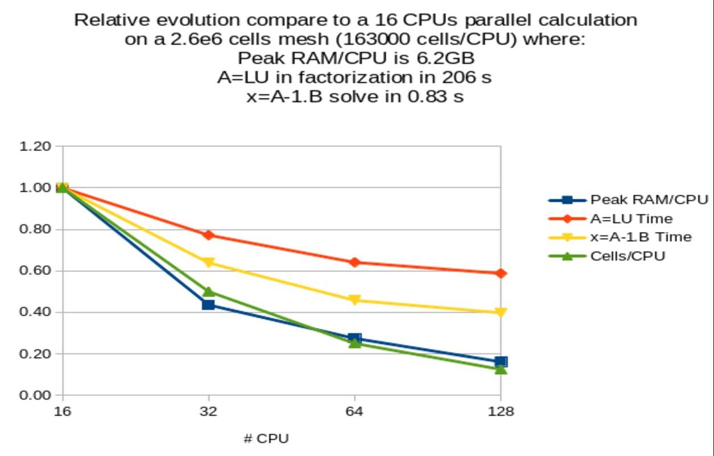

Parameters are:

- **[save_matrice | save_matrix]**  (*type:* flag) not_set

- **[save_matrix_petsc_format]**  (*type:* flag) not_set

- **[reduce_ram]**  (*type:* flag) not_set

- **[cli_quiet]**  (*type:* :ref:`solveur_petsc_option_cli`) not_set

- **[cli]**  (*type:* :ref:`solveur_petsc_option_cli`) not_set

- **[seuil]**  (*type:* float) corresponds to the iterative solver convergence value. The iterative solver converges when the Euclidean residue standard ||Ax-B|| is less than seuil.

- **[quiet]**  (*type:* flag) is a keyword which is used to not displaying any outputs of the solver.

- **[impr]**  (*type:* flag) used to request display of the Euclidean residue standard each time this iterates through the conjugated gradient (display to the standard outlet).

- **[rtol]**  (*type:* float) not_set

- **[atol]**  (*type:* float) not_set

- **[save_matrix_mtx_format]**  (*type:* flag) not_set

----

.. _solveur_petsc_cholesky_mumps_blr:

**solveur_petsc_cholesky_mumps_blr**
------------------------------------

**Synonyms:** cholesky_mumps_blr

BLR for (Block Low-Rank)

Parameters are:

- **[reduce_ram]**  (*type:* flag) not_set

- **[dropping_parameter]**  (*type:* float) not_set

- **[cli]**  (*type:* :ref:`solveur_petsc_option_cli`) not_set

- **[seuil]**  (*type:* float) corresponds to the iterative solver convergence value. The iterative solver converges when the Euclidean residue standard ||Ax-B|| is less than seuil.

- **[quiet]**  (*type:* flag) is a keyword which is used to not displaying any outputs of the solver.

- **[impr]**  (*type:* flag) used to request display of the Euclidean residue standard each time this iterates through the conjugated gradient (display to the standard outlet).

- **[rtol]**  (*type:* float) not_set

- **[atol]**  (*type:* float) not_set

- **[save_matrix_mtx_format]**  (*type:* flag) not_set

----

.. _solveur_petsc_cholesky_out_of_core:

**solveur_petsc_cholesky_out_of_core**
--------------------------------------

**Synonyms:** cholesky_out_of_core

Same as the previous one but with a written LU decomposition of disk (save RAM memory but
add an extra CPU cost during Ax=B solve).

Parameters are:

- **[seuil]**  (*type:* float) corresponds to the iterative solver convergence value. The iterative solver converges when the Euclidean residue standard ||Ax-B|| is less than seuil.

- **[quiet]**  (*type:* flag) is a keyword which is used to not displaying any outputs of the solver.

- **[impr]**  (*type:* flag) used to request display of the Euclidean residue standard each time this iterates through the conjugated gradient (display to the standard outlet).

- **[rtol]**  (*type:* float) not_set

- **[atol]**  (*type:* float) not_set

- **[save_matrix_mtx_format]**  (*type:* flag) not_set

----

.. _solveur_petsc_cholesky_pastix:

**solveur_petsc_cholesky_pastix**
---------------------------------

**Synonyms:** cholesky_pastix

Parallelized Cholesky from PASTIX library.

Parameters are:

- **[seuil]**  (*type:* float) corresponds to the iterative solver convergence value. The iterative solver converges when the Euclidean residue standard ||Ax-B|| is less than seuil.

- **[quiet]**  (*type:* flag) is a keyword which is used to not displaying any outputs of the solver.

- **[impr]**  (*type:* flag) used to request display of the Euclidean residue standard each time this iterates through the conjugated gradient (display to the standard outlet).

- **[rtol]**  (*type:* float) not_set

- **[atol]**  (*type:* float) not_set

- **[save_matrix_mtx_format]**  (*type:* flag) not_set

----

.. _solveur_petsc_cholesky_superlu:

**solveur_petsc_cholesky_superlu**
----------------------------------

**Synonyms:** cholesky_superlu

Parallelized Cholesky from SUPERLU_DIST library (less CPU and RAM, efficient than the
previous one)

Parameters are:

- **[seuil]**  (*type:* float) corresponds to the iterative solver convergence value. The iterative solver converges when the Euclidean residue standard ||Ax-B|| is less than seuil.

- **[quiet]**  (*type:* flag) is a keyword which is used to not displaying any outputs of the solver.

- **[impr]**  (*type:* flag) used to request display of the Euclidean residue standard each time this iterates through the conjugated gradient (display to the standard outlet).

- **[rtol]**  (*type:* float) not_set

- **[atol]**  (*type:* float) not_set

- **[save_matrix_mtx_format]**  (*type:* flag) not_set

----

.. _solveur_petsc_cholesky_umfpack:

**solveur_petsc_cholesky_umfpack**
----------------------------------

**Synonyms:** cholesky_umfpack

Sequential Cholesky from UMFPACK library (seems fast).

Parameters are:

- **[seuil]**  (*type:* float) corresponds to the iterative solver convergence value. The iterative solver converges when the Euclidean residue standard ||Ax-B|| is less than seuil.

- **[quiet]**  (*type:* flag) is a keyword which is used to not displaying any outputs of the solver.

- **[impr]**  (*type:* flag) used to request display of the Euclidean residue standard each time this iterates through the conjugated gradient (display to the standard outlet).

- **[rtol]**  (*type:* float) not_set

- **[atol]**  (*type:* float) not_set

- **[save_matrix_mtx_format]**  (*type:* flag) not_set

----

.. _solveur_petsc_cli:

**solveur_petsc_cli**
---------------------

**Synonyms:** cli

Command Line Interface. Should be used only by advanced users, to access the whole
solver/preconditioners from the PETSC API. To find all the available options, run your
calculation with the -ksp_view -help options:

trust datafile [N] --ksp_view --help

-pc_type Preconditioner:(one of) none jacobi pbjacobi bjacobi sor lu shell mg eisenstat
ilu icc cholesky asm ksp composite redundant nn mat fieldsplit galerkin openmp spai hypre
tfs (PCSetType)

HYPRE preconditioner options:

-pc_hypre_type pilut (choose one of) pilut parasails boomeramg

HYPRE ParaSails Options

-pc_hypre_parasails_nlevels 1: Number of number of levels (None)

-pc_hypre_parasails_thresh 0.1: Threshold (None)

-pc_hypre_parasails_filter 0.1: filter (None)

-pc_hypre_parasails_loadbal 0: Load balance (None)

-pc_hypre_parasails_logging: FALSE Print info to screen (None)

-pc_hypre_parasails_reuse: FALSE Reuse nonzero pattern in preconditioner (None)

-pc_hypre_parasails_sym nonsymmetric (choose one of) nonsymmetric SPD nonsymmetric,SPD

Krylov Method (KSP) Options

-ksp_type Krylov method:(one of) cg cgne stcg gltr richardson chebychev gmres tcqmr bcgs
bcgsl cgs tfqmr cr lsqr preonly qcg bicg fgmres minres symmlq lgmres lcd (KSPSetType)

-ksp_max_it 10000: Maximum number of iterations (KSPSetTolerances)

-ksp_rtol 0: Relative decrease in residual norm (KSPSetTolerances)

-ksp_atol 1e-12: Absolute value of residual norm (KSPSetTolerances)

-ksp_divtol 10000: Residual norm increase cause divergence (KSPSetTolerances)

-ksp_converged_use_initial_residual_norm: Use initial residual residual norm for
computing relative convergence

-ksp_monitor_singular_value stdout: Monitor singular values (KSPMonitorSet)

-ksp_monitor_short stdout: Monitor preconditioned residual norm with fewer digits
(KSPMonitorSet)

-ksp_monitor_draw: Monitor graphically preconditioned residual norm (KSPMonitorSet)

-ksp_monitor_draw_true_residual: Monitor graphically true residual norm (KSPMonitorSet)

Example to use the multigrid method as a solver, not only as a preconditioner:

Solveur_pression Petsc CLI {-ksp_type richardson -pc_type hypre -pc_hypre_type boomeramg
-ksp_atol 1.e-7 }

Parameters are:

- **cli_bloc**  (*type:* :ref:`bloc_lecture`) bloc

----

.. _solveur_petsc_cli_quiet:

**solveur_petsc_cli_quiet**
---------------------------

**Synonyms:** cli_quiet

solver

Parameters are:

- **cli_quiet_bloc**  (*type:* :ref:`bloc_lecture`) bloc

----

.. _solveur_petsc_deriv:

**solveur_petsc_deriv**
-----------------------

Additional information is available in the PETSC documentation:
https://petsc.org/release/manual/

Parameters are:

- **[seuil]**  (*type:* float) corresponds to the iterative solver convergence value. The iterative solver converges when the Euclidean residue standard ||Ax-B|| is less than seuil.

- **[quiet]**  (*type:* flag) is a keyword which is used to not displaying any outputs of the solver.

- **[impr]**  (*type:* flag) used to request display of the Euclidean residue standard each time this iterates through the conjugated gradient (display to the standard outlet).

- **[rtol]**  (*type:* float) not_set

- **[atol]**  (*type:* float) not_set

- **[save_matrix_mtx_format]**  (*type:* flag) not_set

----

.. _solveur_petsc_gcp:

**solveur_petsc_gcp**
---------------------

**Synonyms:** gcp

Preconditioned Conjugate Gradient

Parameters are:

- **[precond]**  (*type:* :ref:`preconditionneur_petsc_deriv`) preconditioner

- **[precond_nul]**  (*type:* flag) No preconditioner used, equivalent to precond null { }

- **[rtol]**  (*type:* float) not_set

- **[reuse_preconditioner_nb_it_max]**  (*type:* int) not_set

- **[cli]**  (*type:* :ref:`solveur_petsc_option_cli`) not_set

- **[reorder_matrix]**  (*type:* int) not_set

- **[read_matrix]**  (*type:* flag) save_matrix|read_matrix are the keywords to save|read into a file the constant matrix A of the linear system Ax=B solved (eg: matrix from the pressure linear system for an incompressible flow). It is useful when you want to minimize the MPI communications on massive parallel calculation. Indeed, in VEF discretization, the overlapping width (generaly 2, specified with the largeur_joint option in the partition keyword partition) can be reduced to 1, once the matrix has been properly assembled and saved. The cost of the MPI communications in TRUST itself (not in PETSc) will be reduced with length messages divided by 2. So the strategy is:  I) Partition your VEF mesh with a largeur_joint value of 2  II) Run your parallel calculation on 0 time step, to build and save the matrix with the save_matrix option. A file named Matrix_NBROWS_rows_NCPUS_cpus.petsc will be saved to the disk (where NBROWS is the number of rows of the matrix and NCPUS the number of CPUs used).  III) Partition your VEF mesh with a largeur_joint value of 1  IV) Run your parallel calculation completly now and substitute the save_matrix option by the read_matrix option. Some interesting gains have been noticed when the cost of linear system solve with PETSc is small compared to all the other operations.

- **[save_matrice | save_matrix]**  (*type:* flag) see read_matrix

- **[petsc_decide]**  (*type:* int) not_set

- **[pcshell]**  (*type:* string) not_set

- **[aij]**  (*type:* flag) not_set

- **[seuil]**  (*type:* float) corresponds to the iterative solver convergence value. The iterative solver converges when the Euclidean residue standard ||Ax-B|| is less than seuil.

- **[quiet]**  (*type:* flag) is a keyword which is used to not displaying any outputs of the solver.

- **[impr]**  (*type:* flag) used to request display of the Euclidean residue standard each time this iterates through the conjugated gradient (display to the standard outlet).

- **[atol]**  (*type:* float) not_set

- **[save_matrix_mtx_format]**  (*type:* flag) not_set

----

.. _solveur_petsc_gmres:

**solveur_petsc_gmres**
-----------------------

**Synonyms:** gmres

Generalized Minimal Residual

Parameters are:

- **[precond]**  (*type:* :ref:`preconditionneur_petsc_deriv`) not_set

- **[reuse_preconditioner_nb_it_max]**  (*type:* int) not_set

- **[save_matrix_petsc_format]**  (*type:* flag) not_set

- **[nb_it_max]**  (*type:* int) In order to specify a given number of iterations instead of a condition on the residue with the keyword seuil. May be useful when defining a PETSc solver for the implicit time scheme where convergence is very fast: 5 or less iterations seems enough.

- **[seuil]**  (*type:* float) corresponds to the iterative solver convergence value. The iterative solver converges when the Euclidean residue standard ||Ax-B|| is less than seuil.

- **[quiet]**  (*type:* flag) is a keyword which is used to not displaying any outputs of the solver.

- **[impr]**  (*type:* flag) used to request display of the Euclidean residue standard each time this iterates through the conjugated gradient (display to the standard outlet).

- **[rtol]**  (*type:* float) not_set

- **[atol]**  (*type:* float) not_set

- **[save_matrix_mtx_format]**  (*type:* flag) not_set

----

.. _solveur_petsc_ibicgstab:

**solveur_petsc_ibicgstab**
---------------------------

**Synonyms:** ibicgstab

Improved version of previous one for massive parallel computations (only a single global
reduction operation instead of the usual 3 or 4).

Parameters are:

- **[precond]**  (*type:* :ref:`preconditionneur_petsc_deriv`) not_set

- **[seuil]**  (*type:* float) corresponds to the iterative solver convergence value. The iterative solver converges when the Euclidean residue standard ||Ax-B|| is less than seuil.

- **[quiet]**  (*type:* flag) is a keyword which is used to not displaying any outputs of the solver.

- **[impr]**  (*type:* flag) used to request display of the Euclidean residue standard each time this iterates through the conjugated gradient (display to the standard outlet).

- **[rtol]**  (*type:* float) not_set

- **[atol]**  (*type:* float) not_set

- **[save_matrix_mtx_format]**  (*type:* flag) not_set

----

.. _solveur_petsc_lu:

**solveur_petsc_lu**
--------------------

**Synonyms:** lu

Several solvers through PETSc API are available.

TIPS:

A) Solver for symmetric linear systems (e.g: Pressure system from Navier-Stokes
equations):

-The CHOLESKY parallel solver is from MUMPS library. It offers better performance than
all others solvers if you have enough RAM for your calculation. A parallel calculation on
a cluster with 4GBytes on each processor, 40000 cells/processor seems the upper limit.
Seems to be very slow to initialize above 500 cpus/cores.

-When running a parallel calculation with a high number of cpus/cores (typically more
than 500) where preconditioner scalabilty is the key for CPU performance, consider
BICGSTAB with BLOCK_JACOBI_ICC(1) as preconditioner or if not converges, GCP with
BLOCK_JACOBI_ICC(1) as preconditioner.

-For other situations, the first choice should be GCP/SSOR. In order to fine tune the
solver choice, each one of the previous list should be considered. Indeed, the CPU speed
of a solver depends of a lot of parameters. You may give a try to the OPTIMAL solver to
help you to find the fastest solver on your study.

B) Solver for non symmetric linear systems (e.g.: Implicit schemes):

The BICGSTAB/DIAG solver seems to offer the best performances.

Parameters are:

- **[seuil]**  (*type:* float) corresponds to the iterative solver convergence value. The iterative solver converges when the Euclidean residue standard ||Ax-B|| is less than seuil.

- **[quiet]**  (*type:* flag) is a keyword which is used to not displaying any outputs of the solver.

- **[impr]**  (*type:* flag) used to request display of the Euclidean residue standard each time this iterates through the conjugated gradient (display to the standard outlet).

- **[rtol]**  (*type:* float) not_set

- **[atol]**  (*type:* float) not_set

- **[save_matrix_mtx_format]**  (*type:* flag) not_set

----

.. _solveur_petsc_pipecg:

**solveur_petsc_pipecg**
------------------------

**Synonyms:** pipecg

Pipelined Conjugate Gradient (possible reduced CPU cost during massive parallel
calculation due to a single non-blocking reduction per iteration, if TRUST is built with a
MPI-3 implementation)... no example in TRUST

Parameters are:

- **[seuil]**  (*type:* float) corresponds to the iterative solver convergence value. The iterative solver converges when the Euclidean residue standard ||Ax-B|| is less than seuil.

- **[quiet]**  (*type:* flag) is a keyword which is used to not displaying any outputs of the solver.

- **[impr]**  (*type:* flag) used to request display of the Euclidean residue standard each time this iterates through the conjugated gradient (display to the standard outlet).

- **[rtol]**  (*type:* float) not_set

- **[atol]**  (*type:* float) not_set

- **[save_matrix_mtx_format]**  (*type:* flag) not_set

----

**Keywords derived from source_base**
=====================================

.. _acceleration:

**acceleration**
----------------

Momentum source term to take in account the forces due to rotation or translation of a non
Galilean referential R\' (centre 0\') into the Galilean referential R (centre 0).

Parameters are:

- **[vitesse]**  (*type:* :ref:`field_base`) Keyword for the velocity of the referential R\' into the R referential (dOO\'/dt term [m.s-1]). The velocity is mandatory when you want to print the total cinetic energy into the non-mobile Galilean referential R (see Ec_dans_repere_fixe keyword).

- **[acceleration]**  (*type:* :ref:`field_base`) Keyword for the acceleration of the referential R\' into the R referential (d2OO\'/dt2 term [m.s-2]). field_base is a time dependant field (eg: Champ_Fonc_t).

- **[omega]**  (*type:* :ref:`field_base`) Keyword for a rotation of the referential R\' into the R referential [rad.s-1]. field_base is a 3D time dependant field specified for example by a Champ_Fonc_t keyword. The time_field field should have 3 components even in 2D (In 2D: 0 0 omega).

- **[domegadt]**  (*type:* :ref:`field_base`) Keyword to define the time derivative of the previous rotation [rad.s-2]. Should be zero if the rotation is constant. The time_field field should have 3 components even in 2D (In 2D: 0 0 domegadt).

- **[centre_rotation]**  (*type:* :ref:`field_base`) Keyword to specify the centre of rotation (expressed in R\' coordinates) of R\' into R (if the domain rotates with the R\' referential, the centre of rotation is 0\'=(0,0,0)). The time_field should have 2 or 3 components according the dimension 2 or 3.

- **[option]**  (*type:* string into ['terme_complet', 'coriolis_seul', 'entrainement_seul']) Keyword to specify the kind of calculation: terme_complet (default option) will calculate both the Coriolis and centrifugal forces, coriolis_seul will calculate the first one only, entrainement_seul will calculate the second one only.

----

.. _boussinesq_concentration:

**boussinesq_concentration**
----------------------------

Class to describe a source term that couples the movement quantity equation and
constituent transport equation with the Boussinesq hypothesis.

Parameters are:

- **c0**  (*type:* list of float) Reference concentration field type. The only field type currently available is Champ_Uniforme (Uniform field).

----

.. _boussinesq_temperature:

**boussinesq_temperature**
--------------------------

Class to describe a source term that couples the movement quantity equation and energy
equation with the Boussinesq hypothesis.

Parameters are:

- **t0**  (*type:* string) Reference temperature value (oC or K). It can also be a time dependant function since the 1.6.6 version.

- **[verif_boussinesq]**  (*type:* int) Keyword to check (1) or not (0) the reference value in comparison with the mean value in the domain. It is set to 1 by default.

----

.. _canal_perio:

**canal_perio**
---------------

Momentum source term to maintain flow rate. The expression of the source term is:

S(t) = (2*(Q(0) - Q(t))-(Q(0)-Q(t-dt))/(coeff*dt*area)

Where:

coeff=damping coefficient

area=area of the periodic boundary

Q(t)=flow rate at time t

dt=time step

Three files will be created during calculation on a datafile named DataFile.data. The
first file contains the flow rate evolution. The second file is useful for resuming a
calculation with the flow rate of the previous stopped calculation, and the last one
contains the pressure gradient evolution:

-DataFile_Channel_Flow_Rate_ProblemName_BoundaryName

-DataFile_Channel_Flow_Rate_repr_ProblemName_BoundaryName

-DataFile_Pressure_Gradient_ProblemName_BoundaryName

Parameters are:

- **[u_etoile]**  (*type:* float) not_set

- **[coeff]**  (*type:* float) Damping coefficient (optional, default value is 10).

- **[h]**  (*type:* float) Half heigth of the channel.

- **bord**  (*type:* string) The name of the (periodic) boundary normal to the flow direction.

- **[debit_impose]**  (*type:* float) Optional option to specify the aimed flow rate Q(0). If not used, Q(0) is computed by the code after the projection phase, where velocity initial conditions are slighlty changed to verify incompressibility.

----

.. _coriolis:

**coriolis**
------------

Keyword for a Coriolis term in hydraulic equation. Warning: Only available in VDF.

Parameters are:

- **omega**  (*type:* list of float) Value of omega.

----

.. _correction_antal:

**correction_antal**
--------------------

Antal correction source term for multiphase problem

----

.. _correction_tomiyama:

**correction_tomiyama**
-----------------------

Tomiyama correction source term for multiphase problem

----

.. _darcy:

**darcy**
---------

Class for calculation in a porous media with source term of Darcy -nu/K*V. This keyword
must be used with a permeability model. For the moment there are two models : permeability
constant or Ergun\'s law. Darcy source term is available for quasi compressible
calculation. A new keyword is aded for porosity (porosite).

Parameters are:

- **bloc**  (*type:* :ref:`bloc_lecture`) Description.

----

.. _dirac:

**dirac**
---------

Class to define a source term corresponding to a volume power release in the energy
equation.

Parameters are:

- **position**  (*type:* list of float) not_set

- **ch**  (*type:* :ref:`field_base`) Thermal power field type. To impose a volume power on a domain sub-area, the Champ_Uniforme_Morceaux (partly_uniform_field) type must be used.  Warning : The volume thermal power is expressed in W.m-3.

----

.. _dispersion_bulles:

**dispersion_bulles**
---------------------

Base class for source terms of bubble dispersion in momentum equation.

Parameters are:

- **[beta]**  (*type:* float) Mutliplying factor for the output of the bubble dispersion source term.

----

.. _dp_impose:

**dp_impose**
-------------

Source term to impose a pressure difference according to the formula : DP = dp + dDP/dQ *
(Q - Q0)

Parameters are:

- **aco**  (*type:* string into ['{']) Opening curly bracket.

- **dp_type**  (*type:* :ref:`type_perte_charge_deriv`) mass flow rate (kg/s).

- **surface**  (*type:* string into ['surface']) not_set

- **bloc_surface**  (*type:* :ref:`bloc_lecture`) Three syntaxes are possible for the surface definition block:  For VDF and VEF: { X|Y|Z = location subzone_name }  Only for VEF: { Surface surface_name }.  For polymac { Surface surface_name Orientation champ_uniforme }.

- **acof**  (*type:* string into ['}']) Closing curly bracket.

----

.. _flux_interfacial:

**flux_interfacial**
--------------------

Source term of mass transfer between phases connected by the saturation object defined in
saturation_xxxx

----

.. _forchheimer:

**forchheimer**
---------------

Class to add the source term of Forchheimer -Cf/sqrt(K)*V2 in the Navier-Stokes equations.
We must precise a permeability model : constant or Ergun\'s law. Moreover we can give the
constant Cf : by default its value is 1. Forchheimer source term is available also for
quasi compressible calculation. A new keyword is aded for porosity (porosite).

Parameters are:

- **bloc**  (*type:* :ref:`bloc_lecture`) Description.

----

.. _frottement_interfacial:

**frottement_interfacial**
--------------------------

Source term which corresponds to the phases friction at the interface

Parameters are:

- **[a_res]**  (*type:* float) void fraction at which the gas velocity is forced to approach liquid velocity (default alpha_evanescence*100)

- **[dv_min]**  (*type:* float) minimal relative velocity used to linearize interfacial friction at low velocities

- **[exp_res]**  (*type:* int) exponent that callibrates intensity of velocity convergence (default 2)

----

.. _perte_charge_anisotrope:

**perte_charge_anisotrope**
---------------------------

Anisotropic pressure loss.

Parameters are:

- **lambda_ | lambda_u | lambda**  (*type:* string) Function for loss coefficient which may be Reynolds dependant (Ex: 64/Re).

- **lambda_ortho**  (*type:* string) Function for loss coefficient in transverse direction which may be Reynolds dependant (Ex: 64/Re).

- **diam_hydr**  (*type:* :ref:`champ_don_base`) Hydraulic diameter value.

- **direction**  (*type:* :ref:`champ_don_base`) Field which indicates the direction of the pressure loss.

- **[sous_zone]**  (*type:* string) Optional sub-area where pressure loss applies.

----

.. _perte_charge_circulaire:

**perte_charge_circulaire**
---------------------------

New pressure loss.

Parameters are:

- **lambda_ | lambda_u | lambda**  (*type:* string) Function f(Re_tot, Re_long, t, x, y, z) for loss coefficient in the longitudinal direction

- **diam_hydr**  (*type:* :ref:`champ_don_base`) Hydraulic diameter value.

- **[sous_zone]**  (*type:* string) Optional sub-area where pressure loss applies.

- **[lambda_ortho]**  (*type:* string) function: Function f(Re_tot, Re_ortho, t, x, y, z) for loss coefficient in transverse direction

- **diam_hydr_ortho**  (*type:* :ref:`champ_don_base`) Transverse hydraulic diameter value.

- **direction**  (*type:* :ref:`champ_don_base`) Field which indicates the direction of the pressure loss.

----

.. _perte_charge_directionnelle:

**perte_charge_directionnelle**
-------------------------------

Directional pressure loss (available in VEF and PolyMAC).

Parameters are:

- **lambda_ | lambda_u | lambda**  (*type:* string) Function for loss coefficient which may be Reynolds dependant (Ex: 64/Re).

- **diam_hydr**  (*type:* :ref:`champ_don_base`) Hydraulic diameter value.

- **direction**  (*type:* :ref:`champ_don_base`) Field which indicates the direction of the pressure loss.

- **[sous_zone]**  (*type:* string) Optional sub-area where pressure loss applies.

----

.. _perte_charge_isotrope:

**perte_charge_isotrope**
-------------------------

Isotropic pressure loss (available in VEF and PolyMAC).

Parameters are:

- **lambda_ | lambda_u | lambda**  (*type:* string) Function for loss coefficient which may be Reynolds dependant (Ex: 64/Re).

- **diam_hydr**  (*type:* :ref:`champ_don_base`) Hydraulic diameter value.

- **[sous_zone]**  (*type:* string) Optional sub-area where pressure loss applies.

----

.. _perte_charge_reguliere:

**perte_charge_reguliere**
--------------------------

Source term modelling the presence of a bundle of tubes in a flow.

Parameters are:

- **spec**  (*type:* :ref:`spec_pdcr_base`) Description of longitudinale or transversale type.

- **zone_name | name_of_zone**  (*type:* string) Name of the sub-area occupied by the tube bundle. A Sous_Zone (Sub-area) type object called zone_name should have been previously created.

----

.. _perte_charge_singuliere:

**perte_charge_singuliere**
---------------------------

Source term that is used to model a pressure loss over a surface area (transition through
a grid, sudden enlargement) defined by the faces of elements located on the intersection
of a subzone named subzone_name and a X,Y, or Z plane located at X,Y or Z = location.

Parameters are:

- **dir**  (*type:* string into ['kx', 'ky', 'kz', 'k']) KX, KY or KZ designate directional pressure loss coefficients for respectively X, Y or Z direction. Or in the case where you chose a target flow rate with regul. Use K for isotropic pressure loss coefficient

- **[coeff]**  (*type:* float) Value (float) of friction coefficient (KX, KY, KZ).

- **[regul]**  (*type:* :ref:`bloc_lecture`) option to have adjustable K with flowrate target  { K0 valeur_initiale_de_k deb debit_cible eps intervalle_variation_mutiplicatif}.

- **surface**  (*type:* :ref:`bloc_lecture`) Three syntaxes are possible for the surface definition block:  For VDF and VEF: { X|Y|Z = location subzone_name }  Only for VEF: { Surface surface_name }.  For polymac { Surface surface_name Orientation champ_uniforme }

----

.. _portance_interfaciale:

**portance_interfaciale**
-------------------------

Base class for source term of lift force in momentum equation.

Parameters are:

- **[beta]**  (*type:* float) Multiplying factor for the bubble lift force source term.

----

.. _puissance_thermique:

**puissance_thermique**
-----------------------

Class to define a source term corresponding to a volume power release in the energy
equation.

Parameters are:

- **ch**  (*type:* :ref:`field_base`) Thermal power field type. To impose a volume power on a domain sub-area, the Champ_Uniforme_Morceaux (partly_uniform_field) type must be used.  Warning : The volume thermal power is expressed in W.m-3 in 3D (in W.m-2 in 2D). It is a power per volume unit (in a porous media, it is a power per fluid volume unit).

----

.. _radioactive_decay:

**radioactive_decay**
---------------------

Radioactive decay source term of the form $-\lambda_i c_i$, where $0 \leq i \leq N$, N is
the number of component of the constituent, $c_i$ and $\lambda_i$ are the concentration
and the decay constant of the i-th component of the constituant.

Parameters are:

- **val**  (*type:* list of float) n is the number of decay constants to read (int), and val1, val2... are the decay constants (double)

----

.. _source_base:

**source_base**
---------------

Basic class of source terms introduced in the equation.

----

.. _source_constituant:

**source_constituant**
----------------------

Keyword to specify source rates, in [[C]/s], for each one of the nb constituents. [C] is
the concentration unit.

Parameters are:

- **ch**  (*type:* :ref:`field_base`) Field type.

----

.. _source_dep_inco_base:

**source_dep_inco_base**
------------------------

**Synonyms:** source_dep_inco_bases

Basic class of source terms depending of inknown.

----

.. _source_generique:

**source_generique**
--------------------

to define a source term depending on some discrete fields of the problem and (or) analytic
expression. It is expressed by the way of a generic field usually used for post-
processing.

Parameters are:

- **champ**  (*type:* :ref:`champ_generique_base`) the source field

----

.. _source_pdf:

**source_pdf**
--------------

Source term for Penalised Direct Forcing (PDF) method.

Parameters are:

- **aire**  (*type:* :ref:`field_base`) volumic field: a boolean for the cell (0 or 1) indicating if the obstacle is in the cell

- **rotation**  (*type:* :ref:`field_base`) volumic field with 9 components representing the change of basis on cells (local to global). Used for rotating cases for example.

- **[transpose_rotation]**  (*type:* flag) whether to transpose the basis change matrix.

- **modele**  (*type:* :ref:`bloc_pdf_model`) model used for the Penalized Direct Forcing

- **[interpolation]**  (*type:* :ref:`interpolation_ibm_base`) interpolation method

----

.. _source_pdf_base:

**source_pdf_base**
-------------------

Basic class of source_PDF terms introduced in the equation.

Parameters are:

- **aire**  (*type:* :ref:`field_base`) volumic field: a boolean for the cell (0 or 1) indicating if the obstacle is in the cell

- **rotation**  (*type:* :ref:`field_base`) volumic field with 9 components representing the change of basis on cells (local to global). Used for rotating cases for example.

- **[transpose_rotation]**  (*type:* flag) whether to transpose the basis change matrix.

- **modele**  (*type:* :ref:`bloc_pdf_model`) model used for the Penalized Direct Forcing

- **[interpolation]**  (*type:* :ref:`interpolation_ibm_base`) interpolation method

----

.. _source_qdm:

**source_qdm**
--------------

Momentum source term in the Navier-Stokes equations.

Parameters are:

- **ch | champ**  (*type:* :ref:`field_base`) Field type.

----

.. _source_qdm_lambdaup:

**source_qdm_lambdaup**
-----------------------

This source term is a dissipative term which is intended to minimise the energy associated
to non-conformscales u\' (responsible for spurious oscillations in some cases). The
equation for these scales can be seen as: du\'/dt= -lambda. u\' + grad P\' where -lambda.
u\' represents the dissipative term, with lambda = a/Delta t For Crank-Nicholson temporal
scheme, recommended value for a is 2.

Remark : This method requires to define a filtering operator.

Parameters are:

- **lambda_ | lambda_u | lambda**  (*type:* float) value of lambda

- **[lambda_min]**  (*type:* float) value of lambda_min

- **[lambda_max]**  (*type:* float) value of lambda_max

- **[ubar_umprim_cible]**  (*type:* float) value of ubar_umprim_cible

----

.. _source_th_tdivu:

**source_th_tdivu**
-------------------

This term source is dedicated for any scalar (called T) transport. Coupled with upwind
(amont) or muscl scheme, this term gives for final expression of convection :
div(U.T)-T.div (U)=U.grad(T) This ensures, in incompressible flow when divergence free is
badly resolved, to stay in a better way in the physical boundaries.

Warning: Only available in VEF discretization.

----

.. _terme_puissance_thermique_echange_impose:

**terme_puissance_thermique_echange_impose**
--------------------------------------------

Source term to impose thermal power according to formula : P = himp * (T - Text). Where T
is the Trust temperature, Text is the outside temperature with which energy is exchanged
via an exchange coefficient himp

Parameters are:

- **himp**  (*type:* :ref:`field_base`) the exchange coefficient

- **text**  (*type:* :ref:`field_base`) the outside temperature

- **[pid_controler_on_targer_power]**  (*type:* :ref:`bloc_lecture`) PID_controler_on_targer_power bloc with parameters target_power (required), Kp, Ki and Kd (at least one of them should be provided)

----

.. _travail_pression:

**travail_pression**
--------------------

Source term which corresponds to the additional pressure work term that appears when
dealing with compressible multiphase fluids

----

.. _vitesse_derive_base:

**vitesse_derive_base**
-----------------------

Source term which corresponds to the drift-velocity between a liquid and a gas phase

----

.. _vitesse_relative_base:

**vitesse_relative_base**
-------------------------

Basic class for drift-velocity source term between a liquid and a gas phase

----

**Keywords derived from sous_zone**
===================================

.. _sous_zone:

**sous_zone**
-------------

**Synonyms:** sous_domaine

It is an object type describing a domain sub-set.

A Sous_Zone (Sub-area) type object must be associated with a Domaine type object. The
Read (Lire) interpretor is used to define the items comprising the sub-area.

Caution: The Domain type object nom_domaine must have been meshed (and triangulated or
tetrahedralised in VEF) prior to carrying out the Associate (Associer) nom_sous_zone
nom_domaine instruction; this instruction must always be preceded by the read instruction.

Parameters are:

- **[restriction]**  (*type:* string) The elements of the sub-area nom_sous_zone must be included into the other sub-area named nom_sous_zone2. This keyword should be used first in the Read keyword.

- **[rectangle]**  (*type:* :ref:`bloc_origine_cotes`) The sub-area will include all the domain elements whose centre of gravity is within the Rectangle (in dimension 2).

- **[segment]**  (*type:* :ref:`bloc_origine_cotes`) not_set

- **[boite | box]**  (*type:* :ref:`bloc_origine_cotes`) The sub-area will include all the domain elements whose centre of gravity is within the Box (in dimension 3).

- **[liste]**  (*type:* list of int) The sub-area will include n domain items, numbers No. 1 No. i No. n.

- **[fichier | filename]**  (*type:* string) The sub-area is read into the file filename.

- **[intervalle]**  (*type:* :ref:`deuxentiers`) The sub-area will include domain items whose number is between n1 and n2 (where n1<=n2).

- **[polynomes]**  (*type:* :ref:`bloc_lecture`) A REPRENDRE

- **[couronne]**  (*type:* :ref:`bloc_couronne`) In 2D case, to create a couronne.

- **[tube]**  (*type:* :ref:`bloc_tube`) In 3D case, to create a tube.

- **[fonction_sous_zone | fonction_sous_domaine]**  (*type:* string) Keyword to build a sub-area with the the elements included into the area defined by fonction>0.

- **[union | union_with]**  (*type:* string) The elements of the sub-area nom_sous_zone3 will be added to the sub-area nom_sous_zone. This keyword should be used last in the Read keyword.

----

**Keywords derived from turbulence_paroi_base**
===============================================

.. _negligeable:

**negligeable**
---------------

Keyword to suppress the calculation of a law of the wall with a turbulence model. The wall
stress is directly calculated with the derivative of the velocity, in the direction
perpendicular to the wall (tau_tan /rho= nu dU/dy).

Warning: This keyword is not available for k-epsilon models. In that case you must choose
a wall law.

----

.. _turbulence_paroi_base:

**turbulence_paroi_base**
-------------------------

Basic class for wall laws for Navier-Stokes equations.

----

**Keywords derived from turbulence_paroi_scalaire_base**
========================================================

.. _negligeable_scalaire:

**negligeable_scalaire**
------------------------

Keyword to suppress the calculation of a law of the wall with a turbulence model for
thermohydraulic problems. The wall stress is directly calculated with the derivative of
the velocity, in the direction perpendicular to the wall.

----

.. _turbulence_paroi_scalaire_base:

**turbulence_paroi_scalaire_base**
----------------------------------

Basic class for wall laws for energy equation.
