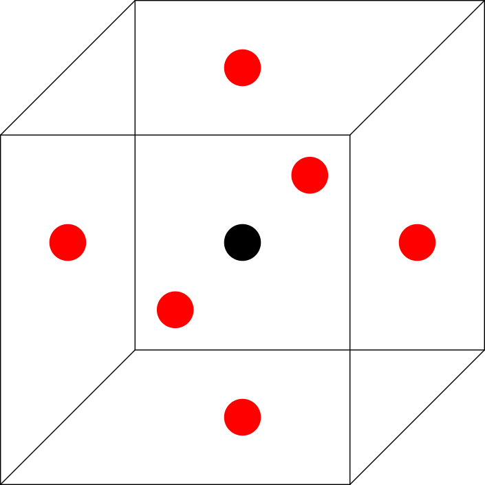
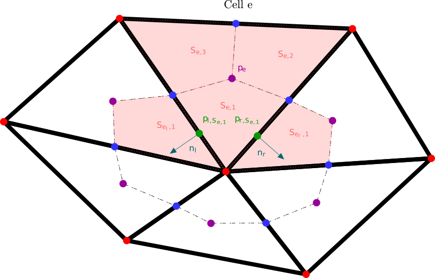

PolyMAC_MPFA
============

Unlike PolyMAC, PolyMAC_MPFA (previously named PolyMAC_P0) does not introduce the vorticity. Moreover, no
complex dual mesh is explicitly needed. The location of the unknowns is
described in :numref:`fig:location_unknowns_p0`.

	
	Location of the unknowns when using PolyMAC_P0

PolyMAC_P0 is based on Multi Point Flux Approximation (MPFA) method.

MPFA methods
------------

Three MPFA methods are used in practice in PolyMAC_P0 for computing gradient:

-  The MPFA-O method presented in :cite:p:`A02`, :cite:p:`AM08`, :cite:p:`D14`

-  The MPFA-O(:math:`\eta`) method presented in :cite:p:`ER98`

-  The MPFA-symm method presented in :cite:p:`LP05a`, :cite:p:`LP05b`, :cite:p:`LePotier2017`

The choice of the method is based on a coercivity condition. Let’s briefly introduce the core ideas of gradient approximation using MPFA methods. First, a dual mesh is constructed. An exemple of dual mesh for a tringular mesh is presented in :numref:`fig:scheme_mpfa`, where the red dot are the primal vertices and black lines the primal faces. The procedure to build the dual mesh in :numref:`fig:scheme_mpfa` is as follows:

-  Link each cell’s (:math:`e`) gravity center (in purple) to the gravity center of each cell’s face :math:`f \subset e` ( in blue). Doing so, the face of the mesh are cut into two sub-faces called :math:`\hat{f}_1` and :math:`\hat{f}_2`. Each cell can then be subdivided into :math:`N_i` quadrilaterals (in orange), called :math:`(S_{e,i})_{i\in\{ 1,\dots, N_i \} }`.

-  Introduce for each sub-face :math:`\hat{f} \subset f`, an auxiliary quantity ( in green). For the MPFA-symmetric method, those auxiliary quantities are set at one third and two third of the face :math:`f`. For the MPFA-O method, they are put at the center of the face, however, the value of the auxiliary unknowns at the center is not continuous. The MPFA-O(:math:`\eta`) method can be seen as an in between, as it try compute the optimum location of the auxiliary unknown.

	
        Construction of a gradient using MPFA method

On :math:`S_1` in :numref:`fig:scheme_mpfa` for example, the gradient of a potential p, :math:`G_{S_{e,i}}([p]_e)` is computed as:

.. math:: G_{S_{e,i}}([p]_e) = \frac{1}{|S_{e,i}|} ( (p_{S_{e,1},1} -p_e)  \vec{n_1} + (p_{S_{e,1},2} -p_e)  \vec{n_2} ),

where :math:`\vec{n_1}` and :math:`\vec{n_2}` are the outward unit normal vectors of the respective sub-faces :math:`\tilde{f}\subset f` where the auxiliary elements :math:`p_{S_{e,1}}` and :math:`p_{S_{e,2}}` are located. Thus, :math:`G^{\text{MPFA}}` writes:

.. math:: 
   :label: P0_Gmpfa
   
   G^{\text{MPFA}}: [p]_e \mapsto G^{\text{MPFA}}([p]_e) \ , \quad \forall e \in E \ , \quad i \in S_e \ : \quad G^{\text{MPFA}} _{|S_{e,i}} =  G_{S_{e,i}}([p]_e).

A core assumption of the MPFA method is to suppose that :math:`G^{\text{MPFA}}([p]_e)` is constant on each :math:`S_{e,i}`. When enforcing the continuity across the sub-faces that are linked by a vertex of the primal mesh, auxiliary variables can be substitute by cells unknowns.

The MPFA methods are impemented in Domaine_PolyMAC_P0::fgrad.

Incompressible Navier Stokes
----------------------------

The incompressible Navier-Stokes equation reads:

.. math::
   :label: P0_Navier_Stokes
   
   \begin{aligned}
   & \partial_{t} \left( u \right) + \nabla \cdot \left( u \otimes u \right) + \nabla p - \mu \Delta u = f \ , \\
   & \nabla \cdot u = 0 \ .\end{aligned}

The mass equation is discretised at the cell using the Green-Ostrogradski theorem:

.. math:: 
   |e|[\nabla \cdot u]_e = |f| \sum _{F_e} [u]_f

The momentum equation is discretised at the face:

-  For the convective term:

   -  Approximate the value of the velocity at the cell:

      .. math:: [u]_e = \frac{1}{|e|} \sum _{f \in F_e} |f| [u]_f x_{e \rightarrow f}.

   -  Discretise the convective terms at the cell centers:

      .. math::

         \begin{aligned}
         {[\nabla \cdot (  u\otimes u)]} _e &= \frac{1}{|e|} \sum _{f \in F_e} |f| [{u} \otimes {u}]_f \\
                                                                                 &\simeq \frac{1}{|e|} \sum _{f \in F_e} |f| [u]_f \left( \beta \left( \gamma [u]_{e_{up}} + \left(1-\gamma \right) [u]_{e_{down}} \right) \right. \\ & \quad \left. + (1-\beta) \left( \frac{[u]_{e_{up}} +[u]_{e_{down}}}{2} \right) \right),\end{aligned}

      with :math:`\beta \in [0,1]` and :math:`\gamma \in \{0,1\}` such that :math:`\gamma =1` if :math:`[u_f]\geq 0` and :math:`0` otherwise.

-  The convective terms:

   -  Interpolate convective terms to the face:

      .. math:: [\nabla \cdot (u\otimes u)]_{f} = \lambda_{e,f} [\nabla \cdot (u \otimes u)]_{e} + \lambda_{e',f} [\nabla \cdot (u \otimes u)]_{e'}

      with the penalty coefficient :math:`\lambda_{e,f} = \frac{ |\vec{x}_{e' \rightarrow f}|}{|\vec{x}_{e' \rightarrow f}| + |\vec{x}_{e \rightarrow f}|}`, with :math:`e'` the neighbouring cell of :math:`e` sharing the face :math:`f`.

-  The gradient of p is computed using an MPFA scheme :eq:`P0_Gmpfa`.

-  The diffusive term is rewritten as :

   .. math:: \Delta u = \nabla \cdot ( \nabla u + \left(\nabla u)^{\intercal} \right) )

-  Then a second order interpolation is used to compute the velocity at the cell, see:

  - First, introducing :math:`n_f` the outward normal of face :math:`f`, one can write the series expansion:

    .. math::

       u_f \cdot n_f \approx \left( u_e + (\nabla u)_e \cdot (x_f - x_e) \right) \cdot n_f

  - Then considering the stencil composed of the faces that share a vertex of :math:`e`, called :math:`\mathcal{F}^v_e`, one can obtain the following system:

    .. math::

       A \cdot U_e = U_{\mathcal{F}^v_e}

    where each line :math:`i` corresponds to the equation for the :math:`i^{th}` face of :math:`\mathcal{F}^v_e`. :math:`A` is a matrix of geometrical quantities, :math:`U_e` stores the components of :math:`u_e` and :math:`(\nabla u)_e`, and :math:`U_{\mathcal{F}^v_e}` the value of :math:`u_f` at the face.

  - However, there is a large number of equations relative to the number of unknowns. To solve this problem, we use a least squares method to find the solution that minimizes:

    .. math::

       \min _{U_e} \sum _{f\in\mathcal{F}^v_e} \frac{1}{\|x_e - x_f\|} (A(f) U_e - u_f)^2

    where :math:`A(f)` corresponds to the line of :math:`A` associated with face :math:`f`. This equation is solved using the ``dgelsy`` method of the **LAPACK** library.

- Afterwards, we compute:

  .. math::

     \left[\nabla \cdot \left( \mu_e \left((\nabla u) + (\nabla u)^{\intercal}\right)\right)\right]_e = \sum_{f} |f| \left(G^{\text{MPFA}} ([u]_e) + \left(G^{\text{MPFA}} ([u]_e)\right)^{\intercal}\right) \cdot \vec{n}_f.

- Eventually, we interpolate the diffusion term at the face in the same fashion as for the convective term.

Some details regarding the discretisation of a two-phase flow model of the Ishii familly :cite:p:`I75` are given in :cite:p:`GG22`.

PolyMAC_P0_P1_NC
================

PolyMACP0P1NC is based on a Hybrid Finite Volmue (HFV) approach, such as the one presented in :cite:p:`EGH07` and :cite:p:`EGH10`. PolyMAC_P0_P1_NC is mathematically close to the first PolyMAC, as HFV and CDO method are equivalent, see :cite:p:`DEGH10`.
