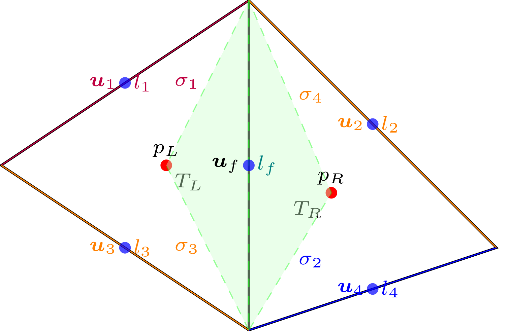
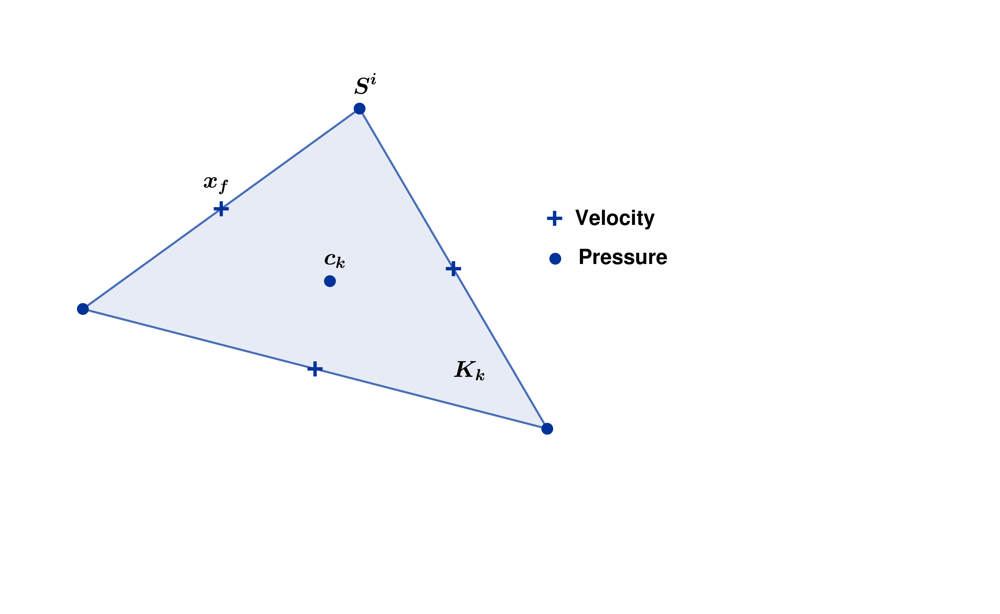
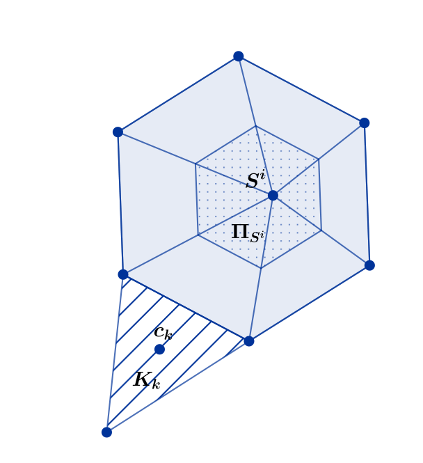

VEF
===

Initially introduced in :cite:p:`LM89`, *Volume Element Finis -VEF-* (Finite Volume Element) method is a variant of the standard finite element
and finite volume methods. The formalism developed in :cite:p:`Emonot1992` was subsequently used for the implementation of
this method in the **TRUST** code.

Finite Volume Element method
----------------------------

Core Idea
^^^^^^^^^

First, let's consider the following instationary problem, with the velocity :math:`\boldsymbol{u}` a flux term
:math:`\boldsymbol{F}` and a source term :math:`\boldsymbol{S}`.

.. math::
   :label: Flux_continu
   
   \partial_t \boldsymbol{u} + \nabla \cdot \boldsymbol{F} = \boldsymbol{S}

We also introduce the control volume :math:`\omega_f` (see Figure :numref:`fig:control_volume_velocity`) in which we want to evaluate the velocity :math:`\boldsymbol{u}`. We integrate on :math:`\omega_f` between the times :math:`t^n` and :math:`t^{n+1}`, regardless the regularity of :math:`\boldsymbol{u}` and :math:`\boldsymbol{F}`. We also introduce a pressure p.

.. math:: \int_{\omega_f} (\boldsymbol{u}^{n+1} - \boldsymbol{u}^n)\mathrm{d}\boldsymbol{V} + \int_{\partial\omega_f} \int_{t^n}^{t^{n+1}} \boldsymbol{F} \cdot \boldsymbol{n} \mathrm{d}\boldsymbol{s} =  \int_{\omega_f}  \int_{t^n}^{t^{n+1}} \boldsymbol{S} \mathrm{d}\boldsymbol{V}

The expression of the flux term depends on the equation : :math:`\boldsymbol{F} = \mu \nabla \boldsymbol{u} - p\boldsymbol{I}` for Stokes equation and :math:`\boldsymbol{F} = \mu \nabla \boldsymbol{u} - p\boldsymbol{I} + \rho \boldsymbol{u} \otimes \boldsymbol{u}` for Navier-Stokes equation.

   Control volume for velocity

Finite Volume Approach
^^^^^^^^^^^^^^^^^^^^^^

Given a tetrahedral mesh :math:`\mathcal{T}_h`, we define the points :math:`\boldsymbol{x}_f` as the barycentric center of the face :math:`f`. The control volume :math:`\omega_f` is the polygon which links the vertex of the face :math:`\boldsymbol{f}` with the barycenters of the two tetrahedron that share the face :math:`\boldsymbol{f}`. Let :math:`\boldsymbol{u}_f^m` be the approximation of the velocity :math:`\boldsymbol{u}` at the node :math:`\boldsymbol{x}_f` and :math:`\Delta t^{n,n+1} \boldsymbol{S}_f^{n, n+1}` the approximation of the right side hand term. Let's discretize the evolution term such that :

.. math:: \int_{\omega_f} \boldsymbol{u}^{m} \mathrm{d}\boldsymbol{V} \approx |\omega_f|  \boldsymbol{u}_f^m \qquad m \in \{n, n+1\}

Let's pose :math:`\boldsymbol{F}^m = \boldsymbol{F}(t^n)` or
:math:`\boldsymbol{F}(t^{n+1})` or of combination of the two depending
on the time scheme choosen. The discretization of the flux term leads to
the following equation.

.. math:: \int_{\partial\omega_f}  \int_{t^n}^{t^{n+1}} \boldsymbol{F} \cdot \boldsymbol{n} \mathrm{d}\boldsymbol{s} \approx \Delta t^{n,n+1} \int_{\partial\omega_f}  \boldsymbol{F}^m \cdot \boldsymbol{n} \mathrm{d}\boldsymbol{s} = \Delta t^{n,n+1} |l_f| (\boldsymbol{F}^m_{T_R} - \boldsymbol{F}^m_{T_L} )\boldsymbol{n}_{T_L,T_R}

The discretization of the equation :eq:`Flux_continu` becomes :

.. math:: |\omega_f|(\boldsymbol{u}_f^{n+1} - \boldsymbol{u}_f) + \Delta t^{n,n+1} |l_f| (\boldsymbol{F}^m_{T_R} - \boldsymbol{F}^m_{T_L} )\boldsymbol{n}_{T_L,T_R} = \Delta t^{n,n+1} \boldsymbol{S}_f^{n, n+1}

At this point, the discretization method looks like a Finite Volume
scheme. The main difference comes from the way the term
:math:`\boldsymbol{F}^m_{T}` is discretized with the help of
Finite Element basis.

Finite Element Basis
^^^^^^^^^^^^^^^^^^^^

Historically, the VEF method was presented with the Crouzeix-Raviart basis.
The full vector of the velocity is evaluated at the center of the faces of each tetrahedron. Within each cell, the pressure is a constant evaluated by its value at the center of the cell. Let's pose
:math:`(\phi_f)_{f\in \mathcal{I}_{\text{f}}}` the velocity basis (i.e. :math:`\phi_f(\boldsymbol{x_{f'}}) = \delta_{f,f'}`) and :math:`(\mathbb{I}_{K_k})_{k\in {\mathcal{I}_K}}` the pressure basis (see :numref:`fig:triangle_vef`). Each discrete velocity vector
:math:`\boldsymbol{u}_h` and pressure :math:`p_h` can be expressed with the following linear combination.

.. math::

   \begin{aligned}
       \boldsymbol{u}_h = \sum_{f\in \mathcal{I}_{\text{f}}}{}\boldsymbol{u}_f \phi_f\\
       p_h = \sum_{k\in {\mathcal{I}_K}}{} p_k \mathbb{I}_{K_k}
   \end{aligned}

   Control volumes for VEF-P0

 

Discretization of the flux term in the Stokes equation
^^^^^^^^^^^^^^^^^^^^^^^^^^^^^^^^^^^^^^^^^^^^^^^^^^^^^^

For the Stokes equation, the flux term is
:math:`\boldsymbol{F} = \mu \nabla \boldsymbol{u} - p\boldsymbol{I}`.
Integrating on :math:`\partial\omega_f`, the discretization can be
written with the finite element basis :

.. math::

   \int_{\partial\omega_f} \boldsymbol{F} = \underset{f' \in \mathcal{I}_{\text{f}}}{\sum} \boldsymbol{u}_{f'} \int_{\partial\omega_{f}} \boldsymbol{\nabla} \phi_{f'} \cdot \boldsymbol{n} d\boldsymbol{s}
       + \underset{k \in \mathcal{I}_K}{\sum} p_k \int_{\partial\omega_f \cap K_k}  \boldsymbol{n} d\boldsymbol{s}

Note that the finite element basis :math:`(\phi_f)_{f\in \mathcal{I}_f}` can be express with the help of barycentric coordinate (see :cite:p:`CR73`) and its gradient is constant per tetrahedron: :math:`(\nabla\phi_f)_T = \frac{1}{|T|}\int_{\partial T} \boldsymbol{n}d\boldsymbol{s}` (see :cite:p:`Emonot1992`, p27).

Thus, the discrete gradient of the velocity writes:

.. math::

   \begin{aligned}
   \int_{\partial\omega_f} \boldsymbol{\nabla} \phi_{f'} \cdot {\boldsymbol{n}}d\boldsymbol{s}
   &= \sum_{T \in \mathcal{T}_h} (\nabla \phi_{f'})_T \cdot \int_{\omega_f \cap T } \boldsymbol{n}d\boldsymbol{s}\\
   &= - \sum_{T \in \mathcal{T}_h} \frac{1}{|T|} S_T^{f'} \cdot S_T^f,
   \end{aligned}

with :

.. math::

   \int_{\omega_f\cap T} \boldsymbol{n}d\boldsymbol{s} = - \int_{\partial T} \boldsymbol{n}d\boldsymbol{s} = S_T^f

and the pressure part :

.. math::

   \underset{k \in \mathcal{I}_K}{\sum} p_k \int_{\partial\omega_f \cap K_k}  \boldsymbol{n} d\boldsymbol{s} =  |l_f|(p_{T_R} - p_{T_L}) \boldsymbol{n}_{T_L, T_R}

Variational Formulation of the Stokes problem
^^^^^^^^^^^^^^^^^^^^^^^^^^^^^^^^^^^^^^^^^^^^^

Let us introduce :math:`\mathbb{X}_h` the finite element space for discrete velocities :math:`\boldsymbol{u}_f` and :math:`\mathring{\mathbb{N}}_h` for the discrete pressure.
Then, we obtain the following *VEF* variational formulation by multiplying the mass conservation by a *test* pressure function
:math:`q_h = \underset{k \in \mathcal{I}_K}{\sum} q_k \mathbb{I}_{K_k}` and the momentum conservation by a *test* velocity function
:math:`\boldsymbol{v}_h = \underset{f \in \mathcal{I}_{\text{f}}}{\sum} \boldsymbol{v}_f \phi_f`.

Find
:math:`(\boldsymbol{u}_h, p_h) \in \mathbb{X}_h \times \mathring{\mathbb{N}}_h`
such that:

.. math::
   :label: variational_form

       \left\{
       \begin{aligned}
       \partial_t m_h^V(\boldsymbol{u}_h,\boldsymbol{v}_h) + a_h^V(\boldsymbol{u}_h, \boldsymbol{v}_h) + b_h^V(\boldsymbol{v}_h, p_h) &= L_h^V(\boldsymbol{v}_h) \qquad & \forall \boldsymbol{v}_h \in \mathbb{X}_h, \\
       c_h^V(\boldsymbol{u}_h, q_h) &= 0 \qquad & \forall q_h \in \mathring{\mathbb{N}}_h.
       \end{aligned}
       \right.

with:

.. math::

   m_h^V :=
       \left\{
       \begin{aligned}
       \mathbb{X}_h \times \mathbb{X}_h &\to \mathbb{R}, \\
       (\boldsymbol{u}_h, \boldsymbol{v}_h) &\mapsto   \underset{f,f' \in \mathcal{I}_{\text{f}}}{\sum} \boldsymbol{u}_{f'} \cdot \boldsymbol{v}_{f}
       |\omega_f|\delta_f(\boldsymbol{x}_{f'})
       \end{aligned}
   \right.

.. math::

   a_h^V :=
   \left\{
       \begin{aligned}
       \mathbb{X}_h \times \mathbb{X}_h &\to \mathbb{R}, \\
       (\boldsymbol{u}_h, \boldsymbol{v}_h) &\mapsto    \underset{f,f' \in \mathcal{I}_{\text{f}}}{\sum} \boldsymbol{u}_{f'} \boldsymbol{v}_{f}  \int_{\partial\omega_{f}} \boldsymbol{\nabla} \phi_{f'} \cdot \boldsymbol{n} d\boldsymbol{s}.
       \end{aligned}
   \right.

.. math::

   b_h^V :=
   \left\{
       \begin{aligned}
       \mathbb{X}_h \times \mathring{\mathbb{N}}_h &\to \mathbb{R}, \\
       (\boldsymbol{v}_h, p_h) &\mapsto    \underset{f \in \mathcal{I}_{\text{f}}}{\sum} \underset{k \in \mathcal{I}_K}{\sum} \boldsymbol{v}_{f} p_k \int_{\partial\omega_f \cap K_k} \boldsymbol{n} d\boldsymbol{s}.
       \end{aligned}
   \right.

.. math::

   c_h^V :=
   \left\{
       \begin{aligned}
       \mathbb{X}_h \times \mathring{\mathbb{N}}_h &\to \mathbb{R}, \\
       (\boldsymbol{u}_h, q_h) &\mapsto    \underset{k \in \mathcal{I}_K}{\sum} \underset{f \in \mathcal{I}_{\text{f}}}{\sum} \boldsymbol{u}_f q_k \int_{\partial K_k} \phi_f \cdot \boldsymbol{n} d \boldsymbol{s}.
       \end{aligned}
   \right.

.. math::

   L_h^V :=
   \left\{
       \begin{aligned}
       \mathbb{X}_h &\to \mathbb{R}, \\
       \boldsymbol{v}_h &\mapsto     \underset{f \in \mathcal{I}_{\text{f}}}{\sum} \boldsymbol{v}_{f} \int_{\omega_f} \boldsymbol{f} d\boldsymbol{V}.
       \end{aligned}
   \right.

This formulation looks like finite element variational formulation.

Mathematical properties
-----------------------

according to :cite:p:`Heib2003`, there are two methods for analyzing the scheme based on the formulation :eq:`variational_form`:

-  The first involves directly analyzing the scheme. It enables to prove the uniform continuity of the bilinear forms, the ellipticity of :math:`a_h^V`, and establishing the inf-sup conditions.

-  The second involves demonstrating the equivalence of assembly
   matrices derived from FEM and VEF for the same given functional
   spaces. Thus, numerical scheme can be analyze with the FEM formalism which is well-known for Navier-Stokes equation with Crouzeix-Raviart elements (see :cite:p:`CR73`). 
   

Using these equivalence properties, the Finite Volume Element scheme satisfies the FEM properties:

- **Inf-sup condition**: Ensures the stability of the numerical scheme.
- **Continuity at edge midpoints**: Implies weak continuity of velocity and enforces local mass conservation, leading to a divergence-free condition in each cell.
- **Well-posedness of the discrete problem**: Guarantees the existence and uniqueness of the discrete solution.
- **Convergence rate for pressure**: The pressure approximation converges with order 1 in the :math:`L^2` norm.
- **Convergence rate for velocity**: The velocity approximation converges with order 2 in the :math:`\boldsymbol{L^2}` norm, provided that :math:`\Omega` is convex.

A summary of the Crouzeix-Raviart FEM properties is presented in :cite:p:`B14`. However parasite currents for low velocities can appear when using the VEF approach, see :cite:p:`Fortin2006`.

New Finite element basis
------------------------

In order to reduce parasite currents (usefull for low viscosities), a pressure enriched basis was studied in :cite:p:`Heib2003` and :cite:p:`Fortin2006` and implemented in **TRUST** code under the name VEF - :math:`\mathbb{P}^{nc}/\mathbb{P}^0+\mathbb{P}^1`.
The idea is to add pressure unknows :math:`\mathbb{P}^1` at the vertices of each cell. 
This add a new control volume for the mass conservation. :numref:`fig:triangle_vef` represents the two control volumes for the two pressure unknows:

-  :math:`K_k` for the constant part of the pressure which is :math:`\mathbb{P}^0` 
-  :math:`\Pi_{S^i}` for the :math:`\mathbb{P}^1` part associated with the unknown located at the center of vertex :math:`S^i`.

   Control volume for pressure P0 and P1

The stability of this new finite element basis is proved in :cite:p:`JCS23` and the inf-sup condtion in :cite:p:`Fortin2006`. This scheme is the most used VEF discretization in **TRUST**. 

  .. and the main notions of equivalence between finite element formulation and finite volume element formulation are presented in :cite:p:`PJ24` - .

  .. but some studies have been done in Pnc/P0 due to implementation and mathematical analysis facilities.  
  
  
References
----------

.. bibliography::
   :style: alpha
   :filter: docname == env.docname
  
