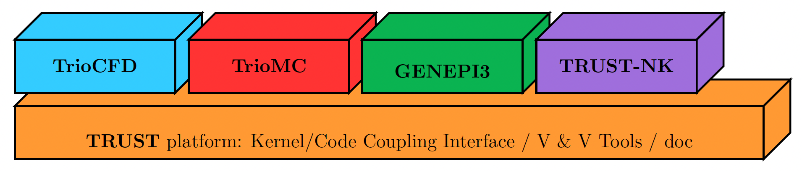

Introduction 
============

**TRUST** is a High Performance Computing (HPC) thermal-hydraulic engine for Computational Fluid Dynamics (CFD) developed at the Departement of System and Structure Modelisation (DM2S) of the French Atomic Energy Commission (CEA).

The acronym **TRUST** stands for **TR**\ io\_\ **U** **S**\ oftware for **T**\ hermohydraulics. This software was originally designed for conduction, incompressible single-phase, and Low Mach Number (LMN) flows with a robust Weakly-Compressible (WC) multi-species solver. However, a huge effort has been conducted recently, and now TRUST is able to simulate real compressible multi-phase flows. 

TRUST is also being progressively ported to support GPU acceleration (NVidia/AMD), using the `Kokkos <https://kokkos.org/kokkos-core-wiki/>`_ library.

The software is OpenSource with a `BSD license <https://github.com/cea-trust-platform/trust-code/blob/master/License.txt>`__, available on GitHub via `this link <https://github.com/cea-trust-platform/trust-code>`__.

You can easily create new project based on **TRUST** plateform. Theses projects are named **BALTIK** projects (**B**\ uild an **A**\ pplication **L**\ inked to **T**\ r\ **I**\ o_U **K**\ ernel).

.. https://github.com/cea-trust-platform/trust-code/blob/master/License.txt

.. https://github.com/cea-trust-platform/trust-code

A bit of history: the Modular Software Named Trio_U
---------------------------------------------------

**TRUST** was born from the cutting in two pieces of **Trio_U** software. **Trio_U** was a software brick based on the **Kernel** brick (which contains the equations, space discretizations, numerical schemes, parallelism...) and used by other CEA applications (see Figure 1).

.. figure:: images/tikz1.png
   :alt: image description
   :width: 600px
   :align: center
   :figclass: small-caption

   Figure 1: Trio_U brick software

.. raw:: html

   

In 2015, **Trio_U** was divided in two parts: **TRUST** and **TrioCFD**.

-  **TRUST** is a new platform, its name means: **TR**\ io\_\ **U** **S**\ oftware for **T**\ hermohydraulics.

-  **TrioCFD** is an open source BALTIK project based on **TRUST**.

Here are some other selected BALTIKS based on the TRUST platform (see Figure 2).

   Figure 2: Selected BALTIKS based on the TRUST platform.

Short History
-------------

**TRUST** is developed at the Laboratory of High Performance Computing and Numerical Analysis (LCAN) of the Software Engineering and Simulation Service (SGLS) in the Department of System and Structure Modeling (DM2S). 

The project starts in 1994 and improved versions were built ever since:

- **1994 :** Start of the project Trio_U

- **1997 :** v1.0 - Finite Difference Volume (VDF) method only

- **1998 :** v1.1 - Finite Element Volume (VEF) method only

- **2000 :** v1.2 - Parallel MPI version

- **2001 :** v1.3 - Radiation model (TrioCFD now)

- **2002 :** v1.4 - LES turbulence models (TrioCFD now)

- **2006 :** v1.5 - VDF/VEF Front Tracking method (TrioCFD now)
 
- **2009 :** v1.6 - Data structure revamped

- **2015 :** v1.7 - Separation TRUST & TrioCFD + switch to open source

- **2019 :** v1.8 - New polyheadral discretization (PolyMAC) + Multiphase problem + Weakly Compressible model

- **2022 :** v1.9.0 - Modern C++ code (templates, CRTP, ...) + remove MACROS + support GPU (NVidia/AMD) 

- **2025 :** v1.9.6 - Unified version to handle 32-64b integers + VEF discretisation supported on GPU
