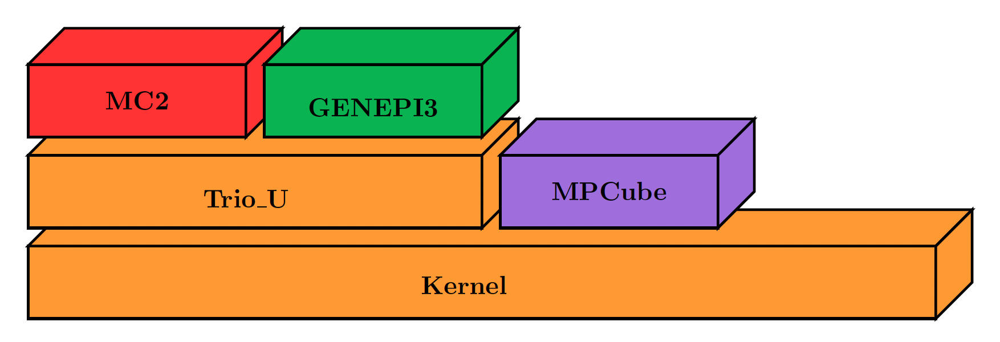

Introduction
============

**TRUST** is a High Performance Computing (HPC) thermal-hydraulic engine for Computational Fluid Dynamics (CFD) developed at the Departement of System and Structure Modelisation (DM2S) of the French Atomic Energy Commission (CEA).

The acronym **TRUST** stands for **TR**\ io\_\ **U** **S**\ oftware for **T**\ hermohydraulics. This software was originally designed for conduction, incompressible single-phase, and Low Mach Number (LMN) flows with a robust Weakly-Compressible (WC) multi-species solver. However, a huge effort has been conducted recently, and now TRUST is able to simulate real compressible multi-phase flows. 

TRUST is also being progressively ported to support GPU acceleration (NVidia/AMD), using the `Kokkos <https://kokkos.org/kokkos-core-wiki/>`_ library.

The software is OpenSource with a `BSD license <https://github.com/cea-trust-platform/trust-code/blob/master/License.txt>`__, available on GitHub via `this link <https://github.com/cea-trust-platform/trust-code>`__.

You can easily create new project based on **TRUST** plateform. Theses projects are named **BALTIK** projects (**B**\ uild an **A**\ pplication **L**\ inked to **T**\ r\ **I**\ o_U **K**\ ernel).

.. https://github.com/cea-trust-platform/trust-code/blob/master/License.txt

.. https://github.com/cea-trust-platform/trust-code

Before TRUST: a Modular Software Named Trio_U
---------------------------------------------

**TRUST** was born from the cutting in two pieces of **Trio_U** software. **Trio_U** was a software brick based on the **Kernel** brick (which contains the equations, space discretizations, numerical schemes, parallelism...) and used by other CEA applications (see Figure 1).

   Figure 1: Trio_U brick software

.. raw:: html

   

In 2015, **Trio_U** was divided in two parts: **TRUST** and **TrioCFD**.

-  **TRUST** is a new platform, its name means: **TR**\ io\_\ **U** **S**\ oftware for **T**\ hermohydraulics.

-  **TrioCFD** is an open source BALTIK project based on **TRUST**.

Here are some other selected BALTIKS based on the TRUST platform (see Figure 2).

.. figure:: images/tikz2.png
   :alt: image description
   :width: 700px
   :align: center
   :figclass: small-caption

   Figure 2: Selected BALTIKS based on the TRUST platform.

Short History
-------------

**TRUST** is developed at the Laboratory of High Performance Computing and Numerical Analysis (LCAN) of the Software Engineering and Simulation Service (SGLS) in the Department of System and Structure Modeling (DM2S). 

The project starts in 1994 and improved versions were built ever since:

- **1994 :** Start of the project Trio_U

- **1997 :** v1.0 - Finite Difference Volume (VDF) method only

- **1998 :** v1.1 - Finite Element Volume (VEF) method only

- **2000 :** v1.2 - Parallel MPI version

- **2001 :** v1.3 - Radiation model (TrioCFD now)

- **2002 :** v1.4 - LES turbulence models (TrioCFD now)

- **2006 :** v1.5 - VDF/VEF Front Tracking method (TrioCFD now)
 
- **2009 :** v1.6 - Data structure revamped

- **2015 :** v1.7 - Separation TRUST & TrioCFD + switch to open source

- **2019 :** v1.8 - New polyheadral discretization (PolyMAC) + Multiphase problem + Weakly Compressible model

- **2022 :** v1.9.0 - Modern C++ code (templates, CRTP, ...) + remove MACROS + support GPU (NVidia/AMD) 

- **2025 :** v1.9.6 - Unified version to handle 32-64b integers + VEF discretisation supported on GPU

Running a test case with TRUST
------------------------------

To build a **TRUST** test case and run a simulation, you need to use a `.data` file. Several test cases are available in **TRUST**. 
Most of those pre-existing cases are located in the `Validation/Rapports_automatiques/Verification` folder of your **TRUST** directory. 
Got check-out the :doc:`data` section for better understanding the `.data` files syntax and structure.

To use **TRUST**, your shell must be "bash". So ensure you are in the right shell:

.. code-block:: bash
   
   echo $0
   /bin/bash

To run your data file, you must initialize the TRUST environment using
the following command:

.. code-block:: bash

   source $my_path_to_TRUST_installation/env_TRUST.sh
   TRUST vX.Y.Z support : trust@cea.fr
   Loading personal configuration /$path_to_my_home_directory/.perso_TRUST.env

Sequential Calculation
^^^^^^^^^^^^^^^^^^^^^^

You can run your sequential calculation:

.. code-block:: bash

   cd $my_test_directory
   trust [-evol] my_data_file

where "trust" command call the "trust" script. The -evol option is optional, it will create a light graphic interface for managing your test case. 

You can have the list of its options with:

.. code-block:: bash

   trust -help

Here is a panel of available options:

.. code-block:: console

   Usage: trust [option] datafile [nb_cpus] [1>file.out] [2>file.err]
   Where option may be:
   -help|-h                      : List options.
   -baltik [baltik_name]         : Instanciate an empty Baltik project.
   -index                        : Access to the TRUST ressource index.
   -doc                          : Access to the TRUST manual (Generic Guide).
   -html                         : Access to the doxygen documentation.
   -config nedit|vim|emacs|gedit : Configure nedit or vim or emacs or gedit with TRUST keywords.
   -edit                         : Edit datafile.
   -trustify                     : Check the datafile's keywords with trustify.
   -xcheck                       : Check the datafile's keywords with xdata.
   -xdata                        : Check and run the datafile's keywords with xdata.
   -partition                    : Partition the mesh to prepare a parallel calculation (Creation of the .Zones files).
   -mesh                         : Visualize the mesh(es) contained in the data file.
   -eclipse-trust                : Generate Eclipse configuration files to import TRUST sources.
   -eclipse-baltik               : Generate Eclipse configuration files to import BALTIK sources (TRUST project should have been configured under Eclipse).
   -probes                       : Monitor the TRUST calculation only.
   -evol                         : Monitor the TRUST calculation (GUI).
   -prm                          : Write a prm file (deprecated).
   -jupyter                      : Create basic jupyter notebook file.
   -clean                        : Clean the current directory from all the generated files by TRUST.
   -search keywords              : Know the list of test cases from the data bases which contain keywords.
   -copy                         : Copy the test case datafile from the TRUST database under the present directory.
   -check all|testcase|list            : Check the non regression of all the test cases or a single test case or a list of tests cases specified in a file.
   -check function|class|class::method : Check the non regression of a list of tests cases covering a function, a class or a class method.
   -ctest all|testcase|list            : ctest the non regression of all the test cases or a single test case or a list of tests cases specified in a file.
   -ctest function|class|class::method : ctest the non regression of a list of tests cases covering a function, a class or a class method.
   -gdb                          : Run under gdb debugger.
   -valgrind                     : Run under valgrind.
   -valgrind_strict              : Run under valgrind with no suppressions.
   -callgrind                    : Run callgrind tool (profiling) from valgrind.
   -massif                       : Run massif tool (heap profile) from valgrind.
   -heaptrack                    : Run heaptrack (heap profile). Better than massif.
   -advisor                      : Run advisor tool (vectorization).
   -vtune                        : Run vtune tool (profiling). Best profiler tool.
   -perf                         : Run perf tool (profiling).
   -trace                        : Run traceanalyzer tool (MPI profiling).
   -create_sub_file              : Create a submission file only.
   -prod                         : Create a submission file and submit the job on the main production class with exclusive resource.
   -bigmem                       : Create a submission file and submit the job on the big memory production class.
   -queue queue                  : Create a submission file with the specified queue and submit the job.
   -c ncpus                      : Use ncpus CPUs allocated per task for a parallel calculation.
   datafile -help_trust          : Print options of TRUST_EXECUTABLE [CASE[.data]] [options].
   -convert_data datafile        : Convert a data file to the new 1.9.1 syntax (milieu, interfaces, read_med and champ_fonc_med).
   -quiet                        : Runs the TRUST case without producing any output on the terminal (stdout and stderr are redirected to /dev/null).

Parallel Calculation
^^^^^^^^^^^^^^^^^^^^

To run a parallel calculation, you must do two runs:

-  the first one, to partition and create your ’n’ sub-domains 

-  the second one, to read your ’n’ sub-domains and run the calculation on ’n’ processors.

Go check the :doc:`para` section for detailed informations regarding this topic. 