# Create a mesh with SALOME

## Introduction to SALOME

The [SALOME](https://www.salome-platform.org/) platform provides engineers/researchers/practitioners with a solution that allows them to benefit from high-level modules targeting: CAD, meshing, coupling of phenomena, visualisation, calculation supervision, uncertainties, etc, thereby aiding the overall pipeline of a numerical simulation. These modules can be directly used by easy-to-use GUI of SALOME or via Python scripts. If desired, users can build domain-specific applications/softwares by assembling these modules to the needs of the numerical simulation.

Developed collaboratively, SALOME is available under the GNU Lesser General Public License (LGPL). The dynamic evolution of SALOME ensures optimal use of computer resources: cluster, HPC, graphics. SALOME is extensively used by EDF, France and CEA, France, to carry out studies necessary for the proper functioning of their facilities and for research work in their field in an efficient manner. 

This tutorial demonstrates how to use SALOME to create 3D meshes adapted for the VEF discretization available in the TRUST code. It will cover several practical examples, from simple geometries to complex coupled problems.

---

## Creating a Cylinder

### Setting Up the Environment


First, make sure the SALOME platform is installed and retrieve its path. We'll call this path ```$PathToSALOME```. If you don't have SALOME installed, you can download it [here](https://www.salome-platform.org/?page_id=2430). 

Then, create a working directory and launch SALOME:

```bash
$ mkdir -p TRUST_TUTORIALS/salome/exo1
$ cd TRUST_TUTORIALS/salome/exo1
$ $PathToSALOME/salome &
```

### Creating the Geometry

- **Create a new study:** File → New

- **Select the Geometry module** from the SALOME drop-down menu (contains all modules)

- **Save your study frequently** in HDF format (SALOME's native format)

- **Create the cylinder:**
  - Go to: New Entity → Primitives → Cylinder
  - Set Radius `R = 100` and Height `H = 300` (default values)
  - Click "Apply and Close"

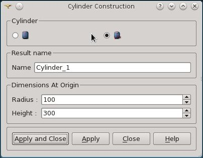

- **Navigate the view:**
  - Use the "Interaction style switch" (Mouse icon) to rotate, zoom, and move the geometry

### Defining Boundary Groups

To define boundaries for TRUST, we need to create groups for the top, bottom, and lateral surfaces:

- **Create groups:** New Entity → Group → Create Group

- **Select Shape Type:** Surface

- **Create the "Inlet" group (top):**
  - Group Name: `Inlet`
  - Click the arrow button in the Main Shape field
  - Select "Cylinder_1" from the Object Browser or visualization window
  - Click on the top surface of the cylinder
  - Click "Add" → "Apply"

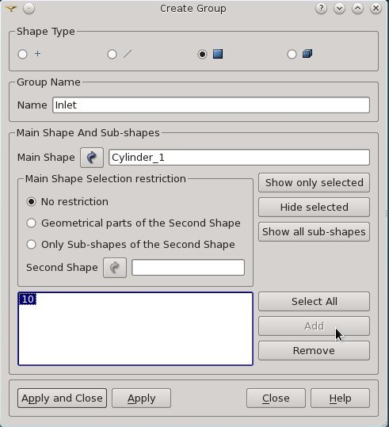

- **Create the "Wall" group (lateral surface):**
  - Repeat the process with Group Name: `Wall`
  - Select the lateral surface

- **Create the "Outlet" group (bottom):**
  - Group Name: `Outlet`
  - Rotate the cylinder to access the bottom surface
  - Select and add it

- **Verify:** Check that all three groups appear in the Object Browser (click the "▷" in front of "Cylinder_1")

### Creating the Mesh

- **Switch to the Mesh module** from the SALOME drop-down menu

- **Display the geometry:**
  - Select "Cylinder_1" in the Object Browser
  - Right Click → 'Show' (or click the eye icon)

- **Create the mesh:**
  - Go to: Mesh → Create Mesh
  - Select "Cylinder_1" as the geometry (if not already selected)
  - Choose "Netgen 1D-2D-3D" algorithm
  - Click "Apply and Close"

- **Compute the mesh:**
  - Select "Mesh_1" in the Object Browser
  - Right Click → Compute (or Mesh → Compute)
  - A table showing the number of triangles, quadrangles, etc., will appear
  - Click "Close"

- **Hide the geometry:**
  - Select "Cylinder_1" in the Object Browser
  - Right Click → Hide (or click the eye icon)

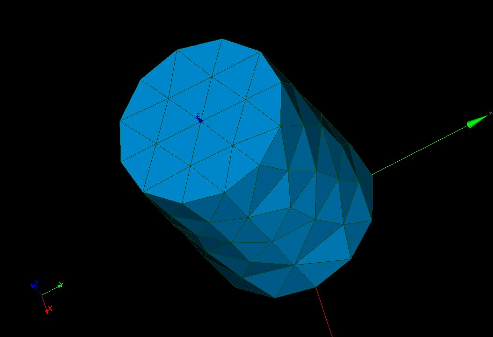

### Exporting the Mesh

- **Verify boundary groups:** Check that the three boundaries have automatically been added to the "Group of Faces" of the **Mesh_1** object in the Object Browser

- **Export to MED format:**
  - Select "Mesh_1"
  - Right Click → Export → MED file (or File → Export → MED file)
  - Save as `Mesh_1.med`

### Reading the Mesh with TRUST

Create a TRUST data file named `dom.data`:

```
dimension 3
domaine dom
Read_MED { domain dom file Mesh_1.med }
Postraiter_domaine { domaine dom fichier mesh format lata }
```

Run TRUST and visualize with VisIt:

```bash
$ trust dom
$ visit -o mesh.lata
```

**Warning:** A common error is forgetting to define boundary groups for the geometry. TRUST will detect this during discretization when building all mesh faces, including boundary faces.

### Refining the Mesh with Viscous Layers

To improve mesh quality near walls, we can use viscous layers:

- **Create a new mesh:** Mesh → Create Mesh
  - Name: `Refined_mesh`
  - Select "Cylinder_1" geometry

- **Select 3D algorithm:** "Netgen 3D" or "MG-Tetra"

- **Add viscous layers:**
  - Click the wheel icon next to "Add. Hypothesis" → "Viscous Layers"
  - Total thickness: `30`
  - Number of layers: `3`
  - Stretch factor: `1.1`
  - Add "Inlet" and "Outlet" groups to "Faces without layers"
  - Click "OK"

- **Add 2D algorithm:** "Netgen 1D-2D" or "MG-CADSurf"

- **Configure 2D parameters:**
  - Click the wheel icon next to "Hypothesis"
  
  **For Netgen 2D parameters:**
  - Change "Fineness" from "Moderate" to "Very Fine"
  
  **For MG-CADSurf parameters:**
  - Set "User size" to `20`

- **Apply and compute:**
  - Click "Apply and Close"
  - Select "Refined_Mesh" in Object Browser
  - Right Click → Compute

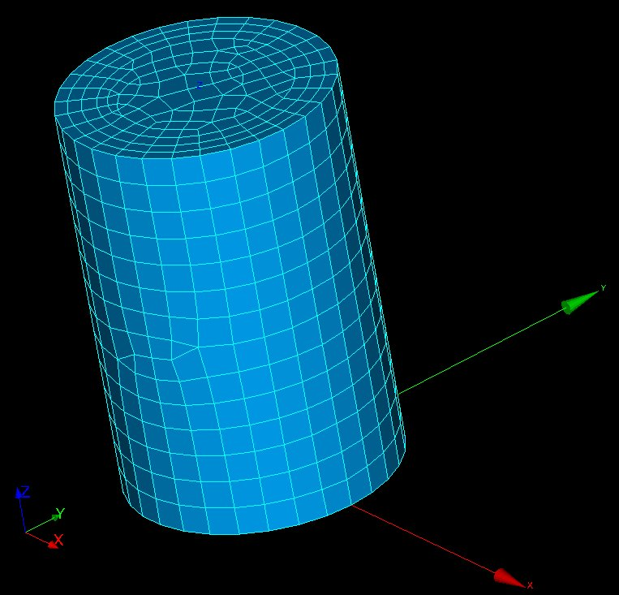

The resulting mesh will contain a mix of tetrahedral, hexahedral, pyramid, and prism elements (for Netgen) or tetrahedral and prism elements (for MG algorithms).

### Converting to Tetrahedral Elements

Since TRUST only accepts tetrahedral elements:

- Select "Refined_Mesh" in the Object Browser
- Go to: Modification → Split Volumes
- Select "Tetrahedron"
- Keep default parameters
- Click "Apply and Close"

### Final Steps

- **Verify boundaries:** Check that the three boundaries are in the "Group of Faces" of **Refined_Mesh**

- **Export the mesh:**
  - Select "Refined_mesh"
  - Right Click → Export → MED file
  - Save as `Refined_Mesh.med`

- **Save your work:**
  - HDF format: File → Save/Save As...
  - Python format: File → Dump Study...

**Note:** Solution files (`mesh.py` for the first mesh and `prism.py` for the refined mesh) are available at: `$TRUST_ROOT/doc/TRUST/exercices/salome`

---

## Creating a Revolution Geometry

This example demonstrates creating a more complex axisymmetric geometry using revolution.

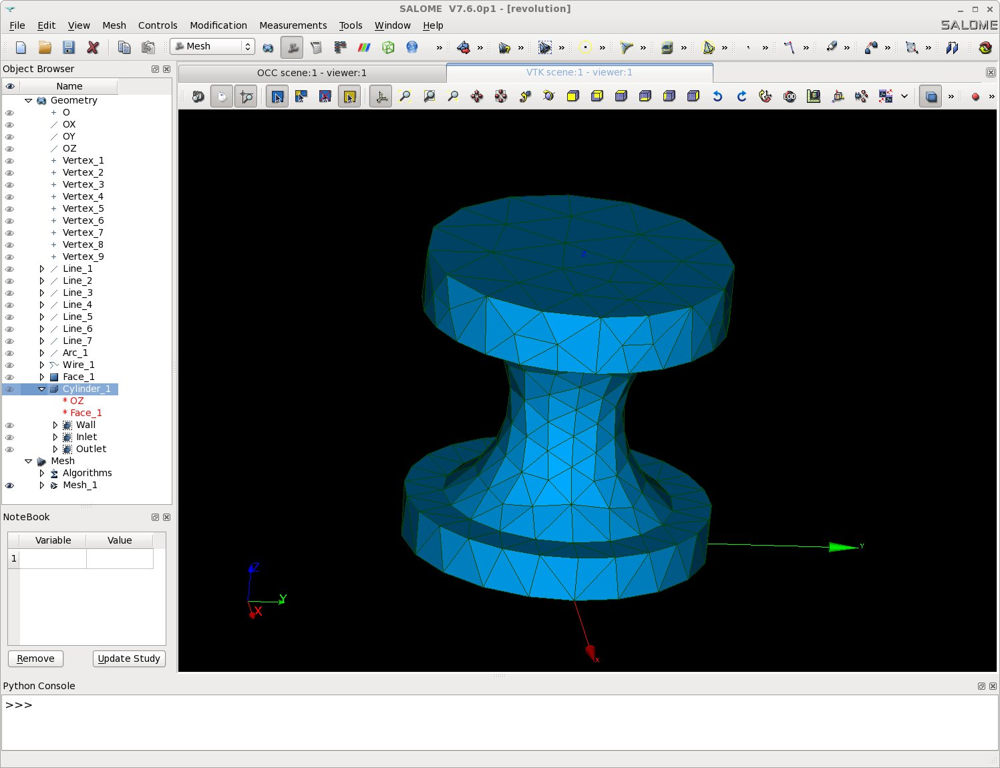

### Setup

```bash
$ mkdir -p TRUST_TUTORIALS/salome/exo2
$ cd TRUST_TUTORIALS/salome/exo2
$ $PathToSALOME/salome &
```

- Create a new study: File → New
- Select the Geometry module

### Creating Points

Go to: New Entity → Basic → Point

Create the following vertices:

| Vertex | X | Y | Z |
|--------|---|---|-----|
| Vertex_1 | 0 | 0 | 0 |
| Vertex_2 | 1 | 0 | 0 |
| Vertex_3 | 1 | 0 | 0.3 |
| Vertex_4 | 0.75 | 0 | 0.3 |
| Vertex_5 | 0.375 | 0 | 1 |
| Vertex_6 | 0.75 | 0 | 1.6 |
| Vertex_7 | 1 | 0 | 1.6 |
| Vertex_8 | 1 | 0 | 2 |
| Vertex_9 | 0 | 0 | 2 |

Click "Apply and Close"

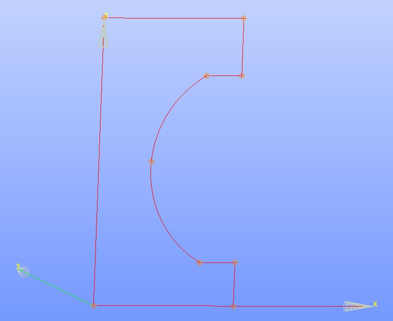

### Creating Edges

- **Create straight lines:** New Entity → Basic → Line
  - Line_1: Vertex_1 to Vertex_2
  - Line_2: Vertex_2 to Vertex_3
  - Line_3: Vertex_3 to Vertex_4
  - Line_4: Vertex_6 to Vertex_7
  - Line_5: Vertex_7 to Vertex_8
  - Line_6: Vertex_8 to Vertex_9
  - Line_7: Vertex_9 to Vertex_1
  - Click "Apply and Close"

- **Create an arc:** New Entity → Basic → Arc
  - Arc_1: Vertex_4 → Vertex_5 → Vertex_6
  - Click "Apply and Close"

### Creating the Revolution Solid

- **Create a wire:** New Entity → Build → Wire
  - Wire_1: Select all lines (Line_1 through Line_7) and Arc_1 (use "Ctrl" to multi-select)
  - Click "Apply and Close"

- **Create a face:** New Entity → Build → Face
  - Face_1: Select Wire_1
  - Click "Apply and Close"

- **Create the revolution:** New Entity → Generation → Revolution
  - Name: `Cylinder_1`
  - Objects: Face_1
  - Axis: Click the arrow button and select "OZ" from Object Browser
  - Angle: `360°`
  - Click "Apply and Close"

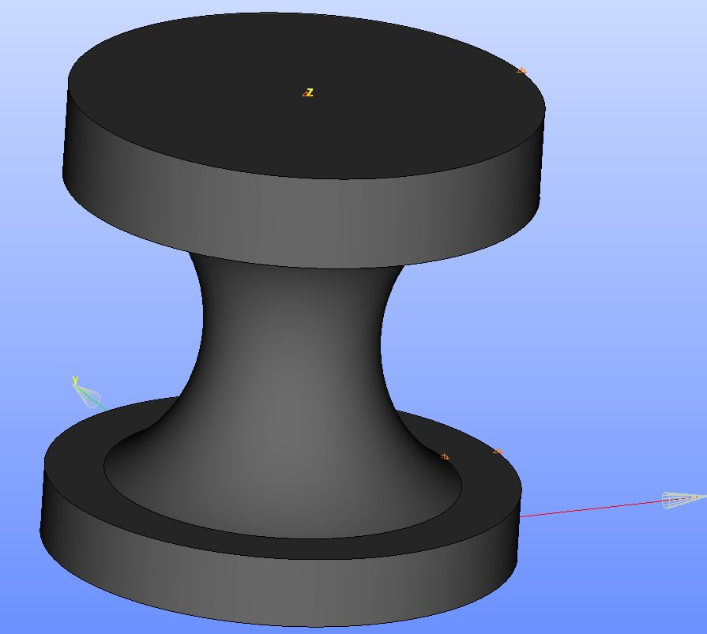

### Creating Boundary Groups and Mesh

- **Create boundary groups:** New Entity → Group → Create Group
  - Follow the same procedure as in the cylinder example

- **Save your study:**
  - HDF format: File → Save/Save As...
  - Python format: File → Dump Study...

- **Create the mesh** following the same procedure as described in the cylinder section

**Note:** The solution file (`revolution.py`) is available at: `$TRUST_ROOT/doc/TRUST/exercices/salome`

---

## Creating a T-Shape Geometry

This example demonstrates creating a T-shaped geometry using boolean operations.

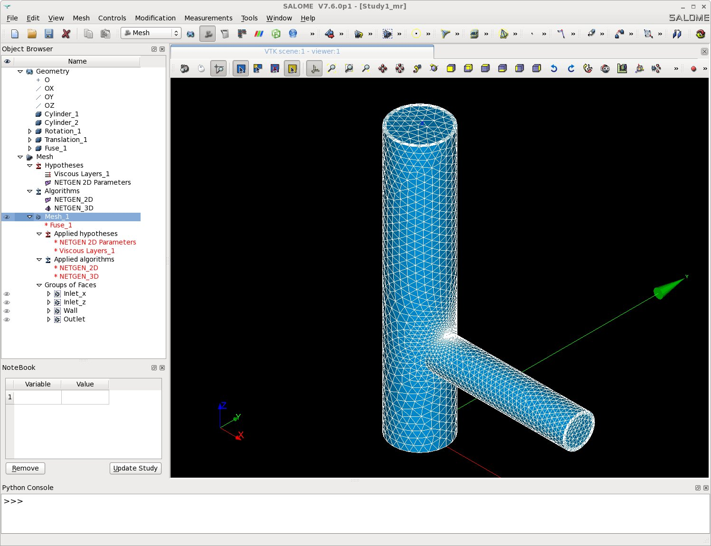

### Setup

```bash
$ mkdir -p TRUST_TUTORIALS/salome/exo3
$ cd TRUST_TUTORIALS/salome/exo3
$ $PathToSALOME/salome &
```

- Create a new study: File → New
- Select the Geometry module
- Save frequently in HDF format

### Creating the Base Cylinders

- **Create two cylinders:** New Entity → Primitives → Cylinder
  - **Cylinder_1:** Radius `0.5`, Height `5` → "Apply"
  - **Cylinder_2:** Radius `0.3`, Height `3` → "Apply and Close"

### Positioning the Second Cylinder

- **Rotate Cylinder_2:** Operations → Transformation → Rotation
  - Name: `Rotation_1`
  - Object: Cylinder_2
  - Axis: OY
  - Angle: `90°`
  - Click "Apply and Close"

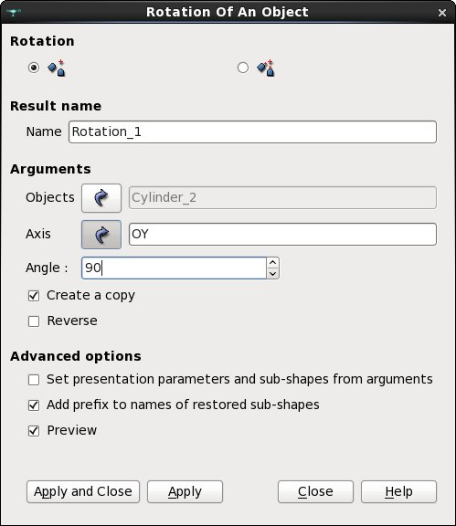

- **Translate the rotated cylinder:** Operations → Transformation → Translation
  - Name: `Translation_1`
  - Object: Rotation_1
  - Dx = 0, Dy = 0, Dz = 1.5
  - Click "Apply and Close"

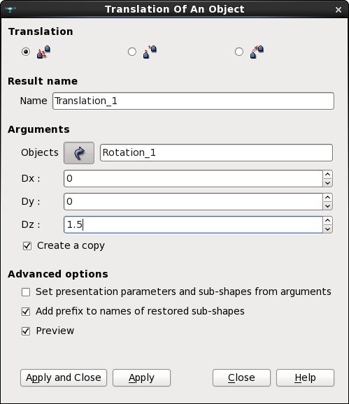

### Fusing the Cylinders

**Combine the cylinders:** Operations → Boolean → Fuse
- Name: `Fuse_1`
- Selected Objects: 2_Objects (use "Ctrl" to select both Cylinder_1 and Translation_1)
- Click "Apply and Close"

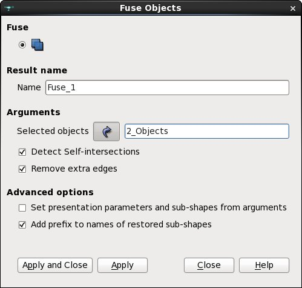

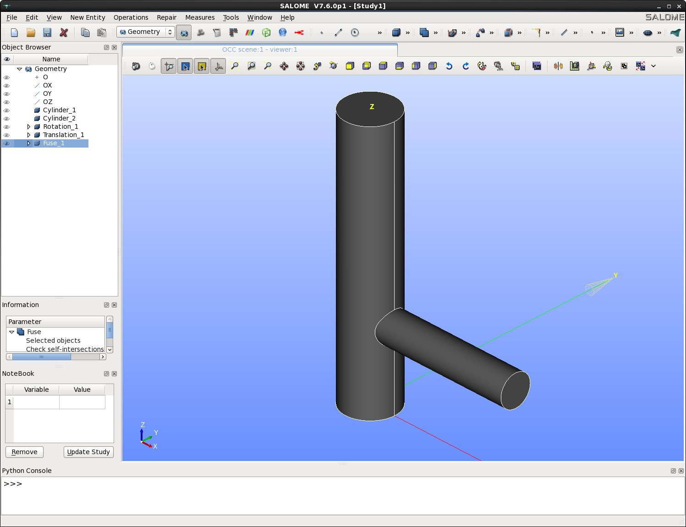

### Creating Boundaries

#### Extracting Individual Faces

For each outlet/inlet face:

- **Extract faces:** New Entity → Explode
  - Main Object: Fuse_1
  - Sub-shape type: Face
  - Select "Select sub-shape"
  - Click on the desired surface in the visualization window
  - Click "Apply"

- **Rename the face:**
  - The face will be created as "Face_1" under Fuse_1
  - Right-click and select "Rename"
  - Rename to: `Outlet`, `Inlet_x`, or `Inlet_z`

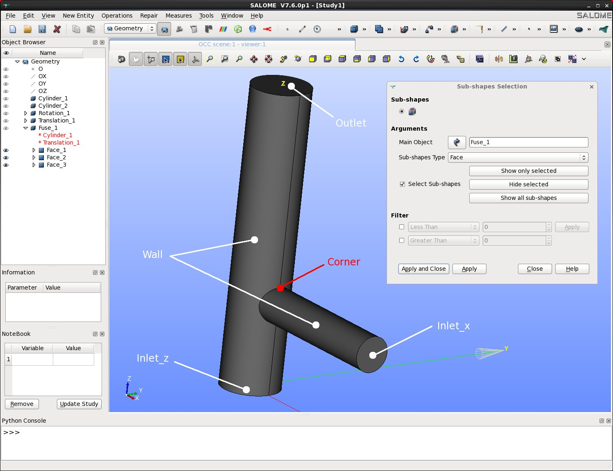

#### Creating the Wall Group

- **Create a surface group:** New Entity → Group → Create Group
  - Shape Type: Surface
  - Name: `Wall`
  - Main Shape: Fuse_1
  - Click on the lateral surface of Cylinder_1 → "Add"
  - Click on the lateral surface of Translation_1 → "Add"
  - Click "Apply and Close"

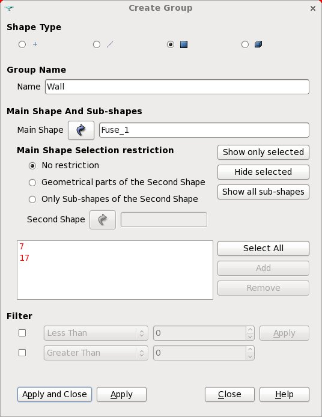

### Creating a Corner Point

This point will be used for local mesh refinement:

- **Extract a vertex:** New Entity → Explode
  - Main Object: Fuse_1
  - Sub-shape type: Vertex
  - Select "Select sub-shape"
  - Click on the chosen corner point
  - Click "Apply and Close"

- **Rename:** Rename "Vertex_1" to `Corner`

### Creating the Mesh

- **Switch to Mesh module** from the drop-down menu

- **Display geometry:**
  - Select "Fuse_1" in Object Browser
  - Right Click → 'Show' (or click the eye icon)

- **Create mesh:** Mesh → Create Mesh
  - Select "Fuse_1" as geometry

- **Configure 3D algorithm:** Choose "Netgen 3D"

- **Add viscous layers:**
  - Click the wheel icon next to "Add. Hypothesis" → "Viscous Layers"
  - Total thickness: `0.05`
  - Number of layers: `3`
  - Stretch factor: `1.1`
  - Extrusion method: Node Offset
  - Add "Wall" group to "Faces with layers (Wall)"
  - Click "OK"

- **Configure 2D algorithm:** Choose "Netgen 1D-2D"

- **Set 2D parameters:**
  - Click the wheel icon next to "Hypothesis" → "Netgen 2D parameters"
  
  **Arguments menu:**
  - Max. Size: `0.6`
  - Min. Size: `0`
  - Fineness: Custom
  - Growth rate: `0.1`
  - Nb. segs per Edge: `2`
  - Nb. segs per Radius: `4`
  - ☑ Limit size by Surface Curvature
  - ☑ Optimize
  - ☐ Allow Quadrangles
  - ☐ Second Order

  **Local Size menu:**
  - Select "Corner" object in Object Browser
  - Click "On Vertex"
  - Set value to `0.01`
  
  **Advanced menu:**
  - ☑ Fuse Coincident Nodes on Edges and Vertices
  
  - Click "OK"

- **Apply and compute:**
  - Click "Apply and Close"
  - Select "Mesh_1"
  - Right Click → Compute

### Converting to Tetrahedral Mesh

- Select "Mesh_1" in Object Browser
- Go to: Modification → Split Volumes
- Select "Tetrahedron"
- Keep default parameters
- Click "Apply and Close"

### Exporting and Saving

- **Verify boundaries:** Check that all four boundaries appear in "Group of Faces" of **Mesh_1**

- **Export mesh:**
  - Select "Mesh_1"
  - Right Click → Export → MED file
  - Save as `Mesh_1.med`

- **Save study:**
  - HDF format: File → Save/Save As...
  - Python format: File → Dump Study...

**Note:** Solution file (`T_shape.py`) is available at: `$TRUST_ROOT/doc/TRUST/exercices/salome`

### Running with TRUST

Copy and run the TRUST data file:

```bash
$ cp $TRUST_ROOT/doc/TRUST/exercices/salome/T_shape.data .
$ trust T_shape
```

Or run in parallel:

```bash
$ trust -partition T_shape
$ trust PAR_T_shape 4
```

Visualize results with VisIt or SALOME by opening:
- Sequential: `T_shape_0000.med`
- Parallel: `PAR_T_shape_0000.med`

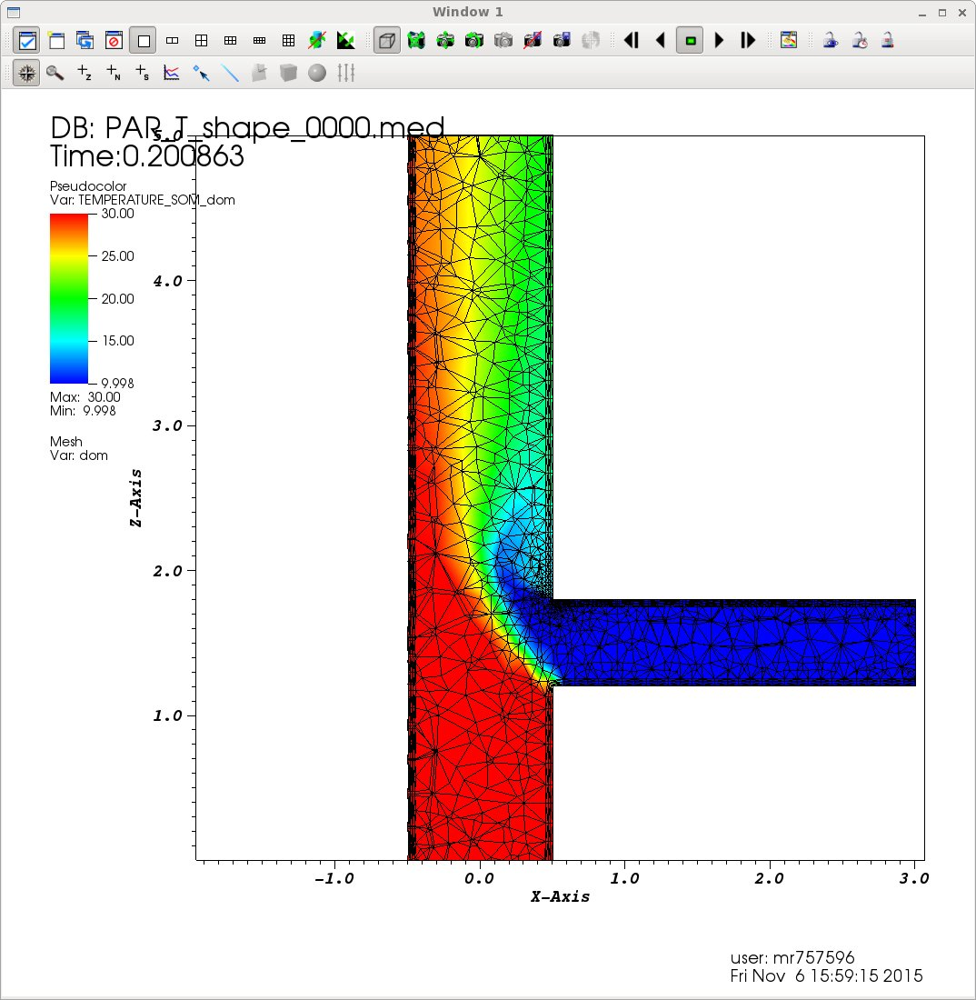

---

## Creating a Mesh for Coupled Problems

This exercise demonstrates creating meshes for coupled multi-domain problems where interface connectivity is critical.

### Problem Description

Consider the cooling of a solid block by fluid flowing through circular cross-section channels. The channel is centered in a square cross-section block. The outer boundaries of the solid are adiabatic.


We need to create two domains:
- **Domain 1:** Solid block
- **Domain 2:** Fluid channel

**Key requirement:** Mesh elements must be connected at the interface between domains for TRUST to read the mesh correctly.

### Setup

```bash
$ mkdir -p TRUST_TUTORIALS/salome/exo4
$ cd TRUST_TUTORIALS/salome/exo4
$ $PathToSALOME/salome &
```

- Create a new study: File → New
- Select the Geometry module
- Save frequently in HDF format

### Creating the Geometry

- **Create the solid block:** New Entity → Primitives → Box
  - Dx = `200`, Dy = `200`, Dz = `400`
  - Click "Apply and Close"

- **Create a vertex for the cylinder base:** New Entity → Basic → Point
  - X = `100`, Y = `100`, Z = `0`
  - Click "Apply and Close"

- **Create the fluid channel:** New Entity → Primitives → Cylinder
  - Base Point: Vertex_1
  - Vector: OZ
  - Radius R = `40`
  - Height H = `400`
  - Click "Apply and Close"

- **Cut the cylinder from the block:** Operations → Boolean → Cut
  - Main Object: Box_1
  - Tool Objects: Cylinder_1
  - Click "Apply and Close"

- **Create a partition:** Operations → Partition
  - Objects: Select both Cylinder_1 and Cut_1
  - Click "Apply and Close"

**Note:** This partition ensures mesh connectivity at the interface.

### Defining Volume Groups

Create groups for each domain:

- **Solid domain:** New Entity → Group → Create Group
  - Shape Type: Volume
  - Name: `Solid`
  - Main Shape: Partition_1
  - Select the hollow box
  - Click "Add" → "Apply"

- **Fluid domain:** Continue in the same dialog
  - Name: `Fluid`
  - Main Shape: Partition_1
  - Select the cylindrical channel
  - Click "Add" → "Apply and Close"

### Defining Boundary Groups

Create surface groups for all boundaries:

- **Fluid inlet:** New Entity → Group → Create Group
  - Shape Type: Surface
  - Name: `Fluid_inlet`
  - Main Shape: Partition_1
  - Select bottom of cylinder → "Add" → "Apply"

- **Fluid outlet:**
  - Name: `Fluid_outlet`
  - Select top circular boundary → "Add" → "Apply"

- **Solid top:**
  - Name: `Solid_top`
  - Select top of box → "Add" → "Apply"

- **Solid bottom:**
  - Name: `Solid_bottom`
  - Select bottom of box → "Add" → "Apply"

- **Solid lateral walls:**
  - Name: `Solid_lateral_walls`
  - Select the four lateral boundaries of the box → "Add" → "Apply"

- **Solid-Fluid interface:**
  - Name: `Solid_Fluid_Interface`
  - Select top of box → "Hide selected"
  - Select a lateral boundary → "Hide selected"
  - The lateral surface of the cylinder should now be visible
  - Select it → "Add" → "Apply and Close"

### Creating the Mesh

- **Switch to Mesh module**

- **Create mesh:** Mesh → Create Mesh
  - Name: `Mesh_1`
  - Geometry: Partition_1
  - 3D algorithm: NETGEN 1D-2D-3D

- **Configure parameters:**
  - Click the wheel icon next to "Hypothesis" → "NETGEN 3D Parameters"
  - In "Arguments": Change fineness from "Moderate" to "Fine"
  - Click "OK" → "Apply and Close"

- **Compute mesh:**
  - Right click on "Mesh_1" → Compute

- **Verify groups:**
  - Check that six boundaries appear in "Group of Faces" of **Mesh_1**
  - Check that two volume groups appear in "Group of Volumes" of **Mesh_1**

### Exporting the Mesh

- **Export to MED format:**
  - Select "Mesh_1"
  - Right Click → Export → MED file
  - Choose MED 3.2 if possible
  - Save as `Mesh_1.med`

- **Dump the study:** File → Dump Study
  - Save as Python script (needed for the next exercise)

### Running the Coupled Problem

Copy and run the TRUST data file:

```bash
$ cp $TRUST_ROOT/doc/TRUST/exercices/salome/Coupled_pb.data .
$ trust Coupled_pb.data
```

Visualize results with VisIt:

```bash
$ visit -o Coupled_pb.lata
```

Draw the temperature profile on both domains and set the color bar min/max to 300 and 400 respectively. You'll observe the solid cooling over time. With increased simulation time, the solid temperature will eventually equal the fluid temperature at steady state.

---

## Editing and Building Meshes with Python Scripts

### Overview

SALOME can save all GUI commands as a Python script. This allows you to:
- Modify geometry and mesh parameters without rebuilding from scratch
- Automate mesh generation
- Version control your meshing workflow

### Setup

```bash
$ mkdir -p TRUST_TUTORIALS/salome/exo5
$ cd TRUST_TUTORIALS/salome/exo5
```

### Copying the Python Script

Copy the Python script from the previous exercise:

```bash
$ cp ../exo4/Mesh_1.py .
$ cp $TRUST_ROOT/doc/TRUST/exercices/salome/Coupled_pb.data .
```

**Note:** If you haven't completed the previous exercise:

```bash
$ path=$TRUST_ROOT/doc/TRUST/exercices/salome
$ cp $path/Coupled_pb.py Mesh_1.py
```

### Editing the Python Script

Open `Mesh_1.py` in a text editor and make the following changes:

- **Add mesh export command** at the end of the script:
   ```python
   Mesh_1.ExportMED("Mesh_1.med", 0)
   ```

- **Modify geometry parameters:**
  - Change box and cylinder height: `400` → `300`
  - Change cylinder radius: `40` → `70`

- **Modify mesh parameters in `NETGEN_3D_Parameters_1`:**
  - MaxSize: `48.9898` → `9.`
  - MinSize: `6.97246` → `2.`

- **Save and close** the file

### Generating the New Mesh

Run the Python script in SALOME's terminal mode:

```bash
$ $PathToSALOME/salome -t Mesh_1.py
```

The file `Mesh_1.med` will be generated in your folder. You'll notice:
- The box is smaller in the z-direction
- The cylinder is thicker
- The mesh is finer

### Running the Calculation

Run TRUST with the new mesh:

```bash
$ trust Coupled_pb
```

### Advantages of the Python Workflow

- **Reproducibility:** Scripts document your exact meshing process
- **Parametric studies:** Easy to modify parameters for sensitivity analysis
- **Automation:** Can be integrated into larger workflows
- **Version control:** Scripts can be tracked with Git or other VCS
- **Batch processing:** Generate multiple meshes with different parameters